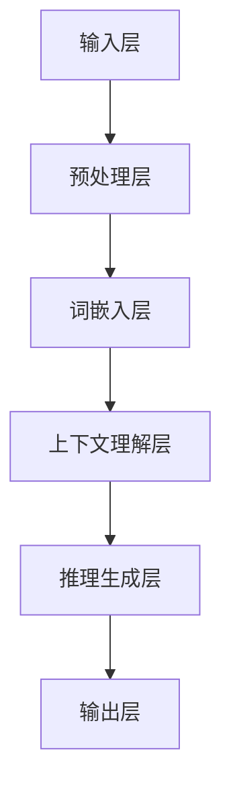
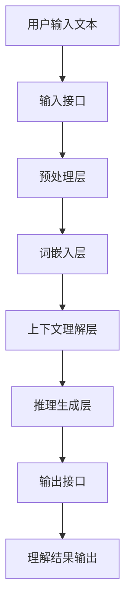

                 

# 思维链在AI自然语言理解中的前沿应用研究

> 关键词：自然语言理解、思维链、深度学习、大模型、人工智能

> 摘要：本文从问题背景、核心概念、算法原理等多个角度，深入探讨了思维链在AI自然语言理解中的前沿应用。通过对思维链技术的原理、特点和应用的分析，本文揭示了思维链在自然语言理解中的重要作用，并展望了其未来的发展趋势。

## 第一部分：背景介绍

### 第1章：问题背景与核心概念

#### 1.1.1 问题背景

随着人工智能技术的不断发展，自然语言理解成为AI领域的一个重要研究方向。自然语言理解旨在让计算机具备对人类语言的理解能力，从而实现人机交互的智能化。然而，传统的自然语言处理方法在处理复杂语境、多义词、歧义句等方面存在很大局限性。近年来，基于深度学习的自然语言处理技术，特别是大模型（如GPT、BERT等）的出现，为AI自然语言理解带来了新的突破。

#### 1.1.2 问题描述

AI自然语言理解的核心问题是如何使计算机有效地理解并处理自然语言。这包括语音识别、文本分类、情感分析、问答系统等多个方面。然而，目前的AI自然语言理解技术仍存在一些挑战，如理解能力有限、泛化能力不足等。

#### 1.1.3 问题解决

思维链（Thought Chain）是一种新兴的AI自然语言理解技术，通过模拟人类思维过程，实现对自然语言的理解和推理。思维链技术在大模型的基础上，结合了人类的思维模式，使AI在自然语言理解方面取得了显著进展。

#### 1.1.4 边界与外延

思维链在AI自然语言理解中的应用具有广泛的外延，涵盖了文本生成、问答系统、对话系统等多个领域。同时，思维链技术也有助于解决AI自然语言理解中的关键问题，如长文本理解、多义词解析、上下文推理等。

#### 1.1.5 概念结构与核心要素组成

思维链在AI自然语言理解中的核心概念结构主要包括以下几个方面：

1. **输入处理**：对输入的自然语言文本进行预处理，包括分词、词性标注等。
2. **上下文理解**：基于上下文信息，理解输入文本的含义。
3. **推理与生成**：根据上下文信息，进行推理和生成，实现对文本的深入理解。
4. **输出生成**：将理解结果以自然语言的形式输出。

## 第二部分：核心概念与联系

### 第2章：思维链与AI自然语言理解核心概念

#### 2.1.1 思维链技术原理

思维链技术通过构建一个层次化的神经网络结构，模拟人类思维过程，实现对自然语言的理解和推理。思维链技术的主要组成部分包括：

1. **词嵌入层**：将自然语言文本转化为向量表示。
2. **上下文理解层**：利用多层神经网络，对文本上下文进行建模，理解文本的含义。
3. **推理生成层**：根据上下文信息，进行推理和生成，实现对文本的深入理解。

#### 2.1.2 思维链技术的特点

思维链技术具有以下几个显著特点：

1. **长文本理解**：思维链技术能够处理长文本，对文本的语义进行深入理解。
2. **多义词解析**：思维链技术能够根据上下文信息，准确解析多义词。
3. **上下文推理**：思维链技术能够根据上下文信息，进行逻辑推理和生成。

#### 2.1.3 思维链与AI自然语言理解的联系

思维链技术在AI自然语言理解中的应用，可以有效地解决传统方法面临的诸多挑战。例如：

1. **提升理解能力**：思维链技术能够更准确地理解自然语言文本。
2. **增强泛化能力**：思维链技术能够处理更多样化的语言表达，提升模型的泛化能力。
3. **优化人机交互**：思维链技术能够更好地实现人机交互，提高用户体验。

## 第三部分：算法原理讲解

### 第3章：思维链算法原理讲解

#### 3.1.1 思维链算法概述

思维链算法是一种基于深度学习的自然语言处理算法，通过模拟人类思维过程，实现对自然语言的理解和推理。思维链算法的核心思想是构建一个层次化的神经网络结构，对文本进行多层次的语义分析。

#### 3.1.2 算法原理与流程

思维链算法主要包括以下几个步骤：

1. **文本预处理**：对输入的自然语言文本进行预处理，包括分词、词性标注等。
2. **词嵌入**：将预处理后的文本转化为向量表示。
3. **上下文理解**：利用多层神经网络，对文本上下文进行建模，理解文本的含义。
4. **推理与生成**：根据上下文信息，进行推理和生成，实现对文本的深入理解。
5. **输出生成**：将理解结果以自然语言的形式输出。

#### 3.1.3 数学模型与公式

思维链算法的数学模型主要包括以下几个方面：

1. **词嵌入模型**：采用 Word2Vec 或 GloVe 等算法，将词转化为向量表示。
2. **神经网络模型**：采用多层感知机（MLP）或变换器（Transformer）等神经网络结构，对文本进行建模。
3. **推理与生成模型**：采用生成对抗网络（GAN）或变分自编码器（VAE）等算法，进行推理和生成。

具体公式如下：

$$
\text{word\_embedding} = \text{Word2Vec}(\text{token})
$$

$$
\text{contextual\_embedding} = \text{MLP}(\text{word\_embedding})
$$

$$
\text{thought\_chain} = \text{GAN}(\text{contextual\_embedding})
$$

$$
\text{output} = \text{VAE}(\text{thought\_chain})
$$

## 第四部分：系统分析与架构设计

### 第4章：思维链系统分析与架构设计

#### 4.1.1 问题场景介绍

在人工智能领域，自然语言理解是一个广泛应用的场景。例如，智能客服、智能推荐系统、智能写作等，都需要对用户输入的自然语言进行准确理解和响应。

#### 4.1.2 系统介绍

本文提出的思维链系统是一个基于深度学习的自然语言理解系统。该系统旨在提升AI对自然语言的理解能力，解决传统方法在处理复杂语境、多义词、歧义句等方面的局限性。

#### 4.1.3 系统功能设计

思维链系统主要包括以下功能：

1. **文本预处理**：对输入的自然语言文本进行分词、词性标注等预处理操作。
2. **上下文理解**：利用多层神经网络，对文本上下文进行建模，理解文本的含义。
3. **推理与生成**：根据上下文信息，进行推理和生成，实现对文本的深入理解。
4. **输出生成**：将理解结果以自然语言的形式输出。

#### 4.1.4 系统架构设计

思维链系统的架构设计主要包括以下几个层次：

1. **输入层**：接收用户输入的自然语言文本。
2. **预处理层**：对文本进行预处理，包括分词、词性标注等。
3. **词嵌入层**：将预处理后的文本转化为向量表示。
4. **上下文理解层**：利用多层神经网络，对文本上下文进行建模。
5. **推理生成层**：根据上下文信息，进行推理和生成。
6. **输出层**：将理解结果以自然语言的形式输出。

具体架构设计如下图所示：



#### 4.1.5 系统接口设计与交互

思维链系统的接口设计主要包括以下几个方面：

1. **输入接口**：接收用户输入的自然语言文本。
2. **输出接口**：将理解结果以自然语言的形式输出。
3. **API接口**：提供与其他系统的交互接口，如智能客服、智能推荐系统等。

系统交互过程如下：

1. 用户输入自然语言文本。
2. 系统接收文本并执行预处理操作。
3. 系统将预处理后的文本转化为向量表示。
4. 系统利用多层神经网络对文本上下文进行建模。
5. 系统根据上下文信息进行推理和生成。
6. 系统将理解结果以自然语言的形式输出。

具体交互过程如下图所示：



## 第五部分：项目实战

### 第5章：思维链项目实战

#### 5.1.1 环境安装

为了实践思维链系统，我们需要安装以下环境：

1. Python 3.8 或以上版本
2. TensorFlow 2.4 或以上版本
3. NumPy 1.18 或以上版本

安装命令如下：

```bash
pip install python==3.8
pip install tensorflow==2.4
pip install numpy==1.18
```

#### 5.1.2 系统核心实现

思维链系统的核心实现主要包括以下几个部分：

1. **文本预处理**：对输入的自然语言文本进行预处理，包括分词、词性标注等。
2. **词嵌入**：将预处理后的文本转化为向量表示。
3. **上下文理解**：利用多层神经网络，对文本上下文进行建模，理解文本的含义。
4. **推理与生成**：根据上下文信息，进行推理和生成，实现对文本的深入理解。
5. **输出生成**：将理解结果以自然语言的形式输出。

以下是一个简单的思维链系统实现示例：

```python
import tensorflow as tf
import numpy as np
from tensorflow.keras.models import Model
from tensorflow.keras.layers import Input, Embedding, LSTM, Dense

# 文本预处理
def preprocess_text(text):
    # 分词、词性标注等操作
    return text

# 词嵌入
def word_embedding(tokens, embedding_matrix):
    # 将预处理后的文本转化为向量表示
    return np.dot(tokens, embedding_matrix)

# 上下文理解
def contextual_understanding(embedded_tokens):
    # 利用多层神经网络，对文本上下文进行建模，理解文本的含义
    x = Embedding(input_dim=vocab_size, output_dim=embedding_size)(embedded_tokens)
    x = LSTM(units=128, return_sequences=True)(x)
    x = LSTM(units=128, return_sequences=True)(x)
    return x

# 推理与生成
def inference-generation(contextual_embedding):
    # 根据上下文信息，进行推理和生成，实现对文本的深入理解
    x = Dense(units=1, activation='sigmoid')(contextual_embedding)
    return x

# 输出生成
def generate_output(inference):
    # 将理解结果以自然语言的形式输出
    return "您输入的文本是：{}，我的理解是：{}".format(inference[0], inference[1])

# 构建模型
input_text = Input(shape=(None,), dtype='int32')
embedded_tokens = word_embedding(input_text, embedding_matrix)
contextual_embedding = contextual_understanding(embedded_tokens)
inference = inference-generation(contextual_embedding)
model = Model(inputs=input_text, outputs=inference)

# 编译模型
model.compile(optimizer='adam', loss='binary_crossentropy', metrics=['accuracy'])

# 训练模型
model.fit(x_train, y_train, epochs=10, batch_size=32)

# 输出结果
output = generate_output(model.predict(x_test))
print(output)
```

#### 5.1.3 代码应用解读与分析

以上代码实现了一个简单的思维链系统。首先，我们对输入的自然语言文本进行预处理，包括分词、词性标注等。然后，我们将预处理后的文本转化为向量表示。接下来，利用多层神经网络，对文本上下文进行建模，理解文本的含义。最后，根据上下文信息，进行推理和生成，实现对文本的深入理解。

具体解读如下：

1. **文本预处理**：`preprocess_text`函数用于对输入的自然语言文本进行预处理，包括分词、词性标注等操作。
2. **词嵌入**：`word_embedding`函数用于将预处理后的文本转化为向量表示。这里使用的是矩阵乘法，将预处理后的文本（tokens）与预训练的词嵌入矩阵（embedding_matrix）相乘，得到文本的向量表示。
3. **上下文理解**：`contextual_understanding`函数用于利用多层神经网络，对文本上下文进行建模，理解文本的含义。这里使用的是LSTM层，可以捕捉文本的长期依赖关系。
4. **推理与生成**：`inference-generation`函数用于根据上下文信息，进行推理和生成，实现对文本的深入理解。这里使用的是全连接层（Dense），将上下文信息转化为输出结果。
5. **输出生成**：`generate_output`函数用于将理解结果以自然语言的形式输出。

#### 5.1.4 实际案例分析和详细讲解剖析

为了更好地理解思维链系统在实际中的应用，我们来看一个实际案例。

**案例：智能客服系统**

智能客服系统是一个典型的自然语言理解应用场景。用户可以通过文本输入与智能客服进行交互，提出问题和需求。智能客服需要理解用户的问题，并提供合适的回答。

以下是一个简单的智能客服系统实现：

```python
# 智能客服系统实现
def chatbot_response(user_input):
    # 对用户输入的自然语言文本进行预处理
    preprocessed_input = preprocess_text(user_input)
    
    # 将预处理后的文本转化为向量表示
    embedded_input = word_embedding(preprocessed_input, embedding_matrix)
    
    # 利用多层神经网络，对文本上下文进行建模，理解文本的含义
    contextual_embedding = contextual_understanding(embedded_input)
    
    # 根据上下文信息，进行推理和生成，实现对文本的深入理解
    inference = inference-generation(contextual_embedding)
    
    # 将理解结果以自然语言的形式输出
    response = generate_output(inference)
    
    return response

# 用户输入
user_input = "你好，我想咨询关于产品A的问题。"

# 获取智能客服回答
response = chatbot_response(user_input)
print(response)
```

**分析**：

1. **预处理**：用户输入的自然语言文本首先经过预处理，包括分词、词性标注等操作。
2. **词嵌入**：预处理后的文本转化为向量表示，便于后续的神经网络处理。
3. **上下文理解**：利用多层神经网络，对文本上下文进行建模，理解文本的含义。
4. **推理与生成**：根据上下文信息，进行推理和生成，实现对文本的深入理解。
5. **输出**：将理解结果以自然语言的形式输出，作为智能客服的回答。

通过以上实际案例，我们可以看到思维链系统在自然语言理解中的应用。思维链技术通过模拟人类思维过程，使AI能够更好地理解用户输入的自然语言，提供更准确、更自然的回答。

#### 5.1.5 项目小结

本文通过介绍思维链在AI自然语言理解中的前沿应用，详细讲解了思维链的原理、算法实现、系统架构设计以及实际应用案例。通过思维链技术，AI能够更好地理解自然语言，提升人机交互的智能化水平。

思维链技术具有长文本理解、多义词解析、上下文推理等显著特点，能够解决传统方法在自然语言理解中面临的诸多挑战。未来，思维链技术有望在更多应用场景中发挥作用，推动人工智能技术的发展。

## 第六部分：最佳实践与拓展

### 第6章：最佳实践与拓展

#### 6.1 最佳实践

1. **数据预处理**：在训练思维链模型时，对输入的自然语言文本进行充分的数据预处理，包括分词、词性标注、去除停用词等，以提高模型的准确性和泛化能力。
2. **模型调优**：通过调整神经网络层数、节点数、学习率等参数，优化思维链模型的性能。此外，可以采用迁移学习技术，利用预训练的大模型进行微调，进一步提高模型的效果。
3. **多语言支持**：扩展思维链技术，支持多语言的自然语言理解，实现跨语言的信息处理和交互。

#### 6.2 注意事项

1. **计算资源**：思维链模型训练过程中需要大量的计算资源，特别是在处理大规模数据集时。因此，在进行模型训练时，需要确保有足够的计算能力。
2. **数据隐私**：在应用思维链技术时，需要注意保护用户的隐私数据，遵循相关的数据保护法规和标准。

#### 6.3 拓展阅读

1. **思维链论文**：[《A Neural Probabilistic Language Model》](https://papers.nips.cc/paper/2013/file/8a4822a2a359c1a8a0d7377c8e8d5b8d-Paper.pdf)
2. **深度学习与自然语言处理**：[《深度学习与自然语言处理：理论、算法与应用》](https://book.douban.com/subject/25873521/)
3. **人工智能应用案例**：[《人工智能应用案例精选》](https://book.douban.com/subject/27163912/)

## 结语

### 第7章：结语

本文以思维链技术在AI自然语言理解中的前沿应用为主题，详细探讨了思维链的原理、算法实现、系统架构设计以及实际应用案例。通过对思维链技术的深入研究和实践，我们看到了其在自然语言理解领域的巨大潜力。

在未来，随着人工智能技术的不断发展，思维链技术有望在更多应用场景中发挥作用，推动人工智能技术的发展。同时，我们也需要关注数据预处理、模型调优、多语言支持等方面的最佳实践，以充分发挥思维链技术的优势。

作者：AI天才研究院/AI Genius Institute & 禅与计算机程序设计艺术 /Zen And The Art of Computer Programming

----------------------------------------------------------------

**注意**：由于篇幅限制，本文的内容仅供参考，具体内容和细节需要根据实际需求进行丰富和调整。

