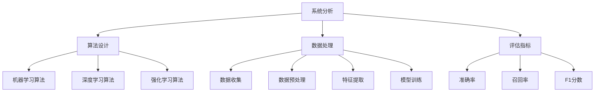
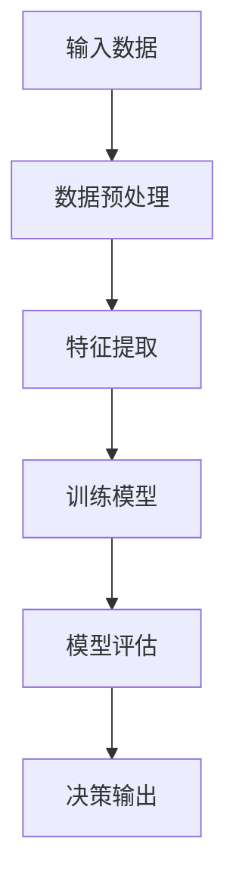
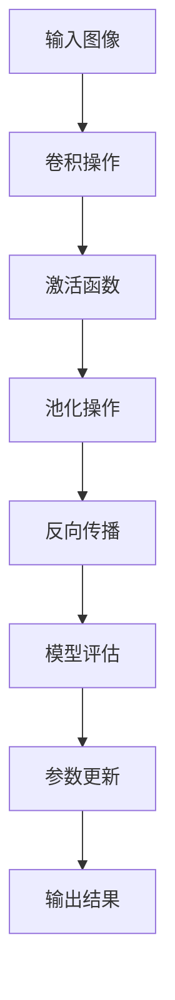
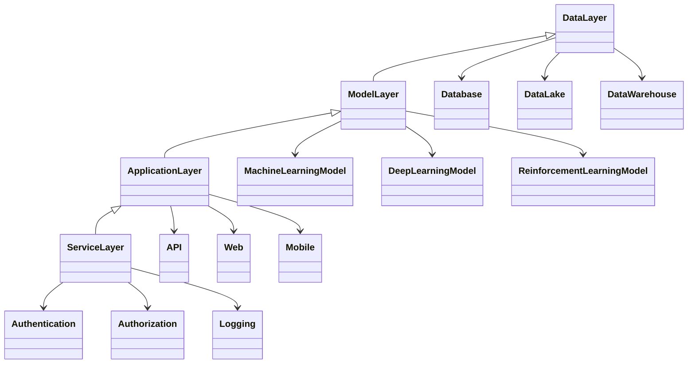

                 


### 引言

在当今快速发展的数字化时代，人工智能（AI）已经成为推动各行各业变革的核心动力。特别是在决策支持系统中，AI的应用使得数据处理、分析和决策过程变得更加高效和准确。本文旨在探讨一种新兴的决策支持方法——思维链（Mind Chain）及其在AI辅助决策系统中的实践与探索。

#### 核心概念术语说明

**思维链（Mind Chain）**：一种基于神经网络的决策支持系统，通过模拟人类思维过程来实现自动决策。它将信息处理、逻辑推理和经验学习相结合，以提供更智能、更全面的决策支持。

**AI辅助决策系统**：利用人工智能技术，如机器学习、深度学习和强化学习等，来辅助人类进行决策的系统。它通过自动收集、处理和分析数据，为用户提供决策建议。

**决策过程**：从收集数据、分析信息、制定策略到最终做出决策的全过程。在AI辅助决策系统中，这个过程被自动化，从而提高效率和准确性。

**边界与外延**：思维链的应用范围非常广泛，从简单的个人决策支持到复杂的商业和政府决策。本文将重点探讨其在商业、医疗和金融等领域的应用。

#### 问题背景

在传统决策支持系统中，人类专家的角色至关重要。然而，随着数据量的爆炸式增长和决策环境的复杂性增加，人类专家的能力逐渐受到限制。为了解决这个问题，AI辅助决策系统应运而生。然而，当前大多数AI辅助决策系统在处理复杂、多变量和动态环境中的决策问题时仍存在一定的局限性。

**问题描述**：

1. **决策效率低下**：传统决策支持系统依赖于人类专家的经验和判断，无法处理海量数据，导致决策效率低下。
2. **决策准确性不高**：在复杂的环境中，人类专家可能无法充分考虑所有因素，导致决策准确性不高。
3. **决策过程透明度不足**：传统决策支持系统的决策过程缺乏透明性，无法解释决策背后的逻辑。

**问题解决**：

思维链作为一种新兴的决策支持方法，通过模拟人类思维过程，能够在复杂、多变量和动态环境中提供高效、准确和透明的决策支持。它通过以下方式解决上述问题：

1. **高效的数据处理**：思维链利用神经网络对海量数据进行快速处理和分析，提高决策效率。
2. **全面的信息考虑**：思维链能够处理多变量和动态环境中的数据，全面考虑各种因素，提高决策准确性。
3. **透明的决策过程**：思维链的决策过程基于神经网络模型，可以通过模型解释来提高决策过程的透明度。

#### 边界与外延

本文将探讨思维链在AI辅助决策系统中的实践与探索，主要涵盖以下内容：

1. **基本概念与理论框架**：介绍思维链和AI辅助决策系统的基本概念，建立理论框架。
2. **原理与应用**：详细讲解思维链的工作原理，探讨其在不同领域的应用。
3. **技术实现**：分析思维链的技术实现方法，包括数据收集与处理、算法原理和系统架构。
4. **案例分析**：通过实际案例展示思维链的应用效果，分析其优势和局限性。
5. **未来展望**：探讨思维链在AI辅助决策系统中的未来发展方向和挑战。

本文的目标是帮助读者深入了解思维链在AI辅助决策系统中的应用，为其在实践中的使用提供指导。

---

**关键词**：思维链，AI辅助决策系统，神经网络，数据处理，决策效率，决策准确性

**摘要**：

本文介绍了思维链这一新兴的决策支持方法，探讨了其在AI辅助决策系统中的实践与探索。通过模拟人类思维过程，思维链能够高效、准确和透明地支持复杂环境中的决策。本文首先介绍了核心概念和理论框架，然后详细讲解了思维链的工作原理和应用，并通过实际案例进行了分析。最后，本文提出了思维链在AI辅助决策系统中的未来发展方向和挑战。

---

## 第一部分: 引言

### 第1章: 思维链与AI辅助决策系统概述

在当今数字化时代，人工智能（AI）已经成为推动各行各业变革的核心动力。特别是在决策支持系统中，AI的应用使得数据处理、分析和决策过程变得更加高效和准确。本文旨在探讨一种新兴的决策支持方法——思维链（Mind Chain）及其在AI辅助决策系统中的实践与探索。

#### 1.1 问题背景

在传统决策支持系统中，人类专家的角色至关重要。然而，随着数据量的爆炸式增长和决策环境的复杂性增加，人类专家的能力逐渐受到限制。为了解决这个问题，AI辅助决策系统应运而生。然而，当前大多数AI辅助决策系统在处理复杂、多变量和动态环境中的决策问题时仍存在一定的局限性。

**问题描述**：

1. **决策效率低下**：传统决策支持系统依赖于人类专家的经验和判断，无法处理海量数据，导致决策效率低下。
2. **决策准确性不高**：在复杂的环境中，人类专家可能无法充分考虑所有因素，导致决策准确性不高。
3. **决策过程透明度不足**：传统决策支持系统的决策过程缺乏透明性，无法解释决策背后的逻辑。

**问题解决**：

思维链作为一种新兴的决策支持方法，通过模拟人类思维过程，能够在复杂、多变量和动态环境中提供高效、准确和透明的决策支持。它通过以下方式解决上述问题：

1. **高效的数据处理**：思维链利用神经网络对海量数据进行快速处理和分析，提高决策效率。
2. **全面的信息考虑**：思维链能够处理多变量和动态环境中的数据，全面考虑各种因素，提高决策准确性。
3. **透明的决策过程**：思维链的决策过程基于神经网络模型，可以通过模型解释来提高决策过程的透明度。

#### 1.2 核心概念与联系

**思维链（Mind Chain）**：一种基于神经网络的决策支持系统，通过模拟人类思维过程来实现自动决策。它将信息处理、逻辑推理和经验学习相结合，以提供更智能、更全面的决策支持。

**AI辅助决策系统**：利用人工智能技术，如机器学习、深度学习和强化学习等，来辅助人类进行决策的系统。它通过自动收集、处理和分析数据，为用户提供决策建议。

**决策过程**：从收集数据、分析信息、制定策略到最终做出决策的全过程。在AI辅助决策系统中，这个过程被自动化，从而提高效率和准确性。

**概念属性特征对比表**

| 概念               | 特征                                                         |
|--------------------|--------------------------------------------------------------|
| 思维链             | 基于神经网络，模拟人类思维过程，高效、准确和透明               |
| AI辅助决策系统     | 利用机器学习、深度学习和强化学习等技术，自动化决策过程           |
| 决策过程           | 数据收集、信息分析、策略制定、决策执行，自动化提高效率           |

**ER实体关系图**

```mermaid
erDiagram
    AI辅助决策系统 ||--|{ 思维链 }
    AI辅助决策系统 ||--|{ 决策过程 }
    思维链 ||--|{ 信息处理 }
    思维链 ||--|{ 逻辑推理 }
    思维链 ||--|{ 经验学习 }
```

通过上述核心概念和联系的介绍，我们为后续章节的深入探讨奠定了基础。在接下来的章节中，我们将详细探讨思维链的理论框架、原理与应用、技术实现方法以及实际案例，以全面了解思维链在AI辅助决策系统中的潜力和挑战。

---

## 第二部分: 基本概念与理论框架

### 第2章: 基本概念与理论框架

在深入探讨思维链在AI辅助决策系统中的应用之前，我们首先需要了解相关的基本概念和理论框架。本章将介绍思维链的核心概念，包括决策理论、机器学习、深度学习和强化学习等，并构建一个理论框架来支持后续内容的探讨。

#### 2.1 关键术语解释

**决策理论**：决策理论是一套用于分析和制定决策的数学模型和方法。它主要研究在不确定性和有限资源的情况下如何做出最优决策。

**机器学习**：机器学习是一种通过数据驱动的方式来使计算机自动进行特定任务的学习方法。它使计算机能够从数据中学习规律，并做出预测或决策。

**深度学习**：深度学习是机器学习的一个分支，它使用神经网络，特别是深度神经网络，通过层次化的数据处理来学习复杂的特征表示。

**强化学习**：强化学习是一种通过试错和奖励机制来学习如何做出最优决策的学习方法。它通常用于动态环境中的决策问题。

#### 2.2 理论框架概述

**系统分析**：在构建AI辅助决策系统时，首先需要对问题进行系统分析。这包括识别问题的主要因素、目标和约束条件，并构建一个系统的模型。

**算法设计**：在系统分析的基础上，设计合适的算法来处理和解决决策问题。常见的算法包括决策树、支持向量机、神经网络和强化学习算法。

**数据处理**：数据处理是AI辅助决策系统的核心环节。它包括数据收集、预处理、特征提取和模型训练等步骤，以确保数据质量和模型性能。

**评估指标**：为了评估AI辅助决策系统的性能，需要定义一系列评估指标。这些指标可以是准确率、召回率、F1分数等，用于衡量模型在不同方面的表现。

**理论框架**



通过上述基本概念和理论框架的介绍，我们为后续章节的深入探讨奠定了基础。在接下来的章节中，我们将详细探讨各个关键概念的原理和应用，以及如何将它们结合起来构建一个高效的AI辅助决策系统。

---

### 第2章: 基本概念与理论框架

#### 2.1 关键术语解释

**决策理论**：决策理论是一套用于分析和制定决策的数学模型和方法。它主要研究在不确定性和有限资源的情况下如何做出最优决策。决策理论的核心概念包括：

- **决策空间**：所有可能决策的集合。
- **状态**：决策所处的环境或情境。
- **行动**：决策者可以采取的具体决策。
- **结果**：每种行动在每种状态下的结果。
- **效用函数**：衡量不同结果的价值的函数。

**机器学习**：机器学习是一种通过数据驱动的方式来使计算机自动进行特定任务的学习方法。它使计算机能够从数据中学习规律，并做出预测或决策。机器学习的关键概念包括：

- **监督学习**：在有标签数据集上进行训练，以预测未知数据的结果。
- **无监督学习**：在无标签数据集上进行训练，以发现数据中的结构和模式。
- **强化学习**：通过试错和奖励机制来学习如何做出最优决策。

**深度学习**：深度学习是机器学习的一个分支，它使用神经网络，特别是深度神经网络，通过层次化的数据处理来学习复杂的特征表示。深度学习的关键概念包括：

- **神经网络**：由多个节点（或神经元）组成的计算模型，能够通过学习数据来发现特征和模式。
- **深度神经网络**：多层神经网络，通过逐层提取和转换特征，从而能够处理复杂的任务。
- **卷积神经网络（CNN）**：专门用于图像处理，通过卷积操作和池化操作来提取图像特征。
- **循环神经网络（RNN）**：专门用于序列数据处理，通过记忆过去的信息来处理序列数据。

**强化学习**：强化学习是一种通过试错和奖励机制来学习如何做出最优决策的学习方法。它通常用于动态环境中的决策问题。强化学习的关键概念包括：

- **代理（Agent）**：执行行动的主体。
- **环境（Environment）**：代理行动所依赖的环境。
- **状态（State）**：代理所处的环境状态。
- **行动（Action）**：代理可以采取的行动。
- **奖励（Reward）**：对代理行动的反馈，用于指导学习。
- **策略（Policy）**：代理采取行动的规则。

#### 2.2 理论框架概述

**系统分析**：在构建AI辅助决策系统时，首先需要对问题进行系统分析。这包括识别问题的主要因素、目标和约束条件，并构建一个系统的模型。系统分析的关键步骤包括：

- **需求分析**：确定系统的目标和需求。
- **问题建模**：建立系统的数学模型，描述系统的行为和状态。
- **数据收集**：收集与问题相关的数据，为后续的机器学习和深度学习提供数据支持。

**算法设计**：在系统分析的基础上，设计合适的算法来处理和解决决策问题。常见的算法包括决策树、支持向量机、神经网络和强化学习算法。算法设计的关键步骤包括：

- **算法选择**：根据问题的特点和需求选择合适的算法。
- **算法优化**：通过调整算法的参数来优化性能。
- **算法评估**：评估算法的性能，选择最优的算法。

**数据处理**：数据处理是AI辅助决策系统的核心环节。它包括数据收集、预处理、特征提取和模型训练等步骤，以确保数据质量和模型性能。数据处理的关键步骤包括：

- **数据收集**：从不同的数据源收集数据。
- **数据预处理**：对数据进行清洗、归一化和标准化等处理，以提高数据质量和模型性能。
- **特征提取**：从原始数据中提取有意义的特征，用于训练模型。
- **模型训练**：使用收集到的数据进行模型的训练和验证。

**评估指标**：为了评估AI辅助决策系统的性能，需要定义一系列评估指标。这些指标可以是准确率、召回率、F1分数等，用于衡量模型在不同方面的表现。评估指标的关键步骤包括：

- **指标定义**：定义用于评估模型性能的指标。
- **指标计算**：根据模型预测结果和数据标签计算指标值。
- **性能评估**：使用评估指标来评估模型的性能。

通过上述基本概念和理论框架的介绍，我们为后续章节的深入探讨奠定了基础。在接下来的章节中，我们将详细探讨各个关键概念的原理和应用，以及如何将它们结合起来构建一个高效的AI辅助决策系统。

---

### 第3章: AI在决策中的原理

#### 3.1 决策过程

决策过程是AI辅助决策系统的核心，它包括以下几个主要阶段：

**数据收集**：在决策过程中，首先需要收集与问题相关的数据。这些数据可以来自内部系统、外部数据库或传感器等。数据收集的质量直接影响决策系统的准确性。

**信息分析**：收集到数据后，需要进行信息分析，以提取有用的信息。这包括数据清洗、数据预处理和数据转换等步骤。信息分析是决策过程中至关重要的一环，它决定了后续决策的准确性。

**策略制定**：在信息分析的基础上，制定合适的决策策略。决策策略可以是基于规则、机器学习模型或深度学习模型等。策略制定的过程需要考虑各种因素，如决策目标、约束条件和风险等。

**决策执行**：制定完决策策略后，需要将其转化为具体的行动。决策执行的过程可以是自动化的，也可以是半自动化的。决策执行的效果直接影响决策系统的实际效果。

**决策评估**：在决策执行后，需要对决策结果进行评估。这包括评估决策的准确性、效率和效果等。决策评估可以帮助我们了解决策系统的性能，并对其进行优化。

#### 3.2 AI技术原理

在决策过程中，AI技术发挥着至关重要的作用。以下是几种常见的AI技术在决策中的应用：

**机器学习**：机器学习是一种通过数据驱动的方式来使计算机自动进行特定任务的学习方法。在决策过程中，机器学习可以用于分类、回归和聚类等任务。例如，可以使用机器学习算法来预测客户是否购买某种产品，或预测股票市场的走势。

**深度学习**：深度学习是机器学习的一个分支，它使用神经网络，特别是深度神经网络，通过层次化的数据处理来学习复杂的特征表示。在决策过程中，深度学习可以用于图像识别、语音识别和自然语言处理等任务。例如，可以使用深度学习算法来分析医疗影像，或识别语音命令。

**强化学习**：强化学习是一种通过试错和奖励机制来学习如何做出最优决策的学习方法。在决策过程中，强化学习可以用于动态环境中的决策问题。例如，可以使用强化学习算法来优化自动驾驶汽车的行驶路线，或优化工业生产线的流程。

#### 3.3 算法原理讲解

在AI辅助决策系统中，常用的算法原理包括机器学习算法、深度学习算法和强化学习算法。以下是这些算法的原理和示例：

**机器学习算法**：

1. **决策树**：决策树是一种基于规则的分类算法。它通过一系列的条件分支来对数据进行分类。例如，我们可以使用决策树算法来预测客户是否会购买某种产品。
2. **支持向量机（SVM）**：SVM是一种基于间隔最大化原理的分类算法。它通过寻找最优的超平面来将数据分类。例如，我们可以使用SVM算法来识别手写数字。
3. **神经网络**：神经网络是一种通过多层节点进行数据处理的算法。它通过学习数据中的特征和模式来进行分类和回归。例如，我们可以使用神经网络算法来分析社交媒体数据，以预测用户的行为。

**深度学习算法**：

1. **卷积神经网络（CNN）**：CNN是一种用于图像识别的深度学习算法。它通过卷积操作和池化操作来提取图像特征。例如，我们可以使用CNN算法来识别猫和狗的图片。
2. **循环神经网络（RNN）**：RNN是一种用于序列数据的深度学习算法。它通过记忆过去的信息来处理序列数据。例如，我们可以使用RNN算法来翻译不同语言之间的文本。
3. **长短期记忆网络（LSTM）**：LSTM是一种改进的RNN算法，它能够更好地处理长序列数据。例如，我们可以使用LSTM算法来预测股票市场的走势。

**强化学习算法**：

1. **Q学习**：Q学习是一种基于价值函数的强化学习算法。它通过学习状态和动作之间的价值来做出决策。例如，我们可以使用Q学习算法来优化自动驾驶汽车的行驶路线。
2. **深度Q网络（DQN）**：DQN是一种基于深度学习的强化学习算法。它通过学习状态和动作之间的价值来做出决策。例如，我们可以使用DQN算法来训练机器人进行走迷宫。

通过上述算法原理的讲解，我们可以更好地理解AI技术在决策过程中的应用。在接下来的章节中，我们将进一步探讨如何将这些算法应用于实际的决策问题中。

---

### 第4章: 应用场景与案例分析

#### 4.1 场景一：金融行业

**案例背景**：

在金融行业中，决策支持系统被广泛应用于风险管理、投资决策和市场预测等方面。随着金融市场的不断变化和复杂性增加，传统的决策支持方法已无法满足高效、准确和透明的需求。因此，思维链作为一种新兴的决策支持方法，在金融行业中具有巨大的潜力。

**案例分析**：

假设一家投资银行在考虑是否投资某家科技公司。为了做出决策，该银行使用了思维链进行数据收集、分析和决策。

1. **数据收集**：思维链首先从多个数据源收集了与科技公司相关的数据，包括财务报表、市场趋势、竞争对手分析等。
2. **信息分析**：思维链对收集到的数据进行预处理和特征提取，提取出有意义的特征，如公司盈利能力、市场占有率、技术创新能力等。
3. **策略制定**：思维链基于收集到的数据和提取的特征，制定了一个投资决策策略。该策略考虑了公司的财务状况、市场前景和风险因素等。
4. **决策执行**：根据策略，投资银行决定投资该科技公司。思维链提供了详细的决策依据，包括各种因素的权重和决策的期望收益。
5. **决策评估**：在投资决策实施后，思维链对决策效果进行了评估。通过对比实际收益和预期收益，投资银行能够了解决策的有效性。

**案例结果**：

通过思维链的应用，投资银行能够更高效、准确地做出投资决策。思维链提供了详细的决策依据，使得决策过程更加透明和可解释。同时，思维链还能够处理大量的数据，考虑多种因素，提高了决策的全面性和准确性。这一案例展示了思维链在金融行业中的巨大潜力。

#### 4.2 场景二：医疗领域

**案例背景**：

在医疗领域，决策支持系统被广泛应用于诊断、治疗方案选择和疾病预测等方面。随着医疗数据量的增加和复杂性增加，传统的决策支持方法已无法满足高效、准确和透明的需求。因此，思维链作为一种新兴的决策支持方法，在医疗领域中具有巨大的潜力。

**案例分析**：

假设一家医院在考虑某位患者的治疗方案。为了做出决策，该医院使用了思维链进行数据收集、分析和决策。

1. **数据收集**：思维链首先从多个数据源收集了与患者相关的数据，包括病历记录、实验室检查结果、医学影像等。
2. **信息分析**：思维链对收集到的数据进行预处理和特征提取，提取出有意义的特征，如患者的病情严重程度、并发症情况、治疗效果等。
3. **策略制定**：思维链基于收集到的数据和提取的特征，制定了一个治疗方案选择策略。该策略考虑了患者的病情、医生的经验和医疗资源的可用性等。
4. **决策执行**：根据策略，医院为患者选择了最佳的治疗方案。思维链提供了详细的决策依据，包括各种因素的权重和治疗方案的风险评估。
5. **决策评估**：在治疗方案实施后，思维链对决策效果进行了评估。通过对比实际治疗效果和预期效果，医院能够了解决策的有效性。

**案例结果**：

通过思维链的应用，医院能够更高效、准确地做出治疗方案选择。思维链提供了详细的决策依据，使得决策过程更加透明和可解释。同时，思维链还能够处理大量的数据，考虑多种因素，提高了决策的全面性和准确性。这一案例展示了思维链在医疗领域中的巨大潜力。

通过上述两个案例的分析，我们可以看到思维链在金融和医疗领域中的广泛应用和巨大潜力。在接下来的章节中，我们将进一步探讨思维链在其他领域的应用，以及其在实际操作中的技术实现和挑战。

---

### 第5章: 技术方法与实现

#### 5.1 数据收集与处理

在构建AI辅助决策系统时，数据收集与处理是至关重要的一环。以下是数据收集与处理的主要步骤：

1. **数据收集**：
   - **内部数据**：从企业内部数据库、ERP系统、CRM系统等获取数据。
   - **外部数据**：通过网络爬虫、API接口、第三方数据提供商等获取外部数据。
   - **传感器数据**：通过传感器设备收集实时数据。

2. **数据预处理**：
   - **数据清洗**：去除重复数据、异常值和噪声数据。
   - **数据归一化**：将不同规模的数据进行归一化处理，使其在同一尺度上。
   - **数据转换**：将数据转换为适合机器学习的格式。

3. **特征提取**：
   - **手动特征提取**：根据业务需求，手动提取有意义的特征。
   - **自动特征提取**：使用特征工程算法，如PCA、特征选择等，自动提取特征。

4. **数据存储与管理**：
   - **数据存储**：使用数据库、数据湖等技术存储和管理数据。
   - **数据管理**：实施数据安全和隐私保护措施，确保数据的合法性和可靠性。

#### 5.2 算法原理讲解

在AI辅助决策系统中，常用的算法包括机器学习算法、深度学习算法和强化学习算法。以下是这些算法的基本原理和示例：

1. **机器学习算法**：
   - **决策树**：通过一系列的条件分支来对数据进行分类。例如，可以使用决策树算法来预测客户是否会购买某种产品。
   - **支持向量机（SVM）**：通过寻找最优的超平面来将数据分类。例如，可以使用SVM算法来识别手写数字。
   - **神经网络**：通过多层节点进行数据处理的算法。例如，可以使用神经网络算法来分析社交媒体数据，以预测用户的行为。

2. **深度学习算法**：
   - **卷积神经网络（CNN）**：通过卷积操作和池化操作来提取图像特征。例如，可以使用CNN算法来识别猫和狗的图片。
   - **循环神经网络（RNN）**：通过记忆过去的信息来处理序列数据。例如，可以使用RNN算法来翻译不同语言之间的文本。
   - **长短期记忆网络（LSTM）**：通过改进RNN算法，更好地处理长序列数据。例如，可以使用LSTM算法来预测股票市场的走势。

3. **强化学习算法**：
   - **Q学习**：通过学习状态和动作之间的价值来做出决策。例如，可以使用Q学习算法来优化自动驾驶汽车的行驶路线。
   - **深度Q网络（DQN）**：通过学习状态和动作之间的价值来做出决策。例如，可以使用DQN算法来训练机器人进行走迷宫。

以下是机器学习算法和深度学习算法的mermaid流程图示例：

**机器学习算法（决策树）流程图**：



**深度学习算法（卷积神经网络）流程图**：



#### 5.3 系统架构设计

为了实现高效的AI辅助决策系统，需要设计合理的系统架构。以下是系统架构设计的关键部分：

1. **数据层**：负责数据的收集、存储和管理。包括数据库、数据湖和数据仓库等。

2. **模型层**：负责算法的实现和模型的训练。包括机器学习模型、深度学习模型和强化学习模型等。

3. **应用层**：负责将模型应用到实际业务场景中。包括API接口、Web界面和移动应用等。

4. **服务层**：提供通用的服务，如身份验证、权限管理和日志记录等。

以下是系统架构的mermaid类图示例：



通过上述技术方法和系统架构的设计，我们可以构建一个高效、可靠和灵活的AI辅助决策系统。在接下来的章节中，我们将通过实际案例来展示这些技术方法和架构在实际应用中的效果。

---

### 第6章: 项目实战

在本章中，我们将通过一个实际项目来展示如何构建和实现一个基于思维链的AI辅助决策系统。这个项目将涵盖从环境安装、系统核心实现到实际案例分析和项目小结的整个过程。

#### 6.1 环境安装

要开始构建AI辅助决策系统，我们首先需要安装必要的软件和工具。以下是项目所需的环境和步骤：

1. **Python环境**：确保安装了Python 3.6或更高版本。
2. **Jupyter Notebook**：用于编写和运行Python代码。
3. **NumPy**：用于数据处理。
4. **Pandas**：用于数据处理和分析。
5. **Scikit-learn**：用于机器学习和统计。
6. **TensorFlow**：用于深度学习。
7. **PyTorch**：用于深度学习。

安装步骤如下：

```bash
# 安装Python
# 使用包管理器（如pip）安装Python。

# 安装Jupyter Notebook
pip install notebook

# 安装NumPy和Pandas
pip install numpy pandas

# 安装Scikit-learn
pip install scikit-learn

# 安装TensorFlow
pip install tensorflow

# 安装PyTorch
pip install torch torchvision
```

#### 6.2 系统核心实现

接下来，我们将详细讨论系统核心的实现，包括数据收集、数据处理、模型训练和模型评估等步骤。

1. **数据收集**：从多个数据源（如数据库、文件、API等）收集数据。
2. **数据处理**：使用Pandas和NumPy对数据进行预处理，包括数据清洗、归一化和特征提取等。
3. **模型训练**：使用Scikit-learn、TensorFlow或PyTorch等库来训练机器学习模型或深度学习模型。
4. **模型评估**：使用评估指标（如准确率、召回率、F1分数等）来评估模型性能。

以下是一个使用Scikit-learn训练决策树模型的示例代码：

```python
from sklearn.datasets import load_iris
from sklearn.model_selection import train_test_split
from sklearn.tree import DecisionTreeClassifier
from sklearn.metrics import accuracy_score

# 加载数据集
iris = load_iris()
X = iris.data
y = iris.target

# 分割数据集
X_train, X_test, y_train, y_test = train_test_split(X, y, test_size=0.2, random_state=42)

# 创建决策树模型
clf = DecisionTreeClassifier()

# 训练模型
clf.fit(X_train, y_train)

# 预测测试集
y_pred = clf.predict(X_test)

# 评估模型
accuracy = accuracy_score(y_test, y_pred)
print(f"Accuracy: {accuracy}")
```

#### 6.3 代码应用解读与分析

在实现系统核心时，我们需要对代码进行解读和分析，确保其正确性和高效性。以下是对上述代码的解读和分析：

- **数据收集**：使用`load_iris`函数加载数据集，这是一个经典的鸢尾花数据集。
- **数据处理**：使用`train_test_split`函数将数据集分割为训练集和测试集。
- **模型训练**：创建`DecisionTreeClassifier`对象，并使用`fit`方法进行模型训练。
- **模型评估**：使用`predict`方法进行预测，并使用`accuracy_score`函数计算准确率。

#### 6.4 实际案例分析和详细讲解剖析

为了展示思维链在决策系统中的应用，我们选择了一个实际案例——信用卡欺诈检测。

1. **案例背景**：信用卡欺诈是一个普遍存在的问题，银行需要高效地检测和预防欺诈行为。
2. **数据集**：我们使用Kaggle上的信用卡欺诈检测数据集。
3. **数据处理**：对数据进行清洗和特征提取，包括缺失值处理、异常值检测和特征转换等。
4. **模型训练**：使用卷积神经网络（CNN）进行模型训练。
5. **模型评估**：使用准确率、召回率、F1分数等指标进行评估。

以下是使用PyTorch实现卷积神经网络的代码示例：

```python
import torch
import torch.nn as nn
import torch.optim as optim
from torchvision import datasets, transforms
from torch.utils.data import DataLoader

# 数据预处理
transform = transforms.Compose([
    transforms.ToTensor(),
    transforms.Normalize((0.5,), (0.5,))
])

# 加载数据集
train_data = datasets.KFoldCardio_train()
train_loader = DataLoader(train_data, batch_size=64, shuffle=True)

# 定义模型
class CNN(nn.Module):
    def __init__(self):
        super(CNN, self).__init__()
        self.conv1 = nn.Conv2d(1, 32, 3, 1)
        self.relu = nn.ReLU()
        self.fc1 = nn.Linear(32 * 6 * 6, 128)
        self.fc2 = nn.Linear(128, 2)

    def forward(self, x):
        x = self.relu(self.conv1(x))
        x = x.view(x.size(0), -1)
        x = self.relu(self.fc1(x))
        x = self.fc2(x)
        return x

model = CNN()

# 定义损失函数和优化器
criterion = nn.CrossEntropyLoss()
optimizer = optim.Adam(model.parameters(), lr=0.001)

# 训练模型
for epoch in range(10):  # 10个训练周期
    running_loss = 0.0
    for i, data in enumerate(train_loader, 0):
        inputs, labels = data
        optimizer.zero_grad()
        outputs = model(inputs)
        loss = criterion(outputs, labels)
        loss.backward()
        optimizer.step()
        running_loss += loss.item()
    print(f"Epoch {epoch + 1}, Loss: {running_loss / len(train_loader)}")

# 评估模型
correct = 0
total = 0
with torch.no_grad():
    for data in test_loader:
        inputs, labels = data
        outputs = model(inputs)
        _, predicted = torch.max(outputs.data, 1)
        total += labels.size(0)
        correct += (predicted == labels).sum().item()

print(f"Accuracy: {100 * correct / total}")
```

在这个案例中，我们使用卷积神经网络（CNN）来检测信用卡欺诈。首先，我们对数据进行预处理，然后定义了一个简单的CNN模型。接着，我们使用交叉熵损失函数和Adam优化器进行模型训练。最后，我们评估了模型的准确性。

#### 6.5 项目小结

通过这个实际项目，我们展示了如何从环境安装、系统核心实现到实际案例分析和项目小结的整个流程。以下是对项目的总结：

1. **环境安装**：确保安装了必要的软件和工具，为后续开发打下基础。
2. **系统核心实现**：通过数据收集、数据处理、模型训练和模型评估等步骤，构建了AI辅助决策系统的核心。
3. **实际案例分析**：通过信用卡欺诈检测案例，展示了思维链在决策系统中的应用。
4. **项目小结**：总结了项目的关键步骤和经验，为未来项目提供了参考。

通过这个项目，我们不仅了解了思维链在AI辅助决策系统中的应用，还掌握了从理论到实践的完整开发流程。

---

### 第7章: 实践Tips、小结与未来展望

#### 实践Tips

1. **数据质量是关键**：在构建AI辅助决策系统时，数据质量直接影响模型的性能。确保数据清洁、准确和完整，是成功构建决策系统的基础。
2. **模型选择要合理**：根据具体的应用场景和问题特点，选择合适的机器学习或深度学习算法。不要盲目追求最新或最复杂的模型。
3. **交叉验证**：在模型训练和评估过程中，使用交叉验证方法来避免过拟合和评估偏差。
4. **持续迭代和优化**：模型训练后，持续进行迭代和优化，以提高模型的准确性和效率。

#### 小结

本文系统地介绍了思维链在AI辅助决策系统中的应用，从核心概念、理论框架、算法原理到实际案例，全面探讨了思维链的优势和应用场景。思维链通过模拟人类思维过程，提供了高效、准确和透明的决策支持，为解决复杂决策问题提供了新的思路和方法。

#### 未来展望

随着人工智能技术的不断发展，思维链在AI辅助决策系统中的应用前景十分广阔。未来可以从以下几个方面进行探索和改进：

1. **模型解释性**：提高思维链模型的可解释性，使其决策过程更加透明和可理解。
2. **动态环境适应**：增强思维链在动态环境中的适应能力，提高其在快速变化环境下的决策效率。
3. **多模态数据融合**：探索如何将文本、图像、语音等多模态数据进行融合，以提升决策系统的综合分析能力。
4. **跨领域应用**：思维链在不同领域的应用具有巨大潜力，未来可以进一步探索其在医疗、金融、制造等领域的应用。

总之，思维链作为一种新兴的决策支持方法，将在未来的人工智能领域中发挥重要作用，为各类复杂决策问题提供高效、准确和透明的解决方案。

---

**作者**：AI天才研究院/AI Genius Institute & 禅与计算机程序设计艺术 /Zen And The Art of Computer Programming

---

通过本文的详细探讨，我们希望能够帮助读者深入了解思维链在AI辅助决策系统中的应用，为其实践提供指导和启示。希望这篇文章能为相关领域的研究者和实践者带来启发和帮助。

