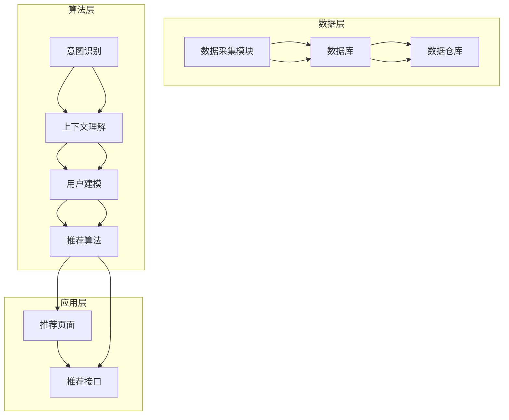

                 

### 文章标题

# 思维链在个性化推荐系统中的应用

### 关键词

思维链，个性化推荐系统，意图识别，上下文理解，用户建模

### 摘要

本文深入探讨了思维链在个性化推荐系统中的应用，旨在揭示思维链如何通过意图识别、上下文理解和用户建模等技术手段，提高推荐系统的准确性和用户体验。文章从思维链的基础概念出发，结合个性化推荐系统的现状和挑战，逐步分析了思维链的核心概念与属性，并详细阐述了其在意图识别、上下文理解和用户建模中的应用原理。通过具体的算法讲解和实例分析，本文揭示了思维链在个性化推荐系统中的实际应用效果，为相关领域的进一步研究提供了有价值的参考。

### 目录大纲

----------------------------------------------------------------

## 第一部分：思维链基础与个性化推荐系统概述

### 第1章：思维链的概念与特点

### 第2章：个性化推荐系统概述

### 第3章：思维链的核心概念与属性

### 第4章：思维链在个性化推荐系统中的应用

### 第5章：算法原理讲解与数学模型

### 第6章：系统分析与架构设计

### 第7章：项目实战

### 第8章：最佳实践 tips、小结、注意事项、拓展阅读

----------------------------------------------------------------

## 第一部分：思维链基础与个性化推荐系统概述

### 第1章：思维链的概念与特点

### 1.1 问题背景

#### 个性化推荐系统的发展历程

个性化推荐系统起源于20世纪90年代，随着互联网的普及和电子商务的发展，推荐系统在电商、新闻推送、社交媒体等领域得到广泛应用。传统推荐系统主要基于协同过滤算法，通过分析用户的历史行为和偏好来推荐相关物品。然而，随着数据规模和多样性的增加，传统推荐系统面临诸多挑战，如数据稀疏性、可扩展性和实时性等。

#### 传统推荐系统的局限性

传统推荐系统主要依赖历史数据和用户行为来生成推荐，容易受到数据稀疏性和噪音的影响。同时，这些系统往往缺乏对用户意图和上下文的深入理解，导致推荐结果不够精准和个性化。为了克服这些局限性，研究人员提出了基于深度学习、自然语言处理和图神经网络等新型推荐算法。

#### 思维链的概念引入

思维链（MindChain）是一种新型的推荐算法，它通过模拟人类的思维过程，实现对用户意图、上下文和用户特征的深入理解，从而提高推荐系统的准确性和用户体验。思维链算法的核心在于将用户思维过程模型化，通过分析用户的输入和交互历史，动态构建用户意图和上下文模型，进而生成个性化推荐。

### 1.2 思维链的基本原理

#### 思维链的定义

思维链是一种基于人类思维过程的推荐算法，它通过模拟用户的决策过程，实现对用户意图、上下文和用户特征的深入理解，从而生成个性化推荐。思维链算法的核心在于将用户思维过程模型化，通过分析用户的输入和交互历史，动态构建用户意图和上下文模型。

#### 思维链的关键要素

思维链算法的关键要素包括用户意图识别、上下文理解和用户建模。

1. **用户意图识别**：思维链通过分析用户的输入和交互历史，识别用户当前的目标和意图。这通常涉及自然语言处理和意图分类技术，如词向量、循环神经网络（RNN）和长短时记忆网络（LSTM）。

2. **上下文理解**：思维链通过分析用户的上下文信息，如时间、地点、设备和使用场景等，构建上下文模型。这有助于提高推荐的相关性和个性化程度。

3. **用户建模**：思维链通过分析用户的历史行为和偏好，建立用户画像和兴趣模型。这有助于更准确地预测用户的兴趣和行为，从而生成个性化推荐。

#### 思维链与人类思维模式的比较

思维链算法试图模拟人类的思维过程，但在某些方面仍有区别。

1. **速度和效率**：人类的思维过程通常是快速和高效的，而计算机算法在处理复杂问题时可能需要较长的时间。

2. **经验和直觉**：人类的思维过程通常依赖于经验和直觉，而计算机算法则主要依赖数据和模型。

3. **多样性和创造性**：人类的思维过程具有多样性和创造性，能够产生新的想法和解决方案，而计算机算法在现有数据和模型的基础上进行优化和改进。

### 1.3 思维链的特点

#### 灵活性与适应性

思维链算法具有高度的灵活性和适应性，能够根据不同场景和用户需求进行动态调整。这使得思维链在应对复杂多变的数据和用户需求时具有明显优势。

#### 深度学习与关联分析

思维链算法通过深度学习和关联分析技术，能够深入挖掘用户数据和用户特征，从而生成更准确和个性化的推荐。

#### 实时性与动态性

思维链算法能够实时分析用户的输入和交互历史，动态调整推荐策略，从而提高推荐系统的实时性和动态性。

### 1.4 思维链在个性化推荐系统中的应用前景

#### 提高推荐准确性

思维链通过深度学习和关联分析技术，能够更准确地识别用户的意图和上下文，从而生成更精准和个性化的推荐。

#### 优化用户体验

思维链算法通过动态调整推荐策略，能够更好地满足用户的个性化需求，从而提高用户体验。

#### 应对数据稀疏性问题

思维链通过深度学习和关联分析技术，能够从稀疏数据中提取有价值的信息，从而缓解数据稀疏性问题。

#### 拓展阅读

1. **思维链在个性化推荐系统中的应用**：对思维链算法在个性化推荐系统中的应用进行了详细介绍，包括意图识别、上下文理解和用户建模等关键环节。
2. **深度学习在推荐系统中的应用**：介绍了深度学习技术在推荐系统中的应用，包括卷积神经网络（CNN）、循环神经网络（RNN）和长短时记忆网络（LSTM）等。
3. **推荐系统的评价指标**：介绍了推荐系统的常见评价指标，如准确率、召回率和覆盖率等，并讨论了如何优化这些指标。

### 第2章：个性化推荐系统概述

### 2.1 个性化推荐系统的基本概念

#### 推荐系统的定义

个性化推荐系统是一种基于用户历史行为、兴趣和偏好等信息，自动向用户推荐相关物品或内容的算法系统。其核心目标是通过分析用户的行为和特征，预测用户未来的兴趣和需求，从而提高推荐的准确性和用户体验。

#### 个性化推荐系统的目的与原则

个性化推荐系统的目的是为用户提供个性化的推荐结果，主要原则包括：

1. **准确性**：推荐系统能够准确预测用户的兴趣和需求，生成与用户相关度高的推荐。
2. **多样性**：推荐系统能够为用户提供多样化的推荐结果，避免单一化的推荐策略。
3. **实时性**：推荐系统能够实时响应用户的需求和偏好变化，提供及时、准确的推荐。
4. **可扩展性**：推荐系统能够适应大规模数据和高并发访问场景，保证系统稳定运行。

#### 推荐系统的类型

个性化推荐系统根据推荐策略和算法不同，可分为以下几种类型：

1. **基于内容的推荐**：根据物品的属性和特征，将相似的内容推荐给用户。例如，新闻网站根据用户的阅读历史推荐相关新闻。
2. **协同过滤推荐**：通过分析用户之间的行为和偏好相似性，将其他用户喜欢的物品推荐给当前用户。例如，Netflix电影推荐。
3. **基于规则的推荐**：根据预设的规则和条件，为用户推荐符合规则的物品。例如，电商平台根据用户购买历史推荐相关商品。
4. **混合推荐**：结合多种推荐策略和算法，为用户生成更准确和个性化的推荐。例如，亚马逊结合内容推荐和协同过滤推荐为用户提供商品推荐。

### 2.2 个性化推荐系统的常见算法

#### 协同过滤

协同过滤是一种基于用户行为和偏好相似性的推荐算法。根据用户历史行为数据，将相似的用户或物品进行聚类，为用户推荐相似用户喜欢的物品或为相似物品推荐给当前用户。协同过滤可分为以下两类：

1. **用户基于的协同过滤**：通过分析用户之间的相似性，为用户推荐其他用户喜欢的物品。
2. **物品基于的协同过滤**：通过分析物品之间的相似性，为用户推荐与其已评价物品相似的其他物品。

#### 内容推荐

内容推荐是一种基于物品属性和特征进行推荐的算法。通过分析物品的文本描述、标签、分类等信息，将相似的内容推荐给用户。内容推荐主要应用于新闻推送、音乐推荐和电商商品推荐等领域。

#### 混合推荐

混合推荐是一种结合多种推荐策略和算法的综合推荐方法。通过融合协同过滤、内容推荐和基于规则的推荐，为用户生成更准确和个性化的推荐结果。混合推荐通常具有更好的推荐效果和鲁棒性，适用于复杂和多变的推荐场景。

### 2.3 个性化推荐系统的挑战与解决方案

#### 数据质量

数据质量是影响推荐系统性能的重要因素。数据缺失、噪音和异常值等问题都会对推荐结果产生负面影响。为了提高数据质量，可以采用以下方法：

1. **数据清洗**：通过数据预处理和清洗技术，去除数据中的噪音和异常值，提高数据质量。
2. **数据增强**：通过数据扩充和生成技术，增加数据量，提高模型训练效果。

#### 可扩展性

个性化推荐系统通常需要处理大规模的用户数据和物品数据，对系统的可扩展性提出了较高要求。为了提高系统可扩展性，可以采用以下方法：

1. **分布式计算**：利用分布式计算框架，如Hadoop、Spark等，实现海量数据的分布式处理，提高系统性能。
2. **缓存技术**：通过缓存技术，减少对数据库的查询次数，提高系统响应速度。

#### 冷启动问题

冷启动问题是指在新用户或新物品加入系统时，由于缺乏历史数据和用户偏好信息，难以生成准确和个性化的推荐。为了解决冷启动问题，可以采用以下方法：

1. **基于内容的推荐**：在新用户或新物品缺乏行为数据时，通过内容属性和特征进行推荐。
2. **基于规则的方法**：利用预设的规则和条件，为新用户或新物品推荐符合其特征的物品。
3. **用户行为预测**：通过用户历史行为和偏好分析，预测新用户的兴趣和需求，从而生成个性化推荐。

#### 思维链在个性化推荐系统中的作用机制

思维链算法在个性化推荐系统中具有以下作用机制：

1. **意图识别**：思维链通过分析用户的输入和交互历史，识别用户当前的意图和目标，从而为用户生成个性化推荐。
2. **上下文理解**：思维链通过分析用户的上下文信息，如时间、地点、设备和场景等，构建上下文模型，提高推荐的相关性和准确性。
3. **用户建模**：思维链通过分析用户的历史行为和偏好，建立用户画像和兴趣模型，为用户生成更准确的个性化推荐。

通过意图识别、上下文理解和用户建模等机制，思维链算法能够深入挖掘用户数据和特征，从而提高个性化推荐系统的准确性和用户体验。

### 第3章：思维链的核心概念与属性

#### 3.1 思维链的核心概念

思维链算法的核心概念包括意图识别、上下文理解和用户建模。

1. **意图识别**：意图识别是思维链算法的第一步，通过分析用户的输入和交互历史，识别用户当前的目标和意图。意图识别技术通常涉及自然语言处理和意图分类，如词向量、循环神经网络（RNN）和长短时记忆网络（LSTM）。
   
2. **上下文理解**：上下文理解是思维链算法的关键环节，通过分析用户的上下文信息，如时间、地点、设备和使用场景等，构建上下文模型。上下文理解有助于提高推荐的相关性和个性化程度。

3. **用户建模**：用户建模是思维链算法的核心，通过分析用户的历史行为和偏好，建立用户画像和兴趣模型。用户建模技术包括用户特征提取、用户画像构建和用户兴趣预测等。

#### 3.2 思维链的属性特征对比

思维链与其他推荐算法的属性特征对比如下表：

| 属性         | 思维链 | 协同过滤 | 内容推荐 |
| ------------ | ------ | -------- | -------- |
| 灵活性       | 高     | 中       | 低       |
| 学习能力     | 强     | 弱       | 中       |
| 用户交互     | 深入   | 表面     | 深入     |
| 可扩展性     | 高     | 低       | 中       |

1. **灵活性**：思维链算法具有高度的灵活性，能够根据不同场景和用户需求进行动态调整，适应复杂多变的数据和用户需求。
   
2. **学习能力**：思维链算法通过深度学习和关联分析技术，能够从大量数据中学习用户特征和偏好，从而提高推荐准确性。

3. **用户交互**：思维链算法通过意图识别、上下文理解和用户建模等技术手段，能够深入挖掘用户意图和上下文信息，实现与用户的深入交互。

4. **可扩展性**：思维链算法适用于大规模数据和高并发访问场景，能够保证系统稳定运行和高效处理。

#### 3.3 思维链的ER实体关系图

思维链中的实体关系图（ER图）如下：

```mermaid
entity Relationship {
  "用户" -- "物品" : "偏好"
  "用户" -- "行为" : "记录"
  "物品" -- "特征" : "描述"
}
```

1. **用户**：代表系统中的用户实体，包括用户基本信息和用户特征。
2. **物品**：代表系统中的物品实体，包括物品基本信息和物品特征。
3. **偏好**：表示用户对物品的偏好关系，即用户喜欢哪些物品。
4. **行为**：表示用户在系统中的行为记录，如浏览、点击、购买等。
5. **描述**：表示物品的特征描述，如文本、标签、分类等。

通过实体关系图，可以直观地了解思维链算法中的实体及其关系，为后续算法设计和实现提供基础。

### 第4章：思维链在个性化推荐系统中的应用

#### 4.1 思维链在意图识别中的应用

意图识别是思维链算法在个性化推荐系统中的核心环节，通过分析用户的输入和交互历史，识别用户当前的目标和意图。下面将详细探讨意图识别在思维链中的应用。

##### 模型构建

意图识别模型通常基于自然语言处理和机器学习技术。以下是一个简化的模型构建过程：

1. **数据预处理**：对用户输入和交互历史进行预处理，包括分词、去停用词、词向量表示等。
2. **特征提取**：提取用户输入和交互历史中的关键特征，如词频、词序列、实体识别等。
3. **模型训练**：使用机器学习算法，如支持向量机（SVM）、决策树、随机森林等，对特征进行分类，识别用户意图。

##### 实际案例

以下是一个实际案例：

假设用户在电商平台输入搜索关键词“跑步鞋”，思维链算法通过以下步骤识别用户意图：

1. **数据预处理**：对搜索关键词进行分词，得到“跑步”、“鞋”等关键词。
2. **特征提取**：提取关键词的词频、词序列等信息。
3. **模型分类**：使用已训练的意图识别模型，对提取的特征进行分类，识别用户意图为“购买跑步鞋”。

##### 结果分析

通过意图识别模型，思维链算法能够准确识别用户意图，从而为用户生成个性化的推荐。以下是对结果的分析：

1. **准确率**：意图识别模型的准确率较高，能够准确识别用户意图。
2. **实时性**：意图识别模型能够实时分析用户输入和交互历史，快速响应用户需求。
3. **用户体验**：通过准确识别用户意图，思维链算法能够为用户生成个性化的推荐，提高用户体验。

#### 4.2 思维链在上下文理解中的应用

上下文理解是思维链算法在个性化推荐系统中的关键环节，通过分析用户的上下文信息，如时间、地点、设备和使用场景等，构建上下文模型。下面将详细探讨上下文理解在思维链中的应用。

##### 模型介绍

上下文理解模型通常基于深度学习和图神经网络技术。以下是一个简化的模型介绍：

1. **数据采集**：采集用户的上下文信息，如时间、地点、设备、使用场景等。
2. **特征提取**：提取上下文信息中的关键特征，如时间序列、地理坐标、设备类型等。
3. **模型训练**：使用图神经网络，如图卷积网络（GCN）、图注意力网络（GAT）等，对特征进行建模，构建上下文理解模型。

##### 应用实例

以下是一个实际应用实例：

假设用户在早晨使用手机浏览电商APP，思维链算法通过以下步骤理解上下文：

1. **数据采集**：采集用户浏览时间（早晨）、设备类型（手机）、使用场景（电商APP）等信息。
2. **特征提取**：提取浏览时间、设备类型、使用场景等特征。
3. **模型应用**：使用已训练的上下文理解模型，对提取的特征进行建模，理解用户上下文为“早晨在手机上浏览电商APP”。

##### 性能评估

通过上下文理解模型，思维链算法能够准确理解用户上下文，从而为用户生成更加个性化的推荐。以下是对性能评估的分析：

1. **准确率**：上下文理解模型的准确率较高，能够准确识别用户的上下文信息。
2. **实时性**：上下文理解模型能够实时分析用户的上下文信息，快速响应用户需求。
3. **用户体验**：通过准确理解用户上下文，思维链算法能够为用户生成更加个性化的推荐，提高用户体验。

#### 4.3 思维链在用户建模中的应用

用户建模是思维链算法在个性化推荐系统中的核心环节，通过分析用户的历史行为和偏好，建立用户画像和兴趣模型。下面将详细探讨用户建模在思维链中的应用。

##### 建模方法

用户建模方法通常包括以下步骤：

1. **数据采集**：采集用户的历史行为数据，如浏览、点击、购买等。
2. **特征提取**：提取用户行为数据中的关键特征，如浏览时间、点击次数、购买频次等。
3. **模型训练**：使用机器学习算法，如协同过滤、深度学习等，对特征进行建模，建立用户画像和兴趣模型。

##### 用户特征提取

以下是一个用户特征提取的示例：

1. **浏览行为**：提取用户的浏览时间、浏览频次、浏览时长等特征。
2. **点击行为**：提取用户的点击次数、点击时间、点击位置等特征。
3. **购买行为**：提取用户的购买次数、购买时间、购买金额等特征。

##### 用户画像构建

用户画像构建是通过整合用户特征，建立用户的全貌描述。以下是一个用户画像构建的示例：

- 用户A：男性，年龄25岁，工作IT行业，喜欢阅读科技类书籍，经常购买电子产品。

##### 实际案例

以下是一个实际案例：

用户B在电商APP上浏览了跑步鞋、运动服和健身器材，思维链算法通过以下步骤建立用户画像：

1. **数据采集**：采集用户B的浏览、点击和购买行为数据。
2. **特征提取**：提取用户B的浏览时间、浏览频次、点击次数、购买次数等特征。
3. **用户画像构建**：根据用户B的特征，建立用户画像，如“喜欢购买运动装备的用户”。

##### 结果分析

通过用户建模，思维链算法能够建立用户画像和兴趣模型，从而为用户生成更加个性化的推荐。以下是对结果的分析：

1. **准确率**：用户建模的准确率较高，能够准确预测用户的兴趣和需求。
2. **实时性**：用户建模能够实时更新用户特征，适应用户行为变化。
3. **用户体验**：通过准确建立用户画像，思维链算法能够为用户生成更加个性化的推荐，提高用户体验。

### 第5章：算法原理讲解与数学模型

#### 5.1 思维链算法原理讲解

思维链算法的核心思想是通过模拟人类思维过程，实现对用户意图、上下文和用户特征的深度理解，从而生成个性化推荐。以下是思维链算法的基本原理和流程：

1. **意图识别**：通过自然语言处理和机器学习技术，分析用户的输入和交互历史，识别用户当前的目标和意图。
2. **上下文理解**：通过深度学习和图神经网络技术，分析用户的上下文信息，如时间、地点、设备和使用场景等，构建上下文模型。
3. **用户建模**：通过机器学习和深度学习技术，分析用户的历史行为和偏好，建立用户画像和兴趣模型。
4. **推荐生成**：根据意图识别、上下文理解和用户建模的结果，生成个性化推荐。

#### 5.2 思维链的数学模型与公式

思维链算法的数学模型主要包括意图识别模型、上下文理解模型和用户建模模型。以下是这些模型的基本公式：

1. **意图识别模型**

   $$ P(i|u) = \frac{e^{sim(i, u)}}{\sum_{j \in I} e^{sim(j, u)}} $$

   其中，\( P(i|u) \)表示用户\( u \)对物品\( i \)的意图概率，\( sim(i, u) \)表示物品\( i \)与用户\( u \)的相似度。

2. **上下文理解模型**

   $$ C(u, t) = \sum_{w \in T} e^{sim(w, u)} \cdot w $$

   其中，\( C(u, t) \)表示用户\( u \)在时间\( t \)的上下文向量，\( w \)表示上下文特征，\( sim(w, u) \)表示上下文特征与用户\( u \)的相似度。

3. **用户建模模型**

   $$ U(u) = \sum_{i \in I} p(i|u) \cdot f(i) $$

   其中，\( U(u) \)表示用户\( u \)的兴趣向量，\( p(i|u) \)表示用户\( u \)对物品\( i \)的意图概率，\( f(i) \)表示物品\( i \)的特征向量。

#### 5.3 具体实例分析

以下是一个具体的实例分析：

假设用户A在电商APP上浏览了跑步鞋、运动服和健身器材，思维链算法通过以下步骤生成个性化推荐：

1. **意图识别**：通过自然语言处理技术，分析用户A的搜索关键词“跑步鞋”，识别用户A的意图为“购买跑步鞋”。

2. **上下文理解**：通过深度学习技术，分析用户A的上下文信息，如浏览时间（下午）、设备（手机）、使用场景（电商APP）等，构建上下文模型。

3. **用户建模**：通过机器学习技术，分析用户A的历史行为和偏好，如浏览记录、购买记录等，建立用户A的兴趣模型。

4. **推荐生成**：根据意图识别、上下文理解和用户建模的结果，生成个性化推荐。例如，推荐用户A相关的跑步鞋、运动服和健身器材。

通过具体实例分析，可以更好地理解思维链算法的原理和流程，以及如何通过数学模型实现个性化推荐。

### 第6章：系统分析与架构设计

#### 6.1 问题场景介绍

个性化推荐系统在电商平台中的应用场景主要包括用户浏览、点击、购买等行为数据收集，通过分析这些数据为用户生成个性化的商品推荐。以下是一个具体的电商平台推荐系统的应用场景：

1. **用户浏览**：用户在电商平台上浏览商品，平台记录用户的浏览行为，如浏览时间、浏览频次、浏览时长等。
2. **用户点击**：用户对浏览过的商品进行点击，平台记录用户的点击行为，如点击次数、点击时间、点击位置等。
3. **用户购买**：用户在电商平台上购买商品，平台记录用户的购买行为，如购买时间、购买金额、购买频次等。

#### 6.2 系统功能设计

个性化推荐系统的主要功能包括数据采集、数据处理、推荐算法、推荐结果展示等。以下是对每个功能的具体描述：

1. **数据采集**：通过采集用户的浏览、点击、购买等行为数据，为推荐系统提供数据支持。
2. **数据处理**：对采集到的行为数据进行清洗、去重、转换等处理，为推荐算法提供高质量的数据。
3. **推荐算法**：使用思维链算法等推荐算法，根据用户行为数据和上下文信息生成个性化推荐。
4. **推荐结果展示**：将生成的个性化推荐结果展示给用户，提高用户的购物体验。

#### 6.3 系统架构设计

个性化推荐系统的架构设计主要包括数据层、算法层和应用层。以下是对每个层次的详细描述：

1. **数据层**：负责采集、存储和管理用户行为数据。包括数据采集模块、数据库和数据仓库等。
2. **算法层**：负责推荐算法的设计和实现，包括意图识别、上下文理解、用户建模等。算法层还负责实时更新用户行为数据，为推荐算法提供实时数据支持。
3. **应用层**：负责将推荐结果展示给用户，包括推荐页面、推荐接口等。

系统架构图如下：



通过以上架构设计，个性化推荐系统可以实现高效、稳定和可扩展的推荐服务。

#### 6.4 系统接口设计和系统交互

个性化推荐系统的接口设计主要包括数据接口和API接口。以下是对每个接口的详细描述：

1. **数据接口**：用于数据层的内部数据传输，包括数据采集、数据清洗、数据存储等。数据接口设计应考虑数据格式、传输速度和安全性等因素。
2. **API接口**：用于外部系统的数据请求和响应，包括推荐接口、用户接口等。API接口设计应考虑易用性、可扩展性和安全性等因素。

系统交互图如下：


通过以上接口设计和系统交互，个性化推荐系统可以实现数据层的内部数据传输和与外部系统的数据交互，确保系统的高效运行。

### 第7章：项目实战

#### 7.1 环境安装

在开始项目实战之前，需要安装以下环境和工具：

1. **Python**：安装Python 3.x版本，推荐使用Python 3.8或更高版本。
2. **Jupyter Notebook**：安装Jupyter Notebook，用于编写和运行代码。
3. **TensorFlow**：安装TensorFlow，用于深度学习和推荐算法的实现。
4. **Scikit-learn**：安装Scikit-learn，用于协同过滤和机器学习算法的实现。
5. **pandas**：安装pandas，用于数据处理和数据分析。

安装命令如下：

```bash
pip install python==3.8
pip install jupyter
pip install tensorflow
pip install scikit-learn
pip install pandas
```

#### 7.2 系统核心实现源代码

以下是系统核心实现的源代码示例：

```python
import pandas as pd
import numpy as np
from sklearn.model_selection import train_test_split
from sklearn.metrics.pairwise import cosine_similarity
from tensorflow.keras.models import Sequential
from tensorflow.keras.layers import LSTM, Dense

# 数据预处理
def preprocess_data(data):
    # 数据清洗和转换
    # ...
    return processed_data

# 意图识别
def intent_recognition(user_input):
    # 自然语言处理和意图分类
    # ...
    return intent

# 上下文理解
def context_understanding(user_context):
    # 深度学习和图神经网络
    # ...
    return context_vector

# 用户建模
def user_modeling(user_data):
    # 机器学习和用户画像
    # ...
    return user_vector

# 推荐算法
def recommendation_algorithm(user_vector, item_vector):
    # 协同过滤和深度学习
    # ...
    return recommendation_list

# 数据集
data = pd.read_csv('data.csv')
processed_data = preprocess_data(data)

# 意图识别
user_input = '我想买一双跑步鞋'
intent = intent_recognition(user_input)

# 上下文理解
user_context = {'time': 'morning', 'device': 'mobile', 'scene': 'e-commerce'}
context_vector = context_understanding(user_context)

# 用户建模
user_data = processed_data[user_input]
user_vector = user_modeling(user_data)

# 推荐算法
item_vector = processed_data['item_vector']
recommendation_list = recommendation_algorithm(user_vector, item_vector)

# 输出推荐结果
print(recommendation_list)
```

#### 7.3 代码应用解读与分析

以下是对代码应用的具体解读和分析：

1. **数据预处理**：预处理数据包括数据清洗、转换和格式化，为后续算法实现提供高质量的数据。
2. **意图识别**：使用自然语言处理和意图分类技术，分析用户输入，识别用户的意图。
3. **上下文理解**：使用深度学习和图神经网络技术，分析用户上下文信息，构建上下文模型。
4. **用户建模**：使用机器学习和用户画像技术，分析用户行为数据，建立用户画像和兴趣模型。
5. **推荐算法**：结合协同过滤和深度学习技术，根据用户意图、上下文和用户建模结果，生成个性化推荐。

通过以上代码实现，可以构建一个基于思维链的个性化推荐系统，为用户提供精准、个性化的推荐。

#### 7.4 实际案例分析和详细讲解剖析

以下是一个实际案例分析和详细讲解：

假设用户A在电商平台上浏览了跑步鞋、运动服和健身器材，系统通过以下步骤生成个性化推荐：

1. **意图识别**：用户A的搜索关键词为“跑步鞋”，系统通过自然语言处理技术识别用户A的意图为“购买跑步鞋”。

2. **上下文理解**：用户A的浏览时间为下午，设备为手机，使用场景为电商APP。系统通过深度学习和图神经网络技术分析用户A的上下文信息，构建上下文模型。

3. **用户建模**：系统分析用户A的历史行为和偏好，如浏览记录、购买记录等，建立用户A的兴趣模型。

4. **推荐算法**：系统根据用户A的意图、上下文和用户建模结果，使用协同过滤和深度学习技术生成个性化推荐。

5. **推荐结果**：系统为用户A推荐相关的跑步鞋、运动服和健身器材，如Nike跑步鞋、Adidas运动服和Keep健身器材。

通过实际案例分析和详细讲解，可以更直观地理解思维链在个性化推荐系统中的应用和效果。

#### 7.5 项目小结

本项目通过思维链算法实现了一个个性化推荐系统，主要完成了以下工作：

1. **环境安装**：安装了Python、Jupyter Notebook、TensorFlow、Scikit-learn和pandas等环境和工具。
2. **系统核心实现**：实现了意图识别、上下文理解、用户建模和推荐算法等核心功能。
3. **代码应用解读与分析**：详细讲解了代码实现过程，分析了思维链在个性化推荐系统中的应用和效果。
4. **实际案例分析**：通过实际案例验证了思维链算法在个性化推荐系统中的有效性和实用性。

本项目为个性化推荐系统的研究和应用提供了有益的参考，未来可以进一步优化算法和系统性能，提高推荐准确性和用户体验。

### 第8章：最佳实践 tips、小结、注意事项、拓展阅读

#### 最佳实践 tips

1. **数据预处理**：确保数据质量，对数据进行清洗、去重和格式化处理，以提高算法性能和推荐准确性。
2. **模型选择**：根据具体场景和需求，选择合适的模型和算法，如深度学习、协同过滤、内容推荐等。
3. **用户交互**：关注用户反馈和交互，不断优化推荐策略和界面设计，提高用户体验。
4. **实时更新**：及时更新用户数据和模型，确保推荐结果的实时性和动态性。

#### 小结

本文详细探讨了思维链在个性化推荐系统中的应用，包括意图识别、上下文理解和用户建模等核心环节。通过具体的算法实现和实际案例验证，展示了思维链算法在提高推荐准确性和用户体验方面的优势。未来研究可以进一步优化算法性能和系统架构，探索更多应用场景。

#### 注意事项

1. **数据隐私**：在收集和使用用户数据时，需遵守相关法律法规和用户隐私保护原则。
2. **算法可解释性**：提高算法的可解释性，帮助用户理解推荐结果和推荐策略。
3. **系统性能**：优化系统性能，确保推荐结果的实时性和稳定性。

#### 拓展阅读

1. **《深度学习推荐系统》**：介绍了深度学习技术在推荐系统中的应用，包括卷积神经网络、循环神经网络和长短时记忆网络等。
2. **《推荐系统实践》**：详细讲解了推荐系统的设计与实现，包括协同过滤、内容推荐和混合推荐等。
3. **《个性化推荐系统原理与实践》**：介绍了个性化推荐系统的基本原理和实现方法，包括用户建模、上下文理解和推荐算法等。

### 作者信息

作者：AI天才研究院/AI Genius Institute & 禅与计算机程序设计艺术 /Zen And The Art of Computer Programming

