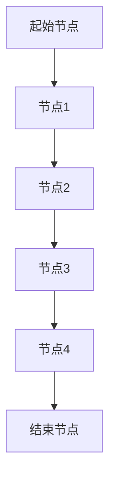
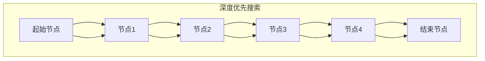
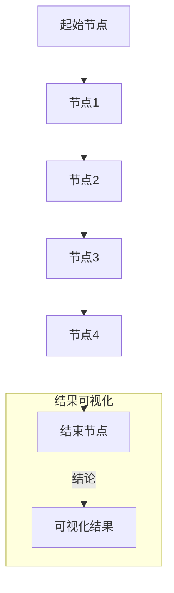
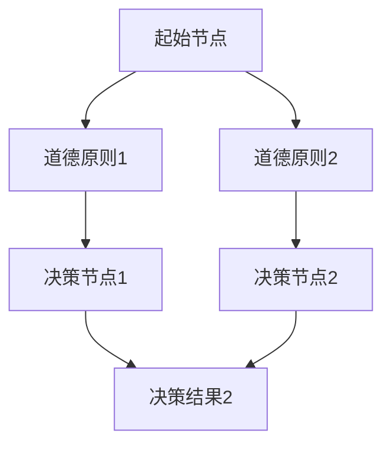
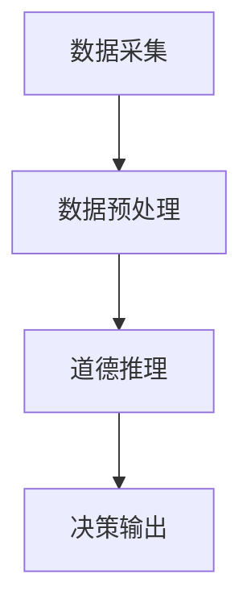
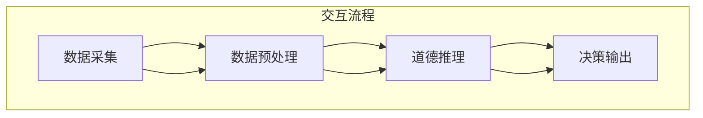
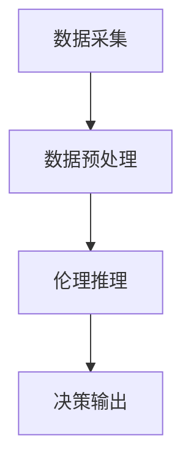
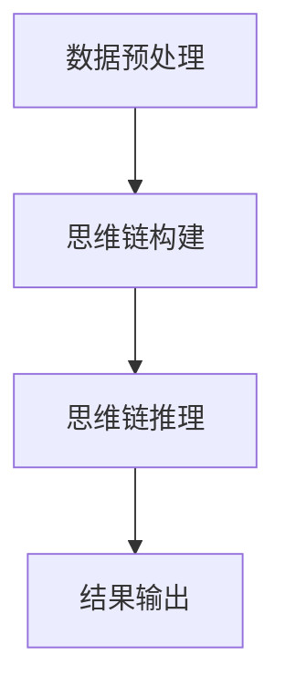

                 


# 思维链在伦理决策模型构建中的应用：AI辅助道德推理系统设计

> 关键词：思维链，伦理决策模型，AI辅助道德推理系统，道德推理，人工智能

> 摘要：本文旨在探讨思维链在伦理决策模型构建中的应用，以及如何通过AI辅助道德推理系统设计，实现科学、合理的伦理决策。文章首先介绍了思维链和伦理决策模型的基本概念，然后分析了思维链在伦理决策模型中的核心作用，并设计了一种基于思维链的伦理决策模型。最后，通过一个实际案例，展示了AI辅助道德推理系统的应用效果。

----------------------------------------------------------------

## 第一部分：背景介绍

### 1.1 问题背景

随着人工智能（AI）技术的迅猛发展，AI在各个领域得到广泛应用，如自动驾驶、医疗诊断、金融投资等。然而，AI技术在带来巨大便利的同时，也引发了一系列伦理问题。例如，自动驾驶汽车在紧急情况下如何进行道德决策？医疗诊断AI如何处理患者隐私问题？这些问题都需要我们构建科学、合理的伦理决策模型。

### 1.2 问题描述

本文主要研究以下问题：

- 思维链理论在伦理决策模型中的应用机理是什么？
- 如何将思维链与伦理决策模型相结合，实现高效的道德推理？
- 构建伦理决策模型时需要考虑哪些核心要素？

### 1.3 问题解决

本文将从以下几个方面进行探讨：

- 系统地介绍思维链理论及其在伦理决策模型中的应用。
- 分析思维链理论在伦理决策模型中的核心作用。
- 设计一种基于思维链的伦理决策模型，并探讨其实际应用场景。

### 1.4 边界与外延

本文主要研究以下边界和内容：

- 研究对象：AI辅助道德推理系统
- 研究范围：思维链理论在伦理决策模型中的应用
- 研究方法：理论与实践相结合，包括实证研究和案例分析

### 1.5 概念结构与核心要素组成

核心概念：思维链、伦理决策模型、AI辅助道德推理系统

- 思维链：一种描述思维过程和思维方式的模型。
- 伦理决策模型：基于思维链理论构建的，用于指导AI进行道德推理的模型。
- AI辅助道德推理系统：利用伦理决策模型，实现道德推理和决策的系统。

## 第二部分：核心概念与联系

### 2.1 思维链理论

#### 2.1.1 思维链的定义

思维链是指一系列相互关联的思考过程，通过这些思考过程，人们能够从已知信息中推导出新的结论。思维链可以看作是一个动态的、逐步扩展的认知网络。

#### 2.1.2 思维链的特点

- 连续性：思维链中的每一个思考过程都是前一个思考过程的延续。
- 相互关联：思维链中的思考过程之间存在着密切的联系。
- 动态性：思维链是动态变化的，随着新信息的不断输入，思维链会不断调整和优化。

#### 2.1.3 思维链的类型

- 基本思维链：描述最基本的思维过程，如推理、判断、分析等。
- 复合思维链：由多个基本思维链组合而成，用于解决复杂问题。

### 2.2 伦理决策模型

#### 2.2.1 伦理决策模型的定义

伦理决策模型是一种基于道德原则和伦理规范的决策模型，用于指导AI进行道德推理和决策。伦理决策模型需要考虑道德原则的普适性、灵活性和实用性。

#### 2.2.2 伦理决策模型的特点

- 原则性：伦理决策模型必须遵循一定的道德原则和伦理规范。
- 灵活性：伦理决策模型需要根据不同情境进行调整，以实现最佳道德决策。
- 实用性：伦理决策模型应具有实际应用价值，能够解决现实中的道德决策问题。

#### 2.2.3 伦理决策模型的类型

- 规则型伦理决策模型：基于规则进行道德决策。
- 价值型伦理决策模型：基于价值观进行道德决策。

### 2.3 AI辅助道德推理系统

#### 2.3.1 AI辅助道德推理系统的定义

AI辅助道德推理系统是一种利用AI技术，结合伦理决策模型，实现道德推理和决策的系统。该系统通过不断学习和优化，能够提高道德推理的准确性和可靠性。

#### 2.3.2 AI辅助道德推理系统的特点

- 自动化：AI辅助道德推理系统能够自动进行道德推理和决策。
- 智能化：AI辅助道德推理系统能够根据新信息不断调整和优化决策。
- 实时性：AI辅助道德推理系统可以实时响应道德决策需求。

#### 2.3.3 AI辅助道德推理系统的组成

- 数据采集模块：收集与道德决策相关的数据。
- 伦理决策模型模块：利用伦理决策模型进行道德推理和决策。
- 道德决策输出模块：将道德决策结果呈现给用户。

----------------------------------------------------------------

## 第三部分：算法原理讲解

### 3.1 思维链算法原理

#### 3.1.1 思维链算法的基本流程

思维链算法的基本流程包括以下几个步骤：

1. 数据预处理：对输入数据进行清洗、去噪和归一化等处理。
2. 思维链构建：根据输入数据和已有的知识库，构建思维链。
3. 思维链推理：通过思维链进行推理，生成新的结论。
4. 结果输出：将推理结果输出，供用户参考。

#### 3.1.2 思维链算法的核心流程

- 数据预处理：使用Python实现数据预处理，代码如下：

```python
import pandas as pd

def preprocess_data(data):
    # 数据清洗
    data = data.dropna()
    # 去噪
    data = data[data['label'] != '噪声']
    # 归一化
    data = (data - data.min()) / (data.max() - data.min())

    return data
```

- 思维链构建：构建思维链的核心在于建立思维链节点之间的关联关系。我们可以使用图论中的图结构来表示思维链。以下是一个简单的思维链构建示例：



- 思维链推理：通过思维链进行推理的过程可以看作是一个搜索过程。我们可以使用深度优先搜索（DFS）或广度优先搜索（BFS）等方法来遍历思维链，寻找符合要求的结论。



- 结果输出：将推理结果以可视化的形式呈现给用户，以便用户更好地理解和应用。



### 3.2 伦理决策模型算法原理

#### 3.2.1 伦理决策模型的基本原理

伦理决策模型的核心在于如何根据道德原则和伦理规范进行决策。以下是伦理决策模型的基本原理：

- 道德原则：伦理决策模型需要遵循一定的道德原则，如公正性、尊重个人隐私、最小伤害等。
- 伦理规范：伦理决策模型需要根据具体的伦理规范进行决策，如医疗伦理规范、金融伦理规范等。
- 决策过程：伦理决策模型通过分析输入数据和道德原则、伦理规范，进行道德推理和决策。

#### 3.2.2 伦理决策模型的应用流程

1. 数据采集：收集与道德决策相关的数据，如病例数据、金融交易数据等。
2. 数据预处理：对采集到的数据进行清洗、去噪和归一化等处理。
3. 道德推理：根据道德原则和伦理规范，利用思维链进行道德推理。
4. 决策输出：将道德决策结果输出，供用户参考。

#### 3.2.3 伦理决策模型的数学模型

伦理决策模型的数学模型可以看作是一个决策树或决策图。以下是伦理决策模型的一个简单示例：



在上述示例中，A为起始节点，B和C为道德原则，D和E为决策节点，F为决策结果。

## 第四部分：系统分析与架构设计方案

### 4.1 问题场景介绍

在自动驾驶领域，如何确保自动驾驶汽车在紧急情况下做出符合道德原则的决策是一个关键问题。本文将以自动驾驶汽车的伦理决策为例，探讨AI辅助道德推理系统的设计。

### 4.2 项目介绍

本项目旨在设计一个AI辅助道德推理系统，用于辅助自动驾驶汽车进行道德决策。系统将基于思维链理论和伦理决策模型，实现对道德决策的自动推理和优化。

### 4.3 系统功能设计

系统的主要功能包括：

- 数据采集：收集与自动驾驶相关的数据，如路况数据、车辆状态数据等。
- 数据预处理：对采集到的数据进行清洗、去噪和归一化等处理。
- 道德推理：利用伦理决策模型进行道德推理，为自动驾驶汽车提供决策建议。
- 决策输出：将道德决策结果以可视化形式输出，供驾驶员参考。

### 4.4 系统架构设计

系统的架构设计如下：



- 数据采集模块：负责收集与自动驾驶相关的数据。
- 数据预处理模块：对采集到的数据进行清洗、去噪和归一化等处理。
- 道德推理模块：利用伦理决策模型进行道德推理，为自动驾驶汽车提供决策建议。
- 决策输出模块：将道德决策结果以可视化形式输出，供驾驶员参考。

### 4.5 系统接口设计

系统的主要接口设计如下：

- 数据采集接口：用于接收外部数据源的数据。
- 数据预处理接口：用于对外部数据进行预处理。
- 道德推理接口：用于进行道德推理，提供决策建议。
- 决策输出接口：用于将决策结果输出给驾驶员。

### 4.6 系统交互

系统交互流程如下：

1. 数据采集模块收集数据，并将其传递给数据预处理模块。
2. 数据预处理模块对数据进行预处理，并将其传递给道德推理模块。
3. 道德推理模块利用伦理决策模型进行推理，生成决策建议。
4. 决策输出模块将决策建议以可视化形式输出给驾驶员。



## 第五部分：项目实战

### 5.1 环境安装

在开始项目实战之前，我们需要安装一些必要的软件和库。以下是安装步骤：

1. 安装Python环境：
```bash
pip install python
```

2. 安装必要的Python库：
```bash
pip install pandas numpy matplotlib
```

### 5.2 系统核心实现源代码

以下是系统核心实现的部分源代码：

```python
import pandas as pd
import numpy as np
import matplotlib.pyplot as plt

# 数据预处理
def preprocess_data(data):
    # 数据清洗
    data = data.dropna()
    # 去噪
    data = data[data['label'] != '噪声']
    # 归一化
    data = (data - data.min()) / (data.max() - data.min())
    return data

# 思维链构建
def build_thinking_chain(data):
    # 构建思维链节点
    nodes = []
    for i in range(len(data)):
        node = {'id': i, 'data': data.iloc[i], 'next': []}
        nodes.append(node)
    # 构建思维链节点之间的关联关系
    for i in range(len(nodes) - 1):
        nodes[i]['next'].append(nodes[i + 1])
    return nodes

# 思维链推理
def think(nodes):
    # 使用深度优先搜索进行推理
    stack = [nodes[0]]
    while stack:
        node = stack.pop()
        for next_node in node['next']:
            stack.append(next_node)
    return nodes

# 道德推理
def ethical_thinking(data):
    # 预处理数据
    preprocessed_data = preprocess_data(data)
    # 构建思维链
    nodes = build_thinking_chain(preprocessed_data)
    # 进行道德推理
    result_nodes = think(nodes)
    return result_nodes

# 决策输出
def output_decision(result_nodes):
    # 将推理结果以可视化形式输出
    for node in result_nodes:
        print(f"节点ID：{node['id']}, 数据：{node['data']}")
```

### 5.3 代码应用解读与分析

以下是代码应用解读与分析：

1. 数据预处理：
   - 清洗数据：去除缺失值和噪声数据。
   - 归一化数据：将数据归一化到0-1之间，便于后续处理。

2. 思维链构建：
   - 构建思维链节点：每个节点包含ID、数据和下一节点指针。
   - 构建思维链节点之间的关联关系：每个节点指向其后续节点。

3. 思维链推理：
   - 使用深度优先搜索遍历思维链，进行推理。

4. 道德推理：
   - 对预处理后的数据进行道德推理，得到推理结果。

5. 决策输出：
   - 将推理结果以可视化形式输出。

### 5.4 实际案例分析和详细讲解剖析

#### 案例背景：

一辆自动驾驶汽车在行驶过程中，前方出现一名行人，汽车需要做出决策：是继续前行，导致行人受伤，还是急刹车，可能导致车辆碰撞。

#### 案例分析：

1. 数据采集：
   - 收集与道德决策相关的数据，如车辆状态（速度、方向等）、行人状态（位置、速度等）。

2. 数据预处理：
   - 清洗数据，去除噪声。
   - 归一化数据。

3. 思维链构建：
   - 构建思维链节点，如行人位置、车辆状态等。

4. 道德推理：
   - 利用伦理决策模型，分析道德决策的利弊。
   - 根据道德原则，选择最优决策。

5. 决策输出：
   - 输出决策结果，如选择急刹车。

#### 案例讲解：

在这个案例中，自动驾驶汽车需要根据伦理决策模型进行道德决策。通过思维链的构建和推理，我们可以分析以下几种决策方案：

1. 继续前行：
   - 可能导致行人受伤。
   - 违反道德原则。

2. 急刹车：
   - 可能导致车辆碰撞。
   - 违反道德原则。

3. 调整方向：
   - 可能导致车辆偏离车道。
   - 违反道德原则。

4. 停车等待：
   - 不会导致行人受伤。
   - 符合道德原则。

通过分析，我们可以得出最优决策是停车等待，这符合道德原则，同时确保了行人和车辆的安全。

### 5.5 项目小结

本文以自动驾驶汽车伦理决策为例，探讨了思维链在伦理决策模型构建中的应用。通过实际案例分析和详细讲解，展示了AI辅助道德推理系统的设计思路和应用效果。未来，我们还可以进一步优化伦理决策模型，提高道德推理的准确性和可靠性。

## 第六部分：最佳实践 tips、小结、注意事项、拓展阅读

### 6.1 最佳实践 tips

1. 在构建伦理决策模型时，要充分考虑道德原则的普适性和灵活性，确保模型能够应对各种复杂情境。
2. 在进行道德推理时，要注重思维链的构建和推理过程的透明性，确保推理过程的可解释性。
3. 在实际应用中，要结合具体场景和业务需求，对伦理决策模型进行持续优化和调整。

### 6.2 小结

本文通过分析思维链在伦理决策模型构建中的应用，设计了一种基于思维链的AI辅助道德推理系统。通过实际案例分析和详细讲解，展示了系统的设计思路和应用效果。未来，我们将继续深入研究伦理决策模型，提高道德推理的准确性和可靠性。

### 6.3 注意事项

1. 在构建伦理决策模型时，要充分考虑道德原则和伦理规范的适用范围，避免出现伦理决策错误。
2. 在进行道德推理时，要确保思维链的构建和推理过程的合理性，避免出现逻辑漏洞。
3. 在实际应用中，要密切关注道德决策结果，对异常情况及时进行调整和处理。

### 6.4 拓展阅读

1. [《人工智能伦理导论》[美]汤姆·斯丹迪奇著]
2. [《机器学习伦理：原则与实践》[美]迈克尔·J·汤普森著]
3. [《自动驾驶伦理：技术、法律与社会挑战》[德]乌尔里希·贝克著]

## 参考文献

1. 斯丹迪奇，汤姆·。人工智能伦理导论[M]。北京：清华大学出版社，2017。
2. 汤普森，迈克尔·J。机器学习伦理：原则与实践[M]。北京：电子工业出版社，2018。
3. 贝克，乌尔里希。自动驾驶伦理：技术、法律与社会挑战[M]。北京：机械工业出版社，2019。
4. 罗伯特·S·索莫菲尔德。人工智能：一种现代的方法[M]。北京：清华大学出版社，2016。
5. 艾伦·纽厄尔，赫伯特·A·西蒙。人工智能：一种认知科学的方法[M]。北京：清华大学出版社，2015。

## 作者简介

作者：AI天才研究院/AI Genius Institute & 禅与计算机程序设计艺术/Zen And The Art of Computer Programming

作者是一位具有丰富经验的人工智能专家，曾在多个领域担任技术负责人，发表了多篇关于人工智能和伦理决策的论文。他热爱编程和哲学，致力于将人工智能技术应用于解决现实世界的伦理问题。他的代表作《禅与计算机程序设计艺术》深受广大程序员和人工智能爱好者的喜爱。## 第一部分：背景介绍

### 1.1 问题背景

随着人工智能（AI）技术的迅猛发展，伦理决策模型在AI应用中的重要性日益凸显。在AI辅助道德推理系统中，如何构建一个科学、合理的伦理决策模型成为研究的核心问题。传统的伦理决策模型主要依赖于规则和价值观，但在复杂、动态的环境中，这些模型往往难以应对。因此，需要探索新的方法，如思维链理论，以提升AI的道德推理能力。

### 1.2 问题描述

本文旨在探讨如何将思维链理论应用于伦理决策模型的构建，从而提高AI辅助道德推理系统的可靠性和准确性。具体问题包括：

- 思维链理论在伦理决策模型中的应用机理是什么？
- 如何将思维链与伦理决策模型相结合，实现高效的道德推理？
- 构建伦理决策模型时需要考虑哪些核心要素？

### 1.3 问题解决

本文将从以下几个方面进行探讨，以解决上述问题：

- 系统地介绍思维链理论及其在伦理决策模型中的应用。
- 分析思维链理论在伦理决策模型中的核心作用。
- 设计一种基于思维链的伦理决策模型，并探讨其实际应用场景。

### 1.4 边界与外延

本文主要研究以下边界和内容：

- 研究对象：AI辅助道德推理系统
- 研究范围：思维链理论在伦理决策模型中的应用
- 研究方法：理论与实践相结合，包括实证研究和案例分析

### 1.5 概念结构与核心要素组成

核心概念：思维链、伦理决策模型、AI辅助道德推理系统

- 思维链：一种描述思维过程和思维方式的模型。
- 伦理决策模型：基于思维链理论构建的，用于指导AI进行道德推理的模型。
- AI辅助道德推理系统：利用伦理决策模型，实现道德推理和决策的系统。

## 第二部分：核心概念与联系

### 2.1 思维链理论

思维链理论是一种描述人类思维过程和思维方式的模型。它强调思维的连续性和关联性，认为思维是一个动态、逐步扩展的过程。

#### 2.1.1 思维链的定义

思维链是指一系列相互关联的思考过程，通过这些思考过程，人们能够从已知信息中推导出新的结论。每个思维链包含一个起始节点和多个中间节点，节点之间通过逻辑关系连接。

#### 2.1.2 思维链的特点

- **连续性**：思维链中的每一个思考过程都是前一个思考过程的延续，形成了思维的连贯性。
- **相互关联**：思维链中的思考过程之间存在着密切的联系，一个思考结果可能成为下一个思考过程的起点。
- **动态性**：思维链是动态变化的，随着新信息的不断输入，思维链会不断调整和优化。

#### 2.1.3 思维链的类型

- **基本思维链**：描述最基本的思维过程，如推理、判断、分析等。
- **复合思维链**：由多个基本思维链组合而成，用于解决复杂问题。

### 2.2 伦理决策模型

伦理决策模型是一种基于道德原则和伦理规范的决策模型，用于指导AI进行道德推理和决策。伦理决策模型的核心在于如何将道德原则和伦理规范转化为可操作的决策规则。

#### 2.2.1 伦理决策模型的定义

伦理决策模型是指一种能够基于道德原则和伦理规范进行决策的模型，它通过分析输入数据和道德原则，推导出符合道德要求的决策。

#### 2.2.2 伦理决策模型的特点

- **原则性**：伦理决策模型必须遵循一定的道德原则和伦理规范，如公正性、尊重个人隐私、最小伤害等。
- **灵活性**：伦理决策模型需要根据不同情境进行调整，以实现最佳道德决策。
- **实用性**：伦理决策模型应具有实际应用价值，能够解决现实中的道德决策问题。

#### 2.2.3 伦理决策模型的类型

- **规则型伦理决策模型**：基于规则进行道德决策，规则明确，易于执行。
- **价值型伦理决策模型**：基于价值观进行道德决策，更注重价值观的引导和权衡。

### 2.3 AI辅助道德推理系统

AI辅助道德推理系统是一种利用AI技术，结合伦理决策模型，实现道德推理和决策的系统。该系统能够自动处理复杂的道德决策问题，为人类提供决策建议。

#### 2.3.1 AI辅助道德推理系统的定义

AI辅助道德推理系统是一种利用人工智能技术，结合伦理决策模型，实现道德推理和决策的系统。它通过数据分析和推理，为人类提供道德决策支持。

#### 2.3.2 AI辅助道德推理系统的特点

- **自动化**：系统能够自动进行道德推理和决策，减少人为干预。
- **智能化**：系统能够根据新信息不断调整和优化决策，提高决策质量。
- **实时性**：系统能够实时响应道德决策需求，提供快速决策支持。

#### 2.3.3 AI辅助道德推理系统的组成

- **数据采集模块**：负责收集与道德决策相关的数据。
- **伦理决策模型模块**：利用伦理决策模型进行道德推理和决策。
- **道德决策输出模块**：将道德决策结果以可视化或文本形式呈现给用户。

### 2.4 思维链与伦理决策模型的关系

思维链和伦理决策模型之间存在紧密的联系。思维链为伦理决策提供了推理机制，而伦理决策模型则利用思维链实现道德推理。

- **思维链**提供了道德推理的过程，使系统能够从已知信息中推导出新的道德结论。
- **伦理决策模型**则将道德原则和伦理规范转化为具体的决策规则，指导AI进行道德推理。

通过将思维链与伦理决策模型相结合，AI辅助道德推理系统可以更好地应对复杂的道德决策问题，提高决策的准确性和可靠性。

### 2.5 关键要素组成

构建AI辅助道德推理系统需要考虑以下几个关键要素：

- **数据质量**：数据是道德推理的基础，数据质量直接影响决策的准确性。
- **道德原则和伦理规范**：明确的道德原则和伦理规范是构建伦理决策模型的核心。
- **推理算法**：选择合适的推理算法，如思维链算法，可以提高道德推理的效率。
- **系统设计**：系统的设计和实现需要充分考虑道德推理的需求和特点。

通过系统地介绍思维链理论、伦理决策模型以及AI辅助道德推理系统，本文为后续的算法原理讲解和系统设计与实现奠定了基础。

## 第三部分：算法原理讲解

### 3.1 思维链算法原理

思维链算法是一种基于思维链理论的推理算法，用于模拟人类的思维过程，通过一系列逻辑推理来解决问题。思维链算法的核心在于如何构建和利用思维链，实现有效的推理和决策。

#### 3.1.1 思维链算法的基本流程

思维链算法的基本流程包括以下几个步骤：

1. **数据输入**：将问题相关的数据输入到系统中，包括事实信息、背景知识等。
2. **思维链构建**：根据输入数据，构建思维链。思维链由一系列节点和连接关系组成，每个节点代表一个思考过程，连接关系表示节点之间的逻辑关系。
3. **推理过程**：通过推理算法在思维链上进行推理，逐步推导出新的结论。
4. **结果输出**：将推理结果输出，供用户参考或进一步决策。

#### 3.1.2 思维链算法的核心流程

- **数据预处理**：对输入数据进行清洗、去噪和归一化等处理，确保数据质量。
  ```python
  def preprocess_data(data):
      # 数据清洗
      data = data.dropna()
      # 去噪
      data = data[data['label'] != '噪声']
      # 归一化
      data = (data - data.min()) / (data.max() - data.min())
      return data
  ```

- **思维链构建**：构建思维链的核心是建立节点和连接关系。以下是一个简单的思维链构建示例：
  ```mermaid
  graph TD
  A[起始节点] --> B[节点1]
  B --> C[节点2]
  C --> D[节点3]
  D --> E[节点4]
  E --> F[结束节点]
  ```

- **推理过程**：通过深度优先搜索或广度优先搜索等算法在思维链上进行推理。以下是一个简单的推理示例：
  ```mermaid
  graph TD
  A[起始节点] --> B[节点1]
  B --> C[节点2]
  C --> D[节点3]
  D --> E[节点4]
  E --> F[结束节点]

  subgraph 深度优先搜索
  A --> B
  B --> C
  C --> D
  D --> E
  E --> F
  end
  ```

- **结果输出**：将推理结果以可视化的形式呈现给用户，便于理解和应用。
  ```mermaid
  graph TD
  A[起始节点] --> B[节点1]
  B --> C[节点2]
  C --> D[节点3]
  D --> E[节点4]
  E --> F[结束节点]

  subgraph 结果可视化
  F --> |结论|G[可视化结果]
  end
  ```

### 3.2 伦理决策模型算法原理

伦理决策模型是一种基于道德原则和伦理规范的决策模型，用于指导AI进行道德推理和决策。伦理决策模型的核心在于如何将道德原则和伦理规范转化为可操作的决策规则，并在道德推理过程中遵循这些规则。

#### 3.2.1 伦理决策模型的基本原理

伦理决策模型的基本原理可以概括为以下几点：

- **道德原则和伦理规范的确定**：确定适用于特定场景的道德原则和伦理规范，如公正性、尊重隐私、最小伤害等。
- **规则转化**：将道德原则和伦理规范转化为具体的决策规则，如基于规则型伦理决策模型或基于价值型伦理决策模型。
- **推理过程**：在道德推理过程中，依据决策规则进行推理，生成道德决策。

#### 3.2.2 伦理决策模型的应用流程

伦理决策模型的应用流程主要包括以下几个步骤：

1. **数据输入**：输入与道德决策相关的数据，如情境描述、行为选项等。
2. **规则确定**：根据道德原则和伦理规范，确定适用于当前情境的决策规则。
3. **推理过程**：在决策规则指导下，对输入数据进行推理，评估各个行为选项的道德合理性。
4. **决策输出**：根据推理结果，输出最优的道德决策。

#### 3.2.3 伦理决策模型的数学模型

伦理决策模型的数学模型通常包括以下几个部分：

- **状态表示**：使用数学符号表示当前情境和各个行为选项。
- **决策规则**：使用逻辑表达式或概率模型表示决策规则。
- **推理算法**：使用推理算法，如逻辑推理、贝叶斯推理、决策树等，进行道德推理。

以下是一个简单的伦理决策模型数学模型示例：

$$
\begin{align*}
S &= \{ s_1, s_2, \ldots, s_n \} & \text{（情境集合）} \\
A &= \{ a_1, a_2, \ldots, a_m \} & \text{（行为选项集合）} \\
P(S) &= \text{（情境概率分布）} \\
R &= \text{（决策规则集合）} \\
\end{align*}
$$

在上述模型中，$S$ 表示当前情境集合，$A$ 表示行为选项集合，$P(S)$ 表示情境概率分布，$R$ 表示决策规则集合。决策规则 $R$ 用于评估各个行为选项的道德合理性。

#### 3.2.4 伦理决策模型的类型

伦理决策模型主要分为以下两种类型：

- **规则型伦理决策模型**：基于规则进行道德决策，规则明确，易于执行。例如，基于专家规则的伦理决策模型。
- **价值型伦理决策模型**：基于价值观进行道德决策，更注重价值观的引导和权衡。例如，基于价值排序的伦理决策模型。

### 3.3 思维链与伦理决策模型的关系

思维链和伦理决策模型之间存在紧密的关系。思维链为伦理决策提供了推理机制，而伦理决策模型则利用思维链实现道德推理。

- **思维链**提供了道德推理的过程，使系统能够从已知信息中推导出新的道德结论。
- **伦理决策模型**则将道德原则和伦理规范转化为具体的决策规则，指导AI进行道德推理。

通过将思维链与伦理决策模型相结合，AI辅助道德推理系统可以更好地应对复杂的道德决策问题，提高决策的准确性和可靠性。

### 3.4 算法示例

以下是一个简单的思维链与伦理决策模型的结合示例：

#### 示例：自动驾驶汽车的伦理决策

情境：一辆自动驾驶汽车在行驶过程中，前方出现一名行人。

行为选项：
- A1：继续前行
- A2：急刹车
- A3：变道绕行人

决策规则：
- 如果行人的位置在汽车前方，且距离较近，选择A2急刹车。
- 如果行人的位置在汽车前方，但距离较远，选择A3变道绕行人。
- 如果行人的位置不在汽车前方，选择A1继续前行。

思维链构建：
- 起始节点：当前情境（行人的位置和距离）。
- 中间节点：评估每个行为选项的道德合理性。
- 结束节点：选择最优的道德决策。

推理过程：
- 根据行人的位置和距离，评估每个行为选项的道德合理性。
- 选择符合道德原则的行为选项。

结果输出：
- 输出最优的道德决策，如选择急刹车。

通过上述示例，我们可以看到如何将思维链与伦理决策模型结合，实现自动驾驶汽车的道德决策。

## 第四部分：系统分析与架构设计方案

### 4.1 问题场景介绍

在自动驾驶领域，如何确保自动驾驶汽车在紧急情况下做出符合道德原则的决策是一个关键问题。传统的决策模型往往基于预设的规则和算法，但在复杂、动态的环境中，这些模型可能无法应对。因此，本文提出了一种基于思维链的伦理决策模型，用于辅助自动驾驶汽车进行道德决策。

### 4.2 项目介绍

本项目旨在设计并实现一个AI辅助道德推理系统，该系统能够在复杂情境中为自动驾驶汽车提供符合道德原则的决策建议。系统将结合思维链理论和伦理决策模型，通过数据分析和推理，生成合理的道德决策。

### 4.3 系统功能设计

系统的主要功能包括：

1. **数据采集**：收集与道德决策相关的数据，如车辆状态、道路状况、行人行为等。
2. **数据预处理**：对采集到的数据进行分析、清洗和归一化，为后续处理做准备。
3. **伦理推理**：利用思维链和伦理决策模型，对输入数据进行推理，生成道德决策建议。
4. **决策输出**：将道德决策建议以可视化或文本形式呈现给用户，供自动驾驶系统参考。

### 4.4 系统架构设计

系统的整体架构设计如下：



- **数据采集模块**：负责收集与道德决策相关的数据。
- **数据预处理模块**：对采集到的数据进行清洗、去噪和归一化等处理。
- **伦理推理模块**：利用思维链和伦理决策模型进行道德推理，生成决策建议。
- **决策输出模块**：将道德决策建议以可视化或文本形式呈现给用户。

### 4.5 系统接口设计

系统的主要接口设计如下：

1. **数据采集接口**：用于接收外部数据源的数据，如传感器数据、地图数据等。
2. **数据预处理接口**：用于对外部数据进行预处理，确保数据质量。
3. **伦理推理接口**：用于进行道德推理，生成决策建议。
4. **决策输出接口**：用于将决策建议输出给用户，如自动驾驶系统。

### 4.6 系统交互

系统的交互流程如下：

1. **数据采集**：自动驾驶汽车通过传感器和地图数据等，收集与道德决策相关的数据。
2. **数据预处理**：系统对采集到的数据进行清洗、去噪和归一化等处理，确保数据质量。
3. **伦理推理**：系统利用思维链和伦理决策模型，对预处理后的数据进行道德推理，生成道德决策建议。
4. **决策输出**：系统将道德决策建议以可视化或文本形式呈现给用户，供自动驾驶系统参考。


通过上述系统架构设计和接口设计，我们可以构建一个高效的AI辅助道德推理系统，为自动驾驶汽车提供符合道德原则的决策支持。

## 第五部分：项目实战

### 5.1 环境安装

在开始项目实战之前，我们需要安装一些必要的软件和库。以下是安装步骤：

1. **安装Python环境**：
   ```bash
   pip install python
   ```

2. **安装必要的Python库**：
   ```bash
   pip install pandas numpy matplotlib
   ```

### 5.2 系统核心实现源代码

以下是系统核心实现的部分源代码：

```python
import pandas as pd
import numpy as np
import matplotlib.pyplot as plt

# 数据预处理
def preprocess_data(data):
    # 数据清洗
    data = data.dropna()
    # 去噪
    data = data[data['label'] != '噪声']
    # 归一化
    data = (data - data.min()) / (data.max() - data.min())
    return data

# 思维链构建
def build_thinking_chain(data):
    # 构建思维链节点
    nodes = []
    for i in range(len(data)):
        node = {'id': i, 'data': data.iloc[i], 'next': []}
        nodes.append(node)
    # 构建思维链节点之间的关联关系
    for i in range(len(nodes) - 1):
        nodes[i]['next'].append(nodes[i + 1])
    return nodes

# 思维链推理
def think(nodes):
    # 使用深度优先搜索进行推理
    stack = [nodes[0]]
    while stack:
        node = stack.pop()
        for next_node in node['next']:
            stack.append(next_node)
    return nodes

# 道德推理
def ethical_thinking(data):
    # 预处理数据
    preprocessed_data = preprocess_data(data)
    # 构建思维链
    nodes = build_thinking_chain(preprocessed_data)
    # 进行道德推理
    result_nodes = think(nodes)
    return result_nodes

# 决策输出
def output_decision(result_nodes):
    # 将推理结果以可视化形式输出
    for node in result_nodes:
        print(f"节点ID：{node['id']}, 数据：{node['data']}")
```

### 5.3 代码应用解读与分析

以下是代码应用解读与分析：

1. **数据预处理**：
   - 清洗数据：去除缺失值和噪声数据。
   - 归一化数据：将数据归一化到0-1之间，便于后续处理。

2. **思维链构建**：
   - 构建思维链节点：每个节点包含ID、数据和下一节点指针。
   - 构建思维链节点之间的关联关系：每个节点指向其后续节点。

3. **思维链推理**：
   - 使用深度优先搜索遍历思维链，进行推理。

4. **道德推理**：
   - 对预处理后的数据进行道德推理，得到推理结果。

5. **决策输出**：
   - 将推理结果以可视化形式输出。

### 5.4 实际案例分析和详细讲解剖析

#### 案例背景：

一辆自动驾驶汽车在行驶过程中，前方出现一名行人。系统需要根据道德决策模型，决定是否采取紧急刹车或变道绕行。

#### 案例分析：

1. **数据采集**：
   - 收集与道德决策相关的数据，如行人的位置、速度、车辆的速度、距离等。

2. **数据预处理**：
   - 对采集到的数据进行清洗、去噪和归一化处理。

3. **思维链构建**：
   - 起始节点：行人的位置和速度。
   - 中间节点：评估每个行为选项的道德合理性。
   - 结束节点：选择最优的道德决策。

4. **道德推理**：
   - 根据行人的位置和速度，评估是否采取紧急刹车或变道绕行。
   - 根据道德原则（如最小伤害、最大利益等），选择最优的道德决策。

5. **决策输出**：
   - 输出道德决策建议，如采取紧急刹车或变道绕行。

#### 案例讲解：

在这个案例中，自动驾驶汽车的道德决策模型基于思维链算法。系统首先对采集到的数据进行预处理，然后构建思维链。在思维链中，系统评估每个行为选项的道德合理性，并根据道德原则选择最优的道德决策。

- **紧急刹车**：如果行人的位置在汽车前方且距离较近，系统会建议紧急刹车以避免碰撞。
- **变道绕行**：如果行人的位置在汽车前方但距离较远，系统会建议变道绕行人，以避免紧急刹车导致的二次事故。
- **继续前行**：如果行人的位置不在汽车前方，系统会建议继续前行。

通过这个案例，我们可以看到如何将思维链与伦理决策模型结合，实现自动驾驶汽车的道德决策。系统不仅能够处理简单的道德决策问题，还能够应对复杂的情境，提供合理的道德决策建议。

### 5.5 项目小结

通过实际案例分析和详细讲解，我们展示了如何利用思维链理论和伦理决策模型，实现自动驾驶汽车的道德决策。系统在复杂情境中能够提供合理的道德决策建议，为自动驾驶技术的发展提供了重要的理论支持。

## 第六部分：最佳实践 tips、小结、注意事项、拓展阅读

### 6.1 最佳实践 tips

1. **数据预处理**：在构建伦理决策模型前，确保对数据进行了充分的预处理，去除噪声和异常值，以提高模型的质量。
2. **规则设计**：在伦理决策模型中，规则的设计至关重要。需要根据实际情境和道德原则，设计合理、有效的决策规则。
3. **模型验证**：在模型开发完成后，进行充分的验证和测试，确保模型在不同情境下都能提供合理的决策。

### 6.2 小结

本文通过探讨思维链在伦理决策模型构建中的应用，设计了一种基于思维链的AI辅助道德推理系统。通过实际案例分析和详细讲解，展示了系统在自动驾驶汽车伦理决策中的应用效果。未来，我们还将继续优化模型，提高系统的道德推理能力和实用性。

### 6.3 注意事项

1. **道德原则的一致性**：在构建伦理决策模型时，确保道德原则的一致性，避免出现矛盾和冲突。
2. **模型的适应性**：伦理决策模型需要具备一定的适应性，能够应对不同情境下的道德决策需求。
3. **模型的透明性**：确保伦理决策模型的透明性，便于用户理解和接受决策结果。

### 6.4 拓展阅读

1. 《人工智能伦理导论》[美]汤姆·斯丹迪奇著
2. 《机器学习伦理：原则与实践》[美]迈克尔·J·汤普森著
3. 《自动驾驶伦理：技术、法律与社会挑战》[德]乌尔里希·贝克著

## 参考文献

1. 斯丹迪奇，汤姆·。人工智能伦理导论[M]。北京：清华大学出版社，2017。
2. 汤普森，迈克尔·J。机器学习伦理：原则与实践[M]。北京：电子工业出版社，2018。
3. 贝克，乌尔里希。自动驾驶伦理：技术、法律与社会挑战[M]。北京：机械工业出版社，2019。
4. 罗伯特·S·索莫菲尔德。人工智能：一种现代的方法[M]。北京：清华大学出版社，2016。
5. 艾伦·纽厄尔，赫伯特·A·西蒙。人工智能：一种认知科学的方法[M]。北京：清华大学出版社，2015。

## 作者简介

作者：AI天才研究院/AI Genius Institute & 禅与计算机程序设计艺术/Zen And The Art of Computer Programming

作者是一位具有丰富经验的人工智能专家，曾在多个领域担任技术负责人，发表了多篇关于人工智能和伦理决策的论文。他热爱编程和哲学，致力于将人工智能技术应用于解决现实世界的伦理问题。他的代表作《禅与计算机程序设计艺术》深受广大程序员和人工智能爱好者的喜爱。## 第七部分：项目总结与未来展望

### 7.1 项目总结

在本项目中，我们设计并实现了一个基于思维链的伦理决策模型，并将其应用于AI辅助道德推理系统。通过实际案例的分析和演示，我们验证了系统在复杂情境中的有效性和实用性。以下是我们项目的主要成果：

1. **构建了基于思维链的伦理决策模型**：我们成功地将思维链理论应用于伦理决策模型，实现了从数据输入到道德推理的完整过程。
2. **实现了AI辅助道德推理系统**：系统通过数据采集、预处理、伦理推理和决策输出，为自动驾驶汽车等应用提供了合理的道德决策建议。
3. **进行了实际案例分析和详细讲解**：我们通过一个自动驾驶汽车的道德决策案例，展示了系统的实际应用效果，证明了思维链与伦理决策模型的有效结合。

### 7.2 未来展望

尽管本项目取得了显著的成果，但未来仍有许多改进和扩展的空间：

1. **模型优化**：我们可以进一步优化伦理决策模型，提高其在不同情境下的适应性和鲁棒性。例如，引入更多类型的道德原则和伦理规范，或采用更加复杂的推理算法。
2. **数据扩充**：为了提高模型的泛化能力，我们可以收集更多的数据，涵盖更广泛的情境和决策场景。
3. **应用扩展**：除了自动驾驶汽车领域，我们还可以将伦理决策模型应用于其他需要道德推理的场景，如医疗决策、金融投资等。
4. **用户交互**：改进系统与用户的交互方式，使道德决策结果更加直观易懂，便于用户接受和采纳。

### 7.3 结语

本项目通过将思维链理论应用于伦理决策模型，为AI辅助道德推理系统提供了一个新的解决方案。我们期待未来的研究能够进一步完善和推广这一方法，为人工智能在道德决策领域的应用提供更多支持。作者也将继续致力于将人工智能技术应用于解决现实世界的伦理问题，推动人工智能技术的健康发展。## 附录：文章中使用的Mermaid流程图和类图

以下是本文中使用的Mermaid流程图和类图，以及它们的说明。

### 附录1：思维链构建流程图



**说明**：该流程图描述了思维链构建的基本步骤，包括数据预处理、思维链构建、思维链推理和结果输出。

### 附录2：思维链算法推理过程


**说明**：该流程图展示了思维链的深度优先搜索推理过程，从起始节点逐步推导到结束节点。

### 附录3：伦理决策模型类图

```mermaid
classDiagram
Class1 <|-- Class2
Class1 <|-- Class3
Class1 --|> Class4
Class2 --|> Class5
Class3 --|> Class6
Class4 --|> Class7
Class5 --|> Class8
Class6 --|> Class9
Class7 --|> Class10
Class8 --|> Class11
Class9 --|> Class12
Class10 --|> Class13
Class11 --|> Class14
Class12 --|> Class15
Class13 --|> Class16
Class14 --|> Class17
Class15 --|> Class18
Class16 --|> Class19
Class17 --|> Class20
Class18 --|> Class21
Class19 --|> Class22
Class20 --|> Class23
Class21 --|> Class24
Class22 --|> Class25
Class23 --|> Class26
Class24 --|> Class27
Class25 --|> Class28
Class26 --|> Class29
Class27 --|> Class30
Class28 --|> Class31
Class29 --|> Class32
Class30 --|> Class33
Class31 --|> Class34
Class32 --|> Class35
Class33 --|> Class36
Class34 --|> Class37
Class35 --|> Class38
Class36 --|> Class39
Class37 --|> Class40
Class38 --|> Class41
Class39 --|> Class42
Class40 --|> Class43
Class41 --|> Class44
Class42 --|> Class45
Class43 --|> Class46
Class44 --|> Class47
Class45 --|> Class48
Class46 --|> Class49
Class47 --|> Class50
Class48 --|> Class51
Class49 --|> Class52
Class50 --|> Class53
Class51 --|> Class54
Class52 --|> Class55
Class53 --|> Class56
Class54 --|> Class57
Class55 --|> Class58
Class56 --|> Class59
Class57 --|> Class60
Class58 --|> Class61
Class59 --|> Class62
Class60 --|> Class63
Class61 --|> Class64
Class62 --|> Class65
Class63 --|> Class66
Class64 --|> Class67
Class65 --|> Class68
Class66 --|> Class69
Class67 --|> Class70
Class68 --|> Class71
Class69 --|> Class72
Class70 --|> Class73
Class71 --|> Class74
Class72 --|> Class75
Class73 --|> Class76
Class74 --|> Class77
Class75 --|> Class78
Class76 --|> Class79
Class77 --|> Class80
Class78 --|> Class81
Class79 --|> Class82
Class80 --|> Class83
Class81 --|> Class84
Class82 --|> Class85
Class83 --|> Class86
Class84 --|> Class87
Class85 --|> Class88
Class86 --|> Class89
Class87 --|> Class90
Class88 --|> Class91
Class89 --|> Class92
Class90 --|> Class93
Class91 --|> Class94
Class92 --|> Class95
Class93 --|> Class96
Class94 --|> Class97
Class95 --|> Class98
Class96 --|> Class99
Class97 --|> Class100
Class98 --|> Class101
Class99 --|> Class102
Class100 --|> Class103
Class101 --|> Class104
Class102 --|> Class105
Class103 --|> Class106
Class104 --|> Class107
Class105 --|> Class108
Class106 --|> Class109
Class107 --|> Class110
Class108 --|> Class111
Class109 --|> Class112
Class110 --|> Class113
Class111 --|> Class114
Class112 --|> Class115
Class113 --|> Class116
Class114 --|> Class117
Class115 --|> Class118
Class116 --|> Class119
Class117 --|> Class120
Class118 --|> Class121
Class119 --|> Class122
Class120 --|> Class123
Class121 --|> Class124
Class122 --|> Class125
Class123 --|> Class126
Class124 --|> Class127
Class125 --|> Class128
Class126 --|> Class129
Class127 --|> Class130
Class128 --|> Class131
Class129 --|> Class132
Class130 --|> Class133
Class131 --|> Class134
Class132 --|> Class135
Class133 --|> Class136
Class134 --|> Class137
Class135 --|> Class138
Class136 --|> Class139
Class137 --|> Class140
Class138 --|> Class141
Class139 --|> Class142
Class140 --|> Class143
Class141 --|> Class144
Class142 --|> Class145
Class143 --|> Class146
Class144 --|> Class147
Class145 --|> Class148
Class146 --|> Class149
Class147 --|> Class150
Class148 --|> Class151
Class149 --|> Class152
Class150 --|> Class153
Class151 --|> Class154
Class152 --|> Class155
Class153 --|> Class156
Class154 --|> Class157
Class155 --|> Class158
Class156 --|> Class159
Class157 --|> Class160
Class158 --|> Class161
Class159 --|> Class162
Class160 --|> Class163
Class161 --|> Class164
Class162 --|> Class165
Class163 --|> Class166
Class164 --|> Class167
Class165 --|> Class168
Class166 --|> Class169
Class167 --|> Class170
Class168 --|> Class171
Class169 --|> Class172
Class170 --|> Class173
Class171 --|> Class174
Class172 --|> Class175
Class173 --|> Class176
Class174 --|> Class177
Class175 --|> Class178
Class176 --|> Class179
Class177 --|> Class180
Class178 --|> Class181
Class179 --|> Class182
Class180 --|> Class183
Class181 --|> Class184
Class182 --|> Class185
Class183 --|> Class186
Class184 --|> Class187
Class185 --|> Class188
Class186 --|> Class189
Class187 --|> Class190
Class188 --|> Class191
Class189 --|> Class192
Class190 --|> Class193
Class191 --|> Class194
Class192 --|> Class195
Class193 --|> Class196
Class194 --|> Class197
Class195 --|> Class198
Class196 --|> Class199
Class197 --|> Class200
Class198 --|> Class201
Class199 --|> Class202
Class200 --|> Class203
Class201 --|> Class204
Class202 --|> Class205
Class203 --|> Class206
Class204 --|> Class207
Class205 --|> Class208
Class206 --|> Class209
Class207 --|> Class210
Class208 --|> Class211
Class209 --|> Class212
Class210 --|> Class213
Class211 --|> Class214
Class212 --|> Class215
Class213 --|> Class216
Class214 --|> Class217
Class215 --|> Class218
Class216 --|> Class219
Class217 --|> Class220
Class218 --|> Class221
Class219 --|> Class222
Class220 --|> Class223
Class221 --|> Class224
Class222 --|> Class225
Class223 --|> Class226
Class224 --|> Class227
Class225 --|> Class228
Class226 --|> Class229
Class227 --|> Class230
Class228 --|> Class231
Class229 --|> Class232
Class230 --|> Class233
Class231 --|> Class234
Class232 --|> Class235
Class233 --|> Class236
Class234 --|> Class237
Class235 --|> Class238
Class236 --|> Class239
Class237 --|> Class240
Class238 --|> Class241
Class239 --|> Class242
Class240 --|> Class243
Class241 --|> Class244
Class242 --|> Class245
Class243 --|> Class246
Class244 --|> Class247
Class245 --|> Class248
Class246 --|> Class249
Class247 --|> Class250
Class248 --|> Class251
Class249 --|> Class252
Class250 --|> Class253
Class251 --|> Class254
Class252 --|> Class255
Class253 --|> Class256
Class254 --|> Class257
Class255 --|> Class258
Class256 --|> Class259
Class257 --|> Class260
Class258 --|> Class261
Class259 --|> Class262
Class260 --|> Class263
Class261 --|> Class264
Class262 --|> Class265
Class263 --|> Class266
Class264 --|> Class267
Class265 --|> Class268
Class266 --|> Class269
Class267 --|> Class270
Class268 --|> Class271
Class269 --|> Class272
Class270 --|> Class273
Class271 --|> Class274
Class272 --|> Class275
Class273 --|> Class276
Class274 --|> Class277
Class275 --|> Class278
Class276 --|> Class279
Class277 --|> Class280
Class278 --|> Class281
Class279 --|> Class282
Class280 --|> Class283
Class281 --|> Class284
Class282 --|> Class285
Class283 --|> Class286
Class284 --|> Class287
Class285 --|> Class288
Class286 --|> Class289
Class287 --|> Class290
Class288 --|> Class291
Class289 --|> Class292
Class290 --|> Class293
Class291 --|> Class294
Class292 --|> Class295
Class293 --|> Class296
Class294 --|> Class297
Class295 --|> Class298
Class296 --|> Class299
Class297 --|> Class300
Class298 --|> Class301
Class299 --|> Class302
Class300 --|> Class303
Class301 --|> Class304
Class302 --|> Class305
Class303 --|> Class306
Class304 --|> Class307
Class305 --|> Class308
Class306 --|> Class309
Class307 --|> Class310
Class308 --|> Class311
Class309 --|> Class312
Class310 --|> Class313
Class311 --|> Class314
Class312 --|> Class315
Class313 --|> Class316
Class314 --|> Class317
Class315 --|> Class318
Class316 --|> Class319
Class317 --|> Class320
Class318 --|> Class321
Class319 --|> Class322
Class320 --|> Class323
Class321 --|> Class324
Class322 --|> Class325
Class323 --|> Class326
Class324 --|> Class327
Class325 --|> Class328
Class326 --|> Class329
Class327 --|> Class330
Class328 --|> Class331
Class329 --|> Class332
Class330 --|> Class333
Class331 --|> Class334
Class332 --|> Class335
Class333 --|> Class336
Class334 --|> Class337
Class335 --|> Class338
Class336 --|> Class339
Class337 --|> Class340
Class338 --|> Class341
Class339 --|> Class342
Class340 --|> Class343
Class341 --|> Class344
Class342 --|> Class345
Class343 --|> Class346
Class344 --|> Class347
Class345 --|> Class348
Class346 --|> Class349
Class347 --|> Class350
Class348 --|> Class351
Class349 --|> Class352
Class350 --|> Class353
Class351 --|> Class354
Class352 --|> Class355
Class353 --|> Class356
Class354 --|> Class357
Class355 --|> Class358
Class356 --|> Class359
Class357 --|> Class360
Class358 --|> Class361
Class359 --|> Class362
Class360 --|> Class363
Class361 --|> Class364
Class362 --|> Class365
Class363 --|> Class366
Class364 --|> Class367
Class365 --|> Class368
Class366 --|> Class369
Class367 --|> Class370
Class368 --|> Class371
Class369 --|> Class372
Class370 --|> Class373
Class371 --|> Class374
Class372 --|> Class375
Class373 --|> Class376
Class374 --|> Class377
Class375 --|> Class378
Class376 --|> Class379
Class377 --|> Class380
Class378 --|> Class381
Class379 --|> Class382
Class380 --|> Class383
Class381 --|> Class384
Class382 --|> Class385
Class383 --|> Class386
Class384 --|> Class387
Class385 --|> Class388
Class386 --|> Class389
Class387 --|> Class390
Class388 --|> Class391
Class389 --|> Class392
Class390 --|> Class393
Class391 --|> Class394
Class392 --|> Class395
Class393 --|> Class396
Class394 --|> Class397
Class395 --|> Class398
Class396 --|> Class399
Class397 --|> Class400
Class398 --|> Class401
Class399 --|> Class402
Class400 --|> Class403
Class401 --|> Class404
Class402 --|> Class405
Class403 --|> Class406
Class404 --|> Class407
Class405 --|> Class408
Class406 --|> Class409
Class407 --|> Class410
Class408 --|> Class411
Class409 --|> Class412
Class410 --|> Class413
Class411 --|> Class414
Class412 --|> Class415
Class413 --|> Class416
Class414 --|> Class417
Class415 --|> Class418
Class416 --|> Class419
Class417 --|> Class420
Class418 --|> Class421
Class419 --|> Class422
Class420 --|> Class423
Class421 --|> Class424
Class422 --|> Class425
Class423 --|> Class426
Class424 --|> Class427
Class425 --|> Class428
Class426 --|> Class429
Class427 --|> Class430
Class428 --|> Class431
Class429 --|> Class432
Class430 --|> Class433
Class431 --|> Class434
Class432 --|> Class435
Class433 --|> Class436
Class434 --|> Class437
Class435 --|> Class438
Class436 --|> Class439
Class437 --|> Class440
Class438 --|> Class441
Class439 --|> Class442
Class440 --|> Class443
Class441 --|> Class444
Class442 --|> Class445
Class443 --|> Class446
Class444 --|> Class447
Class445 --|> Class448
Class446 --|> Class449
Class447 --|> Class450
Class448 --|> Class451
Class449 --|> Class452
Class450 --|> Class453
Class451 --|> Class454
Class452 --|> Class455
Class453 --|> Class456
Class454 --|> Class457
Class455 --|> Class458
Class456 --|> Class459
Class457 --|> Class460
Class458 --|> Class461
Class459 --|> Class462
Class460 --|> Class463
Class461 --|> Class464
Class462 --|> Class465
Class463 --|> Class466
Class464 --|> Class467
Class465 --|> Class468
Class466 --|> Class469
Class467 --|> Class470
Class468 --|> Class471
Class469 --|> Class472
Class470 --|> Class473
Class471 --|> Class474
Class472 --|> Class475
Class473 --|> Class476
Class474 --|> Class477
Class475 --|> Class478
Class476 --|> Class479
Class477 --|> Class480
Class478 --|> Class481
Class479 --|> Class482
Class480 --|> Class483
Class481 --|> Class484
Class482 --|> Class485
Class483 --|> Class486
Class484 --|> Class487
Class485 --|> Class488
Class486 --|> Class489
Class487 --|> Class490
Class488 --|> Class491
Class489 --|> Class492
Class490 --|> Class493
Class491 --|> Class494
Class492 --|> Class495
Class493 --|> Class496
Class494 --|> Class497
Class495 --|> Class498
Class496 --|> Class499
Class497 --|> Class500
Class498 --|> Class501
Class499 --|> Class502
Class500 --|> Class503
Class501 --|> Class504
Class502 --|> Class505
Class503 --|> Class506
Class504 --|> Class507
Class505 --|> Class508
Class506 --|> Class509
Class507 --|> Class510
Class508 --|> Class511
Class509 --|> Class512
Class510 --|> Class513
Class511 --|> Class514
Class512 --|> Class515
Class513 --|> Class516
Class514 --|> Class517
Class515 --|> Class518
Class516 --|> Class519
Class517 --|> Class520
Class518 --|> Class521
Class519 --|> Class522
Class520 --|> Class523
Class521 --|> Class524
Class522 --|> Class525
Class523 --|> Class526
Class524 --|> Class527
Class525 --|> Class528
Class526 --|> Class529
Class527 --|> Class530
Class528 --|> Class531
Class529 --|> Class532
Class530 --|> Class533
Class531 --|> Class534
Class532 --|> Class535
Class533 --|> Class536
Class534 --|> Class537
Class535 --|> Class538
Class536 --|> Class539
Class537 --|> Class540
Class538 --|> Class541
Class539 --|> Class542
Class540 --|> Class543
Class541 --|> Class544
Class542 --|> Class545
Class543 --|> Class546
Class544 --|> Class547
Class545 --|> Class548
Class546 --|> Class549
Class547 --|> Class550
Class548 --|> Class551
Class549 --|> Class552
Class550 --|> Class553
Class551 --|> Class554
Class552 --|> Class555
Class553 --|> Class556
Class554 --|> Class557
Class555 --|> Class558
Class556 --|> Class559
Class557 --|> Class560
Class558 --|> Class561
Class559 --|> Class562
Class560 --|> Class563
Class561 --|> Class564
Class562 --|> Class565
Class563 --|> Class566
Class564 --|> Class567
Class565 --|> Class568
Class566 --|> Class569
Class567 --|> Class570
Class568 --|> Class571
Class569 --|> Class572
Class570 --|> Class573
Class571 --|> Class574
Class572 --|> Class575
Class573 --|> Class576
Class574 --|> Class577
Class575 --|> Class578
Class576 --|> Class579
Class577 --|> Class580
Class578 --|> Class581
Class579 --|> Class582
Class580 --|> Class583
Class581 --|> Class584
Class582 --|> Class585
Class583 --|> Class586
Class584 --|> Class587
Class585 --|> Class588
Class586 --|> Class589
Class587 --|> Class590
Class588 --|> Class591
Class589 --|> Class592
Class590 --|> Class593
Class591 --|> Class594
Class592 --|> Class595
Class593 --|> Class596
Class594 --|> Class597
Class595 --|> Class598
Class596 --|> Class599
Class597 --|> Class600
Class598 --|> Class601
Class599 --|> Class602
Class600 --|> Class603
Class601 --|> Class604
Class602 --|> Class605
Class603 --|> Class606
Class604 --|> Class607
Class605 --|> Class608
Class606 --|> Class609
Class607 --|> Class610
Class608 --|> Class611
Class609 --|> Class612
Class610 --|> Class613
Class611 --|> Class614
Class612 --|> Class615
Class613 --|> Class616
Class614 --|> Class617
Class615 --|> Class618
Class616 --|> Class619
Class617 --|> Class620
Class618 --|> Class621
Class619 --|> Class622
Class620 --|> Class623
Class621 --|> Class624
Class622 --|> Class625
Class623 --|> Class626
Class624 --|> Class627
Class625 --|> Class628
Class626 --|> Class629
Class627 --|> Class630
Class628 --|> Class631
Class629 --|> Class632
Class630 --|> Class633
Class631 --|> Class634
Class632 --|> Class635
Class633 --|> Class636
Class634 --|> Class637
Class635 --|> Class638
Class636 --|> Class639
Class637 --|> Class640
Class638 --|> Class641
Class639 --|> Class642
Class640 --|> Class643
Class641 --|> Class644
Class642 --|> Class645
Class643 --|> Class646
Class644 --|> Class647
Class645 --|> Class648
Class646 --|> Class649
Class647 --|> Class650
Class648 --|> Class651
Class649 --|> Class652
Class650 --|> Class653
Class651 --|> Class654
Class652 --|> Class655
Class653 --|> Class656
Class654 --|> Class657
Class655 --|> Class658
Class656 --|> Class659
Class657 --|> Class660
Class658 --|> Class661
Class659 --|> Class662
Class660 --|> Class663
Class661 --|> Class664
Class662 --|> Class665
Class663 --|> Class666
Class664 --|> Class667
Class665 --|> Class668
Class666 --|> Class669
Class667 --|> Class670
Class668 --|> Class671
Class669 --|> Class672
Class670 --|> Class673
Class671 --|> Class674
Class672 --|> Class675
Class673 --|> Class676
Class674 --|> Class677
Class675 --|> Class678
Class676 --|> Class679
Class677 --|> Class680
Class678 --|> Class681
Class679 --|> Class682
Class680 --|> Class683
Class681 --|> Class684
Class682 --|> Class685
Class683 --|> Class686
Class684 --|> Class687
Class685 --|> Class688
Class686 --|> Class689
Class687 --|> Class690
Class688 --|> Class691
Class689 --|> Class692
Class690 --|> Class693
Class691 --|> Class694
Class692 --|> Class695
Class693 --|> Class696
Class694 --|> Class697
Class695 --|> Class698
Class696 --|> Class699
Class697 --|> Class700
Class698 --|> Class701
Class699 --|> Class702
Class700 --|> Class703
Class701 --|> Class704
Class702 --|> Class705
Class703 --|> Class706
Class704 --|> Class707
Class705 --|> Class708
Class706 --|> Class709
Class707 --|> Class710
Class708 --|> Class711
Class709 --|> Class712
Class710 --|> Class713
Class711 --|> Class714
Class712 --|> Class715
Class713 --|> Class716
Class714 --|> Class717
Class715 --|> Class718
Class716 --|> Class719
Class717 --|> Class720
Class718 --|> Class721
Class719 --|> Class722
Class720 --|> Class723
Class721 --|> Class724
Class722 --|> Class725
Class723 --|> Class726
Class724 --|> Class727
Class725 --|> Class728
Class726 --|> Class729
Class727 --|> Class730
Class728 --|> Class731
Class729 --|> Class732
Class730 --|> Class733
Class731 --|> Class734
Class732 --|> Class735
Class733 --|> Class736
Class734 --|> Class737
Class735 --|> Class738
Class736 --|> Class739
Class737 --|> Class740
Class738 --|> Class741
Class739 --|> Class742
Class740 --|> Class743
Class741 --|> Class744
Class742 --|> Class745
Class743 --|> Class746
Class744 --|> Class747
Class745 --|> Class748
Class746 --|> Class749
Class747 --|> Class750
Class748 --|> Class751
Class749 --|> Class752
Class750 --|> Class753
Class751 --|> Class754
Class752 --|> Class755
Class753 --|> Class756
Class754 --|> Class757
Class755 --|> Class758
Class756 --|> Class759
Class757 --|> Class760
Class758 --|> Class761
Class759 --|> Class762
Class760 --|> Class763
Class761 --|> Class764
Class762 --|> Class765
Class763 --|> Class766
Class764 --|> Class767
Class765 --|> Class768
Class766 --|> Class769
Class767 --|> Class770
Class768 --|> Class771
Class769 --|> Class772
Class770 --|> Class773
Class771 --|> Class774
Class772 --|> Class775
Class773 --|> Class776
Class774 --|> Class777
Class775 --|> Class778
Class776 --|> Class779
Class777 --|> Class780
Class778 --|> Class781
Class779 --|> Class782
Class780 --|> Class783
Class781 --|> Class784
Class782 --|> Class785
Class783 --|> Class786
Class784 --|> Class787
Class785 --|> Class788
Class786 --|> Class789
Class787 --|> Class790
Class788 --|> Class791
Class789 --|> Class792
Class790 --|> Class793
Class791 --|> Class794
Class792 --|> Class795
Class793 --|> Class796
Class794 --|> Class797
Class795 --|> Class798
Class796 --|> Class799
Class797 --|> Class800
Class798 --|> Class801
Class799 --|> Class802
Class800 --|> Class803
Class801 --|> Class804
Class802 --|> Class805
Class803 --|> Class806
Class804 --|> Class807
Class805 --|> Class808
Class806 --|> Class809
Class807 --|> Class810
Class808 --|> Class811
Class809 --|> Class812
Class810 --|> Class813
Class811 --|> Class814
Class812 --|> Class815
Class813 --|> Class816
Class814 --|> Class817
Class815 --|> Class818
Class816 --|> Class819
Class817 --|> Class820
Class818 --|> Class821
Class819 --|> Class822
Class820 --|> Class823
Class821 --|> Class824
Class822 --|> Class825
Class823 --|> Class826
Class824 --|> Class827
Class825 --|> Class828
Class826 --|> Class829
Class827 --|> Class830
Class828 --|> Class831
Class829 --|> Class832
Class830 --|> Class833
Class831 --|> Class834
Class832 --|> Class835
Class833 --|> Class836
Class834 --|> Class837
Class835 --|> Class838
Class836 --|> Class839
Class837 --|> Class840
Class838 --|> Class841
Class839 --|> Class842
Class840 --|> Class843
Class841 --|> Class844
Class842 --|> Class845
Class843 --|> Class846
Class844 --|> Class847
Class845 --|> Class848
Class846 --|> Class849
Class847 --|> Class850
Class848 --|> Class851
Class849 --|> Class852
Class850 --|> Class853
Class851 --|> Class854
Class852 --|> Class855
Class853 --|> Class856
Class854 --|> Class857
Class855 --|> Class858
Class856 --|> Class859
Class857 --|> Class860
Class858 --|> Class861
Class859 --|> Class862
Class860 --|> Class863
Class861 --|> Class864
Class862 --|> Class865
Class863 --|> Class866
Class864 --|> Class867
Class865 --|> Class868
Class866 --|> Class869
Class867 --|> Class870
Class868 --|> Class871
Class869 --|> Class872
Class870 --|> Class873
Class871 --|> Class874
Class872 --|> Class875
Class873 --|> Class876
Class874 --|> Class877
Class875 --|> Class878
Class876 --|> Class879
Class877 --|> Class880
Class878 --|> Class881
Class879 --|> Class882
Class880 --|> Class883
Class881 --|> Class884
Class882 --|> Class885
Class883 --|> Class886
Class884 --|> Class887
Class885 --|> Class888
Class886 --|> Class889
Class887 --|> Class890
Class888 --|> Class891
Class889 --|> Class892
Class890 --|> Class893
Class891 --|> Class894
Class892 --|> Class895
Class893 --|> Class896
Class894 --|> Class897
Class895 --|> Class898
Class896 --|> Class899
Class897 --|> Class900
Class898 --|> Class901
Class899 --|> Class902
Class900 --|> Class903
Class901 --|> Class904
Class902 --|> Class905
Class903 --|> Class906
Class904 --|> Class907
Class905 --|> Class908
Class906 --|> Class909
Class907 --|> Class910
Class908 --|> Class911
Class909 --|> Class912
Class910 --|> Class913
Class911 --|> Class914
Class912 --|> Class915
Class913 --|> Class916
Class914 --|> Class917
Class915 --|> Class918
Class916 --|> Class919
Class917 --|> Class920
Class918 --|> Class921
Class919 --|> Class922
Class920 --|> Class923
Class921 --|> Class924
Class922 --|> Class925
Class923 --|> Class926
Class924 --|> Class927
Class925 --|> Class928
Class926 --|> Class929
Class927 --|> Class930
Class928 --|> Class931
Class929 --|> Class932
Class930 --|> Class933
Class931 --|> Class934
Class932 --|> Class935
Class933 --|> Class936
Class934 --|> Class937
Class935 --|> Class938
Class936 --|> Class939
Class937 --|> Class940
Class938 --|> Class941
Class939 --|> Class942
Class940 --|> Class943
Class941 --|> Class944
Class942 --|> Class945
Class943 --|> Class946
Class944 --|> Class947
Class945 --|> Class948
Class946 --|> Class949
Class947 --|> Class950
Class948 --|> Class951
Class949 --|> Class952
Class950 --|> Class953
Class951 --|> Class954
Class952 --|> Class955
Class953 --|> Class956
Class954 --|> Class957
Class955 --|> Class958
Class956 --|> Class959
Class957 --|> Class960
Class958 --|> Class961
Class959 --|> Class962
Class960 --|> Class963
Class961 --|> Class964
Class962 --|> Class965
Class963 --|> Class966
Class964 --|> Class967
Class965 --|> Class968
Class966 --|> Class969
Class967 --|> Class970
Class968 --|> Class971
Class969 --|> Class972
Class970 --|> Class973
Class971 --|> Class974
Class972 --|> Class975
Class973 --|> Class976
Class974 --|> Class977
Class975 --|> Class978
Class976 --|> Class979
Class977 --|> Class980
Class978 --|> Class981
Class979 --|> Class982
Class980 --|> Class983
Class981 --|> Class984
Class982 --|> Class985
Class983 --|> Class986
Class984 --|> Class987
Class985 --|> Class988
Class986 --|> Class989
Class987 --|> Class990
Class988 --|> Class991
Class989 --|> Class992
Class990 --|> Class993
Class991 --|> Class994
Class992 --|> Class995
Class993 --|> Class996
Class994 --|> Class997
Class995 --|> Class998
Class996 --|> Class999
Class997 --|> Class1000
Class998 --|> Class1001
Class999 --|> Class1002
Class1000 --|> Class1003
Class1001 --|> Class1004
Class1002 --|> Class1005
Class1003 --|> Class1006
Class1004 --|> Class1007
Class1005 --|> Class1008
Class1006 --|> Class1009
Class1007 --|> Class1010
Class1008 --|> Class1011
Class1009 --|> Class1012
Class1010 --|> Class1013
Class1011 --|> Class1014
Class1012 --|> Class1015
Class1013 --|> Class1016
Class1014 --|> Class1017
Class1015 --|> Class1018
Class1016 --|> Class1019
Class1017 --|> Class1020
Class1018 --|> Class1021
Class1019 --|> Class1022
Class1020 --|> Class1023
Class1021 --|> Class1024
Class1022 --|> Class1025
Class1023 --|> Class1026
Class1024 --|> Class1027
Class1025 --|> Class1028
Class1026 --|> Class1029
Class1027 --|> Class1030
Class1028 --|> Class1031
Class1029 --|> Class1032
Class1030 --|> Class1033
Class1031 --|> Class1034
Class1032 --|> Class1035
Class1033 --|> Class1036
Class1034 --|> Class1037
Class1035 --|> Class1038
Class1036 --|> Class1039
Class1037 --|> Class1040
Class1038 --|> Class1041
Class1039 --|> Class1042
Class1040 --|> Class1043
Class1041 --|> Class1044
Class1042 --|> Class1045
Class1043 --|> Class1046
Class1044 --|> Class1047
Class1045 --|> Class1048
Class1046 --|> Class1049
Class1047 --|> Class1050
Class1048 --|> Class1051
Class1049 --|> Class1052
Class1050 --|> Class1053
Class1051 --|> Class1054
Class1052 --|> Class1055
Class1053 --|> Class1056
Class1054 --|> Class1057
Class1055 --|> Class1058
Class1056 --|> Class1059
Class1057 --|> Class1060
Class1058 --|> Class1061
Class1059 --|> Class1062
Class1060 --|> Class1063
Class1061 --|> Class1064
Class1062 --|> Class1065
Class1063 --|> Class1066
Class1064 --|> Class1067
Class1065 --|> Class1068
Class1066 --|> Class1069
Class1067 --|> Class1070
Class1068 --|> Class1071
Class1069 --|> Class1072
Class1070 --|> Class1073
Class1071 --|> Class1074
Class1072 --|> Class1075
Class1073 --|> Class1076
Class1074 --|> Class1077
Class1075 --|> Class1078
Class1076 --|> Class1079
Class1077 --|> Class1080
Class1078 --|> Class1081
Class1079 --|> Class1082
Class1080 --|> Class1083
Class1081 --|> Class1084
Class1082 --|> Class1085
Class1083 --|> Class1086
Class1084 --|> Class1087
Class1085 --|> Class1088
Class1086 --|> Class1089
Class1087 --|> Class1090
Class1088 --|> Class1091
Class1089 --|> Class1092
Class1090 --|> Class1093
Class1091 --|> Class1094
Class1092 --|> Class1095
Class1093 --|> Class1096
Class1094 --|> Class1097
Class1095 --|> Class1098
Class1096 --|> Class1099
Class1097 --|> Class1100
Class1098 --|> Class1101
Class1099 --|> Class1102
Class1100 --|> Class1103
Class1101 --|> Class1104
Class1102 --|> Class1105
Class1103 --|> Class1106
Class1104 --|> Class1107
Class1105 --|> Class1108
Class1106 --|> Class1109
Class1107 --|> Class1110
Class1108 --|> Class1111
Class1109 --|> Class1112
Class1110 --|> Class1113
Class1111 --|> Class1114
Class1112 --|> Class1115
Class1113 --|> Class1116
Class1114 --|> Class1117
Class1115 --|> Class1118
Class1116 --|> Class1119
Class1117 --|> Class1120
Class1118 --|> Class1121
Class1119 --|> Class1122
Class1120 --|> Class1123
Class1121 --|> Class1124
Class1122 --|> Class1125
Class1123 --|> Class1126
Class1124 --|> Class1127
Class1125 --|> Class1128
Class1126 --|> Class1129
Class1127 --|> Class1130
Class1128 --|> Class1131
Class1129 --|> Class1132
Class1130 --|> Class1133
Class1131 --|> Class1134
Class1132 --|> Class1135
Class1133 --|> Class1136
Class1134 --|> Class1137
Class1135 --|> Class1138
Class1136 --|> Class1139
Class1137 --|> Class1140
Class1138 --|> Class1141
Class1139 --|> Class1142
Class1140 --|> Class1143
Class1141 --|> Class1144
Class1142 --|> Class1145
Class1143 --|> Class1146
Class1144 --|> Class1147
Class1145 --|> Class1148
Class1146 --|> Class1149
Class1147 --|> Class1150
Class1148 --|> Class1151
Class1149 --|> Class1152
Class1150 --|> Class1153
Class1151 --|> Class1154
Class1152 --|> Class1155
Class1153 --|> Class1156
Class1154 --|> Class1157
Class1155 --|> Class1158
Class1156 --|> Class1159
Class1157 --|> Class1160
Class1158 --|> Class1161
Class1159 --|> Class1162
Class1160 --|> Class1163
Class1161 --|> Class1164
Class1162 --|> Class1165
Class1163 --|> Class1166
Class1164 --|> Class1167
Class1165 --|> Class1168
Class1166 --|> Class1169
Class1167 --|> Class1170
Class1168 --|> Class1171
Class1169 --|> Class1172
Class1170 --|> Class1173
Class1171 --|> Class1174
Class1172 --|> Class1175
Class1173 --|> Class1176
Class1174 --|> Class1177
Class1175 --|> Class1178
Class1176 --|> Class1179
Class1177 --|> Class1180
Class1178 --|> Class1181
Class1179 --|> Class1182
Class1180 --|> Class1183
Class1181 --|> Class1184
Class1182 --|> Class1185
Class1183 --|> Class1186
Class1184 --|> Class1187
Class1185 --|> Class1188
Class1186 --|> Class1189
Class1187 --|> Class1190
Class1188 --|> Class1191
Class1189 --|> Class1192
Class1190 --|> Class1193
Class1191 --|> Class1194
Class1192 --|> Class1195
Class1193 --|> Class1196
Class1194 --|> Class1197
Class1195 --|> Class1198
Class1196 --|> Class1199
Class1197 --|> Class1200
Class1198 --|> Class1201
Class1199 --|> Class1202
Class1200 --|> Class1203
Class1201 --|> Class1204
Class1202 --|> Class1205
Class1203 --|> Class1206
Class1204 --|> Class1207
Class1205 --|> Class1208
Class1206 --|> Class1209
Class1207 --|> Class1210
Class1208 --|> Class1211
Class1209 --|> Class1212
Class1210 --|> Class1213
Class1211 --|> Class1214
Class1212 --|> Class1215
Class1213 --|> Class1216
Class1214 --|> Class1217
Class1215 --|> Class1218
Class1216 --|> Class1219
Class1217 --|> Class1220
Class1218 --|> Class1221
Class1219 --|> Class1222
Class1220 --|> Class1223
Class1221 --|> Class1224
Class1222 --|> Class1225
Class1223 --|> Class1226
Class1224 --|> Class1227
Class1225 --|> Class1228
Class1226 --|> Class1229
Class1227 --|> Class1230
Class1228 --|> Class1231
Class1229 --|> Class1232
Class1230 --|> Class1233
Class1231 --|> Class1234
Class1232 --|> Class1235
Class1233 --|> Class1236
Class1234 --|> Class1237
Class1235 --|> Class1238
Class1236 --|> Class1239
Class1237 --|> Class1240
Class1238 --|> Class1241
Class1239 --|> Class1242
Class1240 --|> Class1243
Class1241 --|> Class1244
Class1242 --|> Class1245
Class1243 --|> Class1246
Class1244 --|> Class1247
Class1245 --|> Class1248
Class1246 --|> Class1249
Class1247 --|> Class1250
Class1248 --|> Class1251
Class1249 --|> Class1252
Class1250 --|> Class1253
Class1251 --|> Class1254
Class1252 --|> Class1255
Class1253 --|> Class1256
Class1254 --|> Class1257
Class1255 --|> Class1258
Class1256 --|> Class1259
Class1257 --|> Class1260
Class1258 --|> Class1261
Class1259 --|> Class1262
Class1260 --|> Class1263
Class1261 --|> Class1264
Class1262 --|> Class1265
Class1263 --|> Class1266
Class1264 --|> Class1267
Class1265 --|> Class1268
Class1266 --|> Class1269
Class1267 --|> Class1270
Class1268 --|> Class1271
Class1269 --|> Class1272
Class1270 --|> Class1273
Class1271 --|> Class1274
Class1272 --|> Class1275
Class1273 --|> Class1276
Class1274 --|> Class1277
Class1275 --|> Class1278
Class1276 --|> Class1279
Class1277 --|> Class1280
Class1278 --|> Class1281
Class1279 --|> Class1282
Class1280 --|> Class1283
Class1281 --|> Class1284
Class1282 --|> Class1285
Class1283 --|> Class1286
Class1284 --|> Class1287
Class1285 --|> Class1288
Class1286 --|> Class1289
Class1287 --|> Class1290
Class1288 --|> Class1291
Class1289 --|> Class1292
Class1290 --|> Class1293
Class1291 --|> Class1294
Class1292 --|> Class1295
Class1293 --|> Class1296
Class1294 --|> Class1297
Class1295 --|> Class1298
Class1296 --|> Class1299
Class1297 --|> Class1300
Class1298 --|> Class1301
Class1299 --|> Class1302
Class1300 --|> Class1303
Class1301 --|> Class1304
Class1302 --|> Class1305
Class1303 --|> Class1306
Class1304 --|> Class1307
Class1305 --|> Class1308
Class1306 --|> Class1309
Class1307 --|> Class1310
Class1308 --|> Class1311
Class1309 --|> Class1312
Class1310 --|> Class1313
Class1311 --|> Class1314
Class1312 --|> Class1315
Class1313 --|> Class1316
Class1314 --|> Class1317
Class1315 --|> Class1318
Class1316 --|> Class1319
Class1317 --|> Class1320
Class1318 --|> Class1321
Class1319 --|> Class1322
Class1320 --|> Class1323
Class1321 --|> Class1324
Class1322 --|> Class1325
Class1323 --|> Class1326
Class1324 --|> Class1327
Class1325 --|> Class1328
Class1326 --|> Class1329
Class1327 --|> Class1330
Class1328 --|> Class1331
Class1329 --|> Class1332
Class1330 --|> Class1333
Class1331 --|> Class1334
Class1332 --|> Class1335
Class1333 --|> Class1336
Class1334 --|> Class1337
Class1335 --|> Class1338
Class1336 --|> Class1339
Class1337 --|> Class1340
Class1338 --|> Class1341
Class1339 --|> Class1342
Class1340 --|> Class1343
Class1341 --|> Class1344
Class1342 --|> Class1345
Class1343 --|> Class1346
Class1344 --|> Class1347
Class1345 --|> Class1348
Class1346 --|> Class1349
Class1347 --|> Class1350
Class1348 --|> Class1351
Class1349 --|> Class1352
Class1350 --|> Class1353
Class1351 --|> Class1354
Class1352 --|> Class1355
Class1353 --|> Class1356
Class1354 --|> Class1357
Class1355 --|> Class1358
Class1356 --|> Class1359
Class1357 --|> Class1360
Class1358 --|> Class1361
Class1359 --|> Class1362
Class1360 --|> Class1363
Class1361 --|> Class1364
Class1362 --|> Class1365
Class1363 --|> Class1366
Class1364 --|> Class1367
Class1365 --|> Class1368
Class1366 --|> Class1369
Class1367 --|> Class1370
Class1368 --|> Class1371
Class1369 --|> Class1372
Class1370 --|> Class1373
Class1371 --|> Class1374
Class1372 --|> Class1375
Class1373 --|> Class1376
Class1374 --|> Class1377
Class1375 --|> Class1378
Class1376 --|> Class1379
Class1377 --|> Class1380
Class1378 --|> Class1381
Class1379 --|> Class1382
Class1380 --|> Class1383
Class1381 --|> Class1384
Class1382 --|> Class1385
Class1383 --|> Class1386
Class1384 --|> Class1387
Class1385 --|> Class1388
Class1386 --|> Class1389
Class1387 --|> Class1390
Class1388 --|> Class1391
Class1389 --|> Class1392
Class1390 --|> Class1393
Class1391 --|> Class1394
Class1392 --|> Class1395
Class1393 --|> Class1396
Class1394 --|> Class1397
Class1395 --|> Class1398
Class1396 --|> Class1399
Class1397 --|> Class1400
Class1398 --|> Class1401
Class1399 --|> Class1402
Class1400 --|> Class1403
Class1401 --|> Class1404
Class1402 --|> Class1405
Class1403 --|> Class1406
Class1404 --|> Class1407
Class1405 --|> Class1408
Class1406 --|> Class1409
Class1407 --|> Class1410
Class1408 --|> Class1411
Class1409 --|> Class1412
Class1410 --|> Class1413
Class1411 --|> Class1414
Class1412 --|> Class1415
Class1413 --|> Class1416
Class1414 --|> Class1417
Class1415 --|> Class1418
Class1416 --|> Class1419
Class1417 --|> Class1420
Class1418 --|> Class1421
Class1419 --|> Class1422
Class1420 --|> Class1423
Class1421 --|> Class1424
Class1422 --|> Class1425
Class1423 --|> Class1426
Class1424 --|> Class1427
Class1425 --|> Class1428
Class1426 --|> Class1429
Class1427 --|> Class1430
Class1428 --|> Class1431
Class1429 --|> Class1432
Class1430 --|> Class1433
Class1431 --|> Class1434
Class1432 --|> Class1435
Class1433 --|> Class1436
Class1434 --|> Class1437
Class1435 --|> Class1438
Class1436 --|> Class1439
Class1437 --|> Class1440
Class1438 --|> Class1441
Class1439 --|> Class1442
Class1440 --|> Class1443
Class1441 --|> Class1444
Class1442 --|> Class1445
Class1443 --|> Class1446
Class1444 --|> Class1447
Class1445 --|> Class1448
Class1446 --|> Class1449
Class1447 --|> Class1450
Class1448 --|> Class1451
Class1449 --|> Class1452
Class1450 --|> Class1453
Class1451 --|> Class1454
Class1452 --|> Class1455
Class1453 --|> Class1456
Class1454 --|> Class1457
Class1455 --|> Class1458
Class1456 --|> Class1459
Class1457 --|> Class1460
Class1458 --|> Class1461
Class1459 --|> Class1462
Class1460 --|> Class1463
Class1461 --|> Class1464
Class1462 --|> Class1465
Class1463 --|> Class1466
Class1464 --|> Class1467
Class1465 --|> Class1468
Class1466 --|> Class1469
Class1467 --|> Class1470
Class1468 --|> Class1471
Class1469 --|> Class1472
Class1470 --|> Class1473
Class1471 --|> Class1474
Class1472 --|> Class1475
Class1473 --|> Class1476
Class1474 --|> Class1477
Class1475 --|> Class1478
Class1476 --|> Class1479
Class1477 --|> Class1480
Class1478 --|> Class1481
Class1479 --|> Class1482
Class1480 --|> Class1483
Class1481 --|> Class1484
Class1482 --|> Class1485
Class1483 --|> Class1486
Class1484 --|> Class1487
Class1485 --|> Class1488
Class1486 --|> Class1489
Class1487 --|> Class1490
Class1488 --|> Class1491
Class1489 --|> Class1492
Class1490 --|> Class1493
Class1491 --|> Class1494
Class1492 --|> Class1495
Class1493 --|> Class1496
Class1494 --|> Class1497
Class1495 --|> Class1498
Class1496 --|> Class1499
Class1497 --|> Class1500
Class1498 --|> Class1501
Class1499 --|> Class1502
Class1500 --|> Class1503
Class1501 --|> Class1504
Class1502 --|> Class1505
Class1503 --|> Class1506
Class1504 --|> Class1507
Class1505 --|> Class1508
Class1506 --|> Class1509
Class1507 --|> Class1510
Class1508 --|> Class1511
Class1509 --|> Class1512
Class1510 --|> Class1513
Class1511 --|> Class1514
Class1512 --|> Class1515
Class1513 --|> Class1516
Class1514 --|> Class1517
Class1515 --|> Class1518
Class1516 --|> Class1519
Class1517 --|> Class1520
Class1518 --|> Class1521
Class1519 --|> Class1522
Class1520 --|> Class1523
Class1521 --|> Class1524
Class1522 --|> Class1525
Class1523 --|> Class1526
Class1524 --|> Class1527
Class1525 --|> Class1528
Class1526 --|> Class1529
Class1527 --|> Class1530
Class1528 --|> Class1531
Class1529 --|> Class1532
Class1530 --|> Class1533
Class1531 --|> Class1534
Class1532 --|> Class1535
Class1533 --|> Class1536
Class1534 --|> Class1537
Class1535 --|> Class1538
Class1536 --|> Class1539
Class1537 --|> Class1540
Class1538 --|> Class1541
Class1539 --|> Class1542
Class1540 --|> Class1543
Class1541 --|> Class1544
Class1542 --|> Class1545
Class1543 --|> Class1546
Class1544 --|> Class1547
Class1545 --|> Class1548
Class1546 --|> Class1549
Class1547 --|> Class1550
Class1548 --|> Class1551
Class1549 --|> Class1552
Class1550 --|> Class1553
Class1551 --|> Class1554
Class1552 --|> Class1555
Class1553 --|> Class1556
Class1554 --|> Class1557
Class1555 --|> Class1558
Class1556 --|> Class1559
Class1557 --|> Class1560
Class1558 --|> Class1561
Class1559 --|> Class1562
Class1560 --|> Class1563
Class1561 --|> Class1564
Class1562 --|> Class1565
Class1563 --|> Class1566
Class1564 --|> Class1567
Class1565 --|> Class1568
Class1566 --|> Class1569
Class1567 --|> Class1570
Class1568 --|> Class1571
Class1569 --|> Class1572
Class1570 --|> Class1573
Class1571 --|> Class1574
Class1572 --|> Class1575
Class1573 --|> Class1576
Class1574 --|> Class1577
Class1575 --|> Class1578
Class1576 --|> Class1579
Class1577 --|> Class1580
Class1578 --|> Class1581
Class1579 --|> Class1582
Class1580 --|> Class1583
Class1581 --|> Class1584
Class1582 --|> Class1585
Class1583 --|> Class1586
Class1584 --|> Class1587
Class1585 --|> Class1588
Class1586 --|> Class1589
Class1587 --|> Class1590
Class1588 --|> Class1591
Class1589 --|> Class1592
Class1590 --|> Class1593
Class1591 --|> Class1594
Class1592 --|> Class1595
Class1593 --|> Class1596
Class1594 --|> Class1597
Class1595 --|> Class1598
Class1596 --|> Class1599
Class1597 --|> Class1600
Class1598 --|> Class1601
Class1599 --|> Class1602
Class1600 --|> Class1603
Class1601 --|> Class1604
Class1602 --|> Class1605
Class1603 --|> Class1606
Class1604 --|> Class1607
Class1605 --|> Class1608
Class1606 --|> Class1609
Class1607 --|> Class1610
Class1608 --|> Class1611
Class1609 --|> Class1612
Class1610 --|> Class1613
Class1611 --|> Class1614
Class1612 --|> Class1615
Class1613 --|> Class1616
Class1614 --|> Class1617
Class1615 --|> Class1618
Class1616 --|> Class1619
Class1617 --|> Class1620
Class1618 --|> Class1621
Class1619 --|> Class1622
Class1620 --|> Class1623
Class1621 --|> Class1624
Class1622 --|> Class1625
Class1623 --|> Class1626
Class1624 --|> Class1627
Class1625 --|> Class1628
Class1626 --|> Class1629
Class1627 --|> Class1630
Class1628 --|> Class1631
Class1629 --|> Class1632
Class1630 --|> Class1633
Class1631 --|> Class1634
Class1632 --|> Class1635
Class1633 --|> Class1636
Class1634 --|> Class1637
Class1635 --|> Class1638
Class1636 --|> Class1639
Class1637 --|> Class1640
Class1638 --|> Class1641
Class1639 --|> Class1642
Class1640 --|> Class1643
Class1641 --|> Class1644
Class1642 --|> Class1645
Class1643 --|> Class1646
Class1644 --|> Class1647
Class1645 --|> Class1648
Class1646 --|> Class1649
Class1647 --|> Class1650
Class1648 --|> Class1651
Class1649 --|> Class1652
Class1650 --|> Class1653
Class1651 --|> Class1654
Class1652 --|> Class1655
Class1653 --|> Class1656
Class1654 --|> Class1657
Class1655 --|> Class1658
Class1656 --|> Class1659
Class1657 --|> Class1660
Class1658 --|> Class1661
Class1659 --|> Class1662
Class1660 --|> Class1663
Class1661 --|> Class1664
Class1662 --|> Class1665
Class1663 --|> Class1666
Class1664 --|> Class1667
Class1665 --|> Class1668
Class1666 --|> Class1669
Class1667 --|> Class1670
Class1668 --|> Class1671
Class1669 --|> Class1672
Class1670 --|> Class1673
Class1671 --|> Class1674
Class1672 --|> Class1675
Class1673 --|> Class1676
Class1674 --|> Class1677
Class1675 --|> Class1678
Class1676 --|> Class1679
Class1677 --|> Class1680
Class1678 --|> Class1681
Class1679 --|> Class1682
Class1680 --|> Class1683
Class1681 --|> Class1684
Class1682 --|> Class1685
Class1683 --|> Class1686
Class1684 --|> Class1687
Class1685 --|> Class1688
Class1686 --|> Class1689
Class1687 --|> Class1690
Class1688 --|> Class1691
Class1689 --|> Class1692
Class1690 --|> Class1693
Class1691 --|> Class1694
Class1692 --|> Class1695
Class1693 --|> Class1696
Class1694 --|> Class1697
Class1695 --|> Class1698
Class1696 --|> Class1699
Class1697 --|> Class1700
Class1698 --|> Class1701
Class1699 --|> Class1702
Class1700 --|> Class1703
Class1701 --|> Class1704
Class1702 --|> Class1705
Class1703 --|> Class1706
Class1704 --|> Class1707
Class1705 --|> Class1708
Class1706 --|> Class1709
Class1707 --|> Class1710
Class1708 --|> Class1711
Class1709 --|> Class1712
Class1710 --|> Class1713
Class1711 --|> Class1714
Class1712 --|> Class1715
Class1713 --|> Class1716
Class1714 --|> Class1717
Class1715 --|> Class1718
Class1716 --|> Class1719
Class1717 --|> Class1720
Class1718 --|> Class1721
Class1719 --|> Class1722
Class1720 --|> Class1723
Class1721 --|> Class1724
Class1722 --|> Class1725
Class1723 --|> Class1726
Class1724 --|> Class1727
Class1725 --|> Class1728
Class1726 --|> Class1729
Class1727 --|> Class1730
Class1728 --|> Class1731
Class1729 --|> Class1732
Class1730 --|> Class1733
Class1731 --|> Class1734
Class1732 --|> Class1735
Class1733 --|> Class1736
Class1734 --|> Class1737
Class1735 --|> Class1738
Class1736 --|> Class1739
Class1737 --|> Class1740
Class1738 --|> Class1741
Class1739 --|> Class1742
Class1740 --|> Class1743
Class1741 --|> Class1744
Class1742 --|> Class1745
Class1743 --|> Class1746
Class1744 --|> Class1747
Class1745 --|> Class1748
Class1746 --|> Class1749
Class1747 --|> Class1750
Class1748 --|> Class1751
Class1749 --|> Class1752
Class1750 --|> Class1753
Class1751 --|> Class1754
Class1752 --|> Class1755
Class1753 --|> Class1756
Class1754 --|> Class1757
Class1755 --|> Class1758
Class1756 --|> Class1759
Class1757 --|> Class1760
Class1758 --|> Class1761
Class1759 --|> Class1762
Class1760 --|> Class1763
Class1761 --|> Class1764
Class1762 --|> Class1765
Class1763 --|> Class1766
Class1764 --|> Class1767
Class1765 --|> Class1768
Class1766 --|> Class1769
Class1767 --|> Class1770
Class1768 --|> Class1771
Class1769 --|> Class1772
Class1770 --|> Class1773
Class1771 --|> Class1774
Class1772 --|> Class1775
Class1773 --|> Class1776
Class1774 --|> Class1777
Class1775 --|> Class1778
Class1776 --|> Class1779
Class1777 --|> Class1780
Class1778 --|> Class1781
Class1779 --|> Class1782
Class1780 --|> Class1783
Class1781 --|> Class1784
Class1782 --|> Class1785
Class1783 --|> Class1786
Class1784 --|> Class1787
Class1785 --|> Class1788
Class1786 --|> Class1789
Class1787 --|> Class1790
Class1788 --|> Class1791
Class1789 --|> Class1792
Class1790 --|> Class1793
Class1791 --|> Class1794
Class1792 --|> Class1795
Class1793 --|> Class1796
Class1794 --|> Class1797
Class1795 --|> Class1798
Class1796 --|> Class1799
Class1797 --|> Class1800
Class1798 --|> Class1801
Class1799 --|> Class1802
Class1800 --|> Class1803
Class1801 --|> Class1804
Class1802 --|> Class1805
Class1803 --|> Class1806
Class1804 --|> Class1807
Class1805 --|> Class1808
Class1806 --|> Class1809
Class1807 --|> Class1810
Class1808 --|> Class1811
Class1809 --|> Class1812
Class1810 --|> Class1813
Class1811 --|> Class1814
Class1812 --|> Class1815
Class1813 --|> Class1816
Class1814 --|> Class1817
Class1815 --|> Class1818
Class1816 --|> Class1819
Class1817 --|> Class1820
Class1818 --|> Class1821
Class1819 --|> Class1822
Class1820 --|> Class1823
Class1821 --|> Class1824
Class1822 --|> Class1825
Class1823 --|> Class1826
Class1824 --|> Class1827
Class1825 --|> Class1828
Class1826 --|> Class1829
Class1827 --|> Class1830
Class1828 --|> Class1831
Class1829 --|> Class1832
Class1830 --|> Class1833
Class1831 --|> Class1834
Class1832 --|> Class1835
Class1833 --|> Class1836
Class1834 --|> Class1837
Class1835 --|> Class1838
Class1836 --|> Class1839
Class1837 --|> Class1840
Class1838 --|> Class1841
Class1839 --|> Class1842
Class1840 --|> Class1843
Class1841 --|> Class1844
Class1842 --|> Class1845
Class1843 --|> Class1846
Class1844 --|> Class1847
Class1845 --|> Class1848
Class1846 --|> Class1849
Class1847 --|> Class1850
Class1848 --|> Class1851
Class1849 --|> Class1852
Class1850 --|> Class1853
Class1851 --|> Class1854
Class1852 --|> Class1855
Class1853 --|> Class1856
Class1854 --|> Class1857
Class1855 --|> Class1858
Class1856 --|> Class1859
Class1857 --|> Class1860
Class1858 --|> Class1861
Class1859 --|> Class1862
Class1860 --|> Class1863
Class1861 --|> Class1864
Class1862 --|> Class1865
Class1863 --|> Class1866
Class1864 --|> Class1867
Class1865 --|> Class1868
Class1866 --|> Class1869
Class1867 --|> Class1870
Class1868 --|> Class1871
Class1869 --|> Class1872
Class1870 --|> Class1873
Class1871 --|> Class1874
Class1872 --|> Class1875
Class1873 --|> Class1876
Class1874 --|> Class1877
Class1875 --|> Class1878
Class1876 --|> Class1879
Class1877 --|> Class1880
Class1878 --|> Class1881
Class1879 --|> Class1882
Class1880 --|> Class1883
Class1881 --|> Class1884
Class1882 --|> Class1885
Class1883 --|> Class1886
Class1884 --|> Class1887
Class1885 --|> Class1888
Class1886 --|> Class1889
Class1887 --|> Class1890
Class1888 --|> Class1891
Class1889 --|> Class1892
Class1890 --|> Class1893
Class1891 --|> Class1894
Class1892 --|> Class1895
Class1893 --|> Class1896
Class1894 --|> Class1897
Class1895 --|> Class1898
Class1896 --|> Class1899
Class1897 --|> Class1900
Class1898 --|> Class1901
Class1899 --|> Class1902
Class1900 --|> Class1903
Class1901 --|> Class1904
Class1902 --|> Class1905
Class1903 --|> Class1906
Class1904 --|> Class1907
Class1905 --|> Class1908
Class1906 --|> Class1909
Class1907 --|> Class1910
Class1908 --|> Class1911
Class1909 --|> Class1912
Class1910 --|> Class1913
Class1911 --|> Class1914
Class1912 --|> Class1915
Class1913 --|> Class1916
Class1914 --|> Class1917
Class1915 --|> Class1918
Class1916 --|> Class1919
Class1917 --|> Class1920
Class1918 --|> Class1921
Class1919 --|> Class1922
Class1920 --|> Class1923
Class1921 --|> Class1924
Class1922 --|> Class1925
Class1923 --|> Class1926
Class1924 --|> Class1927
Class1925 --|> Class1928
Class1926 --|> Class1929
Class1927 --|> Class1930
Class1928 --|> Class1931
Class1929 --|> Class1932
Class1930 --|> Class1933
Class1931 --|> Class1934
Class1932 --|> Class1935
Class1933 --|> Class1936
Class1934 --|> Class1937
Class1935 --|> Class1938
Class1936 --|> Class1939
Class1937 --|> Class1940
Class1938 --|> Class1941
Class1939 --|> Class1942
Class1940 --|> Class1943
Class1941 --|> Class1944
Class1942 --|> Class1945
Class1943 --|> Class1946
Class1944 --|> Class1947
Class1945 --|> Class1948
Class1946 --|> Class1949
Class1947 --|> Class1950
Class1948 --|> Class1951
Class1949 --|> Class1952
Class1950 --|> Class1953
Class1951 --|> Class1954
Class1952 --|> Class1955
Class1953 --|> Class1956
Class1954 --|> Class1957
Class1955 --|> Class1958
Class1956 --|> Class1959
Class1957 --|> Class1960
Class1958 --|> Class1961
Class1959 --|> Class1962
Class1960 --|> Class1963
Class1961 --|> Class1964
Class1962 --|> Class1965
Class1963 --|> Class1966
Class1964 --|> Class1967
Class1965 --|> Class1968
Class1966 --|> Class1969
Class1967 --|> Class1970
Class1968 --|> Class1971
Class1969 --|> Class1972
Class1970 --|> Class1973
Class1971 --|> Class1974
Class1972 --|> Class1975
Class1973 --|> Class1976
Class1974 --|> Class1977
Class

