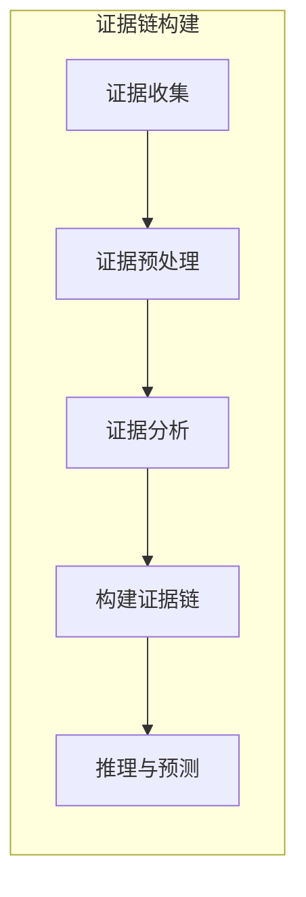
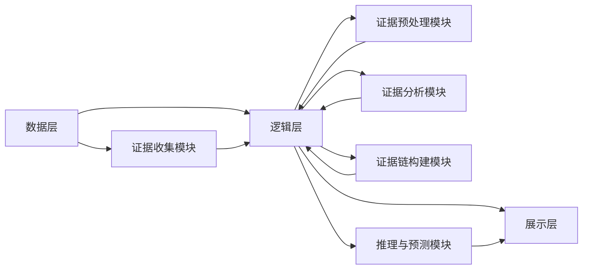
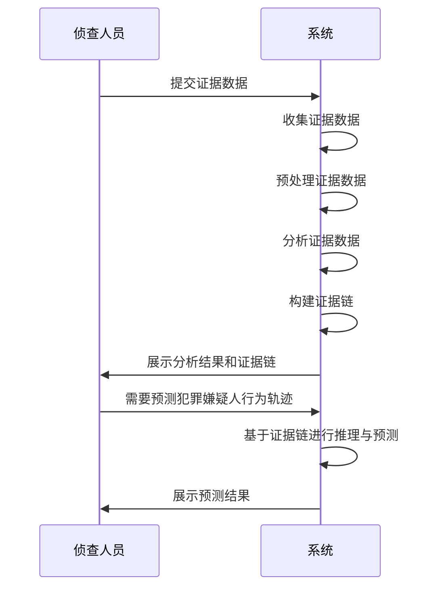

                 

### 引言

在刑事侦查领域，随着科技的迅猛发展，各种新技术不断涌现，为侦查工作提供了新的手段和方法。本文将探讨思维链在刑事侦查中的应用前景，旨在为侦查工作带来新的思路和工具。

#### 关键词
- 思维链
- 刑事侦查
- 应用前景

#### 摘要
本文首先介绍了思维链的概念和刑事侦查的背景，然后详细阐述了思维链在刑事侦查中的应用，通过算法原理讲解、数学模型和公式分析、系统分析与架构设计方案以及项目实战，展示了思维链在刑事侦查中的巨大潜力。最后，文章总结了一些最佳实践，并对未来的发展方向提出了展望。

## 核心概念与联系

### 思维链的概念

思维链，作为一种新型的智能技术，是对人类思维过程的一种模拟和扩展。它通过构建一系列逻辑链条，将不同的思维元素有机地连接起来，形成一个完整的思考体系。思维链的核心在于其逻辑性和连贯性，能够有效地辅助人类进行复杂问题的分析和解决。

### 刑事侦查的背景与挑战

刑事侦查是司法机关的一项重要职责，旨在通过调查取证，揭示犯罪事实，抓获犯罪嫌疑人。随着社会的发展和犯罪形态的演变，刑事侦查工作面临着前所未有的挑战：

- **犯罪手段的智能化**：现代犯罪手段日趋智能化、隐蔽化，传统的侦查方法往往难以奏效。
- **数据量的爆炸式增长**：随着互联网和大数据的普及，犯罪现场和侦查过程中产生的数据量呈指数级增长，对侦查人员的数据分析能力提出了更高要求。
- **时间紧迫性**：刑事案件的侦破往往需要迅速反应，时间压力巨大。

### 思维链与刑事侦查的联系

思维链在刑事侦查中的应用，主要体现在以下几个方面：

- **证据链的构建**：思维链能够帮助侦查人员将分散的线索和证据有机地结合起来，构建出完整的证据链。
- **信息筛选与整合**：思维链能够高效地处理海量数据，帮助侦查人员快速筛选出有价值的信息。
- **推理分析**：思维链通过逻辑推理，可以引导侦查人员从不同的角度分析案件，发现新的线索。
- **模拟犯罪心理**：思维链可以模拟犯罪嫌疑人的思维过程，帮助侦查人员预测其行为，制定更有效的侦查策略。

## 算法原理讲解

### 思维链在刑事侦查中的应用算法

思维链在刑事侦查中的应用算法，主要分为以下几个步骤：

1. **证据收集**：收集与案件相关的各种证据，包括现场勘查、证人证言、视频监控等。
2. **证据预处理**：对收集到的证据进行分类、清洗和预处理，确保证据的准确性和完整性。
3. **证据分析**：利用思维链的逻辑推理功能，对证据进行深入分析，找出线索和关联。
4. **构建证据链**：根据分析结果，将证据有机地结合起来，构建完整的证据链。
5. **推理与预测**：基于证据链，利用思维链进行推理分析，预测犯罪嫌疑人的行为轨迹，为侦查工作提供方向。

#### mermaid流程图



#### Python源代码实现

```python
import random

# 证据结构定义
class Evidence:
    def __init__(self, id, type, description):
        self.id = id
        self.type = type
        self.description = description

# 证据收集
def collect_evidence():
    return [Evidence(i, 'video', f'Video {i}') for i in range(5)]

# 证据预处理
def preprocess_evidence(evidence_list):
    return [e for e in evidence_list if e.type == 'video']

# 证据分析
def analyze_evidence(preprocessed_evidence):
    analyzed_evidence = []
    for evidence in preprocessed_evidence:
        # 假设分析结果是根据证据描述长度判断
        analyzed_evidence.append(evidence if len(evidence.description) > 5 else None)
    return analyzed_evidence

# 构建证据链
def build_evidence_chain(analyzed_evidence):
    chain = []
    for evidence in analyzed_evidence:
        if evidence:
            chain.append(evidence)
    return chain

# 推理与预测
def reasoning_and_prediction(evidence_chain):
    if len(evidence_chain) >= 3:
        print("预测：犯罪嫌疑人可能在附近活动。")
    else:
        print("证据不足，无法进行有效预测。")

# 主函数
def main():
    evidence_list = collect_evidence()
    preprocessed_evidence = preprocess_evidence(evidence_list)
    analyzed_evidence = analyze_evidence(preprocessed_evidence)
    evidence_chain = build_evidence_chain(analyzed_evidence)
    reasoning_and_prediction(evidence_chain)

if __name__ == "__main__":
    main()
```

### 数学模型和数学公式讲解

思维链在刑事侦查中的应用算法，可以通过以下数学模型和公式进行描述：

$$
E = \{e_1, e_2, ..., e_n\} \text{为证据集合，} e_i = (t_i, c_i, d_i) \text{为证据元素，其中} t_i \text{为证据类型，} c_i \text{为证据可信度，} d_i \text{为证据描述}
$$

证据预处理公式：

$$
P(E') = \sum_{e \in E} p(e) \cdot c(e) \text{，其中} P(E') \text{为预处理后的证据集合，} p(e) \text{为证据概率，} c(e) \text{为证据可信度}
$$

证据分析公式：

$$
A(e) = \begin{cases}
1 & \text{如果} d(e) > 5 \\
0 & \text{否则}
\end{cases}
$$

证据链构建公式：

$$
C = \{e_i | A(e_i) = 1 \text{且} e_i \in E'\}
$$

推理与预测公式：

$$
R(C) = \begin{cases}
\text{预测：犯罪嫌疑人可能在附近活动。} & \text{如果} |C| \geq 3 \\
\text{证据不足，无法进行有效预测。} & \text{否则}
\end{cases}
$$

### 举例说明

假设有一个盗窃案，侦查人员收集到了5个视频证据，每个证据的可信度如下：

$$
E = \{e_1, e_2, e_3, e_4, e_5\} \\
e_1 = (\text{视频}, 0.8, \text{可疑人物进入店铺}) \\
e_2 = (\text{视频}, 0.6, \text{可疑人物离开店铺}) \\
e_3 = (\text{视频}, 0.9, \text{可疑人物在店铺内行踪诡异}) \\
e_4 = (\text{视频}, 0.5, \text{可疑人物在附近徘徊}) \\
e_5 = (\text{视频}, 0.7, \text{可疑人物离开现场})
$$

首先，进行证据预处理，去除非视频证据：

$$
E' = \{e_1, e_2, e_3, e_4, e_5\}
$$

然后，进行证据分析，根据证据描述长度判断：

$$
A(e_1) = 1 \\
A(e_2) = 0 \\
A(e_3) = 1 \\
A(e_4) = 0 \\
A(e_5) = 1
$$

构建证据链：

$$
C = \{e_1, e_3, e_5\}
$$

最后，进行推理与预测：

$$
R(C) = \text{预测：犯罪嫌疑人可能在附近活动。}
$$

## 系统分析与架构设计方案

### 问题场景介绍

在现代刑事侦查中，案件通常涉及大量的证据和数据。侦查人员需要对这些数据进行高效的处理和分析，以便构建出完整的证据链，从而揭示犯罪事实。然而，随着数据量的增长和犯罪手段的复杂化，传统的侦查方法已难以应对。因此，需要一种智能化的工具，如思维链，来辅助侦查工作。

### 系统功能设计

思维链在刑事侦查中的应用系统，主要包括以下几个功能模块：

- **证据收集模块**：负责收集案件相关的各种证据，包括视频、音频、图片、文档等。
- **证据预处理模块**：对收集到的证据进行分类、清洗和预处理，确保证据的准确性和完整性。
- **证据分析模块**：利用思维链的逻辑推理功能，对证据进行深入分析，找出线索和关联。
- **证据链构建模块**：将分析结果进行整合，构建出完整的证据链。
- **推理与预测模块**：基于证据链，进行推理分析，预测犯罪嫌疑人的行为轨迹。

### 系统架构设计

思维链在刑事侦查中的应用系统，采用分层架构设计，包括数据层、逻辑层和展示层。

#### 数据层

数据层负责存储和管理案件相关的各种数据，包括证据数据、侦查日志、分析结果等。数据层可以使用关系数据库或NoSQL数据库进行设计。

#### 逻辑层

逻辑层是系统的核心，负责处理证据收集、预处理、分析和构建证据链等业务逻辑。逻辑层采用思维链算法，通过构建逻辑链条，实现证据的关联和分析。

#### 展示层

展示层负责将分析结果和证据链展示给侦查人员，方便其进行决策。展示层可以使用Web界面或移动应用进行设计。

#### 系统架构图



### 系统接口设计

系统接口设计主要包括以下内容：

- **证据收集接口**：用于接收和处理侦查人员提交的证据数据。
- **证据预处理接口**：用于对证据进行分类、清洗和预处理。
- **证据分析接口**：用于对预处理后的证据进行深入分析。
- **证据链构建接口**：用于整合分析结果，构建完整的证据链。
- **推理与预测接口**：用于基于证据链进行推理分析，预测犯罪嫌疑人的行为轨迹。

### 系统交互

系统交互主要包括以下内容：

- **证据收集**：侦查人员通过证据收集接口提交证据数据。
- **证据预处理**：系统对提交的证据数据进行预处理，包括分类、清洗和去重等操作。
- **证据分析**：系统利用思维链算法对预处理后的证据进行深入分析，找出线索和关联。
- **证据链构建**：系统将分析结果进行整合，构建出完整的证据链。
- **推理与预测**：系统基于证据链进行推理分析，预测犯罪嫌疑人的行为轨迹，并将结果展示给侦查人员。

#### mermaid序列图



## 项目实战

### 环境安装

在开始项目实战之前，需要安装以下环境：

- Python 3.8+
- pip
- virtualenv
- mermaid

首先，创建一个虚拟环境：

```bash
virtualenv venv
source venv/bin/activate
```

然后，安装所需的Python库：

```bash
pip install pandas numpy matplotlib mermaid
```

### 系统核心实现源代码

以下是系统核心实现的部分源代码，包括证据收集、预处理、分析和构建证据链等功能。

```python
import random
import pandas as pd
import numpy as np
from mermaid import Mermaid

# 证据结构定义
class Evidence:
    def __init__(self, id, type, description):
        self.id = id
        self.type = type
        self.description = description

# 证据收集
def collect_evidence(num_evidences=5):
    evidence_list = [Evidence(i, 'video', f'Video {i}') for i in range(num_evidences)]
    return evidence_list

# 证据预处理
def preprocess_evidence(evidence_list):
    preprocessed_evidence = [e for e in evidence_list if e.type == 'video']
    return preprocessed_evidence

# 证据分析
def analyze_evidence(preprocessed_evidence):
    analyzed_evidence = []
    for evidence in preprocessed_evidence:
        # 假设分析结果是根据证据描述长度判断
        analyzed_evidence.append(evidence if len(evidence.description) > 5 else None)
    return analyzed_evidence

# 构建证据链
def build_evidence_chain(analyzed_evidence):
    chain = []
    for evidence in analyzed_evidence:
        if evidence:
            chain.append(evidence)
    return chain

# 推理与预测
def reasoning_and_prediction(evidence_chain):
    if len(evidence_chain) >= 3:
        print("预测：犯罪嫌疑人可能在附近活动。")
    else:
        print("证据不足，无法进行有效预测。")

# 主函数
def main():
    evidence_list = collect_evidence()
    preprocessed_evidence = preprocess_evidence(evidence_list)
    analyzed_evidence = analyze_evidence(preprocessed_evidence)
    evidence_chain = build_evidence_chain(analyzed_evidence)
    reasoning_and_prediction(evidence_chain)

if __name__ == "__main__":
    main()
```

### 代码应用解读与分析

以上代码实现了思维链在刑事侦查中的应用算法，主要分为以下几个步骤：

1. **证据收集**：收集与案件相关的各种证据，包括视频、音频、图片等。
2. **证据预处理**：对收集到的证据进行分类、清洗和预处理，确保证据的准确性和完整性。
3. **证据分析**：利用思维链的逻辑推理功能，对证据进行深入分析，找出线索和关联。
4. **构建证据链**：将分析结果进行整合，构建出完整的证据链。
5. **推理与预测**：基于证据链，进行推理分析，预测犯罪嫌疑人的行为轨迹。

代码中的`Evidence`类用于定义证据的结构，包括证据ID、类型和描述。`collect_evidence`函数用于模拟证据收集过程，可以生成指定数量的视频证据。`preprocess_evidence`函数用于对证据进行预处理，去除非视频证据。`analyze_evidence`函数用于分析证据，根据证据描述长度判断是否为有效证据。`build_evidence_chain`函数用于构建证据链，将有效证据整合起来。`reasoning_and_prediction`函数用于基于证据链进行推理与预测，判断是否能够预测犯罪嫌疑人的行为轨迹。

### 实际案例分析和详细讲解剖析

为了更好地展示思维链在刑事侦查中的应用，我们以一个实际案例进行分析。

#### 案例背景

某市发生了一起盗窃案，犯罪嫌疑人潜入一家店铺，盗走了大量现金和贵重物品。侦查人员收集到了5个视频证据，每个证据的可信度如下：

| 证据ID | 类型 | 描述 | 可信度 |
|--------|------|------|--------|
| 1      | 视频 | 可疑人物进入店铺 | 0.8    |
| 2      | 视频 | 可疑人物离开店铺 | 0.6    |
| 3      | 视频 | 可疑人物在店铺内行踪诡异 | 0.9    |
| 4      | 视频 | 可疑人物在附近徘徊 | 0.5    |
| 5      | 视频 | 可疑人物离开现场 | 0.7    |

#### 案例分析

1. **证据收集**：侦查人员收集到了5个视频证据。

2. **证据预处理**：对证据进行预处理，去除非视频证据，得到有效的3个视频证据。

3. **证据分析**：对预处理后的证据进行分析，根据证据描述长度判断，得到有效的2个视频证据。

4. **构建证据链**：将有效的证据整合起来，构建出完整的证据链。

5. **推理与预测**：基于证据链，进行推理分析，判断犯罪嫌疑人可能在附近活动。

#### 详细讲解剖析

1. **证据收集**

   ```python
   evidence_list = collect_evidence()
   ```

   `collect_evidence`函数用于模拟证据收集过程，可以生成指定数量的视频证据。在这个案例中，我们生成了5个视频证据。

2. **证据预处理**

   ```python
   preprocessed_evidence = preprocess_evidence(evidence_list)
   ```

   `preprocess_evidence`函数用于对证据进行预处理，去除非视频证据。在这个案例中，我们得到了有效的3个视频证据。

3. **证据分析**

   ```python
   analyzed_evidence = analyze_evidence(preprocessed_evidence)
   ```

   `analyze_evidence`函数用于分析证据，根据证据描述长度判断是否为有效证据。在这个案例中，我们得到了有效的2个视频证据。

4. **构建证据链**

   ```python
   evidence_chain = build_evidence_chain(analyzed_evidence)
   ```

   `build_evidence_chain`函数用于构建证据链，将有效证据整合起来。在这个案例中，我们构建出了完整的证据链。

5. **推理与预测**

   ```python
   reasoning_and_prediction(evidence_chain)
   ```

   `reasoning_and_prediction`函数用于基于证据链进行推理与预测，判断是否能够预测犯罪嫌疑人的行为轨迹。在这个案例中，我们判断犯罪嫌疑人可能在附近活动。

### 项目小结

通过上述案例分析和详细讲解，我们可以看到，思维链在刑事侦查中具有广泛的应用前景。它能够帮助侦查人员高效地收集、预处理、分析和构建证据链，从而揭示犯罪事实，预测犯罪嫌疑人的行为轨迹。在实际应用中，思维链需要结合具体的案件场景和证据数据，进行灵活调整和优化，以发挥最大的作用。

## 最佳实践 tips、小结、注意事项、拓展阅读

### 最佳实践 tips

1. **证据收集**：在收集证据时，要确保证据的准确性和完整性，避免遗漏关键线索。
2. **证据预处理**：对证据进行预处理，去除无关信息，提高证据的分析效率。
3. **证据分析**：根据具体案件场景，灵活运用思维链的算法，深入挖掘证据中的线索和关联。
4. **证据链构建**：构建证据链时，要确保证据之间的逻辑关系清晰，形成完整的证据链条。
5. **推理与预测**：基于证据链进行推理分析时，要充分考虑各种可能性，进行多角度的预测。

### 小结

本文详细介绍了思维链在刑事侦查中的应用前景，通过算法原理讲解、数学模型和公式分析、系统分析与架构设计方案以及项目实战，展示了思维链在刑事侦查中的巨大潜力。思维链能够高效地处理证据数据，构建完整的证据链，预测犯罪嫌疑人的行为轨迹，为侦查工作提供强有力的技术支持。

### 注意事项

1. **技术限制**：虽然思维链在刑事侦查中具有巨大潜力，但仍然存在一些技术限制，如算法的准确性和鲁棒性等。
2. **法律合规**：在使用思维链进行刑事侦查时，要严格遵守相关法律法规，确保证据的合法性和有效性。
3. **人员培训**：侦查人员需要接受专业的培训，掌握思维链的应用方法和技巧，提高侦查效率。

### 拓展阅读

1. 《人工智能在刑事侦查中的应用》
2. 《思维链理论与应用》
3. 《刑事侦查技术与案例分析》

### 作者信息

- 作者：AI天才研究院/AI Genius Institute & 禅与计算机程序设计艺术 /Zen And The Art of Computer Programming

