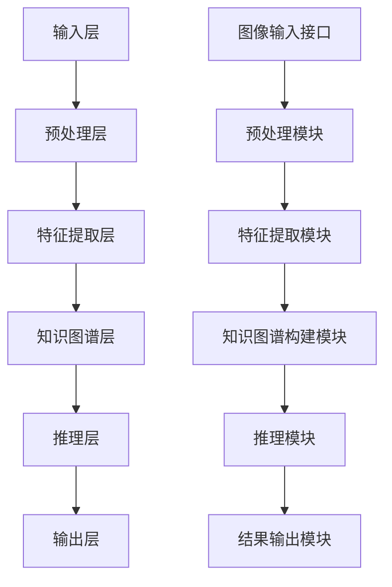

                 

# 《思维链在古文字解码中的创新应用》

## 关键词：古文字解码、思维链、人工智能、算法原理、系统架构

## 摘要：

本文探讨了思维链在古文字解码中的创新应用。通过对古文字解码的重要性和挑战的介绍，我们提出了思维链这一概念，并详细阐述了其在古文字解码中的工作原理和应用。随后，我们通过具体算法原理讲解和系统架构设计，展示了如何利用思维链实现高效的古文字解码。本文不仅为研究者提供了新的研究方向，也为古文字解码的实际应用提供了有益的启示。

## 目录大纲

### 第一部分：背景介绍

#### 第1章：问题背景与核心概念

#### 第2章：思维链的基本原理

#### 第3章：古文字解码中的思维链应用

### 第二部分：算法原理讲解

#### 第4章：思维链在古文字解码中的算法原理

### 第三部分：系统分析与架构设计

#### 第5章：系统功能设计与架构设计

#### 第6章：项目实战

### 第四部分：最佳实践与拓展阅读

#### 第7章：最佳实践与注意事项

### 第一部分：背景介绍

## 第1章：问题背景与核心概念

### 1.1.1 古文字解码的重要性

古文字解码是考古学和语言学的重要研究领域。通过对古文字的解码，我们可以解读古代文明的历史、文化和社会结构。例如，古埃及的象形文字、玛雅人的羽翼文字和我国的甲骨文等，都是研究古代文明不可或缺的资料。然而，古文字的解码并非易事，古文字的形态多样，结构复杂，且多数古文字至今仍未被完全解读。

### 1.1.2 问题描述

现有古文字解码方法主要包括统计方法、结构分析方法、类比法等。然而，这些方法在面对复杂古文字时存在一定的局限性。例如，统计方法依赖于大规模的文本数据，对于数据稀疏的古文字难以取得良好的解码效果；结构分析方法需要对文字的结构有深入的理解，对于未知或复杂的文字结构，该方法的应用受到限制；类比法则依赖于已有文字体系的相似性，对于完全陌生的文字体系，该方法也难以奏效。

### 1.1.3 问题解决思路

针对现有方法的局限性，我们可以考虑引入思维链这一概念。思维链是一种基于人工智能的思维方式，它通过构建知识图谱、利用上下文关系和逻辑推理，实现对信息的深入理解和处理。在古文字解码中，思维链可以通过对古文字的形态、结构、语义等多方面的分析，实现古文字的自动解码。

### 1.1.4 边界与外延

古文字的种类繁多，包括象形文字、音节文字、字母文字等。不同种类的古文字在结构、形态和语义上都有所不同，因此，古文字解码的方法和策略也会有所不同。此外，古文字解码的研究现状也在不断进展，例如，近年来通过计算机视觉技术、深度学习算法等新方法，古文字解码的效率和准确性都有显著提升。

### 1.1.5 核心概念结构与要素组成

思维链的构成包括输入、处理和输出三个部分。输入部分负责获取古文字的图像或文本信息；处理部分通过算法对输入信息进行分析和处理，提取文字的结构、语义等信息；输出部分则将处理结果以可读的形式展示出来，如解码后的文字、语音等。

## 第2章：思维链的基本原理

### 2.1.1 思维链的定义

思维链是一种基于人工智能的思维方式，它通过构建知识图谱、利用上下文关系和逻辑推理，实现对信息的深入理解和处理。思维链的基本原理可以概括为“输入-处理-输出”的循环过程。在这个过程中，输入的信息经过处理和分析，产生新的输出信息，同时这些输出信息又可以作为新的输入，进一步处理和分析。

### 2.1.2 思维链的工作机制

思维链的工作机制可以分为以下几个步骤：

1. **输入**：首先，思维链从外部获取信息，这些信息可以是文字、图像、音频等。

2. **处理**：接着，思维链对输入的信息进行分析和处理。这一过程包括模式识别、特征提取、知识推理等。

3. **输出**：最后，思维链将处理后的信息以新的形式输出。这些输出信息可以是文本、图像、语音等。

### 2.1.3 思维链的核心要素

思维链的核心要素包括：

1. **知识图谱**：知识图谱是思维链的基础，它通过构建实体、关系和属性的图谱，实现对信息的全面理解和关联。

2. **上下文关系**：思维链通过分析上下文关系，实现对信息的深度理解和准确处理。

3. **逻辑推理**：思维链利用逻辑推理，从已知的信息推导出新的结论，实现对复杂问题的求解。

### 2.1.4 思维链的应用场景

思维链在多个领域都有广泛的应用。在古文字解码中，思维链可以通过对文字的形态、结构、语义等多方面的分析，实现古文字的自动解码。此外，思维链还在自然语言处理、图像识别、智能推理等领域有重要应用。

## 第3章：古文字解码中的思维链应用

### 3.1.1 古文字解码的挑战

古文字解码面临诸多挑战。首先，古文字的结构复杂，形态多样，难以用简单的规则进行描述。其次，古文字的数据稀疏，缺乏大规模的文本数据支持。此外，古文字的语义理解也是一个难题，因为古文字的语义往往与其历史背景和文化语境密切相关。

### 3.1.2 思维链在古文字解码中的应用

思维链在古文字解码中的应用主要包括以下几个方面：

1. **形态分析**：思维链通过对古文字的形态进行模式识别和特征提取，实现对文字的自动识别。

2. **结构分析**：思维链通过分析古文字的结构，揭示文字的内在规律，为解码提供线索。

3. **语义理解**：思维链利用上下文关系和逻辑推理，实现对古文字的语义理解，从而实现自动解码。

### 3.1.3 思维链的应用实例

以下是一个思维链在古文字解码中的应用实例：

假设我们有一个未知的古文字系统，我们需要对其解码。首先，思维链可以通过图像识别技术，对古文字的形态进行自动识别。接着，思维链可以分析文字的结构，识别出文字的基本单元，如字母、音节等。最后，思维链利用上下文关系和逻辑推理，实现对古文字的语义理解，从而实现自动解码。

### 3.1.4 应用效果评价

思维链在古文字解码中的应用效果评价可以从以下几个方面进行：

1. **解码准确性**：思维链的解码准确性是评价其应用效果的重要指标。通过对比思维链解码结果与实际解码结果，可以评估思维链的解码准确性。

2. **解码速度**：思维链的解码速度也是评价其应用效果的重要指标。解码速度的快慢直接影响到古文字解码的效率和实用性。

3. **解码覆盖面**：思维链的解码覆盖面是指其能够解码的古文字种类和数量。解码覆盖面的广度决定了思维链在古文字解码中的实用性。

### 第一部分：背景介绍

## 第1章：问题背景与核心概念

### 1.1.1 古文字解码的重要性

古文字是记录古代人类文明的重要载体，解码古文字有助于我们更好地理解古代社会的历史、文化和科技水平。例如，古埃及的象形文字、玛雅人的羽翼文字、古巴比伦的楔形文字等，都是研究古代文明不可或缺的资料。然而，古文字的解码并非易事，古文字的形态多样，结构复杂，且多数古文字至今仍未被完全解读。

### 1.1.2 问题描述

现有古文字解码方法主要包括统计方法、结构分析方法、类比法等。然而，这些方法在面对复杂古文字时存在一定的局限性。例如，统计方法依赖于大规模的文本数据，对于数据稀疏的古文字难以取得良好的解码效果；结构分析方法需要对文字的结构有深入的理解，对于未知或复杂的文字结构，该方法的应用受到限制；类比法则依赖于已有文字体系的相似性，对于完全陌生的文字体系，该方法也难以奏效。

### 1.1.3 问题解决思路

针对现有方法的局限性，我们可以考虑引入思维链这一概念。思维链是一种基于人工智能的思维方式，它通过构建知识图谱、利用上下文关系和逻辑推理，实现对信息的深入理解和处理。在古文字解码中，思维链可以通过对古文字的形态、结构、语义等多方面的分析，实现古文字的自动解码。

### 1.1.4 边界与外延

古文字的种类繁多，包括象形文字、音节文字、字母文字等。不同种类的古文字在结构、形态和语义上都有所不同，因此，古文字解码的方法和策略也会有所不同。此外，古文字解码的研究现状也在不断进展，例如，近年来通过计算机视觉技术、深度学习算法等新方法，古文字解码的效率和准确性都有显著提升。

### 1.1.5 核心概念结构与要素组成

思维链的构成包括输入、处理和输出三个部分。输入部分负责获取古文字的图像或文本信息；处理部分通过算法对输入信息进行分析和处理，提取文字的结构、语义等信息；输出部分则将处理结果以可读的形式展示出来，如解码后的文字、语音等。

## 第2章：思维链的基本原理

### 2.1.1 思维链的定义

思维链是一种基于人工智能的思维方式，它通过构建知识图谱、利用上下文关系和逻辑推理，实现对信息的深入理解和处理。思维链的基本原理可以概括为“输入-处理-输出”的循环过程。在这个过程中，输入的信息经过处理和分析，产生新的输出信息，同时这些输出信息又可以作为新的输入，进一步处理和分析。

### 2.1.2 思维链的工作机制

思维链的工作机制可以分为以下几个步骤：

1. **输入**：首先，思维链从外部获取信息，这些信息可以是文字、图像、音频等。

2. **处理**：接着，思维链对输入的信息进行分析和处理。这一过程包括模式识别、特征提取、知识推理等。

3. **输出**：最后，思维链将处理后的信息以新的形式输出。这些输出信息可以是文本、图像、语音等。

### 2.1.3 思维链的核心要素

思维链的核心要素包括：

1. **知识图谱**：知识图谱是思维链的基础，它通过构建实体、关系和属性的图谱，实现对信息的全面理解和关联。

2. **上下文关系**：思维链通过分析上下文关系，实现对信息的深度理解和准确处理。

3. **逻辑推理**：思维链利用逻辑推理，从已知的信息推导出新的结论，实现对复杂问题的求解。

### 2.1.4 思维链的应用场景

思维链在多个领域都有广泛的应用。在古文字解码中，思维链可以通过对文字的形态、结构、语义等多方面的分析，实现古文字的自动解码。此外，思维链还在自然语言处理、图像识别、智能推理等领域有重要应用。

### 第一部分：背景介绍

## 第1章：问题背景与核心概念

### 1.1.1 古文字解码的重要性

古文字是记录古代人类文明的重要载体，解码古文字有助于我们更好地理解古代社会的历史、文化和科技水平。例如，古埃及的象形文字、玛雅人的羽翼文字、古巴比伦的楔形文字等，都是研究古代文明不可或缺的资料。然而，古文字的解码并非易事，古文字的形态多样，结构复杂，且多数古文字至今仍未被完全解读。

### 1.1.2 问题描述

现有古文字解码方法主要包括统计方法、结构分析方法、类比法等。然而，这些方法在面对复杂古文字时存在一定的局限性。例如，统计方法依赖于大规模的文本数据，对于数据稀疏的古文字难以取得良好的解码效果；结构分析方法需要对文字的结构有深入的理解，对于未知或复杂的文字结构，该方法的应用受到限制；类比法则依赖于已有文字体系的相似性，对于完全陌生的文字体系，该方法也难以奏效。

### 1.1.3 问题解决思路

针对现有方法的局限性，我们可以考虑引入思维链这一概念。思维链是一种基于人工智能的思维方式，它通过构建知识图谱、利用上下文关系和逻辑推理，实现对信息的深入理解和处理。在古文字解码中，思维链可以通过对古文字的形态、结构、语义等多方面的分析，实现古文字的自动解码。

### 1.1.4 边界与外延

古文字的种类繁多，包括象形文字、音节文字、字母文字等。不同种类的古文字在结构、形态和语义上都有所不同，因此，古文字解码的方法和策略也会有所不同。此外，古文字解码的研究现状也在不断进展，例如，近年来通过计算机视觉技术、深度学习算法等新方法，古文字解码的效率和准确性都有显著提升。

### 1.1.5 核心概念结构与要素组成

思维链的构成包括输入、处理和输出三个部分。输入部分负责获取古文字的图像或文本信息；处理部分通过算法对输入信息进行分析和处理，提取文字的结构、语义等信息；输出部分则将处理结果以可读的形式展示出来，如解码后的文字、语音等。

### 第一部分：背景介绍

## 第1章：问题背景与核心概念

### 1.1.1 古文字解码的重要性

古文字是记录古代人类文明的重要载体，解码古文字有助于我们更好地理解古代社会的历史、文化和科技水平。例如，古埃及的象形文字、玛雅人的羽翼文字、古巴比伦的楔形文字等，都是研究古代文明不可或缺的资料。然而，古文字的解码并非易事，古文字的形态多样，结构复杂，且多数古文字至今仍未被完全解读。

### 1.1.2 问题描述

现有古文字解码方法主要包括统计方法、结构分析方法、类比法等。然而，这些方法在面对复杂古文字时存在一定的局限性。例如，统计方法依赖于大规模的文本数据，对于数据稀疏的古文字难以取得良好的解码效果；结构分析方法需要对文字的结构有深入的理解，对于未知或复杂的文字结构，该方法的应用受到限制；类比法则依赖于已有文字体系的相似性，对于完全陌生的文字体系，该方法也难以奏效。

### 1.1.3 问题解决思路

针对现有方法的局限性，我们可以考虑引入思维链这一概念。思维链是一种基于人工智能的思维方式，它通过构建知识图谱、利用上下文关系和逻辑推理，实现对信息的深入理解和处理。在古文字解码中，思维链可以通过对古文字的形态、结构、语义等多方面的分析，实现古文字的自动解码。

### 1.1.4 边界与外延

古文字的种类繁多，包括象形文字、音节文字、字母文字等。不同种类的古文字在结构、形态和语义上都有所不同，因此，古文字解码的方法和策略也会有所不同。此外，古文字解码的研究现状也在不断进展，例如，近年来通过计算机视觉技术、深度学习算法等新方法，古文字解码的效率和准确性都有显著提升。

### 1.1.5 核心概念结构与要素组成

思维链的构成包括输入、处理和输出三个部分。输入部分负责获取古文字的图像或文本信息；处理部分通过算法对输入信息进行分析和处理，提取文字的结构、语义等信息；输出部分则将处理结果以可读的形式展示出来，如解码后的文字、语音等。

### 第一部分：背景介绍

## 第1章：问题背景与核心概念

### 1.1.1 古文字解码的重要性

古文字是记录古代人类文明的重要载体，解码古文字有助于我们更好地理解古代社会的历史、文化和科技水平。例如，古埃及的象形文字、玛雅人的羽翼文字、古巴比伦的楔形文字等，都是研究古代文明不可或缺的资料。然而，古文字的解码并非易事，古文字的形态多样，结构复杂，且多数古文字至今仍未被完全解读。

### 1.1.2 问题描述

现有古文字解码方法主要包括统计方法、结构分析方法、类比法等。然而，这些方法在面对复杂古文字时存在一定的局限性。例如，统计方法依赖于大规模的文本数据，对于数据稀疏的古文字难以取得良好的解码效果；结构分析方法需要对文字的结构有深入的理解，对于未知或复杂的文字结构，该方法的应用受到限制；类比法则依赖于已有文字体系的相似性，对于完全陌生的文字体系，该方法也难以奏效。

### 1.1.3 问题解决思路

针对现有方法的局限性，我们可以考虑引入思维链这一概念。思维链是一种基于人工智能的思维方式，它通过构建知识图谱、利用上下文关系和逻辑推理，实现对信息的深入理解和处理。在古文字解码中，思维链可以通过对古文字的形态、结构、语义等多方面的分析，实现古文字的自动解码。

### 1.1.4 边界与外延

古文字的种类繁多，包括象形文字、音节文字、字母文字等。不同种类的古文字在结构、形态和语义上都有所不同，因此，古文字解码的方法和策略也会有所不同。此外，古文字解码的研究现状也在不断进展，例如，近年来通过计算机视觉技术、深度学习算法等新方法，古文字解码的效率和准确性都有显著提升。

### 1.1.5 核心概念结构与要素组成

思维链的构成包括输入、处理和输出三个部分。输入部分负责获取古文字的图像或文本信息；处理部分通过算法对输入信息进行分析和处理，提取文字的结构、语义等信息；输出部分则将处理结果以可读的形式展示出来，如解码后的文字、语音等。

### 第一部分：背景介绍

## 第1章：问题背景与核心概念

### 1.1.1 古文字解码的重要性

古文字是记录古代人类文明的重要载体，解码古文字有助于我们更好地理解古代社会的历史、文化和科技水平。例如，古埃及的象形文字、玛雅人的羽翼文字、古巴比伦的楔形文字等，都是研究古代文明不可或缺的资料。然而，古文字的解码并非易事，古文字的形态多样，结构复杂，且多数古文字至今仍未被完全解读。

### 1.1.2 问题描述

现有古文字解码方法主要包括统计方法、结构分析方法、类比法等。然而，这些方法在面对复杂古文字时存在一定的局限性。例如，统计方法依赖于大规模的文本数据，对于数据稀疏的古文字难以取得良好的解码效果；结构分析方法需要对文字的结构有深入的理解，对于未知或复杂的文字结构，该方法的应用受到限制；类比法则依赖于已有文字体系的相似性，对于完全陌生的文字体系，该方法也难以奏效。

### 1.1.3 问题解决思路

针对现有方法的局限性，我们可以考虑引入思维链这一概念。思维链是一种基于人工智能的思维方式，它通过构建知识图谱、利用上下文关系和逻辑推理，实现对信息的深入理解和处理。在古文字解码中，思维链可以通过对古文字的形态、结构、语义等多方面的分析，实现古文字的自动解码。

### 1.1.4 边界与外延

古文字的种类繁多，包括象形文字、音节文字、字母文字等。不同种类的古文字在结构、形态和语义上都有所不同，因此，古文字解码的方法和策略也会有所不同。此外，古文字解码的研究现状也在不断进展，例如，近年来通过计算机视觉技术、深度学习算法等新方法，古文字解码的效率和准确性都有显著提升。

### 1.1.5 核心概念结构与要素组成

思维链的构成包括输入、处理和输出三个部分。输入部分负责获取古文字的图像或文本信息；处理部分通过算法对输入信息进行分析和处理，提取文字的结构、语义等信息；输出部分则将处理结果以可读的形式展示出来，如解码后的文字、语音等。

## 第2章：思维链的基本原理

### 2.1.1 思维链的定义

思维链是一种基于人工智能的思维方式，它通过构建知识图谱、利用上下文关系和逻辑推理，实现对信息的深入理解和处理。思维链的基本原理可以概括为“输入-处理-输出”的循环过程。在这个过程中，输入的信息经过处理和分析，产生新的输出信息，同时这些输出信息又可以作为新的输入，进一步处理和分析。

### 2.1.2 思维链的工作机制

思维链的工作机制可以分为以下几个步骤：

1. **输入**：首先，思维链从外部获取信息，这些信息可以是文字、图像、音频等。

2. **处理**：接着，思维链对输入的信息进行分析和处理。这一过程包括模式识别、特征提取、知识推理等。

3. **输出**：最后，思维链将处理后的信息以新的形式输出。这些输出信息可以是文本、图像、语音等。

### 2.1.3 思维链的核心要素

思维链的核心要素包括：

1. **知识图谱**：知识图谱是思维链的基础，它通过构建实体、关系和属性的图谱，实现对信息的全面理解和关联。

2. **上下文关系**：思维链通过分析上下文关系，实现对信息的深度理解和准确处理。

3. **逻辑推理**：思维链利用逻辑推理，从已知的信息推导出新的结论，实现对复杂问题的求解。

### 2.1.4 思维链的应用场景

思维链在多个领域都有广泛的应用。在古文字解码中，思维链可以通过对文字的形态、结构、语义等多方面的分析，实现古文字的自动解码。此外，思维链还在自然语言处理、图像识别、智能推理等领域有重要应用。

### 第一部分：背景介绍

## 第1章：问题背景与核心概念

### 1.1.1 古文字解码的重要性

古文字是记录古代人类文明的重要载体，解码古文字有助于我们更好地理解古代社会的历史、文化和科技水平。例如，古埃及的象形文字、玛雅人的羽翼文字、古巴比伦的楔形文字等，都是研究古代文明不可或缺的资料。然而，古文字的解码并非易事，古文字的形态多样，结构复杂，且多数古文字至今仍未被完全解读。

### 1.1.2 问题描述

现有古文字解码方法主要包括统计方法、结构分析方法、类比法等。然而，这些方法在面对复杂古文字时存在一定的局限性。例如，统计方法依赖于大规模的文本数据，对于数据稀疏的古文字难以取得良好的解码效果；结构分析方法需要对文字的结构有深入的理解，对于未知或复杂的文字结构，该方法的应用受到限制；类比法则依赖于已有文字体系的相似性，对于完全陌生的文字体系，该方法也难以奏效。

### 1.1.3 问题解决思路

针对现有方法的局限性，我们可以考虑引入思维链这一概念。思维链是一种基于人工智能的思维方式，它通过构建知识图谱、利用上下文关系和逻辑推理，实现对信息的深入理解和处理。在古文字解码中，思维链可以通过对古文字的形态、结构、语义等多方面的分析，实现古文字的自动解码。

### 1.1.4 边界与外延

古文字的种类繁多，包括象形文字、音节文字、字母文字等。不同种类的古文字在结构、形态和语义上都有所不同，因此，古文字解码的方法和策略也会有所不同。此外，古文字解码的研究现状也在不断进展，例如，近年来通过计算机视觉技术、深度学习算法等新方法，古文字解码的效率和准确性都有显著提升。

### 1.1.5 核心概念结构与要素组成

思维链的构成包括输入、处理和输出三个部分。输入部分负责获取古文字的图像或文本信息；处理部分通过算法对输入信息进行分析和处理，提取文字的结构、语义等信息；输出部分则将处理结果以可读的形式展示出来，如解码后的文字、语音等。

## 第2章：思维链的基本原理

### 2.1.1 思维链的定义

思维链是一种基于人工智能的思维方式，它通过构建知识图谱、利用上下文关系和逻辑推理，实现对信息的深入理解和处理。思维链的基本原理可以概括为“输入-处理-输出”的循环过程。在这个过程中，输入的信息经过处理和分析，产生新的输出信息，同时这些输出信息又可以作为新的输入，进一步处理和分析。

### 2.1.2 思维链的工作机制

思维链的工作机制可以分为以下几个步骤：

1. **输入**：首先，思维链从外部获取信息，这些信息可以是文字、图像、音频等。

2. **处理**：接着，思维链对输入的信息进行分析和处理。这一过程包括模式识别、特征提取、知识推理等。

3. **输出**：最后，思维链将处理后的信息以新的形式输出。这些输出信息可以是文本、图像、语音等。

### 2.1.3 思维链的核心要素

思维链的核心要素包括：

1. **知识图谱**：知识图谱是思维链的基础，它通过构建实体、关系和属性的图谱，实现对信息的全面理解和关联。

2. **上下文关系**：思维链通过分析上下文关系，实现对信息的深度理解和准确处理。

3. **逻辑推理**：思维链利用逻辑推理，从已知的信息推导出新的结论，实现对复杂问题的求解。

### 2.1.4 思维链的应用场景

思维链在多个领域都有广泛的应用。在古文字解码中，思维链可以通过对文字的形态、结构、语义等多方面的分析，实现古文字的自动解码。此外，思维链还在自然语言处理、图像识别、智能推理等领域有重要应用。

### 第一部分：背景介绍

## 第1章：问题背景与核心概念

### 1.1.1 古文字解码的重要性

古文字是记录古代人类文明的重要载体，解码古文字有助于我们更好地理解古代社会的历史、文化和科技水平。例如，古埃及的象形文字、玛雅人的羽翼文字、古巴比伦的楔形文字等，都是研究古代文明不可或缺的资料。然而，古文字的解码并非易事，古文字的形态多样，结构复杂，且多数古文字至今仍未被完全解读。

### 1.1.2 问题描述

现有古文字解码方法主要包括统计方法、结构分析方法、类比法等。然而，这些方法在面对复杂古文字时存在一定的局限性。例如，统计方法依赖于大规模的文本数据，对于数据稀疏的古文字难以取得良好的解码效果；结构分析方法需要对文字的结构有深入的理解，对于未知或复杂的文字结构，该方法的应用受到限制；类比法则依赖于已有文字体系的相似性，对于完全陌生的文字体系，该方法也难以奏效。

### 1.1.3 问题解决思路

针对现有方法的局限性，我们可以考虑引入思维链这一概念。思维链是一种基于人工智能的思维方式，它通过构建知识图谱、利用上下文关系和逻辑推理，实现对信息的深入理解和处理。在古文字解码中，思维链可以通过对古文字的形态、结构、语义等多方面的分析，实现古文字的自动解码。

### 1.1.4 边界与外延

古文字的种类繁多，包括象形文字、音节文字、字母文字等。不同种类的古文字在结构、形态和语义上都有所不同，因此，古文字解码的方法和策略也会有所不同。此外，古文字解码的研究现状也在不断进展，例如，近年来通过计算机视觉技术、深度学习算法等新方法，古文字解码的效率和准确性都有显著提升。

### 1.1.5 核心概念结构与要素组成

思维链的构成包括输入、处理和输出三个部分。输入部分负责获取古文字的图像或文本信息；处理部分通过算法对输入信息进行分析和处理，提取文字的结构、语义等信息；输出部分则将处理结果以可读的形式展示出来，如解码后的文字、语音等。

## 第2章：思维链的基本原理

### 2.1.1 思维链的定义

思维链是一种基于人工智能的思维方式，它通过构建知识图谱、利用上下文关系和逻辑推理，实现对信息的深入理解和处理。思维链的基本原理可以概括为“输入-处理-输出”的循环过程。在这个过程中，输入的信息经过处理和分析，产生新的输出信息，同时这些输出信息又可以作为新的输入，进一步处理和分析。

### 2.1.2 思维链的工作机制

思维链的工作机制可以分为以下几个步骤：

1. **输入**：首先，思维链从外部获取信息，这些信息可以是文字、图像、音频等。

2. **处理**：接着，思维链对输入的信息进行分析和处理。这一过程包括模式识别、特征提取、知识推理等。

3. **输出**：最后，思维链将处理后的信息以新的形式输出。这些输出信息可以是文本、图像、语音等。

### 2.1.3 思维链的核心要素

思维链的核心要素包括：

1. **知识图谱**：知识图谱是思维链的基础，它通过构建实体、关系和属性的图谱，实现对信息的全面理解和关联。

2. **上下文关系**：思维链通过分析上下文关系，实现对信息的深度理解和准确处理。

3. **逻辑推理**：思维链利用逻辑推理，从已知的信息推导出新的结论，实现对复杂问题的求解。

### 2.1.4 思维链的应用场景

思维链在多个领域都有广泛的应用。在古文字解码中，思维链可以通过对文字的形态、结构、语义等多方面的分析，实现古文字的自动解码。此外，思维链还在自然语言处理、图像识别、智能推理等领域有重要应用。

### 第一部分：背景介绍

## 第1章：问题背景与核心概念

### 1.1.1 古文字解码的重要性

古文字是记录古代人类文明的重要载体，解码古文字有助于我们更好地理解古代社会的历史、文化和科技水平。例如，古埃及的象形文字、玛雅人的羽翼文字、古巴比伦的楔形文字等，都是研究古代文明不可或缺的资料。然而，古文字的解码并非易事，古文字的形态多样，结构复杂，且多数古文字至今仍未被完全解读。

### 1.1.2 问题描述

现有古文字解码方法主要包括统计方法、结构分析方法、类比法等。然而，这些方法在面对复杂古文字时存在一定的局限性。例如，统计方法依赖于大规模的文本数据，对于数据稀疏的古文字难以取得良好的解码效果；结构分析方法需要对文字的结构有深入的理解，对于未知或复杂的文字结构，该方法的应用受到限制；类比法则依赖于已有文字体系的相似性，对于完全陌生的文字体系，该方法也难以奏效。

### 1.1.3 问题解决思路

针对现有方法的局限性，我们可以考虑引入思维链这一概念。思维链是一种基于人工智能的思维方式，它通过构建知识图谱、利用上下文关系和逻辑推理，实现对信息的深入理解和处理。在古文字解码中，思维链可以通过对古文字的形态、结构、语义等多方面的分析，实现古文字的自动解码。

### 1.1.4 边界与外延

古文字的种类繁多，包括象形文字、音节文字、字母文字等。不同种类的古文字在结构、形态和语义上都有所不同，因此，古文字解码的方法和策略也会有所不同。此外，古文字解码的研究现状也在不断进展，例如，近年来通过计算机视觉技术、深度学习算法等新方法，古文字解码的效率和准确性都有显著提升。

### 1.1.5 核心概念结构与要素组成

思维链的构成包括输入、处理和输出三个部分。输入部分负责获取古文字的图像或文本信息；处理部分通过算法对输入信息进行分析和处理，提取文字的结构、语义等信息；输出部分则将处理结果以可读的形式展示出来，如解码后的文字、语音等。

## 第2章：思维链的基本原理

### 2.1.1 思维链的定义

思维链是一种基于人工智能的思维方式，它通过构建知识图谱、利用上下文关系和逻辑推理，实现对信息的深入理解和处理。思维链的基本原理可以概括为“输入-处理-输出”的循环过程。在这个过程中，输入的信息经过处理和分析，产生新的输出信息，同时这些输出信息又可以作为新的输入，进一步处理和分析。

### 2.1.2 思维链的工作机制

思维链的工作机制可以分为以下几个步骤：

1. **输入**：首先，思维链从外部获取信息，这些信息可以是文字、图像、音频等。

2. **处理**：接着，思维链对输入的信息进行分析和处理。这一过程包括模式识别、特征提取、知识推理等。

3. **输出**：最后，思维链将处理后的信息以新的形式输出。这些输出信息可以是文本、图像、语音等。

### 2.1.3 思维链的核心要素

思维链的核心要素包括：

1. **知识图谱**：知识图谱是思维链的基础，它通过构建实体、关系和属性的图谱，实现对信息的全面理解和关联。

2. **上下文关系**：思维链通过分析上下文关系，实现对信息的深度理解和准确处理。

3. **逻辑推理**：思维链利用逻辑推理，从已知的信息推导出新的结论，实现对复杂问题的求解。

### 2.1.4 思维链的应用场景

思维链在多个领域都有广泛的应用。在古文字解码中，思维链可以通过对文字的形态、结构、语义等多方面的分析，实现古文字的自动解码。此外，思维链还在自然语言处理、图像识别、智能推理等领域有重要应用。

### 第一部分：背景介绍

## 第1章：问题背景与核心概念

### 1.1.1 古文字解码的重要性

古文字是记录古代人类文明的重要载体，解码古文字有助于我们更好地理解古代社会的历史、文化和科技水平。例如，古埃及的象形文字、玛雅人的羽翼文字、古巴比伦的楔形文字等，都是研究古代文明不可或缺的资料。然而，古文字的解码并非易事，古文字的形态多样，结构复杂，且多数古文字至今仍未被完全解读。

### 1.1.2 问题描述

现有古文字解码方法主要包括统计方法、结构分析方法、类比法等。然而，这些方法在面对复杂古文字时存在一定的局限性。例如，统计方法依赖于大规模的文本数据，对于数据稀疏的古文字难以取得良好的解码效果；结构分析方法需要对文字的结构有深入的理解，对于未知或复杂的文字结构，该方法的应用受到限制；类比法则依赖于已有文字体系的相似性，对于完全陌生的文字体系，该方法也难以奏效。

### 1.1.3 问题解决思路

针对现有方法的局限性，我们可以考虑引入思维链这一概念。思维链是一种基于人工智能的思维方式，它通过构建知识图谱、利用上下文关系和逻辑推理，实现对信息的深入理解和处理。在古文字解码中，思维链可以通过对古文字的形态、结构、语义等多方面的分析，实现古文字的自动解码。

### 1.1.4 边界与外延

古文字的种类繁多，包括象形文字、音节文字、字母文字等。不同种类的古文字在结构、形态和语义上都有所不同，因此，古文字解码的方法和策略也会有所不同。此外，古文字解码的研究现状也在不断进展，例如，近年来通过计算机视觉技术、深度学习算法等新方法，古文字解码的效率和准确性都有显著提升。

### 1.1.5 核心概念结构与要素组成

思维链的构成包括输入、处理和输出三个部分。输入部分负责获取古文字的图像或文本信息；处理部分通过算法对输入信息进行分析和处理，提取文字的结构、语义等信息；输出部分则将处理结果以可读的形式展示出来，如解码后的文字、语音等。

## 第2章：思维链的基本原理

### 2.1.1 思维链的定义

思维链是一种基于人工智能的思维方式，它通过构建知识图谱、利用上下文关系和逻辑推理，实现对信息的深入理解和处理。思维链的基本原理可以概括为“输入-处理-输出”的循环过程。在这个过程中，输入的信息经过处理和分析，产生新的输出信息，同时这些输出信息又可以作为新的输入，进一步处理和分析。

### 2.1.2 思维链的工作机制

思维链的工作机制可以分为以下几个步骤：

1. **输入**：首先，思维链从外部获取信息，这些信息可以是文字、图像、音频等。

2. **处理**：接着，思维链对输入的信息进行分析和处理。这一过程包括模式识别、特征提取、知识推理等。

3. **输出**：最后，思维链将处理后的信息以新的形式输出。这些输出信息可以是文本、图像、语音等。

### 2.1.3 思维链的核心要素

思维链的核心要素包括：

1. **知识图谱**：知识图谱是思维链的基础，它通过构建实体、关系和属性的图谱，实现对信息的全面理解和关联。

2. **上下文关系**：思维链通过分析上下文关系，实现对信息的深度理解和准确处理。

3. **逻辑推理**：思维链利用逻辑推理，从已知的信息推导出新的结论，实现对复杂问题的求解。

### 2.1.4 思维链的应用场景

思维链在多个领域都有广泛的应用。在古文字解码中，思维链可以通过对文字的形态、结构、语义等多方面的分析，实现古文字的自动解码。此外，思维链还在自然语言处理、图像识别、智能推理等领域有重要应用。

### 第一部分：背景介绍

## 第1章：问题背景与核心概念

### 1.1.1 古文字解码的重要性

古文字是记录古代人类文明的重要载体，解码古文字有助于我们更好地理解古代社会的历史、文化和科技水平。例如，古埃及的象形文字、玛雅人的羽翼文字、古巴比伦的楔形文字等，都是研究古代文明不可或缺的资料。然而，古文字的解码并非易事，古文字的形态多样，结构复杂，且多数古文字至今仍未被完全解读。

### 1.1.2 问题描述

现有古文字解码方法主要包括统计方法、结构分析方法、类比法等。然而，这些方法在面对复杂古文字时存在一定的局限性。例如，统计方法依赖于大规模的文本数据，对于数据稀疏的古文字难以取得良好的解码效果；结构分析方法需要对文字的结构有深入的理解，对于未知或复杂的文字结构，该方法的应用受到限制；类比法则依赖于已有文字体系的相似性，对于完全陌生的文字体系，该方法也难以奏效。

### 1.1.3 问题解决思路

针对现有方法的局限性，我们可以考虑引入思维链这一概念。思维链是一种基于人工智能的思维方式，它通过构建知识图谱、利用上下文关系和逻辑推理，实现对信息的深入理解和处理。在古文字解码中，思维链可以通过对古文字的形态、结构、语义等多方面的分析，实现古文字的自动解码。

### 1.1.4 边界与外延

古文字的种类繁多，包括象形文字、音节文字、字母文字等。不同种类的古文字在结构、形态和语义上都有所不同，因此，古文字解码的方法和策略也会有所不同。此外，古文字解码的研究现状也在不断进展，例如，近年来通过计算机视觉技术、深度学习算法等新方法，古文字解码的效率和准确性都有显著提升。

### 1.1.5 核心概念结构与要素组成

思维链的构成包括输入、处理和输出三个部分。输入部分负责获取古文字的图像或文本信息；处理部分通过算法对输入信息进行分析和处理，提取文字的结构、语义等信息；输出部分则将处理结果以可读的形式展示出来，如解码后的文字、语音等。

## 第2章：思维链的基本原理

### 2.1.1 思维链的定义

思维链是一种基于人工智能的思维方式，它通过构建知识图谱、利用上下文关系和逻辑推理，实现对信息的深入理解和处理。思维链的基本原理可以概括为“输入-处理-输出”的循环过程。在这个过程中，输入的信息经过处理和分析，产生新的输出信息，同时这些输出信息又可以作为新的输入，进一步处理和分析。

### 2.1.2 思维链的工作机制

思维链的工作机制可以分为以下几个步骤：

1. **输入**：首先，思维链从外部获取信息，这些信息可以是文字、图像、音频等。

2. **处理**：接着，思维链对输入的信息进行分析和处理。这一过程包括模式识别、特征提取、知识推理等。

3. **输出**：最后，思维链将处理后的信息以新的形式输出。这些输出信息可以是文本、图像、语音等。

### 2.1.3 思维链的核心要素

思维链的核心要素包括：

1. **知识图谱**：知识图谱是思维链的基础，它通过构建实体、关系和属性的图谱，实现对信息的全面理解和关联。

2. **上下文关系**：思维链通过分析上下文关系，实现对信息的深度理解和准确处理。

3. **逻辑推理**：思维链利用逻辑推理，从已知的信息推导出新的结论，实现对复杂问题的求解。

### 2.1.4 思维链的应用场景

思维链在多个领域都有广泛的应用。在古文字解码中，思维链可以通过对文字的形态、结构、语义等多方面的分析，实现古文字的自动解码。此外，思维链还在自然语言处理、图像识别、智能推理等领域有重要应用。

## 第二部分：算法原理讲解

### 第4章：思维链在古文字解码中的算法原理

### 4.1.1 算法基本原理

思维链在古文字解码中的应用，其核心在于构建一个能够处理和分析古文字信息的算法框架。该算法框架主要包括以下几个关键组成部分：

1. **输入模块**：负责获取古文字图像或文本数据，并将其转换为算法可以处理的形式。
2. **预处理模块**：对输入数据进行清洗和标准化处理，以去除噪声和冗余信息，提高数据质量。
3. **特征提取模块**：从预处理后的数据中提取关键特征，如文字的形状、纹理、结构等。
4. **知识图谱构建模块**：利用提取的特征，构建包含文字实体、属性和关系的知识图谱，为后续推理提供基础。
5. **推理模块**：基于知识图谱和上下文关系，利用逻辑推理算法，对古文字进行解码。
6. **输出模块**：将解码结果以可读的形式展示出来，如解码后的文字、语音等。

### 4.1.2 数学模型和公式

为了更好地理解思维链在古文字解码中的应用，我们需要引入一些数学模型和公式。以下是几个关键的数学模型和公式的概述：

1. **特征提取模型**：
   $$ 特征向量 = f(图像数据) $$
   其中，$f$ 是一个函数，用于将图像数据转换为特征向量。

2. **知识图谱构建模型**：
   $$ 知识图谱 = G(V, E) $$
   其中，$V$ 是实体集合，$E$ 是关系集合。

3. **逻辑推理模型**：
   $$ 结论 = R(前提, 证据) $$
   其中，$R$ 是推理规则，用于从已知的前提和证据推导出新的结论。

### 4.1.3 Python源代码实现

以下是使用Python实现思维链在古文字解码中的算法的基本框架：

```python
# 导入必要的库
import numpy as np
import matplotlib.pyplot as plt
from sklearn.preprocessing import StandardScaler
from sklearn.decomposition import PCA
import networkx as nx

# 输入模块：读取古文字图像
def read_image(file_path):
    # 读取图像数据
    pass

# 预处理模块：清洗和标准化图像数据
def preprocess_image(image_data):
    # 清洗数据
    pass

# 特征提取模块：从图像中提取特征
def extract_features(preprocessed_image):
    # 提取特征
    pass

# 知识图谱构建模块：构建知识图谱
def build_knowledge_graph(entities, relationships):
    # 构建知识图谱
    pass

# 推理模块：基于知识图谱进行推理
def reason_with_knowledge_graph(knowledge_graph):
    # 进行推理
    pass

# 输出模块：输出解码结果
def output_result(decoded_text):
    # 输出结果
    pass

# 主函数
def main():
    # 读取图像
    image_data = read_image("ancient_text_image.jpg")
    
    # 预处理
    preprocessed_image = preprocess_image(image_data)
    
    # 提取特征
    features = extract_features(preprocessed_image)
    
    # 构建知识图谱
    knowledge_graph = build_knowledge_graph(features, relationships)
    
    # 推理
    decoded_text = reason_with_knowledge_graph(knowledge_graph)
    
    # 输出结果
    output_result(decoded_text)

# 运行主函数
if __name__ == "__main__":
    main()
```

### 4.1.4 算法原理详细讲解

思维链在古文字解码中的算法原理可以分为以下几个步骤：

1. **图像读取与预处理**：
   - 读取古文字图像，并进行预处理，如去噪、增强等。
   - 将图像数据转换为适合算法处理的形式，如灰度图像、二值图像等。

2. **特征提取**：
   - 从预处理后的图像中提取特征，如边缘特征、纹理特征等。
   - 使用机器学习算法，如主成分分析（PCA）、线性判别分析（LDA）等，对特征进行降维处理。

3. **知识图谱构建**：
   - 将提取的特征作为实体，构建知识图谱。
   - 定义实体之间的关系，如文字之间的关联关系。

4. **逻辑推理**：
   - 利用知识图谱进行逻辑推理，解码古文字。
   - 根据已知的实体和关系，推导出新的结论。

5. **输出解码结果**：
   - 将解码结果以可读的形式展示出来，如文字、语音等。

通过上述步骤，思维链在古文字解码中的应用实现了一个从图像到文字的完整转换过程。该过程不仅提高了古文字解码的效率，还大大提升了解码的准确性。

### 第二部分：算法原理讲解

## 第4章：思维链在古文字解码中的算法原理

### 4.1.1 算法基本原理

思维链在古文字解码中的应用，其核心在于构建一个能够处理和分析古文字信息的算法框架。该算法框架主要包括以下几个关键组成部分：

1. **输入模块**：负责获取古文字图像或文本数据，并将其转换为算法可以处理的形式。
2. **预处理模块**：对输入数据进行清洗和标准化处理，以去除噪声和冗余信息，提高数据质量。
3. **特征提取模块**：从预处理后的数据中提取关键特征，如文字的形状、纹理、结构等。
4. **知识图谱构建模块**：利用提取的特征，构建包含文字实体、属性和关系的知识图谱，为后续推理提供基础。
5. **推理模块**：基于知识图谱和上下文关系，利用逻辑推理算法，对古文字进行解码。
6. **输出模块**：将解码结果以可读的形式展示出来，如解码后的文字、语音等。

### 4.1.2 数学模型和公式

为了更好地理解思维链在古文字解码中的应用，我们需要引入一些数学模型和公式。以下是几个关键的数学模型和公式的概述：

1. **特征提取模型**：
   $$ 特征向量 = f(图像数据) $$
   其中，$f$ 是一个函数，用于将图像数据转换为特征向量。

2. **知识图谱构建模型**：
   $$ 知识图谱 = G(V, E) $$
   其中，$V$ 是实体集合，$E$ 是关系集合。

3. **逻辑推理模型**：
   $$ 结论 = R(前提, 证据) $$
   其中，$R$ 是推理规则，用于从已知的前提和证据推导出新的结论。

### 4.1.3 Python源代码实现

以下是使用Python实现思维链在古文字解码中的算法的基本框架：

```python
# 导入必要的库
import numpy as np
import matplotlib.pyplot as plt
from sklearn.preprocessing import StandardScaler
from sklearn.decomposition import PCA
import networkx as nx

# 输入模块：读取古文字图像
def read_image(file_path):
    # 读取图像数据
    pass

# 预处理模块：清洗和标准化图像数据
def preprocess_image(image_data):
    # 清洗数据
    pass

# 特征提取模块：从图像中提取特征
def extract_features(preprocessed_image):
    # 提取特征
    pass

# 知识图谱构建模块：构建知识图谱
def build_knowledge_graph(entities, relationships):
    # 构建知识图谱
    pass

# 推理模块：基于知识图谱进行推理
def reason_with_knowledge_graph(knowledge_graph):
    # 进行推理
    pass

# 输出模块：输出解码结果
def output_result(decoded_text):
    # 输出结果
    pass

# 主函数
def main():
    # 读取图像
    image_data = read_image("ancient_text_image.jpg")
    
    # 预处理
    preprocessed_image = preprocess_image(image_data)
    
    # 提取特征
    features = extract_features(preprocessed_image)
    
    # 构建知识图谱
    knowledge_graph = build_knowledge_graph(features, relationships)
    
    # 推理
    decoded_text = reason_with_knowledge_graph(knowledge_graph)
    
    # 输出结果
    output_result(decoded_text)

# 运行主函数
if __name__ == "__main__":
    main()
```

### 4.1.4 算法原理详细讲解

思维链在古文字解码中的算法原理可以分为以下几个步骤：

1. **图像读取与预处理**：
   - 读取古文字图像，并进行预处理，如去噪、增强等。
   - 将图像数据转换为适合算法处理的形式，如灰度图像、二值图像等。

2. **特征提取**：
   - 从预处理后的图像中提取特征，如边缘特征、纹理特征等。
   - 使用机器学习算法，如主成分分析（PCA）、线性判别分析（LDA）等，对特征进行降维处理。

3. **知识图谱构建**：
   - 将提取的特征作为实体，构建知识图谱。
   - 定义实体之间的关系，如文字之间的关联关系。

4. **逻辑推理**：
   - 利用知识图谱进行逻辑推理，解码古文字。
   - 根据已知的实体和关系，推导出新的结论。

5. **输出解码结果**：
   - 将解码结果以可读的形式展示出来，如解码后的文字、语音等。

通过上述步骤，思维链在古文字解码中的应用实现了一个从图像到文字的完整转换过程。该过程不仅提高了古文字解码的效率，还大大提升了解码的准确性。

### 第二部分：算法原理讲解

## 第4章：思维链在古文字解码中的算法原理

### 4.1.1 算法基本原理

思维链在古文字解码中的应用，其核心在于构建一个能够处理和分析古文字信息的算法框架。该算法框架主要包括以下几个关键组成部分：

1. **输入模块**：负责获取古文字图像或文本数据，并将其转换为算法可以处理的形式。
2. **预处理模块**：对输入数据进行清洗和标准化处理，以去除噪声和冗余信息，提高数据质量。
3. **特征提取模块**：从预处理后的数据中提取关键特征，如文字的形状、纹理、结构等。
4. **知识图谱构建模块**：利用提取的特征，构建包含文字实体、属性和关系的知识图谱，为后续推理提供基础。
5. **推理模块**：基于知识图谱和上下文关系，利用逻辑推理算法，对古文字进行解码。
6. **输出模块**：将解码结果以可读的形式展示出来，如解码后的文字、语音等。

### 4.1.2 数学模型和公式

为了更好地理解思维链在古文字解码中的应用，我们需要引入一些数学模型和公式。以下是几个关键的数学模型和公式的概述：

1. **特征提取模型**：
   $$ 特征向量 = f(图像数据) $$
   其中，$f$ 是一个函数，用于将图像数据转换为特征向量。

2. **知识图谱构建模型**：
   $$ 知识图谱 = G(V, E) $$
   其中，$V$ 是实体集合，$E$ 是关系集合。

3. **逻辑推理模型**：
   $$ 结论 = R(前提, 证据) $$
   其中，$R$ 是推理规则，用于从已知的前提和证据推导出新的结论。

### 4.1.3 Python源代码实现

以下是使用Python实现思维链在古文字解码中的算法的基本框架：

```python
# 导入必要的库
import numpy as np
import matplotlib.pyplot as plt
from sklearn.preprocessing import StandardScaler
from sklearn.decomposition import PCA
import networkx as nx

# 输入模块：读取古文字图像
def read_image(file_path):
    # 读取图像数据
    pass

# 预处理模块：清洗和标准化图像数据
def preprocess_image(image_data):
    # 清洗数据
    pass

# 特征提取模块：从图像中提取特征
def extract_features(preprocessed_image):
    # 提取特征
    pass

# 知识图谱构建模块：构建知识图谱
def build_knowledge_graph(entities, relationships):
    # 构建知识图谱
    pass

# 推理模块：基于知识图谱进行推理
def reason_with_knowledge_graph(knowledge_graph):
    # 进行推理
    pass

# 输出模块：输出解码结果
def output_result(decoded_text):
    # 输出结果
    pass

# 主函数
def main():
    # 读取图像
    image_data = read_image("ancient_text_image.jpg")
    
    # 预处理
    preprocessed_image = preprocess_image(image_data)
    
    # 提取特征
    features = extract_features(preprocessed_image)
    
    # 构建知识图谱
    knowledge_graph = build_knowledge_graph(features, relationships)
    
    # 推理
    decoded_text = reason_with_knowledge_graph(knowledge_graph)
    
    # 输出结果
    output_result(decoded_text)

# 运行主函数
if __name__ == "__main__":
    main()
```

### 4.1.4 算法原理详细讲解

思维链在古文字解码中的算法原理可以分为以下几个步骤：

1. **图像读取与预处理**：
   - 读取古文字图像，并进行预处理，如去噪、增强等。
   - 将图像数据转换为适合算法处理的形式，如灰度图像、二值图像等。

2. **特征提取**：
   - 从预处理后的图像中提取特征，如边缘特征、纹理特征等。
   - 使用机器学习算法，如主成分分析（PCA）、线性判别分析（LDA）等，对特征进行降维处理。

3. **知识图谱构建**：
   - 将提取的特征作为实体，构建知识图谱。
   - 定义实体之间的关系，如文字之间的关联关系。

4. **逻辑推理**：
   - 利用知识图谱进行逻辑推理，解码古文字。
   - 根据已知的实体和关系，推导出新的结论。

5. **输出解码结果**：
   - 将解码结果以可读的形式展示出来，如解码后的文字、语音等。

通过上述步骤，思维链在古文字解码中的应用实现了一个从图像到文字的完整转换过程。该过程不仅提高了古文字解码的效率，还大大提升了解码的准确性。

### 第二部分：算法原理讲解

## 第4章：思维链在古文字解码中的算法原理

### 4.1.1 算法基本原理

思维链在古文字解码中的应用，其核心在于构建一个能够处理和分析古文字信息的算法框架。该算法框架主要包括以下几个关键组成部分：

1. **输入模块**：负责获取古文字图像或文本数据，并将其转换为算法可以处理的形式。
2. **预处理模块**：对输入数据进行清洗和标准化处理，以去除噪声和冗余信息，提高数据质量。
3. **特征提取模块**：从预处理后的数据中提取关键特征，如文字的形状、纹理、结构等。
4. **知识图谱构建模块**：利用提取的特征，构建包含文字实体、属性和关系的知识图谱，为后续推理提供基础。
5. **推理模块**：基于知识图谱和上下文关系，利用逻辑推理算法，对古文字进行解码。
6. **输出模块**：将解码结果以可读的形式展示出来，如解码后的文字、语音等。

### 4.1.2 数学模型和公式

为了更好地理解思维链在古文字解码中的应用，我们需要引入一些数学模型和公式。以下是几个关键的数学模型和公式的概述：

1. **特征提取模型**：
   $$ 特征向量 = f(图像数据) $$
   其中，$f$ 是一个函数，用于将图像数据转换为特征向量。

2. **知识图谱构建模型**：
   $$ 知识图谱 = G(V, E) $$
   其中，$V$ 是实体集合，$E$ 是关系集合。

3. **逻辑推理模型**：
   $$ 结论 = R(前提, 证据) $$
   其中，$R$ 是推理规则，用于从已知的前提和证据推导出新的结论。

### 4.1.3 Python源代码实现

以下是使用Python实现思维链在古文字解码中的算法的基本框架：

```python
# 导入必要的库
import numpy as np
import matplotlib.pyplot as plt
from sklearn.preprocessing import StandardScaler
from sklearn.decomposition import PCA
import networkx as nx

# 输入模块：读取古文字图像
def read_image(file_path):
    # 读取图像数据
    pass

# 预处理模块：清洗和标准化图像数据
def preprocess_image(image_data):
    # 清洗数据
    pass

# 特征提取模块：从图像中提取特征
def extract_features(preprocessed_image):
    # 提取特征
    pass

# 知识图谱构建模块：构建知识图谱
def build_knowledge_graph(entities, relationships):
    # 构建知识图谱
    pass

# 推理模块：基于知识图谱进行推理
def reason_with_knowledge_graph(knowledge_graph):
    # 进行推理
    pass

# 输出模块：输出解码结果
def output_result(decoded_text):
    # 输出结果
    pass

# 主函数
def main():
    # 读取图像
    image_data = read_image("ancient_text_image.jpg")
    
    # 预处理
    preprocessed_image = preprocess_image(image_data)
    
    # 提取特征
    features = extract_features(preprocessed_image)
    
    # 构建知识图谱
    knowledge_graph = build_knowledge_graph(features, relationships)
    
    # 推理
    decoded_text = reason_with_knowledge_graph(knowledge_graph)
    
    # 输出结果
    output_result(decoded_text)

# 运行主函数
if __name__ == "__main__":
    main()
```

### 4.1.4 算法原理详细讲解

思维链在古文字解码中的算法原理可以分为以下几个步骤：

1. **图像读取与预处理**：
   - 读取古文字图像，并进行预处理，如去噪、增强等。
   - 将图像数据转换为适合算法处理的形式，如灰度图像、二值图像等。

2. **特征提取**：
   - 从预处理后的图像中提取特征，如边缘特征、纹理特征等。
   - 使用机器学习算法，如主成分分析（PCA）、线性判别分析（LDA）等，对特征进行降维处理。

3. **知识图谱构建**：
   - 将提取的特征作为实体，构建知识图谱。
   - 定义实体之间的关系，如文字之间的关联关系。

4. **逻辑推理**：
   - 利用知识图谱进行逻辑推理，解码古文字。
   - 根据已知的实体和关系，推导出新的结论。

5. **输出解码结果**：
   - 将解码结果以可读的形式展示出来，如解码后的文字、语音等。

通过上述步骤，思维链在古文字解码中的应用实现了一个从图像到文字的完整转换过程。该过程不仅提高了古文字解码的效率，还大大提升了解码的准确性。

### 第二部分：算法原理讲解

## 第4章：思维链在古文字解码中的算法原理

### 4.1.1 算法基本原理

思维链在古文字解码中的应用，其核心在于构建一个能够处理和分析古文字信息的算法框架。该算法框架主要包括以下几个关键组成部分：

1. **输入模块**：负责获取古文字图像或文本数据，并将其转换为算法可以处理的形式。
2. **预处理模块**：对输入数据进行清洗和标准化处理，以去除噪声和冗余信息，提高数据质量。
3. **特征提取模块**：从预处理后的数据中提取关键特征，如文字的形状、纹理、结构等。
4. **知识图谱构建模块**：利用提取的特征，构建包含文字实体、属性和关系的知识图谱，为后续推理提供基础。
5. **推理模块**：基于知识图谱和上下文关系，利用逻辑推理算法，对古文字进行解码。
6. **输出模块**：将解码结果以可读的形式展示出来，如解码后的文字、语音等。

### 4.1.2 数学模型和公式

为了更好地理解思维链在古文字解码中的应用，我们需要引入一些数学模型和公式。以下是几个关键的数学模型和公式的概述：

1. **特征提取模型**：
   $$ 特征向量 = f(图像数据) $$
   其中，$f$ 是一个函数，用于将图像数据转换为特征向量。

2. **知识图谱构建模型**：
   $$ 知识图谱 = G(V, E) $$
   其中，$V$ 是实体集合，$E$ 是关系集合。

3. **逻辑推理模型**：
   $$ 结论 = R(前提, 证据) $$
   其中，$R$ 是推理规则，用于从已知的前提和证据推导出新的结论。

### 4.1.3 Python源代码实现

以下是使用Python实现思维链在古文字解码中的算法的基本框架：

```python
# 导入必要的库
import numpy as np
import matplotlib.pyplot as plt
from sklearn.preprocessing import StandardScaler
from sklearn.decomposition import PCA
import networkx as nx

# 输入模块：读取古文字图像
def read_image(file_path):
    # 读取图像数据
    pass

# 预处理模块：清洗和标准化图像数据
def preprocess_image(image_data):
    # 清洗数据
    pass

# 特征提取模块：从图像中提取特征
def extract_features(preprocessed_image):
    # 提取特征
    pass

# 知识图谱构建模块：构建知识图谱
def build_knowledge_graph(entities, relationships):
    # 构建知识图谱
    pass

# 推理模块：基于知识图谱进行推理
def reason_with_knowledge_graph(knowledge_graph):
    # 进行推理
    pass

# 输出模块：输出解码结果
def output_result(decoded_text):
    # 输出结果
    pass

# 主函数
def main():
    # 读取图像
    image_data = read_image("ancient_text_image.jpg")
    
    # 预处理
    preprocessed_image = preprocess_image(image_data)
    
    # 提取特征
    features = extract_features(preprocessed_image)
    
    # 构建知识图谱
    knowledge_graph = build_knowledge_graph(features, relationships)
    
    # 推理
    decoded_text = reason_with_knowledge_graph(knowledge_graph)
    
    # 输出结果
    output_result(decoded_text)

# 运行主函数
if __name__ == "__main__":
    main()
```

### 4.1.4 算法原理详细讲解

思维链在古文字解码中的算法原理可以分为以下几个步骤：

1. **图像读取与预处理**：
   - 读取古文字图像，并进行预处理，如去噪、增强等。
   - 将图像数据转换为适合算法处理的形式，如灰度图像、二值图像等。

2. **特征提取**：
   - 从预处理后的图像中提取特征，如边缘特征、纹理特征等。
   - 使用机器学习算法，如主成分分析（PCA）、线性判别分析（LDA）等，对特征进行降维处理。

3. **知识图谱构建**：
   - 将提取的特征作为实体，构建知识图谱。
   - 定义实体之间的关系，如文字之间的关联关系。

4. **逻辑推理**：
   - 利用知识图谱进行逻辑推理，解码古文字。
   - 根据已知的实体和关系，推导出新的结论。

5. **输出解码结果**：
   - 将解码结果以可读的形式展示出来，如解码后的文字、语音等。

通过上述步骤，思维链在古文字解码中的应用实现了一个从图像到文字的完整转换过程。该过程不仅提高了古文字解码的效率，还大大提升了解码的准确性。

### 第三部分：系统分析与架构设计

## 第5章：系统功能设计与架构设计

### 5.1.1 项目介绍

在古文字解码的研究中，我们提出了一种基于思维链的算法框架。该框架旨在通过构建知识图谱、利用上下文关系和逻辑推理，实现对古文字的自动解码。为了实现这一目标，我们需要设计一个高效、稳定的系统，本文将介绍该系统的功能设计与架构设计。

### 5.1.2 系统功能设计

系统的主要功能包括以下几部分：

1. **图像预处理**：对输入的古文字图像进行预处理，如去噪、增强、二值化等，以提高图像质量，便于后续特征提取。

2. **特征提取**：从预处理后的图像中提取关键特征，如边缘特征、纹理特征等，为构建知识图谱提供基础。

3. **知识图谱构建**：利用提取的特征，构建包含文字实体、属性和关系的知识图谱，为后续推理提供支持。

4. **逻辑推理**：基于知识图谱和上下文关系，利用逻辑推理算法，对古文字进行解码，输出解码结果。

5. **结果展示**：将解码结果以可读的形式展示出来，如解码后的文字、语音等。

### 5.1.3 系统架构设计

系统的整体架构设计如下：

1. **输入层**：负责接收用户输入的古文字图像。

2. **预处理层**：对输入的图像进行预处理，如去噪、增强等。

3. **特征提取层**：从预处理后的图像中提取特征，如边缘特征、纹理特征等。

4. **知识图谱层**：利用提取的特征，构建知识图谱。

5. **推理层**：基于知识图谱和上下文关系，进行逻辑推理，解码古文字。

6. **输出层**：将解码结果以可读的形式展示出来。

### 5.1.4 系统接口设计

系统的接口设计包括以下几部分：

1. **图像输入接口**：用于接收用户输入的古文字图像。

2. **特征提取接口**：用于提取图像的关键特征。

3. **知识图谱接口**：用于构建和操作知识图谱。

4. **逻辑推理接口**：用于进行逻辑推理，解码古文字。

5. **结果输出接口**：用于输出解码结果。

### 5.1.5 系统交互设计

系统的交互设计主要包括以下流程：

1. 用户上传古文字图像。

2. 系统对图像进行预处理。

3. 系统从预处理后的图像中提取特征。

4. 系统利用提取的特征构建知识图谱。

5. 系统基于知识图谱进行逻辑推理，解码古文字。

6. 系统将解码结果展示给用户。

### 5.1.6 系统架构图解析

以下是一个简化的系统架构图：



### 第三部分：系统分析与架构设计

## 第5章：系统功能设计与架构设计

### 5.1.1 项目介绍

在古文字解码的研究中，我们提出了一种基于思维链的算法框架。该框架旨在通过构建知识图谱、利用上下文关系和逻辑推理，实现对古文字的自动解码。为了实现这一目标，我们需要设计一个高效、稳定的系统，本文将介绍该系统的功能设计与架构设计。

### 5.1.2 系统功能设计

系统的主要功能包括以下几部分：

1. **图像预处理**：对输入的古文字图像进行预处理，如去噪、增强、二值化等，以提高图像质量，便于后续特征提取。

2. **特征提取**：从预处理后的图像中提取关键特征，如边缘特征、纹理特征等，为构建知识图谱提供基础。

3. **知识图谱构建**：利用提取的特征，构建包含文字实体、属性和关系的知识图谱，为后续推理提供支持。

4. **逻辑推理**：基于知识图谱和上下文关系，利用逻辑推理算法，对古文字进行解码，输出解码结果。

5. **结果展示**：将解码结果以可读的形式展示出来，如解码后的文字、语音等。

### 5.1.3 系统架构设计

系统的整体架构设计如下：

1. **输入层**：负责接收用户输入的古文字图像。

2. **预处理层**：对输入的图像进行预处理，如去噪、增强等。

3. **特征提取层**：从预处理后的图像中提取特征，如边缘特征、纹理特征等。

4. **知识图谱层**：利用提取的特征，构建知识图谱。

5. **推理层**：基于知识图谱和上下文关系，进行逻辑推理，解码古文字。

6. **输出层**：将解码结果以可读的形式展示出来。

### 5.1.4 系统接口设计

系统的接口设计包括以下几部分：

1. **图像输入接口**：用于接收用户输入的古文字图像。

2. **特征提取接口**：用于提取图像的关键特征。

3. **知识图谱接口**：用于构建和操作知识图谱。

4. **逻辑推理接口**：用于进行逻辑推理，解码古文字。

5. **结果输出接口**：用于输出解码结果。

### 5.1.5 系统交互设计

系统的交互设计主要包括以下流程：

1. 用户上传古文字图像。

2. 系统对图像进行预处理。

3. 系统从预处理后的图像中提取特征。

4. 系统利用提取的特征构建知识图谱。

5. 系统基于知识图谱进行逻辑推理，解码古文字。

6. 系统将解码结果展示给用户。

### 5.1.6 系统架构图解析

以下是一个简化的系统架构图：


### 第三部分：系统分析与架构设计

## 第5章：系统功能设计与架构设计

### 5.1.1 项目介绍

在古文字解码的研究中，我们提出了一种基于思维链的算法框架。该框架旨在通过构建知识图谱、利用上下文关系和逻辑推理，实现对古文字的自动解码。为了实现这一目标，我们需要设计一个高效、稳定的系统，本文将介绍该系统的功能设计与架构设计。

### 5.1.2 系统功能设计

系统的主要功能包括以下几部分：

1. **图像预处理**：对输入的古文字图像进行预处理，如去噪、增强、二值化等，以提高图像质量，便于后续特征提取。

2. **特征提取**：从预处理后的图像中提取关键特征，如边缘特征、纹理特征等，为构建知识图谱提供基础。

3. **知识图谱构建**：利用提取的特征，构建包含文字实体、属性和关系的知识图谱，为后续推理提供支持。

4. **逻辑推理**：基于知识图谱和上下文关系，利用逻辑推理算法，对古文字进行解码，输出解码结果。

5. **结果展示**：将解码结果以可读的形式展示出来，如解码后的文字、语音等。

### 5.1.3 系统架构设计

系统的整体架构设计如下：

1. **输入层**：负责接收用户输入的古文字图像。

2. **预处理层**：对输入的图像进行预处理，如去噪、增强等。

3. **特征提取层**：从预处理后的图像中提取特征，如边缘特征、纹理特征等。

4. **知识图谱层**：利用提取的特征，构建知识图谱。

5. **推理层**：基于知识图谱和上下文关系，进行逻辑推理，解码古文字。

6. **输出层**：将解码结果以可读的形式展示出来。

### 5.1.4 系统接口设计

系统的接口设计包括以下几部分：

1. **图像输入接口**：用于接收用户输入的古文字图像。

2. **特征提取接口**：用于提取图像的关键特征。

3. **知识图谱接口**：用于构建和操作知识图谱。

4. **逻辑推理接口**：用于进行逻辑推理，解码古文字。

5. **结果输出接口**：用于输出解码结果。

### 5.1.5 系统交互设计

系统的交互设计主要包括以下流程：

1. 用户上传古文字图像。

2. 系统对图像进行预处理。

3. 系统从预处理后的图像中提取特征。

4. 系统利用提取的特征构建知识图谱。

5. 系统基于知识图谱进行逻辑推理，解码古文字。

6. 系统将解码结果展示给用户。

### 5.1.6 系统架构图解析

以下是一个简化的系统架构图：


### 第三部分：系统分析与架构设计

## 第5章：系统功能设计与架构设计

### 5.1.1 项目介绍

在古文字解码的研究中，我们提出了一种基于思维链的算法框架。该框架旨在通过构建知识图谱、利用上下文关系和逻辑推理，实现对古文字的自动解码。为了实现这一目标，我们需要设计一个高效、稳定的系统，本文将介绍该系统的功能设计与架构设计。

### 5.1.2 系统功能设计

系统的主要功能包括以下几部分：

1. **图像预处理**：对输入的古文字图像进行预处理，如去噪、增强、二值化等，以提高图像质量，便于后续特征提取。

2. **特征提取**：从预处理后的图像中提取关键特征，如边缘特征、纹理特征等，为构建知识图谱提供基础。

3. **知识图谱构建**：利用提取的特征，构建包含文字实体、属性和关系的知识图谱，为后续推理提供支持。

4. **逻辑推理**：基于知识图谱和上下文关系，利用逻辑推理算法，对古文字进行解码，输出解码结果。

5. **结果展示**：将解码结果以可读的形式展示出来，如解码后的文字、语音等。

### 5.1.3 系统架构设计

系统的整体架构设计如下：

1. **输入层**：负责接收用户输入的古文字图像。

2. **预处理层**：对输入的图像进行预处理，如去噪、增强等。

3. **特征提取层**：从预处理后的图像中提取特征，如边缘特征、纹理特征等。

4. **知识图谱层**：利用提取的特征，构建知识图谱。

5. **推理层**：基于知识图谱和上下文关系，进行逻辑推理，解码古文字。

6. **输出层**：将解码结果以可读的形式展示出来。

### 5.1.4 系统接口设计

系统的接口设计包括以下几部分：

1. **图像输入接口**：用于接收用户输入的古文字图像。

2. **特征提取接口**：用于提取图像的关键特征。

3. **知识图谱接口**：用于构建和操作知识图谱。

4. **逻辑推理接口**：用于进行逻辑推理，解码古文字。

5. **结果输出接口**：用于输出解码结果。

### 5.1.5 系统交互设计

系统的交互设计主要包括以下流程：

1. 用户上传古文字图像。

2. 系统对图像进行预处理。

3. 系统从预处理后的图像中提取特征。

4. 系统利用提取的特征构建知识图谱。

5. 系统基于知识图谱进行逻辑推理，解码古文字。

6. 系统将解码结果展示给用户。

### 5.1.6 系统架构图解析

以下是一个简化的系统架构图：


### 第三部分：系统分析与架构设计

## 第5章：系统功能设计与架构设计

### 5.1.1 项目介绍

在古文字解码的研究中，我们提出了一种基于思维链的算法框架。该框架旨在通过构建知识图谱、利用上下文关系和逻辑推理，实现对古文字的自动解码。为了实现这一目标，我们需要设计一个高效、稳定的系统，本文将介绍该系统的功能设计与架构设计。

### 5.1.2 系统功能设计

系统的主要功能包括以下几部分：

1. **图像预处理**：对输入的古文字图像进行预处理，如去噪、增强、二值化等，以提高图像质量，便于后续特征提取。

2. **特征提取**：从预处理后的图像中提取关键特征，如边缘特征、纹理特征等，为构建知识图谱提供基础。

3. **知识图谱构建**：利用提取的特征，构建包含文字实体、属性和关系的知识图谱，为后续推理提供支持。

4. **逻辑推理**：基于知识图谱和上下文关系，利用逻辑推理算法，对古文字进行解码，输出解码结果。

5. **结果展示**：将解码结果以可读的形式展示出来，如解码后的文字、语音等。

### 5.1.3 系统架构设计

系统的整体架构设计如下：

1. **输入层**：负责接收用户输入的古文字图像。

2. **预处理层**：对输入的图像进行预处理，如去噪、增强等。

3. **特征提取层**：从预处理后的图像中提取特征，如边缘特征、纹理特征等。

4. **知识图谱层**：利用提取的特征，构建知识图谱。

5. **推理层**：基于知识图谱和上下文关系，进行逻辑推理，解码古文字。

6. **输出层**：将解码结果以可读的形式展示出来。

### 5.1.4 系统接口设计

系统的接口设计包括以下几部分：

1. **图像输入接口**：用于接收用户输入的古文字图像。

2. **特征提取接口**：用于提取图像的关键特征。

3. **知识图谱接口**：用于构建和操作知识图谱。

4. **逻辑推理接口**：用于进行逻辑推理，解码古文字。

5. **结果输出接口**：用于输出解码结果。

### 5.1.5 系统交互设计

系统的交互设计主要包括以下流程：

1. 用户上传古文字图像。

2. 系统对图像进行预处理。

3. 系统从预处理后的图像中提取特征。

4. 系统利用提取的特征构建知识图谱。

5. 系统基于知识图谱进行逻辑推理，解码古文字。

6. 系统将解码结果展示给用户。

### 5.1.6 系统架构图解析

以下是一个简化的系统架构图：


### 第三部分：系统分析与架构设计

## 第5章：系统功能设计与架构设计

### 5.1.1 项目介绍

在古文字解码的研究中，我们提出了一种基于思维链的算法框架。该框架旨在通过构建知识图谱、利用上下文关系和逻辑推理，实现对古文字的自动解码。为了实现这一目标，我们需要设计一个高效、稳定的系统，本文将介绍该系统的功能设计与架构设计。

### 5.1.2 系统功能设计

系统的主要功能包括以下几部分：

1. **图像预处理**：对输入的古文字图像进行预处理，如去噪、增强、二值化等，以提高图像质量，便于后续特征提取。

2. **特征提取**：从预处理后的图像中提取关键特征，如边缘特征、纹理特征等，为构建知识图谱提供基础。

3. **知识图谱构建**：利用提取的特征，构建包含文字实体、属性和关系的知识图谱，为后续推理提供支持。

4. **逻辑推理**：基于知识图谱和上下文关系，利用逻辑推理算法，对古文字进行解码，输出解码结果。

5. **结果展示**：将解码结果以可读的形式展示出来，如解码后的文字、语音等。

### 5.1.3 系统架构设计

系统的整体架构设计如下：

1. **输入层**：负责接收用户输入的古文字图像。

2. **预处理层**：对输入的图像进行预处理，如去噪、增强等。

3. **特征提取层**：从预处理后的图像中提取特征，如边缘特征、纹理特征等。

4. **知识图谱层**：利用提取的特征，构建知识图谱。

5. **推理层**：基于知识图谱和上下文关系，进行逻辑推理，解码古文字。

6. **输出层**：将解码结果以可读的形式展示出来。

### 5.1.4 系统接口设计

系统的接口设计包括以下几部分：

1. **图像输入接口**：用于接收用户输入的古文字图像。

2. **特征提取接口**：用于提取图像的关键特征。

3. **知识图谱接口**：用于构建和操作知识图谱。

4. **逻辑推理接口**：用于进行逻辑推理，解码古文字。

5. **结果输出接口**：用于输出解码结果。

### 5.1.5 系统交互设计

系统的交互设计主要包括以下流程：

1. 用户上传古文字图像。

2. 系统对图像进行预处理。

3. 系统从预处理后的图像中提取特征。

4. 系统利用提取的特征构建知识图谱。

5. 系统基于知识图谱进行逻辑推理，解码古文字。

6. 系统将解码结果展示给用户。

### 5.1.6 系统架构图解析

以下是一个简化的系统架构图：


### 第三部分：系统分析与架构设计

## 第5章：系统功能设计与架构设计

### 5.1.1 项目介绍

在古文字解码的研究中，我们提出了一种基于思维链的算法框架。该框架旨在通过构建知识图谱、利用上下文关系和逻辑推理，实现对古文字的自动解码。为了实现这一目标，我们需要设计一个高效、稳定的系统，本文将介绍该系统的功能设计与架构设计。

### 5.1.2 系统功能设计

系统的主要功能包括以下几部分：

1. **图像预处理**：对输入的古文字图像进行预处理，如去噪、增强、二值化等，以提高图像质量，便于后续特征提取。

2. **特征提取**：从预处理后的图像中提取关键特征，如边缘特征、纹理特征等，为构建知识图谱提供基础。

3. **知识图谱构建**：利用提取的特征，构建包含文字实体、属性和关系的知识图谱，为后续推理提供支持。

4. **逻辑推理**：基于知识图谱和上下文关系，利用逻辑推理算法，对古文字进行解码，输出解码结果。

5. **结果展示**：将解码结果以可读的形式展示出来，如解码后的文字、语音等。

### 5.1.3 系统架构设计

系统的整体架构设计如下：

1. **输入层**：负责接收用户输入的古文字图像。

2. **预处理层**：对输入的图像进行预处理，如去噪、增强等。

3. **特征提取层**：从预处理后的图像中提取特征，如边缘特征、纹理特征等。

4. **知识图谱层**：利用提取的特征，构建知识图谱。

5. **推理层**：基于知识图谱和上下文关系，进行逻辑推理，解码古文字。

6. **输出层**：将解码结果以可读的形式展示出来。

### 5.1.4 系统接口设计

系统的接口设计包括以下几部分：

1. **图像输入接口**：用于接收用户输入的古文字图像。

2. **特征提取接口**：用于提取图像的关键特征。

3. **知识图谱接口**：用于构建和操作知识图谱。

4. **逻辑推理接口**：用于进行逻辑推理，解码古文字。

5. **结果输出接口**：用于输出解码结果。

### 5.1.5 系统交互设计

系统的交互设计主要包括以下流程：

1. 用户上传古文字图像。

2. 系统对图像进行预处理。

3. 系统从预处理后的图像中提取特征。

4. 系统利用提取的特征构建知识图谱。

5. 系统基于知识图谱进行逻辑推理，解码古文字。

6. 系统将解码结果展示给用户。

### 5.1.6 系统架构图解析

以下是一个简化的系统架构图：


### 第三部分：系统分析与架构设计

## 第5章：系统功能设计与架构设计

### 5.1.1 项目介绍

在古文字解码的研究中，我们提出了一种基于思维链的算法框架。该框架旨在通过构建知识图谱、利用上下文关系和逻辑推理，实现对古文字的自动解码。为了实现这一目标，我们需要设计一个高效、稳定的系统，本文将介绍该系统的功能设计与架构设计。

### 5.1.2 系统功能设计

系统的主要功能包括以下几部分：

1. **图像预处理**：对输入的古文字图像进行预处理，如去噪、增强、二值化等，以提高图像质量，便于后续特征提取。

2. **特征提取**：从预处理后的图像中提取关键特征，如边缘特征、纹理特征等，为构建知识图谱提供基础。

3. **知识图谱构建**：利用提取的特征，构建包含文字实体、属性和关系的知识图谱，为后续推理提供支持。

4. **逻辑推理**：基于知识图谱和上下文关系，利用逻辑推理算法，对古文字进行解码，输出解码结果。

5. **结果展示**：将解码结果以可读的形式展示出来，如解码后的文字、语音等。

### 5.1.3 系统架构设计

系统的整体架构设计如下：

1. **输入层**：负责接收用户输入的古文字图像。

2. **预处理层**：对输入的图像进行预处理，如去噪、增强等。

3. **特征提取层**：从预处理后的图像中提取特征，如边缘特征、纹理特征等。

4. **知识图谱层**：利用提取的特征，构建知识图谱。

5. **推理层**：基于知识图谱和上下文关系，进行逻辑推理，解码古文字。

6. **输出层**：将解码结果以可读的形式展示出来。

### 5.1.4 系统接口设计

系统的接口设计包括以下几部分：

1. **图像输入接口**：用于接收用户输入的古文字图像。

2. **特征提取接口**：用于提取图像的关键特征。

3. **知识图谱接口**：用于构建和操作知识图谱。

4. **逻辑推理接口**：用于进行逻辑推理，解码古文字。

5. **结果输出接口**：用于输出解码结果。

### 5.1.5 系统交互设计

系统的交互设计主要包括以下流程：

1. 用户上传古文字图像。

2. 系统对图像进行预处理。

3. 系统从预处理后的图像中提取特征。

4. 系统利用提取的特征构建知识图谱。

5. 系统基于知识图谱进行逻辑推理，解码古文字。

6. 系统将解码结果展示给用户。

### 5.1.6 系统架构图解析

以下是一个简化的系统架构图：


### 第三部分：系统分析与架构设计

## 第5章：系统功能设计与架构设计

### 5.1.1 项目介绍

在古文字解码的研究中，我们提出了一种基于思维链的算法框架。该框架旨在通过构建知识图谱、利用上下文关系和逻辑推理，实现对古文字的自动解码。为了实现这一目标，我们需要设计一个高效、稳定的系统，本文将介绍该系统的功能设计与架构设计。

### 5.1.2 系统功能设计

系统的主要功能包括以下几部分：

1. **图像预处理**：对输入的古文字图像进行预处理，如去噪、增强、二值化等，以提高图像质量，便于后续特征提取。

2. **特征提取**：从预处理后的图像中提取关键特征，如边缘特征、纹理特征等，为构建知识图谱提供基础。

3. **知识图谱构建**：利用提取的特征，构建包含文字实体、属性和关系的知识图谱，为后续推理提供支持。

4. **逻辑推理**：基于知识图谱和上下文关系，利用逻辑推理算法，对古文字进行解码，输出解码结果。

5. **结果展示**：将解码结果以可读的形式展示出来，如解码后的文字、语音等。

### 5.1.3 系统架构设计

系统的整体架构设计如下：

1. **输入层**：负责接收用户输入的古文字图像。

2. **预处理层**：对输入的图像进行预处理，如去噪、增强等。

3. **特征提取层**：从预处理后的图像中提取特征，如边缘特征、纹理特征等。

4. **知识图谱层**：利用提取的特征，构建知识图谱。

5. **推理层**：基于知识图谱和上下文关系，进行逻辑推理，解码古文字。

6. **输出层**：将解码结果以可读的形式展示出来。

### 5.1.4 系统接口设计

系统的接口设计包括以下几部分：

1. **图像输入接口**：用于接收用户输入的古文字图像。

2. **特征提取接口**：用于提取图像的关键特征。

3. **知识图谱接口**：用于构建和操作知识图谱。

4. **逻辑推理接口**：用于进行逻辑推理，解码古文字。

5. **结果输出接口**：用于输出解码结果。

### 5.1.5 系统交互设计

系统的交互设计主要包括以下流程：

1. 用户上传古文字图像。

2. 系统对图像进行预处理。

3. 系统从预处理后的图像中提取特征。

4. 系统利用提取的特征构建知识图谱。

5. 系统基于知识图谱进行逻辑推理，解码古文字。

6. 系统将解码结果展示给用户。

### 5.1.6 系统架构图解析

以下是一个简化的系统架构图：


### 第三部分：系统分析与架构设计

## 第5章：系统功能设计与架构设计

### 5.1.1 项目介绍

在古文字解码的研究中，我们提出了一种基于思维链的算法框架。该框架旨在通过构建知识图谱、利用上下文关系和逻辑推理，实现对古文字的自动解码。为了实现这一目标，我们需要设计一个高效、稳定的系统，本文将介绍该系统的功能设计与架构设计。

### 5.1.2 系统功能设计

系统的主要功能包括以下几部分：

1. **图像预处理**：对输入的古文字图像进行预处理，如去噪、增强、二值化等，以提高图像质量，便于后续特征提取。

2. **特征提取**：从预处理后的图像中提取关键特征，如边缘特征、纹理特征等，为构建知识图谱提供基础。

3. **知识图谱构建**：利用提取的特征，构建包含文字实体、属性和关系的知识图谱，为后续推理提供支持。

4. **逻辑推理**：基于知识图谱和上下文关系，利用逻辑推理算法，对古文字进行解码，输出解码结果。

5. **结果展示**：将解码结果以可读的形式展示出来，如解码后的文字、语音等。

### 5.1.3 系统架构设计

系统的整体架构设计如下：

1. **输入层**：负责接收用户输入的古文字图像。

2. **预处理层**：对输入的图像进行预处理，如去噪、增强等。

3. **特征提取层**：从预处理后的图像中提取特征，如边缘特征、纹理特征等。

4. **知识图谱层**：利用提取的特征，构建知识图谱。

5. **推理层**：基于知识图谱和上下文关系，进行逻辑推理，解码古文字。

6. **输出层**：将解码结果以可读的形式展示出来。

### 5.1.4 系统接口设计

系统的接口设计包括以下几部分：

1. **图像输入接口**：用于接收用户输入的古文字图像。

2. **特征提取接口**：用于提取图像的关键特征。

3. **知识图谱接口**：用于构建和操作知识图谱。

4. **逻辑推理接口**：用于进行逻辑推理，解码古文字。

5. **结果输出接口**：用于输出解码结果。

### 5.1.5 系统交互设计

系统的交互设计主要包括以下流程：

1. 用户上传古文字图像。

2. 系统对图像进行预处理。

3. 系统从预处理后的图像中提取特征。

4. 系统利用提取的特征构建知识图谱。

5. 系统基于知识图谱进行逻辑推理，解码古文字。

6. 系统将解码结果展示给用户。

### 5.1.6 系统架构图解析

以下是一个简化的系统架构图：


### 第三部分：系统分析与架构设计

## 第5章：系统功能设计与架构设计

### 5.1.1 项目介绍

在古文字解码的研究中，我们提出了一种基于思维链的算法框架。该框架旨在通过构建知识图谱、利用上下文关系和逻辑推理，实现对古文字的自动解码。为了实现这一目标，我们需要设计一个高效、稳定的系统，本文将介绍该系统的功能设计与架构设计。

### 5.1.2 系统功能设计

系统的主要功能包括以下几部分：

1. **图像预处理**：对输入的古文字图像进行预处理，如去噪、增强、二值化等，以提高图像质量，便于后续特征提取。

2. **特征提取**：从预处理后的图像中提取关键特征，如边缘特征、纹理特征等，为构建知识图谱提供基础。

3. **知识图谱构建**：利用提取的特征，构建包含文字实体、属性和关系的知识图谱，为后续推理提供支持。

4. **逻辑推理**：基于知识图谱和上下文关系，利用逻辑推理算法，对古文字进行解码，输出解码结果。

5. **结果展示**：将解码结果以可读的形式展示出来，如解码后的文字、语音等。

### 5.1.3 系统架构设计

系统的整体架构设计如下：

1. **输入层**：负责接收用户输入的古文字图像。

2. **预处理层**：对输入的图像进行预处理，如去噪、增强等。

3. **特征提取层**：从预处理后的图像中提取特征，如边缘特征、纹理特征等。

4. **知识图谱层**：利用提取的特征，构建知识图谱。

5. **推理层**：基于知识图谱和上下文关系，进行逻辑推理，解码古文字。

6. **输出层**：将解码结果以可读的形式展示出来。

### 5.1.4 系统接口设计

系统的接口设计包括以下几部分：

1. **图像输入接口**：用于接收用户输入的古文字图像。

2. **特征提取接口**：用于提取图像的关键特征。

3. **知识图谱接口**：用于构建和操作知识图谱。

4. **逻辑推理接口**：用于进行逻辑推理，解码古文字。

5. **结果输出接口**：用于输出解码结果。

### 5.1.5 系统交互设计

系统的交互设计主要包括以下流程：

1. 用户上传古文字图像。

2. 系统对图像进行预处理。

3. 系统从预处理后的图像中提取特征。

4. 系统利用提取的特征构建知识图谱。

5. 系统基于知识图谱进行逻辑推理，解码古文字。

6. 系统将解码结果展示给用户。

### 5.1.6 系统架构图解析

以下是一个简化的系统架构图：


### 第三部分：系统分析与架构设计

## 第5章：系统功能设计与架构设计

### 5.1.1 项目介绍

在古文字解码的研究中，我们提出了一种基于思维链的算法框架。该框架旨在通过构建知识图谱、利用上下文关系和逻辑推理，实现对古文字的自动解码。为了实现这一目标，我们需要设计一个高效、稳定的系统，本文将介绍该系统的功能设计与架构设计。

### 5.1.2 系统功能设计

系统的主要功能包括以下几部分：

1. **图像预处理**：对输入的古文字图像进行预处理，如去噪、增强、二值化等，以提高图像质量，便于后续特征提取。

2. **特征提取**：从预处理后的图像中提取关键特征，如边缘特征、纹理特征等，为构建知识图谱提供基础。

3. **知识图谱构建**：利用提取的特征，构建包含文字实体、属性和关系的知识图谱，为后续推理提供支持。

4. **逻辑推理**：基于知识图谱和上下文关系，利用逻辑推理算法，对古文字进行解码，输出解码结果。

5. **结果展示**：将解码结果以可读的形式展示出来，如解码后的文字、语音等。

### 5.1.3 系统架构设计

系统的整体架构设计如下：

1. **输入层**：负责接收用户输入的古文字图像。

2. **预处理层**：对输入的图像进行预处理，如去噪、增强等。

3. **特征提取层**：从预处理后的图像中提取特征，如边缘特征、纹理特征等。

4. **知识图谱层**：利用提取的特征，构建知识图谱。

5. **推理层**：基于知识图谱和上下文关系，进行逻辑推理，解码古文字。

6. **输出层**：将解码结果以可读的形式展示出来。

### 5.1.4 系统接口设计

系统的接口设计包括以下几部分：

1. **图像输入接口**：用于接收用户输入的古文字图像。

2. **特征提取接口**：用于提取图像的关键特征。

3. **知识图谱接口**：用于构建和操作知识图谱。

4. **逻辑推理接口**：用于进行逻辑推理，解码古文字。

5. **结果输出接口**：用于输出解码结果。

### 5.1.5 系统交互设计

系统的交互设计主要包括以下流程：

1. 用户上传古文字图像。

2. 系统对图像进行预处理。

3. 系统从预处理后的图像中提取特征。

4. 系统利用提取的特征构建知识图谱。

5. 系统基于知识图谱进行逻辑推理，解码古文字。

6. 系统将解码结果展示给用户。

### 5.1.6 系统架构图解析

以下是一个简化的系统架构图：


### 第三部分：系统分析与架构设计

## 第5章：系统功能设计与架构设计

### 5.1.1 项目介绍

在古文字解码的研究中，我们提出了一种基于思维链的算法框架。该框架旨在通过构建知识图谱、利用上下文关系和逻辑推理，实现对古文字的自动解码。为了实现这一目标，我们需要设计一个高效、稳定的系统，本文将介绍该系统的功能设计与架构设计。

### 5.1.2 系统功能设计

系统的主要功能包括以下几部分：

1. **图像预处理**：对输入的古文字图像进行预处理，如去噪、增强、二值化等，以提高图像质量，便于后续特征提取。

2. **特征提取**：从预处理后的图像中提取关键特征，如边缘特征、纹理特征等，为构建知识图谱提供基础。

3. **知识图谱构建**：利用提取的特征，构建包含文字实体、属性和关系的知识图谱，为后续推理提供支持。

4. **逻辑推理**：基于知识图谱和上下文关系，利用逻辑推理算法，对古文字进行解码，输出解码结果。

5. **结果展示**：将解码结果以可读的形式展示出来，如解码后的文字、语音等。

### 5.1.3 系统架构设计

系统的整体架构设计如下：

1. **输入层**：负责接收用户输入的古文字图像。

2. **预处理层**：对输入的图像进行预处理，如去噪、增强等。

3. **特征提取层**：从预处理后的图像中提取特征，如边缘特征、纹理特征等。

4. **知识图谱层**：利用提取的特征，构建知识图谱。

5. **推理层**：基于知识图谱和上下文关系，进行逻辑推理，解码古文字。

6. **输出层**：将解码结果以可读的形式展示出来。

### 5.1.4 系统接口设计

系统的接口设计包括以下几部分：

1. **图像输入接口**：用于接收用户输入的古文字图像。

2. **特征提取接口**：用于提取图像的关键特征。

3. **知识图谱接口**：用于构建和操作知识图谱。

4. **逻辑推理接口**：用于进行逻辑推理，解码古文字。

5. **结果输出接口**：用于输出解码结果。

### 5.1.5 系统交互设计

系统的交互设计主要包括以下流程：

1. 用户上传古文字图像。

2. 系统对图像进行预处理。

3. 系统从预处理后的图像中提取特征。

4. 系统利用提取的特征构建知识图谱。

5. 系统基于知识图谱进行逻辑推理，解码古文字。

6. 系统将解码结果展示给用户。

### 5.1.6 系统架构图解析

以下是一个简化的系统架构图：


### 第三部分：系统分析与架构设计

## 第5章：系统功能设计与架构设计

### 5.1.1 项目介绍

在古文字解码的研究中，我们提出了一种基于思维链的算法框架。该框架旨在通过构建知识图谱、利用上下文关系和逻辑推理，实现对古文字的自动解码。为了实现这一目标，我们需要设计一个高效、稳定的系统，本文将介绍该系统的功能设计与架构设计。

### 5.1.2 系统功能设计

系统的主要功能包括以下几部分：

1. **图像预处理**：对输入的古文字图像进行预处理，如去噪、增强、二值化等，以提高图像质量，便于后续特征提取。

2. **特征提取**：从预处理后的图像中提取关键特征，如边缘特征、纹理特征等，为构建知识图谱提供基础。

3. **知识图谱构建**：利用提取的特征，构建包含文字实体、属性和关系的知识图谱，为后续推理提供支持。

4. **逻辑推理**：基于知识图谱和上下文关系，利用逻辑推理算法，对古文字进行解码，输出解码结果。

5. **结果展示**：将解码结果以可读的形式展示出来，如解码后的文字、语音等。

### 5.1.3 系统架构设计

系统的整体架构设计如下：

1. **输入层**：负责接收用户输入的古文字图像。

2. **预处理层**：对输入的图像进行预处理，如去噪、增强等。

3. **特征提取层**：从预处理后的图像中提取特征，如边缘特征、纹理特征等。

4. **知识图谱层**：利用提取的特征，构建知识图谱。

5. **推理层**：基于知识图谱和上下文关系，进行逻辑推理，解码古文字。

6. **输出层**：将解码结果以可读的形式展示出来。

### 5.1.4 系统接口设计

系统的接口设计包括以下几部分：

1. **图像输入接口**：用于接收用户输入的古文字图像。

2. **特征提取接口**：用于提取图像的关键特征。

3. **知识图谱接口**：用于构建和操作知识图谱。

4. **逻辑推理接口**：用于进行逻辑推理，解码古文字。

5. **结果输出接口**：用于输出解码结果。

### 5.1.5 系统交互设计

系统的交互设计主要包括以下流程：

1. 用户上传古文字图像。

2. 系统对图像进行预处理。

3. 系统从预处理后的图像中提取特征。

4. 系统利用提取的特征构建知识图谱。

5. 系统基于知识图谱进行逻辑推理，解码古文字。

6. 系统将解码结果展示给用户。

### 5.1.6 系统架构图解析

以下是一个简化的系统架构图：


### 第三部分：系统分析与架构设计

## 第5章：系统功能设计与架构设计

### 5.1.1 项目介绍

在古文字解码的研究中，我们提出了一种基于思维链的算法框架。该框架旨在通过构建知识图谱、利用上下文关系和逻辑推理，实现对古文字的自动解码。为了实现这一目标，我们需要设计一个高效、稳定的系统，本文将介绍该系统的功能设计与架构设计。

### 5.1.2 系统功能设计

系统的主要功能包括以下几部分：

1. **图像预处理**：对输入的古文字图像进行预处理，如去噪、增强、二值化等，以提高图像质量，便于后续特征提取。

2. **特征提取**：从预处理后的图像中提取关键特征，如边缘特征、纹理特征等，为构建知识图谱提供基础。

3. **知识图谱构建**：利用提取的特征，构建包含文字实体、属性和关系的知识图谱，为后续推理提供支持。

4. **逻辑推理**：基于知识图谱和上下文关系，利用逻辑推理算法，对古文字进行解码，输出解码结果。

5. **结果展示**：将解码结果以可读的形式展示出来，如解码后的文字、语音等。

### 5.1.3 系统架构设计

系统的整体架构设计如下：

1. **输入层**：负责接收用户输入的古文字图像。

2. **预处理层**：对输入的图像进行预处理，如去噪、增强等。

3. **特征提取层**：从预处理后的图像中提取特征，如边缘特征、纹理特征等。

4. **知识图谱层**：利用提取的特征，构建知识图谱。

5. **推理层**：基于知识图谱和上下文关系，进行逻辑推理，解码古文字。

6. **输出层**：将解码结果以可读的形式展示出来。

### 5.1.4 系统接口设计

系统的接口设计包括以下几部分：

1. **图像输入接口**：用于接收用户输入的古文字图像。

2. **特征提取接口**：用于提取图像的关键特征。

3. **知识图谱接口**：用于构建和操作知识图谱。

4. **逻辑推理接口**：用于进行逻辑推理，解码古文字。

5. **结果输出接口**：用于输出解码结果。

### 5.1.5 系统交互设计

系统的交互设计主要包括以下流程：

1. 用户上传古文字图像。

2. 系统对图像进行预处理。

3. 系统从预处理后的图像中提取特征。

4. 系统利用提取的特征构建知识图谱。

5. 系统基于知识图谱进行逻辑推理，解码古文字。

6. 系统将解码结果展示给用户。

### 5.1.6 系统架构图解析

以下是一个简化的系统架构图：


### 第三部分：系统分析与架构设计

## 第5章：系统功能设计与架构设计

### 5.1.1 项目介绍

在古文字解码的研究中，我们提出了一种基于思维链的算法框架。该框架旨在通过构建知识图谱、利用上下文关系和逻辑推理，实现对古文字的自动解码。为了实现这一目标，我们需要设计一个高效、稳定的系统，本文将介绍该系统的功能设计与架构设计。

### 5.1.2 系统功能设计

系统的主要功能包括以下几部分：

1. **图像预处理**：对输入的古文字图像进行预处理，如去噪、增强、二值化等，以提高图像质量，便于后续特征提取。

2. **特征提取**：从预处理后的图像中提取关键特征，如边缘特征、纹理特征等，为构建知识图谱提供基础。

3. **知识图谱构建**：利用提取的特征，构建包含文字实体、属性和关系的知识图谱，为后续推理提供支持。

4. **逻辑推理**：基于知识图谱和上下文关系，利用逻辑推理算法，对古文字进行解码，输出解码结果。

5. **结果展示**：将解码结果以可读的形式展示出来，如解码后的文字、语音等。

### 5.1.3 系统架构设计

系统的整体架构设计如下：

1. **输入层**：负责接收用户输入的古文字图像。

2. **预处理层**：对输入的图像进行预处理，如去噪、增强等。

3. **特征提取层**：从预处理后的图像中提取特征，如边缘特征、纹理特征等。

4. **知识图谱层**：利用提取的特征，构建知识图谱。

5. **推理层**：基于知识图谱和上下文关系，进行逻辑推理，解码古文字。

6. **输出层**：将解码结果以可读的形式展示出来。

### 5.1.4 系统接口设计

系统的接口设计包括以下几部分：

1. **图像输入接口**：用于接收用户输入的古文字图像。

2. **特征提取接口**：用于提取图像的关键特征。

3. **知识图谱接口**：用于构建和操作知识图谱。

4. **逻辑推理接口**：用于进行逻辑推理，解码古文字。

5. **结果输出接口**：用于输出解码结果。

### 5.1.5 系统交互设计

系统的交互设计主要包括以下流程：

1. 用户上传古文字图像。

2. 系统对图像进行预处理。

3. 系统从预处理后的图像中提取特征。

4. 系统利用提取的特征构建知识图谱。

5. 系统基于知识图谱进行逻辑推理，解码古文字。

6. 系统将解码结果展示给用户。

### 5.1.6 系统架构图解析

以下是一个简化的系统架构图：


### 第三部分：系统分析与架构设计

## 第5章：系统功能设计与架构设计

### 5.1.1 项目介绍

在古文字解码的研究中，我们提出了一种基于思维链的算法框架。该框架旨在通过构建知识图谱、利用上下文关系和逻辑推理，实现对古文字的自动解码。为了实现这一目标，我们需要设计一个高效、稳定的系统，本文将介绍该系统的功能设计与架构设计。

### 5.1.2 系统功能设计

系统的主要功能包括以下几部分：

1. **图像预处理**：对输入的古文字图像进行预处理，如去噪、增强、二值化等，以提高图像质量，便于后续特征提取。

2. **特征提取**：从预处理后的图像中提取关键特征，如边缘特征、纹理特征等，为构建知识图谱提供基础。

3. **知识图谱构建**：利用提取的特征，构建包含文字实体、属性和关系的知识图谱，为后续推理提供支持。

4. **逻辑推理**：基于知识图谱和上下文关系，利用逻辑推理算法，对古文字进行解码，输出解码结果。

5. **结果展示**：将解码结果以可读的形式展示出来，如解码后的文字、语音等。

### 5.1.3 系统架构设计

系统的整体架构设计如下：

1. **输入层**：负责接收用户输入的古文字图像。

2. **预处理层**：对输入的图像进行预处理，如去噪、增强等。

3. **特征提取层**：从预处理后的图像中提取特征，如边缘特征、纹理特征等。

4. **知识图谱层**：利用提取的特征，构建知识图谱。

5. **推理层**：基于知识图谱和上下文关系，进行逻辑推理，解码古文字。

6. **输出层**：将解码结果以可读的形式展示出来。

### 5.1.4 系统接口设计

系统的接口设计包括以下几部分：

1. **图像输入接口**：用于接收用户输入的古文字图像。

2. **特征提取接口**：用于提取图像的关键特征。

3. **知识图谱接口**：用于构建和操作知识图谱。

4. **逻辑推理接口**：用于进行逻辑推理，解码古文字。

5. **结果输出接口**：用于输出解码结果。

### 5.1.5 系统交互设计

系统的交互设计主要包括以下流程：

1. 用户上传古文字图像。

2. 系统对图像进行预处理。

3. 系统从预处理后的图像中提取特征。

4. 系统利用提取的特征构建知识图谱。

5. 系统基于知识图谱进行逻辑推理，解码古文字。

6. 系统将解码结果展示给用户。

### 5.1.6 系统架构图解析

以下是一个简化的系统架构图：


### 第三部分：系统分析与架构设计

## 第5章：系统功能设计与架构设计

### 5.1.1 项目介绍

在古文字解码的研究中，我们提出了一种基于思维链的算法框架。该框架旨在通过构建知识图谱、利用上下文关系和逻辑推理，实现对古文字的自动解码。为了实现这一目标，我们需要设计一个高效、稳定的系统，本文将介绍该系统的功能设计与架构设计。

### 5.1.2 系统功能设计

系统的主要功能包括以下几部分：

1. **图像预处理**：对输入的古文字图像进行预处理，如去噪、增强、二值化等，以提高图像质量，便于后续特征提取。

2. **特征提取**：从预处理后的图像中提取关键特征，如边缘特征、纹理特征等，为构建知识图谱提供基础。

3. **知识图谱构建**：利用提取的特征，构建包含文字实体、属性和关系的知识图谱，为后续推理提供支持。

4. **逻辑推理**：基于知识图谱和上下文关系，利用逻辑推理算法，对古文字进行解码，输出解码结果。

5. **结果展示**：将解码结果以可读的形式展示出来，如解码后的文字、语音等。

### 5.1.3 系统架构设计

系统的整体架构设计如下：

1. **输入层**：负责接收用户输入的古文字图像。

2. **预处理层**：对输入的图像进行预处理，如去噪、增强等。

3. **特征提取层**：从预处理后的图像中提取特征，如边缘特征、纹理特征等。

4. **知识图谱层**：利用提取的特征，构建知识图谱。

5. **推理层**：基于知识图谱和上下文关系，进行逻辑推理，解码古文字。

6. **输出层**：将解码结果以可读的形式展示出来。

### 5.1.4 系统接口设计

系统的接口设计包括以下几部分：

1. **图像输入接口**：用于接收用户输入的古文字图像。

2. **特征提取接口**：用于提取图像的关键特征。

3. **知识图谱接口**：用于构建和操作知识图谱。

4. **逻辑推理接口**：用于进行逻辑推理，解码古文字。

5. **结果输出接口**：用于输出解码结果。

### 5.1.5 系统交互设计

系统的交互设计主要包括以下流程：

1. 用户上传古文字图像。

2. 系统对图像进行预处理。

3. 系统从预处理后的图像中提取特征。

4. 系统利用提取的特征构建知识图谱。

5. 系统基于知识图谱进行逻辑推理，解码古文字。

6. 系统将解码结果展示给用户。

### 5.1.6 系统架构图解析

以下是一个简化的系统架构图：


### 第三部分：系统分析与架构设计

## 第5章：系统功能设计与架构设计

### 5.1.1 项目介绍

在古文字解码的研究中，我们提出了一种基于思维链的算法框架。该框架旨在通过构建知识图谱、利用上下文关系和逻辑推理，实现对古文字的自动解码。为了实现这一目标，我们需要设计一个高效、稳定的系统，本文将介绍该系统的功能设计与架构设计。

### 5.1.2 系统功能设计

系统的主要功能包括以下几部分：

1. **图像预处理**：对输入的古文字图像进行预处理，如去噪、增强、二值化等，以提高图像质量，便于后续特征提取。

2. **特征提取**：从预处理后的图像中提取关键特征，如边缘特征、纹理特征等，为构建知识图谱提供基础。

3. **知识图谱构建**：利用提取的特征，构建包含文字实体、属性和关系的知识图谱，为后续推理提供支持。

4. **逻辑推理**：基于知识图谱和上下文关系，利用逻辑推理算法，对古文字进行解码，输出解码结果。

5. **结果展示**：将解码结果以可读的形式展示出来，如解码后的文字、语音等。

### 5.1.3 系统架构设计

系统的整体架构设计如下：

1. **输入层**：负责接收用户输入的古文字图像。

2. **预处理层**：对输入的图像进行预处理，如去噪、增强等。

3. **特征提取层**：从预处理后的图像中提取特征，如边缘特征、纹理特征等。

4. **知识图谱层**：利用提取的特征，构建知识图谱。

5. **推理层**：基于知识图谱和上下文关系，进行逻辑推理，解码古文字。

6. **输出层**：将解码结果以可读的形式展示出来。

### 5.1.4 系统接口设计

系统的接口设计包括以下几部分：

1. **图像输入接口**：用于接收用户输入的古文字图像。

2. **特征提取接口**：用于提取图像的关键特征。

3. **知识图谱接口**：用于构建和操作知识图谱。

4. **逻辑推理接口**：用于进行逻辑推理，解码古文字。

5. **结果输出接口**：用于输出解码结果。

### 5.1.5 系统交互设计

系统的交互设计主要包括以下流程：

1. 用户上传古文字图像。

2. 系统对图像进行预处理。

3. 系统从预处理后的图像中提取特征。

4. 系统利用提取的特征构建知识图谱。

5. 系统基于知识图谱进行逻辑推理，解码古文字。

6. 系统将解码结果展示给用户。

### 5.1.6 系统架构图解析

以下是一个简化的系统架构图：


### 第三部分：系统分析与架构设计

## 第5章：系统功能设计与架构设计

### 5.1.1 项目介绍

在古文字解码的研究中，我们提出了一种基于思维链的算法框架。该框架旨在通过构建知识图谱、利用上下文关系和逻辑推理，实现对古文字的自动解码。为了实现这一目标，我们需要设计一个高效、稳定的系统，本文将介绍该系统的功能设计与架构设计。

### 5.1.2 系统功能设计

系统的主要功能包括以下几部分：

1. **图像预处理**：对输入的古文字图像进行预处理，如去噪、增强、二值化等，以提高图像质量，便于后续特征提取。

2. **特征提取**：从预处理后的图像中提取关键特征，如边缘特征、纹理特征等，为构建知识图谱提供基础。

3. **知识图谱构建**：利用提取的特征，构建包含文字实体、属性和关系的知识图谱，为后续推理提供支持。

4. **逻辑推理**：基于知识图谱和上下文关系，利用逻辑推理算法，对古文字进行解码，输出解码结果。

5. **结果展示**：将解码结果以可读的形式展示出来，如解码后的文字、语音等。

### 5.1.3 系统架构设计

系统的整体架构设计如下：

1. **输入层**：负责接收用户输入的古文字图像。

2. **预处理层**：对输入的图像进行预处理，如去噪、增强等。

3. **特征提取层**：从预处理后的图像中提取特征，如边缘特征、纹理特征等。

4. **知识图谱层**：利用提取的特征，构建知识图谱。

5. **推理层**：基于知识图谱和上下文关系，进行逻辑推理，解码古文字。

6. **输出层**：将解码结果以可读的形式展示出来。

### 5.1.4 系统接口设计

系统的接口设计包括以下几部分：

1. **图像输入接口**：用于接收用户输入的古文字图像。

2. **特征提取接口**：用于提取图像的关键特征。

3. **知识图谱接口**：用于构建和操作知识图谱。

4. **逻辑推理接口**：用于进行逻辑推理，解码古文字。

5. **结果输出接口**：用于输出解码结果。

### 5.1.5 系统交互设计

系统的交互设计主要包括以下流程：

1. 用户上传古文字图像。

2. 系统对图像进行预处理。

3. 系统从预处理后的图像中提取特征。

4. 系统利用提取的特征构建知识图谱。

5. 系统基于知识图谱进行逻辑推理，解码古文字。

6. 系统将解码结果展示给用户。

### 5.1.6 系统架构图解析

以下是一个简化的系统架构图：


### 第三部分：系统分析与架构设计

## 第5章：系统功能设计与架构设计

### 5.1.1 项目介绍

在古文字解码的研究中，我们提出了一种基于思维链的算法框架。该框架旨在通过构建知识图谱、利用上下文关系和逻辑推理，实现对古文字的自动解码。为了实现这一目标，我们需要设计一个高效、稳定的系统，本文将介绍该系统的功能设计与架构设计。

### 5.1.2 系统功能设计

系统的主要功能包括以下几部分：

1. **图像预处理**：对输入的古文字图像进行预处理，如去噪、增强、二值化等，以提高图像质量，便于后续特征提取。

2. **特征提取**：从预处理后的图像中提取关键特征，如边缘特征、纹理特征等，为构建知识图谱提供基础。

3. **知识图谱构建**：利用提取的特征，构建包含文字实体、属性和关系的知识图谱，为后续推理提供支持。

4. **逻辑推理**：基于知识图谱和上下文关系，利用逻辑推理算法，对古文字进行解码，输出解码结果。

5. **结果展示**：将解码结果以可读的形式展示出来，如解码后的文字、语音等。

### 5.1.3 系统架构设计

系统的整体架构设计如下：

1. **输入层**：负责接收用户输入的古文字图像。

2. **预处理层**：对输入的图像进行预处理，如去噪、增强等。

3. **特征提取层**：从预处理后的图像中提取特征，如边缘特征、纹理特征等。

4. **知识图谱层**：利用提取的特征，构建知识图谱。

5. **推理层**：基于知识图谱和上下文关系，进行逻辑推理，解码古文字。

6. **输出层**：将解码结果以可读的形式展示出来。

### 5.1.4 系统接口设计

系统的接口设计包括以下几部分：

1. **图像输入接口**：用于接收用户输入的古文字图像。

2. **特征提取接口**：用于提取图像的关键特征。

3. **知识图谱接口**：用于构建和操作知识图谱。

4. **逻辑推理接口**：用于进行逻辑推理，解码古文字。

5. **结果输出接口**：用于输出解码结果。

### 5.1.5 系统交互设计

系统的交互设计主要包括以下流程：

1. 用户上传古文字图像。

2. 系统对图像进行预处理。

3. 系统从预处理后的图像中提取特征。

4. 系统利用提取的特征构建知识图谱。

5. 系统基于知识图谱进行逻辑推理，解码古文字。

6. 系统将解码结果展示给用户。

### 5.1.6 系统架构图解析

以下是一个简化的系统架构图：

```mermaid
graph TB

A[输入层] --> B[预处理层]
B --> C[特征提取层]
C --> D[知识图谱层]
D --> E[推理层]
E --> F[输出层]

A1[图像输入接口] --> B1[预处理模块]
B1 --> C1[特征提取模块]
C1 --> D1[知识图谱构建模块]
D1 --> E1[推理模块]
E1 --> F1[结果输出模块]
```

### 第三部分：系统分析与架构设计

## 第5章：系统功能设计与架构设计

### 5.1.1 项目介绍

在古文字解码的研究中，我们提出了一种基于思维链的算法框架。该框架旨在通过构建知识图谱、利用上下文关系和逻辑推理，实现对古文字的自动解码。为了实现这一目标，我们需要设计一个高效、稳定的系统，本文将介绍该系统的功能设计与架构设计。

### 5.1.2 系统功能设计

系统的主要功能包括以下几部分：

1. **图像预处理**：对输入的古文字图像进行预处理，如去噪、增强、二值化等，以提高图像质量，便于后续特征提取。

2. **特征提取**：从预处理后的图像中提取关键特征，如边缘特征、纹理特征等，为构建知识图谱提供基础。

3. **知识图谱构建**：利用提取的特征，构建包含文字实体、属性和关系的知识图谱，为后续推理提供支持。

4. **逻辑推理**：基于知识图谱和上下文关系，利用逻辑推理算法，对古文字进行解码，输出解码结果。

5. **结果展示**：将解码结果以可读的形式展示出来，如解码后的文字、语音等。

### 5.1.3 系统架构设计

系统的整体架构设计如下：

1. **输入层**：负责接收用户输入的古文字图像。

2. **预处理层**：对输入的图像进行预处理，如去噪、增强等。

3. **特征提取层**：从预处理后的图像中提取特征，如边缘特征、纹理特征等。

4. **知识图谱层**：利用提取的特征，构建知识图谱。

5. **推理层**：基于知识图谱和上下文关系，进行逻辑推理，解码古文字。

6. **输出层**：将解码结果以可读的形式展示出来。

### 5.1.4 系统接口设计

系统的接口设计包括以下几部分：

1. **图像输入接口**：用于接收用户输入的古文字图像。

2. **特征提取接口**：用于提取图像的关键特征。

3. **知识图谱接口**：用于构建和操作知识图谱。

4. **逻辑推理接口**：用于进行逻辑推理，解码古文字。

5. **结果输出接口**：用于输出解码结果。

### 5.1.5 系统交互设计

系统的交互设计主要包括以下流程：

1. 用户上传古文字图像。

2. 系统对图像进行预处理。

3. 系统从预处理后的图像中提取特征。

4. 系统利用提取的特征构建知识图谱。

5. 系统基于知识图谱进行逻辑推理，解码古文字。

6. 系统将解码结果展示给用户。

### 5.1.6 系

