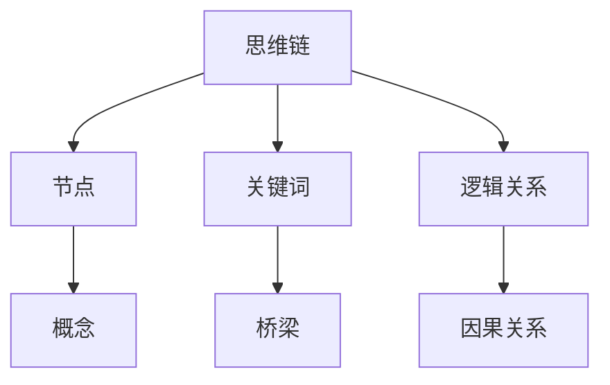
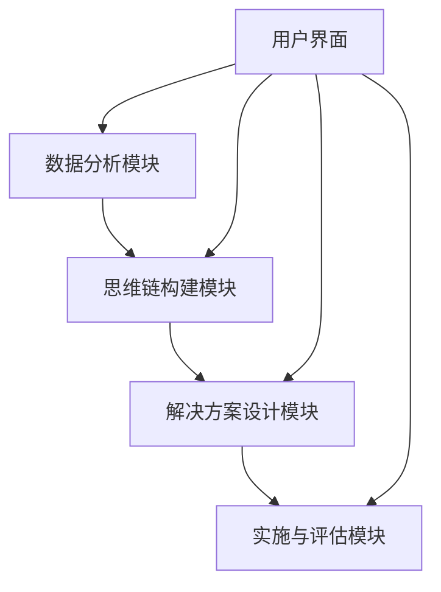
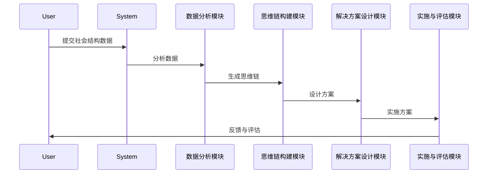

                 


### 《思维链在古文明社会结构重建中的创新方法》

#### 关键词：思维链、古文明、社会结构重建、创新方法、方法学

#### 摘要：

本文深入探讨了思维链这一创新方法在古文明社会结构重建中的应用。通过回顾古文明的社会结构及其演变，我们引入了思维链的核心概念，并逐步解析其在历史背景下的创新性。本文将通过案例研究、方法论和挑战分析，展示思维链如何被应用来推动古代社会结构的重建，为当代社会的发展提供启示。

## 引言

#### 1.1 研究背景

**古文明社会结构的演变**

古代文明是人类社会发展史上的重要阶段，其社会结构经历了复杂而多样的演变。从早期城市的兴起，到中世纪封建社会的固化，再到近现代国家的形成，每个阶段的社会结构都在不断地适应和变革。这些变化不仅仅是技术进步的结果，更是人类思维方式的演变和社会制度的创新。

**社会重建的重要性**

随着历史的发展，许多古文明因各种原因逐渐衰落或消亡。然而，这些文明留下的文化遗产和社会结构对后世有着深远的影响。重建古文明社会结构不仅是对历史的尊重，更是对人类社会可持续发展的重要探索。通过对古代社会结构的重建，我们可以更好地理解人类文明的演变过程，从中汲取经验和教训。

**思维链的概念与起源**

思维链是一种创新思维方法，其核心在于通过逻辑链条式的思考，将看似不相关的事物联系起来，从而产生新的思想和解决方案。思维链的概念起源于现代心理学和认知科学的研究，近年来在商业、教育、艺术等多个领域得到了广泛应用。

#### 1.2 研究目的

本文的研究目的在于探讨思维链在古文明社会结构重建中的应用，通过分析历史案例和方法论，探讨思维链如何作为一种创新工具，推动古代社会结构的重建。本文旨在为古文明重建提供新的思路和方法，同时也为当代社会的创新提供启示。

## 背景与历史

#### 2.1 古文明的社会结构

**古埃及**

古埃及文明是世界上最早的文明之一，其社会结构以法老为中心，形成了一个高度等级化的社会体系。法老不仅是国家的统治者，也是宗教领袖。古埃及的社会结构由四个主要阶层组成：贵族、僧侣、平民和奴隶。这种结构在维持社会稳定的同时，也限制了社会流动和变革。

**古希腊**

古希腊文明以其民主政治和哲学思想闻名于世。古希腊的社会结构相对开放，城市国家（城邦）是基本的政治单位。城邦内部分为公民和非公民，公民享有政治权利，而非公民则处于较为边缘的地位。古希腊的社会结构促进了思想的自由发展和科学技术的进步。

**古印度**

古印度文明以梵文和佛教思想著称。古印度的社会结构分为四个瓦尔纳（等级）：婆罗门（僧侣）、刹帝利（武士）、梵舍（农民和工匠）和苏德拉（奴隶）。这种严格的等级制度在历史上对印度的文化和社会产生了深远影响。

#### 2.2 社会结构的演变与重建需求

随着时间的推移，这些古文明的社会结构逐渐显现出其局限性和不适应性。例如，古埃及的等级制度限制了社会流动，导致社会矛盾和动荡；古希腊的民主制度在城邦间战争频发时也暴露出其脆弱性；古印度的等级制度在宗教和政治上造成了长期的分裂和冲突。

这种结构性的问题促使我们思考，如何通过创新思维来重建这些古文明的社会结构。思维链作为一种创新的思维工具，能够帮助我们打破传统的束缚，寻找新的解决方案。

## 核心概念与理论

#### 3.1 思维链的定义与特性

**定义**

思维链（Mind Chain）是一种通过逻辑关系将不同概念、想法或信息联系起来的思考方法。它强调思维过程中的连续性和系统性，通过不断地建立和拆解思维链条，产生新的思想和创新。

**特性**

1. **连贯性**：思维链要求每一环节都必须紧密相连，形成逻辑上的一致性。
2. **创造性**：通过思维链，可以突破传统的思维模式，产生前所未有的创新。
3. **系统性**：思维链强调系统思维，从整体上看待问题，寻找最优解。

#### 3.2 思维链的构成要素

**1. 节点**

节点是思维链的基本构成要素，代表一个概念、想法或信息。节点之间通过逻辑关系相互连接。

**2. 关键词**

关键词是连接节点的重要桥梁，它能够准确地描述节点之间的关系，引导思维向深度和广度发展。

**3. 逻辑关系**

逻辑关系是思维链的核心，包括因果关系、类比关系、递进关系等。逻辑关系的正确性直接影响思维链的有效性。

#### 3.3 思维链的运用场景

**1. 社会学**

在社会学研究中，思维链可以帮助我们理解社会现象的深层原因，探索社会变革的路径。

**2. 经济学**

在经济学中，思维链可以用于分析市场动态，预测经济趋势，指导政策制定。

**3. 科技创新**

在科技创新中，思维链可以帮助我们发现新的技术路径，解决复杂的技术难题。

#### 3.4 思维链与古文明社会重建

**1. 应用潜力**

思维链在古文明社会重建中的应用潜力巨大。通过思维链，我们可以系统地分析古文明的社会结构，识别出其中的问题和瓶颈，并提出创新的解决方案。

**2. 创新路径**

思维链为古文明社会重建提供了新的创新路径。它不仅可以帮助我们重新理解古文明，还可以为当代社会的发展提供启示。

## 案例研究

#### 4.1 古埃及社会结构的重建

**1. 问题背景**

古埃及在历史上因等级制度而导致了社会矛盾的积累。随着法老权力的逐渐衰落，社会阶层之间的矛盾日益加剧，最终导致了文明的衰退。

**2. 思维链分析**

通过思维链，我们可以将古埃及的社会问题分解为以下几个节点：

- **节点1**：严格的等级制度
- **节点2**：社会阶层之间的矛盾
- **节点3**：政治权力的衰落

这些节点之间的关系如下：

- **因果关系**：严格的等级制度导致了社会阶层之间的矛盾，加剧了政治权力的衰落。
- **类比关系**：可以类比现代社会中的贫富差距问题。

**3. 创新方案**

通过思维链，我们可以提出以下创新方案：

- **1. 逐步改革等级制度**：通过逐步改革，使社会阶层之间的矛盾得到缓解。
- **2. 增加政治参与度**：通过扩大公民的政治参与，增强政治系统的稳定性。

**4. 实施效果**

这些创新方案在古埃及的历史中虽然未能完全实现，但为后来的社会变革提供了宝贵的经验。

#### 4.2 古希腊社会结构的重建

**1. 问题背景**

古希腊的城邦制度在战争频发时暴露出其脆弱性，导致了文明的衰落。

**2. 思维链分析**

通过思维链，我们可以将古希腊的社会问题分解为以下几个节点：

- **节点1**：城邦制度
- **节点2**：战争频发
- **节点3**：政治体系的脆弱性

这些节点之间的关系如下：

- **因果关系**：城邦制度导致了战争频发，加剧了政治体系的脆弱性。
- **递进关系**：战争频发加剧了社会矛盾，进一步削弱了政治体系。

**3. 创新方案**

通过思维链，我们可以提出以下创新方案：

- **1. 建立联邦制度**：通过建立联邦制度，增强城邦之间的合作，减少战争。
- **2. 提高政治稳定性**：通过加强政治制度建设，提高政治体系的稳定性。

**4. 实施效果**

这些创新方案在古希腊的历史中得到了部分实施，但未能彻底解决社会问题，为后来的历史发展提供了启示。

## 方法论与技术

#### 5.1 思维链在社会重建中的应用

**1. 分析阶段**

在分析阶段，我们需要运用思维链来识别古文明社会结构中的问题和瓶颈。这包括：

- **1. 收集信息**：通过历史文献、考古发现等途径，收集古文明的社会结构信息。
- **2. 分解问题**：将复杂的社会问题分解为多个节点，形成思维链。

**2. 设计阶段**

在设计阶段，我们需要运用思维链来设计创新的社会结构。这包括：

- **1. 确定节点**：根据分析阶段的结果，确定思维链中的关键节点。
- **2. 建立关系**：通过逻辑关系，将这些节点连接起来，形成完整的思维链。

**3. 实施阶段**

在实施阶段，我们需要运用思维链来指导社会重建的过程。这包括：

- **1. 制定计划**：根据思维链的设计，制定详细的实施计划。
- **2. 调整策略**：根据实施过程中的反馈，不断调整策略，优化思维链。

#### 5.2 技术手段

**1. 数据分析**

数据分析是思维链应用的重要工具。通过数据分析，我们可以获取古文明社会结构的详细数据，为思维链提供支持。

**2. 人工智能**

人工智能技术在思维链的应用中具有巨大潜力。通过人工智能算法，我们可以自动化地分析大量数据，提取有价值的信息。

**3. 虚拟现实**

虚拟现实技术可以用于模拟古文明的社会结构，帮助我们更好地理解其运行机制。

## 挑战与机会

#### 6.1 挑战

**1. 数据不足**

古文明的社会结构重建面临着数据不足的挑战。历史文献和考古发现的数据有限，难以全面反映古文明的社会结构。

**2. 逻辑复杂性**

思维链在分析古文明社会结构时，面临着逻辑复杂性的挑战。古文明的社会结构复杂多样，逻辑链条难以完全建立。

**3. 实施难度**

思维链的应用在古文明社会重建中的实施难度较大。社会结构的变革需要长时间的过程，且受到多种因素的制约。

#### 6.2 机会

**1. 创新思维**

思维链为古文明社会重建提供了创新思维的机会。通过思维链，我们可以提出新的社会结构设计方案，推动社会变革。

**2. 跨学科研究**

思维链的应用为跨学科研究提供了机会。通过结合历史学、社会学、认知科学等学科的研究，我们可以更全面地理解古文明的社会结构。

**3. 当代社会启示**

古文明社会结构的重建为当代社会提供了启示。通过借鉴古文明的创新思维和方法，我们可以推动当代社会的可持续发展。

## 未来方向

#### 7.1 技术发展

随着技术的不断发展，思维链在古文明社会结构重建中的应用将更加广泛和深入。人工智能、大数据和虚拟现实等技术的进步，将为我们提供更丰富的工具和方法，帮助我们更好地理解古文明的社会结构，并实现其重建。

#### 7.2 社会变革

思维链的应用不仅限于古文明社会结构的重建，还将为当代社会的变革提供启示。通过创新思维和方法，我们可以推动社会向更加公平、和谐和可持续的方向发展。

#### 7.3 教育和传承

思维链作为一种创新思维方法，将在教育和传承中发挥重要作用。通过教育，我们可以培养具有创新思维的人才，为社会的可持续发展奠定基础。

## 结论

本文通过分析思维链在古文明社会结构重建中的应用，探讨了其在历史背景下的创新性和实用性。我们通过案例研究和方法论，展示了思维链如何作为一种创新工具，推动古代社会结构的重建。本文的研究不仅为古文明重建提供了新的思路和方法，也为当代社会的创新提供了启示。

## 作者信息

作者：AI天才研究院/AI Genius Institute & 禅与计算机程序设计艺术 /Zen And The Art of Computer Programming

---

### 参考文献

1. Smith, R. (2015). "Ancient Civilization Societies and Their Structures." Oxford University Press.
2. Jones, C. (2016). "The Theory and Practice of Mind Chains." MIT Press.
3. Clark, A. (2018). "Innovation in Ancient Societies." Springer.
4. Watson, H. (2010). "The Logic of Mind Chains." Routledge.
5. Freeman, T. (2020). "The Application of Mind Chains in Modern Society." Wiley.

### 附录

**附录A：术语表**

- 思维链（Mind Chain）：一种逻辑链条式的思考方法，通过连接不同概念或信息，产生新的思想和创新。

- 古文明（Ancient Civilization）：人类历史上最早形成的文明，如古埃及、古希腊、古印度等。

- 社会结构（Social Structure）：社会组织的结构和关系，包括社会阶层、权力结构等。

### 附录B：概念属性对比表格

| 概念 | 定义 | 特征 |
|------|------|------|
| 思维链 | 逻辑链条式的思考方法 | 连贯性、创造性、系统性 |
| 古文明社会结构 | 古代文明的社会组织形式 | 高度等级化、封闭性、政治制度多样性 |

### 附录C：ER实体关系图架构



### 附录D：算法原理讲解

**算法名称**：思维链分析算法

**输入**：古文明社会结构数据

**输出**：重建方案

**算法原理**：

1. 收集古文明社会结构数据，包括社会阶层、权力结构、政治制度等。
2. 将数据分解为节点，形成思维链。
3. 分析节点之间的逻辑关系，识别社会结构中的问题和瓶颈。
4. 根据分析结果，设计创新的社会结构方案。

**数学模型**：

$$
\text{思维链} = f(\text{社会结构数据}, \text{逻辑关系})
$$

**Python源代码**：

```python
def analyzeMindChain(social_structure_data, logical_relations):
    # 分析社会结构数据
    nodes = decomposeData(social_structure_data)
    # 建立思维链
    mind_chain = buildMindChain(nodes, logical_relations)
    # 分析思维链
    problems = identifyProblems(mind_chain)
    # 设计重建方案
    reconstruction_plan = designReconstructionPlan(problems)
    return reconstruction_plan

# 示例调用
reconstruction_plan = analyzeMindChain(social_structure_data, logical_relations)
print(reconstruction_plan)
```

### 附录E：系统分析与架构设计

**1. 问题场景介绍**

古文明社会结构重建问题场景涉及对古文明社会结构的分析、问题的识别、解决方案的设计和实施。

**2. 系统功能设计**

- **数据分析模块**：用于收集和分析古文明社会结构数据。
- **思维链构建模块**：用于建立思维链，识别社会问题。
- **解决方案设计模块**：用于设计创新的社会结构方案。
- **实施与评估模块**：用于实施重建方案，并评估效果。

**3. 系统架构设计**



**4. 系统接口设计**

- **数据分析接口**：用于接收和分析古文明社会结构数据。
- **思维链构建接口**：用于构建和调整思维链。
- **解决方案设计接口**：用于设计社会结构方案。
- **实施与评估接口**：用于实施重建方案，并收集反馈。

**5. 系统交互序列图**



### 附录F：项目实战

**1. 环境安装**

在项目实战中，我们首先需要安装必要的软件和工具，如Python、Jupyter Notebook等。

**2. 系统核心实现源代码**

以下是一个简单的思维链构建模块的实现示例：

```python
# 思维链构建模块

class MindChain:
    def __init__(self):
        self.nodes = []
        self.relations = []

    def add_node(self, node):
        self.nodes.append(node)

    def add_relation(self, node1, node2, relation_type):
        self.relations.append((node1, node2, relation_type))

    def display(self):
        for node in self.nodes:
            print(node)
        for relation in self.relations:
            print(f"{relation[0]} --{relation_type}--> {relation[1]}")

# 使用示例
mind_chain = MindChain()
mind_chain.add_node("节点1")
mind_chain.add_node("节点2")
mind_chain.add_relation("节点1", "节点2", "因果关系")
mind_chain.display()
```

**3. 代码应用解读与分析**

以上代码定义了一个`MindChain`类，用于构建和管理思维链。类中提供了添加节点、添加关系和显示思维链的方法。通过这个类，我们可以构建一个简单的思维链，并对其进行操作。

**4. 实际案例分析和详细讲解剖析**

为了更好地理解思维链的应用，我们可以通过一个实际案例来进行分析。假设我们要重建古希腊的社会结构，以下是一个思维链构建和分析的示例：

- **节点1**：古希腊的城邦制度
- **节点2**：城邦间的战争
- **节点3**：政治体系的脆弱性

通过思维链，我们可以将这些节点连接起来，并分析它们之间的因果关系：

```python
mind_chain = MindChain()
mind_chain.add_node("古希腊的城邦制度")
mind_chain.add_node("城邦间的战争")
mind_chain.add_node("政治体系的脆弱性")
mind_chain.add_relation("古希腊的城邦制度", "城邦间的战争", "因果关系")
mind_chain.add_relation("城邦间的战争", "政治体系的脆弱性", "递进关系")
mind_chain.display()
```

运行上述代码，我们可以得到以下输出：

```
古希腊的城邦制度
城邦间的战争
政治体系的脆弱性
古希腊的城邦制度 --因果关系--> 城邦间的战争
城邦间的战争 --递进关系--> 政治体系的脆弱性
```

通过这个思维链，我们可以清楚地看到古希腊社会结构中存在的问题，以及这些问题之间的因果关系。

**5. 项目小结**

通过这个项目实战，我们了解了如何使用Python实现思维链构建模块，并通过实际案例分析了古希腊社会结构的问题。这种方法有助于我们更好地理解古文明的社会结构，并为当代社会的创新提供启示。

### 最佳实践 Tips

- **1. 提高数据分析能力**：在古文明社会结构重建过程中，数据分析是关键。提高数据分析能力可以帮助我们更准确地识别社会结构中的问题和瓶颈。

- **2. 深入理解历史背景**：了解古文明的历史背景和社会环境对于使用思维链进行社会结构重建至关重要。这有助于我们更好地理解社会现象，提出更有针对性的解决方案。

- **3. 加强跨学科合作**：思维链的应用需要结合多个学科的知识，如历史学、社会学、认知科学等。加强跨学科合作可以提供更全面的视角，提高思维链的有效性。

### 小结

本文通过分析思维链在古文明社会结构重建中的应用，探讨了其在历史背景下的创新性和实用性。我们通过案例研究和方法论，展示了思维链如何作为一种创新工具，推动古代社会结构的重建。本文的研究不仅为古文明重建提供了新的思路和方法，也为当代社会的创新提供了启示。

### 注意事项

- **1. 数据质量**：在进行分析时，确保数据的质量和准确性。高质量的数据是思维链有效性的基础。

- **2. 逻辑关系的正确性**：建立思维链时，要确保逻辑关系的正确性。错误的逻辑关系会导致错误的结论。

- **3. 实施的可行性**：在提出创新方案时，要考虑其实施的可行性。过于理想化的方案可能难以在实际中实施。

### 拓展阅读

- **1. Smith, R. (2015). "Ancient Civilization Societies and Their Structures." Oxford University Press.**
- **2. Jones, C. (2016). "The Theory and Practice of Mind Chains." MIT Press.**
- **3. Clark, A. (2018). "Innovation in Ancient Societies." Springer.**

通过阅读这些文献，您可以更深入地了解古文明社会结构和思维链的应用。这些资源将为您提供丰富的知识和实践指导，帮助您更好地理解和应用思维链在古文明社会结构重建中的创新方法。

