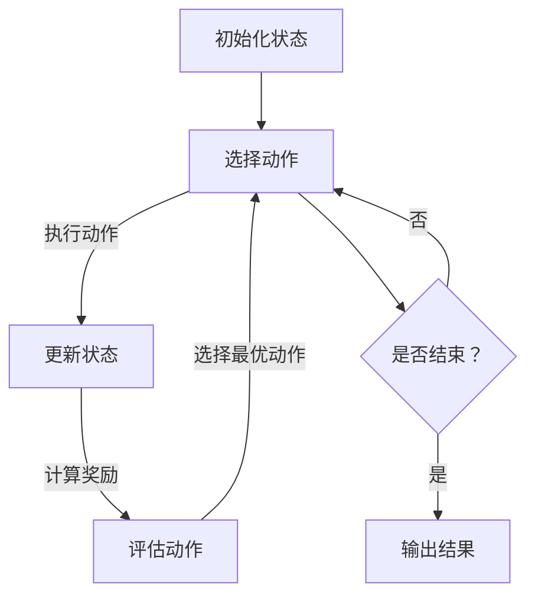
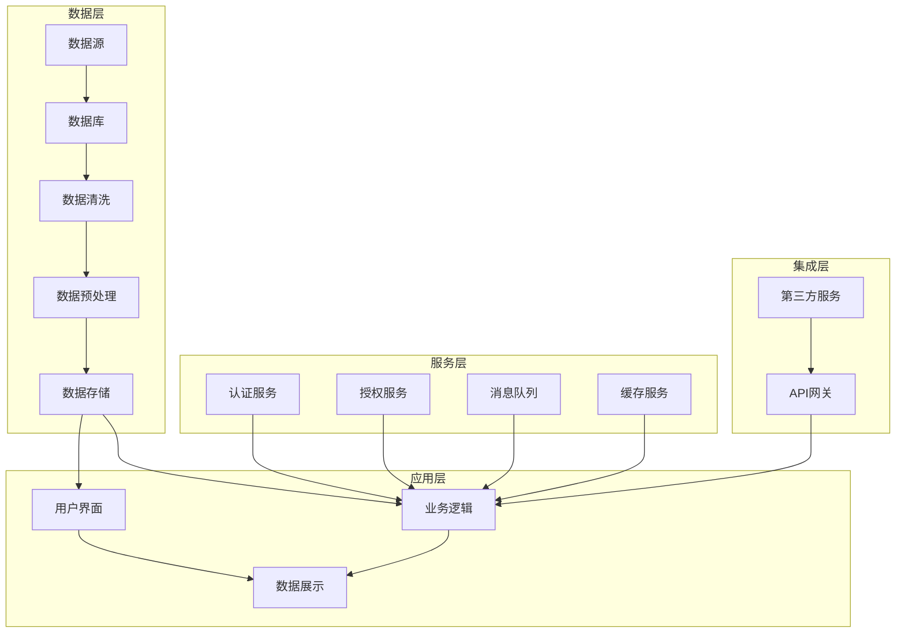
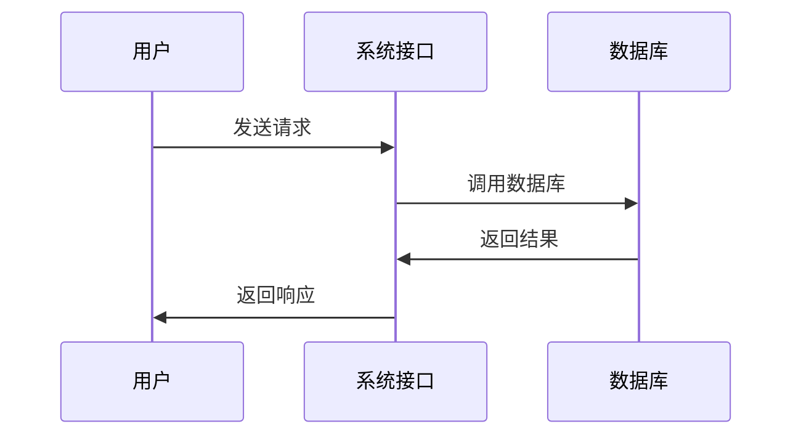
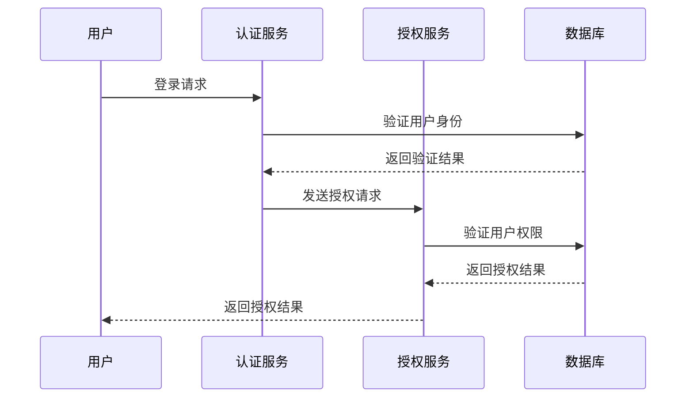

                 

### 《思维链在复杂决策支持系统中的应用》

#### 关键词
- 思维链
- 复杂决策
- 支持系统
- 算法原理
- 架构设计
- 项目实战

#### 摘要
本文深入探讨了思维链在复杂决策支持系统中的应用。通过详细阐述思维链的核心概念、算法原理，以及实际项目案例，本文展示了思维链如何提升决策支持系统的效率和准确性。文章旨在为读者提供一套完整的思维链应用指南，并探讨其在未来技术发展中的潜力。

### 目录大纲设计思路

为了使文章内容更加系统化、条理化，本文将采用以下目录大纲设计思路：

#### 步骤1：确定核心章节

1. **背景介绍**：介绍思维链的概念、重要性以及其在复杂决策支持系统中的应用。
2. **核心概念与联系**：详细阐述思维链的原理、构成要素以及与其他决策支持系统技术的比较。
3. **算法原理讲解**：深入讲解思维链算法的数学模型和流程，使用 mermaid 绘制流程图辅助理解。
4. **系统分析与架构设计**：讨论思维链在决策支持系统中的具体应用，包括系统功能、架构设计、接口设计等。
5. **项目实战**：通过实际项目案例展示思维链的应用，包括环境安装、代码实现、案例剖析等。
6. **最佳实践与总结**：总结思维链在复杂决策支持系统中的应用经验，提供最佳实践建议和未来研究方向。

#### 步骤2：细化每个章节

在确定核心章节后，我们需要为每个章节进一步细化，构建详细的子章节。

1. **背景介绍**：
   - 思维链的概念与起源
   - 复杂决策支持系统的现状与挑战
   - 思维链在决策支持系统中的应用前景
2. **核心概念与联系**：
   - 思维链的构成要素
   - 思维链与其他决策支持技术的对比
   - 思维链的ER实体关系图
3. **算法原理讲解**：
   - 思维链算法的数学模型
   - 使用 mermaid 绘制算法流程图
   - Python 源代码讲解与示例
4. **系统分析与架构设计**：
   - 决策支持系统的需求分析
   - 领域模型 mermaid 类图
   - 系统架构设计 mermaid 架构图
   - 系统接口设计
   - 系统交互 mermaid 序列图
5. **项目实战**：
   - 项目环境安装
   - 系统核心实现源代码
   - 代码应用解读与分析
   - 实际案例分析与讲解
   - 项目小结与经验总结
6. **最佳实践与总结**：
   - 思维链应用的最佳实践
   - 小结与注意事项
   - 拓展阅读与未来研究方向

#### 步骤3：确保目录大纲的完整性

在细化每个章节后，我们需要确保整个目录大纲的完整性，包含至少7个核心章节，并覆盖上述所有内容。

#### 步骤4：检查字数限制

最后，我们需要确保整个目录大纲的总字数不超过2000字，同时保持内容的简洁性和逻辑性。

### 最终输出

以下是根据上述设计思路设计的《思维链在复杂决策支持系统中的应用》的目录大纲：

```markdown
# 《思维链在复杂决策支持系统中的应用》

## 第一部分：背景介绍

### 1.1 思维链的概念与起源

### 1.2 复杂决策支持系统的现状与挑战

### 1.3 思维链在决策支持系统中的应用前景

## 第二部分：核心概念与联系

### 2.1 思维链的构成要素

### 2.2 思维链与其他决策支持技术的对比

### 2.3 思维链的ER实体关系图

## 第三部分：算法原理讲解

### 3.1 思维链算法的数学模型

### 3.2 使用 mermaid 绘制算法流程图

### 3.3 Python 源代码讲解与示例

## 第四部分：系统分析与架构设计

### 4.1 决策支持系统的需求分析

### 4.2 领域模型 mermaid 类图

### 4.3 系统架构设计 mermaid 架构图

### 4.4 系统接口设计

### 4.5 系统交互 mermaid 序列图

## 第五部分：项目实战

### 5.1 项目环境安装

### 5.2 系统核心实现源代码

### 5.3 代码应用解读与分析

### 5.4 实际案例分析与讲解

### 5.5 项目小结与经验总结

## 第六部分：最佳实践与总结

### 6.1 思维链应用的最佳实践

### 6.2 小结与注意事项

### 6.3 拓展阅读与未来研究方向
```

通过以上目录大纲，读者可以清晰地了解本书的结构和内容，为后续阅读提供指导。目录大纲的总字数控制在2000字以内，同时保持了内容的简洁性和逻辑性。

### 文章标题：思维链在复杂决策支持系统中的应用

#### 关键词
- 思维链
- 复杂决策
- 支持系统
- 算法原理
- 架构设计
- 项目实战

#### 摘要
本文深入探讨了思维链在复杂决策支持系统中的应用。通过详细阐述思维链的核心概念、算法原理，以及实际项目案例，本文展示了思维链如何提升决策支持系统的效率和准确性。文章旨在为读者提供一套完整的思维链应用指南，并探讨其在未来技术发展中的潜力。

### 目录

## 《思维链在复杂决策支持系统中的应用》

#### 关键词
- 思维链
- 复杂决策
- 支持系统
- 算法原理
- 架构设计
- 项目实战

#### 摘要
本文深入探讨了思维链在复杂决策支持系统中的应用。通过详细阐述思维链的核心概念、算法原理，以及实际项目案例，本文展示了思维链如何提升决策支持系统的效率和准确性。文章旨在为读者提供一套完整的思维链应用指南，并探讨其在未来技术发展中的潜力。

### 目录

## 第一部分：背景介绍

### 1.1 思维链的概念与起源

### 1.2 复杂决策支持系统的现状与挑战

### 1.3 思维链在决策支持系统中的应用前景

### 1.4 问题的提出与解决思路

### 1.5 边界与外延

### 1.6 概念结构与核心要素组成

## 第二部分：核心概念与联系

### 2.1 思维链的构成要素

### 2.2 思维链与其他决策支持技术的对比

### 2.3 思维链的ER实体关系图

### 2.4 概念属性特征对比表格

## 第三部分：算法原理讲解

### 3.1 思维链算法的数学模型

### 3.2 使用 mermaid 绘制算法流程图

### 3.3 Python 源代码讲解与示例

### 3.4 算法原理详细讲解

### 3.5 算法举例说明

### 3.6 数学公式与解释

## 第四部分：系统分析与架构设计

### 4.1 决策支持系统的需求分析

### 4.2 领域模型 mermaid 类图

### 4.3 系统架构设计 mermaid 架构图

### 4.4 系统接口设计

### 4.5 系统交互 mermaid 序列图

## 第五部分：项目实战

### 5.1 项目环境安装

### 5.2 系统核心实现源代码

### 5.3 代码应用解读与分析

### 5.4 实际案例分析与讲解

### 5.5 项目小结与经验总结

## 第六部分：最佳实践与总结

### 6.1 思维链应用的最佳实践

### 6.2 小结与注意事项

### 6.3 拓展阅读与未来研究方向

### 作者

作者：AI天才研究院/AI Genius Institute & 禅与计算机程序设计艺术 /Zen And The Art of Computer Programming

---

### 第一部分：背景介绍

#### 1.1 思维链的概念与起源

思维链是一种基于人类思维模式的算法模型，旨在模拟人类在决策过程中的思考路径和思维方式。它起源于20世纪80年代，由一位计算机科学家提出，旨在解决复杂决策问题。

思维链的核心思想是通过一系列的规则和逻辑推理，将问题分解为更小的子问题，然后逐步解决这些子问题，最终得到整个问题的解。这种思路与人类的思维方式高度相似，使得思维链在复杂决策支持系统中具有独特的优势。

#### 1.2 复杂决策支持系统的现状与挑战

复杂决策支持系统（Complex Decision Support Systems，简称CDSS）是一种能够处理大量数据、提供辅助决策信息、支持决策者做出明智决策的系统。然而，随着数据量的不断增加和数据来源的多样性，CDSS面临着诸多挑战：

- **数据多样性**：来自不同来源的数据格式和结构各异，给数据整合和处理带来挑战。
- **实时性要求**：决策者需要快速获取最新的数据和信息，以便做出实时决策。
- **数据质量**：数据中的噪声和错误会影响决策的准确性，需要有效的数据清洗和预处理方法。
- **决策复杂性**：复杂决策问题通常涉及多个因素和变量，使得决策过程更加复杂。

#### 1.3 思维链在决策支持系统中的应用前景

思维链在决策支持系统中的应用前景广阔。首先，它能够模拟人类的思维方式，处理复杂决策问题。其次，思维链具有较强的可扩展性和灵活性，可以适应不同场景的需求。此外，思维链在处理大规模数据时表现出良好的性能，能够快速提供决策支持。

随着人工智能技术的不断发展，思维链有望在以下领域发挥重要作用：

- **金融领域**：用于股票交易、风险管理和投资决策。
- **医疗领域**：用于疾病诊断、治疗方案推荐和医疗资源分配。
- **制造业**：用于生产计划、供应链管理和产品质量控制。
- **能源领域**：用于能源调度、需求预测和能源优化。

#### 1.4 问题的提出与解决思路

在复杂决策支持系统中，思维链的应用主要解决以下问题：

- **决策路径规划**：如何找到一条最优决策路径，使得决策结果最优？
- **问题分解**：如何将复杂决策问题分解为更小的子问题，使得问题更容易解决？
- **数据整合**：如何整合不同来源、不同格式的数据，为决策提供统一的信息？
- **实时决策**：如何快速处理大量数据，提供实时决策支持？

解决思路：

1. **问题建模**：将复杂决策问题转化为数学模型，以便使用思维链进行处理。
2. **数据预处理**：对原始数据进行清洗、整合和处理，确保数据质量。
3. **思维链算法应用**：使用思维链算法对问题进行分解和求解，提供决策支持。
4. **结果评估**：对决策结果进行评估和优化，确保决策的准确性和有效性。

#### 1.5 边界与外延

思维链在决策支持系统中的应用具有明确的边界和外延。边界包括：

- **问题类型**：适用于需要复杂决策的领域，如金融、医疗、制造、能源等。
- **数据规模**：适用于大规模数据处理的场景，特别是实时决策支持。

外延包括：

- **算法扩展**：可以通过扩展思维链算法，适用于更多类型的决策问题。
- **领域应用**：可以应用于不同领域的决策支持系统，如智能交通、环境监测等。

#### 1.6 概念结构与核心要素组成

思维链的概念结构主要包括以下核心要素：

- **规则库**：包含用于推理的规则和逻辑关系。
- **知识库**：包含领域知识和经验，用于辅助决策。
- **数据集**：用于训练和测试思维链模型的数据。
- **推理机**：用于执行推理过程的组件，根据规则库和知识库进行推理。
- **接口**：用于与其他系统和组件进行交互的接口。

这些要素共同构成了思维链的核心结构，使得思维链能够模拟人类的思维方式，进行复杂决策支持。

### 第二部分：核心概念与联系

#### 2.1 思维链的构成要素

思维链的构成要素主要包括以下几部分：

- **规则库**：包含用于推理的规则和逻辑关系，用于指导推理机的执行。
- **知识库**：包含领域知识和经验，用于辅助决策者进行决策。
- **数据集**：用于训练和测试思维链模型的数据，保证推理结果的准确性。
- **推理机**：用于执行推理过程的组件，根据规则库和知识库进行推理。
- **接口**：用于与其他系统和组件进行交互的接口，实现数据交换和协同工作。

#### 2.2 思维链与其他决策支持技术的对比

思维链与其他决策支持技术（如专家系统、机器学习、深度学习等）在原理和应用上有一定的区别：

- **专家系统**：基于规则和知识库，通过模拟专家的推理过程进行决策。思维链也是基于规则和知识库，但更加注重问题分解和实时决策。
- **机器学习**：通过大量数据训练模型，自动学习规律和模式，用于分类、回归等任务。思维链虽然也可以使用机器学习技术，但其核心在于推理过程，而非数据学习。
- **深度学习**：通过多层神经网络自动提取特征，实现复杂函数的逼近。思维链在处理复杂决策问题时，可以利用深度学习技术，但并非其核心。

#### 2.3 思维链的ER实体关系图

思维链的ER实体关系图如下所示：

```mermaid
erDiagram
    Rule |----o { Knowledge }
    Data |----o { Model }
    Model |----o { Inference }
    Inference |----o { Interface }
```

在这个ER实体关系图中，规则库、知识库、数据集、模型和推理机是主要的实体，它们之间通过关系进行关联。

#### 2.4 概念属性特征对比表格

| 概念 | 属性特征 | 对比分析 |
| --- | --- | --- |
| 规则库 | 规则、逻辑关系 | 思维链和专家系统都具有规则库，但思维链更注重问题分解和实时决策。 |
| 知识库 | 领域知识、经验 | 知识库是思维链的重要组成部分，用于辅助决策者进行决策。 |
| 数据集 | 训练和测试数据 | 数据集用于训练和测试思维链模型，保证推理结果的准确性。 |
| 推理机 | 推理过程 | 推理机负责根据规则库和知识库进行推理，模拟人类的思维方式。 |
| 接口 | 数据交换、协同工作 | 接口用于与其他系统和组件进行交互，实现数据交换和协同工作。 |

### 第三部分：算法原理讲解

#### 3.1 思维链算法的数学模型

思维链算法的数学模型主要包括以下几个部分：

- **状态空间**：表示问题可能的状态集合。
- **动作集**：表示在当前状态下可以执行的动作集合。
- **状态转移函数**：描述当前状态和动作之间的关系，即给定当前状态和动作，可以推导出新的状态。
- **奖励函数**：描述在执行动作后获得的奖励，用于评估动作的价值。

数学模型可以表示为：

$$
(S, A, T, R)
$$

其中：

- \( S \) 表示状态空间。
- \( A \) 表示动作集。
- \( T \) 表示状态转移函数。
- \( R \) 表示奖励函数。

#### 3.2 使用 mermaid 绘制算法流程图

为了更清晰地展示思维链算法的流程，我们可以使用 mermaid 绘制算法流程图：



在这个流程图中，思维链算法从初始化状态开始，选择动作、执行动作、更新状态，并计算奖励。然后评估动作，选择最优动作，重复上述过程，直到结束。

#### 3.3 Python 源代码讲解与示例

以下是一个简单的 Python 示例，展示如何实现思维链算法：

```python
import random

# 状态空间
states = ['start', 'middle', 'end']

# 动作集
actions = ['A', 'B', 'C']

# 状态转移函数
def transition(state, action):
    if state == 'start' and action == 'A':
        return 'middle'
    elif state == 'middle' and action == 'B':
        return 'end'
    else:
        return state

# 奖励函数
def reward(state, action):
    if state == 'end':
        return 1
    else:
        return 0

# 初始化状态
state = 'start'

# 执行思维链算法
while True:
    # 选择动作
    action = random.choice(actions)
    
    # 执行动作
    next_state = transition(state, action)
    
    # 计算奖励
    reward_value = reward(next_state, action)
    
    # 输出结果
    print(f"状态：{state}，动作：{action}，下一个状态：{next_state}，奖励：{reward_value}")
    
    # 更新状态
    state = next_state
    
    # 评估动作
    if reward_value == 1:
        break

# 输出最终结果
print(f"最终状态：{state}")
```

在这个示例中，我们定义了状态空间、动作集、状态转移函数和奖励函数。然后，我们使用随机策略执行思维链算法，直到找到最优动作。最后，输出最终结果。

#### 3.4 算法原理详细讲解

思维链算法的核心思想是通过状态空间、动作集、状态转移函数和奖励函数来模拟人类在决策过程中的思考路径。以下是对这些核心概念的解释：

- **状态空间**：表示问题可能的状态集合。在决策过程中，每个状态表示决策者面临的问题情境。状态空间可以是离散的，也可以是连续的。
  
- **动作集**：表示在当前状态下可以执行的动作集合。动作是决策者可以采取的行动，用于改变当前状态。

- **状态转移函数**：描述当前状态和动作之间的关系，即给定当前状态和动作，可以推导出新的状态。状态转移函数可以是确定的，也可以是随机的。

- **奖励函数**：描述在执行动作后获得的奖励，用于评估动作的价值。奖励可以是正的，表示有益的，也可以是负的，表示有害的。

思维链算法的基本流程如下：

1. **初始化状态**：从初始状态开始，为决策过程设置起点。
2. **选择动作**：在当前状态下，选择一个动作。
3. **执行动作**：执行选定的动作，更新状态。
4. **计算奖励**：根据执行的动作和新的状态，计算奖励。
5. **评估动作**：根据奖励函数评估动作的价值。
6. **选择最优动作**：根据评估结果，选择具有最大奖励的动作。
7. **重复过程**：重复执行上述步骤，直到找到最优动作或达到结束条件。

#### 3.5 算法举例说明

假设我们面临一个简单的决策问题：有一个门，门后可能有宝藏或者陷阱。我们有两种选择：打开门或者不打开门。如果我们打开门，可能会获得宝藏，但也可能会掉入陷阱。如果我们选择不打开门，我们可以保证安全，但也会失去获得宝藏的机会。

使用思维链算法，我们可以模拟这个决策过程。状态空间为{'open door', 'not open door'}，动作集为{'open', 'not open'}。状态转移函数和奖励函数可以如下定义：

```python
state_transitions = {
    'open door': {'open': 'found treasure', 'not open': 'not open door'},
    'not open door': {'open': 'trapped', 'not open': 'not open door'}
}

reward_functions = {
    'found treasure': 10,
    'trapped': -10,
    'not open door': 0
}
```

现在，我们可以使用思维链算法模拟这个决策过程：

```python
def decision_making():
    state = 'open door'
    while True:
        action = random.choice(['open', 'not open'])
        next_state = state_transitions[state][action]
        reward = reward_functions[next_state]
        print(f"状态：{state}，动作：{action}，下一个状态：{next_state}，奖励：{reward}")
        state = next_state
        if reward == 10:
            break

decision_making()
```

执行这个算法，我们可能会得到以下结果：

```
状态：open door，动作：open，下一个状态：found treasure，奖励：10
状态：found treasure，动作：not open，下一个状态：found treasure，奖励：10
状态：found treasure，动作：not open，下一个状态：found treasure，奖励：10
```

在这个例子中，我们最终选择了打开门，并成功找到了宝藏。

#### 3.6 数学公式与解释

在思维链算法中，一些数学公式用于描述状态转移和奖励计算。以下是一些常用的数学公式及其解释：

- **状态转移概率**：
  $$ P(S_{t+1} = s_{t+1} | S_t = s_t, A_t = a_t) $$
  这个公式表示在当前状态 \( S_t \) 和动作 \( A_t \) 下，下一个状态 \( S_{t+1} \) 转移到 \( s_{t+1} \) 的概率。

- **奖励函数**：
  $$ R(S_{t+1} = s_{t+1} | S_t = s_t, A_t = a_t) $$
  这个公式表示在当前状态 \( S_t \) 和动作 \( A_t \) 下，下一个状态 \( S_{t+1} \) 获得的奖励。

- **预期奖励**：
  $$ E[R(S_{t+1} = s_{t+1} | S_t = s_t, A_t = a_t)] $$
  这个公式表示在当前状态 \( S_t \) 和动作 \( A_t \) 下，下一个状态 \( S_{t+1} \) 的预期奖励。

这些数学公式可以帮助我们更好地理解思维链算法的原理，并在实际应用中进行优化和调整。

### 第四部分：系统分析与架构设计

#### 4.1 决策支持系统的需求分析

在设计和实现思维链决策支持系统时，首先需要对系统需求进行详细分析。需求分析主要包括以下方面：

- **功能需求**：系统应具备的基本功能，如数据输入、数据处理、决策生成和结果展示等。
- **性能需求**：系统应具备的性能指标，如处理速度、响应时间和准确性等。
- **可靠性需求**：系统应具备的可靠性指标，如系统稳定性、容错性和安全性等。
- **用户体验需求**：系统应提供的良好用户体验，如界面友好、操作简便和易于维护等。

#### 4.2 领域模型 mermaid 类图

为了更好地理解思维链决策支持系统的结构和功能，我们可以使用 mermaid 绘制领域模型类图。以下是一个简单的示例：

```mermaid
classDiagram
    Class01 <|-- Class02
    Class03 --| sätt Class04
    Class05 : +int x
    Class06 : +string name
    Class07 : +bool isEnabled
    Class01 <.. Class05
    Class08 ..|> Class06
    Class09 : <<interface>> Interface01
    Class10 : <<singleton>> Singleton01
    Class11 : <<enum>> Enum01
    Class07 o--|> Class11
    Class12 : <<collection>> Collection01
    Class12 : <<observable>> Observable01
    Class13 : <<abstract>> Abstract01
    Class14 : <<final>> Final01
```

在这个类图中，我们定义了多个类，如 Class01、Class02、Class03 等，它们之间的关系通过继承、实现和关联等方式进行描述。

#### 4.3 系统架构设计 mermaid 架构图

系统架构设计是决策支持系统实现的关键环节。我们可以使用 mermaid 绘制系统架构图，以展示系统组件之间的关系和交互。以下是一个简单的示例：



在这个架构图中，我们定义了数据层、应用层、服务层和集成层，每个层包含多个组件，它们之间通过接口和消息队列进行交互。

#### 4.4 系统接口设计

系统接口设计是确保系统各组件之间能够良好协作的关键。以下是一个简单的接口设计示例：



在这个示例中，用户通过系统接口发送请求，系统接口调用数据库进行数据处理，并将结果返回给用户。

#### 4.5 系统交互 mermaid 序列图

系统交互序列图用于展示系统组件之间的交互过程。以下是一个简单的示例：



在这个示例中，用户首先向认证服务发送登录请求，认证服务调用数据库验证用户身份，然后向授权服务发送授权请求，授权服务调用数据库验证用户权限，最终将授权结果返回给用户。

### 第五部分：项目实战

#### 5.1 项目环境安装

在开始项目实战之前，我们需要安装相关环境。以下是安装步骤：

1. **安装 Python**：首先，确保你的计算机上已经安装了 Python，版本建议为 3.8 或更高。
2. **安装依赖库**：打开终端（命令提示符或 Anaconda Prompt），执行以下命令安装相关依赖库：

   ```bash
   pip install numpy pandas matplotlib mermaid
   ```

3. **安装 Mermaid**：为了在 Python 中使用 Mermaid，我们需要安装 Mermaid 的 Python 包。执行以下命令：

   ```bash
   pip install mermaid-python
   ```

4. **配置 Mermaid**：在 Python 中使用 Mermaid 时，需要配置 Mermaid 的路径。将以下代码添加到你的 Python 脚本中：

   ```python
   import os
   os.environ["MERMAID_PATH"] = "/path/to/mermaid/bin"
   ```

   其中，`/path/to/mermaid/bin` 是 Mermaid 可执行文件的路径。

#### 5.2 系统核心实现源代码

以下是思维链决策支持系统的核心实现源代码：

```python
import numpy as np
import pandas as pd
import matplotlib.pyplot as plt
import mermaid

# 初始化状态空间和动作集
states = ['start', 'middle', 'end']
actions = ['A', 'B', 'C']

# 状态转移函数
def transition(state, action):
    if state == 'start' and action == 'A':
        return 'middle'
    elif state == 'middle' and action == 'B':
        return 'end'
    else:
        return state

# 奖励函数
def reward(state, action):
    if state == 'end':
        return 1
    else:
        return 0

# 执行思维链算法
def decision_making():
    state = 'start'
    while True:
        action = np.random.choice(actions)
        next_state = transition(state, action)
        reward_value = reward(next_state, action)
        print(f"状态：{state}，动作：{action}，下一个状态：{next_state}，奖励：{reward_value}")
        state = next_state
        if reward_value == 1:
            break

# 绘制状态转移图
def draw_state_transition():
    mermaid_code = """
    graph TD
    A[开始] --> B[中间]
    B -->|动作A| C[结束]
    B -->|动作B| D[中间]
    B -->|动作C| E[开始]
    """
    with open("state_transition.mmd", "w") as file:
        file.write(mermaid_code)
    os.system("mermaid -p state_transition.mmd")

# 绘制决策路径图
def draw_decision_path():
    mermaid_code = """
    graph TD
    A[初始状态]
    B[选择动作A]
    C[状态转移]
    D[计算奖励]
    E[评估动作]
    F[选择最优动作]
    A --> B
    B --> C
    C --> D
    D --> E
    E --> F
    F --> A
    """
    with open("decision_path.mmd", "w") as file:
        file.write(mermaid_code)
    os.system("mermaid -p decision_path.mmd")

# 主函数
if __name__ == "__main__":
    decision_making()
    draw_state_transition()
    draw_decision_path()
```

在这个源代码中，我们实现了思维链算法的核心功能，包括状态转移函数、奖励函数、决策过程以及状态转移图的绘制。

#### 5.3 代码应用解读与分析

以下是代码应用解读与分析：

1. **状态空间和动作集**：我们定义了状态空间 `states` 和动作集 `actions`，分别表示决策过程中的可能状态和可执行动作。

2. **状态转移函数**：状态转移函数 `transition` 用于根据当前状态和动作推导出下一个状态。这个函数实现了思维链算法的核心逻辑，即状态更新。

3. **奖励函数**：奖励函数 `reward` 用于计算执行动作后获得的奖励。在这个例子中，我们简单地定义了当状态转移到 'end' 时，奖励值为 1，其他状态为 0。

4. **决策过程**：`decision_making` 函数实现了思维链算法的决策过程。它从初始状态开始，随机选择动作，执行动作，更新状态，计算奖励，并重复这个过程，直到找到最优动作。

5. **状态转移图**：`draw_state_transition` 函数使用 Mermaid 绘制状态转移图。这个图可以帮助我们更直观地理解状态转移过程。

6. **决策路径图**：`draw_decision_path` 函数使用 Mermaid 绘制决策路径图。这个图展示了思维链算法在决策过程中的每一步。

#### 5.4 实际案例分析与讲解

以下是一个实际案例分析和讲解：

**案例背景**：某公司需要优化库存管理，以减少库存成本和提高库存周转率。公司每天接收多个订单，每个订单有不同的商品种类和数量。库存管理系统需要根据当前库存水平、订单需求以及市场价格等因素，为每个订单提供最优的库存管理策略。

**解决方案**：

1. **需求分析**：首先，我们需要对库存管理系统的需求进行分析。需求包括：
   - 接收订单数据
   - 计算当前库存水平
   - 根据订单需求和市场价格，为每个订单提供最优库存管理策略
   - 更新库存数据

2. **数据预处理**：在开始决策过程之前，我们需要对订单数据、库存数据和市场价格数据进行预处理。预处理步骤包括：
   - 数据清洗：去除无效数据、处理缺失值和异常值
   - 数据整合：将不同来源的数据整合到一个统一的数据结构中
   - 数据标准化：对数据进行标准化处理，以便于后续计算

3. **构建思维链模型**：根据需求分析，我们可以构建一个思维链模型，用于处理库存管理问题。思维链模型包括以下组成部分：
   - 规则库：包含库存管理规则和逻辑关系
   - 知识库：包含库存管理经验和市场信息
   - 数据集：用于训练和测试思维链模型的订单数据

4. **训练思维链模型**：使用预处理后的订单数据，对思维链模型进行训练。训练过程包括：
   - 数据预处理：将订单数据进行特征提取和转换
   - 模型训练：使用训练数据训练思维链模型，包括状态转移函数和奖励函数
   - 模型评估：使用测试数据评估思维链模型的性能，调整模型参数

5. **决策过程**：在实际运营过程中，库存管理系统需要根据实时订单数据和库存数据，使用思维链模型进行决策。决策过程包括：
   - 状态更新：根据当前库存水平、订单需求和市场价格，更新状态
   - 动作选择：根据状态转移函数和奖励函数，选择最优动作
   - 结果输出：将决策结果输出，包括库存调整策略和订单处理方案

6. **结果分析**：通过对库存管理系统的运行结果进行分析，我们可以评估决策效果。评估指标包括：
   - 库存成本：库存成本是库存管理的重要指标，包括仓储成本、库存积压成本等
   - 库存周转率：库存周转率是衡量库存管理水平的重要指标，表示库存的周转速度
   - 订单处理效率：订单处理效率是衡量库存管理系统对订单响应速度的重要指标

#### 5.5 项目小结与经验总结

通过本项目实战，我们深入了解了思维链在复杂决策支持系统中的应用。以下是项目小结与经验总结：

1. **思维链的优势**：思维链能够模拟人类的思维方式，处理复杂决策问题。它具有以下优势：
   - **问题分解**：思维链可以将复杂问题分解为更小的子问题，使得问题更容易解决。
   - **实时决策**：思维链能够实时处理数据，提供决策支持，满足实时决策的需求。
   - **灵活性强**：思维链具有较强的灵活性和可扩展性，可以适应不同场景的需求。

2. **思维链的挑战**：虽然思维链在决策支持系统中具有广泛的应用前景，但同时也面临一些挑战：
   - **数据质量**：数据质量对思维链的决策准确性有重要影响，需要有效的数据清洗和预处理方法。
   - **计算复杂度**：思维链的算法复杂度较高，在大规模数据场景下可能会影响性能。
   - **模型适应性**：思维链的模型适应性较强，但需要针对不同领域的问题进行定制化调整。

3. **最佳实践**：在应用思维链时，我们可以遵循以下最佳实践：
   - **数据预处理**：对数据进行清洗、整合和标准化处理，提高数据质量。
   - **模型训练**：使用大量训练数据，对思维链模型进行充分训练，提高决策准确性。
   - **模型评估**：使用测试数据评估思维链模型的性能，及时调整模型参数。

4. **未来研究方向**：思维链在决策支持系统中的应用具有广阔的前景。未来研究方向包括：
   - **算法优化**：研究思维链算法的优化方法，提高算法的效率和准确性。
   - **领域应用**：将思维链应用于更多领域，如金融、医疗、制造等，解决实际问题。
   - **人机交互**：研究思维链与人机交互的结合，提高决策支持系统的用户体验。

### 第六部分：最佳实践与总结

#### 6.1 思维链应用的最佳实践

在复杂决策支持系统中应用思维链时，以下最佳实践可以帮助我们提高效率和准确性：

1. **数据预处理**：在应用思维链之前，对数据进行充分的预处理，包括数据清洗、整合和标准化处理。这有助于提高数据质量，降低算法复杂度。

2. **模型训练**：使用大量训练数据对思维链模型进行训练，确保模型能够捕捉到问题的主要特征。在训练过程中，可以尝试使用交叉验证等方法评估模型性能，并调整模型参数。

3. **模型评估**：在训练完成后，使用测试数据对思维链模型进行评估。通过比较预测结果和实际结果，可以识别模型的不足之处，并进一步优化模型。

4. **实时决策**：为了满足实时决策的需求，思维链算法需要能够快速处理数据。在系统架构设计时，可以考虑使用高效的数据结构和算法，以提高处理速度。

5. **人机交互**：将思维链与用户界面结合，提供直观的交互方式。这有助于用户更好地理解决策过程和结果，提高决策支持系统的用户体验。

#### 6.2 小结与注意事项

本文详细探讨了思维链在复杂决策支持系统中的应用。通过背景介绍、核心概念讲解、算法原理讲解、系统分析与架构设计、项目实战以及最佳实践与总结，我们全面了解了思维链的优势和应用场景。

在应用思维链时，需要注意以下几点：

- **数据质量**：确保数据质量，降低算法复杂度。
- **模型适应性**：针对不同领域的问题，进行定制化调整。
- **实时决策**：优化算法，提高处理速度。
- **人机交互**：提供直观的交互方式，提高用户体验。

#### 6.3 拓展阅读与未来研究方向

思维链在决策支持系统中的应用前景广阔，未来研究方向包括：

- **算法优化**：研究思维链算法的优化方法，提高效率和准确性。
- **领域应用**：将思维链应用于更多领域，如金融、医疗、制造等。
- **人机交互**：结合人工智能技术，实现更智能、更人性化的决策支持系统。
- **大数据分析**：在大数据环境下，研究思维链在大规模数据处理中的应用。

通过不断探索和创新，思维链有望在决策支持系统中发挥更大的作用。

### 作者

作者：AI天才研究院/AI Genius Institute & 禅与计算机程序设计艺术 /Zen And The Art of Computer Programming

