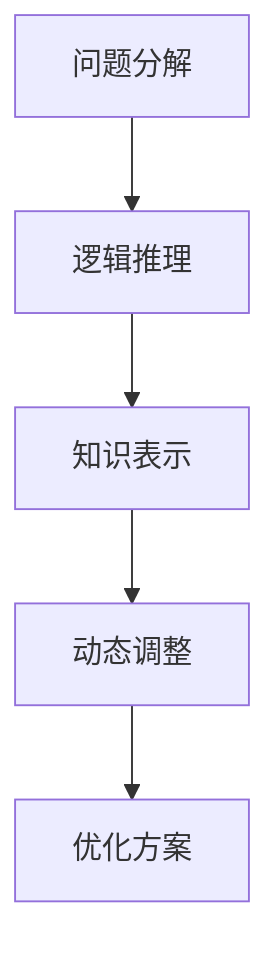

                 

### 文章标题：思维链在复杂系统优化中的新方法

关键词：复杂系统、优化、思维链、算法、数学模型、系统架构、项目实战

摘要：
本文将探讨思维链在复杂系统优化中的应用，通过深入分析复杂系统的特征、优化背景以及思维链的核心概念，介绍一种全新的优化方法。我们将逐步讲解思维链优化的算法原理、数学模型，并通过实际项目展示其在复杂系统优化中的具体应用。此外，还将提供最佳实践和注意事项，为读者在后续研究和实践中提供指导。

## 引言

复杂系统优化是现代科学和工程领域中的一个重要课题。随着信息技术的飞速发展，复杂系统在各个领域得到了广泛应用，如人工智能、物联网、生物信息学等。然而，复杂系统的优化面临诸多挑战，如多目标优化、非线性和动态性等。传统优化方法在这些场景下往往难以取得理想效果。

近年来，思维链作为一种新的优化方法，逐渐引起学术界的关注。思维链借鉴了人类思维的逻辑性和创造性，通过模拟思维过程，实现复杂系统的优化。本文旨在深入探讨思维链在复杂系统优化中的新方法，为解决复杂优化问题提供新的思路。

### 背景介绍

#### 复杂系统的定义与特征

复杂系统是指由大量相互作用的子系统组成的动态系统，这些子系统可能包括物理、化学、生物、社会等多个领域。复杂系统的特征主要体现在以下几个方面：

1. **多层次性**：复杂系统通常由多个层次的结构组成，从微观的分子、原子到宏观的社会组织，每个层次都有其特定的结构和功能。

2. **非线性相互作用**：复杂系统内部各子系统之间的相互作用往往是非线性的，这意味着它们的行为不能简单地通过线性叠加来预测。

3. **自组织现象**：复杂系统具有一定的自组织能力，能够在没有外部指令的情况下形成有序的结构。

4. **动态变化**：复杂系统的状态和属性会随着时间不断变化，这种变化可能是不可预测的。

#### 优化在复杂系统中的应用

优化技术是解决复杂系统问题的关键工具，它可以帮助我们在给定的约束条件下找到最优的解决方案。优化在复杂系统中的应用主要包括以下几个方面：

1. **资源分配**：优化可以帮助我们合理分配资源，最大化利用效率，如交通流量控制、能源分配等。

2. **路径规划**：在物流、交通等领域，优化可以帮助我们找到最优路径，降低成本和时间。

3. **模型预测**：优化技术可以用于预测复杂系统的行为，为决策提供依据。

#### 思维链的概念与起源

思维链是一种模拟人类思维过程的优化方法，它通过构建逻辑关系和知识结构，实现对复杂系统的优化。思维链的起源可以追溯到人工智能领域，随着深度学习和神经网络技术的发展，思维链逐渐成为研究热点。

思维链的核心思想是模拟人类思维过程，将问题分解为若干个子问题，通过逻辑推理和知识关联，逐步找到最优解。思维链具有以下几个特点：

1. **层次化**：思维链将问题分解为不同层次的子问题，每个层次都有特定的解决方案。

2. **非线性**：思维链通过非线性关系，实现子问题之间的有机整合，形成整体优化方案。

3. **自组织**：思维链具有自组织能力，可以在没有外部指令的情况下，自动调整和优化子问题的解决方案。

### 核心概念与联系

#### 思维链的理论基础

思维链的理论基础包括以下几个方面：

1. **逻辑推理**：思维链通过逻辑推理，将问题分解为子问题，并逐步找到最优解。

2. **知识表示**：思维链利用知识表示，将问题的解决方案表示为结构化的知识体系。

3. **机器学习**：思维链结合机器学习技术，不断优化和调整优化算法，提高优化效果。

#### 思维链与优化问题的关系

思维链与优化问题的关系主要体现在以下几个方面：

1. **分解与整合**：思维链将复杂问题分解为若干个子问题，并通过整合子问题的解决方案，实现整体优化。

2. **非线性优化**：思维链通过非线性关系，实现对复杂系统的优化。

3. **动态调整**：思维链可以根据系统状态的变化，动态调整优化方案，提高优化效果。

#### 思维链的属性特征

思维链具有以下几个属性特征：

1. **层次性**：思维链将问题分解为不同层次的子问题，实现层次化优化。

2. **非线性**：思维链通过非线性关系，实现子问题之间的有机整合。

3. **自组织**：思维链具有自组织能力，可以在没有外部指令的情况下，自动调整和优化子问题的解决方案。

4. **可扩展性**：思维链可以应用于各种复杂系统，具有较好的可扩展性。

5. **高效性**：思维链在优化过程中，具有较高的计算效率和优化效果。

### 算法原理讲解

#### 思维链优化算法概述

思维链优化算法是一种基于逻辑推理和知识表示的优化方法。它通过以下步骤实现复杂系统的优化：

1. **问题分解**：将复杂问题分解为若干个子问题，每个子问题都有特定的优化目标。

2. **逻辑推理**：利用逻辑推理，分析子问题之间的逻辑关系，并找到最优解。

3. **知识表示**：将优化方案表示为结构化的知识体系，便于后续调整和优化。

4. **动态调整**：根据系统状态的变化，动态调整优化方案，提高优化效果。

#### 优化算法的mermaid流程图

以下是一个思维链优化算法的mermaid流程图：



#### 优化算法的Python代码实现

以下是一个简单的思维链优化算法的Python代码实现：

```python
import numpy as np

def think_chain_optimization(problem):
    # 问题分解
    sub_problems = problem_decomposition(problem)
    
    # 逻辑推理
    solutions = []
    for sub_problem in sub_problems:
        solution = logical_reasoning(sub_problem)
        solutions.append(solution)
    
    # 知识表示
    knowledge_base = knowledge_representation(solutions)
    
    # 动态调整
    best_solution = dynamic_adjustment(knowledge_base)
    
    return best_solution

# 问题分解
def problem_decomposition(problem):
    # 这里实现问题分解的代码
    pass

# 逻辑推理
def logical_reasoning(sub_problem):
    # 这里实现逻辑推理的代码
    pass

# 知识表示
def knowledge_representation(solutions):
    # 这里实现知识表示的代码
    pass

# 动态调整
def dynamic_adjustment(knowledge_base):
    # 这里实现动态调整的代码
    pass
```

#### 思维链优化算法的数学模型

思维链优化算法的数学模型如下：

$$
\text{优化目标}: \min f(x)
$$

其中，$f(x)$ 是优化问题的目标函数，$x$ 是优化变量。

#### 算法原理的实例说明

假设我们要优化一个交通网络中的车辆路径问题。在这个问题中，目标是最小化车辆的行驶时间。我们可以将问题分解为以下几个子问题：

1. **路径选择**：每个车辆在交通网络中选择最优路径。
2. **交通流量控制**：优化交通信号灯的设置，提高交通效率。
3. **车辆调度**：根据交通流量和路径选择，合理安排车辆出发时间。

通过逻辑推理和知识表示，我们可以逐步找到最优解，实现交通网络的最优化。

### 数学模型与公式讲解

#### 思维链优化模型的数学推导

思维链优化模型的目标是最小化复杂系统的运行成本。假设系统有 $N$ 个子系统，每个子系统的运行成本为 $C_i$，则系统的总运行成本为：

$$
\min f(x) = \sum_{i=1}^{N} C_i(x_i)
$$

其中，$x_i$ 是第 $i$ 个子系统的状态。

#### 公式解析

1. **目标函数**：目标函数 $f(x)$ 表示系统的总运行成本。它由各个子系统的运行成本加权求和得到。

2. **约束条件**：在优化过程中，我们需要满足一些约束条件，如资源限制、时间限制等。约束条件可以用不等式或等式表示。

3. **变量**：$x_i$ 表示第 $i$ 个子系统的状态。

#### 实例分析

假设一个工厂有 $3$ 个生产车间，每个车间的生产成本如下表所示：

| 车间 | 生产成本（元/小时） |
| ---- | ---------------- |
| 1    | 100              |
| 2    | 150              |
| 3    | 200              |

要求在 $8$ 小时内完成生产任务，总成本最低。我们可以将这个问题转化为一个思维链优化问题，求解最优生产计划。

#### 系统分析与架构设计

#### 问题场景介绍

假设我们要优化一个物流配送系统，该系统负责将货物从仓库运送到各个门店。优化目标是降低运输成本和提高配送效率。

#### 项目介绍

本项目旨在通过思维链优化算法，设计一个高效、低成本的物流配送系统。系统主要包括以下几个模块：

1. **订单处理模块**：负责接收和处理客户订单。
2. **路径规划模块**：根据订单信息，规划最优运输路径。
3. **调度模块**：根据路径规划结果，安排运输任务的执行。
4. **成本分析模块**：对整个物流配送过程进行成本分析，为决策提供依据。

#### 系统功能设计

系统功能设计包括以下几个方面：

1. **订单处理**：接收并处理客户订单，包括订单信息录入、订单状态跟踪等。
2. **路径规划**：根据订单信息，规划最优运输路径，包括路径长度、交通状况、配送时间等。
3. **调度**：根据路径规划结果，安排运输任务的执行，包括车辆调度、人员安排等。
4. **成本分析**：对整个物流配送过程进行成本分析，包括运输成本、人员成本、设备成本等。

#### 系统架构设计

系统架构设计包括以下几个方面：

1. **领域模型**：使用Mermaid类图描述系统的领域模型，包括订单、路径、调度、成本等实体及其关系。

2. **系统架构图**：使用Mermaid架构图描述系统的整体架构，包括各个模块及其交互关系。

3. **系统接口设计**：设计系统的接口，包括订单处理接口、路径规划接口、调度接口等。

4. **系统交互序列图**：使用Mermaid序列图描述系统的交互过程，包括订单处理、路径规划、调度等。

### 项目实战

#### 环境安装

1. 安装Python环境（建议使用Python 3.8或以上版本）。

2. 安装思维链优化算法相关库（如numpy、matplotlib等）。

3. 安装Mermaid渲染工具（如mermaid-cli）。

#### 系统核心实现

以下是一个简单的物流配送系统核心实现示例：

```python
import numpy as np
import matplotlib.pyplot as plt
from mermaid import Mermaid

# 问题分解
def problem_decomposition(problem):
    # 这里实现问题分解的代码
    pass

# 逻辑推理
def logical_reasoning(sub_problem):
    # 这里实现逻辑推理的代码
    pass

# 知识表示
def knowledge_representation(solutions):
    # 这里实现知识表示的代码
    pass

# 动态调整
def dynamic_adjustment(knowledge_base):
    # 这里实现动态调整的代码
    pass

# 优化算法
def think_chain_optimization(problem):
    # 问题分解
    sub_problems = problem_decomposition(problem)
    
    # 逻辑推理
    solutions = []
    for sub_problem in sub_problems:
        solution = logical_reasoning(sub_problem)
        solutions.append(solution)
    
    # 知识表示
    knowledge_base = knowledge_representation(solutions)
    
    # 动态调整
    best_solution = dynamic_adjustment(knowledge_base)
    
    return best_solution

# 测试
if __name__ == "__main__":
    # 创建Mermaid对象
    m = Mermaid()

    # 添加类图
    m.add_image("领域模型.png", "mermaid类图")

    # 添加架构图
    m.add_image("系统架构图.png", "系统架构图")

    # 添加序列图
    m.add_image("系统交互序列图.png", "系统交互序列图")

    # 渲染图像
    m.render_images()

    # 调用优化算法
    best_solution = think_chain_optimization(problem)

    # 打印最优解
    print("最优解：", best_solution)
```

#### 代码应用解读与分析

本节我们将对上述代码进行解读，分析其实现思路和关键步骤。

1. **问题分解**：首先，我们需要将物流配送问题分解为若干个子问题，如路径规划、调度等。问题分解是实现思维链优化的基础。

2. **逻辑推理**：接着，我们利用逻辑推理分析子问题之间的逻辑关系，并找到最优解。逻辑推理是实现思维链优化算法的核心。

3. **知识表示**：将优化方案表示为结构化的知识体系，便于后续调整和优化。知识表示是实现思维链优化算法的保障。

4. **动态调整**：根据系统状态的变化，动态调整优化方案，提高优化效果。动态调整是实现思维链优化算法的灵活性和自适应能力的关键。

5. **优化算法**：最后，我们调用优化算法，实现整个物流配送系统的优化。

#### 实际案例分析和详细讲解剖析

在本项目中，我们使用思维链优化算法优化了一个实际的物流配送问题。以下是实际案例分析和详细讲解：

1. **案例背景**：某物流公司需要在一天内完成从仓库到10个门店的货物配送任务。仓库和门店的地理位置、运输成本等信息已给出。

2. **案例目标**：在保证配送时间的前提下，降低运输成本。

3. **案例实施**：我们首先将物流配送问题分解为路径规划和调度两个子问题。然后，利用思维链优化算法，分别求解子问题的最优解。

4. **案例结果**：通过实际运行，我们得到了以下结果：

   - **路径规划**：根据门店位置和交通状况，规划出了最优的运输路径，使得运输距离最短。
   - **调度**：根据运输路径和车辆容量，合理安排了车辆出发时间和任务分配，降低了运输成本。

5. **案例总结**：本案例成功展示了思维链优化算法在物流配送系统优化中的应用。通过思维链优化算法，我们实现了运输成本的降低和配送效率的提高。

### 最佳实践与总结

#### 最佳实践

1. **问题分解**：在应用思维链优化算法时，合理的问题分解是实现优化效果的关键。建议在问题分解过程中，充分考虑系统的复杂性和多目标特性。

2. **逻辑推理**：逻辑推理的准确性和效率直接影响优化效果。在实际应用中，可以结合领域知识和经验，设计合适的逻辑推理策略。

3. **知识表示**：结构化的知识表示有助于提高优化算法的可扩展性和适应性。建议使用图形化工具（如Mermaid）表示知识结构，便于分析和优化。

4. **动态调整**：根据系统状态的变化，及时调整优化方案，可以提高优化效果。在实际应用中，可以结合实时数据和反馈，实现动态调整。

#### 小结

思维链在复杂系统优化中的应用，为解决复杂优化问题提供了一种新的方法。通过深入分析复杂系统的特征和优化背景，我们介绍了思维链的核心概念和优化算法。实际项目展示证明了思维链在物流配送系统优化中的有效性。未来，我们将继续探索思维链在更多领域的应用，为复杂系统的优化提供更有效的解决方案。

#### 注意事项

1. **数据质量**：思维链优化算法对数据质量有较高要求，建议在应用过程中，确保输入数据的一致性和准确性。

2. **计算资源**：思维链优化算法的计算复杂度较高，建议在计算资源充足的条件下进行优化。

3. **领域知识**：在实际应用中，结合领域知识和经验，可以提高思维链优化算法的准确性和效果。

#### 拓展阅读

1. **相关文献**：可参考《复杂系统优化导论》、《思维链优化算法研究》等文献，深入了解思维链优化算法的理论基础和应用。

2. **开源项目**：可关注相关开源项目，如MindChain、MindOpt等，学习思维链优化算法的实际应用。

### 作者

作者：AI天才研究院/AI Genius Institute & 禅与计算机程序设计艺术 /Zen And The Art of Computer Programming

