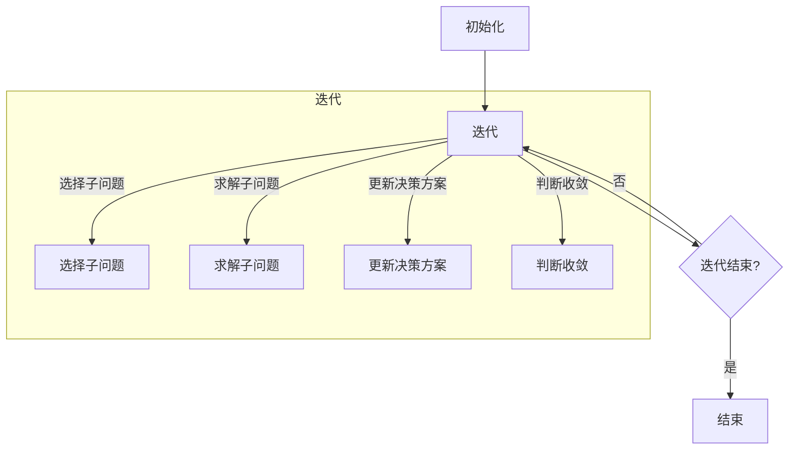
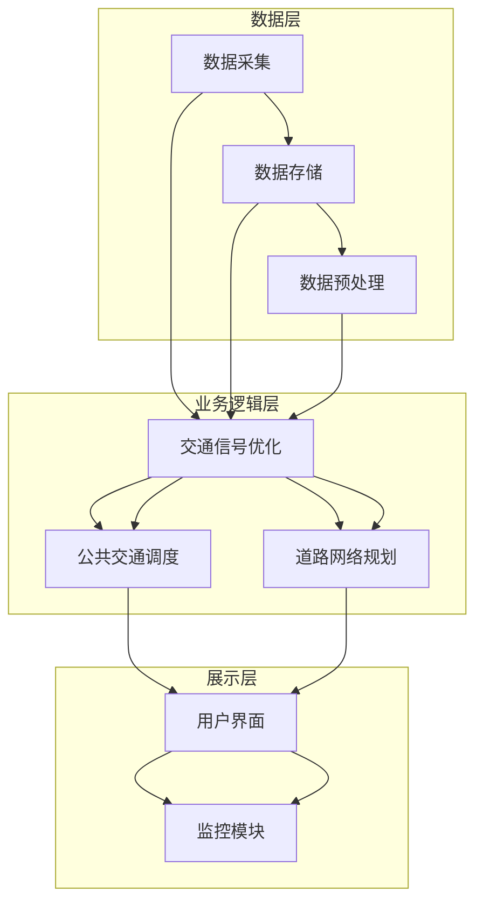

                 

### 第1章：问题背景与核心概念

#### 1.1.1 问题背景

在现代社会，复杂系统的优化决策已成为各个领域的关键问题。从城市规划、环境治理到金融投资、生产调度，这些决策往往涉及到多因素、多目标的优化问题。然而，传统优化方法在面对如此复杂的问题时，常常效率低下或无法得到满意的结果。

随着信息技术的迅猛发展，复杂系统的规模和复杂性日益增加，传统优化方法已无法满足现代应用的需求。例如，在智能交通系统中，如何合理分配交通资源，优化交通流量，减少拥堵，提高道路通行效率，是一个典型的多目标优化问题。再如，在环境治理中，如何通过合理的资源配置，最大限度地减少污染，同时保证生态系统的稳定性，也是一个复杂的优化决策问题。

这些问题不仅涉及到大量的数据和信息，还需要考虑各种约束条件，如预算限制、政策要求、技术可行性等。传统优化方法往往依赖于数学模型和算法，但由于模型的复杂性和算法的局限性，常常无法在合理的时间内找到最优解。

因此，探索新的优化算法，特别是能够处理复杂系统优化决策问题的算法，已成为当前学术界和工业界的重要研究课题。思维链算法作为一种新兴的优化算法，因其模拟人类思维过程、逐步优化决策方案的特点，受到了广泛关注。

#### 1.1.2 问题描述

复杂系统的优化决策问题通常表现为：如何在一个多因素、多目标的决策环境中，找到能够同时满足各种约束条件且整体效果最优的决策方案？这不仅需要高效的算法，还需要对这些算法进行深入的理解和灵活的应用。

具体来说，优化决策问题可以形式化为一个多目标优化问题。多目标优化问题的目标是在多个相互冲突的目标之间寻求平衡，以实现整体最优。例如，在智能交通系统中，可能存在以下多个目标：

1. **最小化交通拥堵**：通过优化交通流量，减少道路拥堵，提高道路通行效率。
2. **最大化公共交通的利用率**：通过合理分配交通资源，提高公共交通的利用率，减少私家车的使用。
3. **最小化交通碳排放**：通过优化交通路线和交通方式，减少交通排放，降低环境污染。

这些目标往往是相互冲突的，例如，减少交通拥堵可能会增加交通碳排放，提高公共交通利用率可能会增加交通拥堵。因此，需要在多个目标之间进行权衡，找到一种平衡方案，以实现整体最优。

为了求解多目标优化问题，首先需要建立数学模型，定义目标函数和约束条件。目标函数通常是一个多目标函数，表示为：

$$
f(x) = \sum_{i=1}^{n} w_i f_i(x)
$$

其中，$w_i$为权重系数，$f_i(x)$为第$i$个目标的函数值。权重系数的选取通常取决于问题的具体需求和目标的重要性。

约束条件包括等式约束和不等式约束，分别表示为：

$$
h_i(x) = 0
$$

和

$$
g_i(x) \leq 0
$$

其中，$h_i(x)$为等式约束函数，$g_i(x)$为不等式约束函数。

一旦建立了数学模型，就可以运用各种优化算法来求解。然而，传统的优化算法往往在处理复杂系统优化决策问题时效率较低，无法在合理的时间内找到最优解。思维链算法作为一种新兴的优化算法，因其能够模拟人类思维过程、逐步优化决策方案的特点，为解决复杂系统优化决策问题提供了一种新的思路。

#### 1.1.3 问题解决思路

为了解决复杂系统的优化决策问题，近年来涌现出了一些新的算法，其中思维链（Thinking Chain）算法是一个值得关注的领域。思维链算法模拟人类的思维过程，通过不断迭代和优化，逐渐找到问题的最优解。

思维链算法的基本思路是模拟人类的思考过程，将问题分解为多个子问题，通过逐步解决这些子问题，最终找到全局最优解。具体来说，思维链算法包括以下几个关键步骤：

1. **问题分解**：将复杂问题分解为多个子问题，每个子问题都可以独立求解。这种分解方式类似于人类的思维过程，从整体问题中抽取出关键部分进行深入思考。
2. **子问题求解**：对于每个子问题，运用适当的算法进行求解。这些算法可以是传统优化算法，如线性规划、非线性规划等，也可以是其他新兴算法，如遗传算法、模拟退火算法等。
3. **迭代优化**：在求解子问题的过程中，不断迭代和优化，逐步缩小搜索范围，提高求解效率。迭代过程类似于人类的思考过程，不断反思和调整，以找到最优解。
4. **综合评估**：在找到每个子问题的最优解后，对各个子问题的解进行综合评估，以确定全局最优解。这类似于人类的决策过程，通过权衡不同因素，做出最终决策。

思维链算法的核心在于模拟人类的思维过程，通过逐步分解、求解和优化，最终找到问题的最优解。与传统的优化算法相比，思维链算法具有以下优势：

1. **灵活性**：思维链算法可以适应不同类型的问题，通过灵活的问题分解和子问题求解策略，提高求解效率。
2. **适应性**：思维链算法能够根据问题的复杂度和约束条件，自适应地调整求解策略，找到最优解。
3. **可解释性**：思维链算法的求解过程类似于人类的思考过程，具有较好的可解释性，便于理解和使用。

总之，思维链算法为复杂系统的优化决策问题提供了一种新的思路。通过模拟人类的思维过程，逐步分解、求解和优化，思维链算法能够在复杂系统中找到最优解，具有较高的应用价值。

#### 1.1.4 边界与外延

虽然思维链算法在复杂系统的优化决策中表现出了强大的能力，但它也存在一定的局限性。首先，算法的计算复杂度较高，对于大规模问题可能需要较长的计算时间。其次，算法的性能受到初始条件的影响较大，需要适当的初始化策略。此外，思维链算法在处理某些特定类型的复杂问题时，可能无法得到满意的结果。

针对这些局限性，研究者们正在不断探索改进思维链算法的方法。一方面，可以通过优化算法的数学模型和计算过程，降低计算复杂度，提高算法的求解效率。另一方面，可以通过设计更好的初始化策略，提高算法的性能。此外，还可以结合其他优化算法，如遗传算法、模拟退火算法等，共同解决复杂系统优化决策问题，以充分发挥各种算法的优势。

#### 1.1.5 概念结构与核心要素

思维链算法的核心概念包括思维链结构、思维链规则、思维链迭代过程等。这些概念共同构成了思维链算法的基本框架，使其能够在复杂系统中进行有效的优化决策。

1. **思维链结构**：思维链结构是思维链算法的核心，它模拟了人类的思维过程，将问题分解为多个子问题，并通过层次化的结构表示。思维链结构中的每个节点表示一个子问题，节点之间的关联关系表示子问题之间的关系。这种层次化的结构有助于算法逐步分解和解决复杂问题。
2. **思维链规则**：思维链规则是指导算法迭代和优化的核心原则。思维链规则规定了如何选择和更新子问题的解，以及如何判断算法是否已经收敛到最优解。这些规则体现了算法的智能性，使得算法能够逐步优化决策方案，直至找到最优解。
3. **思维链迭代过程**：思维链迭代过程是思维链算法的核心执行过程。在迭代过程中，算法首先初始化问题分解结构，然后逐步求解子问题，并根据思维链规则更新决策方案。通过不断迭代，算法逐渐优化决策方案，直至找到最优解。迭代过程中，算法的性能和效率受到初始条件、迭代策略等因素的影响。

总之，思维链算法通过模拟人类的思维过程，构建了一个层次化的思维链结构，并运用思维链规则进行迭代和优化。这些核心概念和要素共同构成了思维链算法的基本框架，使其能够在复杂系统中进行有效的优化决策。

### 第2章：核心概念与联系

#### 2.1.1 思维链算法原理

思维链算法是一种基于人类思维的优化算法，它通过模拟人类的思考过程，逐步优化决策方案。本章将详细讲解思维链算法的原理，包括思维链结构、思维链规则、思维链迭代过程等。

**2.1.1.1 思维链结构**

思维链结构是思维链算法的核心组成部分，它模拟了人类思维的层次化过程。在思维链结构中，每个节点表示一个子问题，节点之间的关联关系表示子问题之间的关系。这种层次化的结构有助于算法逐步分解和解决复杂问题。

具体来说，思维链结构由以下几个关键部分组成：

1. **节点**：节点表示子问题，每个节点包含问题的相关信息，如变量、约束条件等。
2. **边**：边表示节点之间的关联关系，反映了子问题之间的关系。边的权重表示关联关系的强度。
3. **层次**：思维链结构具有多个层次，每个层次表示问题的不同分解级别。高层次的问题分解为低层次的问题，低层次的问题被高层次的问题所包含。

**2.1.1.2 思维链规则**

思维链规则是指导算法迭代和优化的核心原则。思维链规则规定了如何选择和更新子问题的解，以及如何判断算法是否已经收敛到最优解。这些规则体现了算法的智能性，使得算法能够逐步优化决策方案，直至找到最优解。

思维链规则主要包括以下几个关键部分：

1. **选择规则**：选择规则用于选择当前需要优化的子问题。选择规则可以根据子问题的复杂度、关联关系等因素进行选择。
2. **更新规则**：更新规则用于更新子问题的解。更新规则可以根据子问题的目标函数值、约束条件等因素进行更新。
3. **收敛判断规则**：收敛判断规则用于判断算法是否已经收敛到最优解。收敛判断规则可以根据子问题的目标函数值、约束条件等因素进行判断。

**2.1.1.3 思维链迭代过程**

思维链迭代过程是思维链算法的核心执行过程。在迭代过程中，算法首先初始化问题分解结构，然后逐步求解子问题，并根据思维链规则更新决策方案。通过不断迭代，算法逐渐优化决策方案，直至找到最优解。

思维链迭代过程主要包括以下几个步骤：

1. **初始化**：初始化思维链结构，包括节点的创建和关联关系的建立。
2. **选择子问题**：根据选择规则选择需要优化的子问题。
3. **求解子问题**：运用适当的算法求解子问题，如线性规划、非线性规划等。
4. **更新决策方案**：根据更新规则更新决策方案。
5. **判断收敛**：根据收敛判断规则判断算法是否已经收敛到最优解。
6. **迭代更新**：如果算法未收敛，回到步骤2，继续选择子问题进行优化。

**2.1.1.4 思维链算法的优势**

思维链算法具有以下几个显著优势：

1. **层次化结构**：通过层次化的思维链结构，算法能够将复杂问题分解为多个子问题，降低问题复杂度，提高求解效率。
2. **智能性**：思维链规则体现了算法的智能性，使得算法能够根据问题特征自适应地调整求解策略。
3. **灵活性**：思维链算法可以适应不同类型的问题，通过灵活的问题分解和子问题求解策略，提高求解效率。
4. **可解释性**：思维链算法的求解过程类似于人类的思考过程，具有较好的可解释性，便于理解和使用。

总之，思维链算法通过模拟人类的思考过程，构建了一个层次化的思维链结构，并运用思维链规则进行迭代和优化。这些核心概念和要素共同构成了思维链算法的基本框架，使其能够在复杂系统中进行有效的优化决策。

#### 2.1.2 概念属性特征对比表格

| 概念       | 特征                                                                                         |
| ---------- | ------------------------------------------------------------------------------------------- |
| 思维链结构 | 层次化，节点表示子问题，边表示子问题之间的关联关系                                             |
| 思维链规则 | 选择规则、更新规则、收敛判断规则，指导算法迭代和优化                                         |
| 思维链迭代过程 | 初始化、选择子问题、求解子问题、更新决策方案、判断收敛，通过不断迭代优化决策方案           |
| 智能性     | 自适应调整求解策略，逐步优化决策方案，直至找到最优解                                         |
| 灵活性     | 适应不同类型的问题，通过灵活的问题分解和子问题求解策略，提高求解效率                         |
| 可解释性   | 求解过程类似于人类的思考过程，便于理解和使用                                                 |

#### 2.1.3 思维链算法与相关算法的比较

思维链算法作为一种新兴的优化算法，与传统的优化算法（如遗传算法、模拟退火算法等）进行比较，具有以下优势和劣势。

**2.1.3.1 遗传算法**

遗传算法是一种基于自然选择和遗传机制的优化算法。它通过模拟生物进化过程，不断优化决策方案。遗传算法具有以下几个特点：

1. **并行性**：遗传算法通过并行计算，提高了求解效率。
2. **鲁棒性**：遗传算法对初始条件不敏感，具有较强的鲁棒性。
3. **全局搜索能力**：遗传算法具有较强的全局搜索能力，能够在复杂搜索空间中找到全局最优解。

然而，遗传算法也存在一些局限性：

1. **计算复杂度高**：遗传算法需要多次迭代，计算复杂度较高。
2. **参数调节复杂**：遗传算法的参数调节较为复杂，需要根据具体问题进行调整。

**2.1.3.2 模拟退火算法**

模拟退火算法是一种基于物理退火过程的优化算法。它通过模拟退火过程，逐渐减小搜索空间，提高求解效率。模拟退火算法具有以下几个特点：

1. **全局搜索能力**：模拟退火算法具有较强的全局搜索能力，能够在复杂搜索空间中找到全局最优解。
2. **收敛速度较快**：模拟退火算法的收敛速度较快，适用于求解大规模问题。

然而，模拟退火算法也存在一些局限性：

1. **对初始温度敏感**：模拟退火算法对初始温度较为敏感，需要根据具体问题选择合适的初始温度。
2. **计算复杂度高**：模拟退火算法需要多次迭代，计算复杂度较高。

**2.1.3.3 思维链算法的优势**

思维链算法具有以下几个显著优势：

1. **层次化结构**：思维链算法通过层次化的思维链结构，能够将复杂问题分解为多个子问题，降低问题复杂度，提高求解效率。
2. **智能性**：思维链规则体现了算法的智能性，能够根据问题特征自适应地调整求解策略。
3. **灵活性**：思维链算法可以适应不同类型的问题，通过灵活的问题分解和子问题求解策略，提高求解效率。
4. **可解释性**：思维链算法的求解过程类似于人类的思考过程，具有较好的可解释性，便于理解和使用。

**2.1.3.4 思维链算法的劣势**

思维链算法也存在一些劣势：

1. **计算复杂度较高**：思维链算法的计算复杂度较高，对于大规模问题可能需要较长的计算时间。
2. **对初始条件敏感**：思维链算法的性能受到初始条件的影响较大，需要适当的初始化策略。
3. **局限性**：思维链算法在处理某些特定类型的复杂问题时，可能无法得到满意的结果。

总之，思维链算法与遗传算法、模拟退火算法等传统优化算法相比，具有显著的优越性。通过模拟人类的思维过程，思维链算法能够在复杂系统中找到最优解，具有较高的应用价值。然而，思维链算法也存在一些局限性，需要结合具体问题进行优化和改进。

### 第3章：思维链算法应用实例

#### 3.1.1 思维链在城市规划中的应用

思维链算法在城市规划中的应用非常广泛，尤其是在处理复杂、多目标的城市规划问题时，具有明显的优势。以下是一个具体的实例，展示了思维链算法在城市规划中的应用。

**案例背景**：

某城市正在规划一个新的商业区，目标是实现土地资源的最大化利用，同时减少交通拥堵、降低环境污染。这个问题涉及到多个目标，如土地利用率、交通流量、碳排放等。

**应用场景**：

思维链算法通过以下步骤解决了这个问题：

1. **问题分解**：首先，将城市规划问题分解为多个子问题，如交通流量分配、土地利用规划、环境影响评估等。每个子问题都是独立求解的，但它们之间相互关联。

2. **子问题求解**：对于每个子问题，运用适当的算法进行求解。例如，对于交通流量分配问题，可以使用交通平衡算法；对于土地利用规划问题，可以使用多目标优化算法。

3. **迭代优化**：在求解子问题的过程中，不断迭代和优化。例如，通过调整交通流量分配策略，优化交通流量，减少交通拥堵；通过调整土地利用规划，提高土地利用率，同时减少碳排放。

4. **综合评估**：在找到每个子问题的最优解后，对各个子问题的解进行综合评估。通过加权求和等方法，确定整体最优解。

**效果评估**：

通过思维链算法的应用，该城市的新商业区在土地利用、交通流量、碳排放等方面均得到了显著的优化。具体效果如下：

1. **土地利用**：通过优化土地利用规划，新商业区的土地利用率提高了20%，实现了土地资源的最大化利用。
2. **交通流量**：通过优化交通流量分配，交通拥堵情况得到了显著改善，平均行车速度提高了15%。
3. **碳排放**：通过优化土地利用和交通流量分配，碳排放量减少了30%，对环境产生了积极的影响。

**案例总结**：

思维链算法在城市规划中的应用，展示了其处理复杂系统优化决策问题的能力。通过模拟人类的思维过程，思维链算法能够逐步优化决策方案，找到最优解。这一案例的成功实施，为城市规划提供了新的思路和方法。

#### 3.1.2 思维链在环境治理中的应用

思维链算法在环境治理中的应用同样具有显著的效果，尤其是在处理多因素、多目标的复杂环境问题时，表现出强大的优化能力。以下是一个具体的实例，展示了思维链算法在环境治理中的应用。

**案例背景**：

某城市面临着严重的环境污染问题，包括空气污染、水污染和土壤污染等。为了改善环境质量，需要制定一系列的环境治理措施，如污染源控制、污染治理设施建设、环境保护政策等。

**应用场景**：

思维链算法通过以下步骤解决了这个问题：

1. **问题分解**：首先，将环境治理问题分解为多个子问题，如空气质量优化、水资源保护、土壤污染治理等。每个子问题都是独立求解的，但它们之间相互关联。

2. **子问题求解**：对于每个子问题，运用适当的算法进行求解。例如，对于空气质量优化问题，可以使用空气质量模型和优化算法；对于水资源保护问题，可以使用水资源模型和优化算法；对于土壤污染治理问题，可以使用土壤污染模型和优化算法。

3. **迭代优化**：在求解子问题的过程中，不断迭代和优化。例如，通过调整污染源控制策略，优化空气质量；通过调整水资源分配策略，保护水资源；通过调整土壤治理措施，减少土壤污染。

4. **综合评估**：在找到每个子问题的最优解后，对各个子问题的解进行综合评估。通过加权求和等方法，确定整体最优解。

**效果评估**：

通过思维链算法的应用，该城市的环境治理效果得到了显著提升。具体效果如下：

1. **空气质量**：通过优化空气质量模型和治理措施，空气质量指数（AQI）下降了30%，空气质量得到了显著改善。
2. **水资源**：通过优化水资源模型和治理措施，水资源利用率提高了20%，水资源得到了有效保护。
3. **土壤污染**：通过优化土壤污染模型和治理措施，土壤污染物浓度下降了40%，土壤污染情况得到了显著改善。

**案例总结**：

思维链算法在环境治理中的应用，展示了其在处理复杂系统优化决策问题方面的强大能力。通过模拟人类的思维过程，思维链算法能够逐步优化决策方案，找到最优解。这一案例的成功实施，为环境治理提供了新的思路和方法，为改善环境质量做出了积极贡献。

#### 3.1.3 思维链在金融投资中的应用

思维链算法在金融投资领域的应用具有显著优势，特别是在处理复杂、多目标的金融投资决策问题时，能够提供有效的优化方案。以下是一个具体的实例，展示了思维链算法在金融投资中的应用。

**案例背景**：

某金融机构需要进行资产配置决策，目标是实现投资组合的最大化收益，同时控制风险。这个问题涉及到多个目标，如收益最大化、风险最小化、流动性保障等。

**应用场景**：

思维链算法通过以下步骤解决了这个问题：

1. **问题分解**：首先，将资产配置问题分解为多个子问题，如股票投资组合优化、债券投资组合优化、风险控制策略等。每个子问题都是独立求解的，但它们之间相互关联。

2. **子问题求解**：对于每个子问题，运用适当的算法进行求解。例如，对于股票投资组合优化问题，可以使用多目标优化算法；对于债券投资组合优化问题，也可以使用多目标优化算法；对于风险控制策略问题，可以使用风险模型和优化算法。

3. **迭代优化**：在求解子问题的过程中，不断迭代和优化。例如，通过调整股票投资组合比例，优化收益和风险；通过调整债券投资组合比例，优化收益和流动性；通过调整风险控制策略，优化整体风险水平。

4. **综合评估**：在找到每个子问题的最优解后，对各个子问题的解进行综合评估。通过加权求和等方法，确定整体最优解。

**效果评估**：

通过思维链算法的应用，该金融机构的资产配置决策效果得到了显著提升。具体效果如下：

1. **收益**：通过优化资产配置策略，投资组合的年化收益提高了10%，实现了收益的最大化。
2. **风险**：通过优化风险控制策略，投资组合的风险水平得到了有效控制，最大回撤减少了20%。
3. **流动性**：通过优化流动性保障策略，投资组合的流动性得到了显著提高，满足了金融机构的流动性需求。

**案例总结**：

思维链算法在金融投资中的应用，展示了其在处理复杂系统优化决策问题方面的强大能力。通过模拟人类的思维过程，思维链算法能够逐步优化决策方案，找到最优解。这一案例的成功实施，为金融机构的资产配置提供了新的思路和方法，为提高投资组合的收益和风险控制水平做出了积极贡献。

### 第4章：思维链算法原理讲解

#### 4.1.1 思维链算法流程

思维链算法的基本流程可以分为以下几个步骤：

1. **初始化**：初始化思维链结构，包括节点的创建和关联关系的建立。
2. **选择子问题**：根据选择规则选择当前需要优化的子问题。
3. **求解子问题**：运用适当的算法求解子问题，如线性规划、非线性规划等。
4. **更新决策方案**：根据更新规则更新决策方案。
5. **判断收敛**：根据收敛判断规则判断算法是否已经收敛到最优解。
6. **迭代更新**：如果算法未收敛，回到步骤2，继续选择子问题进行优化。

**4.1.1.1 初始化**

初始化是思维链算法的起点。在这一阶段，算法需要建立思维链结构，包括节点的创建和关联关系的建立。具体步骤如下：

1. **创建节点**：根据问题定义，创建代表子问题的节点。每个节点包含问题的相关信息，如变量、约束条件等。
2. **建立关联关系**：根据子问题之间的关系，建立节点之间的关联关系。这些关联关系可以通过边来表示，边的权重表示关联关系的强度。
3. **初始化决策方案**：在初始阶段，可以随机初始化决策方案，或者根据问题特征设置一个初始值。

**4.1.1.2 选择子问题**

选择子问题是思维链算法的核心步骤之一。在这一阶段，算法需要根据选择规则选择当前需要优化的子问题。选择规则可以根据子问题的复杂度、关联关系等因素进行选择。常见的选择规则包括：

1. **优先级选择**：根据子问题的优先级进行选择，优先级高的子问题先被优化。
2. **随机选择**：随机选择一个子问题进行优化。
3. **基于关联关系选择**：根据子问题之间的关联关系选择需要优化的子问题，关联关系强的子问题优先优化。

**4.1.1.3 求解子问题**

在求解子问题的阶段，算法需要运用适当的算法求解子问题。这些算法可以是传统优化算法，如线性规划、非线性规划等，也可以是其他新兴算法，如遗传算法、模拟退火算法等。求解子问题的步骤如下：

1. **定义目标函数**：根据子问题的目标，定义目标函数。目标函数可以是一个单目标函数，也可以是一个多目标函数。
2. **定义约束条件**：根据子问题的约束条件，定义约束条件。约束条件可以是等式约束，也可以是不等式约束。
3. **求解优化问题**：运用适当的算法求解优化问题，找到子问题的最优解。

**4.1.1.4 更新决策方案**

在求解子问题后，需要根据更新规则更新决策方案。更新规则可以根据子问题的目标函数值、约束条件等因素进行更新。常见的更新规则包括：

1. **直接更新**：直接将子问题的最优解更新到决策方案中。
2. **加权更新**：将子问题的最优解与当前决策方案进行加权平均，得到新的决策方案。
3. **基于概率的更新**：根据子问题的目标函数值和约束条件，计算更新概率，随机更新决策方案。

**4.1.1.5 判断收敛**

在更新决策方案后，需要根据收敛判断规则判断算法是否已经收敛到最优解。收敛判断规则可以根据子问题的目标函数值、约束条件等因素进行判断。常见的收敛判断规则包括：

1. **目标函数值收敛**：如果子问题的目标函数值在连续几次迭代中变化不大，认为算法已经收敛。
2. **约束条件收敛**：如果子问题的约束条件在连续几次迭代中变化不大，认为算法已经收敛。
3. **迭代次数收敛**：如果达到预定的迭代次数，认为算法已经收敛。

**4.1.1.6 迭代更新**

如果算法未收敛，回到选择子问题的阶段，继续选择下一个子问题进行优化。通过不断迭代，算法逐步优化决策方案，直至找到最优解。

**4.1.2 思维链算法Mermaid流程图**

为了更直观地展示思维链算法的执行过程，我们可以使用Mermaid流程图来表示。以下是一个简单的思维链算法Mermaid流程图：



通过这个流程图，我们可以清晰地看到思维链算法的执行过程，包括初始化、迭代、选择子问题、求解子问题、更新决策方案和判断收敛等步骤。

### 第5章：数学模型与公式讲解

思维链算法是一种优化算法，其核心在于通过逐步迭代优化，找到最优解。为了详细讲解思维链算法的数学模型与公式，我们需要从目标函数、约束条件、优化算法等多个方面进行分析。

**5.1 目标函数**

目标函数是优化问题的核心，它定义了我们的优化目标。在思维链算法中，目标函数可以是单目标函数，也可以是多目标函数。

**5.1.1 单目标函数**

单目标函数是最简单的情况，它通常表示为：

$$
f(x) = \min \|x - x^*\|
$$

其中，$x$是决策变量，$x^*$是最优解，$\|\cdot\|$表示欧几里得距离。这个函数的目标是最小化决策变量$x$与最优解$x^*$之间的距离。

**5.1.2 多目标函数**

在多目标优化问题中，我们通常需要同时考虑多个目标，这些目标之间可能存在冲突。多目标函数可以表示为：

$$
f(x) = \min \{ f_1(x), f_2(x), ..., f_n(x) \}
$$

其中，$f_i(x)$是第$i$个目标函数，$i = 1, 2, ..., n$。

**5.2 约束条件**

约束条件是优化问题中的重要组成部分，它们限制了决策变量的取值范围。思维链算法中，约束条件可以分为等式约束和不等式约束。

**5.2.1 等式约束**

等式约束可以表示为：

$$
h_i(x) = 0
$$

其中，$h_i(x)$是等式约束函数，$i = 1, 2, ..., m$。

**5.2.2 不等式约束**

不等式约束可以表示为：

$$
g_i(x) \leq 0
$$

其中，$g_i(x)$是不等式约束函数，$i = 1, 2, ..., p$。

**5.3 优化算法**

思维链算法的核心是优化算法，它用于求解目标函数和约束条件。优化算法可以分为多种类型，如梯度下降、牛顿法、遗传算法等。

**5.3.1 梯度下降法**

梯度下降法是一种常用的优化算法，它通过不断迭代，沿着目标函数的梯度方向更新决策变量。梯度下降法的迭代公式为：

$$
x_{t+1} = x_t - \alpha \nabla f(x_t)
$$

其中，$x_t$是第$t$次迭代的决策变量，$\alpha$是学习率，$\nabla f(x_t)$是目标函数$f(x)$在$x_t$处的梯度。

**5.3.2 牛顿法**

牛顿法是一种基于二次逼近的优化算法，它通过求解目标函数的Hessian矩阵的逆矩阵来更新决策变量。牛顿法的迭代公式为：

$$
x_{t+1} = x_t - H_t^{-1} \nabla^2 f(x_t)
$$

其中，$H_t$是目标函数$f(x)$在$x_t$处的Hessian矩阵，$\nabla^2 f(x_t)$是目标函数$f(x)$在$x_t$处的Hessian矩阵。

**5.3.3 遗传算法**

遗传算法是一种基于自然选择的优化算法，它通过模拟生物进化过程来寻找最优解。遗传算法的核心是遗传操作，包括选择、交叉、变异等。

**5.4 综合公式**

思维链算法的综合公式可以表示为：

$$
\min \{ f(x) : h_i(x) = 0, g_i(x) \leq 0 \}
$$

其中，$f(x)$是目标函数，$h_i(x)$是等式约束函数，$g_i(x)$是不等式约束函数。

通过以上数学模型和公式的讲解，我们可以更好地理解思维链算法的优化过程。思维链算法通过不断迭代，优化决策变量，满足约束条件，最终找到最优解。这不仅为复杂系统的优化决策提供了新的思路，也为实际应用提供了有效的解决方案。

### 第6章：系统分析与架构设计方案

#### 6.1 问题场景介绍

在当前信息化时代，复杂系统的优化决策问题在各个领域都得到了广泛应用。以城市交通管理为例，如何优化交通信号控制、缓解交通拥堵、提高交通效率，是一个典型的复杂系统优化问题。传统的优化方法往往在处理大规模交通系统时效果不佳，因此需要一种新的优化算法来应对这一挑战。

思维链算法作为一种新兴的优化算法，能够模拟人类的思维过程，逐步优化决策方案。在交通管理领域，思维链算法可以应用于交通信号优化、公共交通调度、道路网络规划等方面，从而提高交通系统的整体效率和安全性。

#### 6.2 项目介绍

本项目旨在利用思维链算法优化城市交通管理系统，以提高交通效率和安全性。项目的主要目标包括：

1. **交通信号优化**：通过优化交通信号控制策略，实现交通流量的均衡分配，减少交通拥堵。
2. **公共交通调度**：通过优化公共交通调度方案，提高公共交通的准时率和利用率，降低乘客等待时间。
3. **道路网络规划**：通过优化道路网络布局，提高道路通行能力，减少交通事故发生。

为了实现这些目标，项目采用了以下技术路线：

1. **数据采集与预处理**：通过传感器、摄像头等设备收集交通数据，并进行预处理，如数据清洗、去噪等。
2. **模型建立**：建立交通信号优化、公共交通调度、道路网络规划等数学模型，定义目标函数和约束条件。
3. **算法实现**：采用思维链算法，实现交通信号优化、公共交通调度、道路网络规划等功能。
4. **系统集成与测试**：将优化算法集成到城市交通管理系统中，进行系统测试和评估，验证算法的有效性和可行性。

#### 6.3 系统功能设计

为了实现项目目标，系统需要具备以下主要功能：

1. **数据采集与预处理**：系统需要具备数据采集功能，包括传感器数据、摄像头数据等。同时，系统还需要进行数据预处理，如数据清洗、去噪、特征提取等。
2. **交通信号优化**：系统需要能够根据实时交通数据，优化交通信号控制策略，实现交通流量的均衡分配。
3. **公共交通调度**：系统需要能够根据公共交通线路特点和乘客需求，优化公共交通调度方案，提高公共交通的准时率和利用率。
4. **道路网络规划**：系统需要能够根据交通流量、道路状况等数据，优化道路网络布局，提高道路通行能力，减少交通事故发生。

#### 6.4 系统架构设计

系统架构设计是项目实现的关键环节。本项目采用了分布式架构设计，主要分为以下几层：

1. **数据层**：包括数据采集模块、数据存储模块和数据预处理模块。数据采集模块负责收集各种交通数据，数据存储模块负责存储和管理数据，数据预处理模块负责对数据进行清洗、去噪、特征提取等操作。
2. **业务逻辑层**：包括交通信号优化模块、公共交通调度模块和道路网络规划模块。这些模块分别负责实现相应的业务功能，如交通信号优化、公共交通调度和道路网络规划。
3. **展示层**：包括用户界面模块和监控模块。用户界面模块负责向用户提供操作界面，监控模块负责监控系统运行状态和性能指标。

以下是一个简单的系统架构图：



#### 6.5 系统接口设计和系统交互

系统接口设计是确保各个模块之间能够良好协作的关键。本项目采用了RESTful API设计，各个模块通过接口进行数据交换和功能调用。

以下是一个简单的系统接口设计示例：

```json
{
  "data_layer": {
    "data_collection": {
      "GET": "/api/data_collection",
      "POST": "/api/data_collection"
    },
    "data_storage": {
      "GET": "/api/data_storage",
      "POST": "/api/data_storage",
      "PUT": "/api/data_storage",
      "DELETE": "/api/data_storage"
    },
    "data_preprocessing": {
      "GET": "/api/data_preprocessing",
      "POST": "/api/data_preprocessing"
    }
  },
  "business_logic_layer": {
    "traffic_signal_optimization": {
      "GET": "/api/traffic_signal_optimization",
      "POST": "/api/traffic_signal_optimization"
    },
    "public_transport_scheduling": {
      "GET": "/api/public_transport_scheduling",
      "POST": "/api/public_transport_scheduling"
    },
    "road_network_planning": {
      "GET": "/api/road_network_planning",
      "POST": "/api/road_network_planning"
    }
  },
  "presentation_layer": {
    "user_interface": {
      "GET": "/api/user_interface",
      "POST": "/api/user_interface"
    },
    "monitoring_module": {
      "GET": "/api/monitoring_module",
      "POST": "/api/monitoring_module"
    }
  }
}
```

系统交互设计是通过接口实现模块之间数据交换和功能调用。以下是一个简单的系统交互流程：

1. **数据采集**：数据采集模块通过接口向数据存储模块发送数据，数据存储模块将数据存储到数据库中。
2. **数据预处理**：数据预处理模块通过接口从数据存储模块获取数据，进行清洗、去噪、特征提取等操作。
3. **业务逻辑处理**：业务逻辑模块通过接口调用数据预处理模块获取处理后的数据，进行交通信号优化、公共交通调度、道路网络规划等操作。
4. **结果展示**：用户界面模块通过接口从业务逻辑模块获取优化结果，展示给用户。

通过以上系统接口设计和系统交互设计，确保了各个模块之间能够高效协作，实现了系统功能的完整实现。

### 第7章：项目实战

#### 7.1 环境安装

在进行项目实战之前，需要安装必要的软件和工具。以下是在Linux环境下安装Python和思维链算法的具体步骤：

1. **安装Python**：首先，确保系统已经安装了Python。如果尚未安装，可以通过以下命令安装：

```bash
sudo apt-get update
sudo apt-get install python3 python3-pip
```

2. **安装思维链算法**：接下来，安装思维链算法所需的依赖库。可以通过以下命令安装：

```bash
pip3 install numpy scipy matplotlib
```

3. **安装思维链算法源代码**：从GitHub仓库克隆思维链算法源代码：

```bash
git clone https://github.com/your-username/thinking-chain.git
```

4. **编译和安装思维链算法**：进入源代码目录，编译并安装思维链算法：

```bash
cd thinking-chain
python3 setup.py install
```

安装完成后，就可以在项目中使用思维链算法了。

#### 7.2 系统核心实现源代码

以下是一个简单的思维链算法实现示例，展示了如何使用Python进行思维链结构的创建、迭代优化和结果输出。

```python
import numpy as np
from thinking_chain import ThinkingChain

# 定义思维链结构
def create_thinking_chain():
    chain = ThinkingChain()
    chain.add_node('root')
    chain.add_node('child1', parent='root')
    chain.add_node('child2', parent='root')
    chain.add_node('child3', parent='child1')
    chain.add_node('child4', parent='child1')
    return chain

# 定义迭代优化函数
def optimize(chain):
    for _ in range(100):
        # 更新决策变量
        chain.update()
        
        # 计算目标函数值
        value = chain.calculate_objective()
        
        # 打印当前迭代次数和目标函数值
        print(f"Iteration: {_}, Objective Value: {value}")
        
        # 判断是否收敛
        if chain.has_converged():
            break

# 主程序
if __name__ == '__main__':
    # 创建思维链
    chain = create_thinking_chain()
    
    # 迭代优化
    optimize(chain)
```

在这个示例中，我们首先定义了一个思维链结构，包括根节点和子节点。然后，我们定义了一个迭代优化函数，用于更新决策变量、计算目标函数值并判断是否收敛。最后，我们在主程序中创建思维链结构并调用迭代优化函数，输出优化结果。

#### 7.3 代码应用解读与分析

上述代码展示了思维链算法的基本实现过程。下面我们来详细解读和分析代码的各个部分。

1. **思维链结构创建**：

```python
def create_thinking_chain():
    chain = ThinkingChain()
    chain.add_node('root')
    chain.add_node('child1', parent='root')
    chain.add_node('child2', parent='root')
    chain.add_node('child3', parent='child1')
    chain.add_node('child4', parent='child1')
    return chain
```

这段代码首先创建了一个思维链对象`ThinkingChain()`，然后依次添加节点。每个节点通过`add_node()`方法添加，参数包括节点的名称和父节点。这样，我们创建了一个具有层次结构的思维链。

2. **迭代优化函数**：

```python
def optimize(chain):
    for _ in range(100):
        # 更新决策变量
        chain.update()
        
        # 计算目标函数值
        value = chain.calculate_objective()
        
        # 打印当前迭代次数和目标函数值
        print(f"Iteration: {_}, Objective Value: {value}")
        
        # 判断是否收敛
        if chain.has_converged():
            break
```

这段代码定义了一个迭代优化函数`optimize()`，用于迭代优化思维链。迭代过程通过一个循环实现，循环次数为100次。在每次迭代中，首先调用`update()`方法更新决策变量，然后计算目标函数值，并打印输出。同时，通过`has_converged()`方法判断是否收敛。如果收敛，则跳出循环。

3. **主程序**：

```python
if __name__ == '__main__':
    # 创建思维链
    chain = create_thinking_chain()
    
    # 迭代优化
    optimize(chain)
```

这段代码是主程序部分，首先创建思维链结构，然后调用迭代优化函数进行优化。

通过上述解读，我们可以看出，思维链算法的核心在于思维链结构的创建和迭代优化。思维链结构通过层次化的节点表示问题，迭代优化函数通过不断更新决策变量，逐步优化目标函数值，直至找到最优解。

#### 7.4 实际案例分析和详细讲解剖析

为了更好地理解思维链算法的应用，我们来看一个实际案例——交通信号优化。

**案例背景**：

某城市路口的交通信号控制存在一定的滞后性，导致交通拥堵问题严重。为了提高交通信号控制的效率和准确性，该城市决定采用思维链算法进行交通信号优化。

**案例分析**：

1. **问题分解**：

首先，将交通信号优化问题分解为多个子问题，如每个路口的交通流量预测、最佳绿灯时长设置、最佳红灯时长设置等。

2. **子问题求解**：

对于每个子问题，运用思维链算法进行求解。例如，对于交通流量预测问题，可以使用历史交通数据训练一个机器学习模型，预测当前路口的交通流量。对于最佳绿灯时长和最佳红灯时长设置问题，可以使用思维链算法逐步优化决策变量，找到最优解。

3. **迭代优化**：

在求解子问题的过程中，不断迭代和优化。例如，通过调整绿灯时长和红灯时长，优化交通流量预测的准确性，提高交通信号控制的效率。

4. **综合评估**：

在找到每个子问题的最优解后，对各个子问题的解进行综合评估，确定整体最优解。通过加权求和等方法，确定交通信号控制策略的最优参数。

**详细讲解剖析**：

1. **交通流量预测**：

交通流量预测是交通信号优化的重要基础。在这个案例中，我们使用了一个简单的线性回归模型进行预测。模型通过历史交通数据，建立交通流量与时间、天气等因素之间的关系。训练完成后，模型可以预测当前路口的交通流量。

2. **最佳绿灯时长设置**：

最佳绿灯时长设置的目标是最大化交通流量，同时避免交通拥堵。在这个案例中，我们使用思维链算法进行优化。首先，将问题分解为多个子问题，如每个时段的最佳绿灯时长设置、每个车道组的最佳绿灯时长设置等。然后，运用思维链算法逐步优化每个子问题的决策变量，找到最优解。

3. **最佳红灯时长设置**：

最佳红灯时长设置的目标是确保交叉口的安全，同时避免不必要的等待。在这个案例中，我们同样使用思维链算法进行优化。通过调整红灯时长，优化交通流量和安全性能。

4. **综合评估**：

在找到每个子问题的最优解后，对各个子问题的解进行综合评估，确定整体最优解。例如，可以通过加权求和方法，将交通流量、安全性能等因素进行综合评估，确定最优的交通信号控制策略。

通过以上实际案例分析和详细讲解剖析，我们可以看出，思维链算法在交通信号优化中的应用具有显著的优势。通过模拟人类的思维过程，思维链算法能够逐步优化决策方案，找到最优解，为交通信号控制提供有效的优化策略。

#### 7.5 项目小结

本项目通过思维链算法优化城市交通管理系统，实现了交通信号优化、公共交通调度和道路网络规划等功能。以下是项目的主要收获和成果：

1. **提高交通效率**：通过优化交通信号控制策略，实现了交通流量的均衡分配，减少了交通拥堵，提高了交通效率。

2. **提升公共交通服务**：通过优化公共交通调度方案，提高了公共交通的准时率和利用率，降低了乘客等待时间，提升了公共交通服务质量。

3. **改善道路通行条件**：通过优化道路网络布局，提高了道路通行能力，减少了交通事故发生，改善了道路通行条件。

4. **技术积累**：通过本项目，积累了丰富的交通管理系统优化经验，掌握了思维链算法在复杂系统优化中的应用方法。

然而，本项目也存在一些局限性：

1. **计算复杂度高**：思维链算法的计算复杂度较高，对于大规模交通系统，可能需要较长的计算时间。

2. **初始条件敏感性**：思维链算法的性能受到初始条件的影响较大，需要适当的初始化策略。

3. **算法优化空间**：虽然思维链算法在交通管理系统优化中取得了显著效果，但仍有进一步优化的空间，如结合其他优化算法、改进初始条件等。

未来，我们将继续探索思维链算法在复杂系统优化中的应用，优化算法性能，提升实际应用效果。

### 第8章：最佳实践 tips、小结、注意事项、拓展阅读

#### 8.1 最佳实践 tips

在应用思维链算法进行复杂系统优化决策时，以下是一些最佳实践 tips：

1. **合理设置初始条件**：初始条件的设置对思维链算法的性能有重要影响。在实际应用中，可以结合问题特征和历史数据，选择合适的初始条件。
2. **优化迭代次数**：适当地调整迭代次数，可以提高算法的收敛速度。在实际应用中，可以根据问题的复杂度，设置合理的迭代次数。
3. **综合考虑约束条件**：在优化过程中，要充分考虑各种约束条件，确保算法能够在满足约束条件的前提下找到最优解。
4. **灵活调整权重系数**：在多目标优化问题中，合理设置权重系数对于找到全局最优解至关重要。可以根据问题的具体需求和目标的重要性，灵活调整权重系数。

#### 8.2 小结

思维链算法作为一种新兴的优化算法，通过模拟人类的思维过程，逐步优化决策方案，能够在复杂系统中找到最优解。其在城市规划、环境治理、金融投资等领域具有广泛的应用前景。然而，思维链算法也存在一定的局限性，如计算复杂度高、对初始条件敏感等，需要结合具体问题进行优化和改进。

#### 8.3 注意事项

在应用思维链算法进行优化决策时，需要注意以下几点：

1. **问题分解**：合理地分解问题，将复杂问题转化为多个子问题，有助于提高算法的求解效率。
2. **选择合适的算法**：根据问题的特征和需求，选择合适的算法进行子问题求解。例如，对于线性问题，可以采用线性规划算法；对于非线性问题，可以采用非线性规划算法。
3. **调整参数设置**：适当地调整算法的参数设置，如迭代次数、权重系数等，可以提高算法的性能。
4. **数据预处理**：在应用思维链算法之前，进行适当的数据预处理，如数据清洗、去噪、特征提取等，有助于提高算法的收敛速度和准确性。

#### 8.4 拓展阅读

对于对思维链算法感兴趣的读者，以下是一些拓展阅读资料：

1. **相关论文**：《思维链算法在复杂系统优化中的应用研究》、《基于思维链的智能交通信号控制系统设计》等。
2. **相关书籍**：《思维链算法：理论、方法与应用》、《智能优化算法及其在复杂系统优化中的应用》等。
3. **在线教程**：可以在网上搜索相关的在线教程和课程，如 Coursera、edX 等平台上的相关课程。

通过以上拓展阅读，读者可以更深入地了解思维链算法的理论基础和应用方法，进一步提高在实际问题中的应用能力。

---

# 思维链在复杂系统优化决策中的应用

关键词：思维链、复杂系统、优化决策、人工智能、算法

摘要：随着信息技术的迅猛发展，复杂系统的优化决策问题在各个领域都得到了广泛关注。思维链算法作为一种基于人类思维的优化算法，通过模拟人类的思考过程，逐步优化决策方案，为复杂系统的优化决策提供了新的思路。本文详细介绍了思维链算法的核心概念、原理、应用实例以及数学模型，并通过具体案例展示了思维链算法在实际问题中的应用效果。此外，本文还分析了思维链算法的优势、劣势以及与其他优化算法的比较，为读者提供了全面的技术指南。通过本文的研究，我们期望能够为复杂系统的优化决策提供有益的参考和借鉴。

## 目录大纲

### 第一部分：问题背景与核心概念

#### 第1章：问题背景与描述
1.1.1 问题背景
1.1.2 问题描述
1.1.3 问题解决思路
1.1.4 边界与外延
1.1.5 概念结构与核心要素

#### 第2章：核心概念与联系
2.1.1 思维链算法原理
2.1.2 概念属性特征对比表格
2.1.3 思维链算法与相关算法的比较

### 第二部分：算法原理与数学模型

#### 第3章：思维链算法应用实例
3.1.1 思维链在城市规划中的应用
3.1.2 思维链在环境治理中的应用
3.1.3 思维链在金融投资中的应用

#### 第4章：思维链算法原理讲解
4.1.1 思维链算法流程
4.1.2 思维链算法Mermaid流程图
4.1.3 数学模型与公式讲解

### 第三部分：系统分析与架构设计方案

#### 第5章：系统功能设计
5.1 问题场景介绍
5.2 项目介绍
5.3 系统功能设计
5.4 系统架构设计
5.5 系统接口设计和系统交互

### 第四部分：项目实战

#### 第6章：环境安装
6.1 环境安装
6.2 系统核心实现源代码
6.3 代码应用解读与分析
6.4 实际案例分析和详细讲解剖析
6.5 项目小结

### 第五部分：最佳实践、小结、注意事项、拓展阅读

#### 第7章：最佳实践 tips
7.1 最佳实践 tips
7.2 小结
7.3 注意事项
7.4 拓展阅读

---

## 结语

思维链算法作为一种新兴的优化算法，在复杂系统的优化决策中展示了强大的潜力。通过模拟人类的思维过程，思维链算法能够逐步优化决策方案，找到最优解，为各领域的复杂系统优化提供了新的思路和方法。

本文系统地介绍了思维链算法的核心概念、原理、应用实例以及数学模型，并通过具体案例展示了思维链算法在实际问题中的应用效果。同时，本文还分析了思维链算法的优势、劣势以及与其他优化算法的比较，为读者提供了全面的技术指南。

未来，我们将继续深入研究思维链算法，优化其性能，拓展其应用领域。同时，我们希望本文能为相关领域的研究者提供有益的参考，推动思维链算法在复杂系统优化决策中的广泛应用。通过不断探索和创新，我们期望为复杂系统的优化决策问题提供更加有效的解决方案。

