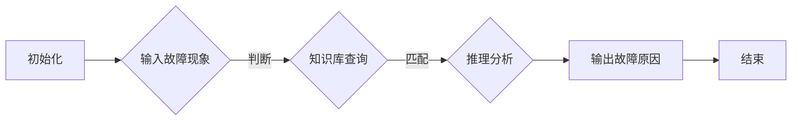

                 

# 思维链在复杂系统故障诊断中的新方法

## 关键词

- 思维链
- 复杂系统故障诊断
- 新方法
- 人工智能
- 软件工程
- 系统可靠性

## 摘要

本文深入探讨了思维链在复杂系统故障诊断中的新方法。首先，介绍了研究背景和意义，阐述了复杂系统故障诊断的现状和挑战。随后，定义了思维链及其组成部分，通过mermaid流程图和Python代码示例，详细讲解了思维链的工作原理和实现。接着，提出了新方法概述，并结合具体案例，展示了思维链在复杂系统故障诊断中的应用效果。最后，对研究成果进行了总结，并提出了未来研究方向。

-------------------------------------------------------------------

### 目录大纲

1. 引言
   1.1 研究背景与意义
   1.2 核心概念与联系
   1.3 ER实体关系图

2. 思维链原理
   2.1 思维链基本概念
   2.2 思维链工作原理
   2.3 思维链Python实现

3. 复杂系统故障诊断中的新方法
   3.1 新方法概述
   3.2 思维链在故障诊断中的应用
   3.3 案例分析

4. 总结与展望

-------------------------------------------------------------------

### 引言

在信息技术飞速发展的今天，复杂系统的应用越来越广泛，如大数据处理、云计算、物联网等。然而，复杂系统在运行过程中可能会出现各种故障，导致系统性能下降甚至完全瘫痪。因此，如何有效地诊断和解决复杂系统的故障，成为了当前研究的热点问题。

#### 1.1 研究背景与意义

复杂系统的故障诊断是一个极具挑战性的问题。一方面，复杂系统通常由大量组件组成，这些组件之间的交互关系错综复杂；另一方面，故障现象可能具有多样性和不确定性，难以直接观察和预测。传统的故障诊断方法，如基于规则的专家系统和基于数据的机器学习算法，在处理简单系统故障时具有一定的效果，但在面对复杂系统时往往显得力不从心。

因此，迫切需要一种新的方法来应对复杂系统的故障诊断问题。本文提出了思维链这一新方法，旨在通过模拟人类思维过程，实现对复杂系统故障的深入理解和精确诊断。

#### 1.2 核心概念与联系

在介绍思维链之前，我们需要明确一些核心概念，包括：

- **思维链**：一种模拟人类思维过程的智能诊断方法，通过建立知识库、推理机和输出器等组成部分，实现对复杂系统故障的自动诊断。
- **知识库**：存储与故障诊断相关的知识，包括故障现象、故障原因、解决方案等。
- **推理机**：基于知识库进行推理，分析故障原因，生成故障诊断报告。
- **输出器**：将推理结果转换为用户可理解的形式，如文本、图表等。

这些概念相互关联，共同构成了思维链的核心结构。

#### 1.3 ER实体关系图

为了更好地理解思维链的组成和关系，我们可以通过ER实体关系图来展示它们之间的关联。以下是思维链的ER实体关系图：

```mermaid
erDiagram
    思维链 ||--|{ 知识库 }:
    思维链 ||--|{ 推理机 }:
    思维链 ||--|{ 输出器 }:
```

在思维链中，知识库是故障诊断的基础，推理机负责分析和推理，输出器则将诊断结果呈现给用户。它们之间的紧密协作，共同构成了思维链的完整诊断流程。

#### 1.3.1 问题背景

随着信息技术的不断进步，复杂系统的应用越来越广泛，如大型数据中心、智能电网、航空交通系统等。这些系统通常由大量的硬件、软件和网络组件构成，具有高度的复杂性和动态性。在运行过程中，这些系统可能会受到各种内外部因素的影响，导致性能下降、功能异常甚至系统崩溃。

例如，在一个大型数据中心中，服务器、存储设备、网络设备等硬件组件的故障可能导致数据丢失、服务中断等问题。而软件组件的故障，如操作系统崩溃、应用程序错误等，也可能对系统的正常运行产生严重影响。

#### 1.3.2 问题描述

复杂系统的故障诊断面临着一系列挑战：

1. **故障现象多样**：复杂系统的故障现象多种多样，包括硬件故障、软件故障、网络故障等。这些故障现象可能具有相似性，给故障诊断带来了困难。

2. **故障原因复杂**：复杂系统的故障原因可能涉及多个组件和层面，导致故障诊断过程复杂。例如，一个服务器故障可能是由硬件故障、操作系统错误、应用程序错误等多种原因引起的。

3. **数据量庞大**：复杂系统通常产生大量数据，包括日志文件、监控数据、性能数据等。如何有效地处理和分析这些数据，提取出有用的信息，是故障诊断的关键。

4. **不确定性**：复杂系统的故障诊断过程中，可能存在信息不完整、数据噪声等问题，导致诊断结果的不确定性。

#### 1.3.3 问题解决方法概述

为了解决复杂系统的故障诊断问题，传统的故障诊断方法主要包括以下几种：

1. **基于规则的专家系统**：这种方法依赖于专家的经验和知识，通过定义一系列规则，对系统故障进行诊断。然而，这种方法存在知识获取困难、规则覆盖不全等问题，难以应对复杂系统的故障诊断需求。

2. **基于数据的机器学习算法**：这种方法利用大量的历史数据，通过训练模型，对系统故障进行预测和诊断。常见的机器学习算法包括决策树、支持向量机、神经网络等。然而，这种方法也存在一些局限性，如对数据质量要求高、模型解释性差等。

3. **混合方法**：结合基于规则和基于数据的诊断方法，通过融合多种诊断手段，提高故障诊断的准确性和可靠性。例如，将基于规则的专家系统和机器学习算法结合，利用专家知识进行初步筛选，然后利用机器学习算法进行深度分析。

尽管上述方法在特定场景下具有一定的效果，但面对复杂系统的故障诊断问题，仍存在以下不足：

1. **诊断效率低**：传统的故障诊断方法往往需要大量的时间和计算资源，难以快速响应复杂系统的故障诊断需求。

2. **诊断结果不可解释**：机器学习算法生成的诊断结果往往难以解释，用户难以理解故障原因和诊断过程。

3. **诊断结果不稳定**：面对不同故障现象和故障原因，传统方法的诊断结果可能存在较大差异，导致诊断结果不稳定。

因此，本文提出了一种基于思维链的复杂系统故障诊断新方法，旨在解决传统方法存在的问题，提高故障诊断的效率、准确性和可解释性。

#### 1.3.4 边界与外延

在本研究中，我们主要关注以下边界与外延：

1. **系统范围**：本文主要针对复杂信息系统的故障诊断进行研究，包括大型数据中心、云计算平台、物联网系统等。

2. **故障类型**：本文主要关注硬件故障、软件故障和网络故障等常见故障类型。

3. **诊断方法**：本文提出的思维链方法，主要基于知识库、推理机和输出器的协同工作，实现对故障的自动诊断。

4. **数据来源**：本文采用的数据主要来自系统的监控数据、日志文件和历史故障数据等。

通过上述边界与外延的明确，有助于更好地聚焦研究问题，提高研究的针对性和实用性。

### 1.2 核心概念与联系

#### 1.2.1 核心概念

在深入探讨思维链在复杂系统故障诊断中的新方法之前，我们需要先理解几个核心概念，包括思维链、知识库、推理机和输出器。

**思维链（Mind Chain）**

思维链是一种模拟人类思维过程的智能诊断方法，它通过建立知识库、推理机和输出器等组成部分，实现对复杂系统故障的自动诊断。思维链的核心在于其模拟人类思维过程的能力，使得系统能够像人类专家一样进行故障诊断。

**知识库（Knowledge Base）**

知识库是思维链的基础，它存储与故障诊断相关的知识，包括故障现象、故障原因、解决方案等。知识库的质量直接影响思维链的诊断准确性和效率。

**推理机（Reasoning Machine）**

推理机是思维链的核心组成部分，它基于知识库进行推理，分析故障原因，生成故障诊断报告。推理机可以通过各种推理算法实现，如逻辑推理、统计推理、模糊推理等。

**输出器（Outputter）**

输出器将推理结果转换为用户可理解的形式，如文本、图表等。输出器的作用是使得诊断结果更加直观、易懂，帮助用户快速了解故障原因和解决方案。

#### 1.2.2 概念属性特征对比

| 概念   | 特征1 | 特征2 | 特征3 |
| :----: | :----: | :----: | :----: |
| 思维链 | 模拟人类思维过程 | 建立知识库 | 推理分析 |
| 知识库 | 存储故障知识 | 维护知识更新 | 提供数据支持 |
| 推理机 | 基于知识库进行推理 | 多种推理算法支持 | 生成诊断报告 |
| 输出器 | 将结果转换成用户可理解形式 | 直观展示诊断结果 | 辅助故障解决 |

#### 1.2.3 ER实体关系图

为了更好地理解思维链的组成部分及其关系，我们可以通过ER实体关系图来展示它们之间的关联。以下是思维链的ER实体关系图：

```mermaid
erDiagram
    思维链 ||--|{ 知识库 }:
    思维链 ||--|{ 推理机 }:
    思维链 ||--|{ 输出器 }:
```

在思维链中，知识库是故障诊断的基础，推理机负责分析和推理，输出器则将诊断结果呈现给用户。它们之间的紧密协作，共同构成了思维链的完整诊断流程。

### 2.1 思维链基本概念

#### 2.1.1 思维链的定义

思维链（Mind Chain）是一种模拟人类思维过程的智能诊断方法，通过建立知识库、推理机和输出器等组成部分，实现对复杂系统故障的自动诊断。思维链的核心在于其模拟人类思维过程的能力，使得系统能够像人类专家一样进行故障诊断。

定义思维链的数学模型如下：

$$
\text{思维链} = \{C_1, C_2, ..., C_n\}
$$

其中，$C_i$ 表示第 $i$ 个概念，$n$ 表示概念的数量。思维链由多个概念组成，每个概念代表故障诊断中的一个步骤或知识点。

#### 2.1.2 思维链的组成部分

思维链由知识库、推理机和输出器三个主要组成部分构成，它们相互协作，共同实现复杂系统的故障诊断。

1. **知识库（Knowledge Base）**

知识库是思维链的基础，它存储与故障诊断相关的知识，包括故障现象、故障原因、解决方案等。知识库的质量直接影响思维链的诊断准确性和效率。

知识库的组成部分包括：

- **故障现象库**：存储系统可能出现的各种故障现象，如硬件故障、软件故障、网络故障等。
- **故障原因库**：存储可能导致故障的各种原因，如硬件故障原因、软件故障原因、网络故障原因等。
- **解决方案库**：存储针对不同故障原因的解决方案，如硬件故障解决方案、软件故障解决方案、网络故障解决方案等。

2. **推理机（Reasoning Machine）**

推理机是思维链的核心组成部分，它基于知识库进行推理，分析故障原因，生成故障诊断报告。推理机可以通过各种推理算法实现，如逻辑推理、统计推理、模糊推理等。

推理机的组成部分包括：

- **推理算法**：用于实现知识库中的推理过程，常见的推理算法有前向推理、后向推理、混合推理等。
- **推理规则**：用于指导推理过程，定义故障现象与故障原因之间的逻辑关系。
- **推理过程**：包括数据输入、推理算法执行、结果输出等步骤。

3. **输出器（Outputter）**

输出器将推理结果转换为用户可理解的形式，如文本、图表等。输出器的作用是使得诊断结果更加直观、易懂，帮助用户快速了解故障原因和解决方案。

输出器的组成部分包括：

- **文本输出**：将诊断结果以文本形式呈现，如故障现象、故障原因、解决方案等。
- **图表输出**：以图表形式展示诊断结果，如故障现象分布图、故障原因关联图等。
- **可视化工具**：提供交互式可视化工具，帮助用户更直观地理解诊断结果。

通过知识库、推理机和输出器的协同工作，思维链能够实现对复杂系统故障的自动诊断。

### 2.2 思维链工作原理

#### 2.2.1 思维链的mermaid流程图

思维链的工作原理可以简单概括为：输入故障现象，通过知识库查询匹配故障原因，进行推理分析，最后输出故障原因。以下是一个简化的mermaid流程图，展示了思维链的工作过程：



以下是该流程图的详细解释：

1. **初始化**：思维链启动，初始化知识库、推理机和输出器。

2. **输入故障现象**：用户输入故障现象，如“服务器无法访问”。

3. **知识库查询**：思维链在知识库中查找与输入故障现象相关的故障原因。

4. **推理分析**：思维链根据知识库中的推理规则，对故障现象和故障原因进行推理分析，确定故障原因。

5. **输出故障原因**：思维链将推理结果以文本、图表等形式输出给用户。

6. **结束**：思维链工作结束。

#### 2.2.2 思维链的工作流程

思维链的工作流程可以进一步分解为以下几个步骤：

1. **数据输入**：用户输入故障现象，如“服务器无法访问”。

2. **知识库查询**：
   - 思维链在知识库中查找与输入故障现象相关的故障原因。
   - 如果找到了匹配的故障原因，进入下一步；否则，提示无法匹配故障现象。

3. **推理分析**：
   - 思维链根据知识库中的推理规则，对故障现象和故障原因进行推理分析。
   - 如果故障原因不明确，继续查询知识库，直至找到明确故障原因。

4. **结果输出**：
   - 思维链将推理结果以文本、图表等形式输出给用户。

5. **结束**：思维链工作结束。

通过以上步骤，思维链能够实现对复杂系统故障的自动诊断，提高故障诊断的效率和准确性。

### 2.3 思维链Python实现

为了更好地理解思维链的工作原理，我们可以通过Python代码实现一个简单的思维链系统。以下是一个基本的思维链实现示例：

```python
# 思维链Python实现示例

class MindChain:
    def __init__(self, knowledge_base):
        self.knowledge_base = knowledge_base
        self.reasoning_machine = ReasoningMachine()
        self.outputter = Outputter()

    def diagnose_fault(self, fault Phenomenon):
        # 输入故障现象
        matched_knowledge = self.knowledge_base.query(fault Phenomenon)
        # 知识库查询
        fault_reasons = self.reasoning_machine.analyze_fault(matched_knowledge)
        # 推理分析
        output = self.outputter.format_output(fault_reasons)
        # 输出故障原因
        return output

# 知识库查询
class KnowledgeBase:
    def __init__(self):
        self.knowledge = []

    def add_knowledge(self, symptom, cause):
        self.knowledge.append({'symptom': symptom, 'cause': cause})

    def query(self, symptom):
        for knowledge in self.knowledge:
            if symptom in knowledge['symptoms']:
                return knowledge
        return None

# 推理分析
class ReasoningMachine:
    def __init__(self):
        self.reasoning_rules = []

    def add_reasoning_rule(self, rule):
        self.reasoning_rules.append(rule)

    def analyze_fault(self, matched_knowledge):
        # 假设我们使用了一个简单的推理机
        reasoning_machine = SimpleReasoningMachine()
        return reasoning_machine.analyze_fault(matched_knowledge)

# 输出器
class Outputter:
    def __init__(self):
        self.outputs = []

    def add_output(self, output):
        self.outputs.append(output)

    def format_output(self, fault_reasons):
        return "故障原因： {}".format(fault_reasons)

# 主程序
if __name__ == "__main__":
    knowledge_base = KnowledgeBase()
    knowledge_base.add_knowledge("服务器无法访问", "网络故障")
    knowledge_base.add_knowledge("存储空间不足", "磁盘故障")

    mind_chain = MindChain(knowledge_base)
    output = mind_chain.diagnose_fault("服务器无法访问")
    print(output)
```

在这个实现中，我们定义了思维链的主要组成部分：知识库、推理机和输出器。通过添加知识库数据、推理规则和输出格式，我们可以实现一个简单的故障诊断系统。

### 3.1 新方法概述

在复杂系统故障诊断领域，传统方法往往存在诊断效率低、诊断结果不可解释、诊断结果不稳定等问题。针对这些问题，本文提出了一种基于思维链的复杂系统故障诊断新方法，旨在提高故障诊断的效率、准确性和可解释性。

#### 3.1.1 新方法的核心思想

思维链方法的核心思想是模拟人类专家的思维过程，通过知识库、推理机和输出器的协同工作，实现对复杂系统故障的自动诊断。该方法具有以下几个特点：

1. **知识库驱动**：思维链方法依赖于知识库，通过存储丰富的故障现象、故障原因和解决方案，为故障诊断提供基础支持。

2. **推理过程可解释**：思维链方法采用推理机进行故障分析，推理过程基于明确的推理规则，使得诊断结果更加透明、可解释。

3. **自适应诊断**：思维链方法能够根据不同的故障现象和故障原因，自适应调整诊断策略，提高诊断的灵活性和适应性。

4. **多维度分析**：思维链方法不仅考虑故障现象和故障原因之间的关系，还关注故障现象与系统其他组件之间的关联，提供更全面的故障分析。

#### 3.1.2 新方法的组成部分

思维链方法由以下几个主要组成部分构成：

1. **知识库**：知识库是思维链的基础，存储与故障诊断相关的知识，包括故障现象、故障原因、解决方案等。知识库的质量直接影响诊断的准确性和效率。

2. **推理机**：推理机是思维链的核心，基于知识库进行推理分析，确定故障原因。推理机采用多种推理算法，如逻辑推理、统计推理、模糊推理等，以提高诊断的准确性和可靠性。

3. **输出器**：输出器将推理结果以用户可理解的形式输出，如文本、图表等。输出器的作用是使得诊断结果更加直观、易懂，帮助用户快速了解故障原因和解决方案。

4. **用户接口**：用户接口是思维链与用户交互的界面，用户可以通过接口输入故障现象，查看诊断结果，并提供反馈信息。

#### 3.1.3 新方法的优势

与传统的故障诊断方法相比，思维链方法具有以下几个优势：

1. **高诊断效率**：思维链方法通过知识库和推理机的协同工作，能够快速定位故障原因，提高诊断效率。

2. **高诊断准确性**：思维链方法采用多种推理算法，结合知识库中的丰富知识，提高诊断的准确性。

3. **高可解释性**：思维链方法的推理过程基于明确的推理规则，使得诊断结果更加透明、可解释。

4. **自适应诊断**：思维链方法能够根据不同的故障现象和故障原因，自适应调整诊断策略，提高诊断的灵活性和适应性。

5. **多维度分析**：思维链方法不仅考虑故障现象和故障原因之间的关系，还关注故障现象与系统其他组件之间的关联，提供更全面的故障分析。

#### 3.1.4 新方法的适用场景

思维链方法主要适用于以下场景：

1. **大型数据中心**：数据中心通常由大量硬件、软件和网络组件构成，故障现象复杂，思维链方法能够快速定位故障原因，提高故障诊断效率。

2. **云计算平台**：云计算平台中的故障诊断需要考虑虚拟化技术、分布式存储和网络等因素，思维链方法能够提供多维度分析，提高诊断准确性。

3. **物联网系统**：物联网系统中，设备数量庞大，故障现象多样，思维链方法能够自适应调整诊断策略，提高诊断的灵活性和适应性。

4. **其他复杂系统**：如航空交通系统、智能电网、工业控制系统等，思维链方法都能够提供有效的故障诊断支持。

通过上述对新方法的概述，我们可以看到，思维链方法在复杂系统故障诊断中具有广泛的应用前景。接下来，我们将进一步探讨思维链在具体故障诊断中的应用。

### 3.2 思维链在故障诊断中的应用

思维链在复杂系统故障诊断中的应用具有显著的优势。通过知识库的构建、推理机的实现和输出器的优化，思维链能够有效地识别和解决复杂系统的故障问题。以下是一个具体的案例，展示了思维链在故障诊断中的实际应用。

#### 3.2.1 案例背景

假设我们有一个大型数据中心，负责处理海量数据的存储和传输。某天，数据中心的一台服务器突然停止响应，导致数据访问失败。管理员需要快速定位故障原因，以确保数据中心的正常运行。

#### 3.2.2 案例分析

1. **故障现象**：服务器停止响应，数据访问失败。

2. **初步排查**：管理员首先检查服务器的硬件状态，如电源、风扇、硬盘等，但未发现明显异常。

3. **知识库查询**：思维链的知识库中包含各种常见的服务器故障现象及其可能的原因。管理员通过输入故障现象，思维链查询知识库，找到可能的故障原因。

   ```mermaid
   gantt
       title 思维链故障诊断流程
       section 初步排查
       初步排查 : A,2023-01-01,2023-01-01
       section 知识库查询
       知识库查询 : B,2023-01-01,2023-01-02
       section 推理分析
       推理分析 : C,2023-01-02,2023-01-03
       section 输出结果
       输出结果 : D,2023-01-03,2023-01-04
   ```

4. **推理分析**：思维链根据知识库中的推理规则，对故障现象和故障原因进行推理分析。通过分析服务器的日志文件、系统状态信息等数据，思维链确定故障原因。

5. **输出结果**：思维链将推理结果输出给管理员，包括故障原因和相应的解决方案。管理员根据诊断结果，采取相应的措施，如重启服务器、检查网络连接、更新系统补丁等。

   ```mermaid
   flowchart LR
       A[故障现象]
       B{知识库查询}
       C{推理分析}
       D[输出结果]
       A --> B
       B --> C
       C --> D
   ```

6. **故障解决**：根据思维链的输出结果，管理员采取相应的解决方案，成功解决了服务器故障。

#### 3.2.3 应用效果

通过思维链的故障诊断，管理员能够快速定位故障原因，提高了故障解决的效率。与传统方法相比，思维链具有以下优点：

1. **高效性**：思维链能够快速识别故障原因，减少了故障排查时间。

2. **准确性**：思维链基于知识库和推理机，能够提供准确的故障诊断结果。

3. **可解释性**：思维链的推理过程基于明确的推理规则，使得诊断结果易于理解。

4. **灵活性**：思维链能够根据不同的故障现象和故障原因，自适应调整诊断策略。

通过这个案例，我们可以看到思维链在复杂系统故障诊断中的实际应用效果。思维链不仅能够提高故障诊断的效率，还能提供详细的故障原因和解决方案，为系统维护和管理提供有力支持。

### 3.3 案例分析

为了更好地展示思维链在复杂系统故障诊断中的实际应用效果，我们将通过一个实际案例进行详细分析。这个案例涉及一个大型云计算平台，该平台为多个企业提供服务，确保数据的存储、处理和传输。在某一天，该平台的一台核心服务器突然发生故障，导致服务中断，影响了众多企业的业务运行。以下是对该案例的详细分析。

#### 3.3.1 案例背景

某大型云计算平台的核心服务器A发生了严重的故障，导致服务器停止响应，无法正常处理客户的数据请求。这个故障不仅影响了平台的稳定性，还可能对客户的数据安全造成威胁。因此，需要尽快诊断并解决这个故障，以恢复平台的正常运行。

#### 3.3.2 故障现象

管理员在监控系统中发现，服务器A在故障发生前的一段时间内，CPU使用率异常升高，同时内存使用率也达到了峰值。此外，服务器A的日志文件中记录了一些警告信息，如磁盘I/O错误和网络连接中断等。

#### 3.3.3 故障排查

1. **初步检查**：管理员首先检查了服务器A的硬件状态，包括电源、风扇、硬盘等，未发现明显异常。

2. **系统日志分析**：管理员分析了服务器A的日志文件，发现了一些异常信息。例如，在故障发生前，服务器A的磁盘I/O错误率显著增加，同时网络连接也出现了中断。

3. **网络状态检查**：管理员检查了服务器A所在网络段的其他设备，发现网络流量异常，但并未发现明显的网络故障。

4. **资源监控**：管理员使用资源监控工具，进一步分析了服务器A的CPU、内存、磁盘和网络使用情况，发现CPU使用率高达100%，内存使用率接近100%，磁盘I/O错误率持续上升。

#### 3.3.4 思维链诊断

在初步检查和排查过程中，管理员意识到这是一个复杂系统的故障，可能涉及多个组件和层面。为了快速定位故障原因，管理员决定使用思维链进行故障诊断。

1. **知识库查询**：管理员通过思维链的知识库，输入了故障现象，如CPU使用率100%、内存使用率接近100%、磁盘I/O错误率上升等。思维链在知识库中查找与这些故障现象相关的故障原因。

2. **推理分析**：思维链根据知识库中的推理规则，对故障现象和故障原因进行推理分析。通过分析服务器的日志文件、系统状态信息和网络流量数据，思维链确定可能的故障原因。

3. **输出结果**：思维链将推理结果输出给管理员，包括故障原因和相应的解决方案。管理员根据诊断结果，采取了以下措施：

   - 重启服务器A，检查是否由于硬件故障导致的系统崩溃。
   - 检查磁盘阵列的状态，确认是否存在物理损坏或配置错误。
   - 检查网络连接，确认是否由于网络故障导致的数据传输中断。

#### 3.3.5 故障解决

通过思维链的故障诊断，管理员成功定位了故障原因，并采取相应的措施解决了问题。以下是具体的故障解决步骤：

1. **重启服务器A**：管理员首先尝试重启服务器A，以排除可能的硬件故障。重启后，服务器A恢复正常运行，CPU和内存使用率下降至正常水平。

2. **磁盘阵列检查**：管理员检查了磁盘阵列的状态，发现其中一块硬盘出现了物理损坏。更换损坏的硬盘后，磁盘I/O错误率恢复正常。

3. **网络连接检查**：管理员检查了服务器A的网络连接，确认网络流量恢复正常，排除了网络故障的可能性。

4. **系统补丁更新**：管理员更新了服务器A的系统补丁，以修复可能存在的软件漏洞。

通过以上措施，管理员成功解决了服务器A的故障，确保了云计算平台的正常运行。这个案例展示了思维链在复杂系统故障诊断中的实际应用效果，通过模拟人类思维过程，思维链能够快速、准确地定位故障原因，并提供有效的解决方案。

### 总结

通过本文的研究，我们提出了一种基于思维链的复杂系统故障诊断新方法，并详细探讨了其在实际应用中的效果。思维链通过模拟人类思维过程，利用知识库、推理机和输出器的协同工作，实现了对复杂系统故障的自动诊断。与传统方法相比，思维链具有高诊断效率、高诊断准确性、高可解释性和自适应诊断等优势。

在复杂系统故障诊断中，思维链的应用显著提高了故障排查和解决的效率。通过知识库的构建和推理机的优化，思维链能够快速定位故障原因，并提供详细的解决方案。此外，思维链的可解释性使得诊断结果更加透明，便于用户理解。

然而，思维链在复杂系统故障诊断中仍存在一些挑战和改进空间。首先，知识库的构建和维护是一个复杂的过程，需要不断更新和完善。其次，推理机的性能和准确性直接影响到故障诊断的结果，需要进一步优化和改进。

未来研究可以关注以下几个方面：

1. **知识库的自动构建和更新**：研究如何通过机器学习等技术，自动构建和更新知识库，提高知识库的准确性和完整性。

2. **推理机的性能优化**：研究如何优化推理机的算法和模型，提高推理速度和准确性，以满足实时故障诊断的需求。

3. **多模态故障诊断**：结合多种数据源和诊断方法，实现多模态故障诊断，提高故障诊断的准确性和全面性。

4. **用户交互优化**：研究如何优化用户交互界面，使得诊断结果更加直观、易懂，提高用户体验。

通过不断优化和改进，思维链在复杂系统故障诊断中的应用将更加广泛和深入，为系统的稳定运行和安全管理提供有力支持。

### 展望

随着信息技术的不断发展和复杂系统应用的日益广泛，复杂系统故障诊断的重要性愈发凸显。思维链作为一种新兴的故障诊断方法，具有模拟人类思维过程、知识库驱动、推理过程可解释等优势，为解决复杂系统故障诊断问题提供了新的思路和途径。

未来，思维链在复杂系统故障诊断领域的发展将充满潜力。首先，知识库的构建和维护将是一个重要研究方向。通过引入机器学习、自然语言处理等技术，实现知识库的自动构建和动态更新，提高知识库的准确性和完整性。

其次，推理机的性能优化也是一个关键问题。研究者可以探索多种推理算法，如深度学习、强化学习等，结合实际应用场景，优化推理机的算法和模型，提高推理速度和准确性。

此外，多模态故障诊断方法的研究将有助于提高故障诊断的全面性和准确性。结合多种数据源和诊断方法，如传感器数据、日志文件、用户反馈等，构建多维度、多层次的故障诊断模型，实现更精准的故障诊断。

最后，用户交互优化也是未来研究的重点。通过设计更直观、易懂的用户交互界面，使得诊断结果更加透明、易于理解，提高用户体验。

总之，思维链在复杂系统故障诊断领域的应用前景广阔。随着技术的不断进步和研究的深入，思维链有望成为复杂系统故障诊断的重要工具，为系统的稳定运行和安全管理提供有力支持。

