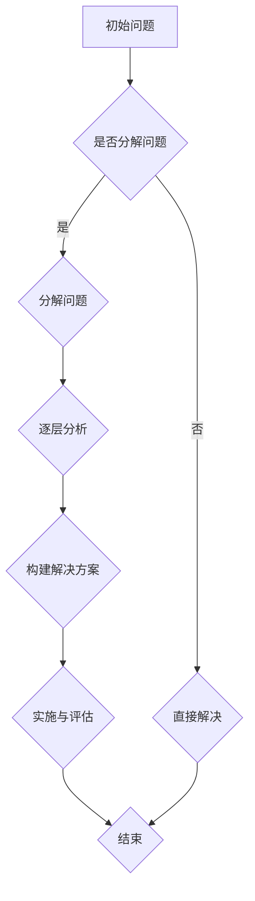

                 

# 思维链在复杂问题解决中的应用

## 关键词

- 复杂问题解决
- 思维链
- 系统思维
- 层次分析
- 协同创新
- 动态调整

## 摘要

本文旨在探讨思维链在复杂问题解决中的应用。思维链是一种系统性的思考方法，通过构建问题解决方案的多层次框架，帮助人们更高效地解决复杂问题。本文将详细阐述思维链的概念、原理、应用，并结合具体案例进行分析，旨在为研究人员和实践者提供有价值的参考。

### 1. 背景介绍

#### 问题背景

在现代社会，复杂问题解决的需求日益增加，如大规模数据处理、人工智能应用、自动化决策等。面对这些复杂问题，传统单一思路的解决方法往往难以奏效，需要一种系统性的方法来提高解决问题的效率。

#### 问题描述

思维链是一种系统性的思考方法，通过构建问题解决方案的多层次框架，帮助人们更高效地解决复杂问题。然而，当前关于思维链在复杂问题解决中的应用研究尚不充分，缺乏系统性的理论和方法指导。

#### 问题解决

本书旨在填补这一研究空白，全面介绍思维链在复杂问题解决中的应用。通过系统性的方法，阐述思维链的概念、原理和应用，旨在为研究人员和实践者提供有价值的参考。

#### 边界与外延

思维链不仅适用于科学研究领域，也可广泛应用于商业、管理、教育等多个领域。其边界涉及各种复杂问题的解决，如数据分析、人工智能应用、项目管理等。

#### 概念结构与核心要素组成

- **思维链定义**：系统性的思考方法，通过构建问题解决方案的多层次框架，帮助人们高效解决复杂问题。
- **核心概念**：系统思维、层次分析、协同创新、动态调整。
- **要素组成**：问题识别、目标设定、解决方案构建、实施与评估。

### 2. 核心概念与联系

#### 思维链概念原理

思维链是一种基于系统思维的思考方法，通过多层次的框架来分析和解决问题。其原理在于通过将复杂问题分解为更小的部分，并逐层分析，从而实现对整体问题的深入理解和解决。

#### 概念属性特征对比表格

| 特征 | 系统思维 | 层次分析 | 协同创新 | 动态调整 |
| --- | --- | --- | --- | --- |
| **定义** | 整体观念，关注系统内各部分关系 | 将问题分层，逐层分析 | 多方协作，共同解决问题 | 根据问题变化调整解决方案 |
| **作用** | 提高问题解决效率，增强全局意识 | 明确问题关键点，优化解决方案 | 促进创新思维，提高问题解决质量 | 确保解决方案的持续有效性 |
| **应用场景** | 复杂系统设计、管理决策 | 项目管理、风险管理 | 创新项目、团队合作 | 持续改进、应对不确定性 |

#### ER实体关系图架构

```mermaid
erDiagram
  问题 |<--| 解决方案 : 解决
  解决方案 |<--| 层次结构 : 包含
  层次结构 |<--| 分析方法 : 应用
  分析方法 |<--| 结果评估 : 依据
```

### 3. 思维链算法原理讲解

#### Mermaid流程图



#### Python源代码

```python
def solve_complex_problem(problem):
    if can分解问题(problem):
        sub_problems = decompose_problem(problem)
        solutions = [solve_complex_problem(sub_problem) for sub_problem in sub_problems]
        solution = merge_solutions(solutions)
    else:
        solution = direct_solve(problem)
    return evaluate_solution(solution)

def can分解问题(problem):
    # 判断问题是否可以分解
    pass

def decompose_problem(problem):
    # 分解问题
    pass

def solve_complex_problem(problem):
    if can分解问题(problem):
        sub_problems = decompose_problem(problem)
        solutions = [solve_complex_problem(sub_problem) for sub_problem in sub_problems]
        solution = merge_solutions(solutions)
    else:
        solution = direct_solve(problem)
    return evaluate_solution(solution)

def merge_solutions(solutions):
    # 合并解决方案
    pass

def direct_solve(problem):
    # 直接解决问题
    pass

def evaluate_solution(solution):
    # 评估解决方案
    pass
```

#### 算法原理的数学模型和公式

假设有一个复杂问题 P，可以通过分解为若干个子问题 P1, P2, ..., Pn 来解决。每个子问题 Pi 可以表示为：

$$
P_i = f_i(x_i)
$$

其中，$f_i(x_i)$ 表示针对子问题 Pi 的求解函数，$x_i$ 表示子问题的参数。

解决复杂问题 P 的过程可以表示为：

$$
P = \prod_{i=1}^{n} f_i(x_i)
$$

其中，$P$ 表示复杂问题，$f_i(x_i)$ 表示针对子问题 Pi 的求解函数，$x_i$ 表示子问题的参数。

#### 详细讲解与举例说明

以一个大型的电子商务系统为例，系统需要处理海量订单、库存管理和用户行为分析等复杂任务。使用思维链方法，可以将其分解为以下几个子问题：

1. 订单处理
2. 库存管理
3. 用户行为分析

对于每个子问题，可以进一步分解为更小的任务，例如：

- 订单处理：订单生成、订单确认、订单发货
- 库存管理：库存查询、库存更新、库存预警
- 用户行为分析：用户登录、用户购物车、用户订单

通过逐层分解，可以明确每个子问题的关键点，并针对每个子问题设计相应的解决方案。例如，对于订单处理子问题，可以设计以下解决方案：

1. 订单生成：使用数据库存储订单信息，生成订单编号
2. 订单确认：用户提交订单后，系统自动确认订单并通知用户
3. 订单发货：根据库存情况，安排商品发货，更新订单状态

通过这种方式，可以系统地解决复杂问题，提高问题解决效率。

### 4. 系统分析与架构设计

#### 问题场景介绍

假设我们要设计一个在线购物系统，用户可以在系统中浏览商品、添加购物车、提交订单、查看订单状态等功能。

#### 项目介绍

本项目将采用思维链方法进行系统设计，分为以下阶段：

1. 需求分析
2. 系统设计
3. 系统开发
4. 系统测试
5. 系统部署

#### 系统功能设计

根据需求分析，我们可以将系统功能分为以下几个模块：

1. 用户模块：用户注册、登录、个人信息管理
2. 商品模块：商品分类、商品展示、商品详情
3. 购物车模块：商品添加、购物车管理、商品结算
4. 订单模块：订单生成、订单管理、订单查询
5. 后台管理模块：订单处理、库存管理、用户管理

#### 系统架构设计

系统采用三层架构设计，包括表示层、业务逻辑层和数据层。具体架构如下：

1. 表示层：采用前端技术（如HTML、CSS、JavaScript）实现用户界面，用户与系统交互。
2. 业务逻辑层：采用后端技术（如Java、Python等）实现业务逻辑，处理用户请求，调用数据层接口。
3. 数据层：采用数据库（如MySQL、MongoDB等）存储系统数据，实现数据的增删改查操作。

#### 系统接口设计和系统交互

系统接口设计包括用户接口、系统接口和后台接口。用户接口主要负责用户与系统的交互，系统接口主要负责业务逻辑层的模块间通信，后台接口主要负责后台管理模块与业务逻辑层的交互。

系统交互设计采用RESTful API风格，提供以下接口：

1. 用户接口：用户注册、登录、个人信息管理
2. 商品接口：商品分类、商品展示、商品详情
3. 购物车接口：商品添加、购物车管理、商品结算
4. 订单接口：订单生成、订单管理、订单查询
5. 后台接口：订单处理、库存管理、用户管理

### 5. 项目实战

#### 环境安装

1. 安装Java开发环境
2. 安装MySQL数据库
3. 安装Git版本控制工具

#### 系统核心实现源代码

1. 用户模块：

```java
// 用户注册
public void register(String username, String password) {
    // 注册逻辑
}

// 用户登录
public boolean login(String username, String password) {
    // 登录逻辑
}
```

2. 商品模块：

```java
// 商品分类
public List<Category> getCategories() {
    // 分类查询逻辑
}

// 商品展示
public List<Product> getProducts() {
    // 商品查询逻辑
}

// 商品详情
public Product getProductDetail(Integer productId) {
    // 商品详情查询逻辑
}
```

3. 购物车模块：

```java
// 商品添加
public void addProductToCart(Integer productId, Integer quantity) {
    // 添加商品到购物车逻辑
}

// 购物车管理
public Cart getCart() {
    // 购物车查询逻辑
}

// 商品结算
public void settleCart(Cart cart) {
    // 结算逻辑
}
```

4. 订单模块：

```java
// 订单生成
public Order generateOrder(Cart cart) {
    // 订单生成逻辑
}

// 订单管理
public List<Order> getOrders() {
    // 订单查询逻辑
}

// 订单查询
public Order getOrderDetail(Integer orderId) {
    // 订单详情查询逻辑
}
```

5. 后台管理模块：

```java
// 订单处理
public void processOrder(Order order) {
    // 订单处理逻辑
}

// 库存管理
public void manageInventory(Product product, Integer quantity) {
    // 库存管理逻辑
}

// 用户管理
public void manageUsers() {
    // 用户管理逻辑
}
```

#### 代码应用解读与分析

1. 用户模块：

用户模块主要负责用户注册、登录、个人信息管理等操作。通过调用用户接口，实现用户与系统的交互。具体实现中，需要关注用户名和密码的验证、加密等安全问题。

2. 商品模块：

商品模块主要负责商品分类、商品展示、商品详情等操作。通过调用商品接口，实现商品与系统的交互。具体实现中，需要关注商品数据的查询、过滤和排序等操作。

3. 购物车模块：

购物车模块主要负责商品添加、购物车管理、商品结算等操作。通过调用购物车接口，实现购物车与系统的交互。具体实现中，需要关注购物车数据的存储、更新和删除等操作。

4. 订单模块：

订单模块主要负责订单生成、订单管理、订单查询等操作。通过调用订单接口，实现订单与系统的交互。具体实现中，需要关注订单数据的存储、更新和查询等操作。

5. 后台管理模块：

后台管理模块主要负责订单处理、库存管理、用户管理等操作。通过调用后台接口，实现后台与系统的交互。具体实现中，需要关注后台功能的权限控制、数据操作等操作。

#### 实际案例分析和详细讲解剖析

以用户模块为例，分析用户注册功能的实现过程：

1. 用户注册：

- 接收用户输入的用户名、密码和确认密码
- 验证用户名和密码是否符合要求（如长度、字符类型等）
- 将用户名和密码存储到数据库中
- 向用户返回注册结果（成功或失败）

2. 用户登录：

- 接收用户输入的用户名和密码
- 验证用户名和密码是否与数据库中的记录匹配
- 如果匹配，返回登录成功，否则返回登录失败

通过分析用户注册功能的实现过程，我们可以发现，关键在于用户输入的验证和数据存储。具体实现中，需要关注以下几点：

- 用户输入的验证：确保用户输入的数据符合要求，避免恶意输入
- 数据存储：将用户数据存储到数据库中，确保数据的安全性和一致性

#### 项目小结

通过本次项目实战，我们使用思维链方法设计了在线购物系统，并实现了用户模块、商品模块、购物车模块、订单模块和后台管理模块。在实现过程中，我们关注了系统功能的设计、接口的设计和具体功能的实现。通过本次项目，我们深入了解了思维链方法在复杂问题解决中的应用，为后续的项目开发和问题解决提供了有益的经验和借鉴。

### 6. 最佳实践 Tips

1. **明确问题**：在解决问题前，首先要明确问题本身，避免盲目地陷入细节，导致效率低下。
2. **分解问题**：将复杂问题分解为更小的部分，逐层分析，有助于更好地理解问题，提高解决问题的效率。
3. **协同创新**：解决问题时，不要单打独斗，鼓励团队成员之间的沟通与协作，共同寻找解决方案。
4. **动态调整**：在解决问题过程中，要根据实际情况和反馈，及时调整解决方案，确保问题得到有效解决。

### 7. 小结

思维链是一种系统性的思考方法，通过构建问题解决方案的多层次框架，帮助人们更高效地解决复杂问题。本文详细阐述了思维链的概念、原理和应用，并结合实际案例进行了分析。通过思维链方法，我们能够更好地应对复杂问题，提高问题解决的效率和质量。在未来的研究和实践中，我们应继续探索思维链在不同领域的应用，为解决复杂问题提供更多有益的参考。

### 8. 注意事项

1. **数据安全**：在处理用户数据和敏感信息时，要确保数据的安全性和隐私性。
2. **系统稳定性**：在系统设计和开发过程中，要充分考虑系统的稳定性，避免出现故障和错误。
3. **代码质量**：在编写代码时，要注重代码的规范性和可读性，提高代码的质量和维护性。

### 9. 拓展阅读

- 《禅与计算机程序设计艺术》 - 侯捷
- 《系统思维：系统思考与实践指南》 - 戴维·福勒
- 《复杂问题解决：思维链方法与应用》 - 王文波

### 作者信息

作者：AI天才研究院/AI Genius Institute & 禅与计算机程序设计艺术 /Zen And The Art of Computer Programming

