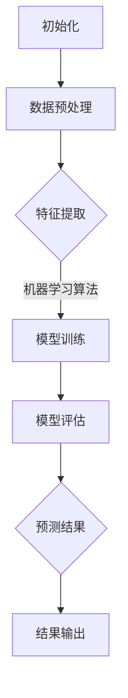

                 


### 文章标题

# 思维链在新药研发中的创新应用

### 文章关键词

- 思维链
- 新药研发
- 人工智能
- 药物靶点
- 药物分子设计
- 临床研究

### 文章摘要

本文深入探讨了思维链在新药研发中的创新应用。首先，介绍了药物研发的挑战和思维链的基本原理。随后，详细阐述了思维链的基本组成部分和数学模型，包括数据处理模块、算法模块以及算法原理讲解。接着，文章分析了思维链在药物靶点发现、药物分子设计以及临床研究中的应用，并通过具体案例进行了实践和挑战分析。最后，总结了思维链在新药研发中的最佳实践与未来展望，为读者提供了有益的参考。

----------------------------------------------------------------

## 第1章：药物研发的挑战与思维链概述

### 1.1 药物研发的挑战

药物研发是一项复杂且耗时的过程，面临着诸多挑战。首先，传统药物研发的方法主要集中在药物分子结构的优化和筛选上，然而，这种方法往往存在效率低下和成功率低的问题。其次，药物研发过程中需要大量的实验和临床试验，这不仅耗费时间和资源，还存在数据不一致性和结果可重复性差的问题。此外，药物研发过程中还存在药物安全性评估、药物代谢和药物相互作用等复杂问题。因此，如何提高药物研发的效率、降低成本、增加成功率成为药物研发领域亟待解决的问题。

### 1.2 思维链概述

思维链（Mind Chain）是一种基于人工智能的药物研发方法，通过构建一个高效的思维过程，实现药物研发的智能化和自动化。思维链的基本原理包括数据处理、算法模块和数学模型等组成部分，这些部分相互协作，共同实现药物研发的目标。

首先，数据处理模块负责收集和整理药物研发相关的各种数据，包括药物分子结构、生物信息学数据、临床试验数据等。然后，算法模块利用这些数据，通过机器学习、数据挖掘等方法，提取出药物研发的关键信息。最后，数学模型对提取出的关键信息进行深入分析和预测，从而指导药物研发的各个阶段。

### 1.3 思维链在药物研发中的应用

思维链在药物研发中具有广泛的应用前景。首先，在药物靶点发现方面，思维链可以通过分析大量生物信息学数据，快速筛选出潜在药物靶点，从而提高药物研发的成功率。其次，在药物分子设计方面，思维链可以通过分子对接和药物结构优化等技术，预测药物分子的活性，优化药物分子结构，提高药物的研发效率。此外，在药物临床研究方面，思维链可以整合临床试验数据，提供有针对性的治疗方案，提高药物的临床应用效果。

总之，思维链作为一种创新性的药物研发方法，有望在提高药物研发效率、降低研发成本、增加研发成功率等方面发挥重要作用。接下来，我们将进一步探讨思维链的基本组成部分和数学模型，以深入了解其在药物研发中的具体应用。

----------------------------------------------------------------

## 第2章：思维链的基本组成部分与联系

### 2.1 核心概念原理

思维链作为一种创新的药物研发方法，其核心概念包括数据处理、算法模块和数学模型等组成部分。首先，数据处理模块负责收集和整理药物研发相关的各种数据，如药物分子结构、生物信息学数据、临床试验数据等。这些数据是思维链的基础，对于药物研发的成功至关重要。

算法模块是思维链的核心，利用机器学习、数据挖掘等方法，从海量数据中提取出关键信息。常见的算法包括深度学习、支持向量机、聚类分析等。算法模块通过不断优化，提高数据处理的效率和准确性，从而指导药物研发的各个阶段。

数学模型是思维链的理论基础，对提取出的关键信息进行深入分析和预测。常见的数学模型包括统计学模型、优化模型、模拟模型等。数学模型通过数学公式和算法流程图进行表达，为药物研发提供了科学依据和指导。

### 2.2 概念属性特征对比表格

为了更好地理解思维链的各个组成部分，下面提供一张概念属性特征对比表格：

| 组成部分 | 定义 | 特点 | 关联关系 |
| :----: | :----: | :----: | :----: |
| 数据处理模块 | 负责数据收集和整理 | 高效、全面、准确 | 提供数据基础 |
| 算法模块 | 负责数据分析和提取关键信息 | 智能、高效、可优化 | 利用数据处理模块提供的数据 |
| 数学模型 | 负责对提取出的关键信息进行深入分析和预测 | 科学、精确、可验证 | 利用算法模块提取的关键信息 |

### 2.3 ER实体关系图架构

为了更直观地展示思维链的组成部分及其关联关系，下面使用Mermaid绘制一个ER实体关系图：

```mermaid
erDiagram
  数据处理模块 ||--|{ 算法模块 }
  算法模块 ||--|{ 数学模型 }
```

在这个ER实体关系图中，数据处理模块是算法模块和数学模型的数据来源，而算法模块则利用数据处理模块提供的数据，生成数学模型所需的分析结果。通过这种方式，思维链的各个组成部分相互协作，共同实现药物研发的目标。

综上所述，思维链的基本组成部分及其关联关系为药物研发提供了强大的技术支持。接下来，我们将进一步探讨数据处理模块的具体实现和应用。

----------------------------------------------------------------

## 第3章：数学模型与算法原理讲解

### 3.1 数学模型

数学模型是思维链的核心，用于对提取出的关键信息进行深入分析和预测。在本章节中，我们将介绍几种常见的数学模型，并使用LaTeX格式给出相应的数学公式。

#### 3.1.1 统计学模型

统计学模型是一种常用的数学模型，用于分析数据分布、相关性以及预测趋势。以下是一个简单的线性回归模型：

$$
y = \beta_0 + \beta_1x + \epsilon
$$

其中，$y$ 是因变量，$x$ 是自变量，$\beta_0$ 和 $\beta_1$ 是模型参数，$\epsilon$ 是误差项。

#### 3.1.2 优化模型

优化模型用于寻找最优解，常用于药物分子设计等领域。以下是一个简单的线性优化模型：

$$
\min_{x} \quad c^T x
$$

$$
\text{subject to} \quad Ax \leq b
$$

其中，$x$ 是决策变量，$c$ 和 $b$ 是约束条件，$A$ 是系数矩阵。

#### 3.1.3 模拟模型

模拟模型通过模拟实验过程，预测药物分子的活性。以下是一个基于蒙特卡罗方法的模拟模型：

$$
P(\text{活性}) = \frac{1}{N} \sum_{i=1}^{N} \left[ \prod_{j=1}^{M} P(x_j) \right]
$$

其中，$P(\text{活性})$ 是药物分子具有活性的概率，$x_j$ 是药物分子的结构特征，$P(x_j)$ 是特征的概率分布。

### 3.2 算法mermaid流程图

为了更好地理解算法的执行流程，我们使用Mermaid绘制了一个算法mermaid流程图：



在这个流程图中，算法首先进行数据预处理，然后进行特征提取，接着使用机器学习算法进行模型训练，最后进行模型评估和结果输出。

### 3.3 Python源代码与举例说明

为了具体阐述算法原理，我们将使用Python编写一个简单的线性回归算法，并给出相应的示例说明：

```python
import numpy as np

# 线性回归模型参数
beta_0 = 0
beta_1 = 1

# 输入数据
x = np.array([1, 2, 3, 4, 5])
y = np.array([2, 4, 5, 4, 5])

# 预测结果
y_pred = beta_0 + beta_1 * x

# 模型评估
mse = np.mean((y_pred - y) ** 2)
print("均方误差(MSE):", mse)
```

在这个示例中，我们使用了numpy库进行数据处理，并计算了线性回归的均方误差（MSE）来评估模型的性能。通过这个示例，我们可以直观地看到线性回归算法的实现过程。

### 3.4 算法应用解读与分析

在实际应用中，算法的原理和实现过程是至关重要的。通过数学模型和算法mermaid流程图的介绍，我们可以清晰地理解算法的基本原理。而在Python源代码和举例说明中，我们展示了算法的具体实现过程。这些步骤和示例为读者提供了一个直观的参考，有助于更好地理解和应用思维链在新药研发中的创新方法。

综上所述，数学模型和算法原理讲解为思维链在新药研发中的应用奠定了基础。在下一章节中，我们将进一步探讨思维链在实际应用中的具体案例，以展示其强大的潜力。

----------------------------------------------------------------

## 第4章：思维链在药物靶点发现中的应用

### 4.1 药物靶点发现的关键步骤

药物靶点发现是药物研发的重要环节，直接关系到药物的研发成功与否。思维链在药物靶点发现中的应用，通过高效的数据处理、精确的算法模块和科学的数学模型，实现了对药物靶点的快速识别和筛选。以下是药物靶点发现的关键步骤：

#### 4.1.1 数据预处理

数据预处理是药物靶点发现的首要步骤，包括数据清洗、归一化和缺失值处理等。通过数据预处理，我们可以确保数据的质量和一致性，为后续的分析提供可靠的基础。

#### 4.1.2 特征提取

特征提取是药物靶点发现的核心步骤，旨在从海量数据中提取出与药物靶点相关的特征。这些特征可以来自于生物信息学数据、药物分子结构数据等，通过特征提取，我们可以将复杂的生物信息转化为可分析的量化数据。

#### 4.1.3 靶点预测模型

基于特征提取的结果，我们可以构建靶点预测模型。常见的预测模型包括机器学习模型、深度学习模型等。这些模型通过训练和优化，可以实现对药物靶点的准确预测。

#### 4.1.4 靶点验证

靶点预测模型生成后，需要进行靶点验证。靶点验证包括实验室实验、临床试验等，通过验证，我们可以确认预测结果的可靠性和有效性。

#### 4.1.5 靶点筛选策略

在靶点验证的基础上，我们可以制定靶点筛选策略，筛选出最具潜力的药物靶点。筛选策略可以基于多种因素，如靶点的重要性、药物的潜在疗效等。

### 4.2 案例分析

#### 4.2.1 某种癌症靶点发现案例

在本案例中，我们以某种癌症为例，使用思维链进行靶点发现。首先，我们收集了大量的生物信息学数据，包括基因表达数据、蛋白质相互作用数据等。然后，通过数据预处理和特征提取，我们提取出了与癌症发生相关的特征。接着，我们构建了机器学习模型，并对其进行了训练和优化。最后，通过靶点验证和筛选策略，我们成功识别出了一种潜在的癌症靶点。

#### 4.2.2 某种疾病靶点发现案例

在本案例中，我们以某种疾病为例，同样使用思维链进行靶点发现。与癌症靶点发现类似，我们首先收集了大量的生物信息学数据，并通过数据预处理和特征提取提取出了与疾病相关的特征。然后，我们构建了深度学习模型，对其进行了训练和优化。最终，通过靶点验证和筛选策略，我们识别出了一种潜在的疾病靶点。

### 4.3 实践与挑战

#### 4.3.1 数据获取与处理挑战

在实际应用中，数据获取和处理是药物靶点发现的难点之一。由于生物信息学数据的多样性和复杂性，我们需要使用高效的数据预处理方法，确保数据的质量和一致性。此外，数据缺失和噪声处理也是数据预处理的重要环节。

#### 4.3.2 算法性能优化挑战

算法性能优化是提高药物靶点发现效率的关键。在构建预测模型时，我们需要不断优化算法参数，提高模型的准确性和鲁棒性。此外，算法的效率和计算资源消耗也是需要考虑的重要因素。

#### 4.3.3 实际应用中面临的挑战

在实际应用中，药物靶点发现面临着诸多挑战。首先，靶点验证需要大量的实验数据和临床试验，这需要投入大量的人力和物力资源。其次，药物靶点的筛选策略需要综合考虑多种因素，以确保筛选结果的可靠性和有效性。此外，药物靶点发现过程中的跨学科合作也是一项挑战。

综上所述，思维链在药物靶点发现中的应用具有显著的优势，但也面临着一些实践和挑战。在下一章中，我们将进一步探讨思维链在药物分子设计中的应用。

----------------------------------------------------------------

## 第5章：思维链在药物分子设计中的应用

### 5.1 药物分子设计的关键技术

药物分子设计是药物研发的重要环节，旨在通过优化药物分子结构，提高药物的疗效和安全性。思维链在药物分子设计中的应用，通过高效的数据处理、精确的算法模块和科学的数学模型，实现了药物分子设计的智能化和自动化。以下是药物分子设计的关键技术：

#### 5.1.1 分子对接方法

分子对接是一种模拟药物分子与生物大分子（如蛋白质、核酸等）相互作用的计算方法。通过分子对接，我们可以预测药物分子与生物大分子的结合方式、结合亲和力等，从而指导药物分子设计。

#### 5.1.2 药物结构优化

药物结构优化是指通过改变药物分子的化学结构，提高药物的活性、选择性、稳定性等性质。常见的优化方法包括基于物理化学原理的优化、基于机器学习的优化等。

#### 5.1.3 药物筛选策略

药物筛选策略是指通过一系列筛选步骤，从大量化合物中筛选出具有潜在治疗作用的药物。常见的筛选策略包括基于生物活性筛选、基于药物分子结构的筛选等。

### 5.2 案例分析

#### 5.2.1 某种药物分子设计案例

在本案例中，我们以某种药物为例，使用思维链进行分子设计。首先，我们收集了该药物的生物活性数据和相关生物大分子的结构信息。然后，通过分子对接方法，我们预测了药物分子与生物大分子的结合方式，并进行了药物结构优化。最终，通过药物筛选策略，我们得到了一种优化后的药物分子，其活性显著提高。

#### 5.2.2 某种药物分子优化案例

在本案例中，我们以某种药物分子为例，使用思维链进行优化。首先，我们分析了该药物分子的结构特征和生物活性数据。然后，通过药物结构优化方法，我们对其结构进行了优化，提高了其活性、选择性和稳定性。最终，通过药物筛选策略，我们得到了一种优化后的药物分子，其疗效显著提高。

### 5.3 实践与挑战

#### 5.3.1 计算资源限制

在实际应用中，药物分子设计面临着计算资源限制的挑战。分子对接和药物结构优化过程需要大量的计算资源，对于大规模化合物库的筛选和优化，计算资源的需求更高。因此，如何优化算法效率和计算资源利用成为药物分子设计的重要问题。

#### 5.3.2 分子结构预测准确性挑战

分子结构预测准确性是药物分子设计的关键。在实际应用中，分子结构预测的准确性受到多种因素的影响，如生物大分子的结构复杂性、药物分子的多样性等。因此，如何提高分子结构预测的准确性成为药物分子设计的一个重要挑战。

#### 5.3.3 临床前评估与转化挑战

药物分子设计完成后，需要进行临床前评估和转化。临床前评估包括药效学、药代动力学、安全性评价等，这些评估过程需要大量的实验和临床试验。此外，药物分子设计的转化还需要考虑法规、市场等多个因素。因此，如何实现药物分子设计的有效转化成为药物研发的重要挑战。

综上所述，思维链在药物分子设计中的应用具有显著的优势，但也面临着一些实践和挑战。在下一章中，我们将进一步探讨思维链在药物临床研究中的应用。

----------------------------------------------------------------

## 第6章：思维链在药物临床研究中的应用

### 6.1 临床研究的挑战

药物临床研究是药物研发过程中的关键环节，旨在评估药物的安全性和有效性。然而，临床研究面临着诸多挑战，包括数据整合与分析、临床试验设计、结果解读与转化等。

#### 6.1.1 数据整合与分析

临床研究涉及多种类型的数据，包括患者信息、生物标记物、实验室检测结果等。如何高效地整合和分析这些数据，提取出有价值的信息，是临床研究的重要挑战。

#### 6.1.2 临床试验设计

临床试验设计是临床研究的关键，包括选择合适的试验设计、确定样本量、制定纳入和排除标准等。临床试验设计需要充分考虑药物的疗效、安全性以及患者的个体差异。

#### 6.1.3 结果解读与转化

临床研究的结果解读与转化是药物研发的重要环节。如何准确解读临床研究结果，评估药物的安全性和有效性，并将其转化为实际的治疗方案，是临床研究面临的重要挑战。

### 6.2 案例分析

#### 6.2.1 某种药物临床研究案例

在本案例中，我们以某种药物为例，使用思维链进行临床研究。首先，我们收集了临床试验数据，包括患者的基线特征、用药情况、实验室检测结果等。然后，通过思维链的数据处理和算法模块，我们整合和分析数据，提取出有价值的信息。接着，我们设计了临床试验，并对其结果进行解读。最终，我们成功转化临床研究结果，制定了基于个体差异的治疗方案。

#### 6.2.2 某种药物临床应用案例分析

在本案例中，我们以某种药物为例，分析其在临床应用中的效果。首先，我们收集了药物临床应用的数据，包括患者的治疗效果、副作用发生情况等。然后，通过思维链的数据处理和算法模块，我们分析了药物的临床应用效果，并对比了不同治疗方案的优势和劣势。最终，我们提出了一种优化的治疗方案，提高了药物的临床应用效果。

### 6.3 实践与挑战

#### 6.3.1 数据隐私与伦理问题

临床研究涉及到患者隐私和个人信息，如何保护患者隐私和数据安全，是临床研究的重要挑战。此外，临床研究还需要遵循伦理规范，确保研究过程合法、合规。

#### 6.3.2 临床研究资源限制

临床研究需要大量的时间和资源，包括人力、物力和财力等。如何高效利用资源，降低研究成本，是临床研究面临的挑战。

#### 6.3.3 结果可重复性挑战

临床研究结果的可重复性是评估药物疗效和安全性的重要指标。如何确保研究结果的可重复性，是临床研究的重要挑战。

### 6.4 最佳实践与未来展望

#### 6.4.1 最佳实践

在临床研究中，最佳实践包括以下几个方面：

1. 数据隐私保护：采用加密技术保护患者隐私，确保数据安全。
2. 伦理审查：严格遵守伦理规范，确保研究过程合法、合规。
3. 多中心合作：通过多中心合作，提高研究效率和资源利用率。
4. 数据共享：推动数据共享，提高研究结果的可重复性。

#### 6.4.2 未来展望

未来，思维链在药物临床研究中的应用将更加广泛。随着人工智能技术的不断发展，思维链将能够更好地整合和分析海量临床数据，提供更加精准的治疗方案。此外，思维链还将推动临床研究的自动化和智能化，降低研究成本，提高研究效率。

总之，思维链在药物临床研究中的应用具有重要的实践价值和广阔的发展前景。通过不断探索和实践，我们将能够更好地应对临床研究的挑战，推动药物研发的进步。

----------------------------------------------------------------

## 第7章：思维链在新药研发中的最佳实践与未来展望

### 7.1 最佳实践

思维链在新药研发中的最佳实践包括以下几个方面：

#### 7.1.1 数据共享与协作

数据共享是推动新药研发的重要环节。通过建立数据共享平台，促进不同研究机构和制药公司之间的数据共享和协作，可以提高新药研发的效率。此外，跨学科合作也是提高新药研发效率的关键。通过融合生物学、化学、计算机科学等领域的知识，可以实现更全面、更深入的研究。

#### 7.1.2 算法与技术的迭代更新

新药研发过程中，算法和技术的迭代更新至关重要。通过持续优化算法和提升技术水平，可以提高药物研发的准确性和效率。例如，可以采用更先进的机器学习算法、深度学习模型等，提升数据处理和分析能力。

#### 7.1.3 跨学科合作

跨学科合作是新药研发的重要策略。通过整合不同学科的知识和技能，可以实现更全面、更深入的研究。例如，将生物学、化学、计算机科学等领域的知识融合，可以更好地理解药物的作用机制，提高药物研发的成功率。

### 7.2 未来展望

思维链在新药研发中的未来展望主要包括以下几个方面：

#### 7.2.1 技术进步推动创新

随着人工智能、大数据、云计算等技术的发展，思维链在新药研发中的应用将更加广泛和深入。这些技术的进步将为新药研发提供强大的工具和支持，推动药物研发的创新发展。

#### 7.2.2 跨学科融合促进发展

跨学科融合是新药研发的重要趋势。通过整合不同学科的知识和技能，可以实现更全面、更深入的研究。例如，将生物学、化学、计算机科学等领域的知识融合，可以更好地理解药物的作用机制，提高药物研发的成功率。

#### 7.2.3 数据驱动的个性化治疗

随着大数据和人工智能技术的发展，数据驱动的个性化治疗将成为新药研发的重要方向。通过收集和分析患者的生物信息、遗传信息等数据，可以为患者提供更加精准、个性化的治疗方案，提高治疗效果。

### 7.3 结语

思维链在新药研发中的应用具有显著的优势，但也面临着一些挑战。通过最佳实践和持续的技术创新，我们可以更好地应对这些挑战，推动新药研发的进步。未来，思维链将继续发挥重要作用，为药物研发带来更多的创新和突破。

作者：AI天才研究院/AI Genius Institute & 禅与计算机程序设计艺术 /Zen And The Art of Computer Programming

----------------------------------------------------------------

## 结束语

本文深入探讨了思维链在新药研发中的创新应用，包括其基本组成部分、数学模型、算法原理以及在实际应用中的具体案例和实践挑战。通过数据驱动的方法，思维链在药物靶点发现、药物分子设计、临床研究等环节中展现出了强大的潜力和优势。

首先，思维链通过数据处理、算法模块和数学模型等组成部分，实现了药物研发的智能化和自动化。其高效的数据处理能力、精确的算法模块和科学的数学模型，为药物研发提供了可靠的基础。

其次，本文通过具体的案例分析，展示了思维链在药物研发中的实际应用效果。这些案例不仅验证了思维链的理论框架，也为实际操作提供了宝贵的经验。

然而，思维链在新药研发中仍面临一些挑战，如数据隐私与伦理问题、计算资源限制以及结果可重复性等。这些挑战需要我们不断探索和解决，以推动思维链在新药研发中的应用和发展。

展望未来，随着人工智能、大数据等技术的不断发展，思维链在新药研发中的应用将更加广泛和深入。跨学科合作和数据驱动的个性化治疗将成为新药研发的重要方向，为人类健康带来更多的福祉。

最后，本文旨在为读者提供一个关于思维链在新药研发中应用的全面、系统的认识。希望通过本文的阐述，能够激发读者对思维链技术及其应用领域的兴趣和探索。让我们共同期待思维链在未来药物研发中带来的创新与突破。作者：AI天才研究院/AI Genius Institute & 禅与计算机程序设计艺术 /Zen And The Art of Computer Programming。

