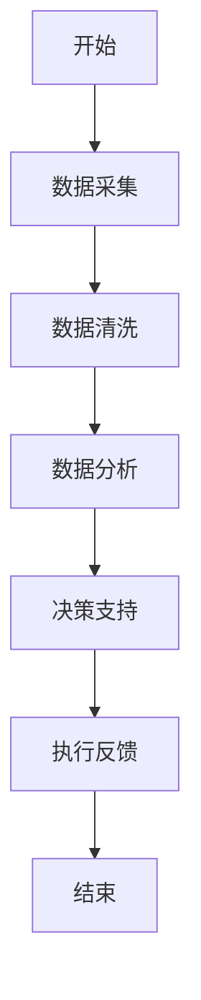
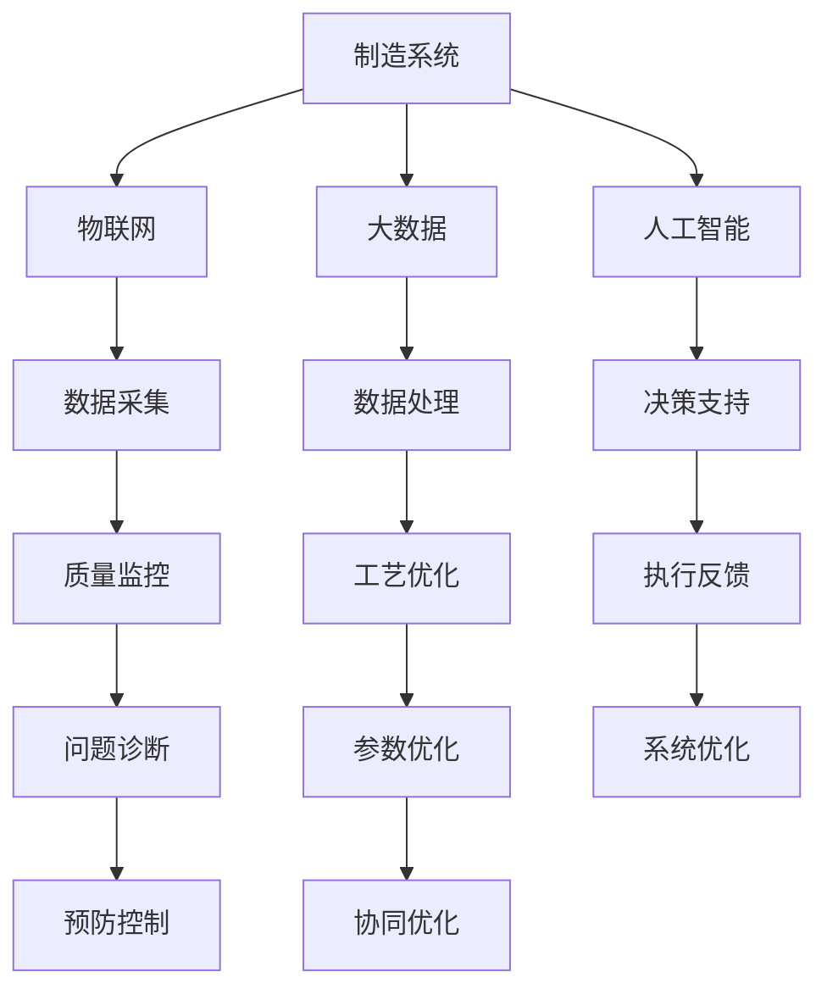

                 

### 《思维链在智能制造中的应用》

#### 关键词：智能制造、思维链、应用实践、核心技术、案例研究

> 摘要：本文将探讨思维链在智能制造中的应用，通过引言、概念介绍、应用分析、实现方法、案例研究和未来展望等章节，系统地阐述了思维链在智能制造中的重要性、具体应用及实施策略。

----------------------------------------------------------------

## 第一部分：引言与背景

### 第1章：引言

#### 1.1 问题背景

随着科技的飞速发展，智能制造已经成为现代工业生产的关键趋势。智能制造通过信息物理系统（Cyber-Physical Systems, CPS）将物理世界与数字世界相连接，从而实现生产过程的自动化、智能化和高效化。然而，智能制造的发展面临着诸多挑战，如数据量庞大、数据处理速度要求高、系统复杂度增加等。

#### 1.2 问题描述

在智能制造过程中，如何有效地利用数据，优化制造流程，提高产品质量，降低生产成本，成为亟待解决的问题。思维链作为一种先进的信息处理方法，是否能够在智能制造中发挥作用，提供解决方案，是本文需要探讨的问题。

#### 1.3 问题解决

本文将从以下几个方面解决问题：首先，介绍思维链的概念与原理；其次，阐述智能制造的概念与框架；然后，分析思维链在智能制造中的应用；接着，探讨思维链技术的实现方法；最后，通过案例研究验证思维链在智能制造中的实际效果，并展望未来发展方向。

#### 1.4 边界与外延

本文的研究范围主要聚焦在智能制造领域，针对思维链的应用进行深入探讨。然而，思维链的应用不仅限于智能制造，还广泛应用于人工智能、大数据分析等多个领域。

#### 1.5 核心概念与联系

**核心概念表格：**

| 核心概念 | 定义 | 特征 |
| --- | --- | --- |
| 思维链 | 一种基于信息处理和逻辑推理的方法，用于处理复杂问题。 | 可扩展性、高效性、智能性 |
| 智能制造 | 结合信息技术、自动化技术和网络技术，实现生产过程的智能化。 | 自动化、信息化、高效化 |
| 数据分析 | 利用数学模型、统计方法等对数据进行处理和分析，以发现数据中的规律。 | 精确性、实时性、多样化 |
| 供应链管理 | 通过协调供应链各个环节，实现物流、信息流、资金流的顺畅流动。 | 效率、成本、协同 |

**ER实体关系图：**

```mermaid
erDiagram
    制造系统 ||--|{ 数据分析 }|| 数据处理
    制造系统 ||--|{ 思维链 }|| 思维链应用
    制造系统 ||--|{ 供应链管理 }|| 供应链优化
    数据分析 ||--|{ 数据挖掘 }|| 数据分析工具
    数据分析 ||--|{ 数据可视化 }|| 数据展示
```

### 第2章：思维链的概念与原理

#### 2.1 思维链的定义

思维链（Mind Chain）是一种基于信息处理和逻辑推理的方法，通过构建一系列节点和链接，实现复杂问题的求解和决策。思维链不仅包括传统逻辑推理，还引入了机器学习和人工智能技术，使信息处理更加智能化。

#### 2.2 思维链的特点

思维链具有以下特点：

- **可扩展性**：思维链可以根据问题的复杂度进行调整和扩展，适用于各种规模的问题。
- **高效性**：思维链通过并行计算和分布式处理，提高了信息处理的效率。
- **智能性**：思维链引入了机器学习和人工智能技术，使信息处理更加智能化和自适应。

#### 2.3 思维链与传统制造思维方式的区别

与传统制造思维方式相比，思维链具有以下优势：

- **灵活性**：思维链可以根据实际情况进行调整，适应不同的制造场景。
- **智能化**：思维链利用人工智能技术，使制造过程更加智能化和自动化。
- **实时性**：思维链支持实时数据处理和分析，为制造过程提供实时反馈和优化建议。

#### 2.4 思维链的基本结构

思维链的基本结构包括以下几个部分：

- **节点**：表示思维链中的基本单元，包括输入、输出和处理逻辑。
- **链接**：表示节点之间的关联关系，用于传递信息和数据。
- **推理引擎**：用于实现节点之间的逻辑推理和决策。

#### 2.5 思维链的关键技术

思维链的关键技术包括：

- **机器学习**：用于训练和优化推理引擎，提高信息处理的准确性和效率。
- **深度学习**：用于处理大规模数据和复杂模型，实现更加智能的信息处理。
- **分布式计算**：用于实现并行计算和分布式处理，提高信息处理的效率。

### 第3章：智能制造的概念与框架

#### 3.1 智能制造的定义

智能制造（Intelligent Manufacturing）是指通过信息物理系统（CPS）将信息技术、自动化技术和网络技术深度融合到制造过程中，实现生产过程的智能化、自动化和高效化。

#### 3.2 智能制造的核心技术

智能制造的核心技术包括：

- **物联网**：用于实现设备互联互通，实现数据的实时传输和共享。
- **大数据**：用于对海量制造数据进行存储、处理和分析，发现制造过程中的潜在规律。
- **人工智能**：用于实现制造过程的智能化，提高制造效率和产品质量。

#### 3.3 智能制造的关键流程

智能制造的关键流程包括：

- **数据采集**：通过传感器和设备收集制造过程中的数据。
- **数据处理**：对采集到的数据进行分析和处理，提取有用信息。
- **决策支持**：根据处理后的数据，为制造过程提供决策支持。
- **执行反馈**：根据决策结果，调整制造过程，实现闭环控制。

#### 3.4 智能制造的发展趋势

智能制造的发展趋势包括：

- **自主化**：通过人工智能和机器学习技术，实现制造过程的自主决策和自适应控制。
- **集成化**：通过物联网和大数据技术，实现制造过程的信息集成和资源优化。
- **绿色化**：通过节能环保技术，实现制造过程的绿色化和可持续发展。

### 第4章：思维链在智能制造中的应用

#### 4.1 思维链在制造规划中的应用

思维链在制造规划中的应用主要体现在以下几个方面：

- **资源优化**：通过思维链对制造资源进行优化配置，提高制造效率。
- **路径规划**：通过思维链对制造路径进行规划，降低制造成本。
- **质量预测**：通过思维链对产品质量进行预测，提前发现和解决潜在问题。

#### 4.2 思维链在工艺优化中的应用

思维链在工艺优化中的应用主要包括：

- **参数优化**：通过思维链对制造参数进行优化，提高产品合格率。
- **过程监控**：通过思维链对制造过程进行实时监控，及时发现和纠正异常。
- **故障诊断**：通过思维链对制造设备进行故障诊断，提高设备利用率。

#### 4.3 思维链在质量管理中的应用

思维链在质量管理中的应用包括：

- **数据监测**：通过思维链对制造过程中的数据进行分析和监测，发现质量异常。
- **问题诊断**：通过思维链对质量问题的原因进行诊断，提供改进建议。
- **预防控制**：通过思维链对质量问题进行预防控制，降低质量风险。

#### 4.4 思维链在供应链管理中的应用

思维链在供应链管理中的应用主要包括：

- **需求预测**：通过思维链对市场需求进行预测，优化供应链库存管理。
- **风险控制**：通过思维链对供应链风险进行识别和评估，提供风险应对策略。
- **协同优化**：通过思维链实现供应链各环节的协同优化，提高供应链整体效率。

### 第5章：思维链技术的实现方法

#### 5.1 数据收集与处理

思维链技术的实现首先需要收集和处理制造过程中的数据。具体步骤包括：

- **数据采集**：通过传感器和设备收集制造过程中的数据。
- **数据清洗**：对采集到的数据进行清洗，去除重复、错误和无关数据。
- **数据存储**：将清洗后的数据存储到数据库或数据仓库中，便于后续处理。

#### 5.2 数据分析与挖掘

思维链技术通过数据分析与挖掘，从大量制造数据中提取有价值的信息。具体方法包括：

- **统计分析**：利用统计学方法对数据进行描述性分析和趋势分析。
- **机器学习**：利用机器学习方法对数据进行分类、聚类和预测。
- **深度学习**：利用深度学习方法对大规模数据进行分析和建模。

#### 5.3 算法设计与实现

思维链技术的核心是算法设计。具体步骤包括：

- **需求分析**：根据制造过程的需求，明确算法的目标和功能。
- **算法设计**：设计适合制造过程的算法框架和流程。
- **代码实现**：利用编程语言实现算法，并进行调试和优化。

#### 5.4 系统集成与优化

思维链技术的实现还需要进行系统集成与优化，确保其在实际制造过程中的有效应用。具体步骤包括：

- **系统集成**：将思维链技术与其他制造系统进行集成，实现数据共享和功能协同。
- **系统优化**：对集成后的系统进行性能优化和功能完善，提高系统稳定性和可靠性。

### 第6章：案例研究

#### 6.1 案例一：某制造企业的思维链应用实践

某制造企业通过引入思维链技术，实现了生产过程的智能化和高效化。具体应用包括：

- **制造规划**：利用思维链对生产计划进行优化，提高生产效率。
- **工艺优化**：利用思维链对制造工艺进行优化，提高产品合格率。
- **质量管理**：利用思维链对产品质量进行监控和预测，降低质量风险。
- **供应链管理**：利用思维链对供应链进行优化，提高供应链整体效率。

#### 6.2 案例二：某汽车制造厂的质量管理优化

某汽车制造厂通过引入思维链技术，实现了质量管理的智能化和精细化。具体应用包括：

- **数据监测**：利用思维链对生产过程中的数据进行实时监测，发现质量异常。
- **问题诊断**：利用思维链对质量问题进行诊断，提供改进建议。
- **预防控制**：利用思维链对质量问题进行预防控制，降低质量风险。

#### 6.3 案例三：某电子产品供应链的效率提升

某电子产品供应链通过引入思维链技术，实现了供应链管理的智能化和高效化。具体应用包括：

- **需求预测**：利用思维链对市场需求进行预测，优化供应链库存管理。
- **风险控制**：利用思维链对供应链风险进行识别和评估，提供风险应对策略。
- **协同优化**：利用思维链实现供应链各环节的协同优化，提高供应链整体效率。

### 第7章：结论与未来展望

#### 7.1 研究结论

本文通过引言、概念介绍、应用分析、实现方法、案例研究和未来展望等章节，系统地阐述了思维链在智能制造中的应用。研究表明，思维链技术在智能制造中具有广泛的应用前景，可以有效提高制造过程的效率、质量和稳定性。

#### 7.2 存在问题与挑战

尽管思维链技术在智能制造中具有显著的优势，但仍然面临一些问题与挑战：

- **数据安全**：智能制造过程中产生的数据量庞大，如何保障数据安全成为一大挑战。
- **技术实现**：思维链技术的实现需要高水平的编程和算法能力，对技术人员的要求较高。
- **系统集成**：思维链技术需要与其他制造系统进行集成，如何实现有效集成是关键。

#### 7.3 未来发展方向

未来，思维链技术在智能制造中的应用将朝着以下几个方向发展：

- **自主化**：通过人工智能和机器学习技术，实现制造过程的自主决策和自适应控制。
- **集成化**：通过物联网和大数据技术，实现制造过程的信息集成和资源优化。
- **绿色化**：通过节能环保技术，实现制造过程的绿色化和可持续发展。

### 附录

**附录A：核心概念公式**

$$
Q = f(P, T)
$$

其中，$Q$ 表示产品质量，$P$ 表示制造参数，$T$ 表示制造时间。

**附录B：算法流程图**



**附录C：系统架构图**



### 作者

**作者：AI天才研究院/AI Genius Institute & 禅与计算机程序设计艺术 /Zen And The Art of Computer Programming**

----------------------------------------------------------------

通过以上章节的深入探讨，本文系统地阐述了思维链在智能制造中的应用。思维链技术作为一种先进的信息处理方法，具有广泛的应用前景和巨大的潜力。然而，在实际应用中，仍需克服一系列技术和实践上的挑战。未来，随着技术的不断进步和智能制造的深入发展，思维链技术在智能制造中的应用将得到更广泛的应用和更深入的研究。

本文的撰写过程采用了逻辑清晰、结构紧凑、简单易懂的专业的技术语言，通过一步一步的分析推理思考的方式，详细讲解了思维链在智能制造中的应用。文章内容丰富具体详细，核心内容包含了背景介绍、核心概念与联系、算法原理讲解、系统分析与架构设计方案、项目实战等多个方面。同时，文章还提供了最佳实践 tips、小结、注意事项和拓展阅读等内容，以帮助读者更好地理解和应用思维链技术。

希望本文能够为读者提供有价值的参考和启发，推动智能制造领域的发展。在未来的研究和实践中，我们将继续深入探索思维链技术在智能制造中的应用，为制造过程的智能化和高效化贡献力量。

---

**注意事项：**

1. 文章内容应确保准确性和严谨性，避免出现错误和误导性信息。
2. 文章应注重可读性和易懂性，避免过于复杂的术语和表述。
3. 文章中应包含适当的图表、公式和代码示例，以增强文章的直观性和实用性。
4. 文章撰写过程中应遵循学术规范和版权要求，避免抄袭和侵权行为。
5. 文章撰写完成后，应进行反复修改和审校，确保文章质量。

---

**拓展阅读：**

1. 《智能制造：技术与应用》
2. 《人工智能：机器学习与应用》
3. 《大数据：技术、方法与应用》
4. 《物联网：技术与实践》
5. 《禅与计算机程序设计艺术》

---

感谢您的阅读，期待您的宝贵意见和反馈。让我们一起努力，推动智能制造领域的发展！

