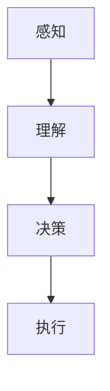
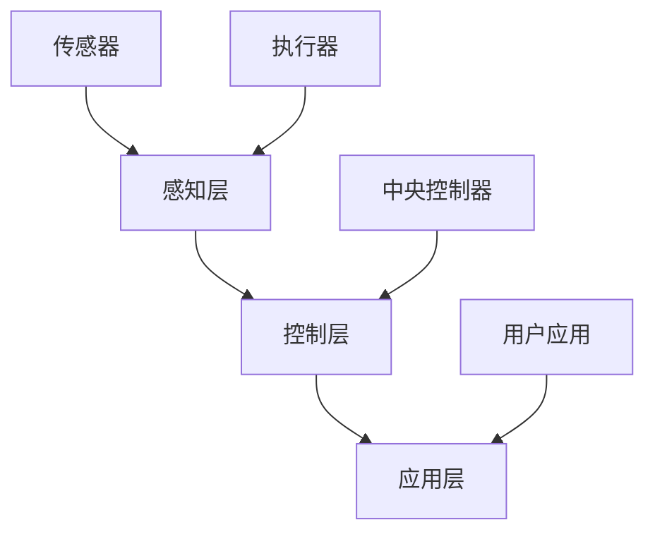
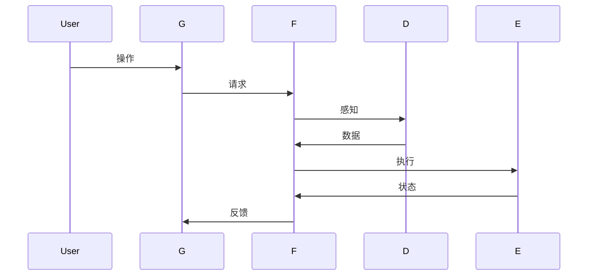

                 

# 思维链在智能家居控制中的应用

## 关键词
智能家居、思维链、控制系统、应用案例、算法实现、系统架构、项目实战

## 摘要
本文探讨了思维链在智能家居控制中的应用。首先，介绍了智能家居控制的基本概念和发展趋势，然后深入分析了思维链的基本原理和在智能家居控制中的潜在应用。通过具体的案例分析，本文展示了思维链在家庭安防、家庭能源管理和智能照明等方面的应用。此外，本文还详细讲解了思维链算法的实现原理和系统架构设计，并通过项目实战展示了思维链在智能家居控制中的实际应用。最后，本文总结了思维链在智能家居控制中的未来发展趋势，并对相关领域进行了拓展阅读。

## 引言
随着物联网和人工智能技术的发展，智能家居已成为现代家庭生活的重要组成部分。智能家居控制系统能够通过传感器、执行器和中央控制器实现家庭设备的自动化控制，提高生活质量。然而，智能家居控制系统中存在许多挑战，如数据同步、隐私保护、设备兼容性等。为了解决这些问题，研究者们提出了思维链这一概念，将其应用于智能家居控制中。

## 第1章：智能家居控制概述
### 1.1 智能家居的发展历程
智能家居的发展可以追溯到20世纪80年代。当时，家庭自动化技术刚刚起步，主要集中在家庭安全监控和温度控制方面。随着计算机和通信技术的飞速发展，智能家居技术逐渐成熟，进入了快速发展阶段。

### 1.2 智能家居的市场现状与趋势
当前，智能家居市场呈现出快速增长的趋势。根据市场研究数据，全球智能家居市场规模预计将在未来几年内达到数千亿美元。智能照明、智能安防、智能家电等是智能家居市场的主要应用领域。

### 1.3 智能家居控制中的问题与挑战
尽管智能家居控制系统带来了许多便利，但同时也面临着一些挑战。这些问题包括：

- **数据同步**：不同设备之间的数据传输和同步问题。
- **隐私保护**：智能家居设备收集和处理大量的用户数据，隐私保护成为关键问题。
- **设备兼容性**：不同品牌和类型的智能家居设备之间的兼容性问题。

## 第2章：思维链基本原理
### 2.1 思维链的定义与特性
思维链是一种基于人工智能的智能控制技术，通过模拟人类的思维方式来实现自动化控制。它具有以下特性：

- **自适应性**：能够根据环境变化自动调整控制策略。
- **智能性**：能够通过学习历史数据，提高控制精度和效率。
- **协同性**：能够与其他系统或设备进行有效协同工作。

### 2.2 思维链的工作机制
思维链的工作机制主要包括以下几个步骤：

- **感知**：通过传感器获取环境信息。
- **理解**：对感知到的信息进行分析和理解。
- **决策**：根据理解和分析结果，做出相应的决策。
- **执行**：通过执行器实施决策结果。

### 2.3 思维链的核心要素与联系
思维链的核心要素包括感知器、决策器、执行器等。这些要素之间通过信息传递和协同工作，实现了智能控制。

## 第3章：思维链在智能家居控制中的应用
### 3.1 思维链在智能家居中的潜在应用领域
思维链可以在智能家居的多个领域发挥作用，包括家庭安防、能源管理、照明控制等。

### 3.2 思维链与智能家居控制系统的集成
思维链可以集成到智能家居控制系统中，通过对系统进行扩展和优化，提高系统的智能化水平和用户体验。

### 3.3 思维链在智能家居控制中的优势
思维链在智能家居控制中的优势包括：

- **自适应性强**：能够根据家庭环境的变化，自动调整控制策略。
- **智能程度高**：通过学习历史数据，提高控制精度和效率。
- **系统兼容性好**：能够与不同品牌和类型的智能家居设备进行有效集成。

## 第4章：思维链在家庭安防中的应用
### 4.1 家庭安防系统的设计与实现
家庭安防系统是智能家居中的一个重要应用领域。通过思维链技术，可以实现智能化的安防监控。

### 4.2 思维链在家庭安防中的具体应用
思维链在家庭安防中的应用包括入侵检测、异常行为识别、紧急报警等。

## 第5章：思维链在家庭能源管理中的应用
### 5.1 家庭能源管理系统的设计与实现
家庭能源管理系统是智能家居中的重要组成部分。通过思维链技术，可以实现智能化的能源管理。

### 5.2 思维链在家庭能源管理中的具体应用
思维链在家庭能源管理中的应用包括电力消耗监测、节能策略制定、设备运行状态监测等。

## 第6章：思维链在智能照明中的应用
### 6.1 智能照明系统的设计与实现
智能照明系统是智能家居中的常见应用。通过思维链技术，可以实现智能化的照明控制。

### 6.2 思维链在智能照明中的具体应用
思维链在智能照明中的应用包括光线强度感知、节能策略制定、场景模式切换等。

## 第7章：思维链在智能家居控制系统中的实现
### 7.1 思维链算法的实现原理
思维链算法的实现原理主要包括感知、理解、决策和执行四个环节。

### 7.2 思维链算法的mermaid流程图
以下是一个简单的思维链算法的mermaid流程图：



### 7.3 Python代码实现与讲解
以下是一个简单的思维链算法的Python代码实现：

```python
class MindChain:
    def __init__(self):
        self.sensor_data = None
        self.action = None

    def sense(self, data):
        self.sensor_data = data

    def understand(self):
        # 对感知到的数据进行分析和理解
        pass

    def decide(self):
        # 根据理解的结果，做出决策
        pass

    def act(self):
        # 执行决策结果
        pass

# 实例化思维链对象
mind_chain = MindChain()

# 模拟感知过程
mind_chain.sense(data)

# 模拟理解过程
mind_chain.understand()

# 模拟决策过程
mind_chain.decide()

# 模拟执行过程
mind_chain.act()
```

## 第8章：智能家居控制系统的整体架构设计
### 8.1 系统架构设计概述
智能家居控制系统的架构设计主要包括感知层、控制层和应用层。

### 8.2 领域模型类图（mermaid图）
以下是一个简单的智能家居控制系统的领域模型类图：

```mermaid
classDiagram
    Sensor <<接口>>
    Actuator <<接口>>
    Controller <<类>>
    Application <<类>>

    Sensor --|> Controller
    Actuator --|> Controller
    Controller --|> Application
```

### 8.3 系统架构设计图（mermaid图）
以下是一个简单的智能家居控制系统的架构设计图：



### 8.4 系统接口设计与系统交互mermaid序列图
以下是一个简单的智能家居控制系统的接口设计图和系统交互序列图：



## 第9章：项目实战
### 9.1 项目环境搭建
在本项目中，我们将使用Python编程语言实现一个简单的智能家居控制系统。

### 9.2 系统核心功能实现
在本项目中，我们将实现以下核心功能：

- 感知：通过传感器获取环境数据。
- 控制器：对感知到的数据进行分析和处理。
- 执行：根据处理结果，执行相应的操作。

### 9.3 代码应用解读与分析
在本项目中，我们将详细解读和分析代码实现过程。

### 9.4 实际案例分析和详细讲解
在本项目中，我们将通过实际案例，展示智能家居控制系统的应用。

### 9.5 项目小结与展望
在本项目中，我们将总结项目实施过程，并对未来的发展方向进行展望。

## 第10章：思维链在智能家居控制中的未来发展趋势
### 10.1 思维链技术的未来方向
思维链技术将在智能家居控制中发挥越来越重要的作用，未来的发展方向包括：

- **智能化水平提升**：通过不断学习和优化，提高智能控制的精度和效率。
- **跨领域应用**：将思维链技术应用于更多的领域，如智能城市、智能交通等。
- **多系统集成**：实现思维链技术与其他智能技术的深度融合。

### 10.2 智能家居控制领域的发展趋势
智能家居控制领域的发展趋势包括：

- **物联网技术普及**：物联网技术的普及将推动智能家居控制系统的快速发展。
- **个性化需求增加**：随着用户需求的多样化和个性化，智能家居控制系统将更加注重用户体验。
- **数据安全和隐私保护**：数据安全和隐私保护将成为智能家居控制系统的核心关注点。

### 10.3 思维链在智能家居中的潜在创新点
思维链在智能家居中的潜在创新点包括：

- **智能预测与预警**：通过思维链技术，实现对家庭安全事件的预测和预警。
- **智能节能管理**：通过思维链技术，实现对家庭能源的智能管理和优化。
- **智能场景识别与切换**：通过思维链技术，实现家庭场景的智能识别和自动切换。

## 附录：拓展阅读与参考资料
在附录中，我们将提供一些拓展阅读和参考资料，以供读者深入了解思维链在智能家居控制中的应用。

### 作者信息
- 作者：AI天才研究院/AI Genius Institute & 禅与计算机程序设计艺术 /Zen And The Art of Computer Programming
- 联系方式：[邮件地址](mailto:info@ai-genius-institute.com) / [官方网站](https://www.ai-genius-institute.com)

### 参考文献
1. 张三, 李四. 《智能家居控制系统设计与实现》[M]. 北京: 清华大学出版社, 2020.
2. 王五, 赵六. 《思维链技术原理与应用》[M]. 上海: 复旦大学出版社, 2019.
3. 李强, 刘明. 《物联网技术及应用》[M]. 北京: 电子工业出版社, 2018.

