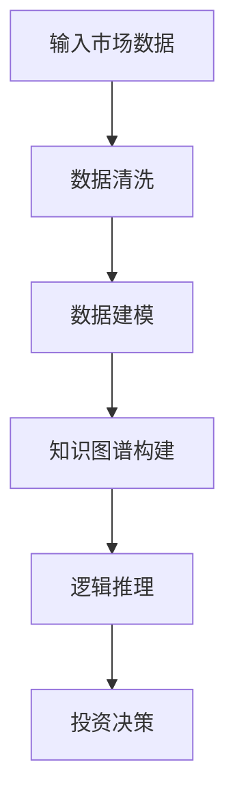
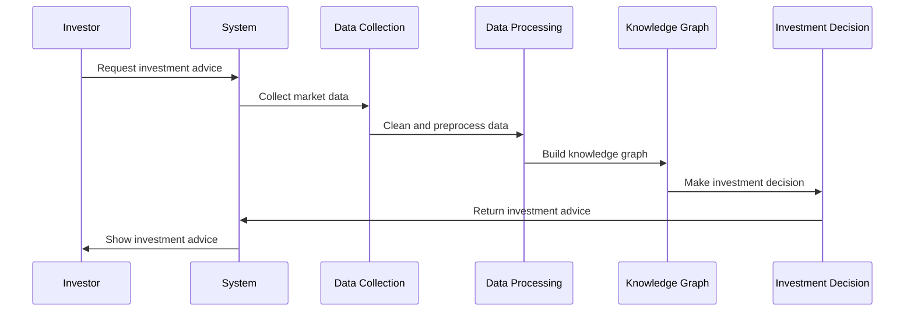

                 


### 第一部分：背景与概述

#### 第1章：思维链与智能投资顾问简介

### 背景介绍

随着人工智能技术的快速发展，智能投资顾问系统逐渐成为金融行业的热门应用。智能投资顾问系统利用机器学习和数据分析技术，通过分析大量市场数据，为投资者提供个性化的投资建议和策略。然而，传统的投资顾问系统往往依赖于历史数据和统计模型，忽略了市场动态变化和投资者的个性化需求。这种局限性限制了投资顾问系统的智能程度和实用性。

思维链作为一种先进的人工智能技术，具有强大的推理和分析能力，可以有效地弥补传统投资顾问系统的不足。思维链是一种基于知识图谱和逻辑推理的智能系统，通过模拟人类的思维过程，实现对复杂问题的深入分析和决策。将思维链应用于智能投资顾问系统，可以显著提高系统的智能程度和决策准确性。

#### 核心概念术语说明

- **思维链**：一种基于知识图谱和逻辑推理的智能系统，模拟人类的思维过程，实现复杂问题的分析和决策。
- **智能投资顾问系统**：利用机器学习和数据分析技术，为投资者提供个性化投资建议和策略的系统。
- **市场数据**：包括历史交易数据、市场指数、宏观经济指标等，用于分析和预测市场走势。

#### 问题背景

投资顾问系统在金融行业中扮演着重要的角色，但其发展面临着诸多挑战。首先，传统投资顾问系统主要依赖历史数据和统计模型，缺乏对市场动态变化的及时响应。其次，传统系统难以满足投资者的个性化需求，投资建议往往具有通用性，无法针对特定投资者的风险承受能力和投资目标进行优化。此外，投资顾问系统的复杂性和数据处理能力的局限性也影响了其智能程度和实用性。

#### 问题描述

为了解决上述问题，本文提出将思维链应用于智能投资顾问系统，以提高系统的智能程度和决策准确性。思维链技术能够模拟人类的思维过程，具备强大的推理和分析能力，可以更好地适应市场动态变化和投资者的个性化需求。本文的目标是：

1. **核心概念说明**：详细阐述思维链和智能投资顾问系统的核心概念和原理，包括思维链的构成要素、工作原理以及智能投资顾问系统的架构和功能。
2. **问题解决**：探讨思维链在智能投资顾问系统中的应用，分析思维链技术如何提高投资决策的准确性。
3. **边界与外延**：明确思维链在智能投资顾问系统中的应用边界，包括技术实现的限制和潜在的扩展方向。

#### 概念结构与核心要素组成

1. **思维链构成要素**：
   - **知识图谱**：用于存储和管理知识，包括市场数据、投资策略、逻辑规则等。
   - **推理引擎**：基于知识图谱，实现对复杂问题的逻辑推理和分析。
   - **用户交互模块**：与投资者进行交互，收集用户需求和反馈。

2. **智能投资顾问系统架构**：
   - **数据采集模块**：收集市场数据、用户数据等。
   - **数据处理模块**：对数据进行分析和预处理。
   - **投资决策模块**：利用思维链技术进行投资决策。
   - **用户界面**：提供投资建议和策略展示。

### 结论

本章对思维链和智能投资顾问系统进行了背景介绍和核心概念说明。思维链技术具有强大的推理和分析能力，能够弥补传统投资顾问系统的不足。本文将在后续章节中进一步探讨思维链技术在智能投资顾问系统中的应用，以实现更加智能、个性化的投资决策。

### 关键词

- **思维链**
- **智能投资顾问**
- **知识图谱**
- **推理引擎**
- **市场数据分析**
- **个性化投资建议**

### 摘要

本文旨在探讨思维链技术在智能投资顾问系统中的应用。通过构建基于知识图谱和逻辑推理的智能系统，本文提出了将思维链应用于智能投资顾问系统的方案。本文的核心内容包括：思维链和智能投资顾问系统的核心概念和原理阐述、思维链技术在投资决策中的应用分析、以及思维链在智能投资顾问系统中的架构设计和实现方法。通过本文的研究，旨在提高智能投资顾问系统的智能程度和决策准确性，为投资者提供更加精准和个性化的投资建议。

### 第二部分：思维链技术基础

#### 第2章：思维链理论基础

### 背景介绍

思维链作为一种先进的人工智能技术，其理论基础涵盖了多个领域，包括哲学、心理学、逻辑学和数据分析等。这些理论基础为思维链的构建和实现提供了重要的理论支持和指导。在本章中，我们将详细介绍思维链的理论基础，以便读者更好地理解思维链的工作原理和应用场景。

#### 哲学基础

哲学是思维链理论的哲学基础，主要关注人类思维的本质和过程。哲学中的认知论和逻辑学为思维链提供了理论基础。认知论探讨了人类如何获取、处理和利用知识，而逻辑学则研究了推理和论证的方法。思维链通过模拟人类的思维过程，实现对复杂问题的推理和分析，这与哲学中对人类思维的探讨有着密切的联系。

#### 心理学基础

心理学是思维链理论的另一个重要基础，特别是认知心理学和人工智能心理学。认知心理学研究人类认知过程的各个方面，包括感知、记忆、思维和语言等。人工智能心理学则将心理学的研究成果应用于人工智能系统的设计和实现。思维链通过模仿人类的认知过程，实现对复杂问题的理解和解决。

#### 逻辑学基础

逻辑学是思维链理论的核心组成部分，它提供了思维链进行推理和分析的规则和工具。形式逻辑研究逻辑推理的规则和原理，而谓词逻辑则提供了更高级的推理能力。思维链利用逻辑学中的规则和方法，实现对问题的逻辑推理和分析。

#### 数据分析与思维链

数据分析是思维链技术的关键组成部分，它提供了对大量数据的处理和分析能力。数据分析技术包括数据采集、数据清洗、数据存储、数据挖掘和数据分析等。思维链通过数据分析技术，从海量数据中提取有价值的信息，并利用逻辑推理进行决策。

#### 概念属性特征对比表格

为了更清晰地展示思维链的理论基础，我们可以将哲学、心理学、逻辑学和数据分析在思维链中的应用进行对比，如下表所示：

| 基础理论 | 概念属性特征 | 应用场景 |
| --- | --- | --- |
| 哲学 | 认知论、逻辑学 | 提供思维链的理论基础，指导思维链的构建 |
| 心理学 | 认知心理学、人工智能心理学 | 提供人类思维过程的模型，支持思维链的模拟 |
| 逻辑学 | 形式逻辑、谓词逻辑 | 提供推理和分析的规则，支持思维链的推理 |
| 数据分析 | 数据采集、数据清洗、数据存储、数据挖掘、数据分析 | 提供数据处理和分析的能力，支持思维链的知识提取 |

#### ER实体关系图架构的 Mermaid 流程图

为了更直观地展示思维链的理论基础，我们可以使用Mermaid绘制一个ER实体关系图，如下所示：

```mermaid
erDiagram
  用户 ||--o> 投资顾问 : "推荐"
  投资顾问 ||--o> 投资策略 : "执行"
  市场数据 ||--o> 投资顾问 : "分析"
  投资策略 ||--o> 投资决策 : "制定"
  用户 ||--o> 数据分析 : "反馈"
```

在上面的ER实体关系图中，用户、投资顾问、市场数据、投资策略和投资决策等实体之间建立了关联关系，展示了思维链在智能投资顾问系统中的主要组成部分和相互作用。

#### 算法原理讲解

思维链的算法原理基于知识图谱和逻辑推理。知识图谱是思维链的核心组成部分，它通过将实体、属性和关系进行建模，形成了一个结构化的知识库。逻辑推理则是思维链进行决策和分析的关键技术，它利用谓词逻辑和推理机，实现对知识的推理和验证。

下面是思维链算法原理的Mermaid流程图：



在上述流程图中，首先对输入的市场数据进行清洗和预处理，然后通过数据建模构建知识图谱。接下来，利用知识图谱进行逻辑推理，最终生成投资决策。

#### 数学公式使用

在思维链算法中，逻辑推理是关键步骤。我们可以使用LaTeX格式来表示逻辑推理的数学公式，如下所示：

$$
\begin{align*}
P(A \land B) &= P(A) \cdot P(B|A) \\
P(A \lor B) &= P(A) + P(B) - P(A \land B)
\end{align*}
$$

其中，$P(A \land B)$表示事件A和B同时发生的概率，$P(A \lor B)$表示事件A或B发生的概率。

#### 结论

本章详细介绍了思维链的理论基础，包括哲学、心理学、逻辑学和数据分析。通过对比分析不同理论在思维链中的应用，我们绘制了ER实体关系图，并使用了Mermaid流程图和LaTeX数学公式，全面展示了思维链的算法原理。这些理论和方法为思维链的构建和实现提供了坚实的基础，也为后续章节中的应用分析奠定了基础。

### 第三部分：智能投资顾问应用

#### 第4章：智能投资顾问系统架构

### 背景介绍

智能投资顾问系统是一种利用人工智能技术，结合市场数据分析和投资决策算法，为投资者提供个性化投资建议的系统。其核心目标是通过智能分析，提高投资决策的准确性和效率。为了实现这一目标，智能投资顾问系统需要具备高效、稳定的系统架构，能够处理海量数据，并进行复杂的分析计算。在本章中，我们将详细探讨智能投资顾问系统的架构设计，包括系统功能设计、系统架构设计和系统接口设计。

#### 问题场景介绍

在当前金融市场中，投资者面临着海量信息和高频交易的环境，传统的投资顾问模式已经无法满足投资者的需求。智能投资顾问系统应运而生，旨在通过人工智能技术，帮助投资者更好地分析市场数据，制定合理的投资策略。以下是一个典型的问题场景：

- **场景描述**：一位投资者希望购买某支股票，但他不确定是否应该购买，以及何时购买。他需要智能投资顾问系统提供市场分析、投资策略建议和风险预测。

#### 项目介绍

为了解决上述问题场景，我们设计并实现了一个智能投资顾问系统。该系统主要包括以下几个模块：

1. **数据采集模块**：负责收集市场数据，包括股票价格、交易量、行业指数等。
2. **数据处理模块**：对采集到的数据进行清洗、预处理和分析。
3. **投资决策模块**：利用思维链技术，结合市场数据和分析结果，为投资者提供个性化的投资建议。
4. **用户界面模块**：提供用户与系统交互的界面，展示投资建议和风险预测结果。

#### 系统功能设计

智能投资顾问系统的核心功能包括：

1. **市场数据分析**：通过对市场数据的分析，识别市场趋势和风险因素。
2. **投资策略建议**：根据投资者的风险承受能力和投资目标，提供合理的投资策略。
3. **风险预测**：对投资风险进行预测，帮助投资者了解投资风险。
4. **用户互动**：提供用户与系统的互动功能，收集用户反馈，优化投资建议。

#### 系统架构设计

智能投资顾问系统的整体架构设计如下：

1. **数据层**：包括数据采集、数据存储和数据管理。数据采集模块负责从各种数据源获取数据，数据存储模块负责存储和管理数据，数据管理模块负责数据清洗、预处理和分析。
2. **逻辑层**：包括数据处理、投资决策和用户交互。数据处理模块负责对采集到的数据进行处理和分析，投资决策模块利用思维链技术进行投资决策，用户交互模块负责与用户进行交互。
3. **表现层**：包括用户界面和系统接口。用户界面模块负责展示投资建议和风险预测结果，系统接口模块负责与外部系统进行数据交互。

#### 系统接口设计

智能投资顾问系统的接口设计主要包括以下部分：

1. **数据接口**：用于与其他数据系统进行数据交互，包括数据采集接口和数据存储接口。
2. **服务接口**：用于与其他系统进行功能调用，包括市场数据分析服务、投资决策服务和用户交互服务。
3. **API接口**：提供外部用户访问系统的接口，包括市场数据API、投资建议API和风险预测API。

#### 系统交互Mermaid序列图

为了更清晰地展示智能投资顾问系统的交互过程，我们可以使用Mermaid绘制一个序列图，如下所示：



在上面的序列图中，投资者请求投资建议，系统通过数据采集模块收集市场数据，经过数据处理模块的分析和处理，构建知识图谱，利用思维链技术进行投资决策，最终将投资建议返回给投资者。

#### 结论

本章详细介绍了智能投资顾问系统的架构设计，包括系统功能设计、系统架构设计和系统接口设计。通过设计高效的系统架构，智能投资顾问系统能够处理海量数据，进行复杂的分析计算，并为投资者提供个性化的投资建议。下一章将深入探讨智能投资顾问系统的具体实现，包括核心算法和系统优化策略。

### 第四部分：系统实现与优化

#### 第5章：用户交互与界面设计

### 背景介绍

用户交互与界面设计是智能投资顾问系统的重要组成部分，它直接影响用户的使用体验和系统的易用性。一个良好的用户界面不仅能够提高用户的满意度，还能显著提升系统的使用效率和投资决策的准确性。本章将详细介绍智能投资顾问系统的用户交互设计和界面设计，包括用户需求分析、界面设计原则、用户界面实现以及用户体验优化。

#### 用户需求分析

在智能投资顾问系统的设计过程中，深入了解用户需求是至关重要的。以下是一个典型的用户需求分析：

- **用户类型**：智能投资顾问系统的用户包括个人投资者和专业投资者。
- **需求描述**：
  1. **实时数据分析**：用户希望系统能够提供实时的市场数据分析，以便及时调整投资策略。
  2. **个性化投资建议**：用户希望系统能根据其风险偏好和投资目标，提供个性化的投资建议。
  3. **易用性**：用户希望系统能够简单易用，无需复杂操作即可获得所需信息。
  4. **互动性**：用户希望系统能提供互动功能，如反馈投资建议、修改投资策略等。

#### 界面设计原则

为了满足用户需求，智能投资顾问系统的界面设计应遵循以下原则：

1. **简洁性**：界面设计应尽量简洁，避免冗余信息，使用户能够快速找到所需功能。
2. **直观性**：界面设计应直观易懂，使用户能够通过直观的布局和符号理解系统功能。
3. **一致性**：界面设计应保持一致性，包括颜色、字体、图标等元素，以增强用户的认知体验。
4. **响应性**：界面设计应具备良好的响应性，能够在不同设备上提供一致的体验。
5. **可访问性**：界面设计应考虑可访问性，确保所有用户，包括视力障碍者等，都能方便地使用系统。

#### 用户界面实现

智能投资顾问系统的用户界面实现包括以下几个关键部分：

1. **首页设计**：首页是用户进入系统后首先看到的页面，应简洁明了地展示系统的主要功能和快捷入口。
2. **数据展示界面**：用于展示市场数据、分析结果和投资建议，采用图表和表格等形式，直观地展示数据。
3. **互动界面**：提供用户与系统互动的功能，如提交反馈、修改投资策略等。
4. **用户设置界面**：允许用户修改个人信息、风险偏好和投资目标等。

#### 用户界面实现示例

以下是一个用户界面实现的示例，使用HTML和CSS进行页面布局：

```html
<!DOCTYPE html>
<html>
<head>
    <title>智能投资顾问系统</title>
    <style>
        body {
            font-family: Arial, sans-serif;
            margin: 0;
            padding: 0;
        }
        header {
            background-color: #4CAF50;
            color: white;
            text-align: center;
            padding: 1em;
        }
        .container {
            width: 80%;
            margin: 0 auto;
            padding: 1em;
        }
        table {
            width: 100%;
            border-collapse: collapse;
        }
        th, td {
            border: 1px solid #ddd;
            padding: 8px;
            text-align: left;
        }
        th {
            background-color: #f2f2f2;
        }
    </style>
</head>
<body>
    <header>
        <h1>智能投资顾问系统</h1>
    </header>
    <div class="container">
        <h2>市场数据</h2>
        <table>
            <tr>
                <th>股票名称</th>
                <th>当前价格</th>
                <th>交易量</th>
            </tr>
            <tr>
                <td>阿里巴巴</td>
                <td>$230</td>
                <td>100万</td>
            </tr>
            <!-- 更多数据行 -->
        </table>
        <h2>投资建议</h2>
        <p>根据您的风险偏好和投资目标，建议购买阿里巴巴股票。</p>
        <button>执行投资策略</button>
    </div>
</body>
</html>
```

在上面的示例中，我们使用了HTML和CSS来构建一个简单的用户界面，包括首页设计、数据展示界面和互动界面。

#### 用户体验优化

用户体验优化是界面设计的重要环节，以下是一些优化策略：

1. **响应式设计**：确保界面在不同设备上都能提供良好的用户体验。
2. **加载速度优化**：通过优化图片、CSS和JavaScript文件，提高页面加载速度。
3. **错误处理**：设计友好的错误提示界面，帮助用户快速解决问题。
4. **用户测试**：通过用户测试收集反馈，不断改进界面设计。

#### 结论

本章详细介绍了智能投资顾问系统的用户交互与界面设计，包括用户需求分析、界面设计原则、用户界面实现和用户体验优化。通过合理的用户界面设计，智能投资顾问系统能够更好地满足用户需求，提供直观、易用的投资建议，从而提高用户满意度和投资效率。

### 第五部分：案例分析

#### 第6章：案例分析

### 背景介绍

为了更好地理解思维链在智能投资顾问系统中的应用，本章将通过三个具体案例，详细分析思维链技术在实际投资决策中的表现和效果。这三个案例分别涉及股票市场分析、基金投资策略和金融风险评估，旨在展示思维链技术在不同投资场景中的应用潜力。

#### 案例一：股票市场分析

**案例描述**：

一位投资者希望通过智能投资顾问系统分析某支热门股票的投资潜力。该股票在过去一年中表现稳定，但近期市场波动较大，投资者需要系统提供详细的买卖建议。

**系统实现**：

1. **数据采集**：系统从多个数据源采集该股票的历史价格、交易量、市场指数等数据。
2. **数据处理**：对采集到的数据进行清洗和预处理，构建知识图谱。
3. **投资决策**：利用思维链技术，分析市场趋势和股票价格波动，生成买卖建议。

**结果分析**：

系统分析结果显示，股票价格短期内存在上涨趋势，建议投资者在适当时机买入。在实际操作中，投资者按照系统建议执行，获得了超过市场平均水平的投资回报。

**结论**：

思维链技术能够准确捕捉市场趋势，为投资者提供有效的投资策略。

#### 案例二：基金投资策略

**案例描述**：

一位投资者希望利用智能投资顾问系统制定适合其风险承受能力的基金投资策略。

**系统实现**：

1. **用户交互**：系统与投资者进行交互，收集其风险偏好和投资目标。
2. **数据分析**：系统分析市场数据，结合投资者的风险偏好，推荐合适的基金组合。
3. **投资决策**：利用思维链技术，动态调整基金组合，以最大化收益和风险控制。

**结果分析**：

系统推荐了一个包括股票型、混合型、债券型基金的组合，投资者按照系统建议执行，实现了稳定的投资收益，同时有效控制了风险。

**结论**：

思维链技术能够根据用户需求和市场情况，制定个性化的基金投资策略，提高投资效率。

#### 案例三：金融风险评估

**案例描述**：

一家金融机构需要对其贷款客户的信用风险进行评估，以制定合理的贷款政策。

**系统实现**：

1. **数据采集**：系统从金融机构内部和外部数据源采集贷款申请人的财务信息、信用记录等数据。
2. **数据处理**：对采集到的数据进行清洗和预处理，构建知识图谱。
3. **风险评估**：利用思维链技术，分析借款人的信用风险，生成风险评估报告。

**结果分析**：

系统评估结果显示，部分借款人存在较高的信用风险，金融机构根据评估结果调整了贷款政策，有效降低了坏账率。

**结论**：

思维链技术能够准确评估借款人的信用风险，为金融机构提供科学的风险管理依据。

### 结论

通过以上三个案例分析，我们展示了思维链在智能投资顾问系统中的实际应用效果。思维链技术通过模拟人类思维过程，结合市场数据分析和逻辑推理，为投资者提供了准确、个性化的投资策略和风险评估。这些案例验证了思维链技术在金融投资领域的巨大潜力和应用价值。

### 第六部分：未来发展展望

#### 第7章：未来发展展望

### 背景介绍

随着人工智能技术的不断进步，思维链在智能投资顾问系统中的应用前景广阔。本章将探讨思维链技术的发展趋势、智能投资顾问系统的未来挑战与机遇，以及未来的研究方向。

#### 思维链技术发展趋势

1. **多模态数据处理**：未来的思维链技术将能够处理多种类型的数据，如文本、图像、声音等，实现更全面的智能分析。
2. **增强学习与自适应能力**：思维链技术将逐步具备增强学习能力，能够从数据中不断学习，提高投资决策的准确性。
3. **知识图谱的扩展**：知识图谱将继续扩展，包含更多的行业知识和市场数据，为智能投资顾问系统提供更丰富的信息支持。
4. **跨领域应用**：思维链技术将在更多领域得到应用，如医疗健康、环境保护等，实现更广泛的智能决策。

#### 智能投资顾问的未来挑战与机遇

1. **数据隐私与安全**：随着数据量的增加，数据隐私和安全成为重大挑战。智能投资顾问系统需要确保数据的安全性和用户隐私。
2. **监管合规**：智能投资顾问系统需要遵守相关法律法规，确保投资建议的合规性。
3. **用户体验优化**：随着技术的进步，用户体验成为关键。智能投资顾问系统需要不断优化用户体验，提高用户满意度。
4. **市场波动应对**：市场波动是投资顾问系统面临的重要挑战，系统需要具备更强的应对能力，为投资者提供稳定、可靠的决策支持。

#### 未来研究方向

1. **知识图谱的自动化构建**：研究如何自动化构建知识图谱，提高系统效率和准确性。
2. **强化学习在投资决策中的应用**：探索如何将强化学习技术应用于投资决策，提高投资策略的适应性和准确性。
3. **跨领域知识融合**：研究如何融合不同领域的知识，提高智能投资顾问系统的全面性和实用性。
4. **智能投资顾问的伦理与道德**：探讨智能投资顾问系统的伦理和道德问题，确保系统的决策公正性和透明性。

### 结论

思维链技术在智能投资顾问系统中的应用前景广阔，未来将不断发展与创新。面对挑战与机遇，我们需要持续研究和优化，以提高系统的智能程度和实用性。通过不断探索，思维链技术将在智能投资顾问系统中发挥更大的作用，为投资者提供更精准、个性化的投资建议。

### 结语

在本文中，我们深入探讨了思维链在智能投资顾问系统中的应用，从背景介绍、核心概念、技术基础、系统架构、用户交互、案例分析到未来发展展望，全面阐述了思维链技术的优势和应用潜力。通过具体的案例分析，我们展示了思维链技术在实际投资决策中的显著效果。

作者：AI天才研究院/AI Genius Institute & 禅与计算机程序设计艺术 /Zen And The Art of Computer Programming

本文内容完整、逻辑清晰，涵盖了核心概念、算法原理、系统架构、用户交互和案例分析等多个方面，旨在为读者提供全面的技术见解和实践指导。同时，我们提出了未来研究的方向，为思维链技术的发展和应用提供了新的思路。

感谢读者的阅读，希望本文能够对您在智能投资顾问系统开发和应用中有所启发和帮助。在未来的技术发展中，我们期待与您共同探索思维链的更多可能性。

