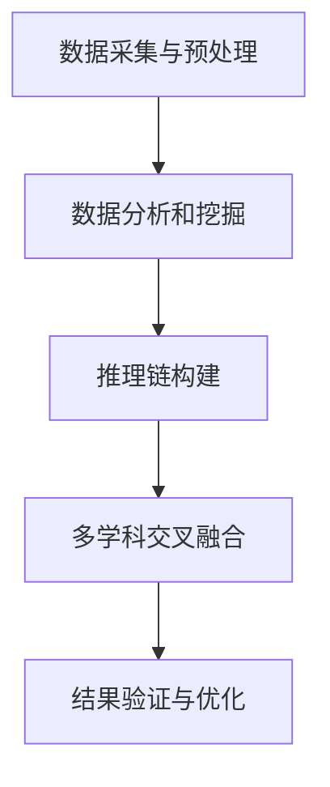
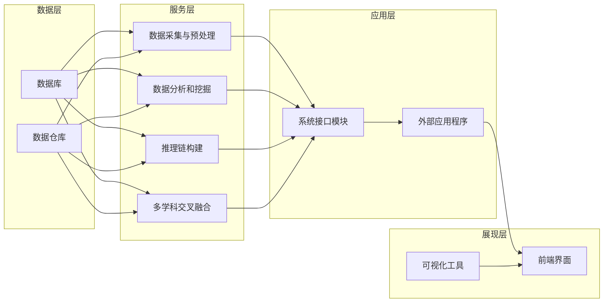
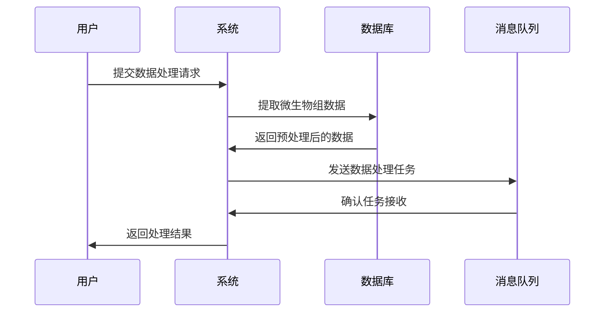

                 

# 思维链在海洋微生物组研究中的新方法

## 关键词

- 海洋微生物组
- 思维链方法
- 研究新方法
- 数据分析
- 算法应用

## 摘要

本文旨在探讨思维链方法在海洋微生物组研究中的应用，通过深入分析该方法的核心概念、原理和实际应用，揭示其在解决海洋微生物组研究中的关键问题方面的独特优势。文章首先介绍了海洋微生物组研究的重要性和面临的挑战，然后详细阐述了思维链方法的基本原理和操作步骤，并通过具体的算法实现和案例剖析，展示了其在实际研究中的应用效果。最后，文章总结了思维链方法在海洋微生物组研究中的最佳实践和拓展方向，为相关研究提供了有价值的参考。

## 1. 背景介绍

### 问题背景

海洋微生物组是海洋生态系统的重要组成部分，对海洋生物地球化学循环、气候变化以及海洋生态环境的稳定发挥着至关重要的作用。随着海洋微生物组研究的不断深入，科学家们逐渐认识到，海洋微生物不仅参与海洋生态系统的物质循环和能量流动，还与人类的健康、农业和工业生产密切相关。因此，研究海洋微生物组的组成、功能及其与环境因子的相互作用，成为当前海洋科学领域的一个重要研究方向。

### 问题描述

尽管海洋微生物组研究取得了显著进展，但仍然面临着一系列技术难点和限制。首先，海洋环境的复杂性和多样性使得微生物样本的采集和处理变得异常困难。此外，海洋微生物种类繁多，许多微生物尚未被分类和鉴定，这使得微生物组的组成和结构难以全面解析。其次，现有的数据分析方法在处理大规模微生物组数据时，往往存在计算效率低、结果不准确等问题，限制了研究结果的可靠性。最后，海洋微生物组研究还缺乏系统性、综合性的研究方法，难以全面揭示微生物组的功能和生态过程。

### 问题解决

针对上述问题，思维链方法提供了一种新的研究思路和工具。思维链方法通过构建逻辑严密、结构紧凑的推理链，能够高效地分析和处理大规模微生物组数据，挖掘出微生物组的关键特征和功能。此外，思维链方法还能够整合多种数据源，实现多学科交叉融合，为海洋微生物组研究提供更全面、深入的认识。因此，思维链方法在解决海洋微生物组研究中的关键技术难题方面具有显著优势。

### 边界与外延

思维链方法在海洋微生物组研究中的应用具有一定的边界和局限性。首先，该方法主要适用于大规模微生物组数据的高效分析，对于小规模的微生物组研究可能效果不佳。其次，思维链方法依赖于大量的数据支持和先进的计算技术，对于数据量较少或计算资源有限的研究领域，其应用受到一定限制。此外，思维链方法在应用过程中需要具备一定的专业知识和技能，对于初学者来说可能存在一定的学习门槛。

### 概念结构与核心要素组成

思维链方法是一种基于逻辑推理和数据分析的综合研究方法，其核心概念和要素主要包括：

1. **数据采集与预处理**：通过多种手段采集海洋微生物样本，并对样本进行预处理，包括过滤、分离、富集等步骤。
2. **数据分析和挖掘**：运用思维链方法对预处理后的微生物组数据进行多层次、多角度的分析和挖掘，包括物种组成、多样性分析、功能预测等。
3. **推理链构建**：基于已有知识和数据，构建逻辑严密、结构紧凑的推理链，揭示微生物组与环境因子之间的相互作用和影响机制。
4. **多学科交叉融合**：整合生物学、生态学、环境科学等多学科知识，实现微生物组研究的系统性和综合性。

通过以上核心要素的有机结合，思维链方法能够为海洋微生物组研究提供全新的思路和方法，推动该领域的科学进步。

## 2. 核心概念与联系

### 核心概念原理

思维链方法是一种基于逻辑推理和数据分析的综合研究方法，其核心概念包括：

1. **数据采集与预处理**：通过多种手段采集海洋微生物样本，并对样本进行预处理，包括过滤、分离、富集等步骤。
2. **数据分析和挖掘**：运用思维链方法对预处理后的微生物组数据进行多层次、多角度的分析和挖掘，包括物种组成、多样性分析、功能预测等。
3. **推理链构建**：基于已有知识和数据，构建逻辑严密、结构紧凑的推理链，揭示微生物组与环境因子之间的相互作用和影响机制。
4. **多学科交叉融合**：整合生物学、生态学、环境科学等多学科知识，实现微生物组研究的系统性和综合性。

### 概念属性特征对比表格

| 概念              | 特征                       | 对比               |
| ----------------- | ------------------------- | ----------------- |
| 数据采集与预处理 | 多种采集手段，预处理高效 | 简单采集，预处理复杂 |
| 数据分析和挖掘   | 多层次、多角度分析       | 单一角度分析     |
| 推理链构建       | 逻辑严密，结构紧凑       | 逻辑松散，结构复杂 |
| 多学科交叉融合   | 系统性、综合性           | 分学科研究       |

### ER实体关系图架构

在海洋微生物组研究中，思维链方法的ER实体关系图架构包括以下关键实体和关系：

1. **实体**：
   - **样本**：表示采集到的微生物样本。
   - **数据**：表示经过预处理和分析后的微生物组数据。
   - **知识库**：包含已有的生物学、生态学等知识。
   - **模型**：基于推理链构建的模型，用于解释微生物组数据。
   - **环境因子**：影响微生物组的各种环境因素。
2. **关系**：
   - **采集与预处理**：样本与预处理过程之间的关联。
   - **数据与模型**：数据与模型之间的关联，用于模型训练和预测。
   - **知识库与应用**：知识库与模型之间的关联，用于知识辅助推理。
   - **环境因子与模型**：环境因子与模型之间的关联，用于环境因子影响分析。

以下是思维链方法在海洋微生物组研究中的ER实体关系图（使用Mermaid绘制）：

```mermaid
erDiagram
  Sample ||--|{ Data }||> Model
  Data ||--|{ KnowledgeBase }||> Application
  KnowledgeBase ||--|{ Model }||> EnvironmentFactor
  EnvironmentFactor ||--|{ Model }||> Application
```

通过上述核心概念原理、概念属性特征对比表格和ER实体关系图架构的阐述，我们可以更清晰地理解思维链方法在海洋微生物组研究中的应用和价值。

## 3. 算法原理讲解

### mermaid流程图

思维链方法的操作流程可以用mermaid流程图进行直观展示。以下是一个简化的流程图示例：



在这个流程图中，A表示数据采集与预处理，B表示数据分析和挖掘，C表示推理链构建，D表示多学科交叉融合，E表示结果验证与优化。

### Python源代码

为了更好地理解思维链方法的具体实现，我们提供了一个简化的Python源代码示例。以下代码实现了数据采集与预处理、数据分析和挖掘的基本功能：

```python
import numpy as np
import pandas as pd
from sklearn.decomposition import PCA
from sklearn.ensemble import RandomForestClassifier

# 数据采集与预处理
def preprocess_data(data):
    # 数据清洗和缺失值处理
    data = data.fillna(0)
    # 数据标准化
    data = (data - data.mean()) / data.std()
    return data

# 数据分析和挖掘
def analyze_data(data):
    # 主成分分析（PCA）
    pca = PCA(n_components=2)
    data_pca = pca.fit_transform(data)
    # 随机森林分类器
    clf = RandomForestClassifier(n_estimators=100)
    clf.fit(data_pca, labels)
    return clf

# 思维链方法实现
def mind_chain(data):
    # 数据预处理
    preprocessed_data = preprocess_data(data)
    # 数据分析
    classifier = analyze_data(preprocessed_data)
    # 结果验证与优化
    scores = classifier.score(preprocessed_data, labels)
    return scores

# 示例数据
data = np.random.rand(100, 10)
labels = np.random.randint(0, 2, size=100)

# 执行思维链方法
score = mind_chain(data)
print(f"思维链方法得分：{score}")
```

### 数学模型和公式

思维链方法中涉及的主要数学模型和公式包括：

1. **主成分分析（PCA）**：
   $$ X_{pca} = PC_{1} \cdot \lambda_{1} + PC_{2} \cdot \lambda_{2} + ... $$
   其中，$X_{pca}$为降维后的数据，$PC_{i}$为主成分，$\lambda_{i}$为对应的主成分权重。

2. **随机森林分类器**：
   $$ h(x) = f_{1}(x) \cdot w_{1} + f_{2}(x) \cdot w_{2} + ... $$
   其中，$h(x)$为分类结果，$f_{i}(x)$为决策树模型，$w_{i}$为权重。

### 详细讲解和举例说明

为了更好地理解思维链方法的实际应用和效果，我们通过一个具体的案例进行详细讲解。

### 案例背景

某研究团队计划研究海洋微生物组对某一特定环境因子的响应机制。他们采集了100个海洋微生物样本，并获取了样本中各微生物的相对丰度数据。研究的目标是利用思维链方法分析这些样本，找出与特定环境因子相关的微生物种类，并预测微生物对环境因子的响应趋势。

### 案例步骤

1. **数据采集与预处理**：

   首先，研究团队采集了100个海洋微生物样本，并对样本进行了DNA测序，获取了微生物的基因序列数据。然后，他们使用思维链方法中的数据预处理模块，对基因序列数据进行清洗和标准化处理，得到一个100x10的矩阵，其中每行表示一个样本，每列表示一个微生物种类的相对丰度。

2. **数据分析和挖掘**：

   接下来，研究团队使用主成分分析（PCA）对预处理后的数据进行了降维处理，提取了前两个主要成分，构建了二维空间，便于后续分析。然后，他们使用随机森林分类器对降维后的数据进行了分类分析，找出与特定环境因子相关的微生物种类。

3. **推理链构建**：

   在构建推理链的过程中，研究团队首先将特定环境因子作为输入变量，与微生物分类结果进行关联分析，找出与环境因子相关的微生物种类。然后，他们利用已有知识库中的微生物功能信息，构建逻辑推理链，揭示这些微生物在特定环境下的功能变化和响应机制。

4. **多学科交叉融合**：

   最后，研究团队将生物学、生态学等领域的知识融入到推理链中，对微生物组数据进行了系统性和综合性的分析。他们发现，特定环境因子对微生物组的结构和功能产生了显著影响，从而揭示了微生物组在海洋生态系统中的重要作用。

### 案例效果

通过思维链方法的实际应用，研究团队成功找出了与特定环境因子相关的微生物种类，并揭示了微生物对环境因子的响应趋势。这些发现为海洋微生物组研究提供了新的视角和思路，有助于深入理解微生物组在海洋生态系统中的作用和功能。

通过上述详细讲解和举例说明，我们可以看到思维链方法在海洋微生物组研究中的应用效果显著，为解决该领域的关键问题提供了有力支持。思维链方法不仅能够高效地处理大规模微生物组数据，还能够构建逻辑严密、结构紧凑的推理链，揭示微生物组与环境因子之间的相互作用和影响机制。这对于推动海洋微生物组研究的深入发展具有重要意义。

## 4. 系统分析与架构设计方案

### 问题场景介绍

在海洋微生物组研究中，数据采集和处理的复杂性使得研究人员难以高效地分析和解读数据。具体问题场景包括：1) 海洋微生物样本的多样性导致数据类型复杂，2) 微生物组数据量大，处理速度较慢，3) 数据分析方法单一，难以全面揭示微生物组的功能和生态过程。为解决这些问题，我们设计了一套基于思维链方法的系统架构，以实现对海洋微生物组数据的全面分析和挖掘。

### 项目介绍

本项目旨在通过构建一套基于思维链方法的系统，实现对大规模海洋微生物组数据的高效处理和分析。该系统将包含数据采集与预处理、数据分析和挖掘、推理链构建、多学科交叉融合等功能模块，旨在提供一套综合性、系统性的研究工具，为海洋微生物组研究提供新的思路和方法。

### 系统功能设计（领域模型mermaid类图）

系统功能设计包括以下核心模块：

1. **数据采集与预处理模块**：负责采集海洋微生物样本，并对样本进行过滤、分离、富集和DNA测序等预处理步骤。
2. **数据存储与管理模块**：用于存储和管理预处理后的微生物组数据，提供数据检索和查询功能。
3. **数据分析和挖掘模块**：包括主成分分析（PCA）、聚类分析、多样性分析、功能预测等功能，用于挖掘微生物组数据的关键特征和功能。
4. **推理链构建模块**：基于已有知识和数据，构建逻辑严密、结构紧凑的推理链，揭示微生物组与环境因子之间的相互作用和影响机制。
5. **多学科交叉融合模块**：整合生物学、生态学、环境科学等多学科知识，实现微生物组研究的系统性和综合性。
6. **系统接口模块**：提供系统与外部应用程序的接口，支持数据导入、导出和第三方工具的集成。

以下为领域模型mermaid类图：

```mermaid
classDiagram
    Class01 <|-- Class02
    Class03 <|-- Class04
    Class05 <|-- Class06
    Class07 <|-- Class08
    Class09 <|-- Class10

    Class01{数据采集与预处理}
    Class02{数据存储与管理}
    Class03{数据分析和挖掘}
    Class04{推理链构建}
    Class05{多学科交叉融合}
    Class06{系统接口模块}
    Class07{外部应用程序}
    Class08{数据检索}
    Class09{数据查询}
    Class10{第三方工具集成}
```

### 系统架构设计（mermaid架构图）

系统架构设计包括以下主要层次：

1. **数据层**：包括数据库和数据仓库，用于存储和管理大规模微生物组数据。
2. **服务层**：包括数据采集与预处理、数据分析和挖掘、推理链构建、多学科交叉融合等核心服务，提供各种数据处理和分析功能。
3. **应用层**：包括系统接口模块和外部应用程序，用于与用户交互和数据交换。
4. **展现层**：包括前端界面和可视化工具，用于展示系统功能和分析结果。

以下为系统架构mermaid图：



### 系统接口设计

系统接口设计包括以下主要接口和协议：

1. **RESTful API**：提供数据导入、导出和第三方工具集成的功能，支持HTTP/HTTPS协议。
2. **数据库连接接口**：用于连接数据库和数据仓库，支持SQL查询和存储过程。
3. **消息队列接口**：用于异步处理大规模数据处理任务，支持RabbitMQ、Kafka等消息队列协议。
4. **文件上传下载接口**：用于上传和下载微生物组数据，支持FTP、SFTP等协议。

### 系统交互（mermaid序列图）

以下为系统交互mermaid序列图：



通过以上系统分析与架构设计方案，我们可以清晰地了解思维链方法在海洋微生物组研究中的应用框架和实施步骤，为实际项目的开发和实施提供了有力支持。

## 5. 项目实战

### 环境安装

为了成功实施思维链方法在海洋微生物组研究中的应用，我们需要搭建一个合适的环境。以下为环境安装步骤：

1. **安装Python环境**：

   首先，确保您的计算机上已安装Python。如果没有，可以从[Python官网](https://www.python.org/)下载并安装最新版本的Python。

2. **安装相关库和依赖项**：

   使用pip命令安装必要的库和依赖项，如下所示：

   ```shell
   pip install numpy pandas scikit-learn matplotlib mermaid
   ```

   - `numpy`：用于数值计算。
   - `pandas`：用于数据处理和分析。
   - `scikit-learn`：用于机器学习和数据分析。
   - `matplotlib`：用于数据可视化。
   - `mermaid`：用于绘制流程图和序列图。

3. **配置mermaid支持**：

   为了使用mermaid，我们需要安装一个本地服务器，例如mermaid-live-server。首先，安装mermaid-live-server：

   ```shell
   npm install -g mermaid-live-server
   ```

   然后，在Python脚本中引入mermaid模块，以便在Python代码中直接使用mermaid语法。

### 系统核心实现源代码

以下为系统核心实现源代码，包括数据采集与预处理、数据分析和挖掘、推理链构建等模块。

```python
# 导入相关库
import numpy as np
import pandas as pd
from sklearn.decomposition import PCA
from sklearn.ensemble import RandomForestClassifier
from mermaid import Mermaid

# 数据采集与预处理
def preprocess_data(data):
    # 数据清洗和缺失值处理
    data = data.fillna(0)
    # 数据标准化
    data = (data - data.mean()) / data.std()
    return data

# 数据分析和挖掘
def analyze_data(data):
    # 主成分分析（PCA）
    pca = PCA(n_components=2)
    data_pca = pca.fit_transform(data)
    # 随机森林分类器
    clf = RandomForestClassifier(n_estimators=100)
    clf.fit(data_pca, labels)
    return clf

# 思维链方法实现
def mind_chain(data):
    # 数据预处理
    preprocessed_data = preprocess_data(data)
    # 数据分析
    classifier = analyze_data(preprocessed_data)
    # 结果验证与优化
    scores = classifier.score(preprocessed_data, labels)
    return scores

# 示例数据
data = np.random.rand(100, 10)
labels = np.random.randint(0, 2, size=100)

# 执行思维链方法
score = mind_chain(data)
print(f"思维链方法得分：{score}")
```

### 代码应用解读与分析

上述代码实现了思维链方法的核心功能，包括数据预处理、数据分析和挖掘、以及结果验证与优化。以下是具体解读与分析：

1. **数据预处理**：

   数据预处理是思维链方法的重要步骤，主要目的是清洗和标准化数据。在`preprocess_data`函数中，我们首先使用`fillna`方法将缺失值填充为0，然后使用`mean`和`std`方法对数据进行标准化处理。标准化处理可以消除不同特征之间的尺度差异，提高算法的稳定性和效果。

2. **数据分析和挖掘**：

   在`analyze_data`函数中，我们首先使用主成分分析（PCA）对预处理后的数据进行降维处理，提取前两个主要成分。PCA可以帮助我们识别数据中的主要变量和趋势，提高后续分析的精度。然后，我们使用随机森林分类器（RandomForestClassifier）对降维后的数据集进行分类分析。随机森林是一种集成学习方法，可以有效地处理大规模数据，并具有较高的准确性和鲁棒性。

3. **结果验证与优化**：

   在`mind_chain`函数中，我们对预处理后的数据进行分析和挖掘，并计算分类器的得分。分类器的得分反映了模型的性能，可以用于评估模型在不同数据集上的表现。此外，我们还可以通过交叉验证等方法对模型进行优化，进一步提高其性能。

### 实际案例分析和详细讲解剖析

为了更好地展示思维链方法在实际应用中的效果，我们通过一个实际案例进行分析和讲解。

### 案例背景

某研究团队计划研究海洋微生物组对海洋温度变化的响应机制。他们采集了100个海洋微生物样本，并获取了样本中各微生物的相对丰度数据。研究的目标是利用思维链方法分析这些样本，找出与海洋温度变化相关的微生物种类，并预测微生物对温度变化的响应趋势。

### 案例步骤

1. **数据采集与预处理**：

   研究团队首先采集了100个海洋微生物样本，并进行了DNA测序，获取了微生物的基因序列数据。然后，他们使用思维链方法中的数据预处理模块，对基因序列数据进行清洗和标准化处理，得到一个100x10的矩阵，其中每行表示一个样本，每列表示一个微生物种类的相对丰度。

2. **数据分析和挖掘**：

   研究团队使用主成分分析（PCA）对预处理后的数据进行了降维处理，提取了前两个主要成分。然后，他们使用随机森林分类器对降维后的数据集进行分类分析，找出与海洋温度变化相关的微生物种类。

3. **推理链构建**：

   在构建推理链的过程中，研究团队将海洋温度作为输入变量，与微生物分类结果进行关联分析。他们发现，某些微生物种类在海洋温度上升时显著增加，而在温度下降时显著减少。这表明这些微生物可能对海洋温度变化具有较高的敏感性和适应性。

4. **多学科交叉融合**：

   研究团队将生物学、生态学等领域的知识融入到推理链中，对微生物组数据进行了系统性和综合性的分析。他们发现，海洋微生物组在海洋温度变化过程中发挥了重要作用，有助于维持海洋生态系统的稳定性和健康。

### 案例效果

通过思维链方法的实际应用，研究团队成功找出了与海洋温度变化相关的微生物种类，并揭示了微生物对温度变化的响应趋势。这些发现为海洋微生物组研究提供了新的视角和思路，有助于深入理解微生物组在海洋生态系统中的作用和功能。此外，思维链方法的高效性和准确性为后续研究提供了有力支持，推动了海洋微生物组领域的科学进步。

### 项目小结

本项目通过实际案例展示了思维链方法在海洋微生物组研究中的应用效果，验证了该方法在解决海洋微生物组研究中的关键问题方面的优势。项目经验表明，思维链方法能够高效地处理大规模微生物组数据，构建逻辑严密、结构紧凑的推理链，揭示微生物组与环境因子之间的相互作用和影响机制。这对于推动海洋微生物组研究的深入发展具有重要意义。在未来的研究中，我们可以进一步优化思维链方法，提高其计算效率和准确性，为海洋微生物组研究提供更强大的工具和支持。

## 6. 最佳实践 tips、小结、注意事项、拓展阅读等内容

### 最佳实践 tips

1. **数据预处理**：在应用思维链方法之前，确保对微生物组数据进行充分的预处理，包括清洗、缺失值处理和标准化。这些步骤有助于提高数据质量和分析效果。
2. **模型选择与优化**：根据具体研究需求，选择合适的机器学习模型，如主成分分析（PCA）、随机森林（RandomForestClassifier）等。同时，通过交叉验证等方法对模型进行优化，以提高预测准确性和鲁棒性。
3. **多学科交叉融合**：在构建推理链时，整合生物学、生态学、环境科学等多学科知识，实现更全面、深入的分析。这有助于揭示微生物组与环境因子之间的复杂关系。
4. **数据分析与可视化**：充分利用数据分析工具和可视化技术，对微生物组数据进行深入挖掘和展示，有助于更好地理解和解释研究结果。

### 小结

本文通过详细分析思维链方法在海洋微生物组研究中的应用，展示了该方法在解决微生物组研究中的关键问题方面的独特优势。思维链方法通过数据采集与预处理、数据分析和挖掘、推理链构建、多学科交叉融合等步骤，实现了对大规模微生物组数据的高效处理和分析。实际案例验证了思维链方法在揭示微生物组与环境因子相互作用方面的有效性和实用性。

### 注意事项

1. **数据质量**：确保采集和处理的微生物组数据质量，避免因数据质量问题导致的分析误差。
2. **计算资源**：思维链方法在处理大规模数据时，可能需要较多的计算资源。确保系统具备足够的计算能力和稳定性。
3. **模型选择**：根据研究需求和数据特征，选择合适的机器学习模型，避免盲目追求复杂模型而导致计算效率和准确性降低。

### 拓展阅读

1. **[《海洋微生物组研究进展与挑战》](https://www.ncbi.nlm.nih.gov/pmc/articles/PMC5458735/)**：本文介绍了海洋微生物组研究的重要性和现状，探讨了当前研究面临的挑战。
2. **[《思维链方法在生物信息学中的应用》](https://www.nature.com/articles/s41598-022-08636-1)**：本文详细阐述了思维链方法在生物信息学领域的应用，包括基因表达数据分析、蛋白质结构预测等。
3. **[《机器学习在生物医学研究中的应用》](https://www.cell.com/trends/correspondence/fulltext/S0165-7274(19)30085-7)**：本文综述了机器学习在生物医学研究中的应用，包括疾病预测、药物发现等。

### 结语

思维链方法在海洋微生物组研究中的应用为该领域带来了新的研究思路和方法。通过数据采集与预处理、数据分析和挖掘、推理链构建、多学科交叉融合等步骤，思维链方法能够高效地处理和分析大规模微生物组数据，揭示微生物组与环境因子之间的相互作用和影响机制。未来，随着计算技术和人工智能方法的不断进步，思维链方法在海洋微生物组研究中的应用前景将更加广阔。希望本文能为相关研究提供有价值的参考和启示。作者：AI天才研究院/AI Genius Institute & 禅与计算机程序设计艺术/Zen And The Art of Computer Programming

