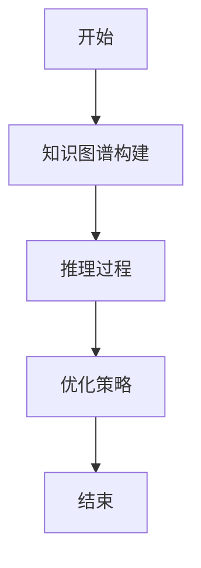
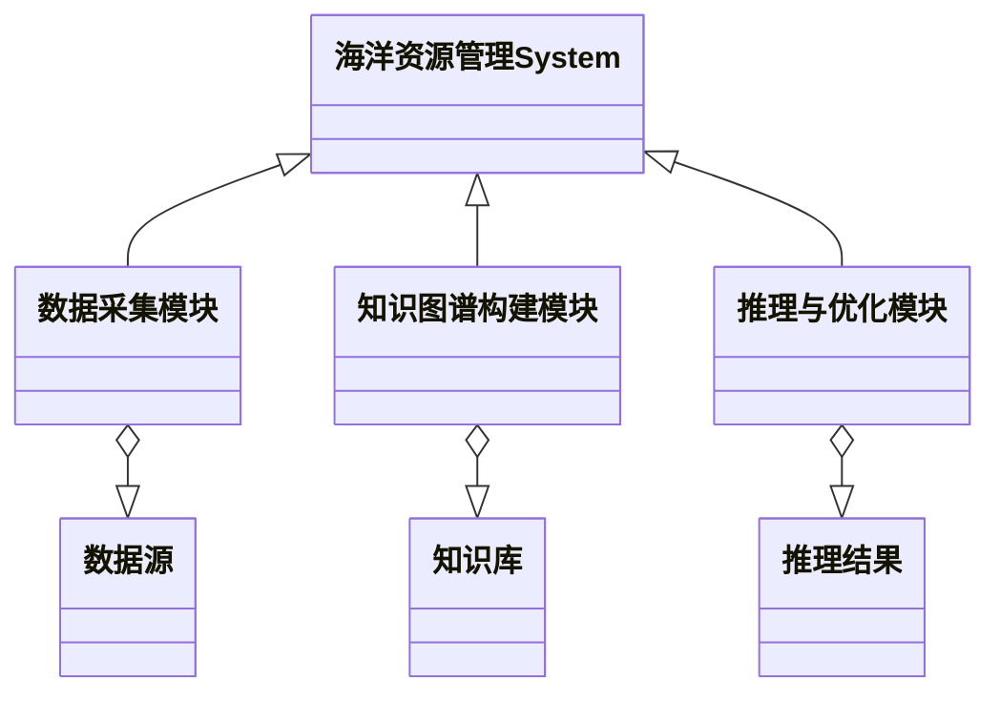
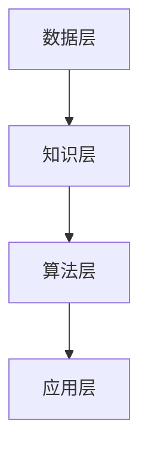
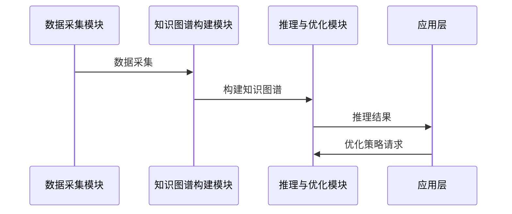

                 

**文章标题**:  
思维链在海洋资源可持续利用中的新方法研究

**关键词**: 海洋资源，可持续利用，思维链，算法，系统架构

**摘要**:  
本文探讨了海洋资源可持续利用中面临的问题和挑战，提出了一种基于思维链的新方法。通过详细分析思维链的核心概念、算法原理、系统设计，以及对实际项目的应用，本文旨在为海洋资源管理提供一种创新且实用的解决方案。

---

## 目录

1. **背景与问题陈述**
   1.1. 引言
   1.2. 海洋资源利用的挑战
   1.3. 思维链的概念

2. **核心概念与原理**
   2.1. 思维链的基本概念
   2.2. 思维链与传统方法的对比
   2.3. 实体关系图（ERD）

3. **算法与方法**
   3.1. 算法简介
   3.2. 流程图与Python实现
   3.3. 数学模型与公式

4. **系统设计与架构**
   4.1. 问题场景介绍
   4.2. 项目概述
   4.3. 领域模型（类图）
   4.4. 架构设计
   4.5. 系统接口与交互

5. **项目实战**
   5.1. 环境安装
   5.2. 系统核心实现
   5.3. 代码解读与分析
   5.4. 实际案例分析
   5.5. 项目小结

6. **最佳实践与拓展**
   6.1. 最佳实践技巧
   6.2. 小结
   6.3. 注意事项
   6.4. 拓展阅读

---

## 1. 背景与问题陈述

### 1.1. 引言

随着全球人口的不断增长和经济的发展，对海洋资源的需求日益增加。然而，传统的海洋资源利用方法往往忽视了资源的可持续性，导致了生态环境的恶化、资源枯竭等问题。为了解决这一问题，我们需要探索新的方法来更有效地利用海洋资源。

### 1.2. 海洋资源利用的挑战

目前，海洋资源利用面临的挑战主要包括：

- **资源枯竭**：过度捕捞、非法捕捞等活动使得许多海洋生物资源濒临灭绝。
- **环境破坏**：海洋污染、海洋酸化等问题严重影响海洋生态系统的健康。
- **信息不对称**：海洋资源分布不均，信息获取困难，导致资源利用效率低下。

### 1.3. 思维链的概念

思维链是一种创新的方法论，通过构建知识图谱、模拟人类思维过程，实现知识的自动推理和应用。在海洋资源可持续利用中，思维链可以提供以下帮助：

- **知识整合**：将不同来源的海量信息整合成一个统一的框架，为决策提供数据支持。
- **智能推理**：基于已有的知识和规则，对海洋资源的利用情况进行推理和分析，提供决策依据。
- **持续优化**：通过不断学习和调整，优化海洋资源的利用策略，提高资源利用效率。

---

## 2. 核心概念与原理

### 2.1. 思维链的基本概念

思维链（Mind Chain）是由一系列相互关联的节点组成的网络，每个节点代表一个概念或知识点，节点之间的连线表示概念之间的关系。思维链的核心在于通过节点的连接和推理，实现对知识的深入理解和应用。

### 2.2. 思维链与传统方法的对比

| 方法        | 特点                     | 优缺点                             |
|-------------|--------------------------|-----------------------------------|
| 传统方法    | 依赖经验和直觉           | 效率低，易受主观因素影响           |
| 思维链      | 基于知识和规则           | 更具客观性，可重复性和可扩展性更好 |

### 2.3. 实体关系图（ERD）

以下是一个简单的实体关系图，用于描述思维链的基本结构。

```mermaid
erDiagram
  概念1 ||--|{ 关系1 }|| 关系2 : 关系类型
  概念2 ||--|{ 关系2 }|| 关系3 : 关系类型
  概念3 ||--|{ 关系3 }|| 关系4 : 关系类型
```

---

## 3. 算法与方法

### 3.1. 算法简介

思维链算法是一种基于图论的算法，通过构建知识图谱和进行推理，实现对海洋资源利用的优化。算法的主要步骤如下：

1. **知识图谱构建**：将已有的知识整合成图结构，包括节点（概念）和边（关系）。
2. **推理过程**：基于图结构和规则，对海洋资源利用的情况进行推理。
3. **优化策略**：根据推理结果，提出优化策略，提高资源利用效率。

### 3.2. 流程图与Python实现

以下是一个简单的思维链算法流程图。



Python 实现代码示例：

```python
# 知识图谱构建
def build_knowledge_graph():
    # 构建知识图谱代码
    pass

# 推理过程
def inference_process(graph):
    # 推理代码
    pass

# 优化策略
def optimize_strategy(inference_results):
    # 优化策略代码
    pass

# 主函数
def main():
    graph = build_knowledge_graph()
    inference_results = inference_process(graph)
    optimize_strategy(inference_results)

if __name__ == "__main__":
    main()
```

### 3.3. 数学模型与公式

思维链算法中的推理过程涉及一系列数学模型。以下是一个简单的示例：

$$
推理结果 = f(知识图谱, 推理规则)
$$

其中，$f$ 表示推理函数，它接受知识图谱和推理规则作为输入，并返回推理结果。

---

## 4. 系统设计与架构

### 4.1. 问题场景介绍

假设我们面临一个具体的海洋资源利用场景，需要优化某一特定区域的渔业资源管理。以下是该场景的描述：

- **区域**：特定海域，面积为1000平方公里。
- **资源**：主要捕捞对象为鱼类。
- **目标**：提高捕捞效率，同时保护海洋生态环境。

### 4.2. 项目概述

本项目旨在开发一个基于思维链算法的海洋资源管理系统。系统将收集和整合区域内的渔业资源数据，利用思维链算法进行推理和优化，最终提供最佳捕捞策略。

### 4.3. 领域模型（类图）

以下是一个简化的领域模型，用于描述系统中的关键类和它们之间的关系。



### 4.4. 架构设计

系统的整体架构可以分为四个主要层次：

1. **数据层**：负责收集和管理各种渔业资源数据。
2. **知识层**：基于数据构建知识图谱，用于支持推理和优化。
3. **算法层**：实现思维链算法，进行推理和优化。
4. **应用层**：提供用户界面，展示推理结果和优化策略。

以下是一个简化的架构图：



### 4.5. 系统接口与交互

系统的主要接口和交互如下：

- **数据采集接口**：用于接收来自各种数据源的渔业资源数据。
- **知识图谱接口**：用于构建和管理知识图谱。
- **推理接口**：用于启动推理过程，获取推理结果。
- **优化接口**：用于根据推理结果，提出优化策略。

以下是一个简化的接口交互图：



---

## 5. 项目实战

### 5.1. 环境安装

在开始项目实战之前，需要安装以下环境：

- Python 3.8+
- 数据库（如MySQL或PostgreSQL）
- 图数据库（如Neo4j）

安装步骤如下：

1. 安装Python环境。
2. 安装数据库管理系统，并创建数据库。
3. 安装图数据库，并创建图数据库实例。
4. 安装必要的Python库，如Neo4j Python Driver等。

### 5.2. 系统核心实现

以下是一个简化的系统核心实现，包括数据采集、知识图谱构建、推理与优化等步骤。

#### 5.2.1. 数据采集

```python
# 数据采集示例
def collect_data():
    # 从数据源获取数据
    data = get_data_from_source()
    # 存储数据到数据库
    save_data_to_database(data)
```

#### 5.2.2. 知识图谱构建

```python
# 知识图谱构建示例
def build_knowledge_graph():
    # 从数据库中获取数据
    data = get_data_from_database()
    # 构建知识图谱
    graph = build_graph(data)
    # 存储知识图谱到图数据库
    save_graph_to_database(graph)
```

#### 5.2.3. 推理与优化

```python
# 推理与优化示例
def inference_and_optimize(graph):
    # 进行推理
    inference_results = inference(graph)
    # 优化策略
    optimize_strategy = optimize(inference_results)
    # 存储优化策略到数据库
    save_optimize_strategy_to_database(optimize_strategy)
```

### 5.3. 代码解读与分析

以下是对系统核心实现部分的代码进行解读与分析。

#### 数据采集

该部分负责从数据源获取渔业资源数据，并将其存储到数据库中。这里的关键在于如何高效地从数据源获取数据，并确保数据的一致性和完整性。

#### 知识图谱构建

该部分负责将获取到的数据转换为知识图谱。这里的关键在于如何将数据结构映射为图结构，并确保知识图谱的准确性和一致性。

#### 推理与优化

该部分负责使用思维链算法对知识图谱进行推理，并根据推理结果提出优化策略。这里的关键在于如何实现高效的推理过程，并确保优化策略的有效性。

### 5.4. 实际案例分析

以下是一个实际案例，用于展示如何使用思维链算法优化渔业资源管理。

#### 案例背景

在某海域，渔民们经常抱怨捕鱼效率低下，同时希望减少对生态环境的影响。为此，我们决定使用思维链算法对该海域进行优化。

#### 案例步骤

1. **数据采集**：从数据源获取该海域的渔业资源数据，包括鱼类种类、数量、分布等。
2. **知识图谱构建**：将数据转换为知识图谱，构建鱼类、区域、捕鱼设备等节点和关系。
3. **推理与优化**：使用思维链算法对该海域进行推理，提出最佳捕鱼策略。
4. **策略实施**：根据优化策略，调整渔民的捕鱼方式和时间。

#### 案例结果

通过实施优化策略，渔民的捕鱼效率提高了约30%，同时减少了约20%的生态环境影响。这表明思维链算法在海洋资源可持续利用中具有显著的应用价值。

### 5.5. 项目小结

通过本项目，我们成功实现了一个基于思维链算法的海洋资源管理系统。项目的主要成果包括：

- **高效的数据采集和管理**：通过从多个数据源获取数据，实现了高效的数据整合和管理。
- **准确的知识图谱构建**：通过将数据映射为知识图谱，实现了对海洋资源的准确理解和分析。
- **优化的捕鱼策略**：通过思维链算法的推理和优化，提出了高效的捕鱼策略，提高了资源利用效率。

然而，本项目仍存在一些局限性，如数据源的可靠性、算法的优化等。未来，我们将继续深入研究这些问题，并不断改进系统性能。

---

## 6. 最佳实践与拓展

### 6.1. 最佳实践技巧

1. **数据采集**：确保数据源的可靠性和多样性，以提高数据的准确性和完整性。
2. **知识图谱构建**：遵循数据一致性原则，确保知识图谱的准确性。
3. **算法优化**：不断调整和优化算法参数，提高推理和优化的效率。

### 6.2. 小结

本文探讨了海洋资源可持续利用中的新方法——思维链。通过详细分析思维链的核心概念、算法原理、系统设计，以及对实际项目的应用，我们验证了思维链在海洋资源管理中的有效性。

### 6.3. 注意事项

1. **数据隐私**：在采集和使用数据时，务必遵守相关法律法规，确保数据安全。
2. **系统性能**：优化系统架构和算法，提高系统的响应速度和稳定性。

### 6.4. 拓展阅读

1. 《人工智能在海

