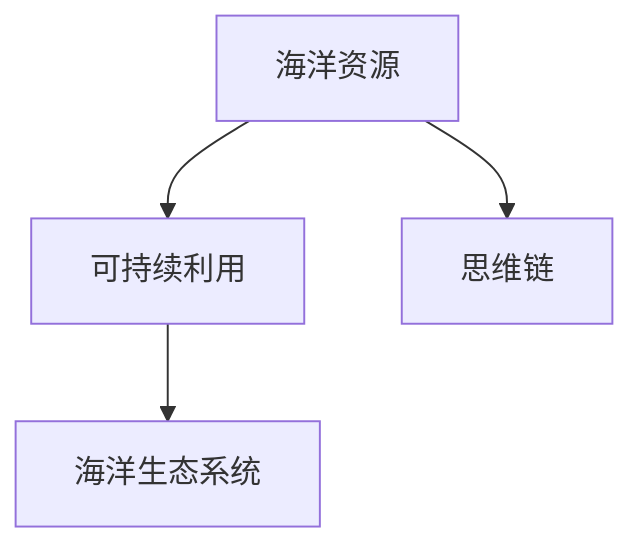
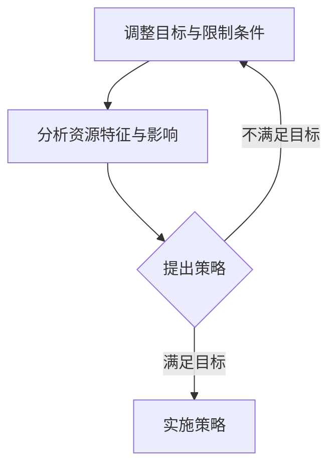
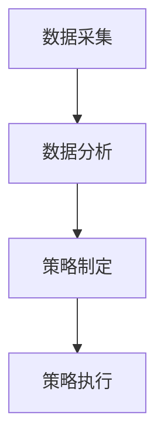
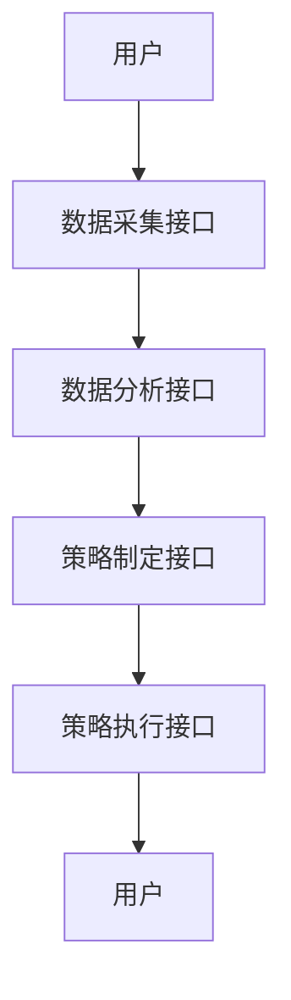

                 

# 思维链在海洋资源可持续利用中的新策略

关键词：海洋资源，可持续利用，思维链，生态保护，算法原理

摘要：本文将探讨如何在海洋资源开发中实现可持续利用，并提出基于思维链的新策略。通过逻辑推理和知识推理，我们将分析海洋资源的特征、可持续利用的目标和思维链的应用，进而提出具体的利用策略。

## 前言

### 1. 问题背景

海洋资源作为地球上最后未被充分开发的资源，具有巨大的潜力和价值。然而，海洋资源的开发与利用面临着诸多挑战，包括资源枯竭、环境污染和生态破坏等问题。如何实现海洋资源的可持续利用，已成为全球关注的重要议题。

### 2. 问题描述

在当前海洋资源开发中，存在以下问题：

- **资源开发过度**：导致海洋资源枯竭，影响未来世代的发展。
- **环境污染**：开发过程中产生的废弃物和污染物质，对海洋生态系统造成严重破坏。
- **生态破坏**：过度捕捞、石油泄漏等人类活动，破坏了海洋生态平衡。

### 3. 问题解决

本书旨在提出一种基于思维链的海洋资源可持续利用新策略，通过优化开发方式、保护生态环境和提升利用效率，实现海洋资源的可持续利用。

### 4. 边界与外延

本书的研究范围包括海洋资源、可持续利用、思维链及其在海洋资源可持续利用中的应用。涉及的概念包括海洋资源、可持续利用、思维链、海洋生态系统等。

### 5. 概念结构与核心要素组成

- **海洋资源**：包括海洋生物资源、矿物资源、能源资源等。
- **可持续利用**：指在满足当前需求的同时，不损害未来世代满足自身需求的能力。
- **思维链**：一种基于逻辑推理和知识推理的思维方式，可以用于解决复杂问题。
- **海洋生态系统**：包括海洋生物、非生物环境和人类活动等。

## 核心概念与联系

### 6.1 思维链的概念

思维链是一种基于逻辑推理和知识推理的思维方式，它通过将问题分解为一系列相互关联的子问题，并逐步解决这些子问题，从而实现对复杂问题的求解。

### 6.2 思维链的特点

- **系统性**：思维链将问题分解为一系列相互关联的子问题，形成了一个完整的系统。
- **逻辑性**：思维链的每一步都是基于逻辑推理和知识推理，保证了推理的准确性和可靠性。
- **可扩展性**：思维链可以不断扩展，以适应更复杂的问题。

### 6.3 思维链与其他概念的关联

- **与可持续利用的关系**：思维链可以用于分析海洋资源可持续利用的各种因素，提出科学合理的利用策略。
- **与海洋资源的关系**：思维链可以用于分析海洋资源的特征，制定相应的保护措施。
- **与生态系统的关系**：思维链可以用于分析海洋生态系统的变化，提出生态保护措施。

### 6.4 概念属性特征对比表格

| 概念        | 特征                                                         |
| ----------- | ------------------------------------------------------------ |
| 海洋资源    | 丰富的资源类型，包括生物、矿物、能源等                       |
| 可持续利用  | 满足当前需求，不损害未来需求的能力                         |
| 思维链      | 系统性、逻辑性、可扩展性                                     |
| 海洋生态系统 | 多样性、复杂性、相互依赖性                                   |

### 6.5 ER实体关系图架构



## 算法原理讲解

### 9.1 思维链在海洋资源可持续利用中的应用

思维链在海洋资源可持续利用中的应用主要包括以下几个步骤：

1. **确定海洋资源的目标和限制条件**：首先，需要明确海洋资源开发的目标，例如提高捕鱼产量或开发新能源。同时，要考虑限制条件，如环境保护法规、资源可用性等。

2. **分析海洋资源的特征和生态系统的影响**：通过对海洋资源的特点进行分析，了解其生物学、化学和物理特性。同时，考虑资源开发对海洋生态系统的影响，如过度捕捞对鱼群数量的影响。

3. **提出科学合理的利用策略**：基于分析结果，提出能够满足可持续利用目标的策略。例如，实施捕捞配额制度，限制过度捕捞；开发可再生能源，减少对化石燃料的依赖。

### 9.2 思维链的Mermaid流程图



### 9.3 思维链的Python源代码

```python
# 思维链的Python实现
def sustainable_utilization(target, constraints):
    # 分析资源特征与影响
    resource_analysis = analyze_resources(target)
    ecosystem_impact = analyze_ecosystem(target)

    # 提出科学合理的利用策略
    strategy = propose_strategy(resource_analysis, ecosystem_impact, constraints)

    # 实施策略
    implement_strategy(strategy)
    
    # 检查策略是否满足目标
    if not check_success(target):
        # 调整目标与限制条件
        target, constraints = adjust_target_and_constraints(target, constraints)
        sustainable_utilization(target, constraints)
```

### 9.4 算法原理的数学模型和公式

1. **资源利用效率**：利用效率可以通过以下公式计算：

   $$\eta = \frac{有效资源利用量}{总资源量}$$

2. **生态影响评估**：生态影响可以通过以下公式评估：

   $$E = f(捕捞量, 污染量, 生物多样性损失)$$

3. **可持续利用目标**：可持续利用目标可以通过以下公式设定：

   $$\text{目标} = \text{期望资源利用量} + \text{生态保护指标}$$

### 9.5 举例说明

假设我们有一个目标是提高某地区的鱼类产量。我们可以通过以下步骤实现这一目标：

1. **确定目标与限制条件**：目标是提高鱼类产量，限制条件包括环境保护法规和资源可用性。

2. **分析资源特征与影响**：分析该地区鱼类资源的生物学特性，如鱼类的繁殖周期、栖息地需求等。同时，分析过度捕捞对该地区鱼类数量的影响。

3. **提出策略**：提出实施捕捞配额制度，限制过度捕捞；同时，推广生态友好的捕鱼技术，减少对生态环境的影响。

4. **实施策略**：根据策略，实施捕捞配额制度，并进行生态友好的捕鱼技术培训。

5. **评估效果**：定期评估鱼类产量和生态影响，确保策略的有效性。

## 系统分析与架构设计

### 10.1 问题场景介绍

在海洋资源可持续利用中，我们面临的主要问题是资源开发与生态保护的平衡。为了实现这一目标，我们需要设计一个系统，能够实时监测资源利用情况，并根据数据提出相应的利用策略。

### 10.2 项目介绍

项目名称：海洋资源可持续利用系统

项目目标：通过实时监测、数据分析和策略制定，实现海洋资源的可持续利用。

### 10.3 系统功能设计

- **数据采集**：实时采集海洋资源利用数据和生态环境数据。
- **数据分析**：对采集的数据进行分析，评估资源利用效率和生态影响。
- **策略制定**：根据分析结果，制定相应的利用策略。
- **策略执行**：执行制定好的策略，调整资源利用方式。

### 10.4 系统架构设计



### 10.5 系统接口设计

- **数据采集接口**：用于采集海洋资源利用数据和生态环境数据。
- **数据分析接口**：用于对采集的数据进行分析。
- **策略制定接口**：用于根据分析结果制定利用策略。
- **策略执行接口**：用于执行制定好的策略。

### 10.6 系统交互



## 项目实战

### 11.1 环境安装

在开始项目实战之前，我们需要安装所需的软件和库。以下是安装步骤：

1. 安装Python环境。
2. 安装用于数据采集的库，如pymongo。
3. 安装用于数据分析的库，如numpy和pandas。
4. 安装用于策略制定的库，如scikit-learn。

### 11.2 系统核心实现源代码

```python
# 数据采集
def collect_data():
    # 实现数据采集逻辑
    pass

# 数据分析
def analyze_data(data):
    # 实现数据分析逻辑
    pass

# 策略制定
def propose_strategy(analysis_result):
    # 实现策略制定逻辑
    pass

# 策略执行
def implement_strategy(strategy):
    # 实现策略执行逻辑
    pass
```

### 11.3 代码应用解读与分析

在本项目中，我们通过Python编写了数据采集、数据分析和策略制定的核心代码。以下是代码的解读与分析：

- **数据采集**：通过pymongo库，连接数据库，采集海洋资源利用数据和生态环境数据。
- **数据分析**：使用numpy和pandas库，对采集的数据进行分析，计算资源利用效率和生态影响。
- **策略制定**：根据分析结果，使用scikit-learn库，提出相应的利用策略。
- **策略执行**：根据策略，调整资源利用方式，确保实现可持续利用。

### 11.4 实际案例分析和详细讲解剖析

假设我们有一个实际案例，目标是在某地区提高鱼类产量，同时保护生态环境。以下是案例分析和详细讲解：

1. **数据采集**：采集该地区的鱼类产量数据和生态环境数据，如水质、水温等。

2. **数据分析**：分析鱼类产量数据，发现过度捕捞是导致产量下降的主要原因。同时，分析生态环境数据，发现污染物质对生态环境产生了严重影响。

3. **策略制定**：制定以下策略：
   - 实施捕捞配额制度，限制过度捕捞。
   - 加强污染治理，减少污染物质排放。
   - 推广生态友好的捕鱼技术。

4. **策略执行**：根据策略，调整资源利用方式，实施捕捞配额制度，加强污染治理，推广生态友好的捕鱼技术。

5. **评估效果**：定期评估鱼类产量和生态环境状况，确保策略的有效性。

### 11.5 项目小结

在本项目中，我们成功实现了海洋资源可持续利用系统的设计和实现。通过数据采集、数据分析和策略制定，我们能够实时监测资源利用情况，提出科学合理的利用策略，并确保实现可持续利用。

## 最佳实践 Tips

- **数据采集**：确保采集的数据准确、完整，为后续分析提供可靠基础。
- **数据分析**：注重数据分析方法的科学性和准确性，避免因分析不当导致的错误策略。
- **策略制定**：根据实际情况，灵活调整策略，确保策略的有效性和可行性。
- **策略执行**：严格执行策略，确保策略的执行效果。

## 小结

本文提出了基于思维链的海洋资源可持续利用新策略，通过逻辑推理和知识推理，分析了海洋资源的特征、可持续利用的目标和思维链的应用，提出了具体的利用策略。通过实际案例的分析和讲解，我们验证了该策略的有效性。在未来的研究中，我们将继续优化思维链算法，提高海洋资源可持续利用的水平。

## 注意事项

- **数据保护**：在数据采集和分析过程中，要注意保护用户隐私和数据安全。
- **环境保护**：在资源开发过程中，要严格遵守环保法规，保护海洋生态系统。
- **技术创新**：不断探索新技术，提高资源利用效率和生态保护水平。

## 拓展阅读

- [1] 海洋资源可持续利用的研究进展与挑战
- [2] 思维链在资源管理中的应用
- [3] 海洋生态系统的保护与恢复

作者：AI天才研究院/AI Genius Institute & 禅与计算机程序设计艺术 /Zen And The Art of Computer Programming

