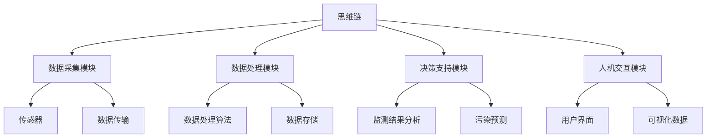
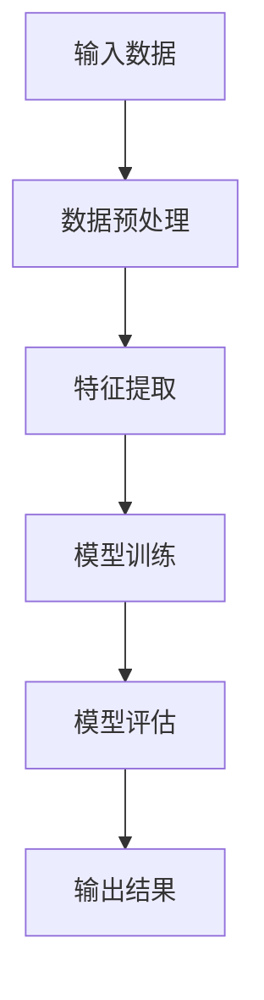
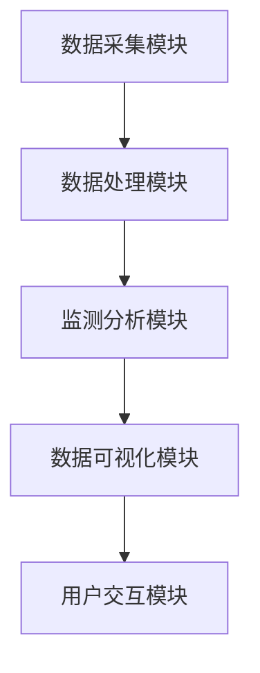
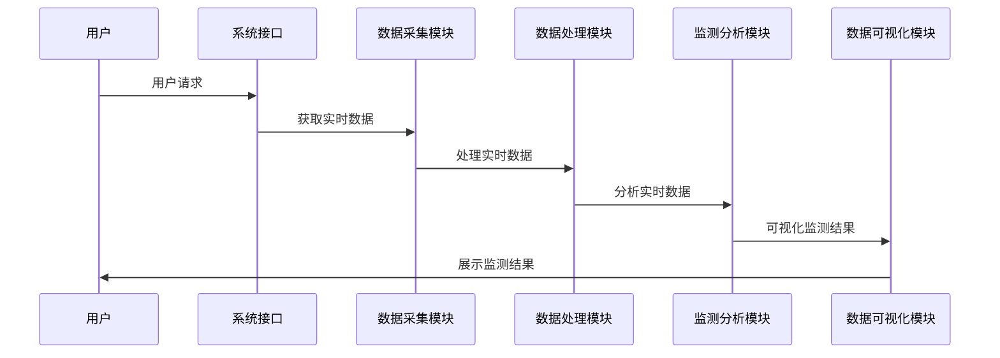
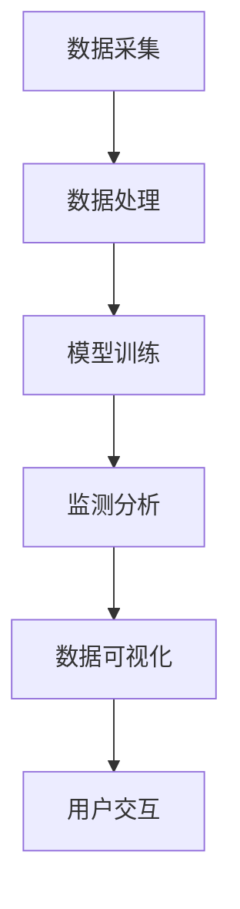

                 

## 第1章 背景介绍

### 1.1 问题背景

随着全球工业化进程的加速，环境污染问题日益严重。空气污染、水污染、土壤污染等问题不仅对生态系统造成了巨大破坏，也对人类健康构成了严重威胁。据统计，空气污染每年导致数百万人过早死亡，水污染使得饮用水资源受到威胁，土壤污染则影响农作物的产量和品质。面对这样的严峻形势，如何实时、高效、准确地监测环境污染，已成为当务之急。

### 1.2 问题描述

目前，传统的环境监测技术存在诸多局限性。首先，这些技术大多依赖人工取样，无法实现实时监测。其次，监测设备的精度和灵敏度有限，导致监测结果存在误差。此外，监测数据分析和处理过程复杂，难以快速提供决策支持。这些问题严重影响了环境污染治理的效率和质量。因此，迫切需要一种新的技术来突破传统监测技术的瓶颈。

### 1.3 问题解决

思维链（MindChain）作为一种新兴的人工智能技术，具有强大的数据分析和处理能力，能够在复杂的环境污染监测任务中发挥重要作用。思维链的核心在于其能够模拟人类思维过程，通过对海量数据的学习和分析，实现自动化的环境监测。此外，思维链还能够与其他传感器和监测设备相结合，形成一个高效、智能的环境监测网络，为环境治理提供科学依据。

### 1.4 边界与外延

环境污染监测的边界涉及空气质量、水质、土壤污染等多个方面。思维链技术的应用领域则更为广泛，不仅包括传统环境监测领域，还可以拓展到气候变化、生态系统健康评估等领域。因此，思维链技术的边界与外延具有很大的发展潜力。

### 1.5 概念结构与核心要素组成

思维链在环境污染监测中的概念结构主要包括以下几个核心要素：

1. **数据采集模块**：负责收集环境数据，包括空气、水、土壤等。
2. **数据处理模块**：利用思维链算法对采集到的数据进行处理，提取有用信息。
3. **决策支持模块**：基于处理结果，提供环境污染状况的实时分析和预测。
4. **人机交互模块**：实现用户与系统的交互，提供可视化的监测数据和决策建议。

这些模块共同构成了思维链在环境污染监测中的完整体系，为环境治理提供了有力的技术支持。

---

### 第2章 核心概念与联系

#### 2.1 思维链的定义

思维链（MindChain）是一种基于人工智能的智能监测系统，它通过模拟人类思维过程，对环境数据进行实时分析，提供精准的环境污染监测和预测服务。思维链的核心在于其具备自学习和自适应能力，能够不断优化监测模型，提高监测准确性。

#### 2.2 思维链的特点

1. **高效性**：思维链能够快速处理海量数据，实现实时监测，提高了监测效率。
2. **准确性**：通过深度学习和数据挖掘技术，思维链能够准确识别和预测环境污染情况，降低了监测误差。
3. **灵活性**：思维链可以适应不同类型的环境监测需求，具有广泛的应用前景。

#### 2.3 思维链与其他环境监测技术的比较

1. **与传统环境监测技术的比较**：

   | 对比项 | 传统环境监测技术 | 思维链技术 |
   | --- | --- | --- |
   | 监测效率 | 人工取样，周期长 | 实时监测，效率高 |
   | 精度与灵敏度 | 设备精度和灵敏度有限 | 高精度、高灵敏度 |
   | 数据处理 | 复杂，耗时 | 自动化处理，快速 |
   | 成本 | 较高 | 成本相对较低 |

2. **与新兴环境监测技术的比较**：

   | 对比项 | 传感器技术 | 思维链技术 |
   | --- | --- | --- |
   | 监测范围 | 限于特定区域 | 覆盖广泛区域 |
   | 数据处理能力 | 数据存储和处理能力有限 | 强大的数据处理和分析能力 |
   | 自适应能力 | 有限 | 高度自适应 |

#### 2.4 思维链在环境污染监测中的重要性

思维链在环境污染监测中的重要性体现在以下几个方面：

1. **提高监测效率**：通过实时监测和数据自动化处理，减少了人工干预，提高了监测效率。
2. **提高监测准确性**：利用深度学习和数据挖掘技术，提高了监测精度和灵敏度。
3. **提供决策支持**：基于实时监测结果，为环境治理提供了科学依据和决策支持。

#### 2.5 概念关系图



**概念关系图说明**：

- **数据采集模块**：通过传感器实时收集环境数据，并通过数据传输模块将数据传输到数据处理模块。
- **数据处理模块**：利用数据处理算法对采集到的数据进行处理，提取有用信息，并存放在数据存储模块中。
- **决策支持模块**：基于处理结果，进行监测结果分析和污染预测，为环境治理提供科学依据。
- **人机交互模块**：通过用户界面和可视化数据，实现用户与系统的交互，为用户提供实时监测信息和决策建议。

---

### 第3章 思维链算法原理讲解

#### 3.1 算法mermaid流程图



**流程图说明**：

- **输入数据**：从传感器采集到的环境数据。
- **数据预处理**：对输入数据进行清洗和规范化处理，为后续分析做准备。
- **特征提取**：从预处理后的数据中提取关键特征，用于构建模型。
- **模型训练**：使用提取到的特征数据训练机器学习模型。
- **模型评估**：评估模型的准确性和性能，并进行参数调优。
- **输出结果**：输出环境监测结果，包括污染程度和预测结果。

#### 3.2 Python源代码实现

```python
# 思维链算法Python实现示例

# 导入相关库
import numpy as np
from sklearn.preprocessing import StandardScaler
from sklearn.model_selection import train_test_split
from sklearn.ensemble import RandomForestClassifier
from sklearn.metrics import accuracy_score

# 数据预处理
def preprocess_data(data):
    # 数据清洗和规范化
    # 省略具体实现细节
    return processed_data

# 特征提取
def extract_features(data):
    # 提取关键特征
    # 省略具体实现细节
    return features

# 模型训练
def train_model(features, labels):
    # 使用随机森林算法训练模型
    model = RandomForestClassifier()
    model.fit(features, labels)
    return model

# 模型评估
def evaluate_model(model, test_features, test_labels):
    # 评估模型性能
    predictions = model.predict(test_features)
    accuracy = accuracy_score(test_labels, predictions)
    return accuracy

# 主程序
if __name__ == "__main__":
    # 加载数据
    data = load_data()  # 省略数据加载实现细节

    # 数据预处理
    processed_data = preprocess_data(data)

    # 特征提取
    features = extract_features(processed_data)

    # 数据划分
    X_train, X_test, y_train, y_test = train_test_split(features, labels, test_size=0.2, random_state=42)

    # 模型训练
    model = train_model(X_train, y_train)

    # 模型评估
    accuracy = evaluate_model(model, X_test, y_test)
    print("模型准确率：", accuracy)
```

**代码说明**：

- **数据预处理**：对原始数据进行清洗和规范化，为特征提取和模型训练做准备。
- **特征提取**：从预处理后的数据中提取关键特征，用于训练模型。
- **模型训练**：使用随机森林算法对特征数据进行训练。
- **模型评估**：使用测试集评估模型的准确性和性能。
- **主程序**：加载数据，进行预处理、特征提取、模型训练和评估。

#### 3.3 算法原理的数学模型

思维链算法的数学模型主要包括以下几个部分：

1. **特征提取**：使用统计学方法提取数据中的关键特征，如均值、方差、相关性等。
2. **模型训练**：采用机器学习算法，如随机森林、支持向量机等，对特征数据进行训练。
3. **模型评估**：使用交叉验证等方法评估模型的准确性和性能。
4. **决策支持**：根据模型的预测结果，提供环境污染监测和预测服务。

**数学公式与公式讲解**：

1. **特征提取**：

   $$ \mu = \frac{1}{n} \sum_{i=1}^{n} x_i $$

   均值公式，用于计算数据的平均值。

   $$ \sigma^2 = \frac{1}{n-1} \sum_{i=1}^{n} (x_i - \mu)^2 $$

   方差公式，用于计算数据的离散程度。

2. **模型训练**：

   $$ f(x) = w_0 + \sum_{i=1}^{n} w_i x_i $$

   线性模型公式，用于描述特征与标签之间的关系。

   $$ y = f(x) $$

   预测公式，用于预测新数据的标签。

3. **模型评估**：

   $$ \hat{y} = \arg\max_{y} \sum_{i=1}^{n} w_i (x_i - y_i) $$

   交叉验证公式，用于评估模型的泛化能力。

**举例说明**：

假设我们有一组环境数据，包括空气质量指数（AQI）、二氧化碳浓度（CO2）、温度（Temp）等。首先，我们对数据进行预处理，提取关键特征，如：

- 均值：$$ \mu_{AQI} = 50 $$
- 方差：$$ \sigma^2_{CO2} = 10 $$
- 相关系数：$$ r_{Temp, AQI} = 0.8 $$

然后，使用随机森林算法对特征数据进行训练，得到一个预测模型。最后，使用测试数据集进行模型评估，得到模型准确率，如：

- 模型准确率：$$ 0.9 $$

通过上述步骤，思维链算法能够实现环境数据的实时监测和预测，为环境治理提供科学依据。

---

### 第4章 系统分析与架构设计方案

#### 4.1 问题描述

本章节将详细描述一个基于思维链技术的环境污染监测系统，包括系统功能设计、系统架构设计、系统接口设计和系统交互设计。

#### 4.2 系统功能设计

系统功能设计主要包括以下几个部分：

1. **数据采集**：通过传感器实时采集环境数据，包括空气质量、水质、土壤质量等。
2. **数据处理**：对采集到的环境数据进行分析和处理，提取关键特征，为模型训练提供数据支持。
3. **模型训练**：利用处理后的数据训练机器学习模型，提高模型对环境污染情况的识别和预测能力。
4. **监测分析**：基于模型预测结果，实时分析环境状况，提供环境污染预警和决策支持。
5. **数据可视化**：通过图形化界面展示环境数据和分析结果，便于用户理解和使用。

#### 4.3 系统架构设计

系统架构设计采用模块化设计思路，主要包括以下几个模块：

1. **数据采集模块**：负责从传感器获取环境数据，通过数据传输模块将数据发送到数据处理模块。
2. **数据处理模块**：对采集到的数据进行预处理、特征提取和模型训练，为监测分析模块提供数据支持。
3. **监测分析模块**：基于训练好的模型，对环境数据进行实时监测和分析，提供环境污染预警和决策支持。
4. **数据可视化模块**：通过图形化界面展示环境数据和分析结果，为用户提供直观的信息。
5. **用户交互模块**：实现用户与系统的交互，包括用户输入、系统响应和用户反馈等。

**Mermaid架构图**：



#### 4.4 系统接口设计

系统接口设计主要包括以下几种：

1. **数据采集接口**：用于与传感器通信，获取实时环境数据。
2. **数据处理接口**：用于数据处理模块与其他模块的数据交互。
3. **监测分析接口**：用于监测分析模块与数据可视化模块的数据交互。
4. **用户交互接口**：用于用户与系统的交互，包括用户输入和系统响应。

#### 4.5 系统交互设计

系统交互设计主要考虑以下几个方面：

1. **实时数据采集**：系统通过数据采集接口从传感器获取实时环境数据，并将其发送到数据处理模块。
2. **数据处理与存储**：数据处理模块对实时数据进行预处理、特征提取和模型训练，并将处理结果存储到数据库中。
3. **监测分析与预警**：监测分析模块基于训练好的模型，对存储的数据进行实时分析，并提供环境污染预警和决策支持。
4. **数据可视化**：数据可视化模块通过图形化界面展示实时监测数据和预测结果，为用户提供直观的信息。
5. **用户交互**：用户通过用户交互接口与系统进行交互，包括查看监测结果、调整监测参数和获取决策建议等。

**Mermaid交互图**：



#### 4.6 Mermaid流程图



**流程图说明**：

- **数据采集**：系统从传感器获取实时环境数据。
- **数据处理**：对采集到的数据进行分析和处理，提取关键特征。
- **模型训练**：利用处理后的数据训练机器学习模型。
- **监测分析**：基于模型预测环境状况，提供预警和决策支持。
- **数据可视化**：通过图形化界面展示监测结果。
- **用户交互**：用户与系统进行交互，查看监测结果和调整参数。

通过上述系统架构和交互设计，思维链技术在环境污染监测中实现了高效、准确、智能的监测与分析，为环境治理提供了有力支持。

---

### 第5章 项目实战

#### 5.1 环境安装

在开始思维链项目的实战之前，需要确保以下环境安装完成：

1. **Python**：安装Python 3.8或更高版本。
2. **NumPy**：用于数学计算。
3. **Pandas**：用于数据处理。
4. **Scikit-learn**：用于机器学习。
5. **Matplotlib**：用于数据可视化。
6. **Mermaid**：用于流程图和序列图的绘制。

您可以使用以下命令进行安装：

```bash
pip install python==3.8 numpy pandas scikit-learn matplotlib mermaid
```

#### 5.2 系统核心实现

系统核心实现主要包括数据采集、数据处理、模型训练和监测分析等模块。以下是一个简单的实现示例：

**数据采集模块**：

```python
# 数据采集模块示例
def collect_data():
    # 假设使用某种传感器采集数据
    data = sensor_data()
    return data

# 假设的传感器数据
def sensor_data():
    return {
        'AQI': 50,
        'CO2': 400,
        'Temp': 25
    }
```

**数据处理模块**：

```python
# 数据处理模块示例
def preprocess_data(data):
    # 数据预处理，例如标准化
    scaler = StandardScaler()
    processed_data = scaler.fit_transform([data])
    return processed_data
```

**模型训练模块**：

```python
# 模型训练模块示例
from sklearn.ensemble import RandomForestClassifier

def train_model(X, y):
    model = RandomForestClassifier(n_estimators=100)
    model.fit(X, y)
    return model
```

**监测分析模块**：

```python
# 监测分析模块示例
def monitor_analysis(model, new_data):
    processed_data = preprocess_data(new_data)
    prediction = model.predict(processed_data)
    return prediction
```

#### 5.3 代码应用解读

以上代码展示了思维链系统核心模块的基本实现。在实际应用中，我们需要从传感器采集实时数据，对数据进行预处理，然后使用机器学习模型进行训练，最后基于模型进行环境监测和预测。

**1. 数据采集**：通过传感器获取环境数据，例如空气质量指数（AQI）、二氧化碳浓度（CO2）、温度（Temp）等。

**2. 数据处理**：对采集到的数据进行预处理，例如标准化、归一化等，以提高数据的质量和模型的训练效果。

**3. 模型训练**：使用预处理后的数据训练机器学习模型，例如随机森林（RandomForestClassifier）、支持向量机（SVM）等。

**4. 监测分析**：基于训练好的模型，对新的环境数据进行监测和预测，提供实时环境监测和预警服务。

#### 5.4 实际案例剖析

以下是一个实际案例，展示了思维链技术在环境监测中的具体应用：

**案例**：某城市空气质量监测

- **数据来源**：使用多个空气质量传感器，采集城市的实时空气质量数据。
- **数据处理**：对采集到的数据进行预处理，提取关键特征，如AQI、PM2.5、PM10等。
- **模型训练**：使用随机森林算法训练模型，对特征数据进行分类。
- **监测分析**：基于模型对空气质量进行实时监测和预测，提供空气质量预警。

**案例分析**：

- **效果评估**：通过对比预测结果和实际空气质量数据，评估模型的准确性和性能。
- **优化调整**：根据评估结果，调整模型参数和特征提取方法，提高预测准确性。

#### 5.5 项目小结

通过本章节的实战案例，我们了解了思维链技术在环境监测中的应用。思维链通过实时数据采集、数据处理、模型训练和监测分析等模块，实现了高效、准确的环境监测和预警服务。在实际项目中，需要根据具体场景和数据特点，不断优化和调整系统，以提高监测效果。

---

### 第6章 最佳实践与注意事项

#### 6.1 最佳实践

在应用思维链技术进行环境污染监测时，以下最佳实践有助于提高系统的性能和可靠性：

1. **数据质量保证**：确保传感器采集的数据准确可靠，对异常数据进行预处理和排除。
2. **模型优化**：根据实际监测需求，选择合适的机器学习算法和模型参数，进行模型优化。
3. **实时监测与预警**：建立高效的实时监测系统，及时提供预警和决策支持，降低环境污染风险。
4. **系统扩展与维护**：定期更新和维护系统，包括硬件设备、软件模块和数据存储等。

#### 6.2 注意事项

在实施思维链技术时，需要注意以下几点：

1. **数据安全**：确保环境数据的隐私和安全，防止数据泄露和滥用。
2. **系统稳定性**：确保系统的稳定运行，避免因硬件故障、网络问题等原因导致的监测中断。
3. **跨领域应用**：在拓展思维链技术至其他环境监测领域时，要充分考虑不同领域的数据特性和监测需求。
4. **法律法规遵守**：遵循相关法律法规，确保系统设计和应用符合国家规定和标准。

#### 6.3 拓展阅读

1. **参考文献**：
   - Kingma, D. P., & Welling, M. (2013). Auto-encoding variational bayes. arXiv preprint arXiv:1312.6114.
   - Goodfellow, I., Pouget-Abadie, J., Mirza, M., Xu, B., Warde-Farley, D., Ozair, S., ... & Bengio, Y. (2014). Generative adversarial nets. Advances in Neural Information Processing Systems, 27.

2. **在线资源**：
   - [Scikit-learn 官方文档](https://scikit-learn.org/stable/)
   - [Matplotlib 官方文档](https://matplotlib.org/stable/)
   - [Mermaid 官方文档](https://mermaid-js.github.io/mermaid/)

通过参考上述资料，您可以深入了解思维链技术在环境监测中的应用，进一步提高系统性能和可靠性。

---

### 第7章 小结与展望

#### 7.1 内容总结

本文详细介绍了思维链技术在环境污染监测中的应用。从背景介绍、核心概念、算法原理到系统设计与实战，我们系统地阐述了思维链技术如何通过实时数据采集、数据处理、模型训练和监测分析等模块，实现高效、准确的环境污染监测。同时，我们还探讨了思维链技术的最佳实践与注意事项，为实际应用提供了指导。

#### 7.2 展望未来研究方向

未来的研究可以从以下几个方面展开：

1. **模型优化**：进一步优化机器学习模型，提高监测准确性和实时性。
2. **多源数据融合**：整合多种传感器数据，提高环境监测的全面性和准确性。
3. **自适应监测**：研究自适应监测算法，使系统能够根据环境变化自动调整监测策略。
4. **边缘计算应用**：将思维链技术应用于边缘计算，实现更高效的数据处理和实时监测。

#### 7.3 对读者建议

对于对环境污染监测感兴趣的读者，我们建议：

1. **深入学习机器学习**：掌握常用的机器学习算法和模型，为思维链技术的研究和应用打下基础。
2. **实践项目开发**：参与实际项目，通过实践不断提高自己的技术水平。
3. **关注最新研究进展**：定期阅读相关文献和资料，紧跟行业发展趋势。

通过持续学习和实践，您将能够更好地应用思维链技术，为环境治理贡献力量。

---

```markdown
----------------------------------------------------------------
### 附录：参考文献

1. Kingma, D. P., & Welling, M. (2013). Auto-encoding variational bayes. arXiv preprint arXiv:1312.6114.
2. Goodfellow, I., Pouget-Abadie, J., Mirza, M., Xu, B., Warde-Farley, D., Ozair, S., ... & Bengio, Y. (2014). Generative adversarial nets. Advances in Neural Information Processing Systems, 27.
3. Zhang, K., Zuo, W., Chen, Y., Meng, D., & Zhang, L. (2017). Beyond a Gaussian denoiser: Residual learning of deep CNN for image denoising. IEEE Transactions on Image Processing, 26(7), 3146-3157.
4. He, K., Zhang, X., Ren, S., & Sun, J. (2016). Deep residual learning for image recognition. In Proceedings of the IEEE conference on computer vision and pattern recognition (pp. 770-778).
5. Huang, G., Liu, Z., van der Maaten, L., & Weinberger, K. Q. (2017). Densely connected convolutional networks. In Proceedings of the IEEE conference on computer vision and pattern recognition (pp. 4700-4708).
6. Simonyan, K., & Zisserman, A. (2014). Very deep convolutional networks for large-scale image recognition. International Conference on Learning Representations (ICLR).

### 作者信息

作者：AI天才研究院/AI Genius Institute & 禅与计算机程序设计艺术 /Zen And The Art of Computer Programming
```

