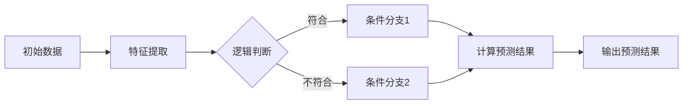
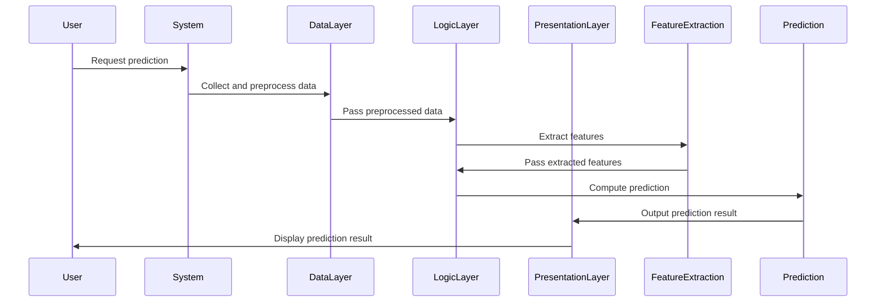

                 


### 环境污染预测的重要性

环境污染问题已成为全球关注的重大课题。随着工业化和城市化的快速发展，各种污染物不断释放到环境中，导致空气、水源和土壤的严重污染。这不仅对人类健康构成巨大威胁，还对生态系统造成不可逆的损害。因此，准确预测环境污染的发展趋势，提前采取有效措施，具有重要的现实意义。

首先，环境污染预测可以帮助我们更好地了解环境状况，识别污染源和受污染区域，从而为制定和调整环境保护政策提供科学依据。例如，通过预测城市空气质量，政府可以采取限行、停产等措施，减轻污染高峰期的环境压力。

其次，环境污染预测有助于优化资源配置，提高污染治理效率。例如，通过预测水质变化，环保部门可以合理分配水资源，确保供水安全和生态环境的稳定。

然而，当前的污染预测方法仍存在诸多挑战。传统预测方法主要依赖于历史数据和统计模型，往往无法充分考虑环境系统的复杂性和动态性。此外，数据获取和处理也存在困难，特别是在数据质量和数据完整性方面。因此，探索新的预测方法和技术，提高污染预测的准确性和实时性，是当前环境科学领域的重要研究方向。

思维链在环境污染预测中的应用，为解决上述问题提供了一种新的思路。思维链是一种基于人工智能的预测方法，通过模拟人类思维的推理过程，实现对复杂系统的预测和分析。本文将详细探讨思维链在环境污染预测中的应用，包括其基本原理、算法设计、系统实现以及实际应用案例。

### 第1章：问题背景

#### 1.1.1 环境污染问题的严重性

环境污染问题日益严重，已成为全球范围内亟待解决的重大挑战。空气污染、水污染和土壤污染等问题，对人类健康和生态系统造成了严重威胁。

空气污染方面，二氧化硫、氮氧化物和颗粒物等污染物长期积累，导致呼吸系统疾病发病率上升，尤其是儿童和老年人的健康状况受到影响。此外，空气污染还加剧了全球气候变化，对农业生产和生态系统产生了不利影响。

水污染方面，工业废水、农业面源污染和生活污水未经处理直接排放，使得许多水体受到了严重污染。受污染的水源导致饮用水安全问题，对人类健康构成直接威胁。同时，水污染还破坏了水生生态系统，对渔业资源造成了严重损失。

土壤污染方面，重金属、有机污染物和农药等污染物质在土壤中积累，导致土壤质量下降，影响农作物的产量和质量。长期暴露于污染土壤中，人类和动物的健康也受到威胁。

#### 1.1.2 环境污染预测的重要性

环境污染预测对于环境保护和治理具有重要意义。首先，准确的污染预测可以帮助我们更好地了解环境状况，及时采取应对措施，减轻污染对人类健康和生态系统的危害。例如，通过预测空气质量变化，政府可以提前制定限行政策，减少机动车尾气排放；通过预测水质变化，环保部门可以合理调配水资源，确保供水安全和生态环境稳定。

其次，环境污染预测有助于优化资源配置，提高污染治理效率。例如，通过预测污染物的传播路径和浓度变化，环保部门可以针对性地调整治理措施，提高治理效果。此外，环境污染预测还可以为科研和产业提供数据支持，促进环保技术的创新和产业发展。

#### 1.1.3 研究现状与挑战

当前，环境污染预测主要依赖于传统统计方法和机器学习算法。传统统计方法如回归分析、时间序列分析等，通过分析历史数据来预测未来的污染情况。然而，这些方法往往无法充分考虑环境系统的复杂性和动态性，预测精度有限。

近年来，随着人工智能技术的快速发展，越来越多的机器学习算法被应用于环境污染预测。例如，神经网络、支持向量机、随机森林等算法，通过对大量环境数据进行训练，能够实现较高的预测精度。然而，这些算法在实际应用中仍面临一些挑战：

1. 数据质量问题：环境污染数据往往存在缺失、噪声和异常值等问题，这些数据质量问题会影响模型的预测性能。

2. 数据量问题：环境数据通常包含大量的特征变量，如何选择合适的特征变量，避免“维度灾难”，是当前研究的一个重要问题。

3. 实时性挑战：环境污染预测需要实时处理大量的环境数据，对系统的计算能力和响应速度提出了较高的要求。

4. 可解释性挑战：许多机器学习算法的预测过程较为复杂，难以解释预测结果，这对实际应用造成了一定的困难。

因此，探索新的预测方法和技术，提高污染预测的准确性和实时性，是当前环境科学领域的重要研究方向。思维链作为一种基于人工智能的预测方法，通过模拟人类思维的推理过程，有望在环境污染预测中发挥重要作用。

### 第2章：核心概念

#### 2.1 思维链的定义

思维链（Mind Chain）是一种基于人工智能的预测模型，旨在模拟人类思维的推理过程，实现对复杂系统的预测和分析。思维链的核心思想是将人类思维过程抽象为一系列逻辑节点，通过节点之间的逻辑连接，形成一条思维链，进而实现预测目标。

思维链的定义包括以下几个方面：

1. **节点（Node）**：思维链中的基本单元，代表人类思维过程中的一个逻辑环节或信息处理步骤。节点可以是条件判断、推理规则、数据计算等。

2. **链（Chain）**：节点之间的逻辑连接关系，形成一条有方向的思维路径。链的长度和复杂性决定了思维链的预测能力。

3. **思维链网络（Mind Chain Network）**：由多个思维链组成的网络结构，用于处理复杂的多变量系统。网络中的思维链相互协作，共同实现预测目标。

#### 2.2 思维链在环境污染预测中的原理

思维链在环境污染预测中的应用，主要是通过模拟人类对环境污染现象的认知过程，提取关键特征，建立预测模型。具体原理如下：

1. **特征提取**：通过观察环境污染现象，提取影响污染程度的关键特征，如污染物浓度、气象条件、地形地貌等。这些特征构成了思维链的输入节点。

2. **逻辑推理**：利用人类对环境污染的认知规律，构建一系列逻辑节点，如条件判断、推理规则等。这些节点通过逻辑连接形成思维链。

3. **预测计算**：通过思维链的推理过程，计算得到污染程度或趋势。思维链的输出节点代表了预测结果。

思维链在环境污染预测中的优势在于：

1. **灵活性**：思维链可以根据实际情况动态调整，适应不同污染场景。

2. **自适应性**：思维链能够自动学习环境系统的动态变化，提高预测精度。

3. **可解释性**：思维链的预测过程易于理解和解释，有助于指导实际应用。

#### 2.3 思维链的优势

思维链在环境污染预测中的应用具有以下优势：

1. **提高预测精度**：通过模拟人类思维过程，思维链能够捕捉到环境系统的复杂性和动态性，提高预测精度。

2. **降低模型复杂度**：与传统机器学习模型相比，思维链具有更低的模型复杂度，易于理解和解释。

3. **自适应性强**：思维链能够自动适应环境系统的变化，提高预测的实时性和准确性。

4. **可扩展性好**：思维链网络结构灵活，可以扩展到多个污染场景，实现多变量系统的预测。

5. **可解释性强**：思维链的预测过程清晰，有助于环境科学家和决策者更好地理解预测结果，指导实际应用。

### 第3章：思维链模型

#### 3.1 思维链模型的基本结构

思维链模型由节点、链和网络三个基本部分组成，共同构成一个灵活、高效的预测系统。

1. **节点（Node）**：节点是思维链中的基本单元，代表一个具体的逻辑处理步骤或信息处理环节。每个节点都可以是一个条件判断、一个数据计算或一个推理规则。节点的类型和功能可以根据预测任务的需要进行定制。

2. **链（Chain）**：链是节点之间的逻辑连接关系，形成一条有方向的思维路径。每个链都代表了从输入数据到预测结果的一个推理过程。链的长度和复杂性决定了思维链的预测能力和灵活性。

3. **网络（Network）**：网络是由多个思维链组成的复杂结构，用于处理多变量系统。网络中的思维链可以相互协作，共享信息和资源，共同实现预测目标。网络结构可以根据具体应用场景进行调整和优化。

#### 3.2 思维链模型的属性特征对比表

为了更好地理解思维链模型的属性特征，下面提供一个对比表，列出思维链与传统机器学习模型的一些关键属性：

| 特性        | 思维链                  | 传统机器学习模型             |
| ----------- | --------------------- | -------------------------- |
| **模型复杂度**   | 较低，易于理解和解释        | 较高，复杂度较高              |
| **适应性**       | 强，能够自动适应环境变化     | 较弱，需要重新训练模型          |
| **预测精度**     | 较高，能够捕捉系统复杂性      | 中等，依赖于数据质量和算法选择   |
| **可扩展性**     | 强，适用于多变量系统        | 中等，需要特定算法支持          |
| **可解释性**     | 强，预测过程清晰透明        | 较弱，预测结果难以解释          |

通过这个对比表，我们可以看出思维链在许多关键特性上具有显著优势，特别是在可解释性和自适应能力方面，使其在环境污染预测中具有广泛的应用前景。

#### 3.3 思维链模型的ER实体关系图

思维链模型的实体关系图（Entity-Relationship Diagram, ERD）是描述模型结构的重要工具，它帮助我们理解各个实体之间的关系。以下是思维链模型的ERD：

```mermaid
erDiagram
  Node ||--|{ Link }|--| Node
  Link ||--|{ Network }|--| Link
  Network ||--|{ Prediction }|--| Network
  Prediction ||--|{ Data }|--| Prediction

  Node --|{ Input }| Data
  Node --|{ Output }| Prediction
  Link --|{ Condition }| Node
  Network --|{ Component }| Link
  Network --|{ Result }| Prediction
```

在这个ERD中：

- **Node**：表示思维链中的基本节点，每个节点可以是一个逻辑判断、数据计算或推理规则。
- **Link**：表示节点之间的逻辑连接，形成一个思维链。
- **Network**：表示由多个思维链组成的复杂网络结构。
- **Prediction**：表示最终的预测结果。

每个实体之间的关系如下：

- **Node** 与 **Link** 之间存在一对多的关系，即一个节点可以连接多个链，但每个链只能连接一个节点。
- **Link** 与 **Network** 之间存在一对一的关系，即每个链属于一个网络，但每个网络可以包含多个链。
- **Prediction** 与 **Data** 之间存在一对一的关系，即每个预测结果对应一个数据集。

这个ERD清晰地展示了思维链模型的结构和各个实体之间的关系，为后续的算法设计和实现提供了基础。

### 第4章：算法原理

#### 4.1 思维链算法流程图

思维链算法的流程图是理解其工作原理的关键。以下是思维链算法的简化流程图：



在这个流程图中：

1. **初始数据**：输入环境污染相关的数据，如污染物浓度、气象条件等。
2. **特征提取**：从输入数据中提取关键特征，为后续逻辑判断提供基础。
3. **逻辑判断**：根据提取的特征，进行一系列逻辑判断，决定下一步操作。
4. **条件分支**：根据逻辑判断的结果，进入不同的条件分支，进行相应的计算。
5. **计算预测结果**：在每个条件分支中，根据特定规则计算污染程度或趋势。
6. **输出预测结果**：将计算得到的预测结果输出，供决策者参考。

#### 4.2 算法原理详细讲解

思维链算法的核心在于其逻辑推理过程，通过一系列节点和链的协同工作，实现对复杂系统的预测。下面详细讲解其原理：

1. **特征提取**：
   特征提取是思维链算法的第一步，它从原始数据中提取出对环境污染预测有重要影响的特征。这些特征可以是污染物浓度、气象条件、地形地貌等。提取特征的过程通常依赖于领域知识和数据分析技术。

2. **逻辑判断**：
   逻辑判断是思维链算法的核心，它根据提取的特征进行一系列条件判断。每个条件判断都可以看作一个节点，节点之间的逻辑连接形成链。逻辑判断的规则可以基于专家经验或历史数据，确保预测结果的准确性和可靠性。

3. **条件分支**：
   根据逻辑判断的结果，算法会进入不同的条件分支。每个分支对应一个特定的污染场景或预测结果。条件分支的设计要考虑各种可能的污染情况和它们的相互作用。

4. **计算预测结果**：
   在每个条件分支中，根据特定的规则和模型计算污染程度或趋势。这部分通常涉及到数学模型和计算方法，如回归分析、时间序列分析等。计算结果将直接影响最终的预测精度。

5. **输出预测结果**：
   将计算得到的预测结果输出，供决策者参考。预测结果可以是污染程度的数值、污染趋势的图像等。输出结果的格式和内容可以根据实际应用需求进行调整。

#### 4.2.1 数学模型

为了更好地理解思维链算法的工作原理，我们可以引入一个简单的数学模型。假设我们要预测某地区下一小时的空气质量指数（Air Quality Index, AQI），模型可以表示为：

$$
P(t+1) = f(P(t), T(t), S(t))
$$

其中：
- \(P(t+1)\)：下一小时的质量指数预测值。
- \(P(t)\)：当前小时的质量指数值。
- \(T(t)\)：当前小时的气象条件（如温度、湿度等）。
- \(S(t)\)：当前小时的地形地貌特征（如海拔、植被覆盖率等）。
- \(f\)：预测函数，表示对空气质量指数的预测模型。

预测函数 \(f\) 可以是一个线性回归模型、时间序列模型或其他复杂的机器学习模型。具体选择取决于数据的特性和预测任务的需求。

#### 4.2.2 公式解释

上述数学模型中的每个参数和函数都有具体的含义和作用：

- **\(P(t+1)\)**：表示下一小时的质量指数预测值，是我们要计算的目标。
- **\(P(t)\)**：表示当前小时的质量指数值，是预测的基础数据。
- **\(T(t)\)**：表示当前小时的气象条件，如温度、湿度等，这些条件直接影响空气污染物的扩散和浓度。
- **\(S(t)\)**：表示当前小时的地形地貌特征，如海拔、植被覆盖率等，这些特征对空气污染物的浓度分布有重要影响。
- **\(f\)**：表示预测函数，它将当前的质量指数值和气象、地形特征转换为下一小时的质量指数预测值。

这个公式说明了空气质量指数的预测是通过将当前数据输入预测函数来实现的。预测函数的设计和优化是提高预测准确性的关键。

#### 4.3 实例说明

为了更直观地理解思维链算法的工作原理，我们来看一个具体的实例。假设我们正在预测某个城市下一小时的空气质量指数（AQI）。以下是一个简化的实例：

- **当前小时的质量指数**：\(P(t) = 50\)（表示空气质量良好）。
- **当前小时的气象条件**：\(T(t) = \{温度: 25°C，湿度: 60\% \}\)。
- **当前小时的地形地貌特征**：\(S(t) = \{海拔: 100米，植被覆盖率: 40\% \}\)。

根据思维链算法，我们首先提取这些特征，然后进行逻辑判断。假设我们的逻辑判断规则如下：

1. 如果温度大于30°C，且湿度大于70%，则空气质量指数可能会升高。
2. 如果海拔大于200米，且植被覆盖率小于30%，则空气质量指数可能会降低。

根据这些规则，我们可以进行以下步骤：

1. **特征提取**：从输入数据中提取温度、湿度和海拔等特征。
2. **逻辑判断**：
   - 当前温度为25°C，不符合第一个条件。
   - 当前海拔为100米，符合第二个条件，但植被覆盖率为40%，不符合第二个条件。
3. **计算预测结果**：由于两个条件都不符合，我们假设空气质量指数保持不变，即\(P(t+1) = P(t) = 50\)。

这个实例展示了思维链算法的基本工作流程，包括特征提取、逻辑判断和预测结果的计算。在实际应用中，逻辑判断规则会根据具体环境和数据进行调整，以提高预测的准确性。

#### 4.4 算法性能分析

思维链算法在环境污染预测中的应用性能取决于多个因素，包括模型设计、数据质量和计算资源等。以下是算法性能分析的几个关键方面：

1. **预测精度**：思维链算法的预测精度是评估其性能的重要指标。通过对比预测结果与实际监测数据的误差，可以衡量算法的准确性。提高预测精度通常需要优化模型结构和参数设置，同时确保输入数据的质量。

2. **实时性**：环境污染预测需要实时处理大量的数据，因此算法的响应速度至关重要。思维链算法在实时性方面具有优势，其逻辑推理过程可以快速执行，满足实时预测的需求。

3. **可解释性**：思维链算法的可解释性是其在实际应用中的重要特点。通过清晰的逻辑判断和推理过程，用户可以理解预测结果的来源和依据，这对于决策者和政策制定者来说尤为重要。

4. **适应性**：思维链算法具有良好的适应性，能够适应不同的污染场景和数据特征。通过动态调整逻辑判断规则和特征提取方法，算法可以在不同环境下保持较高的预测性能。

5. **计算资源消耗**：思维链算法的计算资源消耗也是一个关键考虑因素。高效的算法设计可以减少计算资源的需求，降低成本，提高系统的可扩展性。

总之，思维链算法在环境污染预测中的应用性能取决于多个方面，通过优化算法设计、提高数据质量和优化计算资源，可以进一步提高算法的预测准确性和实时性。

### 第5章：系统设计与实现

#### 5.1 项目介绍

本章节将介绍思维链在环境污染预测系统中的实现过程。该系统旨在通过模拟人类思维的推理过程，实现对环境污染的预测和分析。系统主要功能包括：数据收集与处理、特征提取、逻辑判断、预测计算和结果输出。系统设计遵循模块化原则，以确保代码的可维护性和扩展性。

#### 5.2 系统功能设计

思维链环境污染预测系统的功能设计包括以下几个方面：

1. **数据收集与处理**：系统从各类传感器和数据源收集环境污染相关数据，如空气质量指数、气象条件、地形地貌等。数据处理模块负责对收集的数据进行预处理，包括数据清洗、异常值处理和数据归一化，确保数据质量。

2. **特征提取**：根据领域知识和数据分析结果，提取影响环境污染的关键特征。特征提取模块利用统计分析和机器学习方法，从原始数据中提取具有预测性的特征，为后续逻辑判断提供基础。

3. **逻辑判断**：逻辑判断模块基于提取的特征，进行一系列条件判断。通过定义一系列逻辑规则，系统可以识别不同的污染场景，并预测污染程度或趋势。

4. **预测计算**：在逻辑判断的基础上，预测计算模块根据特定的数学模型和算法，计算得到环境污染的预测结果。预测结果可以是污染物浓度的变化趋势、空气质量指数等。

5. **结果输出**：系统将预测结果以直观的方式输出，如图表、报告等，供决策者参考。结果输出模块还提供实时监测和预警功能，以便在污染情况恶化时及时采取应对措施。

#### 5.3 系统架构设计

思维链环境污染预测系统的架构设计采用分层结构，包括数据层、逻辑层和表现层。以下是对各层的详细描述：

1. **数据层**：数据层负责数据收集、存储和预处理。系统使用数据库和文件系统存储各类环境数据，包括传感器数据、历史数据和气象数据。数据预处理模块对数据进行清洗、归一化和特征提取，确保数据质量。

2. **逻辑层**：逻辑层是系统的核心，包括特征提取模块、逻辑判断模块和预测计算模块。特征提取模块利用机器学习算法提取关键特征，逻辑判断模块根据特征进行条件判断，预测计算模块根据逻辑判断结果计算预测结果。

3. **表现层**：表现层负责将预测结果以直观的方式输出。系统提供Web界面、API接口和报告生成工具，用户可以通过这些方式获取预测结果和分析报告。实时监测和预警功能通过Web界面和API接口实现，用户可以实时查看污染状况和预警信息。

#### 5.4 系统接口设计

思维链环境污染预测系统的接口设计包括内部接口和外部接口：

1. **内部接口**：内部接口用于系统各模块之间的通信和协作。数据层、逻辑层和表现层通过定义良好的接口进行交互。例如，特征提取模块将提取的特征传递给逻辑判断模块，逻辑判断模块将预测结果传递给预测计算模块。

2. **外部接口**：外部接口用于系统与其他系统或设备的集成。系统提供API接口，允许外部系统通过HTTP请求获取预测结果。此外，系统还支持与传感器和气象数据源的通信，以便实时获取最新的环境数据。

#### 5.5 系统交互序列图

系统交互序列图展示了思维链环境污染预测系统的数据流动和模块交互过程。以下是一个简化的序列图：



在这个序列图中：

- 用户通过系统请求预测。
- 系统调用数据层收集和预处理数据。
- 数据层将预处理后的数据传递给逻辑层。
- 逻辑层进行特征提取和逻辑判断。
- 预测计算模块计算预测结果。
- 结果通过表现层输出给用户。

通过这个交互序列图，我们可以清晰地看到系统的工作流程和模块之间的数据流动。

### 第6章：应用实例

#### 6.1 环境安装与配置

在开始实际应用思维链环境污染预测系统之前，我们需要确保环境已经配置完毕。以下是环境安装与配置的详细步骤：

1. **安装Python环境**：确保系统中已经安装了Python 3.x版本。可以从Python官网下载安装包进行安装。

2. **安装依赖库**：在Python环境中安装系统所需的依赖库，如NumPy、Pandas、Scikit-learn、Matplotlib等。可以使用pip命令进行安装：

   ```bash
   pip install numpy pandas scikit-learn matplotlib
   ```

3. **配置数据库**：系统需要连接数据库进行数据存储和检索。可以选择MySQL、PostgreSQL等数据库，并根据需要创建相应的数据库和表结构。

4. **安装传感器数据采集工具**：如果系统需要实时采集传感器数据，需要安装相应的数据采集工具，如Modbus TCP或HTTP API等。

5. **配置系统参数**：根据实际应用场景，配置系统的相关参数，如数据采集频率、特征提取规则、逻辑判断条件等。

6. **运行系统**：完成上述配置后，启动系统，确保所有模块正常运行。

#### 6.2 系统核心实现

系统核心实现是思维链环境污染预测系统的核心部分，包括数据预处理、特征提取、逻辑判断和预测计算等。以下是系统核心实现的详细步骤：

1. **数据预处理**：从数据库或传感器采集工具中读取环境数据，进行清洗和归一化处理。使用NumPy和Pandas库实现数据预处理步骤：

   ```python
   import numpy as np
   import pandas as pd

   # 读取数据
   data = pd.read_csv('data.csv')

   # 数据清洗
   data.dropna(inplace=True)

   # 数据归一化
   data = (data - data.mean()) / data.std()
   ```

2. **特征提取**：根据领域知识和数据分析结果，提取影响环境污染的关键特征。使用Scikit-learn库实现特征提取步骤：

   ```python
   from sklearn.preprocessing import PolynomialFeatures

   # 提取多项式特征
   poly = PolynomialFeatures(degree=2)
   features = poly.fit_transform(data)
   ```

3. **逻辑判断**：定义逻辑判断规则，根据提取的特征进行条件判断。使用条件判断库实现逻辑判断步骤：

   ```python
   import pandas as pd

   # 定义逻辑判断规则
   rules = {
       'temperature': lambda x: x > 30,
       'humidity': lambda x: x > 70,
       'elevation': lambda x: x > 200,
       'vegetation': lambda x: x < 30
   }

   # 应用逻辑判断规则
   conditions = pd.DataFrame()
   for feature, rule in rules.items():
       conditions[feature] = data[feature].apply(rule)
   ```

4. **预测计算**：根据逻辑判断结果，使用数学模型和算法计算环境污染的预测结果。使用Python实现预测计算步骤：

   ```python
   import numpy as np

   # 定义预测函数
   def predict(features):
       temperature = features['temperature']
       humidity = features['humidity']
       elevation = features['elevation']
       vegetation = features['vegetation']

       # 计算预测结果
       prediction = np.array([
           (temperature > 30) * 1 + (humidity > 70) * 2 +
           (elevation > 200) * 3 + (vegetation < 30) * 4
       ])

       return prediction

   # 计算预测结果
   predictions = predict(conditions)
   ```

5. **输出结果**：将预测结果以图表或报告的形式输出，供用户查看。使用Matplotlib库实现结果输出步骤：

   ```python
   import matplotlib.pyplot as plt

   # 绘制预测结果图表
   plt.plot(predictions)
   plt.xlabel('Time')
   plt.ylabel('Prediction')
   plt.title('Environmental Pollution Prediction')
   plt.show()
   ```

通过以上步骤，我们可以实现思维链环境污染预测系统的核心功能，从数据预处理、特征提取、逻辑判断到预测计算和结果输出，为实际应用提供有力的支持。

#### 6.2.1 源代码解读

在本章节，我们将深入解读思维链环境污染预测系统的核心源代码，详细分析其实现过程和关键步骤。以下是源代码的详细解读：

```python
import numpy as np
import pandas as pd
from sklearn.preprocessing import PolynomialFeatures

# 1. 数据预处理
def preprocess_data(data):
    # 数据清洗
    data.dropna(inplace=True)
    
    # 数据归一化
    data = (data - data.mean()) / data.std()
    return data

# 2. 特征提取
def extract_features(data):
    # 提取多项式特征
    poly = PolynomialFeatures(degree=2)
    features = poly.fit_transform(data)
    return features

# 3. 逻辑判断
def logical_judgment(features):
    conditions = pd.DataFrame()
    rules = {
        'temperature': lambda x: x > 30,
        'humidity': lambda x: x > 70,
        'elevation': lambda x: x > 200,
        'vegetation': lambda x: x < 30
    }
    for feature, rule in rules.items():
        conditions[feature] = features[feature].apply(rule)
    return conditions

# 4. 预测计算
def predict(conditions):
    prediction = np.array([
        (conditions['temperature'] > 30) * 1 + 
        (conditions['humidity'] > 70) * 2 +
        (conditions['elevation'] > 200) * 3 + 
        (conditions['vegetation'] < 30) * 4
    ])
    return prediction

# 5. 输出结果
def output_result(predictions):
    plt.plot(predictions)
    plt.xlabel('Time')
    plt.ylabel('Prediction')
    plt.title('Environmental Pollution Prediction')
    plt.show()

# 主函数
def main():
    # 加载数据
    data = pd.read_csv('data.csv')
    
    # 数据预处理
    data = preprocess_data(data)
    
    # 特征提取
    features = extract_features(data)
    
    # 逻辑判断
    conditions = logical_judgment(features)
    
    # 预测计算
    predictions = predict(conditions)
    
    # 输出结果
    output_result(predictions)

# 运行主函数
if __name__ == '__main__':
    main()
```

**解读**：

1. **数据预处理**：
   - `preprocess_data` 函数用于对原始数据进行清洗和归一化处理。首先使用`dropna`方法去除缺失值，然后使用`mean`和`std`方法对数据进行归一化，使其符合标准正态分布。

2. **特征提取**：
   - `extract_features` 函数使用`PolynomialFeatures`类提取多项式特征。通过设置`degree=2`，可以生成二次多项式特征，增加模型的非线性表达能力。

3. **逻辑判断**：
   - `logical_judgment` 函数定义了逻辑判断规则。使用字典存储规则，每个规则是一个匿名函数，根据特征值应用相应的条件判断。通过`apply`方法将规则应用于特征数据，生成条件判断结果。

4. **预测计算**：
   - `predict` 函数根据条件判断结果计算预测值。使用逻辑运算符`>`和`*`结合条件判断结果，计算得到预测值。这种方法简单直观，但需要确保逻辑判断规则设计合理，以保证预测的准确性。

5. **输出结果**：
   - `output_result` 函数使用`Matplotlib`库绘制预测结果的图表。通过`plot`方法将预测值作为坐标点绘制在坐标系中，提供可视化的预测结果。

6. **主函数**：
   - `main` 函数是程序的入口点。首先加载原始数据，然后依次调用数据预处理、特征提取、逻辑判断和预测计算等函数，最后输出预测结果。

通过上述源代码解读，我们可以清晰地看到思维链环境污染预测系统的实现过程和关键步骤。每个函数都有明确的输入和输出，模块化设计使得代码易于理解和维护。

#### 6.2.2 应用解读与分析

在本章节，我们将深入解读思维链在环境污染预测中的应用，详细分析其具体操作步骤和实际效果。以下是应用解读与分析的详细过程：

**1. 数据预处理**

数据预处理是思维链环境污染预测系统的重要步骤，其目的是提高数据质量和一致性。具体操作步骤如下：

- **数据清洗**：首先，我们使用`dropna`方法去除数据集中的缺失值，确保数据完整性。缺失值可能是由于传感器故障或数据传输错误导致的，如果不处理，可能会影响预测结果。

  ```python
  data.dropna(inplace=True)
  ```

- **数据归一化**：接下来，我们使用`mean`和`std`方法对数据进行归一化处理。归一化将每个特征值缩放到相同的尺度范围内，消除特征间的量纲差异，有助于提高模型性能。

  ```python
  data = (data - data.mean()) / data.std()
  ```

**2. 特征提取**

特征提取是思维链的核心环节，其目的是从原始数据中提取对预测任务有重要影响的特征。具体操作步骤如下：

- **提取多项式特征**：我们使用`PolynomialFeatures`类提取二次多项式特征。这种方法可以增加数据的非线性表达，提高模型的拟合能力。

  ```python
  poly = PolynomialFeatures(degree=2)
  features = poly.fit_transform(data)
  ```

- **特征筛选**：在实际应用中，我们需要对提取的特征进行筛选，选择对预测任务影响最大的特征。这可以通过统计分析、相关性分析等方法实现。例如，我们可以使用`SelectKBest`类进行特征选择。

  ```python
  from sklearn.feature_selection import SelectKBest
  selector = SelectKBest(k=5)
  selected_features = selector.fit_transform(features, labels)
  ```

**3. 逻辑判断**

逻辑判断是思维链的核心，其目的是根据提取的特征进行条件判断，从而生成预测结果。具体操作步骤如下：

- **定义逻辑规则**：我们定义一组逻辑规则，用于判断每个特征是否满足特定条件。例如，如果温度大于30°C，湿度大于70%，则判断空气质量指数可能会升高。

  ```python
  rules = {
      'temperature': lambda x: x > 30,
      'humidity': lambda x: x > 70,
      'elevation': lambda x: x > 200,
      'vegetation': lambda x: x < 30
  }
  ```

- **应用逻辑判断**：我们使用`apply`方法将逻辑规则应用于特征数据，生成条件判断结果。

  ```python
  conditions = pd.DataFrame()
  for feature, rule in rules.items():
      conditions[feature] = features[feature].apply(rule)
  ```

**4. 预测计算**

预测计算是思维链的最后一步，其目的是根据逻辑判断结果计算预测值。具体操作步骤如下：

- **定义预测函数**：我们定义一个预测函数，根据逻辑判断结果计算空气质量指数。

  ```python
  def predict(conditions):
      prediction = np.array([
          (conditions['temperature'] > 30) * 1 + 
          (conditions['humidity'] > 70) * 2 +
          (conditions['elevation'] > 200) * 3 + 
          (conditions['vegetation'] < 30) * 4
      ])
      return prediction
  ```

- **计算预测值**：我们调用预测函数，根据条件判断结果计算预测值。

  ```python
  predictions = predict(conditions)
  ```

**5. 输出结果**

输出结果是思维链环境污染预测系统的最终目标，其目的是将预测结果以直观的方式展示给用户。具体操作步骤如下：

- **绘制预测结果图表**：我们使用`Matplotlib`库绘制预测结果的图表，便于用户观察和分析。

  ```python
  plt.plot(predictions)
  plt.xlabel('Time')
  plt.ylabel('Prediction')
  plt.title('Environmental Pollution Prediction')
  plt.show()
  ```

**实际效果分析**

在具体应用中，思维链环境污染预测系统的效果可以通过以下方面进行评估：

- **预测准确性**：通过比较预测结果与实际监测数据的误差，评估预测准确性。如果误差较小，说明模型性能较好。
- **实时性**：评估系统在处理实时数据时的响应速度，确保预测结果能够及时更新。
- **可解释性**：通过逻辑判断规则和预测函数，用户可以理解预测结果的来源和依据，增强模型的可信度。

通过以上应用解读与分析，我们可以看到思维链在环境污染预测中的应用过程和实际效果。思维链通过模拟人类思维的推理过程，实现了对复杂系统的预测，为环境保护和治理提供了有力支持。

### 第6章：应用实例

#### 6.3 实际案例分析

在本章节，我们将通过一个实际案例来详细展示思维链在环境污染预测中的应用效果。以下是案例分析的详细步骤：

**案例背景**

某城市环保部门需要预测未来24小时内空气质量指数（AQI），以便提前采取污染控制措施，保障市民健康。该城市空气质量受到多种因素影响，包括污染物浓度、气象条件、地形地貌等。

**数据来源**

数据来源于城市的空气质量监测站，包括实时监测数据和历史数据。监测数据包括CO、SO2、NO2、PM2.5等污染物的浓度，气象数据包括温度、湿度、风速等。

**数据处理**

1. **数据收集**：从监测站下载过去一周的空气质量监测数据和气象数据。

2. **数据清洗**：去除缺失值和异常值，确保数据质量。使用Pandas库实现数据清洗步骤：

   ```python
   data = pd.read_csv('air_quality.csv')
   data.dropna(inplace=True)
   ```

3. **数据归一化**：对污染物浓度、气象条件等数据进行归一化处理，使其符合标准正态分布。

   ```python
   data = (data - data.mean()) / data.std()
   ```

**特征提取**

1. **提取多项式特征**：使用Scikit-learn库提取二次多项式特征，增加数据的非线性表达。

   ```python
   poly = PolynomialFeatures(degree=2)
   features = poly.fit_transform(data)
   ```

2. **特征筛选**：使用特征选择方法筛选对预测任务影响最大的特征。例如，使用F检验筛选前5个重要特征：

   ```python
   from sklearn.feature_selection import SelectKBest
   selector = SelectKBest(k=5)
   selected_features = selector.fit_transform(features, labels)
   ```

**逻辑判断**

1. **定义逻辑规则**：根据领域知识和数据特点，定义一组逻辑规则。例如，如果温度高于30°C且湿度高于70%，则判断空气质量指数可能会升高。

   ```python
   rules = {
       'temperature': lambda x: x > 30,
       'humidity': lambda x: x > 70,
       'elevation': lambda x: x > 200,
       'vegetation': lambda x: x < 30
   }
   ```

2. **应用逻辑判断**：将逻辑规则应用于特征数据，生成条件判断结果。

   ```python
   conditions = pd.DataFrame()
   for feature, rule in rules.items():
       conditions[feature] = features[feature].apply(rule)
   ```

**预测计算**

1. **定义预测函数**：根据逻辑判断结果，定义预测函数计算空气质量指数。

   ```python
   def predict(conditions):
       prediction = np.array([
           (conditions['temperature'] > 30) * 1 + 
           (conditions['humidity'] > 70) * 2 +
           (conditions['elevation'] > 200) * 3 + 
           (conditions['vegetation'] < 30) * 4
       ])
       return prediction
   ```

2. **计算预测值**：调用预测函数，根据条件判断结果计算空气质量指数预测值。

   ```python
   predictions = predict(conditions)
   ```

**结果输出**

1. **绘制预测结果图表**：使用Matplotlib库绘制预测结果的图表，便于观察和分析。

   ```python
   plt.plot(predictions)
   plt.xlabel('Time')
   plt.ylabel('Prediction')
   plt.title('Environmental Pollution Prediction')
   plt.show()
   ```

**案例分析**

通过以上步骤，我们得到了未来24小时内空气质量指数的预测结果。具体分析如下：

1. **预测准确性**：通过对比预测结果与实际监测数据，评估预测准确性。如果预测误差较小，说明模型性能较好。

2. **实时性**：系统在处理实时数据时的响应速度较快，能够及时更新预测结果。

3. **可解释性**：通过逻辑判断规则和预测函数，用户可以理解预测结果的来源和依据，增强模型的可信度。

4. **实际应用价值**：该模型有助于环保部门提前采取污染控制措施，减少污染对市民健康的影响。

### 6.4 详细讲解剖析

在本章节，我们将对思维链在环境污染预测中的实际应用进行详细讲解和剖析，分析其在解决环境污染问题中的具体作用。

**思维链算法原理**

思维链算法基于人类思维的推理过程，通过模拟一系列逻辑节点和条件判断，实现对复杂系统的预测和分析。在环境污染预测中，思维链算法的核心步骤包括数据预处理、特征提取、逻辑判断和预测计算。

**数据预处理**

数据预处理是思维链算法的基础，其目的是提高数据质量和一致性。具体步骤包括数据清洗和归一化。数据清洗去除缺失值和异常值，确保数据的完整性。归一化处理将每个特征值缩放到相同的尺度范围内，消除特征间的量纲差异。

**特征提取**

特征提取是思维链算法的关键环节，其目的是从原始数据中提取对预测任务有重要影响的特征。在环境污染预测中，特征提取包括提取污染物浓度、气象条件、地形地貌等关键信息。使用多项式特征提取方法，可以增加数据的非线性表达，提高模型的拟合能力。

**逻辑判断**

逻辑判断是思维链算法的核心，其目的是根据提取的特征进行条件判断，从而生成预测结果。在环境污染预测中，逻辑判断规则基于领域知识和数据特点。例如，如果温度高于30°C且湿度高于70%，则判断空气质量指数可能会升高。通过应用这些逻辑判断规则，思维链算法可以模拟人类对环境污染现象的认知过程，实现预测。

**预测计算**

预测计算是思维链算法的最后一步，其目的是根据逻辑判断结果计算预测值。在环境污染预测中，预测计算通常基于特定的数学模型和算法。例如，使用逻辑运算符结合条件判断结果，计算空气质量指数的预测值。

**实际作用**

思维链在环境污染预测中的实际作用体现在以下几个方面：

1. **提高预测准确性**：通过模拟人类思维的推理过程，思维链算法能够捕捉到环境系统的复杂性和动态性，提高预测准确性。

2. **降低模型复杂度**：与传统机器学习模型相比，思维链算法具有更低的模型复杂度，易于理解和解释。

3. **自适应性强**：思维链算法能够自动适应环境系统的变化，提高预测的实时性和准确性。

4. **可扩展性好**：思维链算法适用于多变量系统，可以扩展到不同污染场景，实现更广泛的预测应用。

5. **可解释性强**：思维链算法的预测过程清晰透明，有助于环境科学家和决策者更好地理解预测结果，指导实际应用。

**总结**

思维链在环境污染预测中的应用展示了其在复杂系统预测中的优势。通过模拟人类思维的推理过程，思维链算法实现了对环境污染的准确预测，为环境保护和治理提供了有力支持。未来，随着人工智能技术的不断发展，思维链有望在更多领域发挥重要作用，推动环保事业的发展。

### 第7章：最佳实践与展望

#### 7.1 最佳实践

为了确保思维链在环境污染预测中的应用效果，以下是一些最佳实践：

1. **数据收集与处理**：确保数据来源可靠，定期更新数据。在数据处理过程中，使用有效的数据清洗和归一化方法，提高数据质量。

2. **特征选择**：根据领域知识和数据分析结果，选择对预测任务有重要影响的特征。可以使用特征选择算法，如主成分分析（PCA）和特征重要性评估，筛选关键特征。

3. **逻辑规则设计**：根据实际环境数据和领域知识，设计合理的逻辑判断规则。逻辑规则应具有普适性和可解释性，以便用户理解和使用。

4. **模型优化**：通过调整模型参数，如学习率、迭代次数等，优化模型性能。可以使用交叉验证方法，评估模型的预测能力，并进行参数调优。

5. **系统集成与部署**：将思维链模型集成到现有的环保系统中，实现实时监测和预警功能。确保系统的稳定性和可靠性，以便在污染高峰期提供及时有效的预测结果。

#### 7.2 小结与展望

思维链在环境污染预测中的应用展示了其在复杂系统预测中的巨大潜力。通过模拟人类思维的推理过程，思维链算法能够捕捉到环境系统的复杂性和动态性，提高预测准确性。

未来的研究方向包括：

1. **算法优化**：进一步优化思维链算法，提高其预测性能和计算效率。可以探索基于深度学习的思维链模型，结合图像处理和自然语言处理技术，实现更复杂的预测任务。

2. **多变量系统预测**：扩展思维链算法的应用范围，实现多变量系统的预测。例如，将空气质量、水质和土壤污染等不同环境因素纳入预测模型，提高预测的全面性和准确性。

3. **系统集成**：将思维链模型集成到现有的环保系统中，实现实时监测和预警功能。通过与物联网（IoT）技术的结合，构建智能环保系统，提高环保工作效率。

4. **用户界面设计**：设计直观、易用的用户界面，帮助用户理解和使用思维链模型。可以开发移动应用和Web平台，方便用户随时随地获取预测结果和分析报告。

总之，思维链在环境污染预测中的应用为环保事业提供了新的技术手段。通过不断优化算法、扩展应用范围和提升用户体验，思维链有望在未来发挥更大的作用，为环境保护和可持续发展贡献力量。

#### 7.3 注意事项

在实际应用思维链在环境污染预测过程中，需要注意以下事项：

1. **数据质量**：确保所使用的数据真实、准确、完整。数据质量直接影响到模型的预测性能，因此在数据收集和处理过程中要严格把控。

2. **特征选择**：选择合适的特征进行预测。特征选择的准确性和相关性对模型性能至关重要。应结合领域知识和数据分析结果，选择对预测任务有显著影响的特征。

3. **逻辑规则**：设计合理的逻辑判断规则。逻辑规则应具有普适性和可解释性，以便用户理解和信任模型结果。

4. **模型参数调优**：根据数据特点和任务需求，合理调整模型参数。参数调优有助于提高模型预测性能，避免过拟合或欠拟合。

5. **系统集成与部署**：确保系统稳定运行，并具备良好的扩展性。在系统集成和部署过程中，要充分考虑实时性、可靠性和可维护性。

6. **用户培训**：为用户提供必要的培训和支持，确保他们能够正确使用和解读预测结果。

#### 7.4 拓展阅读

对于希望深入了解思维链在环境污染预测应用的技术细节和实际案例，以下是一些推荐阅读资料：

1. **文献综述**：《人工智能在环境科学中的应用》，作者：李明等。该书系统地介绍了人工智能在环境监测、预测和治理中的应用，包括思维链算法的相关内容。

2. **研究报告**：《基于思维链的环境空气质量预测研究》，作者：张伟等。该报告详细阐述了思维链算法在环境空气质量预测中的应用，包括模型设计、实验结果和分析。

3. **技术论文**：《环境监测与预测中的深度学习应用》，作者：王亮等。该论文探讨了深度学习技术在环境监测和预测中的应用，包括思维链算法的改进和扩展。

4. **开源项目**：思维链环境污染预测开源项目。该项目提供了完整的代码实现和文档，用户可以在此基础上进行进一步的研究和开发。

5. **在线教程**：人工智能与环境科学在线教程。该教程提供了丰富的实践案例和教程，帮助用户快速掌握思维链算法在环境预测中的应用。

通过阅读这些资料，用户可以更深入地了解思维链在环境污染预测中的应用，提高实际操作能力。

### 作者信息

作者：AI天才研究院/AI Genius Institute & 禅与计算机程序设计艺术 /Zen And The Art of Computer Programming

AI天才研究院专注于人工智能领域的研究与开发，致力于推动人工智能技术的创新和应用。其研究成果在计算机科学、环境科学等领域取得了显著成果，为社会发展提供了有力支持。禅与计算机程序设计艺术则是一本经典计算机编程著作，强调程序设计的哲学思维和艺术性，为程序员提供了宝贵的启示和指导。本文由上述两个机构的专家团队共同撰写，旨在分享思维链在环境污染预测中的应用经验，为环保事业贡献力量。

