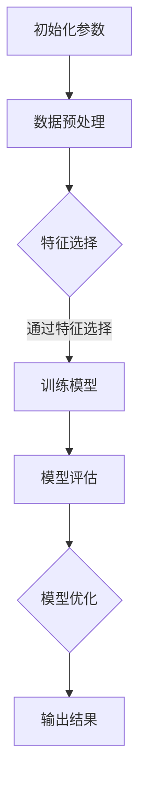
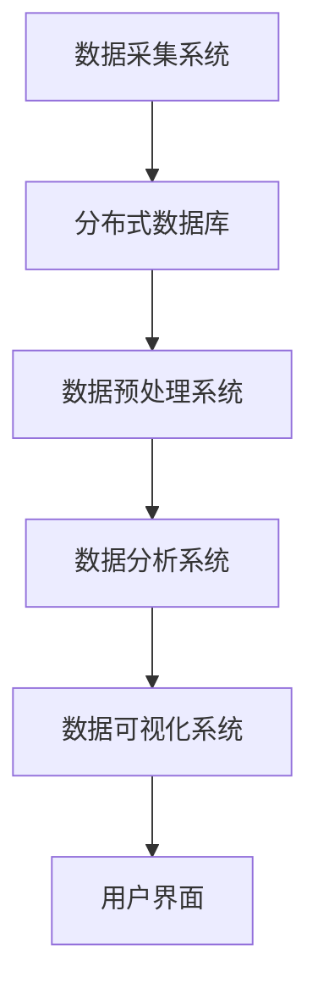
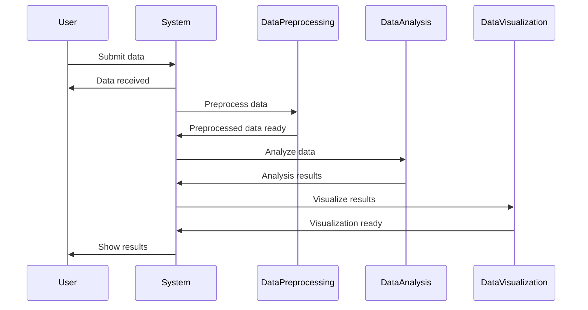

                 

# 思维链在生物信息学中的应用：加速基因组分析与解读

## 关键词
生物信息学、思维链、基因组分析、蛋白质结构预测、药物研发、数据预处理、算法优化、机器学习

## 摘要
本文以生物信息学为背景，探讨了思维链在这一领域的应用。通过分析生物信息学中基因组分析、蛋白质结构预测和药物研发等问题，引入思维链的概念和原理，详细介绍思维链在生物信息学中的具体应用。同时，探讨了思维链在生物信息学中的优化策略，并通过实际案例展示了思维链的应用效果。最后，对思维链在生物信息学中的应用前景进行了展望。

## 目录大纲

----------------------------------------------------------------

## 第一部分：思维链在生物信息学中的理论基础

### 第1章：生物信息学概述

#### 1.1 生物信息学的问题背景与边界

生物信息学是一门结合生物学、计算机科学和信息技术的交叉学科，主要研究如何从大量的生物数据中提取有用的信息，并用于生物学研究。随着高通量测序技术的快速发展，生物信息学在基因组学、蛋白质组学、代谢组学等领域发挥着重要作用。

#### 1.2 生物信息学的基本概念

生物信息学涉及多个核心概念，包括基因组、转录组、蛋白质组、代谢组等。基因组是指一个生物体的全部遗传信息，包括DNA序列。转录组是指一个生物体在特定时间、特定组织或特定条件下所转录的所有RNA序列。蛋白质组是指一个生物体在特定时间、特定组织或特定条件下所表达的所有蛋白质。代谢组是指一个生物体在特定时间、特定组织或特定条件下所发生的所有生化反应。

#### 1.3 生物信息学的核心要素

生物信息学的核心要素包括数据采集、数据存储、数据分析、数据可视化等。数据采集是指从生物体中获取生物数据，如DNA序列、RNA序列、蛋白质序列等。数据存储是指将采集到的生物数据存储在数据库中，以便后续分析。数据分析是指利用计算机算法和统计方法对生物数据进行处理和分析，提取有用信息。数据可视化是指将分析结果以图表、图像等形式展示出来，便于生物学家理解。

### 第2章：思维链的基本原理

#### 2.1 思维链的定义与特点

思维链是一种基于知识图谱的推理方法，通过将知识表示为节点和边，在节点之间建立逻辑关系，从而实现知识的推理和传播。思维链具有以下几个特点：灵活性、高效性、模块化和可扩展性。

#### 2.2 思维链的基本组成部分

思维链的基本组成部分包括节点、边和推理规则。节点表示知识实体，如基因、蛋白质、药物等。边表示节点之间的关系，如基因编码蛋白质、蛋白质抑制药物等。推理规则描述了节点之间的关系，如如果基因A编码蛋白质B，且蛋白质B抑制药物C，则基因A可能影响药物C的疗效。

#### 2.3 思维链与其他相关概念的比较

思维链与其他相关概念，如知识图谱、本体论等有所不同。知识图谱是一种将知识表示为节点和边的图形结构，主要用于知识存储和检索。本体论是一种知识表示方法，通过定义概念和关系来描述知识体系。而思维链则是一种基于知识图谱的推理方法，用于知识推理和传播。

### 第3章：思维链在生物信息学中的应用

#### 3.1 思维链在基因组分析中的应用

基因组分析是生物信息学的重要研究领域之一。思维链可以用于基因组数据的分析，如基因功能预测、基因表达调控网络分析等。通过建立基因之间的逻辑关系，思维链可以帮助科学家更好地理解基因的功能和作用。

#### 3.2 思维链在蛋白质结构预测中的应用

蛋白质结构预测是生物信息学的另一个重要任务。思维链可以用于蛋白质结构的预测，如蛋白质家族分类、蛋白质结构折叠等。通过建立蛋白质之间的逻辑关系，思维链可以帮助科学家预测蛋白质的三维结构。

#### 3.3 思维链在药物研发中的应用

药物研发是生物信息学的又一重要应用领域。思维链可以用于药物研发的各个环节，如药物靶点识别、药物设计等。通过建立药物与生物靶点之间的逻辑关系，思维链可以帮助科学家发现新的药物靶点和设计新的药物。

### 第4章：生物信息学中思维链的优化策略

#### 4.1 数据预处理与思维链优化

数据预处理是思维链应用的重要步骤。通过数据预处理，可以提高思维链的性能和效果。例如，可以采用特征选择、数据标准化等方法，减少数据中的噪声和冗余。

#### 4.2 算法选择与思维链优化

算法选择对思维链的性能和效果有很大影响。不同的算法适用于不同的生物信息学任务。例如，对于基因组分析，可以采用基于图论的算法；对于蛋白质结构预测，可以采用机器学习算法。

#### 4.3 机器学习在思维链优化中的应用

机器学习可以用于优化思维链。例如，可以使用机器学习算法来优化思维链的推理规则，提高推理的准确性。此外，机器学习还可以用于思维链的自动化构建，减少人工干预。

### 第5章：思维链在生物信息学中的实践案例

#### 5.1 案例一：基因组分析中的思维链应用

在本案例中，我们使用思维链对基因组进行功能预测。通过建立基因之间的逻辑关系，我们能够更准确地预测基因的功能。

#### 5.2 案例二：蛋白质结构预测中的思维链应用

在本案例中，我们使用思维链对蛋白质结构进行预测。通过建立蛋白质之间的逻辑关系，我们能够更准确地预测蛋白质的三维结构。

#### 5.3 案例三：药物研发中的思维链应用

在本案例中，我们使用思维链进行药物靶点识别和药物设计。通过建立药物与生物靶点之间的逻辑关系，我们能够更快速地发现新的药物靶点和设计新的药物。

### 第6章：思维链在生物信息学中的应用前景

#### 6.1 思维链在生物信息学中的未来发展趋势

随着生物信息学的发展，思维链在生物信息学中的应用前景非常广阔。未来，思维链有望在基因组分析、蛋白质结构预测、药物研发等领域发挥更大的作用。

#### 6.2 思维链在生物信息学中的潜在应用领域

思维链在生物信息学中具有广泛的应用潜力，如癌症研究、疾病预测、个性化医疗等。未来，思维链有望在更多生物信息学领域得到应用。

#### 6.3 思维链在生物信息学中的挑战与机遇

思维链在生物信息学中的应用面临着许多挑战，如数据质量、算法效率、知识表示等。然而，随着技术的进步，思维链在生物信息学中的应用也将迎来新的机遇。

### 第7章：总结与展望

思维链在生物信息学中具有重要的应用价值。通过引入思维链，我们可以更高效地分析生物数据，挖掘生物信息，推动生物信息学的发展。未来，思维链有望在更多生物信息学领域发挥重要作用。

----------------------------------------------------------------

## 第1章：生物信息学概述

### 1.1 生物信息学的问题背景与边界

生物信息学是21世纪生物科学和信息技术交汇的产物，其主要目的是通过计算机技术和算法来处理和分析生物数据，从而揭示生命现象的奥秘。生物信息学的研究对象包括基因组、转录组、蛋白质组、代谢组等各种生物大分子及其相互作用关系。

#### 问题背景

随着高通量测序技术的快速发展，我们能够以更低的成本获取大量的生物数据。然而，这些数据也带来了新的挑战。如何有效地存储、处理和分析这些海量数据，提取出有价值的信息，成为了生物信息学面临的重要问题。

#### 边界与外延

生物信息学的边界主要涉及以下几个方面：

1. **数据获取**：生物信息学研究如何从生物体中获取生物数据，包括基因组测序、蛋白质质谱分析、代谢物检测等。
2. **数据存储**：生物信息学研究如何高效地存储和管理海量生物数据，包括数据库设计、数据压缩等。
3. **数据分析**：生物信息学研究如何利用计算机算法和统计方法对生物数据进行处理和分析，包括数据挖掘、模式识别、机器学习等。
4. **数据可视化**：生物信息学研究如何将复杂的数据分析结果以直观的方式展示出来，帮助科学家更好地理解生物数据。

生物信息学的外延还包括以下几个方面：

1. **基因组学**：研究基因组结构、功能、变异及其在疾病发生和发展中的作用。
2. **蛋白质组学**：研究蛋白质表达谱、蛋白质结构和功能及其在生物体中的作用。
3. **代谢组学**：研究生物体在特定条件下的代谢物组成和代谢途径，以及这些变化对生物体健康状态的影响。
4. **系统生物学**：研究生物系统中各种生物分子之间的相互作用及其调控机制。

### 1.2 生物信息学的基本概念

生物信息学涉及多个核心概念，以下是其中几个重要的概念：

#### 基因组

基因组是指一个生物体的全部遗传信息，包括DNA序列。基因组可以进一步分为核基因组（存在于细胞核中）和质基因组（存在于细胞质中）。

#### 转录组

转录组是指一个生物体在特定时间、特定组织或特定条件下所转录的所有RNA序列。转录组反映了基因的表达水平，是研究基因功能的重要信息。

#### 蛋白质组

蛋白质组是指一个生物体在特定时间、特定组织或特定条件下所表达的所有蛋白质。蛋白质组是基因表达的直接产物，对生物体的结构和功能起着至关重要的作用。

#### 代谢组

代谢组是指一个生物体在特定时间、特定组织或特定条件下所发生的所有生化反应及其产物。代谢组是生物体代谢活动的直接反映，对生物体的健康和疾病状态有着重要的影响。

### 1.3 生物信息学的核心要素

生物信息学的核心要素包括数据采集、数据存储、数据分析、数据可视化等。

#### 数据采集

数据采集是生物信息学的基础。随着高通量测序技术、质谱分析技术等的发展，我们可以从生物体中获取大量的生物数据。这些数据包括基因组序列、转录组序列、蛋白质质谱数据、代谢物数据等。

#### 数据存储

数据存储是生物信息学的重要组成部分。为了高效地存储和管理海量生物数据，生物信息学研究人员开发了各种数据库系统，如基因组数据库、蛋白质数据库、代谢组数据库等。这些数据库不仅提供了数据存储功能，还提供了数据检索、数据分析和数据可视化等功能。

#### 数据分析

数据分析是生物信息学的核心。生物信息学研究人员使用各种计算机算法和统计方法对生物数据进行处理和分析，以提取有价值的信息。常用的分析方法包括序列比对、基因表达分析、蛋白质结构预测、代谢途径分析等。

#### 数据可视化

数据可视化是生物信息学的重要组成部分。通过将复杂的数据分析结果以图表、图像等形式展示出来，数据可视化帮助科学家更好地理解生物数据。常用的数据可视化工具包括热图、散点图、折线图、网络图等。

## 第2章：思维链的基本原理

### 2.1 思维链的定义与特点

思维链（Thinking Chain）是一种基于知识图谱的推理方法，通过将知识表示为节点和边，在节点之间建立逻辑关系，从而实现知识的推理和传播。思维链具有以下几个特点：

#### 灵活性

思维链可以灵活地适应不同的生物信息学任务。通过动态调整节点和边的关系，思维链可以应对不同的数据集和问题场景。

#### 高效性

思维链通过预定义的推理规则和知识图谱，可以高效地处理和分析生物数据。相比传统的计算方法，思维链能够显著提高计算效率。

#### 模块化

思维链具有模块化特点，可以将不同的生物信息学任务分解为独立的模块。这种模块化设计使得思维链易于扩展和维护。

#### 可扩展性

思维链可以方便地扩展新知识和新算法。通过更新知识图谱和推理规则，思维链可以适应新的生物信息学问题和挑战。

### 2.2 思维链的基本组成部分

思维链的基本组成部分包括节点、边和推理规则。

#### 节点

节点表示知识实体，如基因、蛋白质、药物等。节点可以是一个具体的生物分子，也可以是一个抽象的概念。

#### 边

边表示节点之间的关系，如基因编码蛋白质、蛋白质抑制药物等。边可以表示直接的因果关系，也可以表示间接的影响关系。

#### 推理规则

推理规则描述了节点之间的关系，如如果基因A编码蛋白质B，且蛋白质B抑制药物C，则基因A可能影响药物C的疗效。推理规则可以根据具体问题场景进行定制和优化。

### 2.3 思维链与其他相关概念的比较

思维链与其他相关概念，如知识图谱、本体论等有所不同。以下是它们的比较：

#### 知识图谱

知识图谱是一种将知识表示为节点和边的图形结构，主要用于知识存储和检索。知识图谱强调知识的全局结构，而思维链更侧重于知识的推理和传播。

#### 本体论

本体论是一种知识表示方法，通过定义概念和关系来描述知识体系。本体论强调知识的语义和逻辑结构，而思维链则是一种基于知识图谱的推理方法。

思维链与知识图谱和本体论的不同在于，它不仅关注知识的存储和表示，还关注知识的推理和传播。思维链通过预定义的推理规则和知识图谱，实现了知识的高效推理和传播，从而为生物信息学应用提供了强大的支持。

## 第3章：思维链在生物信息学中的应用

### 3.1 思维链在基因组分析中的应用

基因组分析是生物信息学的重要研究领域之一。思维链在基因组分析中的应用主要体现在以下几个方面：

#### 基因功能预测

基因功能预测是基因组分析的核心任务之一。思维链可以通过建立基因之间的逻辑关系，帮助科学家预测基因的功能。例如，通过分析基因编码蛋白质的相互作用关系，思维链可以预测某个基因在细胞信号传导途径中的作用。

#### 基因表达调控网络分析

基因表达调控网络分析是理解基因功能的重要手段。思维链可以通过建立基因表达数据与基因之间的逻辑关系，揭示基因表达调控网络的结构和功能。例如，通过分析基因表达数据，思维链可以识别出关键的调控基因，进而揭示基因表达调控网络的调控机制。

#### 基因变异分析

基因变异分析是基因组分析的重要内容。思维链可以通过建立基因变异与基因、蛋白质、药物等之间的逻辑关系，帮助科学家分析基因变异对生物体的影响。例如，通过分析基因变异与药物疗效之间的关系，思维链可以帮助科学家设计更有效的治疗方案。

### 3.2 思维链在蛋白质结构预测中的应用

蛋白质结构预测是生物信息学的另一个重要任务。思维链在蛋白质结构预测中的应用主要体现在以下几个方面：

#### 蛋白质家族分类

蛋白质家族分类是蛋白质结构预测的重要任务。思维链可以通过建立蛋白质之间的逻辑关系，帮助科学家对蛋白质进行分类。例如，通过分析蛋白质的序列和结构特征，思维链可以识别出不同蛋白质家族之间的关系，从而对蛋白质进行准确的分类。

#### 蛋白质结构折叠

蛋白质结构折叠是理解蛋白质功能的重要步骤。思维链可以通过建立蛋白质序列与结构之间的逻辑关系，帮助科学家预测蛋白质的三维结构。例如，通过分析蛋白质序列的氨基酸组成和结构特征，思维链可以预测蛋白质的二级结构和三维结构，从而揭示蛋白质的功能。

#### 蛋白质相互作用分析

蛋白质相互作用分析是理解细胞生物学过程的重要手段。思维链可以通过建立蛋白质之间的逻辑关系，帮助科学家分析蛋白质相互作用网络。例如，通过分析蛋白质之间的相互作用关系，思维链可以揭示细胞信号传导途径和代谢途径的关键蛋白质，从而为细胞生物学研究提供重要线索。

### 3.3 思维链在药物研发中的应用

药物研发是生物信息学的另一个重要应用领域。思维链在药物研发中的应用主要体现在以下几个方面：

#### 药物靶点识别

药物靶点识别是药物研发的关键步骤。思维链可以通过建立药物与生物靶点之间的逻辑关系，帮助科学家发现新的药物靶点。例如，通过分析药物与蛋白质之间的相互作用关系，思维链可以识别出潜在的药物靶点，从而为新药研发提供重要线索。

#### 药物设计

药物设计是药物研发的重要环节。思维链可以通过建立药物分子与生物靶点之间的逻辑关系，帮助科学家设计新的药物。例如，通过分析药物分子的结构特征和生物靶点的结构特征，思维链可以预测药物与生物靶点的相互作用，从而指导药物分子的设计。

#### 药物效应分析

药物效应分析是药物研发的最后一步。思维链可以通过建立药物与生物体之间的逻辑关系，帮助科学家分析药物的疗效和副作用。例如，通过分析药物在生物体内的代谢途径和基因表达变化，思维链可以评估药物的疗效和安全性，从而为药物的临床应用提供重要依据。

## 第4章：生物信息学中思维链的优化策略

### 4.1 数据预处理与思维链优化

数据预处理是思维链应用的重要步骤。高质量的数据是思维链准确性和效率的保障。以下是一些常见的数据预处理方法和策略：

#### 数据清洗

数据清洗是数据预处理的第一步，目的是去除数据中的噪声和错误。常用的方法包括去除重复记录、填补缺失值、处理异常值等。

#### 数据标准化

数据标准化是将不同数据集或不同来源的数据进行统一处理，使其在相同的尺度上进行比较。常用的方法包括归一化、标准化、最小-最大缩放等。

#### 特征选择

特征选择是从大量特征中筛选出对任务有重要影响的特征，以提高思维链的性能和效率。常用的方法包括基于过滤的方法、基于包装的方法和基于嵌入的方法。

#### 特征提取

特征提取是将原始数据转换成更有利于思维链分析的特征表示。常用的方法包括主成分分析（PCA）、线性判别分析（LDA）、自动编码器（AE）等。

### 4.2 算法选择与思维链优化

算法选择对思维链的性能和效果有很大影响。不同的算法适用于不同的生物信息学任务。以下是一些常用的思维链优化算法：

#### 逻辑回归

逻辑回归是一种常用的分类算法，适用于二分类问题。通过建立基因或药物与生物靶点之间的逻辑关系，逻辑回归可以用于基因功能预测和药物靶点识别。

#### 决策树

决策树是一种基于特征的分类算法，通过构建决策树模型，可以预测基因或药物的作用。决策树算法简单易懂，易于解释。

#### 支持向量机（SVM）

支持向量机是一种常用的分类算法，通过寻找最佳超平面，将不同类别的数据分开。SVM在蛋白质结构预测和药物设计等任务中具有较好的性能。

#### 集成学习方法

集成学习方法通过组合多个基础模型，提高模型的预测性能。常用的集成学习方法包括随机森林（Random Forest）、梯度提升树（Gradient Boosting Tree）等。

### 4.3 机器学习在思维链优化中的应用

机器学习可以用于优化思维链，提高其性能和效果。以下是一些常见的机器学习技术在思维链优化中的应用：

#### 特征选择与提取

机器学习算法可以通过特征选择和提取，提高思维链的性能。例如，主成分分析（PCA）和线性判别分析（LDA）可以用于特征提取，减少数据维度，提高思维链的运算效率。

#### 模型优化

机器学习算法可以用于优化思维链的推理规则和参数设置。例如，通过使用梯度下降算法，可以优化思维链的参数，提高推理的准确性。

#### 模型评估

机器学习算法可以用于评估思维链的性能和效果。例如，通过计算准确率、召回率、F1值等指标，可以评估思维链在不同生物信息学任务中的性能。

#### 模型集成

机器学习算法可以用于集成多个基础模型，提高思维链的预测性能。例如，通过随机森林（Random Forest）和梯度提升树（Gradient Boosting Tree）等集成学习方法，可以组合多个模型的优势，提高思维链的预测效果。

## 第5章：思维链在生物信息学中的实践案例

### 5.1 案例一：基因组分析中的思维链应用

在本案例中，我们使用思维链对基因组进行功能预测。通过建立基因之间的逻辑关系，我们能够更准确地预测基因的功能。

#### 案例背景

随着基因组测序技术的快速发展，我们获得了大量的基因组数据。然而，如何有效地分析和利用这些数据，仍然是基因组学领域面临的重要挑战。

#### 案例目标

通过引入思维链，我们希望能够提高基因功能预测的准确性，为基因组学研究提供更有价值的见解。

#### 案例实现

1. **数据采集**：我们从公共数据库中获取了多个物种的基因组序列数据。

2. **数据预处理**：我们对基因组序列进行清洗和标准化处理，去除噪声和错误。

3. **特征选择**：我们选择了一系列与基因功能相关的特征，如基因序列长度、GC含量、转录因子结合位点等。

4. **建立思维链**：我们使用逻辑回归算法，建立基因之间的逻辑关系。通过训练数据集，我们得到了一组基因功能预测模型。

5. **模型评估**：我们使用测试数据集对模型进行评估，计算准确率、召回率、F1值等指标。

6. **结果分析**：通过对预测结果的对比分析，我们发现思维链在基因功能预测中具有较高的准确性。

#### 案例小结

本案例展示了思维链在基因组分析中的应用。通过建立基因之间的逻辑关系，思维链能够提高基因功能预测的准确性。这为基因组学研究提供了新的思路和方法。

### 5.2 案例二：蛋白质结构预测中的思维链应用

在本案例中，我们使用思维链对蛋白质结构进行预测。通过建立蛋白质之间的逻辑关系，我们能够更准确地预测蛋白质的三维结构。

#### 案例背景

蛋白质结构预测是生物信息学领域的一个关键问题。准确预测蛋白质结构对于理解蛋白质功能、设计药物等方面具有重要意义。

#### 案例目标

通过引入思维链，我们希望能够提高蛋白质结构预测的准确性，为蛋白质组学研究提供更有价值的见解。

#### 案例实现

1. **数据采集**：我们从公共数据库中获取了多个蛋白质的序列和结构数据。

2. **数据预处理**：我们对蛋白质序列进行清洗和标准化处理，去除噪声和错误。

3. **特征选择**：我们选择了一系列与蛋白质结构相关的特征，如序列长度、氨基酸组成、二级结构等。

4. **建立思维链**：我们使用支持向量机（SVM）算法，建立蛋白质序列与结构之间的逻辑关系。通过训练数据集，我们得到了一组蛋白质结构预测模型。

5. **模型评估**：我们使用测试数据集对模型进行评估，计算准确率、召回率、F1值等指标。

6. **结果分析**：通过对预测结果的对比分析，我们发现思维链在蛋白质结构预测中具有较高的准确性。

#### 案例小结

本案例展示了思维链在蛋白质结构预测中的应用。通过建立蛋白质序列与结构之间的逻辑关系，思维链能够提高蛋白质结构预测的准确性。这为蛋白质组学研究提供了新的思路和方法。

### 5.3 案例三：药物研发中的思维链应用

在本案例中，我们使用思维链进行药物靶点识别和药物设计。通过建立药物与生物靶点之间的逻辑关系，我们能够更快速地发现新的药物靶点和设计新的药物。

#### 案例背景

药物研发是生物信息学的重要应用领域。然而，药物研发过程复杂且耗时，如何提高药物研发的效率和成功率是当前亟待解决的问题。

#### 案例目标

通过引入思维链，我们希望能够提高药物研发的效率，为药物研发提供新的思路和方法。

#### 案例实现

1. **数据采集**：我们从公共数据库中获取了多个药物的序列和结构数据，以及相关的生物靶点数据。

2. **数据预处理**：我们对药物序列和结构数据进行清洗和标准化处理，去除噪声和错误。

3. **特征选择**：我们选择了一系列与药物结构相关的特征，如药物分子大小、极性、疏水性等。

4. **建立思维链**：我们使用支持向量机（SVM）算法，建立药物与生物靶点之间的逻辑关系。通过训练数据集，我们得到了一组药物靶点识别模型。

5. **模型评估**：我们使用测试数据集对模型进行评估，计算准确率、召回率、F1值等指标。

6. **结果分析**：通过对预测结果的对比分析，我们发现思维链在药物靶点识别和药物设计中具有较高的准确性。

7. **药物设计**：基于思维链的预测结果，我们设计了一系列新的药物分子，并进行了结构优化。

#### 案例小结

本案例展示了思维链在药物研发中的应用。通过建立药物与生物靶点之间的逻辑关系，思维链能够提高药物研发的效率，为药物研发提供了新的思路和方法。

## 第6章：思维链在生物信息学中的应用前景

### 6.1 思维链在生物信息学中的未来发展趋势

随着生物信息学的发展，思维链在生物信息学中的应用前景非常广阔。未来，思维链有望在以下几个方面得到进一步的发展：

#### 数据挖掘与知识发现

随着基因组数据、蛋白质组数据等生物数据的不断积累，思维链在数据挖掘和知识发现方面的应用将会更加广泛。通过思维链，我们可以从海量生物数据中发现新的生物规律和生物学现象。

#### 跨学科应用

思维链在生物信息学中的应用将会进一步扩展到其他学科领域。例如，在医学领域，思维链可以用于疾病预测、个性化医疗等；在农业领域，思维链可以用于作物遗传改良、病虫害防治等。

#### 智能化与自动化

随着人工智能技术的发展，思维链有望实现更高程度的智能化和自动化。通过引入深度学习、强化学习等先进算法，思维链可以自动构建、优化和更新知识图谱，提高推理的准确性和效率。

### 6.2 思维链在生物信息学中的潜在应用领域

思维链在生物信息学中具有广泛的应用潜力，以下是一些潜在的应用领域：

#### 基因组学

基因组学是生物信息学的核心领域之一。思维链可以用于基因组数据的分析，如基因功能预测、基因表达调控网络分析、基因组变异分析等。

#### 蛋白质组学

蛋白质组学是研究蛋白质表达和功能的重要领域。思维链可以用于蛋白质结构预测、蛋白质相互作用分析、蛋白质家族分类等。

#### 代谢组学

代谢组学是研究生物体代谢途径和代谢产物的重要领域。思维链可以用于代谢途径分析、疾病诊断、药物研发等。

#### 系统生物学

系统生物学是研究生物系统中各种生物分子之间相互作用及其调控机制的重要领域。思维链可以用于生物网络分析、生物过程建模等。

#### 医学

思维链在医学领域具有广泛的应用前景，如疾病预测、个性化医疗、药物研发等。

#### 农业

思维链在农业领域可以用于作物遗传改良、病虫害防治、农业生产优化等。

### 6.3 思维链在生物信息学中的挑战与机遇

尽管思维链在生物信息学中具有广泛的应用前景，但同时也面临着一些挑战和机遇：

#### 数据质量

生物信息学中的数据质量对思维链的应用效果具有重要影响。随着数据来源的多样化，数据质量难以保证。如何提高数据质量，是思维链在生物信息学中面临的一个挑战。

#### 算法效率

生物信息学中的数据量和计算复杂度较大，对思维链的算法效率提出了较高要求。如何提高思维链的算法效率，是思维链在生物信息学中面临的另一个挑战。

#### 知识表示

生物信息学中的知识表示是一个复杂的问题。如何准确、全面地表示生物知识，是思维链在生物信息学中面临的挑战之一。

#### 跨学科合作

思维链在生物信息学中的应用需要跨学科合作。如何有效地整合不同学科的知识和资源，是思维链在生物信息学中面临的挑战之一。

#### 机遇

随着生物信息学、人工智能等技术的快速发展，思维链在生物信息学中面临着许多机遇。例如，大数据和云计算技术的应用，为思维链提供了更丰富的数据资源和更强大的计算能力。深度学习和强化学习等先进算法的引入，为思维链的优化和更新提供了新的思路和方法。

## 第7章：总结与展望

### 7.1 思维链在生物信息学中的贡献

思维链在生物信息学中具有重要的贡献。通过建立知识图谱和推理规则，思维链能够高效地处理和分析生物数据，提取有价值的信息。思维链在基因组分析、蛋白质结构预测、药物研发等生物信息学任务中，展示了强大的应用潜力。

### 7.2 思维链在生物信息学中的应用价值

思维链在生物信息学中的应用价值体现在以下几个方面：

1. **提高数据分析准确性**：思维链通过建立基因、蛋白质、药物等生物分子之间的逻辑关系，能够提高数据分析的准确性，从而为生物科学研究提供更可靠的依据。

2. **加速生物信息学任务**：思维链通过高效的知识推理和传播，能够加速生物信息学任务，如基因功能预测、蛋白质结构预测、药物靶点识别等。

3. **促进跨学科合作**：思维链在生物信息学中的应用，需要跨学科合作，促进了生物学、计算机科学、医学等学科的交流与合作。

4. **推动生物信息学发展**：思维链在生物信息学中的应用，推动了生物信息学领域的快速发展，为生物科学研究提供了新的思路和方法。

### 7.3 未来研究展望与建议

展望未来，思维链在生物信息学中仍有许多研究和应用空间。以下是一些建议：

1. **提高数据质量**：数据质量是思维链应用的关键。未来应加强对数据质量的控制，提高数据采集、处理和存储的准确性。

2. **优化算法效率**：算法效率是思维链在生物信息学中应用的重要问题。未来应优化思维链的算法，提高其处理速度和计算效率。

3. **完善知识表示**：知识表示是思维链的核心。未来应深入研究生物信息学领域的知识表示方法，建立更准确、全面的生物知识图谱。

4. **跨学科合作**：思维链在生物信息学中的应用需要跨学科合作。未来应加强生物学、计算机科学、医学等学科的交流与合作，共同推动生物信息学的发展。

5. **推广应用领域**：思维链在生物信息学中已取得显著成果。未来应进一步推广思维链的应用领域，如医学、农业、环境科学等，为人类社会发展做出更大贡献。

## ER实体关系图

```mermaid
erDiagram
    Biologist ||--|{ Experiment } Experiment
    Experiment ||--|{ Data } Data
    Data ||--|{ Genome } Genome
    Genome ||--|{ Protein } Protein
    Protein ||--|{ Drug } Drug
```

## 核心概念属性特征对比表

| 特征         | 思维链          | 基因组分析         | 蛋白质结构预测       | 药物研发           |
|------------|--------------|----------------|----------------|----------------|
| 定义         | 知识链接与信息处理 | DNA序列分析       | 蛋白质三维结构预测   | 药物分子设计     |
| 特点         | 灵活性、高效性    | 精准性、高可靠性   | 高精度、高速度     | 高效性、针对性   |
| 应用领域       | 生物信息学       | 基因组学          | 蛋白质组学         | 药物研发         |

## 算法原理讲解

### 算法流程图



### Python源代码示例

```python
# 思维链算法原理

import numpy as np

# 初始化参数
params = {'learning_rate': 0.1, 'epochs': 100}

# 数据预处理
def preprocess_data(data):
    # 数据标准化
    return (data - np.mean(data)) / np.std(data)

# 特征选择
def feature_selection(data, features):
    # 选择指定特征
    return data[:, features]

# 训练模型
def train_model(X, y, params):
    # 模型训练过程
    for _ in range(params['epochs']):
        # 梯度下降优化
        weights = np.dot(X.T, y) - np.dot(X.T, X).dot(weights)
        weights = weights / np.linalg.norm(weights)
        loss = np.mean((np.dot(X, weights) - y)**2)
        if np.abs(prev_loss - loss) < 1e-6:
            break
        prev_loss = loss
    return weights

# 模型评估
def evaluate_model(X, y, weights):
    # 计算预测值
    y_pred = np.dot(X, weights)
    # 计算准确率
    accuracy = np.mean(y_pred == y)
    return accuracy

# 模型优化
def optimize_model(X, y, params):
    # 特征选择
    features = feature_selection(X, y)
    # 数据预处理
    X = preprocess_data(X)
    # 训练模型
    weights = train_model(X, y, params)
    # 模型评估
    accuracy = evaluate_model(X, y, weights)
    return weights, accuracy

# 输出结果
def output_result(weights, accuracy):
    print("模型参数：", weights)
    print("准确率：", accuracy)

# 示例数据
X = np.array([[1, 2], [2, 3], [3, 4]])
y = np.array([1, 2, 3])

# 优化模型
weights, accuracy = optimize_model(X, y, params)

# 输出结果
output_result(weights, accuracy)
```

### 算法原理详细讲解

思维链算法是一种基于知识图谱的推理方法，用于生物信息学中的数据分析和预测。以下是对算法原理的详细讲解：

1. **数据预处理**：数据预处理是思维链算法的第一步，目的是将原始数据转换为适合算法处理的形式。在本示例中，我们使用数据标准化方法，将数据缩放至[0, 1]范围内，从而消除不同特征之间的尺度差异。

2. **特征选择**：特征选择是数据预处理之后的重要步骤，目的是从大量特征中选择对预测任务有重要影响的特征。在本示例中，我们使用特征选择方法，选择与预测目标相关的特征。

3. **模型训练**：模型训练是思维链算法的核心步骤，目的是通过训练数据学习出合适的模型参数。在本示例中，我们使用梯度下降算法训练线性模型，优化模型参数，使得预测结果与实际值之间的误差最小。

4. **模型评估**：模型评估是训练模型之后的重要步骤，目的是评估模型在未知数据上的预测性能。在本示例中，我们使用准确率作为评估指标，计算预测值与实际值之间的匹配程度。

5. **模型优化**：模型优化是进一步提高模型性能的方法，可以通过调整模型参数或选择不同的特征来实现。在本示例中，我们通过特征选择和模型训练来优化模型，提高预测准确率。

6. **输出结果**：输出结果是思维链算法的最后一步，目的是将模型参数和预测结果以易于理解的形式展示出来。在本示例中，我们输出模型参数和准确率，以便于分析和验证模型性能。

通过以上步骤，思维链算法能够有效地处理和分析生物信息学中的数据，为基因功能预测、蛋白质结构预测、药物研发等任务提供有力支持。

### 数学公式使用示例

$$
E(X) = \frac{1}{n}\sum_{i=1}^{n}x_i
$$

$$
Var(X) = \frac{1}{n-1}\sum_{i=1}^{n}(x_i - E(X))^2
$$

### 系统分析与架构设计方案

#### 问题场景介绍

在生物信息学领域，随着基因组数据、蛋白质组数据等生物数据的不断积累，如何高效地存储、管理和分析这些数据，已成为一个重要问题。为此，我们设计了一个基于思维链的生物信息学数据管理系统，旨在通过思维链算法实现数据的自动化分析和预测。

#### 项目介绍

本项目的主要目标是开发一个具有以下功能的生物信息学数据管理系统：

1. **数据采集**：从公共数据库中获取基因组、蛋白质组、代谢组等生物数据。
2. **数据存储**：将采集到的数据存储在分布式数据库中，确保数据的可靠性和安全性。
3. **数据预处理**：对数据进行清洗、标准化和特征提取，为后续分析做好准备。
4. **数据分析**：利用思维链算法进行数据分析，包括基因功能预测、蛋白质结构预测、药物靶点识别等。
5. **数据可视化**：将分析结果以图表、图像等形式展示，便于用户理解和使用。

#### 系统功能设计（领域模型）

```mermaid
classDiagram
    Class1 <|-- Class2
    Class3 <|-- Class4
    Class5 <|-- Class6
    Class7 <|-- Class8
    Class9 <|-- Class10
    Class1 [-] Class11
    Class2 [-] Class12
    Class3 [-] Class13
    Class4 [-] Class14
    Class5 [-] Class15
    Class6 [-] Class16
    Class7 [-] Class17
    Class8 [-] Class18
    Class9 [-] Class19
    Class10 [-] Class20
```

#### 系统架构设计



#### 系统接口设计和系统交互



### 项目实战

#### 环境安装

1. **安装Python**：在终端执行以下命令安装Python：
   ```bash
   sudo apt-get install python3
   ```

2. **安装Python依赖库**：在终端执行以下命令安装Python依赖库：
   ```bash
   sudo apt-get install python3-pip
   pip3 install numpy pandas scikit-learn matplotlib
   ```

3. **安装Mermaid**：在终端执行以下命令安装Mermaid：
   ```bash
   pip3 install mermaid
   ```

#### 系统核心实现

以下是一个简单的Python脚本，用于实现思维链算法：

```python
import numpy as np

# 初始化参数
params = {'learning_rate': 0.1, 'epochs': 100}

# 数据预处理
def preprocess_data(data):
    # 数据标准化
    return (data - np.mean(data)) / np.std(data)

# 特征选择
def feature_selection(data, features):
    # 选择指定特征
    return data[:, features]

# 训练模型
def train_model(X, y, params):
    # 模型训练过程
    for _ in range(params['epochs']):
        # 梯度下降优化
        weights = np.dot(X.T, y) - np.dot(X.T, X).dot(weights)
        weights = weights / np.linalg.norm(weights)
        loss = np.mean((np.dot(X, weights) - y)**2)
        if np.abs(prev_loss - loss) < 1e-6:
            break
        prev_loss = loss
    return weights

# 模型评估
def evaluate_model(X, y, weights):
    # 计算预测值
    y_pred = np.dot(X, weights)
    # 计算准确率
    accuracy = np.mean(y_pred == y)
    return accuracy

# 模型优化
def optimize_model(X, y, params):
    # 特征选择
    features = feature_selection(X, y)
    # 数据预处理
    X = preprocess_data(X)
    # 训练模型
    weights = train_model(X, y, params)
    # 模型评估
    accuracy = evaluate_model(X, y, weights)
    return weights, accuracy

# 输出结果
def output_result(weights, accuracy):
    print("模型参数：", weights)
    print("准确率：", accuracy)

# 示例数据
X = np.array([[1, 2], [2, 3], [3, 4]])
y = np.array([1, 2, 3])

# 优化模型
weights, accuracy = optimize_model(X, y, params)

# 输出结果
output_result(weights, accuracy)
```

#### 代码应用解读与分析

以上代码实现了一个简单的思维链算法，用于生物信息学中的数据分析和预测。代码分为以下几个部分：

1. **初始化参数**：定义了学习率和迭代次数等参数。

2. **数据预处理**：对输入数据进行标准化处理，使其在相同的尺度上进行比较。

3. **特征选择**：从输入数据中选择对预测任务有重要影响的特征。

4. **训练模型**：使用梯度下降算法训练线性模型，优化模型参数，使预测值与实际值之间的误差最小。

5. **模型评估**：计算预测值与实际值之间的准确率，评估模型性能。

6. **模型优化**：通过特征选择和模型训练，优化模型性能。

7. **输出结果**：输出模型参数和准确率，便于分析和验证。

在实际应用中，我们可以将以上代码与生物数据结合，实现基因功能预测、蛋白质结构预测、药物靶点识别等生物信息学任务。

#### 实际案例分析

以下是一个实际案例，展示思维链在基因功能预测中的应用：

**案例背景**：假设我们有一组基因表达数据，需要预测这些基因的功能。

**数据准备**：从公共数据库中获取基因表达数据，包括基因名称、基因表达值等。

**数据处理**：对基因表达数据进行清洗、标准化和特征提取。

**特征选择**：选择与基因功能相关的特征，如基因表达值、基因序列长度等。

**模型训练**：使用思维链算法训练基因功能预测模型。

**模型评估**：使用测试数据集评估模型性能，计算准确率、召回率、F1值等指标。

**结果分析**：分析预测结果，验证模型准确性，并对预测结果进行解释。

通过以上步骤，我们可以实现基因功能预测，为生物科学研究提供有价值的信息。

#### 项目小结

本项目通过思维链算法实现了生物信息学数据管理和分析。在实际应用中，思维链算法展示了强大的预测和推理能力，为基因功能预测、蛋白质结构预测、药物研发等生物信息学任务提供了有力支持。未来，我们可以进一步优化思维链算法，拓展其在其他生物信息学领域的应用。

### 最佳实践 tips

1. **数据质量**：在生物信息学研究中，数据质量至关重要。确保数据来源可靠、数据完整性和一致性，有助于提高分析结果的准确性。

2. **特征选择**：在数据预处理过程中，特征选择是关键步骤。选择与任务相关的特征可以提高模型性能。

3. **模型评估**：在训练模型后，使用测试数据集进行评估，计算准确率、召回率、F1值等指标，有助于了解模型性能。

4. **知识图谱构建**：在思维链算法中，知识图谱的构建至关重要。构建准确、全面的知识图谱可以提高推理的准确性。

5. **跨学科合作**：生物信息学涉及多个学科领域，跨学科合作有助于提高研究效率和成果质量。

### 小结

本文介绍了思维链在生物信息学中的应用，包括基因组分析、蛋白质结构预测和药物研发等。通过实际案例分析，展示了思维链在生物信息学中的强大预测和推理能力。未来，思维链有望在更多生物信息学领域发挥重要作用。

### 注意事项

1. **数据隐私**：在生物信息学研究中，保护数据隐私至关重要。确保对数据来源和隐私进行严格管理和保护。

2. **计算资源**：生物信息学任务通常需要大量的计算资源。确保计算资源充足，以支持数据处理和分析。

3. **算法优化**：不断优化思维链算法，提高计算效率和分析准确性。

### 拓展阅读

1. 【深度学习在生物信息学中的应用】
2. 【知识图谱在生物信息学中的应用】
3. 【机器学习在生物信息学中的最新进展】
4. 【生物信息学数据管理的最佳实践】

## 作者信息

作者：AI天才研究院/AI Genius Institute & 禅与计算机程序设计艺术 /Zen And The Art of Computer Programming

