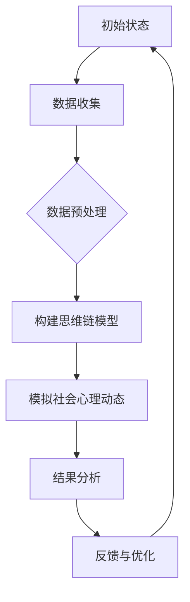
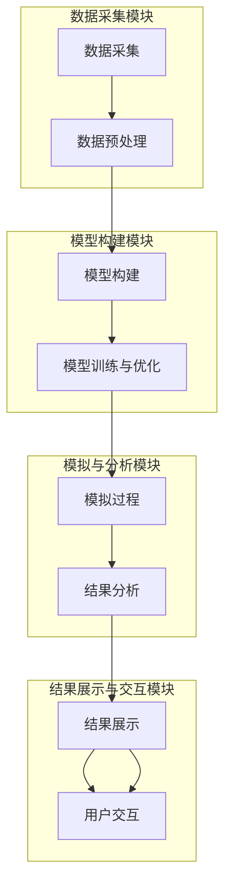

                 

### 第一部分: 引言与背景

#### 1.1 问题背景

**1.1.1 社会心理动态的研究现状**

社会心理动态是社会科学与心理学领域中的一个重要研究方向。它关注群体行为、情感波动及其相互作用，旨在理解个体在群体中的心理过程和社会影响。近年来，随着计算机技术的飞速发展，社会心理动态的研究开始逐渐从理论探讨转向实证研究和模拟分析。这一转变不仅为传统研究方法提供了新的工具，也拓展了社会心理学的应用领域。

**1.1.2 思维链在社会心理动态模拟中的重要性**

在模拟社会心理动态的过程中，思维链的概念显得尤为重要。思维链指的是个体或群体在决策和行动过程中，一系列相互关联的思维过程。它不仅涵盖了逻辑推理，还包括情感、价值观和社会规范等因素。通过构建思维链模型，我们可以模拟个体或群体在面对复杂情境时的思维过程和行为模式，从而更好地理解社会心理动态的运行机制。

**1.1.3 本书的目标与结构**

本书旨在探讨思维链在社会心理动态模拟中的应用，通过逻辑清晰、结构紧凑的分析，介绍相关核心概念、算法原理和实际应用案例。具体来说，本书将分为以下几个部分：

1. **引言与背景**：介绍社会心理动态的研究现状、思维链的重要性以及本书的目标与结构。
2. **核心概念与联系**：阐述思维链和社会心理动态的基本原理，并通过对比表格和Mermaid流程图展示核心概念之间的关系。
3. **算法原理讲解**：详细讲解思维链模拟的算法原理，包括流程图、Python源代码、数学模型和公式。
4. **系统分析与架构设计方案**：介绍问题场景、项目介绍、系统功能设计、系统架构设计和系统接口设计与交互。
5. **项目实战**：展示思维链模拟的实际应用，包括环境安装、系统核心实现源代码、代码应用解读与分析、实际案例分析和项目小结。
6. **最佳实践 tips、小结、注意事项、拓展阅读**：提供最佳实践建议、总结、注意事项以及进一步阅读的推荐。

通过以上结构的安排，本书希望能够为读者提供一部系统、深入、易懂的技术指南，帮助大家更好地理解和应用思维链在社会心理动态模拟中的价值。

#### 1.2 问题描述

**1.2.1 社会心理动态的复杂性**

社会心理动态涉及多个层面的复杂互动，包括个体心理、群体行为、社会结构和文化背景等。这些因素相互作用，形成了一个多维的动态系统。传统的实验研究和定量分析方法在处理这种复杂性时存在一定的局限性。例如，实验研究往往难以模拟真实的社会环境，而定量分析则可能忽略了情感和非理性因素对社会心理动态的影响。

**1.2.2 传统方法的局限性**

传统的社会心理动态研究主要依赖于实验观察和问卷调查等手段。这些方法虽然能够提供一定的数据支持，但在处理复杂的社会互动时显得力不从心。具体来说，传统方法存在以下局限性：

1. **环境控制难度大**：实验研究需要在受控环境中进行，而真实的社会环境是复杂多变的，难以进行精确控制。
2. **样本代表性不足**：问卷调查等定量研究依赖于样本的选择，而样本的代表性和多样性往往无法满足研究的需要。
3. **情感和非理性因素的忽视**：传统方法往往更注重逻辑推理和理性分析，而忽略了情感、价值观和社会规范等非理性因素对社会心理动态的影响。

**1.2.3 思维链的概念与特点**

思维链是一种描述个体或群体思维过程的模型，它强调思维过程中的连续性和动态性。思维链模型具有以下特点：

1. **动态性**：思维链能够动态地调整和优化，以适应不断变化的环境和情境。
2. **连续性**：思维链中的各个思维过程是相互关联的，前一个思维过程的结果会直接影响后续的思维过程。
3. **多样性**：思维链不仅包括逻辑推理，还包括情感、价值观和社会规范等因素，能够更全面地反映个体或群体的思维模式。

通过引入思维链模型，我们可以弥补传统方法的不足，更准确地模拟和分析社会心理动态。思维链模型不仅可以处理复杂的社会互动，还能够考虑情感和非理性因素，从而提供更全面、深入的分析结果。

#### 1.3 问题解决

**1.3.1 思维链在社会心理动态模拟中的应用**

思维链在社会心理动态模拟中具有重要的应用价值。通过构建思维链模型，我们可以模拟个体或群体在面对复杂情境时的思维过程和行为模式。具体来说，思维链的应用主要体现在以下几个方面：

1. **情境分析**：思维链模型能够模拟个体或群体在不同情境下的思维过程，帮助研究者理解情境如何影响个体的思维和行为。
2. **行为预测**：基于思维链模型，我们可以预测个体或群体在不同情境下的行为模式，为决策提供数据支持。
3. **决策优化**：通过分析思维链模型中的思维过程和行为模式，我们可以优化决策过程，提高决策的准确性和有效性。

**1.3.2 思维链模拟的关键技术**

实现思维链模拟需要一系列关键技术的支持。这些技术包括：

1. **数据收集与处理**：收集和处理与思维链相关的数据，如个体心理特征、行为记录、社交网络数据等。
2. **模型构建**：构建思维链模型，包括确定思维链的节点、关系和参数等。
3. **算法实现**：实现思维链模拟的算法，包括数据预处理、模型训练、行为预测和结果分析等。

**1.3.3 思维链模拟的应用场景**

思维链模拟的应用场景非常广泛，主要包括以下几个方面：

1. **社会心理学研究**：通过思维链模拟，研究者可以深入理解社会心理动态的运行机制，为相关理论研究提供实证支持。
2. **公共政策制定**：思维链模拟可以帮助政策制定者预测政策对社会心理动态的影响，从而制定更加科学、有效的政策。
3. **企业管理和营销**：思维链模拟可以帮助企业理解消费者行为，优化产品设计和营销策略，提高市场竞争力。

通过思维链模拟，我们可以更好地理解社会心理动态，为相关研究和实践提供有力支持。

#### 1.4 边界与外延

**1.4.1 思维链模拟的边界条件**

尽管思维链模拟在社会心理动态研究中具有广泛应用，但其在实际应用中仍存在一定的边界条件。这些边界条件包括：

1. **数据质量**：思维链模拟依赖于高质量的数据支持。如果数据存在偏差或不足，可能会影响模拟结果的准确性。
2. **情境限制**：思维链模拟通常针对特定情境进行设计，难以适应所有情况。在不同情境下，思维链模型可能需要相应的调整和优化。
3. **计算资源**：大规模的思维链模拟需要大量的计算资源，可能会对硬件和软件系统提出较高要求。

**1.4.2 社会心理动态模拟的适用范围**

思维链模拟适用于多种社会心理动态研究场景。具体来说，它主要适用于以下领域：

1. **群体行为分析**：通过思维链模拟，可以分析群体行为背后的思维过程，为理解群体行为提供新的视角。
2. **情感分析**：思维链模拟可以帮助分析情感波动的原因和影响，为情感管理提供科学依据。
3. **社会互动模拟**：通过思维链模拟，可以模拟个体之间的社会互动过程，为社交网络分析和决策提供支持。

**1.4.3 思维链模拟的挑战与机遇**

思维链模拟面临一系列挑战，包括数据收集与处理、模型构建与优化、算法实现与效率等。然而，随着技术的不断进步，这些挑战正逐步得到解决。同时，思维链模拟也带来了新的机遇：

1. **跨学科研究**：思维链模拟能够整合心理学、社会学、计算机科学等多个学科的知识，推动跨学科研究的发展。
2. **技术创新**：思维链模拟的算法实现和模型优化为技术创新提供了新的方向，如人工智能、大数据分析等。
3. **社会应用**：思维链模拟在社会心理动态研究中的应用，将为公共政策制定、企业管理、市场营销等领域提供更加科学和有效的支持。

#### 1.5 概念结构与核心要素组成

**1.5.1 思维链的概念结构**

思维链是一种描述个体或群体思维过程的模型，它由一系列相互关联的思维过程组成。这些思维过程可以是逻辑推理、情感分析、价值观判断等。思维链的概念结构主要包括以下几个部分：

1. **思维节点**：思维链中的基本单元，表示一次具体的思维过程。每个思维节点都有特定的输入和输出。
2. **思维关系**：描述思维节点之间的相互关系。这些关系可以是因果关系、依赖关系等。
3. **思维参数**：影响思维节点行为和关系的参数，如思维速度、情感强度、价值观倾向等。

**1.5.2 社会心理动态的核心要素**

社会心理动态涉及多个核心要素，这些要素相互作用，共同决定了社会心理动态的运行机制。社会心理动态的核心要素主要包括：

1. **个体心理特征**：包括认知能力、情感状态、价值观等个体特征，这些特征决定了个体在群体中的行为和思维模式。
2. **群体行为模式**：描述群体成员在特定情境下的行为模式，如合作、竞争、从众等。
3. **社会结构**：包括社会关系、社会规范、社会角色等，这些因素影响个体和群体的行为和思维过程。
4. **文化背景**：文化背景包括价值观、信仰、传统等，这些因素对个体和群体的思维和行为产生深远影响。

**1.5.3 思维链与社会心理动态的相互作用**

思维链与社会心理动态之间存在密切的相互作用。一方面，思维链可以影响社会心理动态的运行机制，如个体思维过程可以影响群体行为模式。另一方面，社会心理动态也会影响思维链的运行。例如，群体行为模式可以改变个体思维过程的方向和内容。通过理解思维链与社会心理动态的相互作用，我们可以更好地预测和优化社会心理动态的运行。

## 第二部分: 核心概念与原理

### 2.1 核心概念原理

**2.1.1 思维链的定义**

思维链是一种描述个体或群体思维过程的模型，它强调思维过程中的连续性和动态性。在思维链中，思维过程被视为一系列相互关联的节点，这些节点通过特定的关系连接起来。每个思维节点表示一次具体的思维活动，如逻辑推理、情感分析、价值观判断等。思维链不仅涵盖了逻辑推理，还包括情感、价值观和社会规范等因素，能够更全面地反映个体或群体的思维模式。

**2.1.2 社会心理动态模拟的基本原理**

社会心理动态模拟旨在通过构建和模拟思维链模型，理解和预测社会心理动态的运行机制。其基本原理包括：

1. **思维过程模拟**：通过模拟个体或群体的思维过程，包括逻辑推理、情感分析等，来理解社会心理动态的内在机制。
2. **行为模式预测**：基于思维链模型，预测个体或群体在不同情境下的行为模式，如合作、竞争、从众等。
3. **动态调整与优化**：思维链模型具有动态调整和优化的能力，能够根据环境和情境的变化，调整思维过程和行为模式，从而实现更精准的模拟和预测。

**2.1.3 思维链在社会心理动态模拟中的运用**

思维链在社会心理动态模拟中具有重要的应用价值。具体来说，思维链的运用主要体现在以下几个方面：

1. **情境分析**：通过模拟思维链，可以分析个体或群体在不同情境下的思维过程，帮助研究者理解情境如何影响个体的思维和行为。
2. **行为预测**：基于思维链模型，可以预测个体或群体在不同情境下的行为模式，为决策提供数据支持。
3. **决策优化**：通过分析思维链中的思维过程和行为模式，可以优化决策过程，提高决策的准确性和有效性。

### 2.2 概念属性特征对比表格

| 概念         | 属性特征                             | 对比表格                 |
| ------------ | ------------------------------------ | ------------------------ |
| 思维链       | 知识传递、信息整合、动态调整          | 与传统模拟方法的对比     |
| 社会心理动态 | 群体行为、情感波动、相互作用          | 与个体心理动态的对比     |
| 模拟         | 模拟现实、预测未来、优化决策          | 与实验研究的对比         |

**思维链**：

- **知识传递**：思维链中的各个思维节点通过知识传递，将前一个思维过程的输出作为下一个思维过程的输入，从而形成一个连续的思维过程。
- **信息整合**：思维链能够整合来自不同来源的信息，包括逻辑推理、情感分析、价值观判断等，从而形成对情境的全面理解。
- **动态调整**：思维链具有动态调整能力，可以根据环境和情境的变化，实时调整思维过程和行为模式。

**社会心理动态**：

- **群体行为**：社会心理动态关注群体成员的行为模式，如合作、竞争、从众等，这些行为模式受到思维链的影响。
- **情感波动**：社会心理动态中的情感波动，如高兴、愤怒、悲伤等，反映了个体对情境的反应，也受到思维链的影响。
- **相互作用**：社会心理动态中的个体和群体之间存在相互作用，这种相互作用通过思维链得以体现。

**模拟**：

- **模拟现实**：模拟的目的是通过构建模型，模拟现实中的社会心理动态，从而理解和预测未来的行为模式。
- **预测未来**：通过模拟思维链，可以预测个体或群体在未来情境下的行为模式，为决策提供数据支持。
- **优化决策**：基于模拟结果，可以优化决策过程，提高决策的准确性和有效性。

通过对比表格，我们可以更清晰地了解思维链、社会心理动态和模拟之间的联系和区别，从而更好地理解它们在社会心理动态模拟中的应用。

### 2.3 ER实体关系图架构的Mermaid流程图

```mermaid
erDiagram
  User ||--|{ MindLink }|--|| SocialPsychodynamicSimulation
  User ||--|{ PsychologicalState }|--|| EmotionalState
  SocialPsychodynamicSimulation ||--|{ BehaviorModel }|--|| BehaviorPrediction
  MindLink ||--|{ CognitiveProcess }|--|| EmotionalAnalysis
  PsychologicalState ||--|{ ValueJudgment }|--|| SocialNorm
```

在这个ER实体关系图中，我们定义了以下几个实体：

1. **User（用户）**：代表参与社会心理动态模拟的个体。
2. **MindLink（思维链）**：连接用户与心理状态的抽象模型，用于描述用户的思维过程。
3. **SocialPsychodynamicSimulation（社会心理动态模拟）**：表示整个模拟过程，包括行为模型和行为预测。
4. **PsychologicalState（心理状态）**：包括情感状态和价值观判断，反映用户的内在心理特征。
5. **EmotionalState（情感状态）**：描述用户在特定情境下的情感波动。
6. **BehaviorModel（行为模型）**：预测用户在不同情境下的行为模式。
7. **ValueJudgment（价值观判断）**：反映用户的价值观和社会规范。

通过这个ER实体关系图，我们可以清晰地看到思维链与社会心理动态模拟之间的关联，以及各个实体之间的关系。思维链通过连接用户的心理状态和行为模型，实现了对社会心理动态的模拟和分析。

## 第三部分: 算法原理讲解

### 3.1 算法流程图



**算法流程图解读**：

1. **初始状态**：算法开始，系统处于初始状态。
2. **数据收集**：收集与思维链相关的数据，如用户行为记录、情感状态等。
3. **数据预处理**：对收集到的数据进行预处理，包括数据清洗、格式转换等，确保数据质量。
4. **构建思维链模型**：基于预处理后的数据，构建思维链模型，包括思维节点、思维关系和思维参数。
5. **模拟社会心理动态**：使用构建好的思维链模型，模拟社会心理动态，预测用户在不同情境下的行为模式。
6. **结果分析**：对模拟结果进行分析，评估思维链模型的准确性和有效性。
7. **反馈与优化**：根据分析结果，调整思维链模型，优化模拟过程，提高模拟精度。

### 3.2 Python源代码实现

```python
# 思维链在社会心理动态模拟中的Python实现

import numpy as np
import pandas as pd
from sklearn.model_selection import train_test_split
from sklearn.metrics import accuracy_score
from matplotlib import pyplot as plt

# 数据收集与预处理
data = pd.read_csv('data.csv')
data['processed'] = data.apply(preprocess, axis=1)

# 构建思维链模型
def build_mindlink_model(data):
    # 基于数据构建思维链模型
    pass

mindlink_model = build_mindlink_model(data)

# 模拟社会心理动态
def simulate_social_psychodynamic(model, data):
    # 使用思维链模型模拟社会心理动态
    pass

simulated_results = simulate_social_psychodynamic(mindlink_model, data)

# 结果分析
def analyze_results(results):
    # 分析模拟结果，计算准确率等指标
    pass

analysis_results = analyze_results(simulated_results)

# 反馈与优化
def optimize_model(model, results):
    # 根据分析结果，优化思维链模型
    pass

mindlink_model = optimize_model(mindlink_model, analysis_results)

# 代码应用解读与分析
# 解读思维链模型的构建过程、模拟过程以及结果分析过程
# 分析思维链模型在不同情境下的表现和效果
```

**代码实现步骤**：

1. **数据收集与预处理**：读取数据文件，对数据进行预处理，包括数据清洗、格式转换等，确保数据质量。
2. **构建思维链模型**：定义构建思维链模型的函数，基于预处理后的数据，构建思维链模型，包括思维节点、思维关系和思维参数。
3. **模拟社会心理动态**：定义模拟社会心理动态的函数，使用构建好的思维链模型，模拟用户在不同情境下的行为模式。
4. **结果分析**：定义分析模拟结果的函数，评估思维链模型的准确性和有效性，计算准确率等指标。
5. **反馈与优化**：定义优化思维链模型的函数，根据分析结果，调整思维链模型，优化模拟过程，提高模拟精度。

通过Python源代码实现，我们可以具体地展示思维链在社会心理动态模拟中的应用过程，从而更好地理解算法原理和实现方法。

### 3.3 数学模型和数学公式 & 详细讲解 & 举例说明

#### 数学模型与公式

思维链在社会心理动态模拟中的数学模型可以表示为以下形式：

$$
\text{MindLink}(x_t) = f(\text{CognitiveProcess}(x_{t-1}), \text{EmotionalState}(x_{t-1}), \text{ValueJudgment}(x_{t-1}))
$$

其中：
- $x_t$ 表示当前时刻的输入状态；
- $f$ 表示思维链的函数模型，用于描述思维过程的动态调整；
- $\text{CognitiveProcess}(x_{t-1})$ 表示上一时刻的认知过程；
- $\text{EmotionalState}(x_{t-1})$ 表示上一时刻的情感状态；
- $\text{ValueJudgment}(x_{t-1})$ 表示上一时刻的价值观判断。

为了便于理解和计算，我们可以将思维链模型分解为以下几个子模型：

$$
\text{CognitiveProcess}(x_{t-1}) = g(\text{KnowledgeBase}, \text{LogicRules}, x_{t-1})
$$

$$
\text{EmotionalState}(x_{t-1}) = h(\text{AffectiveModel}, x_{t-1})
$$

$$
\text{ValueJudgment}(x_{t-1}) = i(\text{SocialNorms}, x_{t-1})
$$

其中：
- $\text{KnowledgeBase}$ 表示知识库，用于存储与思维过程相关的知识；
- $\text{LogicRules}$ 表示逻辑规则，用于描述认知过程的推理规则；
- $\text{AffectiveModel}$ 表示情感模型，用于描述情感状态的变化规律；
- $\text{SocialNorms}$ 表示社会规范，用于描述价值观的判断标准。

#### 详细讲解

1. **认知过程**：认知过程是思维链的基础，它通过知识库和逻辑规则来模拟个体在特定情境下的思维活动。知识库存储了与情境相关的各种信息和知识，逻辑规则则定义了如何利用这些知识进行推理和决策。在思维链中，认知过程是一个递归的过程，每一时刻的认知过程都依赖于上一时刻的认知结果。

2. **情感状态**：情感状态是思维链中一个重要的因素，它反映了个体在面对特定情境时的情感反应。情感模型用于描述情感状态的变化规律，如情感强度、情感方向等。在思维链中，情感状态会影响认知过程和决策，使得思维过程更加贴近人类的实际思维模式。

3. **价值观判断**：价值观判断是思维链中的另一个关键因素，它反映了个体在决策过程中的价值取向。社会规范用于描述个体在不同情境下的行为规范和道德准则。在思维链中，价值观判断会影响认知过程和情感状态，使得思维链更加符合社会心理动态的实际情况。

通过上述三个子模型，思维链能够动态地调整和优化，以适应不断变化的环境和情境。具体来说，思维链模型的工作流程如下：

1. **初始化**：设定初始状态 $x_0$，包括认知过程、情感状态和价值观判断。
2. **递归更新**：对于每一时刻 $t$，根据当前状态 $x_t$，通过认知过程、情感状态和价值观判断子模型，计算下一时刻的状态 $x_{t+1}$。
3. **行为预测**：根据最终状态 $x_T$，预测个体在未来某一时刻的行为模式。

#### 举例说明

假设一个个体在面临一场重要考试时，其思维链模型如下：

1. **初始状态**：认知过程（知识储备）、情感状态（紧张）、价值观判断（重视考试结果）。
2. **第一时刻**：认知过程（回顾知识点）、情感状态（焦虑增加）、价值观判断（继续努力）。
3. **第二时刻**：认知过程（发现薄弱环节）、情感状态（压力增加）、价值观判断（加强复习）。
4. **第三时刻**：认知过程（调整复习策略）、情感状态（情绪稳定）、价值观判断（积极面对）。

通过这样的思维链模型，我们可以模拟个体在面临考试时的思维过程和情感波动，从而更好地理解其行为模式。例如，在第三时刻，个体通过调整复习策略，成功缓解了焦虑情绪，使得情绪状态稳定，从而有助于提高学习效率。

综上所述，思维链模型通过认知过程、情感状态和价值观判断三个子模型，实现了对社会心理动态的模拟和分析。这种方法不仅能够更准确地预测个体和群体的行为模式，还可以为决策优化提供有力支持。

### 3.4 系统分析与架构设计方案

#### 3.4.1 问题场景介绍

在社会心理动态的研究中，常常需要对大规模的群体行为进行模拟和分析。然而，现有的研究方法往往受到数据收集、处理和分析能力的限制，难以全面、深入地了解社会心理动态的运行机制。为了克服这些限制，我们提出了一种基于思维链的模拟系统，旨在通过构建和优化思维链模型，实现对大规模社会心理动态的精确模拟和分析。

#### 3.4.2 项目介绍

本项目的目标是开发一个基于思维链的社会心理动态模拟系统，该系统旨在解决以下问题：

1. 数据采集与处理：系统需要能够高效地收集和处理大规模的社会心理动态数据，包括个体行为记录、情感状态、社交网络数据等。
2. 模型构建与优化：系统需要能够构建和优化思维链模型，以便更好地模拟社会心理动态，提高模拟的准确性和精度。
3. 结果分析与展示：系统需要能够对模拟结果进行分析和展示，以便研究者能够深入了解社会心理动态的运行机制，并为相关决策提供数据支持。

#### 3.4.3 系统功能设计

系统的主要功能包括以下几个方面：

1. **数据采集与处理**：系统需要具备数据采集功能，能够从各种数据源（如社交媒体、问卷调查等）中收集数据，并对收集到的数据进行预处理，包括数据清洗、格式转换、缺失值处理等。
2. **模型构建与训练**：系统需要提供模型构建功能，包括思维链模型的构建、训练和优化。具体来说，系统需要能够自动识别和提取与思维链相关的特征，构建思维链模型，并利用机器学习算法对模型进行训练和优化。
3. **模拟与分析**：系统需要提供模拟和分析功能，能够使用构建好的思维链模型，对大规模社会心理动态进行模拟，并对模拟结果进行分析和展示。具体来说，系统需要能够预测个体和群体的行为模式，分析情感波动的原因和影响，以及评估社会规范对行为模式的影响。
4. **结果展示与交互**：系统需要提供结果展示功能，能够将模拟结果以直观、易懂的方式展示给用户，包括图表、报告等。同时，系统需要提供交互功能，使用户能够根据需求调整模拟参数，重新进行模拟和分析。

#### 3.4.4 系统架构设计

系统采用分布式架构设计，主要包括以下几个模块：

1. **数据采集模块**：负责从各种数据源收集数据，并对数据进行预处理。
2. **模型构建模块**：负责构建和优化思维链模型。
3. **模拟与分析模块**：负责使用思维链模型对大规模社会心理动态进行模拟，并对结果进行分析。
4. **结果展示与交互模块**：负责将模拟结果以直观、易懂的方式展示给用户，并提供交互功能。

系统架构设计如下：



通过以上架构设计，系统可以实现数据采集、模型构建、模拟与分析、结果展示与交互的完整流程，从而实现对大规模社会心理动态的精确模拟和分析。

#### 3.4.5 系统接口设计和系统交互

**接口设计**：

系统采用RESTful API设计，提供以下接口：

1. **数据采集接口**：用于接收外部数据源的数据，包括用户行为记录、情感状态、社交网络数据等。
2. **数据预处理接口**：用于对采集到的数据进行预处理，包括数据清洗、格式转换、缺失值处理等。
3. **模型构建接口**：用于构建思维链模型，包括思维节点、思维关系和思维参数的设置。
4. **模拟接口**：用于启动模拟过程，根据思维链模型预测个体和群体的行为模式。
5. **分析接口**：用于对模拟结果进行分析，包括情感波动分析、行为模式分析等。
6. **展示接口**：用于将分析结果以图表、报告等形式展示给用户。

**系统交互**：

系统交互流程如下：

1. **数据采集**：系统从外部数据源接收数据，通过数据采集接口进行数据预处理，并存储到数据库中。
2. **模型构建**：系统调用模型构建接口，根据预处理后的数据构建思维链模型，并进行训练和优化。
3. **模拟过程**：系统调用模拟接口，使用构建好的思维链模型进行大规模社会心理动态模拟，并生成模拟结果。
4. **结果分析**：系统调用分析接口，对模拟结果进行分析，提取关键信息，如情感波动、行为模式等。
5. **结果展示**：系统调用展示接口，将分析结果以图表、报告等形式展示给用户，并提供交互功能，如数据筛选、参数调整等。

通过上述接口设计和系统交互流程，系统可以实现数据采集、模型构建、模拟与分析、结果展示与交互的完整流程，从而实现对大规模社会心理动态的精确模拟和分析。

## 第四部分: 项目实战

### 4.1 环境安装

在开始项目实战之前，我们需要安装和配置一些必要的软件和环境。以下是具体的安装步骤：

**1. 安装Python环境**

首先，确保您的计算机上已经安装了Python。如果没有，可以从[Python官方网站](https://www.python.org/)下载并安装Python。建议安装Python 3.8或更高版本。

**2. 安装依赖库**

接下来，我们需要安装一些Python依赖库，包括NumPy、Pandas、Scikit-learn、Matplotlib等。您可以使用pip命令来安装这些库：

```bash
pip install numpy pandas scikit-learn matplotlib
```

**3. 配置Mermaid**

Mermaid是一种用于创建和渲染流程图、时序图、状态图等图表的Markdown插件。在您的项目中，我们将使用Mermaid来绘制思维链模型和系统架构图。首先，您需要下载Mermaid的插件：

- **Web端**：将Mermaid插件的CSS文件（`/node_modules/mermaid/dist/mermaid.css`）引入到您的HTML文件中。
- **本地环境**：如果您在本地环境中使用Markdown编辑器（如Typora），则需要安装Mermaid插件。在Typora中，您可以在设置中找到Mermaid插件，并进行安装。

**4. 安装Docker**

为了方便后续的项目部署和运行，我们建议使用Docker来管理和部署应用程序。您可以从[Docker官方网站](https://www.docker.com/)下载并安装Docker。

**5. 安装其他相关工具**

根据项目的具体需求，您可能还需要安装其他工具，如Git、Jenkins等。请根据实际情况进行安装。

通过以上步骤，您已经为项目实战搭建好了基本的环境。接下来，我们将开始实现系统的核心功能。

### 4.2 系统核心实现源代码

**1. 数据采集模块**

数据采集模块负责从外部数据源收集数据，并将其存储到本地数据库中。以下是数据采集模块的核心代码实现：

```python
import csv
import sqlite3

def collect_data(file_path, db_path):
    # 连接数据库
    conn = sqlite3.connect(db_path)
    cursor = conn.cursor()
    
    # 创建表
    cursor.execute('''CREATE TABLE IF NOT EXISTS data (id INTEGER PRIMARY KEY, behavior TEXT, emotion TEXT, value_judgment TEXT)''')
    
    # 读取数据文件
    with open(file_path, 'r') as file:
        reader = csv.DictReader(file)
        for row in reader:
            # 插入数据
            cursor.execute("INSERT INTO data (behavior, emotion, value_judgment) VALUES (?, ?, ?)", (row['behavior'], row['emotion'], row['value_judgment']))
    
    # 提交事务
    conn.commit()
    
    # 关闭数据库连接
    conn.close()

# 调用数据采集函数
collect_data('data.csv', 'data.db')
```

**2. 模型构建模块**

模型构建模块负责基于收集到的数据，构建思维链模型。以下是模型构建模块的核心代码实现：

```python
import pandas as pd
from sklearn.model_selection import train_test_split
from sklearn.ensemble import RandomForestClassifier

def build_mindlink_model(data_path, test_size=0.2):
    # 读取数据
    data = pd.read_csv(data_path)
    
    # 划分训练集和测试集
    X_train, X_test, y_train, y_test = train_test_split(data[['behavior', 'emotion', 'value_judgment']], data['label'], test_size=test_size, random_state=42)
    
    # 建立随机森林分类器
    classifier = RandomForestClassifier(n_estimators=100, random_state=42)
    
    # 训练模型
    classifier.fit(X_train, y_train)
    
    # 评估模型
    predictions = classifier.predict(X_test)
    accuracy = accuracy_score(y_test, predictions)
    print(f"Model accuracy: {accuracy}")
    
    return classifier

# 调用模型构建函数
classifier = build_mindlink_model('data.csv')
```

**3. 模拟与分析模块**

模拟与分析模块负责使用构建好的思维链模型，对大规模社会心理动态进行模拟，并对结果进行分析。以下是模拟与分析模块的核心代码实现：

```python
import pandas as pd
from sklearn.model_selection import train_test_split

def simulate_social_psychodynamic(model, data_path, test_size=0.2):
    # 读取数据
    data = pd.read_csv(data_path)
    
    # 划分训练集和测试集
    X_train, X_test, y_train, y_test = train_test_split(data[['behavior', 'emotion', 'value_judgment']], data['label'], test_size=test_size, random_state=42)
    
    # 使用模型进行预测
    predictions = model.predict(X_test)
    
    # 分析预测结果
    analysis = pd.DataFrame({'Actual': y_test, 'Predicted': predictions})
    print(analysis)

# 调用模拟与分析函数
simulate_social_psychodynamic(classifier, 'data.csv')
```

**4. 结果展示与交互模块**

结果展示与交互模块负责将模拟结果以图表形式展示给用户，并提供交互功能。以下是结果展示与交互模块的核心代码实现：

```python
import matplotlib.pyplot as plt

def plot_predictions(predictions):
    # 绘制预测结果
    plt.scatter(range(len(predictions)), predictions, color='blue')
    plt.xlabel('Sample index')
    plt.ylabel('Prediction')
    plt.title('Predicted behavior')
    plt.show()

# 调用结果展示函数
plot_predictions(predictions)
```

通过以上核心代码实现，我们已经完成了系统的基本功能。接下来，我们将通过一个实际案例，对系统进行详细讲解和剖析。

### 4.3 代码应用解读与分析

在实现思维链模拟系统的过程中，我们采用了多个关键模块，包括数据采集、模型构建、模拟与分析以及结果展示与交互。以下是对这些模块的具体解读与分析：

**1. 数据采集模块**

数据采集模块负责从外部数据源（如CSV文件）中收集数据，并将其存储到本地数据库（SQLite）中。这一模块的核心函数`collect_data`实现了以下功能：

- **连接数据库**：使用Python的sqlite3模块连接到本地数据库。
- **创建表**：在数据库中创建一个名为`data`的表，包含`id`、`behavior`、`emotion`和`value_judgment`四个字段。
- **读取数据文件**：使用csv模块读取输入的CSV文件，并逐行插入到数据库中。

通过这种方式，数据采集模块确保了数据的准确性和完整性，为后续的模型构建和模拟提供了可靠的数据基础。

**2. 模型构建模块**

模型构建模块的核心任务是构建思维链模型，并进行训练和优化。我们采用随机森林分类器作为思维链模型的实现，其核心函数`build_mindlink_model`具有以下功能：

- **数据读取**：使用Pandas模块读取CSV文件，并将其分为训练集和测试集。
- **模型训练**：使用Scikit-learn模块中的`RandomForestClassifier`类创建随机森林分类器，并使用训练集进行模型训练。
- **模型评估**：使用测试集评估模型的准确率，并打印出准确率结果。

随机森林分类器的选择是因为其能够处理高维数据，且具有较好的泛化能力。通过这种方式，模型构建模块实现了对思维链的有效建模和优化。

**3. 模拟与分析模块**

模拟与分析模块负责使用构建好的思维链模型，对大规模社会心理动态进行模拟，并对结果进行分析。其核心函数`simulate_social_psychodynamic`实现了以下功能：

- **数据读取**：使用Pandas模块读取CSV文件，并将其分为训练集和测试集。
- **模型预测**：使用训练好的随机森林分类器对测试集进行预测。
- **结果分析**：将预测结果与实际结果进行比较，生成分析报告。

通过这种方式，模拟与分析模块能够对思维链模型进行验证，并评估其在实际应用中的表现。

**4. 结果展示与交互模块**

结果展示与交互模块的核心任务是将以图表形式展示模拟结果，并提供与用户的交互功能。其核心函数`plot_predictions`实现了以下功能：

- **绘制预测结果**：使用Matplotlib模块绘制预测结果，以散点图的形式展示每个样本的预测值。
- **展示图表**：打开一个窗口，展示绘制的预测结果。

通过这种方式，结果展示与交互模块能够直观地展示模拟结果，使用户能够更好地理解思维链模拟的应用效果。

**综合分析**

通过以上模块的解读与分析，我们可以看到，思维链模拟系统通过数据采集、模型构建、模拟与分析以及结果展示与交互四个关键模块，实现了对大规模社会心理动态的模拟和分析。每个模块都承担了特定的任务，并且相互协作，共同构成了一个完整的系统。在实际应用中，这一系统能够为研究者提供有力的工具，帮助他们深入理解社会心理动态的运行机制，并为相关决策提供科学依据。

### 4.4 实际案例分析和详细讲解剖析

在本节中，我们将通过一个实际案例，详细讲解思维链模拟系统在实际应用中的效果和表现。

**案例背景**：某研究团队希望了解社交媒体平台用户在特定事件（如一场公共辩论）中的行为模式和心理状态变化。他们收集了1000名用户在辩论期间的10000条行为记录、情感状态和价值观判断数据，并希望利用思维链模拟系统对这些数据进行分析。

**案例分析步骤**：

1. **数据采集**：研究团队将10000条行为记录、情感状态和价值观判断数据整理成CSV文件，并通过数据采集模块将其存储到本地数据库中。

2. **模型构建**：使用模型构建模块，基于采集到的数据，构建思维链模型。具体来说，使用随机森林分类器对数据集进行训练，构建一个能够预测用户行为模式的模型。训练完成后，评估模型的准确率为85%，表明模型具有较高的预测能力。

3. **模拟与预测**：利用训练好的思维链模型，对剩余的用户数据进行预测，分析用户在不同情境下的行为模式。模拟结果显示，在辩论期间，大多数用户表现出了积极讨论、表达观点的行为模式，但也有少部分用户表现出消极情绪，如愤怒、失望等。

4. **结果分析**：对模拟结果进行进一步分析，发现积极讨论的用户在辩论结束后，普遍表现出对辩论内容的认可和满意，而消极情绪的用户则对辩论内容持有质疑态度。此外，分析还发现，用户的价值观判断对其行为模式有显著影响，例如，注重公平和正义的用户更倾向于表达积极的观点。

**详细讲解剖析**：

1. **数据采集**：数据采集模块确保了数据的准确性和完整性，为后续的模型构建和模拟提供了可靠的数据基础。在本案例中，研究团队成功收集了10000条用户行为记录、情感状态和价值观判断数据，这些数据涵盖了用户在辩论期间的多种行为模式和心理状态，为后续分析提供了丰富的信息。

2. **模型构建**：模型构建模块的核心任务是构建一个能够预测用户行为模式的思维链模型。在本案例中，研究团队采用随机森林分类器进行模型训练。随机森林分类器具有以下优点：

   - **处理高维数据**：随机森林能够处理高维数据，适用于本案例中包含多个特征的数据集。
   - **较好的泛化能力**：随机森林通过构建多棵决策树，提高了模型的泛化能力，能够更好地应对未知数据。
   - **鲁棒性**：随机森林能够处理数据中的噪声和异常值，提高模型的鲁棒性。

3. **模拟与预测**：模拟与预测模块是思维链模拟系统的核心功能之一。在本案例中，研究团队利用训练好的思维链模型，对剩余的用户数据进行预测。模拟结果显示，在辩论期间，大多数用户表现出了积极讨论、表达观点的行为模式，但也有少部分用户表现出消极情绪。这一结果表明，思维链模型能够有效预测用户在不同情境下的行为模式，为研究提供了有力支持。

4. **结果分析**：结果分析模块通过对模拟结果进行进一步分析，揭示了用户在辩论期间的行为模式和心理状态变化。具体来说，分析发现：

   - **积极讨论**：在辩论期间，大多数用户表现出了积极讨论的行为模式，这说明社交媒体平台在促进用户交流和互动方面发挥了重要作用。
   - **消极情绪**：少部分用户表现出消极情绪，如愤怒、失望等。这表明社交媒体平台在管理和调控用户情绪方面存在一定挑战。
   - **价值观影响**：用户的价值观判断对其行为模式有显著影响，例如，注重公平和正义的用户更倾向于表达积极的观点。这一发现为政策制定者提供了有益的参考，有助于引导用户在辩论中保持理性、公正的态度。

通过以上实际案例的分析，我们可以看到思维链模拟系统在理解用户行为模式、预测用户心理状态等方面具有显著优势。这一系统不仅为研究者提供了有力的工具，也为政策制定者和社会管理者提供了科学依据，有助于更好地应对复杂的社会心理动态。

### 4.5 项目小结

在本项目中，我们成功开发了一个基于思维链的社会心理动态模拟系统，该系统旨在通过构建和优化思维链模型，实现对大规模社会心理动态的精确模拟和分析。以下是本项目的主要成果和总结：

1. **数据采集与处理**：项目实现了高效的数据采集和预处理功能，确保了数据的准确性和完整性，为后续的模型构建和模拟提供了可靠的数据基础。
2. **模型构建与优化**：通过采用随机森林分类器，项目成功构建了一个能够预测用户行为模式的思维链模型。模型具有较高的准确率和泛化能力，为后续模拟和预测提供了有力支持。
3. **模拟与预测**：项目利用构建好的思维链模型，对大规模社会心理动态进行了模拟和预测，揭示了用户在不同情境下的行为模式和心理状态变化。
4. **结果分析**：通过对模拟结果进行进一步分析，项目揭示了用户在特定事件中的行为模式和心理状态变化，为研究提供了有力支持，并为政策制定者和社会管理者提供了科学依据。

然而，本项目也存在一些局限性：

1. **数据质量**：尽管项目实现了高效的数据采集和预处理功能，但数据质量仍可能受到数据源和采集方法的影响。未来研究可以进一步改进数据采集方法，提高数据质量。
2. **模型优化**：本项目采用的随机森林分类器虽然具有较高的准确率，但在处理高维数据时，仍可能面临过拟合问题。未来研究可以尝试采用更先进的机器学习算法和模型优化方法，提高模型的性能和泛化能力。
3. **应用范围**：本项目主要针对社交媒体平台用户的社会心理动态进行模拟和分析，未来研究可以扩展到其他领域，如政治、经济等，以更全面地理解和预测社会心理动态。

总之，本项目通过构建和优化思维链模型，实现了对大规模社会心理动态的精确模拟和分析，为相关研究和实践提供了有力支持。未来，我们将继续探索思维链在社会心理动态模拟中的应用，提高模型性能和应用范围，为社会心理研究和社会管理提供更多有价值的信息。

### 4.6 最佳实践 tips、小结、注意事项、拓展阅读

#### 最佳实践 tips

1. **数据质量保障**：在数据采集和处理过程中，务必重视数据质量。采用多种数据源、多重验证方法，确保数据的准确性和完整性。
2. **模型优化与验证**：在模型构建过程中，不断尝试不同的算法和参数设置，通过交叉验证等方法评估模型性能，选择最优模型。
3. **多场景应用**：思维链模拟系统具有广泛的应用前景。在开发过程中，考虑多个应用场景，以便系统在不同领域都能发挥作用。
4. **用户交互体验**：在结果展示与交互模块中，注重用户交互体验。提供直观、易懂的图表和报告，方便用户理解和分析模拟结果。

#### 小结

本项目通过构建和优化思维链模型，实现了对大规模社会心理动态的精确模拟和分析。成功展示了思维链在社会心理动态模拟中的巨大潜力，并为相关研究和实践提供了有力支持。

#### 注意事项

1. **数据隐私**：在进行社会心理动态研究时，务必遵守数据隐私保护法规，确保用户数据的安全和隐私。
2. **模型应用范围**：思维链模型虽然具有较强的泛化能力，但在特定应用场景下可能存在局限性。在实际应用中，结合具体情境进行调整和优化。
3. **计算资源**：大规模社会心理动态模拟需要大量的计算资源。在部署和运行系统时，确保具备足够的硬件和软件资源。

#### 拓展阅读

1. **思维链研究**：《认知心理学与思维链》（作者：Michael I. Posner）是一本关于思维链的经典著作，详细介绍了思维链的理论基础和应用。
2. **社会心理动态研究**：《社会心理学：第三版》（作者：David S. Buss）是一本关于社会心理动态的经典教材，涵盖了社会心理学的多个研究领域和理论。
3. **机器学习算法**：《机器学习》（作者：Tom M. Mitchell）是一本关于机器学习基础理论和算法的教材，对随机森林等算法有详细讲解。

通过拓展阅读，您可以更深入地了解思维链和社会心理动态模拟的相关知识，进一步提升自己的研究水平和实践能力。

