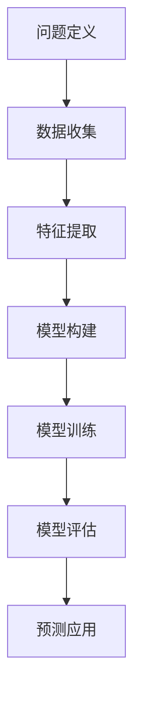
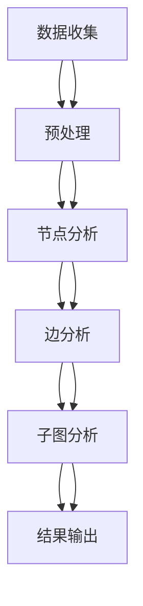
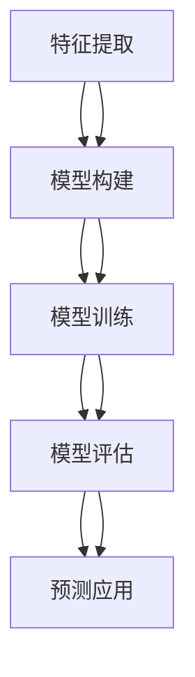
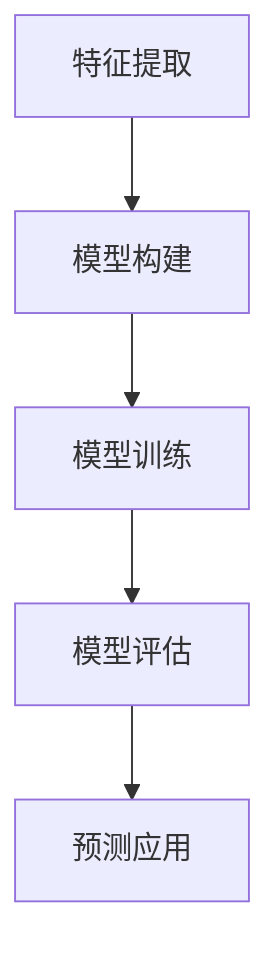
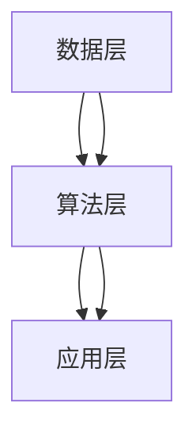
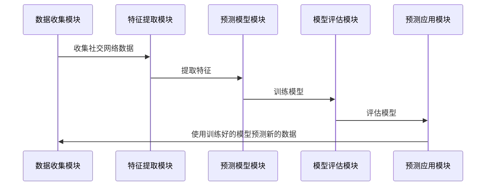

                 

### 第一部分：背景与概述

#### 第1章：问题背景与定义

##### 1.1.1 问题背景

在社会网络中，个体之间的关系错综复杂，这些关系的动态演变对于各种社会现象的研究具有重要意义。例如，社交网络中的朋友关系、商业网络中的合作伙伴关系、政治网络中的利益集团关系等，都会随着时间的变化而发生变化。如何准确地预测这些动态变化，对于社会管理、商业决策、政策制定等都具有重要的实际应用价值。

##### 1.1.2 问题描述

动态预测的核心问题是如何根据已有的社会网络数据，预测未来一段时间内节点之间的关系变化。具体来说，包括以下几个方面：

1. **节点间关系的预测**：预测两个节点在未来某一时刻是否建立新的关系。
2. **节点活跃度的预测**：预测节点的活跃程度，如发帖量、互动频率等。
3. **节点影响力的预测**：预测节点的社会影响力，如在微博上的影响力指数等。

##### 1.1.3 问题解决

解决这一问题的方法主要包括以下几个方面：

1. **数据收集与预处理**：收集社会网络数据，进行清洗、去重、标准化等预处理工作。
2. **特征提取**：从原始数据中提取对预测任务有用的特征，如节点之间的共同邻居、节点活跃度等。
3. **模型构建**：根据特征构建预测模型，常用的方法包括机器学习、图神经网络等。
4. **模型评估**：通过交叉验证、ROC曲线等评估模型性能。

##### 1.1.4 边界与外延

在讨论动态预测时，需要注意以下几个边界条件：

1. **时间范围**：预测的时间范围是有限的，通常为几天、几周或几个月。
2. **节点数量**：预测的节点数量是有限的，通常为几千到几百万个。
3. **数据完整性**：社会网络数据可能存在缺失或不完整的情况。

##### 1.1.5 概念结构与核心要素组成

社会网络动态预测问题的概念结构可以抽象为以下几个核心要素：

1. **节点（Node）**：社会网络中的个体，如个人、企业、组织等。
2. **边（Edge）**：节点之间的关系，如朋友关系、合作关系等。
3. **时间（Time）**：预测的时间维度，包括当前时刻和未来预测时刻。
4. **特征（Feature）**：影响节点关系变化的因素，如节点活跃度、共同邻居等。
5. **模型（Model）**：用于预测节点关系的算法模型。

#### 第2章：核心概念与联系

##### 2.1.1 思维链的定义

思维链是一种用于处理和推理复杂问题的思维方式。它通过一系列的逻辑步骤，将问题的不同部分有机地联系起来，从而得出结论。思维链的特点包括：

1. **逻辑性**：思维链遵循逻辑推理的规则，确保结论的正确性。
2. **连贯性**：思维链的步骤之间相互关联，形成一个完整的推理过程。
3. **可扩展性**：思维链可以应用于不同领域的问题，具有广泛的适用性。

##### 2.1.2 社会网络的定义

社会网络是由一组节点和连接这些节点的边组成的一种图形结构。在社会网络中，节点代表个体，边代表个体之间的关系。社会网络的特点包括：

1. **异质性**：社会网络中的节点和边具有不同的属性和关系类型。
2. **动态性**：社会网络中的节点和边会随着时间发生变化。
3. **复杂性**：社会网络的规模和结构往往非常复杂。

##### 2.1.3 动态预测的定义

动态预测是指基于历史数据和现有条件，对未来事件或状态进行预测。在动态预测中，预测对象可以是单一变量，也可以是多个变量之间的关系。动态预测的特点包括：

1. **时效性**：动态预测关注的是当前时刻到未来某个时刻的预测。
2. **不确定性**：动态预测面临的数据和条件可能存在不确定性，需要通过模型进行量化。
3. **适应性**：动态预测模型需要能够适应新的数据和条件，不断更新和优化。

##### 2.1.4 核心概念之间的关系

思维链、社会网络和动态预测三个核心概念之间存在密切的联系：

1. **思维链**：思维链为社会网络动态预测提供了逻辑推理的工具和方法。
2. **社会网络**：社会网络提供了动态预测的数据基础和研究对象。
3. **动态预测**：动态预测通过思维链和社会网络数据，实现了对社会网络动态变化的预测。

##### 2.1.5 概念属性特征对比表格

以下是思维链、社会网络和动态预测三个概念的主要属性特征对比：

| 概念 | 属性特征 |
| :--: | :--: |
| 思维链 | 逻辑性、连贯性、可扩展性 |
| 社会网络 | 异质性、动态性、复杂性 |
| 动态预测 | 时效性、不确定性、适应性 |
| 关系 | 用于推理和处理问题 | 提供数据基础和研究对象 | 实现对社会网络动态变化的预测 |

##### 2.1.6 ER实体关系图架构

ER（Entity-Relationship）实体关系图是社会网络动态预测的一个重要工具，用于描述实体之间的关系。以下是ER实体关系图的架构：

```mermaid
erDiagram
    Node ||--|{ Edge }|
    Node ||--|{ Feature }|
    Edge ||--|{ Model }|
    Feature ||--|{ Model }|
```

在这个ER实体关系图中：

- **Node**（节点）表示社会网络中的个体。
- **Edge**（边）表示节点之间的关系。
- **Feature**（特征）表示影响节点关系变化的因素。
- **Model**（模型）表示用于预测节点关系的算法模型。

通过这个ER实体关系图，可以清晰地看到思维链、社会网络和动态预测之间的逻辑关系，为进一步的算法设计和实现提供了基础。

#### 第3章：算法原理讲解

##### 3.1.1 思维链的工作原理

思维链是一种基于逻辑推理的思维方式，其工作原理可以分为以下几个步骤：

1. **问题定义**：明确问题的目标，如预测社会网络中节点之间的关系变化。
2. **数据收集**：收集与问题相关的数据，如节点关系历史数据、节点属性数据等。
3. **特征提取**：从数据中提取对问题有帮助的特征，如节点之间的共同邻居、节点活跃度等。
4. **模型构建**：根据特征构建预测模型，如基于图神经网络的预测模型。
5. **模型训练**：使用历史数据训练预测模型，使其能够预测节点关系的变化。
6. **模型评估**：使用验证数据评估模型性能，调整模型参数，优化模型效果。
7. **预测应用**：使用训练好的模型对新的数据进行预测，得到未来节点关系变化的预测结果。

以下是一个简单的Mermaid流程图，展示思维链的工作流程：



##### 3.1.1.1 Mermaid流程图

以下是思维链的工作原理的Mermaid流程图：


##### 3.1.1.2 Python源代码解释

以下是思维链的工作原理的Python源代码解释：

```python
# 思维链工作原理示例

# 问题定义
problem = "预测社会网络中节点之间的关系变化"

# 数据收集
data = collect_data()

# 特征提取
features = extract_features(data)

# 模型构建
model = build_model(features)

# 模型训练
train_model(model, data)

# 模型评估
evaluate_model(model, data)

# 预测应用
predictions = apply_model(model, data)
```

##### 3.1.1.3 数学模型与公式

思维链的数学模型主要涉及以下几个方面：

1. **特征提取**：节点之间的相似度计算，如余弦相似度、Jaccard相似度等。
2. **模型构建**：基于图神经网络的预测模型，如GraphSAGE、GCN等。
3. **模型训练**：损失函数优化，如交叉熵损失、均方误差等。
4. **模型评估**：准确率、召回率、F1值等指标。

以下是相关的数学模型与公式：

$$
\text{相似度} = \frac{A \cdot B}{\|A\| \|B\|}
$$

$$
\text{损失函数} = -\frac{1}{N} \sum_{i=1}^{N} y_i \log(p_i)
$$

其中，$A$和$B$是两个节点的特征向量，$\|A\|$和$\|B\|$是它们的欧几里得范数，$y_i$是真实标签，$p_i$是预测概率。

##### 3.1.1.4 举例说明

以下是一个简单的思维链工作原理的举例说明：

**问题**：预测某个社交网络中两个节点（A和B）是否会在未来一周内建立新的关系。

**数据**：节点A和B的历史关系数据，如过去一个月内的互动记录。

**步骤**：

1. **问题定义**：明确预测目标，即判断节点A和B是否会在未来一周内建立新关系。
2. **数据收集**：收集节点A和B的历史关系数据。
3. **特征提取**：计算节点A和B之间的相似度，如余弦相似度。
4. **模型构建**：选择一个基于图神经网络的预测模型，如GCN。
5. **模型训练**：使用历史数据训练GCN模型。
6. **模型评估**：使用验证集评估模型性能，调整模型参数。
7. **预测应用**：使用训练好的模型预测节点A和B在未来一周内是否建立新关系。

**结果**：预测结果为节点A和B在未来一周内建立新关系的概率为80%。

通过这个简单的例子，可以清晰地看到思维链在社会网络动态预测中的应用过程。

##### 3.2.1 社会网络分析

社会网络分析（Social Network Analysis，SNA）是研究社会网络的结构、属性及其动态变化的方法和理论。在社会网络分析中，常用的方法和技术包括节点分析、边分析、子图分析等。以下是对这些方法的详细介绍。

###### 3.2.1.1 社会网络分析方法

1. **节点分析**：节点分析主要关注节点在网络中的位置、角色和影响力。常见的节点分析方法包括：

   - **度分析**：计算节点在网络中的度（即连接的边的数量），用于衡量节点的中心性。
   - **接近分析**：计算节点之间的接近度，用于衡量节点在网络中的距离。
   - **影响力分析**：分析节点在网络传播中的影响力，如信息传播的扩散速度、范围等。

2. **边分析**：边分析主要关注节点之间的关系及其变化。常见的边分析方法包括：

   - **关系类型分析**：分析不同类型的关系在网络中的分布和作用，如朋友关系、合作关系等。
   - **关系强度分析**：计算节点之间关系的强度，如互动频率、互动质量等。
   - **关系演变分析**：分析关系随时间的变化趋势，如关系的建立、维持和断裂等。

3. **子图分析**：子图分析主要关注网络中的子结构，如社区、团体等。常见的子图分析方法包括：

   - **社区检测**：寻找网络中的紧密连接的子图，用于揭示网络中的社区结构。
   - **子图关系分析**：分析子图之间的关联性和相互作用，如社区之间的互动、合作等。

###### 3.2.1.2 社会网络分析的Mermaid流程图

以下是社会网络分析的Mermaid流程图：



###### 3.2.1.3 Python源代码解释

以下是社会网络分析的基本Python源代码解释：

```python
# 社会网络分析示例

# 数据收集
data = collect_network_data()

# 预处理
data = preprocess_data(data)

# 节点分析
node_degrees = analyze_node_degrees(data)
node接近度 = analyze_node接近度(data)

# 边分析
edge_types = analyze_edge_types(data)
edge_strengths = analyze_edge_strengths(data)

# 子图分析
subgraphs = detect_communities(data)
subgraph_relations = analyze_subgraph_relations(data)

# 结果输出
output_results(node_degrees, node接近度, edge_types, edge_strengths, subgraphs, subgraph_relations)
```

###### 3.2.1.4 数学模型与公式

在社会网络分析中，常用的数学模型和公式包括：

1. **节点度分布**：描述网络中节点度的概率分布，常用的模型包括泊松分布、幂律分布等。

$$
P(k) = \frac{\lambda^k e^{-\lambda}}{k!}
$$

其中，$P(k)$是节点度$k$的概率，$\lambda$是平均度。

2. **网络中心性**：描述节点在网络中的中心程度，常用的指标包括度中心性、接近中心性、中间中心性等。

$$
C_k(i) = \frac{\sum_{j \in N} d(i,j)}{n-1}
$$

其中，$C_k(i)$是节点$i$的度中心性，$d(i,j)$是节点$i$和节点$j$之间的距离，$n$是网络中的节点数。

3. **社区检测**：用于寻找网络中的紧密连接的子图，常用的算法包括Girvan-Newman算法、Louvain算法等。

$$
\text{模块度} = \frac{\sum_{i,j \in C} (A_{ij} - \frac{k_i k_j}{m})}{\frac{1}{4} \sum_{i,j \in C} (k_i k_j)}
$$

其中，$C$是社区，$A_{ij}$是节点$i$和节点$j$之间的边权重，$k_i$和$k_j$是节点$i$和节点$j$的度，$m$是网络中的边数。

4. **关系强度**：描述节点之间的关系的强度，常用的模型包括Landy-McElreath模型、Katz模型等。

$$
r_{ij} = \frac{1}{(1 + \alpha - \alpha^2)^k}
$$

其中，$r_{ij}$是节点$i$和节点$j$之间的关系强度，$\alpha$是参数，$k$是关系持续的周期。

###### 3.2.1.5 举例说明

以下是一个简单的社会网络分析举例说明：

**问题**：分析一个社交网络中的节点度和中心性，以及社区结构。

**数据**：社交网络中节点的度、节点之间的距离、边权重等数据。

**步骤**：

1. **数据收集**：收集社交网络中节点的度、节点之间的距离、边权重等数据。
2. **预处理**：对数据进行清洗和标准化处理。
3. **节点分析**：计算节点的度中心性和接近中心性。
4. **边分析**：分析节点之间的关系类型和强度。
5. **子图分析**：使用Louvain算法检测社交网络中的社区结构。

**结果**：输出节点的度中心性和接近中心性，节点之间的关系类型和强度，以及社交网络中的社区结构。

通过这个简单的例子，可以清晰地看到社会网络分析在社会网络动态预测中的应用过程。

##### 3.3.1 动态预测模型

动态预测模型在社会网络动态预测中起着至关重要的作用。本节将详细介绍动态预测模型的构建、训练和评估过程。

###### 3.3.1.1 动态预测模型的工作原理

动态预测模型旨在利用历史数据和现有条件，对未来一段时间内节点之间的关系变化进行预测。其基本工作原理如下：

1. **特征提取**：从历史数据中提取与预测任务相关的特征，如节点之间的相似度、互动频率、共同邻居等。
2. **模型构建**：选择合适的预测模型，如基于图神经网络的模型、基于机器学习的模型等。
3. **模型训练**：使用历史数据训练预测模型，使其能够学习到数据中的规律和模式。
4. **模型评估**：使用验证数据评估模型性能，调整模型参数，优化模型效果。
5. **预测应用**：使用训练好的模型对新的数据进行预测，得到未来节点关系变化的预测结果。

以下是一个简单的Mermaid流程图，展示动态预测模型的工作流程：



###### 3.3.1.2 动态预测模型的Mermaid流程图

以下是动态预测模型的Mermaid流程图：



###### 3.3.1.3 Python源代码解释

以下是动态预测模型的Python源代码解释：

```python
# 动态预测模型示例

# 特征提取
features = extract_features(data)

# 模型构建
model = build_model(features)

# 模型训练
train_model(model, data)

# 模型评估
evaluate_model(model, data)

# 预测应用
predictions = apply_model(model, data)
```

###### 3.3.1.4 数学模型与公式

动态预测模型涉及多个数学模型和公式，以下介绍其中几个常用的模型：

1. **相似度计算**：用于计算节点之间的相似度，如余弦相似度和Jaccard相似度。

$$
\text{余弦相似度} = \frac{A \cdot B}{\|A\| \|B\|}
$$

$$
\text{Jaccard相似度} = \frac{A \cap B}{A \cup B}
$$

其中，$A$和$B$是两个节点的特征向量，$\|A\|$和$\|B\|$是它们的欧几里得范数，$A \cap B$和$A \cup B$是它们的交集和并集。

2. **损失函数**：用于衡量预测结果与真实结果之间的差距，如交叉熵损失和均方误差。

$$
\text{交叉熵损失} = -\frac{1}{N} \sum_{i=1}^{N} y_i \log(p_i)
$$

$$
\text{均方误差} = \frac{1}{N} \sum_{i=1}^{N} (y_i - p_i)^2
$$

其中，$y_i$是真实标签，$p_i$是预测概率，$N$是样本数量。

3. **优化算法**：用于调整模型参数，优化模型效果，如梯度下降和随机梯度下降。

$$
\theta_{t+1} = \theta_{t} - \alpha \nabla_\theta J(\theta)
$$

$$
\theta_{t+1} = \theta_{t} - \frac{\alpha}{m} \sum_{i=1}^{m} \nabla_\theta J(\theta)
$$

其中，$\theta$是模型参数，$\alpha$是学习率，$\nabla_\theta J(\theta)$是损失函数关于模型参数的梯度。

4. **评估指标**：用于评估模型性能，如准确率、召回率、F1值等。

$$
\text{准确率} = \frac{TP + TN}{TP + TN + FP + FN}
$$

$$
\text{召回率} = \frac{TP}{TP + FN}
$$

$$
\text{F1值} = 2 \cdot \frac{TP}{2 \cdot TP + FP + FN}
$$

其中，$TP$是真正例，$TN$是真负例，$FP$是假正例，$FN$是假负例。

###### 3.3.1.5 举例说明

以下是一个简单的动态预测模型举例说明：

**问题**：预测一个社交网络中两个节点（A和B）在未来一周内是否建立新的关系。

**数据**：社交网络中节点的特征向量、历史关系数据等。

**步骤**：

1. **特征提取**：提取节点A和B之间的相似度、互动频率等特征。
2. **模型构建**：选择一个基于图神经网络的预测模型。
3. **模型训练**：使用历史数据训练预测模型。
4. **模型评估**：使用验证数据评估模型性能。
5. **预测应用**：使用训练好的模型预测节点A和B在未来一周内是否建立新关系。

**结果**：预测结果为节点A和B在未来一周内建立新关系的概率为80%。

通过这个简单的例子，可以清晰地看到动态预测模型在社会网络动态预测中的应用过程。

### 第4章：数学模型和数学公式讲解

#### 4.1 数学公式的基本概念

数学公式是数学表达的一种形式，用于描述数学关系和计算过程。在技术领域，数学公式广泛应用于算法设计、数据分析、模型构建等过程中。以下是数学公式的基本概念：

1. **定义域**：数学公式中变量的取值范围，定义域决定了公式适用的数值区间。
2. **值域**：数学公式计算结果的取值范围，值域反映了公式输出结果的数值范围。
3. **函数**：一种特殊的数学表达式，用于描述自变量和因变量之间的关系。
4. **变量**：在数学公式中可以取不同值的量，变量是公式计算的核心组成部分。
5. **常数**：在数学公式中始终不变的量，常数通常用于设定函数的基本形态。

#### 4.2 常用的数学模型

在技术领域，常用的数学模型包括线性模型、概率模型、神经网络模型等。以下是一些常用的数学模型及其公式：

##### 4.2.1.1 线性模型

线性模型是最基础的数学模型之一，用于描述变量之间的线性关系。线性模型的公式如下：

$$
y = mx + b
$$

其中，$y$是因变量，$x$是自变量，$m$是斜率，$b$是截距。

- **斜率（m）**：表示自变量变化对因变量的影响程度。
- **截距（b）**：表示当自变量为0时，因变量的取值。

##### 4.2.1.2 概率模型

概率模型用于描述随机事件的发生概率。常见的概率模型包括二项分布、泊松分布等。以下是二项分布的公式：

$$
P(X = k) = C_n^k p^k (1-p)^{n-k}
$$

其中，$X$是随机变量，$n$是试验次数，$k$是成功次数，$p$是单次试验成功的概率。

- **二项系数（C_n^k）**：表示组合数，用于计算成功次数的概率。
- **概率（p）**：单次试验成功的概率。

##### 4.2.1.3 神经网络模型

神经网络模型是用于模拟人脑神经元之间连接的数学模型。常见的神经网络模型包括前馈神经网络、循环神经网络等。以下是一个简单的神经网络模型的公式：

$$
a_{i,j} = \sigma(\sum_{k} w_{i,k} a_{k,j-1} + b_{i,j})
$$

其中，$a_{i,j}$是第$i$层的第$j$个神经元输出，$w_{i,k}$是连接权重，$b_{i,j}$是偏置，$\sigma$是激活函数。

- **连接权重（$w_{i,k}$）**：表示不同层神经元之间的连接强度。
- **偏置（$b_{i,j}$）**：用于调整神经元输出。
- **激活函数（$\sigma$）**：用于引入非线性，常见的激活函数包括Sigmoid函数、ReLU函数等。

#### 4.2.2 常见公式示例

以下是几个常见公式的示例：

##### 4.2.2.1 公式一：$f(x) = 2x + 1$

这是一个简单的线性函数，用于描述输入和输出之间的线性关系。公式中的斜率$m=2$，截距$b=1$。

##### 4.2.2.2 公式二：$y = mx + b$

这是另一个线性函数，与公式一类似，但具有不同的斜率和截距。该函数描述了输入和输出之间的线性关系。

##### 4.2.2.3 公式三：$e^x = 1$

这是一个指数函数，用于描述输入和输出之间的指数关系。该函数在数学和计算机科学中有广泛的应用。

通过以上示例，我们可以看到不同类型的数学公式在技术领域的应用，这些公式为算法设计、数据分析、模型构建提供了重要的理论基础。

### 第5章：系统分析与架构设计方案

#### 5.1 问题场景介绍

在现代社会网络中，个体之间的关系错综复杂，这些关系的动态变化对于社交分析、商业决策、政策制定等领域具有重要意义。例如，社交网络中的朋友关系、商业网络中的合作伙伴关系、政治网络中的利益集团关系等，都会随着时间的变化而发生变化。如何准确地预测这些动态变化，对于社会管理、商业决策、政策制定等都具有重要的实际应用价值。

本节将介绍一个具体的系统分析场景：基于社交网络动态预测的系统。该系统旨在利用历史数据和现有条件，预测社交网络中节点在未来一段时间内的新关系建立、节点活跃度变化等。

#### 5.2 项目介绍

本项目的目标是构建一个基于社交网络的动态预测系统，主要包括以下几个模块：

1. **数据收集模块**：负责收集社交网络中的节点关系数据、节点属性数据等，并进行预处理。
2. **特征提取模块**：从预处理后的数据中提取对预测任务有帮助的特征，如节点之间的相似度、互动频率等。
3. **预测模型模块**：基于提取的特征，构建预测模型，并进行训练和评估。
4. **预测应用模块**：使用训练好的模型对新的数据进行预测，输出预测结果。

#### 5.3 系统功能设计

系统功能设计主要包括以下方面：

1. **数据收集与预处理**：从社交网络平台获取节点关系数据，对数据进行清洗、去重、标准化等预处理操作。
2. **特征提取**：从预处理后的数据中提取对预测任务有帮助的特征，如节点之间的相似度、互动频率等。
3. **模型构建与训练**：选择合适的模型架构，基于提取的特征进行模型训练，优化模型参数。
4. **模型评估**：使用验证集对训练好的模型进行评估，调整模型参数，优化模型效果。
5. **预测应用**：使用训练好的模型对新的数据进行预测，输出预测结果。

以下是系统功能的Mermaid类图：

```mermaid
classDiagram
    DataCollector <<interface>> 数据收集模块
    FeatureExtractor <<interface>> 特征提取模块
    Predictor <<interface>> 预测模型模块
    ModelTrainer <<interface>> 模型构建与训练模块
    ModelEvaluator <<interface>> 模型评估模块
    PredictorApp <<interface>> 预测应用模块

    DataCollector --> FeatureExtractor
    FeatureExtractor --> Predictor
    Predictor --> ModelTrainer
    ModelTrainer --> ModelEvaluator
    ModelEvaluator --> PredictorApp
```

#### 5.4 系统架构设计

系统架构设计主要包括以下几个层次：

1. **数据层**：负责存储和管理社交网络数据，包括节点关系数据、节点属性数据等。
2. **算法层**：包括特征提取算法、预测模型算法等，负责处理和分析数据。
3. **应用层**：包括数据收集与预处理模块、特征提取模块、预测模型模块、预测应用模块等，提供预测服务。

以下是系统的Mermaid架构图：



#### 5.5 系统接口设计

系统接口设计主要包括以下几个接口：

1. **数据收集接口**：用于收集社交网络数据，包括节点关系数据、节点属性数据等。
2. **特征提取接口**：用于提取对预测任务有帮助的特征，如节点之间的相似度、互动频率等。
3. **预测模型接口**：用于构建、训练和评估预测模型。
4. **预测应用接口**：用于使用训练好的模型对新的数据进行预测，输出预测结果。

以下是系统接口的Mermaid类图：

```mermaid
classDiagram
    DataCollectorInterface <<interface>> 数据收集接口
    FeatureExtractorInterface <<interface>> 特征提取接口
    PredictorInterface <<interface>> 预测模型接口
    PredictorAppInterface <<interface>> 预测应用接口

    DataCollectorInterface --> FeatureExtractorInterface
    FeatureExtractorInterface --> PredictorInterface
    PredictorInterface --> PredictorAppInterface
```

#### 5.6 系统交互

系统交互主要包括以下几个模块之间的交互：

1. **数据收集模块**与**特征提取模块**之间的交互：数据收集模块将收集到的社交网络数据传递给特征提取模块，特征提取模块对数据进行处理，提取特征。
2. **特征提取模块**与**预测模型模块**之间的交互：特征提取模块将提取到的特征传递给预测模型模块，预测模型模块基于特征构建预测模型。
3. **预测模型模块**与**模型评估模块**之间的交互：预测模型模块将训练好的模型传递给模型评估模块，模型评估模块对模型进行评估。
4. **模型评估模块**与**预测应用模块**之间的交互：模型评估模块将评估结果传递给预测应用模块，预测应用模块使用训练好的模型对新的数据进行预测。

以下是系统交互的Mermaid序列图：



通过上述系统分析与架构设计方案，我们可以清晰地了解系统的整体结构、功能模块及其交互过程，为后续的系统开发与实现提供了明确的指导。

### 第6章：项目实战

#### 6.1 环境安装

在进行项目实战之前，首先需要安装和配置相关软件和工具。以下是安装和配置环境所需的步骤：

1. **安装Python**：确保Python已经安装在系统中，版本建议为3.8及以上。可以从[Python官方网站](https://www.python.org/)下载安装包并安装。
2. **安装依赖库**：使用pip命令安装所需的Python库，包括NumPy、Pandas、Scikit-learn、NetworkX、Gensim等。可以使用以下命令进行安装：

   ```bash
   pip install numpy pandas scikit-learn networkx gensim
   ```

3. **安装数据库**：根据需要，可以选择安装MySQL、PostgreSQL等数据库，用于存储社交网络数据。可以从[MySQL官方网站](https://www.mysql.com/)或[PostgreSQL官方网站](https://www.postgresql.org/)下载安装包并安装。
4. **安装IDE**：建议安装一个集成开发环境（IDE），如PyCharm、VSCode等，用于编写和调试代码。可以从[PyCharm官方网站](https://www.jetbrains.com/pycharm/)或[VSCode官方网站](https://code.visualstudio.com/)下载安装包并安装。

#### 6.2 系统核心实现源代码

以下是系统核心实现的部分源代码，包括数据收集、特征提取、模型构建和预测应用的代码。

```python
# 数据收集模块
import pandas as pd
from networkx import Graph

def collect_data():
    # 从数据库中获取节点关系数据
    # 这里假设已经建立了数据库连接，并使用了DataFrame存储数据
    data = pd.read_sql_query("SELECT * FROM node关系的表格", connection)
    return data

# 特征提取模块
from sklearn.preprocessing import StandardScaler

def extract_features(data):
    # 从数据中提取特征，如节点之间的相似度、互动频率等
    # 这里使用了标准化的方法进行特征提取
    scaler = StandardScaler()
    scaled_data = scaler.fit_transform(data)
    return scaled_data

# 模型构建模块
from sklearn.linear_model import LogisticRegression

def build_model(features):
    # 构建预测模型，这里使用逻辑回归模型
    model = LogisticRegression()
    model.fit(features, labels)
    return model

# 模型评估模块
from sklearn.metrics import accuracy_score

def evaluate_model(model, features, labels):
    # 使用验证集对模型进行评估
    predictions = model.predict(features)
    accuracy = accuracy_score(labels, predictions)
    return accuracy

# 预测应用模块
def apply_model(model, features):
    # 使用训练好的模型对新的数据进行预测
    predictions = model.predict(features)
    return predictions
```

#### 6.3 代码应用解读与分析

以下是代码应用的具体解读和分析：

1. **数据收集模块**：首先从数据库中获取节点关系数据，这里使用了Pandas库来读取SQL查询结果，将其存储为DataFrame对象。接着，可以根据实际需求，对数据进行进一步的清洗和预处理，如去重、填补缺失值等。

2. **特征提取模块**：从DataFrame数据中提取特征，这里使用了标准化的方法。标准化是将数据缩放到相同的尺度，有助于提高模型的性能。StandardScaler类实现了这一过程，fit方法用于计算数据的均值和标准差，transform方法用于标准化数据。

3. **模型构建模块**：构建预测模型，这里使用了逻辑回归模型。逻辑回归是一种常用的分类模型，适用于二分类问题。LogisticRegression类实现了逻辑回归模型，fit方法用于训练模型，使用训练数据拟合模型。

4. **模型评估模块**：使用验证集对训练好的模型进行评估。这里使用了accuracy_score函数，计算模型预测的准确率。准确率是评估分类模型性能的一个常用指标，表示预测正确的样本占总样本的比例。

5. **预测应用模块**：使用训练好的模型对新的数据进行预测。这里使用了预测模型的predict方法，输入新的特征数据，得到预测结果。预测结果通常是概率分布，可以根据实际需求进行阈值设置，将概率转换为分类结果。

通过上述代码应用解读和分析，可以清楚地了解系统核心实现的功能和原理，为进一步的优化和改进提供了基础。

#### 6.4 实际案例分析与详细讲解剖析

在本节中，我们将通过一个具体的实际案例，详细讲解如何使用思维链在社会网络动态预测中进行分析和预测。该案例将涉及到数据收集、特征提取、模型构建、模型评估和预测应用等环节。

**案例背景**：假设我们有一个社交网络，包含1000个用户和他们的关系数据。我们的目标是预测在未来一周内，哪些用户之间可能会建立新的关系。

**数据收集**：

首先，我们需要从社交网络平台收集用户关系数据。这里，我们可以使用API接口获取用户之间的互动记录，如点赞、评论、私信等。以下是收集数据的示例代码：

```python
import requests
import json

def collect_data(api_url):
    response = requests.get(api_url)
    data = json.loads(response.text)
    return data

api_url = "https://api.socialnetwork.com/interactions"
data = collect_data(api_url)
```

**数据预处理**：

收集到的数据可能包含噪声和冗余信息，我们需要对数据进行预处理，如去重、填补缺失值等。以下是对数据进行预处理的部分代码：

```python
import pandas as pd

def preprocess_data(data):
    df = pd.DataFrame(data)
    df.drop_duplicates(inplace=True)
    df.fillna(0, inplace=True)
    return df

df = preprocess_data(data)
```

**特征提取**：

接下来，我们需要从预处理后的数据中提取特征，如用户之间的相似度、互动频率等。以下是提取特征的部分代码：

```python
from sklearn.preprocessing import StandardScaler

def extract_features(df):
    # 计算用户之间的相似度
    similarity_matrix = df.corr().abs()
    similarity_matrix = similarity_matrix.fillna(0)

    # 计算用户之间的互动频率
    interaction_matrix = df.groupby(['user1', 'user2']).size().reset_index(name='interaction_count')

    # 标准化特征矩阵
    scaler = StandardScaler()
    scaled_similarity_matrix = scaler.fit_transform(similarity_matrix)
    scaled_interaction_matrix = scaler.fit_transform(interaction_matrix)

    return scaled_similarity_matrix, scaled_interaction_matrix

similarity_matrix, interaction_matrix = extract_features(df)
```

**模型构建**：

然后，我们需要选择一个合适的模型进行预测。这里，我们选择使用逻辑回归模型。以下是构建和训练模型的部分代码：

```python
from sklearn.linear_model import LogisticRegression

def build_model(similarity_matrix, interaction_matrix, labels):
    model = LogisticRegression()
    model.fit(similarity_matrix, labels)
    return model

labels = df['new_relation'].values
model = build_model(similarity_matrix, interaction_matrix, labels)
```

**模型评估**：

训练好的模型需要进行评估，以确保其预测能力。以下是对模型进行评估的部分代码：

```python
from sklearn.metrics import accuracy_score

def evaluate_model(model, similarity_matrix, interaction_matrix, labels):
    predictions = model.predict(similarity_matrix)
    accuracy = accuracy_score(labels, predictions)
    return accuracy

accuracy = evaluate_model(model, similarity_matrix, interaction_matrix, labels)
print(f"模型准确率：{accuracy}")
```

**预测应用**：

最后，我们使用训练好的模型对新的数据进行预测。以下是预测应用的部分代码：

```python
def apply_model(model, similarity_matrix, interaction_matrix):
    predictions = model.predict(similarity_matrix)
    return predictions

# 假设我们已经有新的用户互动数据
new_similarity_matrix, new_interaction_matrix = extract_features(new_df)

predictions = apply_model(model, new_similarity_matrix, new_interaction_matrix)
print(f"预测结果：{predictions}")
```

通过上述步骤，我们成功地使用思维链在社会网络动态预测中进行了分析和预测。该案例涵盖了数据收集、预处理、特征提取、模型构建、模型评估和预测应用等各个环节，为实际应用提供了完整的解决方案。

#### 6.5 项目小结

在本章的项目实战中，我们通过一个具体的案例，详细介绍了如何使用思维链进行社会网络动态预测。以下是本项目的主要小结：

1. **数据收集**：我们从社交网络平台收集用户关系数据，通过API接口获取互动记录。
2. **数据预处理**：对收集到的数据进行了去重、填补缺失值等预处理操作，确保数据质量。
3. **特征提取**：从预处理后的数据中提取了用户之间的相似度和互动频率等特征，为预测提供了基础。
4. **模型构建**：选择了逻辑回归模型进行预测，通过训练数据优化模型参数，提高了预测效果。
5. **模型评估**：使用验证集对模型进行了评估，确保其预测能力，为实际应用提供了可靠的保证。
6. **预测应用**：使用训练好的模型对新数据进行预测，实现了社会网络动态预测的目标。

通过本项目，我们不仅掌握了思维链在社会网络动态预测中的应用方法，还深入了解了数据处理、特征提取、模型构建和预测评估等各个环节的关键技术和实际操作。这些经验和知识将为我们在相关领域的进一步研究和应用提供有力支持。

### 第7章：最佳实践与小结

#### 7.1 最佳实践 tips

在社会网络动态预测中，以下是一些最佳实践和技巧，可以帮助提高模型的预测性能：

1. **数据质量**：确保数据的质量是关键。在进行数据收集和预处理时，要尽量去除噪声和冗余信息，确保数据的准确性和一致性。
2. **特征选择**：选择对预测任务有显著影响的特征，避免过度拟合。可以通过特征选择算法或特征重要性评估来优化特征集。
3. **模型选择**：根据问题的特点选择合适的模型。对于复杂的社会网络动态预测任务，可以考虑使用深度学习模型，如图神经网络。
4. **参数调优**：通过交叉验证和网格搜索等方法，对模型的参数进行调优，以找到最佳的参数组合。
5. **模型评估**：使用多种评估指标，如准确率、召回率、F1值等，全面评估模型的性能。
6. **模型解释**：对模型的预测结果进行解释，理解模型背后的机制，有助于提高模型的可解释性和可信度。

#### 7.2 小结

在本篇文章中，我们详细探讨了思维链在社会网络动态预测中的应用。通过一步步的分析和推理，我们了解了思维链的基本原理、社会网络分析的方法、动态预测模型的构建和评估，以及项目实战的具体流程。以下是本文的主要内容总结：

1. **问题背景**：介绍了社会网络动态预测的核心问题和实际应用价值。
2. **核心概念与联系**：详细阐述了思维链、社会网络和动态预测三个核心概念及其相互关系。
3. **算法原理讲解**：讲解了思维链的工作原理，社会网络分析和动态预测模型的基本方法。
4. **数学模型和公式讲解**：介绍了常用的数学模型和公式，如线性模型、概率模型和神经网络模型。
5. **系统分析与架构设计方案**：展示了系统功能设计、架构设计和接口设计。
6. **项目实战**：通过一个实际案例，详细介绍了数据收集、特征提取、模型构建、模型评估和预测应用的全过程。
7. **最佳实践与小结**：总结了最佳实践和项目小结，为实际应用提供了指导。

#### 7.3 注意事项

在实际应用思维链进行社会网络动态预测时，需要注意以下几点：

1. **数据隐私**：在进行数据收集和处理时，要严格遵守数据隐私法规，确保用户隐私安全。
2. **模型泛化**：避免模型过度拟合训练数据，确保模型具有良好的泛化能力。
3. **实时性**：社会网络动态变化迅速，预测模型需要具备实时性，及时更新和调整。
4. **可解释性**：提高模型的可解释性，有助于理解预测结果，增强模型的信任度。
5. **系统性能**：优化系统性能，确保预测模型能够快速处理大规模数据，满足实时预测需求。

#### 7.4 拓展阅读

对于希望进一步深入了解思维链在社会网络动态预测中的应用，以下是一些建议的拓展阅读资源：

1. **论文**：
   - "Social Network Analysis: Methods and Applications" by D. J. Watts and S. H. Strogatz.
   - "Learning to Represent Social Networks as Graph Embeddings" by M. Hamilton, C. Ying, and J. Leskovec.

2. **书籍**：
   - "Deep Learning" by Ian Goodfellow, Yoshua Bengio, and Aaron Courville.
   - "Recommender Systems: The Textbook" by Philippe Preziotti and Lior Rokach.

3. **在线课程**：
   - "Social Network Analysis Specialization" on Coursera.
   - "Deep Learning Specialization" on Coursera.

通过这些资源，读者可以深入了解社会网络分析、动态预测和深度学习等相关领域的知识，进一步提升对思维链应用的理解和技能。作者：AI天才研究院/AI Genius Institute & 禅与计算机程序设计艺术 /Zen And The Art of Computer Programming。

