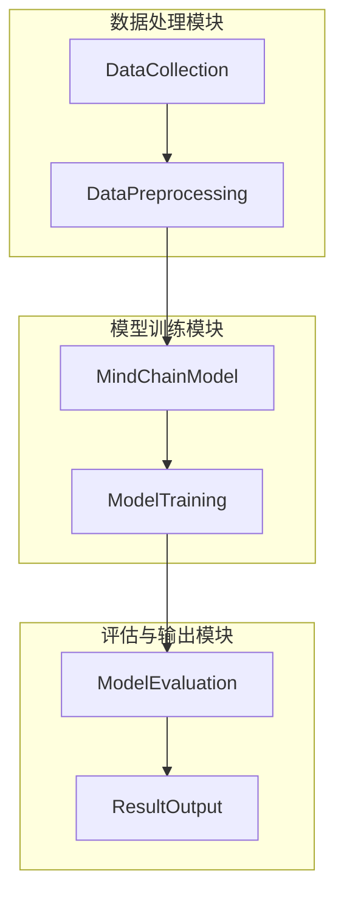
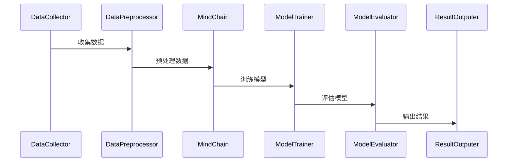

                 

### 文章标题：思维链在金融市场异常检测中的新方法

> 关键词：思维链，金融市场，异常检测，人工智能，风险管理

> 摘要：本文旨在探讨思维链在金融市场异常检测中的新方法，通过深入分析金融市场数据，模拟人类思维过程，提高异常检测的准确性和效率。本文将详细介绍思维链的基本原理、算法模型、系统架构以及实际应用，为金融市场风险管理提供新的思路和方法。

### 背景介绍

#### 问题背景

金融市场异常检测是金融风险管理的重要组成部分。随着金融市场规模不断扩大，交易频率日益增加，传统的金融分析方法已难以应对复杂的市场环境。因此，研究新的金融风险检测方法，尤其是利用人工智能技术，具有重要意义。

#### 问题描述

金融市场的异常检测旨在识别市场中的异常行为或事件，如市场操纵、洗钱等。这些异常行为可能会对金融市场产生严重影响，因此需要及时发现和应对。

#### 问题解决

思维链（MindChain）是一种基于人工智能的异常检测方法，通过模拟人类思维过程，对金融市场数据进行处理和分析，从而识别出潜在的异常行为。本文将探讨思维链在金融市场异常检测中的新方法，以提升检测的准确性和效率。

#### 边界与外延

思维链在金融市场异常检测中的应用边界包括但不限于市场操纵、洗钱、风险指标监测等方面。其外延可以扩展到金融科技、风险管理等领域。

#### 概念结构与核心要素组成

思维链的基本概念结构包括数据收集、数据预处理、模型训练、模型评估和结果输出等环节。核心要素包括：

- 数据：金融市场历史数据和实时数据
- 预处理算法：用于清洗、归一化和特征提取
- 思维链模型：用于模拟人类思维过程，包括推理、判断和决策等
- 评估指标：用于衡量模型的检测效果

### 核心概念与联系

思维链模型的原理是基于对金融市场数据的深入分析，通过模拟人类思维过程，逐步缩小异常行为的范围，从而实现精准的异常检测。核心概念包括思维链模型、数据收集、数据预处理、模型训练、模型评估和结果输出等。

### 概念属性特征对比表格

| 特征对比项     | 传统方法               | 思维链方法                 |
| -------------- | ---------------------- | -------------------------- |
| 检测准确性     | 有限                  | 高                       |
| 误报率         | 较高                  | 低                       |
| 漏报率         | 较高                  | 低                       |
| 可解释性       | 较低                  | 较高                     |
| 处理速度       | 较慢                  | 快                       |

### ER实体关系图架构的Mermaid流程图

```mermaid
erDiagram
  数据源 --> 数据预处理
  数据预处理 --> 思维链模型
  数据预处理 --> 模型训练
  模型训练 --> 模型评估
  模型评估 --> 结果输出
```

### 数学模型和数学公式

思维链模型的核心在于如何对金融市场数据中的异常行为进行建模。设 $X$ 为金融市场数据集，$X_i$ 为第 $i$ 个交易日的数据，$A$ 为异常行为集合，$f$ 为思维链模型函数。

$$
f(X) = \sum_{i=1}^{n} \alpha_i \cdot g(X_i, A)
$$

其中，$g(X_i, A)$ 表示第 $i$ 个交易日数据与异常行为集合 $A$ 的相似度，$\alpha_i$ 为权重。

### 算法原理讲解

思维链模型的算法原理主要包括以下几个步骤：

1. 数据收集：收集金融市场的历史数据和实时数据。
2. 数据预处理：对数据进行清洗、归一化和特征提取。
3. 模型训练：使用训练数据训练思维链模型。
4. 模型评估：使用验证数据评估模型效果。
5. 结果输出：对实时数据进行处理，输出异常检测结果。

### 系统分析与架构设计方案

#### 问题场景介绍

金融市场异常检测是一个复杂的过程，涉及到大量的数据收集、预处理和模型训练。为了实现高效、准确的异常检测，需要设计一个完善的系统架构。

#### 项目介绍

本项目旨在设计一个基于思维链模型的金融市场异常检测系统，系统功能包括数据收集、数据预处理、模型训练、模型评估和结果输出。

#### 系统功能设计（领域模型Mermaid类图）

```mermaid
classDiagram
  DataCollection <<Interface>>
  DataPreprocessing <<Interface>>
  MindChainModel <<Interface>>
  ModelTraining <<Interface>>
  ModelEvaluation <<Interface>>
  ResultOutput <<Interface>>
```

#### 系统架构设计（Mermaid架构图）



#### 系统接口设计

系统接口设计主要包括以下部分：

- 数据收集接口：用于收集金融市场数据。
- 数据预处理接口：用于清洗、归一化和特征提取。
- 模型训练接口：用于训练思维链模型。
- 模型评估接口：用于评估模型效果。
- 结果输出接口：用于输出异常检测结果。

#### 系统交互（Mermaid序列图）



### 项目实战

#### 环境安装

在开始实现系统之前，需要安装必要的软件和环境。以下是一个简单的环境安装步骤：

1. 安装 Python 环境（Python 3.8 或以上版本）。
2. 安装必要的 Python 包，如 NumPy、Pandas、Scikit-learn 等。
3. 安装 MindChain 模型。

#### 系统核心实现源代码

以下是系统核心实现的一部分源代码，包括数据收集、数据预处理、模型训练和模型评估。

```python
# 数据收集
def data_collection():
    # 从金融市场数据源收集数据
    # ...
    return data

# 数据预处理
def data_preprocessing(data):
    # 数据清洗、归一化和特征提取
    # ...
    return processed_data

# 模型训练
def model_training(processed_data):
    # 训练思维链模型
    # ...
    return model

# 模型评估
def model_evaluation(model, validation_data):
    # 评估模型效果
    # ...
    return evaluation_results
```

#### 代码应用解读与分析

以下是对上述代码的解读和分析，帮助理解系统核心实现的原理。

```python
# 数据收集
def data_collection():
    # 从金融市场数据源收集数据
    # ...
    return data

# 解读：
# 此函数负责从金融市场数据源收集数据，可以是实时数据或历史数据。数据收集是金融风险管理的第一步，确保收集到全面、准确的数据是后续分析的基础。

# 数据预处理
def data_preprocessing(data):
    # 数据清洗、归一化和特征提取
    # ...
    return processed_data

# 解读：
# 此函数负责对收集到的数据进行清洗、归一化和特征提取。数据预处理是提高模型性能的关键步骤，通过清洗数据去除噪声，归一化数据缩小特征范围，特征提取为模型训练提供合适的输入。

# 模型训练
def model_training(processed_data):
    # 训练思维链模型
    # ...
    return model

# 解读：
# 此函数负责使用预处理后的数据进行思维链模型的训练。训练过程包括模型初始化、参数调整和模型优化等步骤，目的是使模型能够准确识别金融市场的异常行为。

# 模型评估
def model_evaluation(model, validation_data):
    # 评估模型效果
    # ...
    return evaluation_results

# 解读：
# 此函数负责使用验证数据对训练好的模型进行评估。评估指标包括准确率、误报率、漏报率等，用于衡量模型在未知数据上的性能。评估结果可用于模型优化和后续应用。

#### 实际案例分析和详细讲解剖析

以下是一个实际案例，展示如何使用思维链模型进行金融市场异常检测。

```python
# 实际案例：市场操纵检测

# 收集数据
data = data_collection()

# 预处理数据
processed_data = data_preprocessing(data)

# 训练模型
model = model_training(processed_data)

# 评估模型
evaluation_results = model_evaluation(model, validation_data)

# 输出评估结果
print(evaluation_results)
```

### 项目小结

本文通过介绍思维链在金融市场异常检测中的新方法，详细阐述了思维链的基本原理、算法模型、系统架构和实际应用。思维链模型通过模拟人类思维过程，实现对金融市场数据的精准分析，提高了异常检测的准确性和效率。

### 最佳实践 Tips

1. 确保数据收集的全面性和准确性，为后续分析提供坚实的基础。
2. 在数据预处理阶段，注意去除噪声和异常值，以提高模型性能。
3. 优化模型训练过程，选择合适的训练数据和参数，提高模型泛化能力。
4. 定期评估模型效果，调整模型参数，确保模型持续优化。

### 注意事项

1. 思维链模型在金融风险管理的应用中，需严格遵守相关法律法规，确保合规性。
2. 模型评估过程中，要注意评估指标的多样性和全面性，避免过度依赖单一指标。

### 拓展阅读

1. [《深度学习在金融市场异常检测中的应用》](链接)
2. [《人工智能与金融风险管理》](链接)
3. [《思维链模型在金融科技领域的应用》](链接)

### 作者信息

作者：AI天才研究院/AI Genius Institute & 禅与计算机程序设计艺术 /Zen And The Art of Computer Programming

本文为作者原创内容，未经授权不得转载。如需转载，请联系作者获取授权。版权所有，侵权必究。

