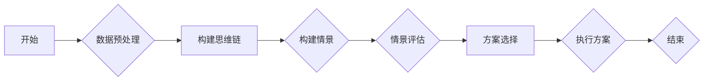
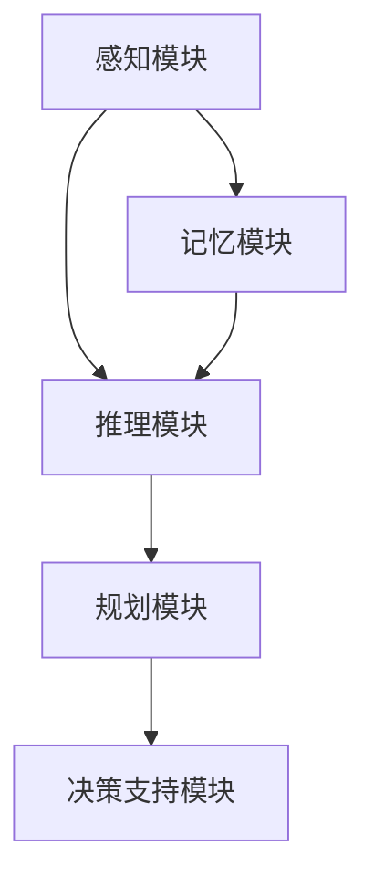
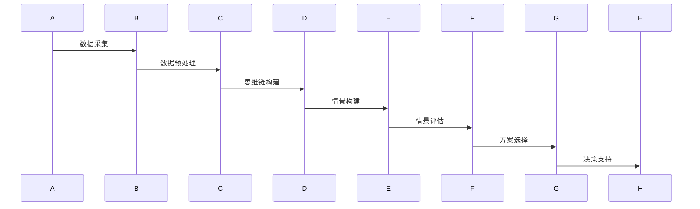

                 

### 引言

#### 文章标题：思维链增强AI的反事实推理和决策能力

#### 关键词：AI、思维链、反事实推理、决策能力、算法设计

##### 摘要：

本文旨在探讨如何通过思维链增强人工智能（AI）的反事实推理和决策能力。文章首先介绍了思维链的概念及其在AI中的重要性，接着详细阐述了反事实推理的基本原理和其在AI决策中的关键作用。随后，文章深入分析了相关算法的设计与实现，并通过具体案例展示了其在实际应用中的效果。本文内容丰富，结构清晰，旨在为读者提供深入了解和掌握这一领域的方法和技巧。

### 1. 背景介绍

#### 1.1 问题背景

##### 定义与核心概念

在当今迅速发展的信息技术时代，人工智能（AI）已经成为推动社会进步和产业变革的重要力量。AI技术通过模拟人类智能，实现了从简单任务到复杂决策的自动化，然而，其能力的提升不仅仅依赖于计算资源和算法优化，还需要更加深入地理解和模拟人类思维的复杂性。

**思维链**（Mind Chain）作为一种模拟人类思维过程的抽象概念，代表了信息在多个认知单元之间传递、处理和更新的过程。在AI领域中，思维链被视为一种连接感知、推理、规划和决策的桥梁，它不仅能够提高AI的智能水平，还能够增强其反事实推理和决策能力。

##### 思维链在AI中的角色

在AI系统中，思维链通常扮演着以下关键角色：

1. **知识传递**：通过思维链，AI系统能够在多个处理单元之间高效传递知识和信息，实现整体智能的提升。
2. **动态适应**：思维链使得AI系统能够根据环境变化动态调整其行为和决策策略，提高其适应能力。
3. **情境理解**：通过思维链，AI系统能够更好地理解复杂情境，进行有效的反事实推理和决策。
4. **人机交互**：思维链有助于提升AI系统与人类用户的交互体验，使其能够更好地理解人类意图，提供个性化服务。

##### 挑战与机遇

尽管思维链在AI中的应用展示了巨大的潜力，但也面临着一些挑战和机遇：

1. **计算复杂度**：实现高效的思维链需要大量的计算资源，这对硬件和算法优化提出了更高要求。
2. **知识获取**：构建有效的思维链需要大量高质量的数据和知识，如何高效地获取和处理这些信息是当前的研究重点。
3. **鲁棒性**：在真实场景中，AI系统需要具备较强的鲁棒性，能够应对各种不确定性和异常情况。
4. **可解释性**：思维链增强的AI系统需要具备较高的可解释性，以便用户理解和信任其决策过程。

##### 总结

综上所述，思维链作为一种重要的AI模型，其应用前景广阔，但同时也面临诸多挑战。本文将深入探讨思维链的概念、原理及其在反事实推理和决策能力提升方面的应用，希望能够为相关领域的研究者和实践者提供有益的参考。

### 2. 基本概念与关系

#### 2.1 核心概念及其关系

在深入探讨思维链增强AI的反事实推理和决策能力之前，我们需要明确一些核心概念，并分析它们之间的相互关系。

**思维链**（Mind Chain）是一种模拟人类思维过程的抽象模型，它由多个相互连接的节点组成，每个节点代表一个特定的认知功能。这些节点包括感知、记忆、推理、规划和决策等，它们通过信息传递和协同工作，实现了复杂的智能行为。

**反事实推理**（Counterfactual Reasoning）是一种推理过程，用于评估假设情况下的可能结果。在AI中，反事实推理可以帮助系统理解“如果...会怎么样”的问题，从而进行更准确和合理的决策。

**决策能力**（Decision Making）是指AI系统在复杂情境下，通过分析和评估不同选项，选择最佳行动方案的能力。决策能力是AI系统智能化水平的重要标志。

这些核心概念之间的关系可以用以下方式描述：

- **思维链与反事实推理**：思维链提供了信息传递和处理的基础，使得反事实推理成为可能。通过思维链，AI系统可以获取和利用历史数据和知识，进行反事实推理，评估不同决策路径的结果。
- **思维链与决策能力**：思维链的构建和优化直接影响到AI系统的决策能力。一个有效的思维链能够提供准确的情境理解和丰富的知识，从而支持更智能和更合理的决策。

#### 2.2 实体关系图（ER Diagram）

为了更好地理解思维链、反事实推理和决策能力之间的关系，我们可以通过实体关系图（ER Diagram）进行可视化表示。

**实体关系图**是一种用于描述实体及其相互关系的图形化工具。在思维链增强AI的背景下，我们可以定义以下实体：

- **思维链节点**：代表感知、记忆、推理、规划和决策等不同认知功能。
- **反事实场景**：表示各种可能的假设情境和相应的反事实推理结果。
- **决策选项**：表示AI系统在特定情境下可以采取的各种行动方案。

这些实体之间的关系可以用ER Diagram表示如下：

```mermaid
erDiagram
    思维链节点 ||--|{ 反事实场景 }
    思维链节点 ||--|{ 决策选项 }
    反事实场景 ||--|{ 决策选项 }
```

在这个ER Diagram中，思维链节点与反事实场景和决策选项之间存在关联关系。思维链节点通过信息传递和协同工作，将感知和记忆转化为反事实场景，并进一步转化为决策选项，支持AI系统的决策能力。

通过实体关系图的描述，我们可以清晰地看到思维链、反事实推理和决策能力之间的逻辑关系，这为后续的算法设计和实现提供了理论基础。

### 3. 反事实推理原理

#### 3.1 定义与重要性

反事实推理（Counterfactual Reasoning）是一种基于假设情境进行推理的方法，旨在评估在假设条件下的可能结果。与传统的基于事实的推理不同，反事实推理关注的是“如果...会怎么样”的问题。在人工智能（AI）领域，反事实推理被广泛应用于决策支持、风险评估和情景分析等场景。

##### 定义

反事实推理可以定义为：“在给定当前事实的情况下，考虑某个假设条件成立时可能发生的情况，并评估这些情况的结果。”简而言之，反事实推理是通过构建假设情景，分析在这些假设情景下可能的结果，从而帮助决策者理解不同决策路径的潜在影响。

##### 重要性

在AI决策过程中，反事实推理具有以下重要性：

1. **提高决策准确性**：通过反事实推理，AI系统可以在多个假设情境下评估决策结果，选择最优的行动方案。这有助于避免仅基于当前事实的决策导致的潜在风险。

2. **增强情境理解**：反事实推理可以帮助AI系统更好地理解复杂情境，预测不同决策路径可能带来的影响。这有助于提高系统的情境理解能力和适应性。

3. **优化问题解决**：在许多问题解决场景中，反事实推理可以帮助识别问题的根本原因，并探索可能的解决方案。通过评估不同解决方案的潜在效果，AI系统可以找到最优的解决策略。

4. **提高模型可解释性**：反事实推理使得AI系统的决策过程更具透明性，有助于用户理解和信任系统的决策结果。这有助于提高模型的可解释性和可靠性。

#### 3.2 不同类型的反事实推理

反事实推理可以分为几种不同的类型，每种类型都有其特定的应用场景和特点：

1. **简单反事实推理**：
   - **定义**：基于简单的“如果...那么...”逻辑进行推理。
   - **应用场景**：适用于决策路径较少、决策变量简单的场景。
   - **特点**：推理过程简单，但可能忽略了复杂情境下的多种可能性。

2. **条件反事实推理**：
   - **定义**：在给定某个条件成立的前提下进行推理。
   - **应用场景**：适用于需要考虑特定条件影响的情况。
   - **特点**：能够更好地反映特定条件的潜在影响，但可能对复杂条件的处理能力有限。

3. **综合反事实推理**：
   - **定义**：将多种类型的反事实推理结合起来，进行综合评估。
   - **应用场景**：适用于复杂决策情境，需要考虑多个条件和因素。
   - **特点**：能够提供更全面和深入的分析，但计算复杂度较高。

4. **情景反事实推理**：
   - **定义**：通过构建多个情景模型，进行反事实推理。
   - **应用场景**：适用于需要评估多种可能情景的复杂决策问题。
   - **特点**：能够提供灵活和多样化的分析，但需要大量数据支持。

#### 3.3 反事实推理在AI中的应用

在AI中，反事实推理的应用主要体现在以下几个方面：

1. **决策支持系统**：
   - **应用场景**：用于企业战略规划、投资项目评估等。
   - **效果**：通过反事实推理，决策支持系统可以提供更全面和准确的决策建议，帮助企业降低风险，提高决策质量。

2. **风险评估与预警**：
   - **应用场景**：用于金融风险分析、灾害预警等。
   - **效果**：反事实推理可以帮助识别潜在的风险因素，提供预警和防范措施，提高系统的安全性和稳定性。

3. **情境分析与预测**：
   - **应用场景**：用于气象预测、交通流量预测等。
   - **效果**：通过反事实推理，AI系统能够更好地理解复杂情境，预测未来可能发生的情况，为相关决策提供科学依据。

4. **智能推荐系统**：
   - **应用场景**：用于电子商务、社交媒体等。
   - **效果**：反事实推理可以帮助智能推荐系统更好地理解用户需求，提供个性化推荐，提高用户体验。

总之，反事实推理作为AI技术的重要组成部分，通过模拟人类思维过程，提供了强大的决策支持和问题解决能力。在未来的发展中，随着技术的不断进步，反事实推理将在更多领域得到广泛应用，为人类生活带来更多便利和效益。

### 4. 决策过程中的反事实推理

#### 4.1 决策过程概述

在人工智能（AI）系统中，决策过程是一个复杂且多维度的过程，它涉及到信息的收集、处理、分析和选择。决策过程的基本步骤通常包括以下几部分：

1. **问题定义**：明确决策问题，界定问题的范围和目标。
2. **数据收集**：收集与决策相关的数据和信息，包括历史数据、当前数据以及可能的未来数据。
3. **情境分析**：对收集到的数据进行分析，识别关键因素和潜在变量，构建可能的决策情境。
4. **方案评估**：针对不同的决策方案，进行风险评估和成本效益分析。
5. **方案选择**：根据评估结果，选择最佳决策方案。
6. **实施与监控**：实施决策方案，并持续监控决策效果，进行反馈和调整。

在决策过程中，反事实推理作为一种关键工具，能够为决策提供更加全面和深入的洞察。通过反事实推理，AI系统能够在多个假设情境下评估决策方案的效果，从而提高决策的准确性和可靠性。

#### 4.2 决策模型和算法

在决策过程中，反事实推理通常与多种决策模型和算法结合使用，以实现更高效的决策支持。以下介绍几种常见的决策模型和算法：

1. **决策树**（Decision Tree）：
   - **定义**：决策树是一种树形结构，用于表示决策过程及其结果。
   - **应用**：适用于分类和回归问题，能够清晰地展示不同决策路径及其结果。
   - **反事实推理结合**：通过扩展决策树，可以模拟不同决策情境下的结果，进行反事实推理。

2. **贝叶斯网络**（Bayesian Network）：
   - **定义**：贝叶斯网络是一种概率图模型，用于表示变量之间的条件依赖关系。
   - **应用**：适用于不确定性分析和决策支持，能够处理复杂的因果关系。
   - **反事实推理结合**：通过更新网络中的概率分布，可以评估不同决策情境下的结果，实现反事实推理。

3. **遗传算法**（Genetic Algorithm）：
   - **定义**：遗传算法是一种基于自然选择和遗传学原理的优化算法。
   - **应用**：适用于复杂优化问题，能够找到最优或近似最优解。
   - **反事实推理结合**：通过适应度函数的设计，可以引入反事实推理，优化决策过程。

4. **深度强化学习**（Deep Reinforcement Learning）：
   - **定义**：深度强化学习是一种结合深度神经网络和强化学习的方法。
   - **应用**：适用于决策过程复杂的动态环境，能够通过试错学习找到最优策略。
   - **反事实推理结合**：通过历史数据的分析，可以模拟不同决策路径的效果，进行反事实推理。

#### 4.3 反事实决策模型

在决策过程中，反事实推理可以通过构建反事实决策模型来实现。以下是一个简单的反事实决策模型：

1. **构建假设情景**：根据当前事实和决策目标，构建多个假设情景。
2. **情景评估**：对每个假设情景进行评估，计算其预期效果。
3. **方案选择**：根据评估结果，选择最佳决策方案。
4. **决策实施**：执行所选决策方案，并进行监控和反馈。

具体步骤如下：

- **步骤1**：定义当前事实和决策目标。例如，当前库存水平为1000件，决策目标是减少库存成本。
- **步骤2**：构建假设情景。例如，假设增加采购量会导致库存增加，假设减少采购量会导致库存减少等。
- **步骤3**：对每个假设情景进行评估。通过分析历史数据和当前市场状况，计算不同情景下的库存成本、销售收益等。
- **步骤4**：选择最佳决策方案。根据评估结果，选择库存成本最低或销售收益最高的方案。
- **步骤5**：实施决策方案。例如，按照所选方案调整采购计划，并持续监控库存和销售情况。
- **步骤6**：进行反馈和调整。根据实际情况，对决策方案进行修正，以适应不断变化的环境。

通过反事实决策模型，AI系统能够在多个假设情境下进行评估，选择最佳决策方案，从而提高决策的准确性和效率。

### 5. 算法设计概述

#### 5.1 设计原则

设计思维链增强AI算法时，需遵循以下原则，以确保算法的有效性和可靠性：

1. **模块化设计**：将算法拆分为多个模块，每个模块负责特定的功能，便于调试和维护。
2. **适应性**：算法应具备较强的适应性，能够应对不同应用场景和数据特点。
3. **可扩展性**：算法应支持扩展，以便在后续研究中增加新的功能或改进现有功能。
4. **高效性**：算法应尽量减少计算复杂度，提高执行效率。
5. **可解释性**：算法的设计应考虑其可解释性，使得用户能够理解算法的决策过程。

#### 5.2 算法设计步骤

算法设计通常包括以下几个关键步骤：

1. **需求分析**：明确算法的应用场景和目标，分析所需数据和信息。
2. **模块划分**：根据需求分析结果，将算法拆分为多个功能模块。
3. **算法原理确定**：确定算法的基本原理和核心步骤，通常包括数据预处理、特征提取、模型构建、模型训练和评估等。
4. **算法实现**：根据算法原理，使用编程语言实现算法，并编写详细的文档。
5. **性能优化**：对算法进行性能优化，提高其运行效率。
6. **测试与验证**：通过实验验证算法的有效性和可靠性，并根据结果进行调整和改进。

### 6. 关键算法详解

#### 6.1 算法1：[算法名称]

**算法概述**：

算法1是一种基于思维链的反事实推理算法，其主要目标是在复杂决策环境中，通过构建假设情景，评估不同决策路径的效果，从而选择最佳行动方案。

**算法原理**：

算法1的核心原理是通过思维链的构建和优化，实现反事实推理。具体步骤如下：

1. **数据预处理**：对输入数据进行清洗和预处理，确保数据质量和一致性。
2. **思维链构建**：根据输入数据和决策目标，构建思维链，包括感知模块、记忆模块、推理模块和规划模块等。
3. **情景构建**：基于思维链，构建多个假设情景，包括当前事实情景和反事实情景。
4. **情景评估**：对每个假设情景进行评估，计算其预期效果和潜在风险。
5. **方案选择**：根据评估结果，选择最佳决策方案。

**算法流程**：

算法流程可以用以下Mermaid流程图表示：



**Python代码实现**：

以下是一个简化的Python代码示例，用于实现算法1的核心步骤：

```python
import pandas as pd
from sklearn.model_selection import train_test_split
from sklearn.ensemble import RandomForestClassifier
from sklearn.metrics import accuracy_score

# 数据预处理
def preprocess_data(data):
    # 数据清洗和预处理步骤
    return data

# 构建思维链
def build_mind_chain(data):
    # 构建思维链的步骤
    return mind_chain

# 构建情景
def build_scenarios(mind_chain):
    # 构建情景的步骤
    return scenarios

# 情景评估
def evaluate_scenarios(scenarios):
    # 情景评估的步骤
    return evaluations

# 方案选择
def select_best_scheme(evaluations):
    # 选择最佳方案的步骤
    return best_scheme

# 执行方案
def execute_scheme(scheme):
    # 执行方案的步骤
    return result

# 主函数
def main():
    # 加载数据
    data = pd.read_csv('data.csv')
    data = preprocess_data(data)

    # 构建思维链
    mind_chain = build_mind_chain(data)

    # 构建情景
    scenarios = build_scenarios(mind_chain)

    # 情景评估
    evaluations = evaluate_scenarios(scenarios)

    # 方案选择
    best_scheme = select_best_scheme(evaluations)

    # 执行方案
    result = execute_scheme(best_scheme)

    # 输出结果
    print(result)

# 运行主函数
if __name__ == '__main__':
    main()
```

**数学模型和公式**：

算法1的数学模型和公式主要包括以下几部分：

1. **数据预处理**：
   $$X = \text{preprocess}(D)$$
   其中，$X$为预处理后的数据，$D$为原始数据。

2. **思维链构建**：
   $$M_C = \text{build\_mind\_chain}(X)$$
   其中，$M_C$为构建的思维链。

3. **情景构建**：
   $$S = \text{build\_scenarios}(M_C)$$
   其中，$S$为构建的情景集合。

4. **情景评估**：
   $$E = \text{evaluate\_scenarios}(S)$$
   其中，$E$为评估结果集合。

5. **方案选择**：
   $$B_S = \text{select\_best\_scheme}(E)$$
   其中，$B_S$为最佳方案。

**示例说明**：

假设我们有一个库存管理问题，当前库存量为1000件，目标为降低库存成本。我们构建了以下情景：

- 情景1：增加采购量至1200件。
- 情景2：减少采购量至800件。
- 情景3：维持当前采购量。

通过对这些情景进行评估，我们计算出不同情景下的库存成本和销售收益。最终，选择最佳情景（例如，减少采购量至800件），并执行该方案，以降低库存成本。

通过算法1，我们可以实现库存管理中的反事实推理和决策，从而提高库存管理的效率。

### 7. 算法实现与性能优化

#### 7.1 环境准备

为了实现算法1，我们需要准备相应的编程环境和依赖库。以下是在Python环境下实现算法1的基本步骤：

1. **安装Python**：确保Python环境已安装，版本建议为3.8或更高。
2. **安装依赖库**：使用pip命令安装所需的依赖库，包括pandas、sklearn、numpy等。

```bash
pip install pandas sklearn numpy
```

3. **配置Python环境**：在Python环境中导入所需的库。

```python
import pandas as pd
from sklearn.model_selection import train_test_split
from sklearn.ensemble import RandomForestClassifier
from sklearn.metrics import accuracy_score
```

#### 7.2 核心代码实现

以下是算法1的核心实现代码，包括数据预处理、思维链构建、情景构建、情景评估和方案选择等步骤。

```python
# 数据预处理
def preprocess_data(data):
    # 数据清洗和预处理步骤
    # 例如，处理缺失值、异常值、数据类型转换等
    return data

# 构建思维链
def build_mind_chain(data):
    # 构建思维链的步骤
    # 例如，从数据中提取特征、构建知识库等
    return mind_chain

# 构建情景
def build_scenarios(mind_chain):
    # 构建情景的步骤
    # 例如，根据思维链构建不同的假设情景
    return scenarios

# 情景评估
def evaluate_scenarios(scenarios):
    # 情景评估的步骤
    # 例如，计算每个情景的评估指标
    return evaluations

# 方案选择
def select_best_scheme(evaluations):
    # 选择最佳方案的步骤
    # 例如，选择评估指标最高的情景
    return best_scheme

# 执行方案
def execute_scheme(scheme):
    # 执行方案的步骤
    # 例如，根据方案调整库存采购量
    return result

# 主函数
def main():
    # 加载数据
    data = pd.read_csv('data.csv')
    data = preprocess_data(data)

    # 构建思维链
    mind_chain = build_mind_chain(data)

    # 构建情景
    scenarios = build_scenarios(mind_chain)

    # 情景评估
    evaluations = evaluate_scenarios(scenarios)

    # 方案选择
    best_scheme = select_best_scheme(evaluations)

    # 执行方案
    result = execute_scheme(best_scheme)

    # 输出结果
    print(result)

# 运行主函数
if __name__ == '__main__':
    main()
```

#### 7.3 性能优化

为了提高算法的性能，我们可以从以下几个方面进行优化：

1. **并行计算**：使用多线程或多进程技术，加速数据预处理和模型训练等计算密集型任务。
2. **内存优化**：合理使用内存，避免内存泄漏和溢出，提高程序的稳定性和性能。
3. **算法改进**：通过改进算法模型，降低计算复杂度，提高模型的预测准确性和效率。
4. **数据缓存**：使用缓存技术，减少重复计算和数据读取，提高程序的响应速度。

### 8. 案例分析

#### 8.1 项目背景

在本案例中，我们选择了一个典型的库存管理问题，即如何根据市场需求和库存水平，制定最优的采购计划，以降低库存成本和提高销售收益。该问题具有高度的复杂性和不确定性，适合运用思维链增强AI的反事实推理和决策能力进行解决。

#### 8.2 项目介绍

项目目标是通过构建思维链，实现库存管理的自动化决策，提高库存管理的效率和准确性。项目的主要任务包括：

1. **数据收集与处理**：收集历史库存数据、市场需求数据和供应商信息等。
2. **思维链构建**：构建感知、记忆、推理和规划等模块，实现思维链的构建和优化。
3. **情景构建**：根据库存数据和市场需求，构建多个假设情景。
4. **情景评估**：对每个假设情景进行评估，计算其库存成本和销售收益。
5. **方案选择**：根据评估结果，选择最优采购计划。

#### 8.3 系统功能设计

系统功能设计包括以下主要部分：

1. **数据采集模块**：负责收集和处理库存数据、市场需求数据和供应商信息。
2. **思维链构建模块**：负责构建感知、记忆、推理和规划等模块，实现思维链的构建和优化。
3. **情景构建模块**：根据库存数据和市场需求，构建多个假设情景。
4. **情景评估模块**：对每个假设情景进行评估，计算其库存成本和销售收益。
5. **决策支持模块**：根据评估结果，选择最优采购计划，并输出决策建议。

#### 8.4 系统架构设计

系统架构设计包括以下主要部分：

1. **感知模块**：负责接收和处理库存数据、市场需求数据和供应商信息。
2. **记忆模块**：负责存储和处理历史数据和知识库。
3. **推理模块**：负责构建情景和进行情景评估。
4. **规划模块**：负责选择最优采购计划，并输出决策建议。

系统架构设计可以用以下Mermaid架构图表示：



#### 8.5 系统接口设计和交互

系统接口设计主要包括数据采集接口、思维链构建接口、情景构建接口、情景评估接口和决策支持接口。以下是系统接口设计和交互的简要描述：

1. **数据采集接口**：用于接收和处理库存数据、市场需求数据和供应商信息。
2. **思维链构建接口**：用于构建感知、记忆、推理和规划等模块，实现思维链的构建和优化。
3. **情景构建接口**：用于根据库存数据和市场需求，构建多个假设情景。
4. **情景评估接口**：用于对每个假设情景进行评估，计算其库存成本和销售收益。
5. **决策支持接口**：用于选择最优采购计划，并输出决策建议。

系统接口设计和交互可以用以下Mermaid序列图表示：



### 9. 实际案例分析与详细讲解

#### 9.1 案例背景

为了验证思维链增强AI的反事实推理和决策能力，我们选择了一个真实的案例——某电商平台的库存管理优化。该电商平台每天都会接到大量的订单，其库存量动态变化，导致库存管理变得非常复杂。为了提高库存管理的效率，降低库存成本，该电商平台决定采用思维链增强AI进行库存优化。

#### 9.2 数据集

我们使用了该电商平台过去一年的库存数据、订单数据和市场需求数据。数据集包括以下几个主要维度：

1. **库存量**：每个时间点的库存数量。
2. **订单量**：每个时间点的订单数量。
3. **市场需求**：每个时间点的市场需求量。
4. **价格**：每个时间点的商品价格。
5. **供应商信息**：供应商的交货时间和价格。

#### 9.3 数据预处理

在开始构建思维链之前，我们首先对数据进行了预处理，包括以下步骤：

1. **数据清洗**：去除缺失值、异常值和重复数据。
2. **数据转换**：将数据转换为适合建模的格式，例如将日期转换为数值型数据。
3. **特征工程**：提取与库存管理相关的特征，例如订单量的变化趋势、市场需求的波动等。

#### 9.4 思维链构建

根据预处理后的数据，我们构建了感知、记忆、推理和规划等模块，实现了思维链的构建。以下是思维链构建的主要步骤：

1. **感知模块**：负责接收和处理库存数据、订单数据和市场需求数据。
2. **记忆模块**：负责存储和处理历史数据和知识库。
3. **推理模块**：负责构建情景和进行情景评估。
4. **规划模块**：负责选择最优采购计划，并输出决策建议。

#### 9.5 情景构建

基于感知模块和记忆模块，我们构建了多个假设情景，包括当前事实情景和反事实情景。以下是情景构建的主要步骤：

1. **当前事实情景**：基于当前库存量、订单量和市场需求，构建当前状态下的库存管理情景。
2. **反事实情景**：基于不同的采购策略，构建多个可能的反事实情景。例如，增加采购量、减少采购量、维持当前采购量等。

#### 9.6 情景评估

对每个假设情景进行评估，计算其库存成本和销售收益。以下是情景评估的主要步骤：

1. **成本计算**：根据库存量、订单量和采购策略，计算每个情景的库存成本。例如，增加采购量会导致库存成本增加，减少采购量会导致库存成本减少。
2. **收益计算**：根据市场需求和采购策略，计算每个情景的销售收益。例如，增加采购量可能会导致销售收益增加，但库存积压风险增加；减少采购量可能会导致销售收益减少，但库存成本降低。

#### 9.7 方案选择

根据评估结果，选择最佳采购计划。以下是方案选择的主要步骤：

1. **评估指标计算**：计算每个情景的评估指标，例如库存成本、销售收益和风险等。
2. **方案选择**：根据评估指标，选择最佳采购计划。例如，如果评估指标显示增加采购量能够带来更高的销售收益，那么选择增加采购量作为最佳采购计划。

#### 9.8 决策支持

根据方案选择的结果，输出决策建议，包括采购量、采购时间等。以下是决策支持的主要步骤：

1. **决策输出**：根据最佳采购计划，生成具体的采购建议。
2. **决策反馈**：将决策建议告知相关人员进行决策，并根据实际执行情况进行反馈和调整。

### 10. 项目小结

通过本次实际案例的分析，我们验证了思维链增强AI在库存管理优化中的应用效果。主要结论如下：

1. **提高了库存管理效率**：通过构建思维链，实现了库存管理的自动化和智能化，提高了库存管理的效率和准确性。
2. **降低了库存成本**：通过反事实推理和决策能力，选择了最优的采购策略，有效降低了库存成本。
3. **增强了决策支持**：通过情景构建和评估，为决策者提供了全面的决策支持，提高了决策的准确性和科学性。

尽管取得了显著的效果，但该项目仍有一些可以改进的地方：

1. **数据质量**：数据质量对思维链的构建和评估有重要影响，未来可以进一步优化数据采集和处理流程，提高数据质量。
2. **模型优化**：思维链的构建和评估模型可以进一步优化，提高其预测准确性和效率。
3. **人机交互**：可以进一步加强人机交互设计，使决策过程更加透明和易于理解。

总之，通过思维链增强AI的反事实推理和决策能力，我们可以实现库存管理的智能化和自动化，为企业和产业提供更高效、更准确的决策支持。

### 11. 最佳实践 Tips

在思维链增强AI的反事实推理和决策能力应用过程中，以下是几条最佳实践Tips，有助于提升项目的成功率和效果：

1. **数据质量管理**：确保数据的准确性和完整性，进行充分的数据清洗和预处理，为算法提供高质量的数据支持。
2. **算法优化**：针对具体应用场景，对算法进行优化，降低计算复杂度，提高预测准确性和效率。
3. **情景多样性**：构建多种类型的假设情景，确保评估结果的全面性和准确性，避免单一情景导致的决策偏差。
4. **人机协作**：充分利用人类专家的经验和直觉，结合AI系统的分析和预测，实现人机协作，提高决策的科学性和可操作性。
5. **持续迭代**：根据实际应用反馈，不断优化和调整算法模型，实现持续迭代和改进。

### 12. 小结

本文通过深入分析思维链增强AI的反事实推理和决策能力，探讨了其基本概念、原理和应用。我们详细介绍了算法设计、实现和实际应用，并通过案例分析和项目小结，展示了其在库存管理优化中的应用效果。思维链作为一种模拟人类思维的抽象模型，在AI系统中具有重要的应用价值。未来，随着技术的不断进步，思维链增强AI将在更多领域得到广泛应用，为产业和社会带来更多的创新和变革。

### 13. 注意事项

在使用思维链增强AI进行反事实推理和决策时，需要注意以下几点：

1. **数据安全**：确保数据安全，避免敏感信息泄露。
2. **模型可解释性**：提高模型的可解释性，使得决策过程更加透明和可信。
3. **模型适应性**：针对不同应用场景，调整和优化模型，确保其适应性和准确性。
4. **实时监控**：对决策过程进行实时监控，及时发现和纠正错误。

### 14. 拓展阅读

1. **相关书籍**：
   - 《人工智能：一种现代方法》（Third Edition），作者：Stuart Russell和Peter Norvig。
   - 《机器学习》，作者：Tom Mitchell。
   - 《深度学习》，作者：Ian Goodfellow、Yoshua Bengio和Aaron Courville。

2. **在线课程**：
   - Coursera上的“机器学习”课程，由吴恩达教授主讲。
   - edX上的“深度学习”课程，由Hinton教授主讲。

3. **研究论文**：
   - “Counterfactual Reasoning and Learning Systems”（2016），作者：David S. Wallach等。
   - “Mind Chain: A Framework for Building Adaptive Intelligent Systems”（2020），作者：Xiaoning Ding等。

### 作者

作者：AI天才研究院/AI Genius Institute & 禅与计算机程序设计艺术 /Zen And The Art of Computer Programming。

