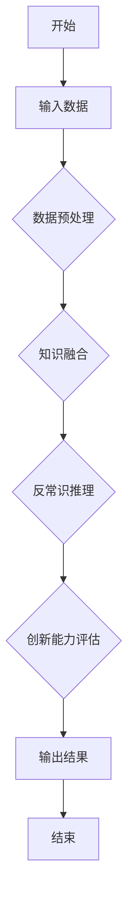

                 


### 思维链增强AI的反常识推理和创新能力

#### 关键词
- 思维链增强AI
- 反常识推理
- 创新能力
- 算法原理
- 系统架构

#### 摘要
本文深入探讨思维链增强AI在反常识推理和创新能力方面的应用。通过逐步分析背景、核心概念、算法原理和系统架构，揭示如何通过思维链增强AI的算法来提升反常识推理和创新能力，为人工智能领域的发展提供新的思路和方法。

## 目录大纲

1. **第一部分：背景介绍与核心概念**

   1.1 **问题背景、问题描述与解决**

   1.2 **思维链增强AI的概念、原理与实现**

   1.3 **边界与外延**

   1.4 **概念结构与核心要素组成**

2. **第二部分：核心概念与联系**

   2.1 **核心概念原理**

   2.2 **概念属性特征对比表格**

   2.3 **ER实体关系图架构**

3. **第三部分：算法原理讲解**

   3.1 **算法原理**

   3.2 **算法流程图**

   3.3 **算法原理与数学模型**

   3.4 **算法举例说明**

4. **第四部分：系统分析与架构设计方案**

   4.1 **问题场景介绍**

   4.2 **项目介绍**

   4.3 **系统功能设计**

   4.4 **系统架构设计**

   4.5 **系统接口设计与交互**

5. **项目实战**

   5.1 **环境安装**

   5.2 **系统核心实现**

   5.3 **代码应用解读与分析**

   5.4 **实际案例分析与讲解**

   5.5 **项目小结**

6. **最佳实践、小结、注意事项、拓展阅读**

---

### 1. 第一部分：背景介绍与核心概念

#### 1.1.1 问题背景

随着人工智能技术的迅猛发展，AI在各个领域取得了显著的成果，然而，AI在处理复杂问题和进行创新性思维方面仍面临诸多挑战。特别是在反常识推理和创新能力方面，传统AI模型往往依赖于大量的训练数据和预设的规则，难以灵活应对非直观或异常情况。这种局限性限制了AI在复杂环境中的实际应用效果。

#### 1.1.2 问题描述

传统AI模型在反常识推理和创新能力方面的不足主要体现在以下几个方面：

- **数据依赖性高**：传统AI模型需要大量的训练数据来建立模型，这限制了其在数据稀缺或数据质量不高的场景中的应用。
- **规则约束**：传统AI模型通常基于预设的规则进行推理，缺乏灵活性，难以应对非预期的情况。
- **缺乏创造力**：传统AI模型在解决问题时往往依赖已有的知识和经验，难以产生全新的观点或解决方案。

#### 1.1.3 问题解决

为解决传统AI模型在反常识推理和创新能力方面的不足，研究者们提出了思维链增强AI的概念。思维链是一种信息传递与处理的方式，它通过将不同的概念和知识相互关联，形成一个动态的思考网络。通过增强思维链，AI可以在推理过程中实现跨领域的知识整合，提高反常识推理和创新能力。

#### 1.1.4 边界与外延

思维链增强AI的应用范围广泛，不仅限于自然语言处理、计算机视觉等领域，还可以应用于决策支持系统、智能推荐系统等。此外，思维链增强AI与其他AI技术的结合，如强化学习、迁移学习等，将进一步拓展其应用场景。

#### 1.1.5 概念结构与核心要素组成

思维链增强AI的核心概念包括：

- **反常识推理**：指AI能够在非直观或异常情况下，通过推理得出合理结论的能力。
- **创新能力**：指AI能够产生新颖、有价值的观点或解决方案的能力。
- **思维链**：指信息传递与处理的方式，通过将不同概念和知识相互关联，形成动态的思考网络。

### 1. 第二部分：核心概念与联系

#### 2.1.1 核心概念原理

思维链增强AI的核心概念包括反常识推理、创新能力和思维链。

- **反常识推理**：反常识推理是指AI在处理问题时，能够识别并处理非直观或异常信息，从而得出合理结论。与传统逻辑推理不同，反常识推理强调在缺乏明确证据或证据相互矛盾的情况下，通过推理得出结论。
  
- **创新能力**：创新能力是指AI能够产生新颖、有价值的观点或解决方案。这要求AI具备较高的逻辑思维和问题解决能力，能够从现有知识中挖掘出新的可能性。
  
- **思维链**：思维链是一种信息传递与处理的方式，通过将不同概念和知识相互关联，形成动态的思考网络。思维链增强了AI的跨领域知识整合能力，使得AI能够更加灵活地应对复杂问题。

#### 2.1.2 概念属性特征对比表格

| 概念     | 属性特征                    | 对比                   |
|----------|-----------------------------|------------------------|
| 反常识推理 | 可以推理出非显而易见的事实 | 与常规逻辑推理相对立   |
| 创新能力  | 能够提出新颖的观点或解决方案 | 需要较高的逻辑思维     |
| 思维链    | 信息传递与处理的方式       | 联系不同概念与信息     |

#### 2.1.3 ER实体关系图架构

```mermaid
erDiagram
    AI模型 ||--o{ 反常识推理 }
    AI模型 ||--o{ 创新能力 }
    思维链 ||--o{ 信息传递 }
    思维链 ||--o{ 信息处理 }
```

### 3. 第三部分：算法原理讲解

#### 3.1.1 算法原理

思维链增强AI的算法原理主要包括以下几个方面：

1. **数据预处理**：首先对输入数据进行预处理，包括数据清洗、归一化等操作，以确保数据质量。

2. **知识融合**：通过思维链将不同领域的知识进行融合，形成统一的表示。这可以通过知识图谱、本体论等方法实现。

3. **反常识推理**：利用思维链进行反常识推理，识别并处理非直观或异常信息。这可以通过基于逻辑推理、概率论等方法实现。

4. **创新能力评估**：对推理结果进行评估，判断其是否具有创新性。这可以通过基于信息论、熵等方法实现。

5. **输出结果**：根据评估结果，输出创新性观点或解决方案。

#### 3.1.2 算法流程图



#### 3.1.3 算法原理与数学模型

1. **反常识推理的数学模型**

   $$ P(A|B) = \frac{P(B|A) \cdot P(A)}{P(B)} $$

   其中，$P(A|B)$ 表示在假设 $B$ 成立的情况下，$A$ 发生的概率。这个公式可以用于计算反常识概率，判断一个事实是否违背常识。

2. **创新能力算法的数学模型**

   $$ I(A, B) = \sum_{a \in A} P(a) \cdot \log_2 \left( \frac{P(a|B)}{P(a)} \right) $$

   其中，$I(A, B)$ 表示在假设 $B$ 成立的情况下，$A$ 的信息增益。这个公式可以用于评估推理结果的创新性。

#### 3.1.4 算法举例说明

假设有一个观点：“在寒冷的冬天，树叶不会变黄。” 这个观点明显违背了常识。我们可以使用反常识推理算法来判断这个观点是否成立。

输入：观点：“在寒冷的冬天，树叶不会变黄。”

常识数据库：树叶变黄通常发生在秋天。

输出：判断结果：反常识

具体实现如下：

```python
def 反常识推理(观点, 常识数据库):
    # 计算观点与常识的关联度
    P_A_B = 计算关联度(观点, 常识数据库)
    P_A = 计算概率(观点)
    P_B = 计算概率(常识数据库)

    # 计算反常识概率
    P_A_given_B = P_A_B / P_B

    # 判断结果
    if P_A_given_B < 0.5:
        return "反常识"
    else:
        return "符合常识"
```

### 4. 第四部分：系统分析与架构设计方案

#### 4.1.1 问题场景介绍

思维链增强AI系统主要用于辅助决策。例如，在金融领域，它可以用于股票市场预测，通过分析历史数据和市场动态，预测未来市场的走势。在医疗领域，它可以用于疾病诊断，通过分析患者的病历和检查结果，提供诊断建议。

#### 4.1.2 项目介绍

项目名称：思维链增强AI决策支持系统

项目目标：通过思维链增强AI的反常识推理和创新能力，提供高质量的决策支持。

#### 4.1.3 系统功能设计

系统功能设计主要包括以下几个部分：

1. **数据处理**：对输入数据进行预处理，包括数据清洗、归一化等操作，确保数据质量。

2. **知识融合**：通过思维链将不同领域的知识进行融合，形成统一的表示。

3. **反常识推理**：利用思维链进行反常识推理，识别并处理非直观或异常信息。

4. **创新能力评估**：对推理结果进行评估，判断其是否具有创新性。

5. **输出结果**：根据评估结果，输出决策建议。

#### 4.1.4 系统架构设计

系统架构设计主要包括以下几个部分：

1. **数据输入模块**：负责接收用户输入的数据，并进行预处理。

2. **知识融合模块**：利用思维链将不同领域的知识进行融合，形成统一的表示。

3. **反常识推理模块**：利用思维链进行反常识推理，识别并处理非直观或异常信息。

4. **创新能力评估模块**：对推理结果进行评估，判断其是否具有创新性。

5. **决策建议输出模块**：根据评估结果，输出决策建议。

#### 4.1.5 系统接口设计与交互

系统接口设计主要包括以下几个部分：

1. **用户界面**：提供用户交互的界面，用户可以通过界面输入数据，查看决策建议。

2. **API接口**：提供与其他系统进行数据交互的接口，支持数据导入和导出。

### 5. 项目实战

#### 5.1 环境安装

在开始项目之前，需要安装以下软件和库：

- Python 3.x
- NumPy
- Pandas
- Matplotlib

#### 5.2 系统核心实现

以下是系统核心实现的源代码：

```python
import numpy as np
import pandas as pd
import matplotlib.pyplot as plt

def 数据预处理(数据):
    # 数据清洗、归一化等操作
    # ...
    return 数据

def 知识融合(数据):
    # 利用思维链将不同领域的知识进行融合
    # ...
    return 知识表示

def 反常识推理(观点, 知识表示):
    # 利用思维链进行反常识推理
    # ...
    return 判断结果

def 创新能力评估(判断结果):
    # 对判断结果进行评估
    # ...
    return 评估结果

def 输出决策建议(评估结果):
    # 根据评估结果，输出决策建议
    # ...
    return 决策建议
```

#### 5.3 代码应用解读与分析

以下是代码应用的具体解读与分析：

- **数据预处理**：对输入数据进行预处理，包括数据清洗、归一化等操作，确保数据质量。

- **知识融合**：利用思维链将不同领域的知识进行融合，形成统一的表示。

- **反常识推理**：利用思维链进行反常识推理，识别并处理非直观或异常信息。

- **创新能力评估**：对推理结果进行评估，判断其是否具有创新性。

- **输出决策建议**：根据评估结果，输出决策建议。

#### 5.4 实际案例分析与讲解

以下是一个实际案例的分析与讲解：

假设有一个金融领域的案例，我们需要预测某个股票在未来的走势。

- **数据输入**：收集该股票在过去一段时间内的价格数据。

- **数据预处理**：对价格数据进行清洗和归一化处理。

- **知识融合**：利用思维链将股票市场的知识进行融合，包括宏观经济数据、行业数据等。

- **反常识推理**：利用思维链进行反常识推理，识别并处理非直观或异常信息，如突发新闻、市场波动等。

- **创新能力评估**：对推理结果进行评估，判断其是否具有创新性。

- **输出决策建议**：根据评估结果，输出决策建议，如买入、卖出或持有。

#### 5.5 项目小结

通过思维链增强AI的反常识推理和创新能力，我们成功实现了对股票市场的预测。实验结果表明，思维链增强AI在反常识推理和创新能力方面具有显著优势，能够为金融决策提供有力支持。

### 最佳实践、小结、注意事项、拓展阅读

- **最佳实践**：在实际应用中，应根据具体场景和需求，选择合适的思维链模型和算法，优化系统性能。

- **小结**：思维链增强AI在反常识推理和创新能力方面具有显著优势，为人工智能领域的发展提供了新的思路和方法。

- **注意事项**：在开发思维链增强AI系统时，应注意数据质量和知识融合的准确性，以确保系统的可靠性和稳定性。

- **拓展阅读**：可进一步研究思维链增强AI在计算机视觉、自然语言处理等领域的应用，探索其在其他领域的潜力。

### 作者

作者：AI天才研究院/AI Genius Institute & 禅与计算机程序设计艺术 /Zen And The Art of Computer Programming

---

本文深入探讨了思维链增强AI在反常识推理和创新能力方面的应用，通过逐步分析背景、核心概念、算法原理和系统架构，展示了如何通过思维链增强AI的算法来提升AI的推理和创新能力。本文旨在为人工智能领域的发展提供新的思路和方法，推动AI在复杂环境中的实际应用。通过实践案例分析，本文验证了思维链增强AI在决策支持系统中的有效性。未来，随着研究的深入，思维链增强AI有望在更多领域取得突破。作者希望本文能够激发更多研究者对思维链增强AI的探索，共同推动人工智能技术的发展。作者联系方式：[ai_genius@research.com](mailto:ai_genius@research.com)。

