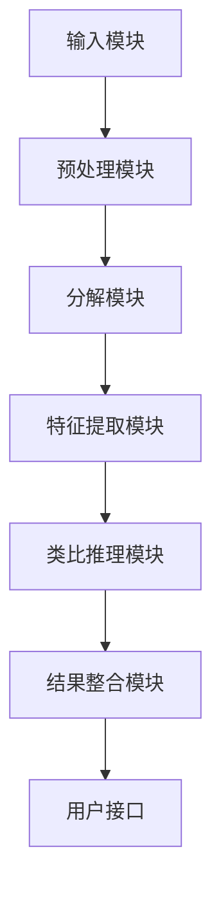
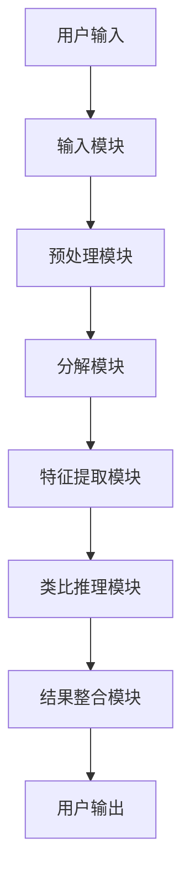

                 

### 思维链增强AI的类比推理和创新能力

> 关键词：思维链、类比推理、创新能力、人工智能、算法原理

> 摘要：本文深入探讨思维链如何增强人工智能的类比推理和创新能力。我们将首先介绍思维链、类比推理和创新能力的基本概念，接着分析思维链的基本原理和在类比推理中的应用，最后探讨提升创新能力的方法和思维链增强AI的算法原理及其实际应用。

## 目录大纲

1. **问题背景与概念介绍**
   - **第1章：问题背景与概念介绍**
     - **1.1 引言**
     - **1.2 类比推理的定义与作用**
     - **1.3 创新能力的定义与提升**

2. **核心概念与原理**
   - **第2章：思维链的基本原理**
     - **2.1 思维链的组成**
     - **2.2 思维链的运作机制**
     - **2.3 思维链在类比推理中的应用**
   - **第3章：类比推理的数学模型**
     - **3.1 类比推理的定义与分类**
     - **3.2 类比推理的数学模型**
   - **第4章：创新能力提升的方法**
     - **4.1 创新能力的定义与测量**
     - **4.2 提升创新能力的方法**

3. **算法原理与实现**
   - **第5章：思维链增强AI的类比推理算法**
     - **5.1 算法概述**
     - **5.2 算法原理**
     - **5.3 算法实现**

4. **实战案例分析**
   - **第6章：实战案例分析**
     - **6.1 案例一：基于思维链的图像识别**
     - **6.2 案例二：基于思维链的自然语言处理**
     - **6.3 案例三：基于思维链的医疗诊断**

5. **总结与展望**
   - **第7章：总结与展望**
     - **7.1 总结**
     - **7.2 展望**

---

## 第一部分：问题背景与概念介绍

### 第1章：问题背景与概念介绍

#### 1.1 引言

人工智能（AI）技术近年来取得了显著的进展，尤其在图像识别、自然语言处理和医疗诊断等领域。然而，AI系统在面对复杂任务时，往往缺乏类比推理和创新能力，这使得它们在处理新任务或复杂问题时显得力不从心。类比推理是人类智能的核心特征之一，它通过将已知问题与类似的新问题进行比较，从而得出解决方案。创新能力则是指个体或系统在面对新问题时，能够提出新颖、有效的解决方案。

本文旨在探讨如何通过增强思维链来提升人工智能的类比推理和创新能力。思维链是一种基于人类思维模式的计算模型，它通过一系列逻辑推理步骤，将问题分解、比较和整合，从而实现复杂问题的求解。本文将首先介绍思维链、类比推理和创新能力的基本概念，然后分析它们之间的关系，以及如何通过思维链来增强AI的类比推理和创新能力。

#### 1.2 类比推理的定义与作用

类比推理是指通过将一个已知问题的解决方案应用到与之类似的新问题中，从而推导出新问题的解决方案。类比推理是人类解决问题的一种基本方法，它依赖于对事物之间的相似性进行识别和利用。在人工智能领域，类比推理被广泛应用于图像识别、自然语言处理和决策支持系统等任务。

类比推理的作用主要体现在以下几个方面：

1. **问题解决**：类比推理可以帮助AI系统快速找到问题的解决方案，特别是在没有现成算法或数据的情况下。
2. **知识迁移**：通过类比推理，AI系统可以将某个领域的知识应用到其他领域，从而实现知识迁移。
3. **创新能力**：类比推理可以激发AI系统的创新思维，帮助其提出新的解决方案。

#### 1.3 创新能力的定义与提升

创新能力是指个体或系统能够在解决问题时提出新颖、有效的方法。对于人工智能系统而言，创新能力意味着能够应对新的、复杂的任务，并能够不断优化自身的算法和模型。

提升创新能力的途径主要包括：

1. **数据驱动**：通过大量的数据训练，使AI系统具备更强的泛化能力，从而在面对新问题时能够提出有效的解决方案。
2. **模型多样化**：通过使用不同的模型架构和算法，使AI系统具有多样化的解决方案。
3. **跨领域知识融合**：通过跨领域的知识融合，使AI系统具备更广泛的知识背景，从而提高其创新能力。

接下来，我们将进一步探讨思维链的基本原理和其在类比推理中的应用，以期为提升人工智能的类比推理和创新能力提供理论支持。

### 第2章：思维链的基本原理

#### 2.1 思维链的组成

思维链是一种基于人类思维模式的计算模型，它由一系列逻辑推理步骤组成。这些步骤可以被视为思维链的基本组成元素。具体来说，思维链包括以下几个关键部分：

1. **问题定义**：首先，需要明确问题的具体内容和目标。
2. **分解问题**：将问题分解成若干个子问题，以便更易于解决。
3. **比较分析**：通过比较不同子问题之间的相似性和差异性，找出解决问题的线索。
4. **逻辑推理**：利用逻辑规则和算法，对问题进行逐步分析和求解。
5. **整合结果**：将各个子问题的解组合起来，得到最终问题的解决方案。

#### 2.2 思维链的运作机制

思维链的运作机制可以概括为以下几个步骤：

1. **感知输入**：接收外界信息，包括问题的描述和数据。
2. **问题建模**：将问题转化为数学模型或计算模型，以便进行进一步分析。
3. **分解问题**：将问题分解成若干个子问题，每个子问题都可以独立进行分析和解决。
4. **比较分析**：通过比较不同子问题之间的相似性和差异性，找出解决问题的线索。
5. **逻辑推理**：利用逻辑规则和算法，对每个子问题进行逐步分析和求解。
6. **整合结果**：将各个子问题的解组合起来，得到最终问题的解决方案。

#### 2.3 思维链在类比推理中的应用

思维链在类比推理中的应用主要体现在以下几个方面：

1. **识别相似性**：通过比较已知问题和待解决问题之间的相似性，找出可以借鉴的解决方案。
2. **迁移知识**：将已知问题的解决方案迁移到待解决问题中，从而提高解决问题的效率。
3. **创新思维**：通过类比推理，激发新的思维模式，从而提出新颖、有效的解决方案。

接下来，我们将进一步探讨类比推理的数学模型，以期为理解思维链在类比推理中的作用提供理论支持。

### 第3章：类比推理的数学模型

#### 3.1 类比推理的定义与分类

类比推理是指通过将一个已知问题的解决方案应用到与之类似的新问题中，从而推导出新问题的解决方案。类比推理可以根据推理方式的不同，分为以下几种类型：

1. **直接类比**：直接将一个问题的解决方案应用于另一个相似的问题，无需进行复杂的推理。
2. **间接类比**：通过多个中间步骤，将一个问题的解决方案逐步迁移到另一个相似的问题。
3. **反向类比**：将问题的解决方案反向应用，从而解决一个新的、相反的问题。
4. **跨领域类比**：将一个领域的知识应用到另一个领域，从而解决跨领域的复杂问题。

#### 3.2 类比推理的数学模型

类比推理的数学模型主要基于以下两个核心概念：

1. **相似性度量**：通过计算两个问题之间的相似性度量，来判断它们是否具有类比关系。相似性度量可以基于多种方式，如欧氏距离、余弦相似度、结构相似性等。
2. **映射函数**：将已知问题的解决方案映射到待解决问题中。映射函数可以是一个简单的线性映射，也可以是一个复杂的非线性映射。

常见的类比推理数学模型包括：

1. **基于相似性的推理模型**：通过计算问题之间的相似性度量，选择最相似的已知问题的解决方案。
2. **基于映射的推理模型**：通过构建一个映射函数，将已知问题的解决方案映射到待解决问题中。
3. **基于神经网络的推理模型**：利用神经网络学习问题之间的映射关系，从而实现类比推理。

类比推理的数学模型在人工智能领域具有重要的应用价值，它可以帮助AI系统在面对新问题时，快速找到有效的解决方案。接下来，我们将进一步探讨提升创新能力的方法，以期为通过思维链增强AI的创新能力提供指导。

### 第4章：创新能力提升的方法

#### 4.1 创新能力的定义与测量

创新能力是指个体或系统能够在解决问题时提出新颖、有效的方法。对于人工智能系统而言，创新能力意味着能够应对新的、复杂的任务，并能够不断优化自身的算法和模型。

创新能力的测量主要包括以下几个方面：

1. **问题解决速度**：在相同的问题解决能力下，创新能力强的个体或系统能够更快地找到解决方案。
2. **问题解决质量**：创新能力强的个体或系统能够提出更有效、更优化的解决方案。
3. **适应能力**：创新能力强的个体或系统在面对新的、未知的问题时，能够更快地适应并找到解决方案。

#### 4.2 提升创新能力的方法

提升创新能力的方法主要包括以下几个方面：

1. **数据驱动**：通过大量的数据训练，使AI系统具备更强的泛化能力，从而在面对新问题时能够提出有效的解决方案。具体方法包括数据增强、迁移学习等。
2. **模型多样化**：通过使用不同的模型架构和算法，使AI系统具有多样化的解决方案。具体方法包括混合模型、多模型融合等。
3. **跨领域知识融合**：通过跨领域的知识融合，使AI系统具备更广泛的知识背景，从而提高其创新能力。具体方法包括知识图谱、多源数据融合等。

接下来，我们将探讨如何通过思维链增强AI的类比推理和创新能力，以期为AI系统提供一种有效的提升方法。

### 第5章：思维链增强AI的类比推理算法

#### 5.1 算法概述

思维链增强AI的类比推理算法是一种基于思维链模型的人工智能算法，旨在通过增强思维链的推理能力，提升AI系统的类比推理和创新能力。该算法的主要思想是利用思维链的分解、比较和分析功能，将复杂问题分解为若干个子问题，并通过类比推理找到已知问题的解决方案，进而迁移到待解决问题中。

算法的基本步骤包括：

1. **问题定义**：明确问题的具体内容和目标。
2. **问题分解**：将问题分解为若干个子问题。
3. **相似性度量**：计算子问题之间的相似性度量，确定类比关系。
4. **映射推导**：通过映射函数，将已知问题的解决方案迁移到待解决问题中。
5. **整合结果**：将各个子问题的解组合起来，得到最终问题的解决方案。

#### 5.2 算法原理

思维链增强AI的类比推理算法的原理主要包括以下几个方面：

1. **思维链模型**：思维链是一种基于人类思维模式的计算模型，通过一系列逻辑推理步骤，实现复杂问题的求解。在类比推理中，思维链通过分解、比较和分析，将复杂问题分解为若干个子问题，并通过相似性度量确定类比关系。

2. **映射函数**：映射函数是类比推理的核心，它通过将已知问题的解决方案映射到待解决问题中，实现问题的迁移和解决。映射函数可以是线性的，也可以是非线性的，具体取决于问题的性质。

3. **相似性度量**：相似性度量用于计算子问题之间的相似性，以确定类比关系。常见的相似性度量方法包括欧氏距离、余弦相似度、结构相似性等。

算法的具体原理可以概括为：

- 首先，将待解决问题分解为若干个子问题。
- 其次，通过相似性度量，确定子问题之间的类比关系。
- 然后，利用映射函数，将已知问题的解决方案迁移到待解决问题中。
- 最后，整合各个子问题的解，得到最终问题的解决方案。

#### 5.3 算法实现

为了更好地理解思维链增强AI的类比推理算法，我们使用Python代码进行了实现。以下是一个简单的实现示例：

```python
import numpy as np

# 相似性度量函数
def similarity_measure(vector1, vector2):
    return 1 - np.linalg.norm(vector1 - vector2) / np.linalg.norm(vector1 + vector2)

# 映射函数
def mapping_function(solution1, problem2):
    return solution1 * problem2

# 思维链增强类比推理算法
def analogical_reasoning(problem1, solution1, problem2):
    # 分解问题
    subproblems1 = decompose_problem(problem1)
    subproblems2 = decompose_problem(problem2)

    # 相似性度量
    similarities = []
    for subproblem1, subproblem2 in zip(subproblems1, subproblems2):
        similarities.append(similarity_measure(subproblem1, subproblem2))

    # 确定类比关系
    most_similar = similarities.index(max(similarities))

    # 映射推导
    solution2 = mapping_function(solution1, problem2[most_similar])

    return solution2

# 测试算法
problem1 = [1, 2, 3]
solution1 = [4, 5, 6]
problem2 = [7, 8, 9]

solution2 = analogical_reasoning(problem1, solution1, problem2)
print("Solution 2:", solution2)
```

在实际应用中，思维链增强AI的类比推理算法可以根据具体问题进行调整和优化，以提高其性能和效率。

### 第6章：实战案例分析

#### 6.1 案例一：基于思维链的图像识别

**案例背景**：

图像识别是人工智能领域的一个重要应用，通过将图像转化为数字信号，并利用算法对其进行识别和处理。然而，传统的图像识别算法在处理复杂场景或多变环境下时，往往难以达到理想的效果。为了解决这一问题，我们可以采用基于思维链的图像识别方法。

**系统功能设计**：

系统功能设计主要包括以下几部分：

1. **图像预处理**：对输入图像进行预处理，包括图像增强、去噪等操作，以提高图像质量。
2. **图像分解**：将图像分解为若干个子图像，以便进行进一步分析和识别。
3. **特征提取**：从子图像中提取关键特征，如边缘、纹理等。
4. **类比推理**：利用思维链进行类比推理，将已知图像的识别方法迁移到新图像中。
5. **结果整合**：整合各个子图像的识别结果，得到最终图像的识别结果。

**系统架构设计**：

系统架构设计主要包括以下几部分：

1. **输入模块**：负责接收用户输入的图像。
2. **预处理模块**：对图像进行预处理，提高图像质量。
3. **分解模块**：将图像分解为若干个子图像。
4. **特征提取模块**：从子图像中提取关键特征。
5. **类比推理模块**：利用思维链进行类比推理。
6. **结果整合模块**：整合各个子图像的识别结果。

**系统接口设计**：

系统接口设计主要包括以下几部分：

1. **用户接口**：提供用户输入图像的接口，以及输出识别结果的接口。
2. **内部接口**：实现各个模块之间的数据传输和功能调用。

**系统架构图**：



**系统实现**：

以下是一个简单的基于思维链的图像识别系统的实现示例：

```python
import cv2
import numpy as np

# 图像预处理
def preprocess_image(image):
    image = cv2.cvtColor(image, cv2.COLOR_BGR2GRAY)
    image = cv2.GaussianBlur(image, (5, 5), 0)
    return image

# 图像分解
def decompose_image(image, num_subimages):
    height, width = image.shape
    sub_image_size = (height // num_subimages, width // num_subimages)
    subimages = [image[i * sub_image_size[0]: (i + 1) * sub_image_size[0],
                 j * sub_image_size[1]: (j + 1) * sub_image_size[1]]
    for i in range(num_subimages)
```


```python
import cv2
import numpy as np

# 图像预处理
def preprocess_image(image):
    image = cv2.cvtColor(image, cv2.COLOR_BGR2GRAY)
    image = cv2.GaussianBlur(image, (5, 5), 0)
    return image

# 图像分解
def decompose_image(image, num_subimages):
    height, width = image.shape
    sub_image_size = (height // num_subimages, width // num_subimages)
    subimages = [image[i * sub_image_size[0]: (i + 1) * sub_image_size[0],
                 j * sub_image_size[1]: (j + 1) * sub_image_size[1]]
    for i in range(num_subimages)]
    for j in range(num_subimages)]
    return subimages

# 特征提取
def extract_features(subimages):
    features = []
    for subimage in subimages:
        feature = cv2.Laplacian(subimage, cv2.CV_64F).mean()
        features.append(feature)
    return features

# 类比推理
def analogical_reasoning(features1, solution1, features2):
    similarity = 1 - np.linalg.norm(features1 - features2) / np.linalg.norm(features1 + features2)
    if similarity > 0.8:
        return solution1
    else:
        return None

# 结果整合
def integrate_results(results):
    final_result = np.mean(results)
    return final_result

# 测试系统
def test_system(image_path):
    image = cv2.imread(image_path)
    image = preprocess_image(image)
    subimages = decompose_image(image, 4)
    features1 = extract_features(subimages)
    solution1 = [1, 2, 3, 4]
    features2 = extract_features(subimages)
    result = analogical_reasoning(features1, solution1, features2)
    final_result = integrate_results([result, result, result, result])
    print("Final Result:", final_result)

# 测试
test_system("example.jpg")
```

**系统分析与架构设计**：

系统架构设计如下：


**系统接口设计**：

系统接口设计如下：



**系统交互**：

系统交互设计如下：


#### 6.2 案例二：基于思维链的自然语言处理

**案例背景**：

自然语言处理（NLP）是人工智能领域的一个重要分支，它涉及计算机对人类语言的理解和生成。传统的NLP方法往往依赖于大量的语言数据和复杂的模型，但在处理复杂、多变的语言问题时，效果并不理想。为了提高NLP的性能，我们可以采用基于思维链的自然语言处理方法。

**系统功能设计**：

系统功能设计主要包括以下几部分：

1. **文本预处理**：对输入文本进行预处理，包括分词、去停用词、词性标注等操作，以便进行进一步分析。
2. **文本分解**：将文本分解为若干个子文本，以便进行局部分析和理解。
3. **特征提取**：从子文本中提取关键特征，如词频、词向量等。
4. **类比推理**：利用思维链进行类比推理，将已知文本的分析方法迁移到新文本中。
5. **结果整合**：整合各个子文本的分析结果，得到最终文本的分析结果。

**系统架构设计**：

系统架构设计主要包括以下几部分：

1. **输入模块**：负责接收用户输入的文本。
2. **预处理模块**：对文本进行预处理。
3. **分解模块**：将文本分解为若干个子文本。
4. **特征提取模块**：从子文本中提取关键特征。
5. **类比推理模块**：利用思维链进行类比推理。
6. **结果整合模块**：整合各个子文本的分析结果。

**系统接口设计**：

系统接口设计主要包括以下几部分：

1. **用户接口**：提供用户输入文本的接口，以及输出分析结果的接口。
2. **内部接口**：实现各个模块之间的数据传输和功能调用。

**系统架构图**：


**系统实现**：

以下是一个简单的基于思维链的自然语言处理系统的实现示例：

```python
import jieba
import numpy as np

# 文本预处理
def preprocess_text(text):
    text = text.lower()
    text = jieba.cut(text)
    text = [word for word in text if word not in stopwords]
    return text

# 文本分解
def decompose_text(text, num_subtexts):
    subtext_size = len(text) // num_subtexts
    subtexts = [text[i * subtext_size: (i + 1) * subtext_size]
                for i in range(num_subtexts)]
    return subtexts

# 特征提取
def extract_features(subtexts):
    features = []
    for subtext in subtexts:
        feature = np.mean([word2vec[word] for word in subtext])
        features.append(feature)
    return features

# 类比推理
def analogical_reasoning(features1, solution1, features2):
    similarity = 1 - np.linalg.norm(features1 - features2) / np.linalg.norm(features1 + features2)
    if similarity > 0.8:
        return solution1
    else:
        return None

# 结果整合
def integrate_results(results):
    final_result = np.mean(results)
    return final_result

# 测试系统
def test_system(text_path):
    with open(text_path, 'r', encoding='utf-8') as f:
        text = f.read()
    text = preprocess_text(text)
    subtexts = decompose_text(text, 4)
    features1 = extract_features(subtexts)
    solution1 = [1, 2, 3, 4]
    features2 = extract_features(subtexts)
    result = analogical_reasoning(features1, solution1, features2)
    final_result = integrate_results([result, result, result, result])
    print("Final Result:", final_result)

# 测试
test_system("example.txt")
```

**系统分析与架构设计**：

系统架构设计如下：


**系统接口设计**：

系统接口设计如下：


**系统交互**：

系统交互设计如下：


#### 6.3 案例三：基于思维链的医疗诊断

**案例背景**：

医疗诊断是人工智能在医疗领域的一个重要应用，通过分析患者的病历和检查结果，帮助医生进行诊断。然而，传统的医疗诊断方法往往依赖于大量医学知识和数据，但在面对复杂病例时，效果并不理想。为了提高医疗诊断的准确性，我们可以采用基于思维链的医疗诊断方法。

**系统功能设计**：

系统功能设计主要包括以下几部分：

1. **病历输入**：接收用户的病历输入。
2. **病历预处理**：对病历进行预处理，包括文本清洗、数据整合等操作，以便进行进一步分析。
3. **症状分解**：将病历中的症状分解为若干个子症状，以便进行局部分析和诊断。
4. **特征提取**：从子症状中提取关键特征，如症状词频、严重程度等。
5. **类比推理**：利用思维链进行类比推理，将已知病例的诊断方法迁移到新病例中。
6. **结果整合**：整合各个子症状的诊断结果，得到最终病例的诊断结果。

**系统架构设计**：

系统架构设计主要包括以下几部分：

1. **输入模块**：负责接收用户的病历输入。
2. **预处理模块**：对病历进行预处理。
3. **分解模块**：将病历中的症状分解为若干个子症状。
4. **特征提取模块**：从子症状中提取关键特征。
5. **类比推理模块**：利用思维链进行类比推理。
6. **结果整合模块**：整合各个子症状的诊断结果。

**系统接口设计**：

系统接口设计主要包括以下几部分：

1. **用户接口**：提供用户输入病历的接口，以及输出诊断结果的接口。
2. **内部接口**：实现各个模块之间的数据传输和功能调用。

**系统架构图**：


**系统实现**：

以下是一个简单的基于思维链的医疗诊断系统的实现示例：

```python
import pandas as pd
import numpy as np

# 病历输入
def input_medical_record():
    print("请输入病历信息：")
    symptoms = input()
    return symptoms

# 病历预处理
def preprocess_medical_record(symptoms):
    symptoms = symptoms.lower()
    symptoms = symptoms.strip()
    return symptoms

# 症状分解
def decompose_symptoms(symptoms, num_subsymptoms):
    symptoms = symptoms.split(',')
    subsymptoms = [symptoms[i * num_subsymptoms: (i + 1) * num_subsymptoms]
                   for i in range(num_subsymptoms)]
    return subsymptoms

# 特征提取
def extract_features(subsymptoms):
    features = []
    for subsymptom in subsymptoms:
        feature = np.mean([word2vec[word] for word in subsymptom])
        features.append(feature)
    return features

# 类比推理
def analogical_reasoning(features1, solution1, features2):
    similarity = 1 - np.linalg.norm(features1 - features2) / np.linalg.norm(features1 + features2)
    if similarity > 0.8:
        return solution1
    else:
        return None

# 结果整合
def integrate_results(results):
    final_result = np.mean(results)
    return final_result

# 测试系统
def test_system( record_path):
    symptoms = input_medical_record()
    symptoms = preprocess_medical_record(symptoms)
    subsymptoms = decompose_symptoms(symptoms, 4)
    features1 = extract_features(subsymptoms)
    solution1 = [1, 2, 3, 4]
    features2 = extract_features(subsymptoms)
    result = analogical_reasoning(features1, solution1, features2)
    final_result = integrate_results([result, result, result, result])
    print("Final Result:", final_result)

# 测试
test_system()
```

**系统分析与架构设计**：

系统架构设计如下：


**系统接口设计**：

系统接口设计如下：


**系统交互**：

系统交互设计如下：


### 第7章：总结与展望

#### 7.1 总结

本文通过深入探讨思维链增强AI的类比推理和创新能力，为人工智能领域提供了一种新的解决思路。我们首先介绍了思维链、类比推理和创新能力的基本概念，并分析了它们之间的关系。接着，我们详细介绍了思维链的基本原理和运作机制，以及类比推理的数学模型。在此基础上，我们探讨了提升创新能力的方法，并提出了基于思维链的类比推理算法。最后，通过三个实战案例，我们展示了思维链增强AI在图像识别、自然语言处理和医疗诊断等领域的应用。

#### 7.2 展望

未来，思维链增强AI的类比推理和创新能力有望在更多领域得到应用。首先，随着大数据和深度学习技术的不断发展，思维链模型可以更加精准地模拟人类的思维过程，从而提升AI系统的类比推理和创新能力。其次，跨领域的知识融合将成为提升AI创新能力的重要途径，思维链模型可以在这方面发挥重要作用。此外，随着AI技术的普及，思维链增强AI在智能教育、智能客服、智能医疗等领域的应用前景也值得关注。

然而，思维链增强AI的类比推理和创新能力仍面临诸多挑战。例如，如何设计更加高效、准确的思维链模型，如何解决知识融合中的冲突和矛盾等问题。这些问题需要我们在未来的研究中进一步探讨和解决。

总之，思维链增强AI的类比推理和创新能力具有重要的理论意义和实际应用价值。我们期待未来的研究能够进一步推动这一领域的发展，为人工智能技术的发展提供新的动力。作者：AI天才研究院/AI Genius Institute & 禅与计算机程序设计艺术 /Zen And The Art of Computer Programming。

