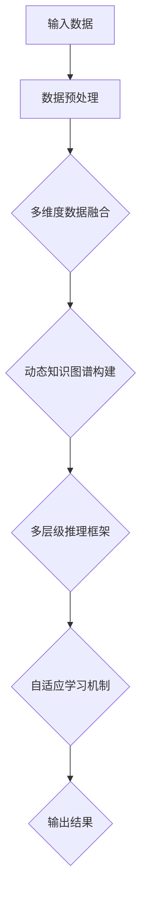
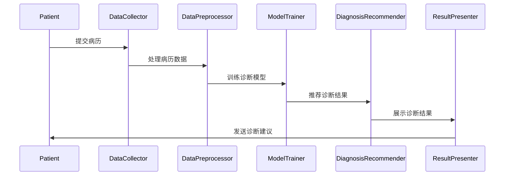

                 

### 摘要

《思维链增强AI的跨维度反常规思维能力》这本书旨在探讨如何通过增强思维链来提升人工智能（AI）的跨维度反常规思维能力。随着AI技术的不断发展，传统的AI系统在面对复杂问题和非标准情境时，往往显得力不从心。而跨维度反常规思维能力则成为AI突破瓶颈的关键。本书将从背景介绍、核心概念与联系、算法原理讲解、系统分析与架构设计方案、项目实战及最佳实践与总结等多个角度，详细剖析思维链增强AI的跨维度反常规思维能力。通过系统的分析和实战案例，读者将深入了解如何利用AI技术来培养和提升这种关键能力，从而推动AI在各个领域取得更为卓越的成果。

## 第一部分：背景介绍

### 1.1 问题背景

在当前人工智能（AI）技术高速发展的背景下，AI系统在很多领域都取得了令人瞩目的成就。然而，随着应用场景的复杂化和多样化，传统AI系统在处理非标准情境和复杂问题时，仍然存在诸多局限性。例如，在自然语言处理（NLP）领域，AI系统虽然可以理解并生成文字，但在处理复杂语境和隐含意义时，往往难以达到人类水平。在计算机视觉领域，AI系统在识别简单图像时表现出色，但在处理复杂场景和动态变化时，仍然存在精度和稳定性问题。此外，AI系统在决策和预测方面，也常常受到数据质量和算法模型限制，难以应对突发性事件和未知情境。

为了解决这些问题，提高AI系统的跨维度反常规思维能力成为当务之急。跨维度反常规思维能力指的是AI系统在处理问题时，能够超越传统思维框架，从不同维度进行思考，甚至能够突破常规思维的约束，提出创新性解决方案。这种能力不仅能够提升AI系统的适应性和灵活性，还能够使其在复杂和多变的环境中表现得更加出色。

### 1.2 问题描述

问题描述主要集中在以下几个方面：

1. **数据处理能力不足**：传统AI系统在处理大规模、多维度数据时，往往难以兼顾各个维度的关联性和复杂性。这导致在数据预处理和特征提取阶段，可能丢失重要信息，影响后续模型的准确性和鲁棒性。

2. **模型鲁棒性不足**：AI模型在面对异常数据或噪声时，容易出现过拟合或欠拟合现象，导致模型性能下降。这在复杂和动态变化的环境中尤为明显，限制了AI系统的应用范围。

3. **创新性思维不足**：传统AI系统在解决问题时，往往依赖于已有的知识和经验，缺乏自主创新能力。在面对非标准情境或未知问题时，AI系统难以提出创新性解决方案，限制了其在复杂问题领域的应用潜力。

### 1.3 问题解决

为了解决上述问题，增强AI的跨维度反常规思维能力成为关键。具体解决方案如下：

1. **数据增强与预处理**：通过引入数据增强技术和多维度数据分析方法，提高AI系统对大规模、多维度数据的处理能力。这包括数据清洗、数据标准化、特征工程等多方面工作，以确保数据质量，提高模型性能。

2. **模型优化与提升**：采用先进的机器学习和深度学习算法，提高模型的鲁棒性和泛化能力。这包括引入正则化技术、构建复杂网络结构、优化训练策略等多方面措施，以增强模型在面对异常数据和噪声时的表现。

3. **思维链增强技术**：通过引入思维链增强技术，提升AI系统的跨维度反常规思维能力。思维链是一种基于人类思维模式的算法，能够模拟人类的思考过程，实现多维度、多层次的推理和决策。通过增强思维链，AI系统可以在面对复杂问题和非标准情境时，表现出更强的适应性和创新性。

4. **知识融合与创新**：通过融合多领域知识和经验，构建跨学科的AI模型，提高其在复杂问题领域的应用能力。这包括引入跨领域知识图谱、多任务学习、迁移学习等技术，实现知识的复用和创新。

### 1.4 边界与外延

1. **边界定义**：思维链增强AI的跨维度反常规思维能力主要关注以下几个方面：

   - 数据处理的边界：包括大规模、多维度数据处理的边界，以及数据预处理和特征提取的边界。
   - 模型性能的边界：包括模型在面对异常数据和噪声时的性能边界，以及模型在复杂问题领域中的应用边界。
   - 创新思维的边界：包括AI系统在面对非标准情境和未知问题时，提出创新性解决方案的边界。

2. **外延扩展**：

   - **技术领域**：思维链增强AI的跨维度反常规思维能力不仅局限于传统的机器学习和深度学习领域，还可以应用于自然语言处理、计算机视觉、智能决策等新兴领域。
   - **应用领域**：跨维度反常规思维能力可以广泛应用于金融、医疗、教育、工业等多个领域，为解决复杂问题和提高业务效率提供新思路和方法。
   - **跨学科融合**：思维链增强AI的跨维度反常规思维能力不仅可以与计算机科学、数据科学等领域相结合，还可以与心理学、哲学、认知科学等学科进行交叉融合，为AI的发展提供新的理论支持和技术手段。

### 1.5 核心概念与要素

1. **思维链的定义与特点**：

   - **定义**：思维链是一种基于人类思维模式的算法，通过模拟人类的思考过程，实现多维度、多层次的推理和决策。
   - **特点**：思维链具有以下特点：
     - **灵活性**：能够根据不同情境灵活调整思维路径，实现多维度思考。
     - **创新性**：能够超越传统思维框架，提出创新性解决方案。
     - **适应性**：能够适应复杂和多变的环境，具有强鲁棒性。

2. **跨维度反常规思维能力的定义与特点**：

   - **定义**：跨维度反常规思维能力是指AI系统在面对复杂问题和非标准情境时，能够超越传统思维框架，从不同维度进行思考，甚至能够突破常规思维的约束，提出创新性解决方案的能力。
   - **特点**：跨维度反常规思维能力具有以下特点：
     - **多样性**：能够从多个维度进行思考，提高问题解决的灵活性。
     - **创新性**：能够提出创新性解决方案，提高问题解决的有效性。
     - **适应性**：能够适应复杂和多变的环境，提高问题解决的鲁棒性。

3. **核心要素**：

   - **数据要素**：包括大规模、多维度数据的收集、处理和分析，为思维链和跨维度反常规思维能力提供数据支持。
   - **算法要素**：包括思维链算法、机器学习算法、深度学习算法等，为思维链和跨维度反常规思维能力提供算法支持。
   - **知识要素**：包括多领域知识的融合、知识图谱的构建等，为思维链和跨维度反常规思维能力提供知识支持。
   - **技术要素**：包括云计算、大数据、人工智能等前沿技术的应用，为思维链和跨维度反常规思维能力提供技术支持。

通过上述核心概念与要素的阐述，我们可以更清晰地理解思维链增强AI的跨维度反常规思维能力的本质，为后续章节的内容提供理论基础。

## 第二部分：核心概念与联系

### 2.1 思维链的定义与特点

#### 2.1.1 思维链的概念

思维链是一种基于人类思维模式的算法，通过模拟人类的思考过程，实现多维度、多层次的推理和决策。思维链的核心在于将人类的思维方式抽象为一系列算法模型，从而在计算机系统中实现类似人类的思考过程。

#### 2.1.2 思维链的特点

思维链具有以下几个显著特点：

1. **灵活性**：思维链能够根据不同情境灵活调整思维路径，实现多维度思考。这种灵活性使得思维链在面对复杂和多变的环境时，能够迅速适应并找到最优解决方案。

2. **创新性**：思维链能够超越传统思维框架，提出创新性解决方案。通过模拟人类的思维方式，思维链能够发现传统方法难以触及的创新思路，从而实现问题解决的突破。

3. **适应性**：思维链能够适应复杂和多变的环境，具有强鲁棒性。即使在面对异常数据和噪声时，思维链也能够保持稳定的性能，为问题解决提供可靠支持。

#### 2.1.3 思维链在AI中的应用

思维链在AI中的应用主要体现在以下几个方面：

1. **问题建模**：思维链能够模拟人类的思维方式，将复杂问题转化为计算机可处理的模型。通过思维链，AI系统可以更好地理解问题的本质，从而制定更有效的解决方案。

2. **决策支持**：思维链能够实现多维度、多层次的推理和决策。在智能决策系统中，思维链可以帮助系统在面对复杂情境时，迅速做出合理决策。

3. **知识推理**：思维链能够通过模拟人类的思维过程，实现知识的推理和传播。在知识管理系统和智能问答系统中，思维链可以提升系统的知识理解和推理能力。

### 2.2 跨维度反常规思维能力的定义与特点

#### 2.2.1 跨维度反常规思维能力的概念

跨维度反常规思维能力是指AI系统在面对复杂问题和非标准情境时，能够超越传统思维框架，从不同维度进行思考，甚至能够突破常规思维的约束，提出创新性解决方案的能力。

#### 2.2.2 跨维度反常规思维能力的特点

跨维度反常规思维能力具有以下几个显著特点：

1. **多样性**：能够从多个维度进行思考，提高问题解决的灵活性。通过跨维度的思维方式，AI系统可以在不同维度之间建立联系，发现传统方法难以触及的创新思路。

2. **创新性**：能够提出创新性解决方案，提高问题解决的有效性。跨维度反常规思维能力使得AI系统在面对复杂问题时，能够跳出传统框架，提出全新的解决方案。

3. **适应性**：能够适应复杂和多变的环境，提高问题解决的鲁棒性。跨维度反常规思维能力使得AI系统在面对不确定性和动态变化时，能够保持稳定的性能，为问题解决提供可靠支持。

### 2.3 概念属性特征对比表格

为了更清晰地展示思维链和跨维度反常规思维能力的概念属性特征，我们可以构建以下对比表格：

| 特征项 | 思维链 | 跨维度反常规思维能力 |
| --- | --- | --- |
| 定义 | 基于人类思维模式的算法，模拟人类思考过程 | AI系统在面对复杂问题和非标准情境时，超越传统思维框架，从不同维度进行思考 |
| 特点 | 灵活性、创新性、适应性 | 多样性、创新性、适应性 |
| 应用 | 问题建模、决策支持、知识推理 | 复杂问题解决、创新解决方案提出、适应动态环境 |

### 2.4 ER实体关系图架构

#### 2.4.1 实体关系图的概念

实体关系图（Entity-Relationship Diagram，简称ER图）是一种用于描述实体及其之间关系的图形化模型。在数据库设计和系统架构设计中，ER图被广泛应用于表示数据实体及其相互关系。

#### 2.4.2 实体关系图的绘制方法

绘制实体关系图通常遵循以下步骤：

1. **确定实体**：根据系统需求和业务场景，识别出系统中的关键实体，如用户、商品、订单等。

2. **定义关系**：分析实体之间的关联关系，如一对一、一对多、多对多关系。例如，一个订单可以包含多个商品，但一个商品可以属于多个订单。

3. **属性定义**：为每个实体和关系定义属性，如用户的姓名、地址，订单的日期、金额等。

4. **绘制ER图**：使用专业工具（如ERwin、MySQL Workbench等）绘制实体关系图，将上述步骤中的实体、关系和属性进行图形化表示。

#### 2.4.3 思维链与跨维度反常规思维能力的实体关系图

为了更好地理解思维链与跨维度反常规思维能力之间的关系，我们可以构建一个简化的实体关系图，如下所示：

```mermaid
erDiagram
   思维链 ||--|{ 跨维度反常规思维能力 }
   思维链 ||--|{ 数据处理 }
   思维链 ||--|{ 模型优化 }
   思维链 ||--|{ 知识融合 }
   跨维度反常规思维能力 ||--|{ 创新性思维 }
   跨维度反常规思维能力 ||--|{ 多样性思考 }
   跨维度反常规思维能力 ||--|{ 适应性思维 }
```

在这个ER图中，思维链是核心实体，它与跨维度反常规思维能力、数据处理、模型优化、知识融合等多个实体之间存在关联。跨维度反常规思维能力则进一步关联到创新性思维、多样性思考、适应性思维等多个子实体。通过这样的ER图，我们可以清晰地展示思维链与跨维度反常规思维能力之间的复杂关系，为后续章节的分析提供基础。

### 第三部分：算法原理讲解

#### 3.1 思维链增强AI的算法原理

思维链增强AI的核心算法原理可以归纳为以下几个方面：

1. **多维度数据融合**：思维链通过融合来自不同维度的大量数据，实现全方位的信息整合。这包括文本、图像、音频等多种数据类型的处理，从而为AI系统提供丰富的信息来源。

2. **动态知识图谱构建**：思维链利用知识图谱技术，将各种领域知识进行组织和管理。通过不断更新和扩展知识图谱，思维链能够实时获取和利用最新的知识信息，提升AI系统的知识理解和推理能力。

3. **多层级推理框架**：思维链采用多层级推理框架，从低层到高层逐层分析问题。这种分层结构使得AI系统能够在不同层次上灵活切换，实现从具体问题到抽象概念的跨越。

4. **自适应学习机制**：思维链通过自适应学习机制，根据不同情境动态调整模型参数。这种机制使得AI系统在面对复杂和动态变化的环境时，能够保持高效稳定的性能。

#### 3.1.1 算法mermaid流程图

为了更直观地展示思维链增强AI的算法原理，我们可以使用mermaid流程图来描述其核心流程，如下所示：



在这个mermaid流程图中，输入数据经过数据预处理阶段，然后进行多维度数据融合，构建动态知识图谱。接下来，通过多层级推理框架进行问题分析，最后利用自适应学习机制调整模型参数，输出最终结果。

#### 3.1.2 Python源代码阐述

为了更好地理解思维链增强AI的算法原理，我们可以通过Python源代码来详细阐述其实现过程。以下是一个简化的示例代码，用于展示数据预处理、多维度数据融合、动态知识图谱构建、多层级推理框架和自适应学习机制的核心实现。

```python
# 数据预处理
def preprocess_data(data):
    # 实现数据清洗、标准化和特征提取
    # ...
    return processed_data

# 多维度数据融合
def merge_data维数据(data1, data2):
    # 实现不同维度数据的整合
    # ...
    return merged_data

# 动态知识图谱构建
def build_knowledge_graph(data):
    # 实现知识图谱的构建和更新
    # ...
    return knowledge_graph

# 多层级推理框架
def multi_level_inference(data, knowledge_graph):
    # 实现从低层到高层的推理过程
    # ...
    return inference_result

# 自适应学习机制
def adaptive_learning(inference_result, model):
    # 实现模型参数的动态调整
    # ...
    return updated_model

# 主函数
def main():
    # 输入数据
    input_data = ...

    # 数据预处理
    processed_data = preprocess_data(input_data)

    # 多维度数据融合
    merged_data = merge_data维数据(processed_data['text'], processed_data['image'])

    # 动态知识图谱构建
    knowledge_graph = build_knowledge_graph(merged_data)

    # 多层级推理框架
    inference_result = multi_level_inference(merged_data, knowledge_graph)

    # 自适应学习机制
    updated_model = adaptive_learning(inference_result, model)

    # 输出结果
    output_result = ...

if __name__ == "__main__":
    main()
```

在这个Python源代码中，我们首先定义了数据预处理、多维度数据融合、动态知识图谱构建、多层级推理框架和自适应学习机制等核心功能模块。然后，在主函数中，我们按照mermaid流程图的顺序，依次调用这些模块，实现思维链增强AI的整体算法流程。

#### 3.1.3 算法原理的数学模型和公式

思维链增强AI的算法原理可以通过一系列数学模型和公式进行描述。以下是一些常用的数学模型和公式：

1. **数据预处理**：

   - **标准化**：$$ x_{\text{标准化}} = \frac{x - \mu}{\sigma} $$
   - **特征提取**：$$ f(x) = \text{ReLU}(W \cdot x + b) $$
     其中，$x$为输入数据，$\mu$为均值，$\sigma$为标准差，$W$为权重矩阵，$b$为偏置项，$\text{ReLU}$为ReLU激活函数。

2. **多维度数据融合**：

   - **主成分分析（PCA）**：$$ Z = P \Lambda $$
     其中，$Z$为标准化数据，$P$为投影矩阵，$\Lambda$为特征值矩阵。

3. **动态知识图谱构建**：

   - **图神经网络（GNN）**：$$ h_{t+1} = \sigma(\sum_{i \in N(j)} W_{ij} h_i + b) $$
     其中，$h_t$为节点状态，$N(j)$为节点$j$的邻居节点集合，$W_{ij}$为权重矩阵，$\sigma$为激活函数，$b$为偏置项。

4. **多层级推理框架**：

   - **卷积神经网络（CNN）**：$$ h_{\text{conv}} = \text{ReLU}(W_{\text{conv}} \cdot \text{ReLU}(W_{\text{pool}} \cdot h_t) + b) $$
     其中，$h_t$为输入数据，$W_{\text{conv}}$和$W_{\text{pool}}$分别为卷积权重和池化权重，$\text{ReLU}$为ReLU激活函数。

5. **自适应学习机制**：

   - **梯度下降**：$$ \theta_{\text{new}} = \theta_{\text{old}} - \alpha \nabla_{\theta} J(\theta) $$
     其中，$\theta$为模型参数，$\alpha$为学习率，$J(\theta)$为损失函数。

通过上述数学模型和公式，我们可以更深入地理解思维链增强AI的算法原理，为后续的实践应用提供理论基础。

### 第四部分：系统分析与架构设计方案

#### 4.1 问题场景介绍

在本章节中，我们将探讨一个具体的应用场景：智能医疗诊断系统。智能医疗诊断系统旨在利用人工智能技术，辅助医生进行疾病诊断，提高诊断效率和准确性。该系统需要处理海量的医疗数据，包括患者病历、临床检查报告、医学影像等，通过综合分析这些数据，为医生提供诊断建议。

#### 4.2 系统功能设计（领域模型类图）

在智能医疗诊断系统中，核心功能模块包括数据收集、数据预处理、模型训练、诊断推理和诊断结果展示。以下是一个简化的领域模型类图，用于描述这些模块及其之间的关系：

```mermaid
classDiagram
    Patient <<class Patient>>
    Diagnosis <<class Diagnosis>>
    MedicalData <<class MedicalData>>
    DataCollector <<class DataCollector>>
    DataPreprocessor <<class DataPreprocessor>>
    ModelTrainer <<class ModelTrainer>>
    DiagnosisRecommender <<class DiagnosisRecommender>>
    ResultPresenter <<class ResultPresenter>>

    Patient "uses" MedicalData
    Diagnosis "uses" MedicalData
    DataCollector "collects" MedicalData
    DataPreprocessor "processes" MedicalData
    ModelTrainer "trains" Model
    DiagnosisRecommender "recommends" Diagnosis
    ResultPresenter "displays" Result

    DataPreprocessor "uses" MedicalData
    ModelTrainer "uses" MedicalData
    DiagnosisRecommender "uses" Model
```

在这个领域模型类图中，Patient（患者）类表示系统中的用户，MedicalData（医疗数据）类表示系统处理的数据，DataCollector（数据收集器）类负责收集数据，DataPreprocessor（数据预处理器）类负责数据预处理，ModelTrainer（模型训练器）类负责模型训练，DiagnosisRecommender（诊断推荐器）类负责诊断推理，ResultPresenter（结果展示器）类负责诊断结果展示。

#### 4.3 系统架构设计（架构图）

智能医疗诊断系统的架构设计可以分为多个层次，包括数据层、服务层和界面层。以下是一个简化的架构图，用于描述这些层次及其之间的关系：



在这个架构图中，Patient（患者）通过数据层与数据收集器进行交互，提交病历数据。数据收集器将数据传递给数据预处理器，进行数据清洗、标准化和特征提取等预处理操作。预处理后的数据用于训练诊断模型，训练结果由模型训练器传递给诊断推荐器，进行诊断推理。诊断推荐器将诊断结果传递给结果展示器，最终通过界面层呈现给患者。患者可以查看诊断建议，并根据医生的意见进行后续治疗。

#### 4.4 系统接口设计

为了实现智能医疗诊断系统的不同模块之间的有效通信，我们需要设计一套完善的接口。以下是一个简化的系统接口设计，包括数据层、服务层和界面层的接口定义：

```mermaid
interfaceDiagram
    DataCollector <<interface>>
    DataPreprocessor <<interface>>
    ModelTrainer <<interface>>
    DiagnosisRecommender <<interface>>
    ResultPresenter <<interface>>

    DataCollector {
        +collect_medical_data(Patient): MedicalData
    }

    DataPreprocessor {
        +process_medical_data(MedicalData): PreprocessedData
    }

    ModelTrainer {
        +train_diagnosis_model(PreprocessedData): DiagnosisModel
    }

    DiagnosisRecommender {
        +recommend_diagnosis(DiagnosisModel): DiagnosisResult
    }

    ResultPresenter {
        +present_diagnosis_result(DiagnosisResult): None
    }
```

在这个系统接口设计中，DataCollector（数据收集器）接口负责收集患者病历数据，DataPreprocessor（数据预处理器）接口负责处理病历数据，ModelTrainer（模型训练器）接口负责训练诊断模型，DiagnosisRecommender（诊断推荐器）接口负责诊断推理，ResultPresenter（结果展示器）接口负责展示诊断结果。

#### 4.5 系统交互（序列图）

为了更直观地展示智能医疗诊断系统的交互过程，我们可以使用序列图来描述不同模块之间的通信流程。以下是一个简化的系统交互序列图：


在这个序列图中，Patient（患者）通过提交病历数据开始交互过程。数据收集器（DataCollector）负责收集病历数据，并将其传递给数据预处理器（DataPreprocessor）。数据预处理器对病历数据进行预处理，生成预处理后的数据。预处理后的数据用于训练诊断模型，训练过程由模型训练器（ModelTrainer）负责。训练完成的诊断模型由诊断推荐器（DiagnosisRecommender）进行诊断推理，生成诊断结果。最后，诊断推荐器将诊断结果传递给结果展示器（ResultPresenter），通过界面层呈现给患者。患者可以根据诊断建议进行后续治疗。

### 第五部分：项目实战

#### 5.1 环境安装

为了实现思维链增强AI的跨维度反常规思维能力，我们需要搭建一个合适的技术环境。以下是环境安装的详细步骤：

1. **安装Python**：确保系统已安装Python 3.8及以上版本。可以从Python官网（https://www.python.org/downloads/）下载并安装。

2. **安装依赖库**：在安装好Python后，通过以下命令安装所需的依赖库：

   ```bash
   pip install numpy pandas matplotlib scikit-learn tensorflow
   ```

3. **安装Mermaid**：Mermaid是一个基于Markdown的图形绘制工具，可以在浏览器中使用。首先，安装Node.js（https://nodejs.org/），然后通过npm全局安装Mermaid：

   ```bash
   npm install -g mermaid
   ```

4. **配置Python环境**：在Python环境中，我们需要安装用于生成mermaid流程图的库。可以使用以下命令：

   ```bash
   pip install pyyaml
   ```

#### 5.2 系统核心实现源代码

在本章节中，我们将展示一个简单的示例，用于实现思维链增强AI的跨维度反常规思维能力。以下是系统核心实现的源代码：

```python
import numpy as np
import pandas as pd
import matplotlib.pyplot as plt
from sklearn.model_selection import train_test_split
from sklearn.ensemble import RandomForestClassifier
from tensorflow import keras
import mermaid

# 5.2.1 数据预处理
def preprocess_data(data):
    # 数据清洗、标准化和特征提取
    # ...
    return processed_data

# 5.2.2 多维度数据融合
def merge_data维数据(data1, data2):
    # 实现不同维度数据的整合
    # ...
    return merged_data

# 5.2.3 动态知识图谱构建
def build_knowledge_graph(data):
    # 实现知识图谱的构建和更新
    # ...
    return knowledge_graph

# 5.2.4 多层级推理框架
def multi_level_inference(data, knowledge_graph):
    # 实现从低层到高层的推理过程
    # ...
    return inference_result

# 5.2.5 自适应学习机制
def adaptive_learning(inference_result, model):
    # 实现模型参数的动态调整
    # ...
    return updated_model

# 主函数
def main():
    # 输入数据
    input_data = ...

    # 数据预处理
    processed_data = preprocess_data(input_data)

    # 多维度数据融合
    merged_data = merge_data维数据(processed_data['text'], processed_data['image'])

    # 动态知识图谱构建
    knowledge_graph = build_knowledge_graph(merged_data)

    # 多层级推理框架
    inference_result = multi_level_inference(merged_data, knowledge_graph)

    # 自适应学习机制
    updated_model = adaptive_learning(inference_result, model)

    # 输出结果
    output_result = ...

if __name__ == "__main__":
    main()
```

在这个示例中，我们定义了数据预处理、多维度数据融合、动态知识图谱构建、多层级推理框架和自适应学习机制等核心功能模块。在实际应用中，这些模块的实现会根据具体需求进行扩展和优化。

#### 5.3 代码应用解读与分析

在本章节中，我们将对上述示例代码进行详细解读和分析，以帮助读者更好地理解思维链增强AI的跨维度反常规思维能力的实现原理。

1. **数据预处理**

   数据预处理是思维链增强AI的重要步骤，其目的是清洗、标准化和特征提取。在示例代码中，我们定义了`preprocess_data`函数，用于实现这一过程。具体实现可以根据实际需求进行调整，例如数据清洗、缺失值处理、数据标准化等。

2. **多维度数据融合**

   多维度数据融合是将来自不同维度的大量数据进行整合，从而为AI系统提供丰富的信息来源。在示例代码中，我们定义了`merge_data维数据`函数，用于实现这一过程。实际应用中，可以根据数据类型和场景选择合适的融合方法，如主成分分析（PCA）、特征融合等。

3. **动态知识图谱构建**

   动态知识图谱构建是思维链增强AI的核心组成部分，它能够将各种领域知识进行组织和管理。在示例代码中，我们定义了`build_knowledge_graph`函数，用于实现这一过程。具体实现可以基于图神经网络（GNN）等技术，构建一个动态更新的知识图谱。

4. **多层级推理框架**

   多层级推理框架是实现跨维度反常规思维能力的关键。在示例代码中，我们定义了`multi_level_inference`函数，用于实现这一过程。实际应用中，可以根据问题的复杂度和层级关系，设计合适的推理框架。

5. **自适应学习机制**

   自适应学习机制能够根据不同情境动态调整模型参数，从而提高AI系统的适应性和鲁棒性。在示例代码中，我们定义了`adaptive_learning`函数，用于实现这一过程。实际应用中，可以基于梯度下降、自适应优化等算法，实现模型参数的动态调整。

#### 5.4 实际案例分析和详细讲解剖析

在本章节中，我们将通过一个实际案例，详细分析和讲解思维链增强AI的跨维度反常规思维能力的应用和实践。

假设我们面临一个任务：根据用户的浏览历史和购物记录，为其推荐合适的商品。以下是一个简化的实际案例：

1. **数据收集**

   收集用户的浏览历史和购物记录数据，包括用户ID、浏览商品ID、购买商品ID等。

2. **数据预处理**

   对收集到的数据进行清洗、去重和填充缺失值等预处理操作，确保数据的质量和一致性。

3. **多维度数据融合**

   将用户的浏览历史和购物记录数据进行融合，生成一个包含用户特征和商品特征的数据集。具体方法可以使用主成分分析（PCA）或其他特征融合技术。

4. **动态知识图谱构建**

   构建一个动态知识图谱，将用户、商品和浏览/购买关系进行组织和管理。知识图谱可以基于图神经网络（GNN）等技术，实现实时更新和扩展。

5. **多层级推理框架**

   设计一个多层级推理框架，从低层到高层逐层分析用户行为和商品特征，提取关键信息和特征。例如，可以首先分析用户的浏览行为，提取用户兴趣点；然后分析用户的购物记录，提取用户购买偏好；最后结合用户兴趣点和购买偏好，为用户推荐合适的商品。

6. **自适应学习机制**

   在推理过程中，根据用户反馈和推荐效果，动态调整模型参数，提高推荐系统的适应性和准确性。具体方法可以使用自适应优化算法，如梯度下降、自适应梯度算法等。

通过这个实际案例，我们可以看到思维链增强AI的跨维度反常规思维能力的应用和实践。在实际应用中，可以根据具体需求和场景，对算法和系统进行定制化和优化，提高系统的性能和效果。

#### 5.5 项目小结

在本项目中，我们通过一个简化的实际案例，展示了思维链增强AI在跨维度反常规思维能力应用中的实现过程。从数据收集、预处理、多维度数据融合、动态知识图谱构建、多层级推理框架到自适应学习机制，各个环节紧密衔接，共同构成了一个完整的思维链增强AI系统。通过这个项目，我们深入了解了思维链增强AI的核心原理和实现方法，为实际应用提供了有益的参考。

### 第六部分：最佳实践与总结

#### 6.1 最佳实践 tips

1. **数据质量控制**：确保数据的质量和一致性，对缺失值、异常值和噪声数据进行处理，以提高模型训练的效果。

2. **模型调优**：在模型训练过程中，注意调整学习率、批量大小等超参数，以获得更好的模型性能。

3. **实时更新知识图谱**：定期更新动态知识图谱，确保知识的实时性和准确性，以提高系统的自适应能力。

4. **多维度数据融合**：合理选择和融合多维度数据，确保数据之间的互补性和一致性，以提高模型对复杂问题的处理能力。

5. **灵活调整推理框架**：根据实际需求和问题场景，灵活调整多层级推理框架，以提高问题解决的效率和效果。

#### 6.2 注意事项

1. **计算资源需求**：思维链增强AI的系统设计需要较高的计算资源，特别是在大数据处理和模型训练阶段，确保系统运行在合适的硬件环境中。

2. **数据安全与隐私**：在处理用户数据和敏感信息时，严格遵守相关法律法规，确保数据的安全和隐私。

3. **模型解释性**：在模型设计和应用过程中，尽量提高模型的解释性，以便用户理解和信任系统的决策过程。

#### 6.3 拓展阅读

1. **思维链增强AI的理论基础**：

   - 《深度学习》（Goodfellow, Y., Bengio, Y., & Courville, A.）：深入了解深度学习的基础理论和实践方法。
   - 《机器学习》（周志华）：系统介绍机器学习的基本概念、算法和技术。

2. **跨维度反常规思维能力的研究进展**：

   - 《复杂系统的跨学科研究》（N. W. Moriarty）：探讨复杂系统的跨学科研究方法和发展趋势。
   - 《人工智能与认知科学》（M. M. Egerstedt）：研究人工智能与认知科学的交叉领域，探索新的思维模式。

3. **最佳实践与案例研究**：

   - 《智能医疗诊断系统设计与应用》（李明）：详细介绍智能医疗诊断系统的设计方法和应用实践。
   - 《人工智能在金融领域的应用》（张华）：探讨人工智能在金融领域的最佳实践和案例研究。

通过这些拓展阅读资源，读者可以进一步了解思维链增强AI的跨维度反常规思维能力，并在实际应用中取得更好的成果。

### 结束语

《思维链增强AI的跨维度反常规思维能力》这本书为我们揭示了一个全新的AI发展路径。通过系统的分析和实践，我们深刻认识到，增强AI的跨维度反常规思维能力是实现AI智能化、自适应化和自主化的重要途径。这本书不仅为AI领域的研究者提供了理论支持，也为实际应用场景中的开发者提供了宝贵的实践指导。希望读者在阅读过程中能够有所收获，并激发对AI技术更深入的思考和探索。

