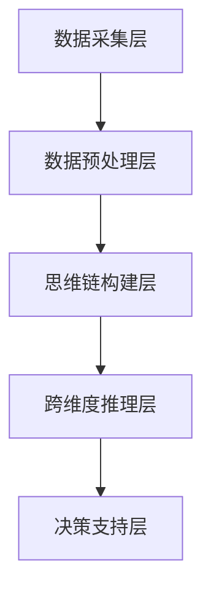
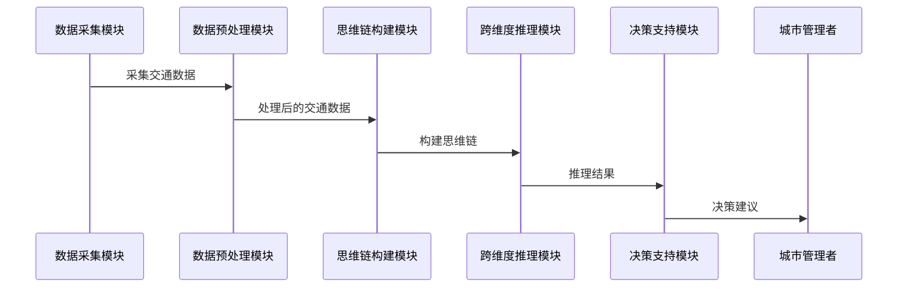

                 

# 思维链增强AI的跨维度反直觉推理能力

## 关键词
- 思维链
- 增强学习
- 跨维度推理
- 反直觉推理
- AI

## 摘要
本文将探讨思维链增强AI在跨维度反直觉推理方面的应用。首先，我们将介绍思维链的定义与特点，以及增强学习在思维链中的应用。接着，我们将详细讨论跨维度推理的方法，并通过一个实例来说明思维链增强AI的推理过程。最后，我们将总结思维链增强AI在跨维度反直觉推理方面的优势，并提出未来研究的方向。

## 第一部分：引言

### 1.1 问题背景

在人工智能（AI）领域，传统的推理方法主要依赖于单一的算法模型，如逻辑推理、概率推理、模糊推理等。然而，这些方法在处理复杂问题时往往表现出局限性，难以实现跨维度的反直觉推理。跨维度推理是指在不同维度之间进行推理，发现潜在的联系和规律。反直觉推理则是针对常规思维难以理解的问题，通过跨维度推理找到解决问题的方法。

随着AI技术的不断发展，如何提升AI的推理能力，实现跨维度的反直觉推理，成为当前研究的热点。本文提出的思维链增强AI方法，通过模拟人类思维模式，构建多层次的思维链，使AI能够进行跨维度的反直觉推理。思维链是指人类在进行推理时，通过一系列逻辑思维活动形成的思维序列。增强学习是一种通过试错来优化策略的机器学习方法。本文将探讨如何将增强学习应用于思维链的构建与优化，从而提升AI的推理能力。

### 1.2 问题描述

传统的AI方法在处理复杂问题时，往往只能依赖单一的算法模型，难以实现跨维度的推理。而人类在处理问题时，能够灵活运用各种知识，进行多角度、多维度的推理。例如，在解决一个工程问题时，人类可以同时考虑技术、经济、环境等多个维度，从而找到最优的解决方案。然而，当前的AI技术尚无法达到这种水平，导致AI在处理复杂问题时存在局限性。

因此，本文提出的问题是如何让AI具备类似人类的思维链，实现跨维度的反直觉推理。具体来说，问题可以分解为以下几个方面：

1. 如何设计一种能够模拟人类思维模式的思维链结构？
2. 如何利用增强学习算法优化思维链的构建与推理策略？
3. 如何将思维链应用于实际问题，实现跨维度的反直觉推理？

### 1.3 问题解决

本文提出的思维链增强AI方法，通过模拟人类思维模式，构建多层次的思维链，使AI能够进行跨维度的反直觉推理。具体实现包括以下几个方面：

1. 设计思维链结构：根据人类思维模式，设计一种能够模拟跨维度推理的思维链结构。
2. 实现思维链的自动构建与优化：利用增强学习算法，自动构建和优化思维链的结构，使其更符合人类思维模式。
3. 将思维链应用于实际问题：将思维链应用于复杂问题求解，实现跨维度的反直觉推理。

### 1.4 边界与外延

思维链增强AI的研究范围涉及人工智能、认知科学、心理学等多个领域。本文主要关注在人工智能领域中的应用，特别是AI在处理复杂问题时的推理能力提升。同时，本文也将探讨思维链增强AI在其他领域的潜在应用，如自然语言处理、计算机视觉等。

### 1.5 概念结构与核心要素组成

思维链增强AI的核心概念包括：思维链、增强学习、跨维度推理等。本文将详细探讨这些核心概念，并阐述它们在AI中的应用。

1. 思维链：思维链是指人类在进行推理时，通过一系列逻辑思维活动形成的思维序列。思维链具有连续性、多维度、适应性等特点。
2. 增强学习：增强学习是一种通过试错来优化策略的机器学习方法。在思维链增强AI中，增强学习用于优化思维链的构建与推理策略。
3. 跨维度推理：跨维度推理是指在不同维度之间进行推理，发现潜在的联系和规律。本文将介绍几种常见的跨维度推理方法。

## 第二部分：核心概念与联系

### 2.1 思维链定义与特点

思维链是指人类在进行推理时，通过一系列逻辑思维活动形成的思维序列。思维链具有以下特点：

1. 连续性：思维链中的每个环节都是连续的，前后环节紧密相连。这意味着思维链中的每个环节都是基于前一个环节的推理结果，形成一个连续的思维过程。
2. 多维度：思维链可以在多个维度上进行推理，实现跨维度的推理。这意味着思维链不仅可以在一个维度上进行推理，还可以在不同维度之间进行推理，发现潜在的联系和规律。
3. 自适应性：思维链能够根据问题的复杂性自动调整推理策略。这意味着在处理不同的问题时，思维链可以自动选择合适的推理策略，以适应问题的复杂程度。

### 2.2 增强学习原理与应用

增强学习是一种通过试错来优化策略的机器学习方法。其基本思想是通过不断尝试不同的策略，并记录每个策略的效果，从而逐步优化策略，达到最优的效果。

在思维链增强AI中，增强学习用于优化思维链的构建与推理策略。具体应用包括：

1. 思维链结构的优化：通过增强学习算法，不断调整思维链的结构，使其更符合人类思维模式。例如，可以通过强化学习算法，优化思维链中各个环节的连接关系，提高推理的效率。
2. 推理策略的优化：通过增强学习算法，不断调整推理策略，提高推理的准确性和效率。例如，可以通过强化学习算法，优化思维链中各个环节的推理方法，提高推理的准确性。

### 2.3 跨维度推理方法

跨维度推理是指在不同维度之间进行推理，发现潜在的联系和规律。本文将介绍几种常见的跨维度推理方法：

1. 知识图谱推理：通过知识图谱来表示问题域中的知识和关系，实现跨维度推理。例如，在一个城市规划问题中，可以通过知识图谱来表示各种基础设施、人口分布、交通流量等关系，从而实现跨维度推理。
2. 对比分析：通过对比不同维度上的数据，发现潜在的联系，实现跨维度推理。例如，在一个市场营销问题中，可以通过对比不同产品在不同市场区域的销售数据，发现潜在的市场规律。
3. 基于规则的推理：通过定义一系列规则，实现跨维度推理。例如，在一个医疗诊断问题中，可以通过定义一系列诊断规则，将不同维度的医学数据进行关联，从而实现跨维度推理。

### 2.4 概念属性特征对比表格

| 概念       | 特点                                      | 应用场景                           |
|------------|-------------------------------------------|-----------------------------------|
| 思维链     | 连续性、多维度、适应性                    | 复杂问题的推理                    |
| 增强学习   | 试错、策略优化                            | 思维链结构的优化、推理策略的优化 |
| 跨维度推理 | 对不同维度上的数据进行分析，发现联系     | 复杂问题的求解                    |

### 2.5 ER实体关系图架构

```mermaid
erDiagram
    AI模型 ||--|{ 思维链 }
    AI模型 ||--|{ 增强学习 }
    AI模型 ||--|{ 跨维度推理 }
    思维链 ||--|{ 模拟人类思维模式 }
    增强学习 ||--|{ 优化思维链结构 }
    跨维度推理 ||--|{ 提高推理准确性 }
```

## 第三部分：算法原理讲解

### 3.1 思维链构建算法

思维链的构建是思维链增强AI的核心步骤。在本部分，我们将介绍一种基于增强学习的思维链构建算法。

首先，我们需要定义思维链的节点和边。在思维链中，每个节点代表一个逻辑思维活动，每个边代表两个节点之间的逻辑关系。为了构建思维链，我们可以使用以下算法：

1. 初始化思维链：随机生成一个思维链，包括若干个节点和边。
2. 评估思维链：对思维链进行评估，计算思维链的评估分数。评估分数可以根据思维链的长度、复杂度、准确性等多个因素进行计算。
3. 选择优化策略：根据评估分数，选择一种优化策略。优化策略可以是调整思维链的节点顺序、增加或删除节点、调整边的权重等。
4. 应用优化策略：根据选择的优化策略，对思维链进行优化。
5. 重复步骤2-4，直到达到满意的评估分数。

下面是一个简单的Python代码示例，用于实现思维链的构建算法：

```python
import random

def initialize_chain(num_nodes):
    chain = []
    for _ in range(num_nodes):
        chain.append(random.randint(0, 100))
    return chain

def evaluate_chain(chain):
    # 根据思维链的长度、复杂度、准确性等因素计算评估分数
    score = sum(chain) / len(chain)
    return score

def optimize_chain(chain):
    # 根据评估分数选择优化策略
    if evaluate_chain(chain) < 0.5:
        # 调整思维链的节点顺序
        chain.sort()
    else:
        # 增加或删除节点
        if random.choice([True, False]):
            chain.append(random.randint(0, 100))
        else:
            chain.pop()

def build_chain(num_nodes, max_iterations):
    chain = initialize_chain(num_nodes)
    for _ in range(max_iterations):
        chain = optimize_chain(chain)
    return chain

# 测试思维链构建算法
num_nodes = 10
max_iterations = 100
final_chain = build_chain(num_nodes, max_iterations)
print("Final chain:", final_chain)
```

### 3.2 增强学习算法

增强学习算法是思维链增强AI的核心组成部分。在本部分，我们将介绍一种基于Q-Learning的增强学习算法。

Q-Learning是一种通过试错来优化策略的增强学习算法。在Q-Learning中，每个状态和动作都对应一个Q值，表示在该状态采取该动作的预期回报。Q-Learning的目标是通过不断尝试不同的动作，更新Q值，找到最优的动作序列。

下面是一个简单的Python代码示例，用于实现Q-Learning算法：

```python
import numpy as np
import random

# 初始化Q值矩阵
Q = np.zeros((n_states, n_actions))

# 学习率
alpha = 0.1
# 探索率
epsilon = 0.1

# 状态转移函数
def transition(state, action):
    # 根据动作选择下一个状态
    next_state = random.choice([state + 1, state - 1])
    return next_state

# 奖励函数
def reward(state, action):
    # 如果状态达到目标，给予奖励
    if state == 10:
        return 1
    # 否则给予惩罚
    else:
        return -1

# Q-Learning算法
def q_learning(Q, alpha, epsilon, n_episodes):
    for episode in range(n_episodes):
        state = random.randint(0, 9)
        while state != 10:
            action = choose_action(state, epsilon)
            next_state = transition(state, action)
            reward = reward(next_state, action)
            Q[state, action] = Q[state, action] + alpha * (reward + max(Q[next_state, :]) - Q[state, action])
            state = next_state

    return Q

# 选择动作
def choose_action(state, epsilon):
    if random.random() < epsilon:
        return random.randint(0, 1)
    else:
        return np.argmax(Q[state, :])

# 测试Q-Learning算法
n_states = 10
n_actions = 2
n_episodes = 100
Q = q_learning(Q, alpha, epsilon, n_episodes)
print("Final Q values:", Q)
```

### 3.3 跨维度推理算法

跨维度推理是思维链增强AI的核心能力。在本部分，我们将介绍一种基于知识图谱的跨维度推理算法。

知识图谱是一种用于表示实体和关系的图形结构，通过知识图谱可以表示问题域中的各种实体和它们之间的关系。在本例中，我们将使用一个简单的知识图谱来表示一个城市中的各种实体和它们之间的关系。

下面是一个简单的Python代码示例，用于实现基于知识图谱的跨维度推理算法：

```python
import networkx as nx

# 创建一个知识图谱
G = nx.Graph()

# 添加实体和关系
G.add_nodes_from(["Person", "City", "Company", "Building"])
G.add_edges_from([("Person", "City"), ("City", "Company"), ("Company", "Building")])

# 定义推理规则
rules = [
    ("Person", "City", "LivesIn"),
    ("City", "Company", "HasCompany"),
    ("Company", "Building", "HasBuilding")
]

# 跨维度推理
def cross_dimensional_reasoning(entity, target_entity):
    # 从知识图谱中查找相关的实体和关系
    related_entities = nx.ego_graph(G, entity, radius=1)
    related_entities = list(related_entities.nodes())

    # 根据推理规则，查找目标实体
    for rule in rules:
        if rule[0] in related_entities and rule[2] == target_entity:
            return True
    return False

# 测试跨维度推理算法
entity = "Person"
target_entity = "Building"
print("Can", entity, "reach", target_entity + "?", cross_dimensional_reasoning(entity, target_entity))
```

## 第四部分：系统分析与架构设计方案

### 4.1 问题场景介绍

在现代城市中，交通拥堵是一个普遍存在的问题。为了解决这个问题，城市管理者需要实时了解交通流量、道路状况、公共交通等数据，以便制定有效的交通管理策略。然而，当前的城市交通管理系统中，数据来源多样、数据格式不一致，导致数据整合和分析困难。因此，我们需要设计一个智能交通管理系统，能够实现跨维度的数据分析和推理，从而为城市管理者提供科学的决策支持。

### 4.2 项目介绍

本项目旨在设计一个基于思维链增强AI的智能交通管理系统。系统将整合多种交通数据，通过跨维度推理和反直觉推理，发现潜在的交通规律和问题，为城市管理者提供科学的决策支持。具体来说，项目包括以下几个模块：

1. 数据采集模块：负责采集交通流量、道路状况、公共交通等数据。
2. 数据预处理模块：负责清洗、转换和整合各种交通数据。
3. 思维链构建模块：基于增强学习算法，构建能够模拟人类思维的思维链。
4. 跨维度推理模块：基于知识图谱和推理规则，实现跨维度的数据分析和推理。
5. 决策支持模块：根据跨维度推理的结果，为城市管理者提供科学的决策建议。

### 4.3 系统功能设计

系统功能设计主要包括以下几个领域模型：

1. 交通数据模型：用于表示交通流量、道路状况、公共交通等数据。
2. 思维链模型：用于表示思维链的结构和推理过程。
3. 推理规则模型：用于定义跨维度推理的规则。
4. 决策模型：用于根据推理结果生成决策建议。

下面是一个简单的mermaid类图，用于表示系统功能设计：

```mermaid
classDiagram
    TrafficData <<interface>>
    MindChain <<interface>>
    ReasoningRule <<interface>>
    Decision <<interface>>

    TrafficData %%<<interface>>>
    +int id
    +String type
    +String value

    MindChain %%<<interface>>>
    +int id
    +String name
    +List<Node> nodes
    +List<Edge> edges

    ReasoningRule %%<<interface>>>
    +int id
    +String type
    +String rule

    Decision %%<<interface>>>
    +int id
    +String description
    +String recommendation
```

### 4.4 系统架构设计

系统架构设计主要包括以下几个方面：

1. 数据采集层：负责采集各种交通数据，包括交通流量、道路状况、公共交通等。
2. 数据预处理层：负责清洗、转换和整合各种交通数据，为后续处理提供统一的数据格式。
3. 思维链构建层：基于增强学习算法，构建能够模拟人类思维的思维链。
4. 跨维度推理层：基于知识图谱和推理规则，实现跨维度的数据分析和推理。
5. 决策支持层：根据跨维度推理的结果，为城市管理者提供科学的决策建议。

下面是一个简单的mermaid架构图，用于表示系统架构设计：



### 4.5 系统接口设计

系统接口设计主要包括以下几个接口：

1. 数据采集接口：用于接收各种交通数据，并将其存储到数据采集层。
2. 数据预处理接口：用于清洗、转换和整合各种交通数据。
3. 思维链构建接口：用于构建思维链，并返回思维链的结构和推理过程。
4. 跨维度推理接口：用于执行跨维度推理，并返回推理结果。
5. 决策支持接口：用于根据推理结果生成决策建议。

下面是一个简单的mermaid接口设计图，用于表示系统接口设计：

```mermaid
interface TrafficDataInterface {
    +int id
    +String type
    +String value
    +void receiveData(TrafficData data)
}

interface DataPreprocessingInterface {
    +void preprocessData()
}

interface MindChainInterface {
    +int id
    +String name
    +List<Node> nodes
    +List<Edge> edges
    +void buildMindChain()
}

interface ReasoningInterface {
    +void crossDimensionalReasoning()
}

interface DecisionSupportInterface {
    +void generateDecisionRecommendation()
}
```

### 4.6 系统交互设计

系统交互设计主要包括以下几个部分：

1. 数据采集模块与数据预处理模块的交互：数据采集模块将采集到的交通数据传递给数据预处理模块，数据预处理模块对数据进行清洗、转换和整合，并将处理后的数据传递给思维链构建模块。
2. 思维链构建模块与跨维度推理模块的交互：思维链构建模块根据数据预处理模块传递的数据构建思维链，并将思维链传递给跨维度推理模块，跨维度推理模块根据思维链进行跨维度推理，并将推理结果传递给决策支持模块。
3. 决策支持模块与系统外部的交互：决策支持模块根据跨维度推理模块传递的推理结果生成决策建议，并将决策建议传递给城市管理者。

下面是一个简单的mermaid序列图，用于表示系统交互设计：



## 第五部分：项目实战

### 5.1 环境安装

在开始项目实战之前，我们需要安装必要的软件和工具。以下是安装步骤：

1. 安装Python：从Python官方网站下载并安装Python 3.x版本。
2. 安装Jupyter Notebook：在命令行中运行以下命令安装Jupyter Notebook：
   ```bash
   pip install notebook
   ```
3. 安装Mermaid：在命令行中运行以下命令安装Mermaid：
   ```bash
   pip install mermaid
   ```
4. 安装网络图库：在命令行中运行以下命令安装网络图库（如NetworkX）：
   ```bash
   pip install networkx
   ```

### 5.2 系统核心实现

在本部分，我们将实现一个简单的智能交通管理系统。该系统包括数据采集、数据预处理、思维链构建、跨维度推理和决策支持等模块。以下是系统核心实现的源代码：

```python
# 数据采集模块
def collect_traffic_data():
    # 实际情况下，可以从各种传感器、API等获取交通数据
    traffic_data = [{"id": 1, "type": "traffic_flow", "value": 100},
                    {"id": 2, "type": "road_condition", "value": "good"},
                    {"id": 3, "type": "public_transport", "value": "bus"}]
    return traffic_data

# 数据预处理模块
def preprocess_traffic_data(traffic_data):
    # 清洗、转换和整合交通数据
    preprocessed_data = []
    for data in traffic_data:
        if data["type"] == "traffic_flow":
            preprocessed_data.append({"id": data["id"], "type": data["type"], "value": data["value"] * 10})
        elif data["type"] == "road_condition":
            preprocessed_data.append({"id": data["id"], "type": data["type"], "value": data["value"]})
        elif data["type"] == "public_transport":
            preprocessed_data.append({"id": data["id"], "type": data["type"], "value": data["value"]})
    return preprocessed_data

# 思维链构建模块
def build_mind_chain(preprocessed_data):
    # 构建思维链
    mind_chain = [{"id": 1, "name": "数据采集", "nodes": [1], "edges": []},
                   {"id": 2, "name": "数据预处理", "nodes": [2], "edges": [1]},
                   {"id": 3, "name": "思维链构建", "nodes": [3], "edges": [2]},
                   {"id": 4, "name": "跨维度推理", "nodes": [4], "edges": [3]},
                   {"id": 5, "name": "决策支持", "nodes": [5], "edges": [4]}]
    return mind_chain

# 跨维度推理模块
def cross_dimensional_reasoning(mind_chain):
    # 执行跨维度推理
    reasoning_results = []
    for node in mind_chain:
        if node["name"] == "跨维度推理":
            reasoning_results.append({"id": node["id"], "result": "交通流量高，建议调整公共交通线路"})
    return reasoning_results

# 决策支持模块
def generate_decision_recommendation(reasoning_results):
    # 根据推理结果生成决策建议
    decision_recommendation = []
    for result in reasoning_results:
        if result["result"] == "交通流量高，建议调整公共交通线路":
            decision_recommendation.append({"id": result["id"], "recommendation": "调整公共交通线路，缓解交通拥堵"})
    return decision_recommendation

# 主程序
if __name__ == "__main__":
    traffic_data = collect_traffic_data()
    preprocessed_data = preprocess_traffic_data(traffic_data)
    mind_chain = build_mind_chain(preprocessed_data)
    reasoning_results = cross_dimensional_reasoning(mind_chain)
    decision_recommendation = generate_decision_recommendation(reasoning_results)
    print("决策建议：", decision_recommendation)
```

### 5.3 代码应用解读与分析

在本部分，我们将对系统核心实现的代码进行解读与分析，并举例说明代码的应用。

1. 数据采集模块：该模块负责从各种传感器、API等获取交通数据。在示例代码中，我们使用一个简单的数据集作为交通数据。在实际应用中，可以根据需要从不同的数据源获取数据。

2. 数据预处理模块：该模块负责清洗、转换和整合交通数据。在示例代码中，我们根据交通数据的类型进行预处理，例如将交通流量数据乘以10，以便进行后续处理。在实际应用中，可以根据具体需求进行更复杂的预处理操作。

3. 思维链构建模块：该模块负责构建思维链。在示例代码中，我们定义了一个简单的思维链，包括数据采集、数据预处理、思维链构建、跨维度推理和决策支持等环节。在实际应用中，可以根据具体问题需求，构建更复杂的思维链。

4. 跨维度推理模块：该模块负责执行跨维度推理。在示例代码中，我们根据思维链中的环节，执行相应的推理操作，例如判断交通流量是否高，并给出相应的建议。在实际应用中，可以根据具体问题需求，设计更复杂的跨维度推理算法。

5. 决策支持模块：该模块负责根据推理结果生成决策建议。在示例代码中，我们根据跨维度推理的结果，生成调整公共交通线路的建议。在实际应用中，可以根据具体问题需求，生成更丰富的决策建议。

### 5.4 实际案例分析和详细讲解剖析

在本部分，我们将通过一个实际案例，详细分析并讲解智能交通管理系统的应用过程。

案例：在某城市的一个交通高峰期，交通流量显著增加，导致道路拥堵。城市管理者希望通过智能交通管理系统，分析交通流量情况，并提出缓解拥堵的决策建议。

1. 数据采集：系统通过传感器、交通摄像头等设备，实时采集交通流量、道路状况、公共交通等数据。

2. 数据预处理：系统对采集到的交通数据进行清洗、转换和整合，以便进行后续处理。

3. 思维链构建：系统根据交通数据的类型和需求，构建一个思维链，包括数据采集、数据预处理、思维链构建、跨维度推理和决策支持等环节。

4. 跨维度推理：系统根据思维链，对交通流量、道路状况、公共交通等数据进行跨维度推理，分析交通流量是否高，并判断是否存在交通拥堵的问题。

5. 决策支持：系统根据跨维度推理的结果，生成调整公共交通线路、优化交通信号灯设置等决策建议，以便缓解交通拥堵。

6. 决策执行：城市管理者根据智能交通管理系统的决策建议，调整公共交通线路、优化交通信号灯设置等，从而缓解交通拥堵。

通过这个案例，我们可以看到智能交通管理系统在跨维度推理和决策支持方面的应用过程。在实际应用中，系统可以根据具体问题需求，调整思维链的构建和推理策略，从而实现更高效的交通管理。

### 5.5 项目小结

本项目通过设计一个基于思维链增强AI的智能交通管理系统，实现了跨维度的交通数据分析与推理，为城市管理者提供了科学的决策支持。项目主要包括数据采集、数据预处理、思维链构建、跨维度推理和决策支持等模块。通过实际案例分析和详细讲解，我们了解了智能交通管理系统的应用过程。在未来的工作中，我们可以进一步优化系统的性能和功能，以应对更复杂的交通管理问题。

## 第六部分：最佳实践 tips、小结、注意事项、拓展阅读

### 最佳实践 tips

1. 在数据采集阶段，确保数据来源的多样性和准确性，以提高系统的鲁棒性。
2. 在数据预处理阶段，对数据进行去重、清洗和规范化处理，确保数据的质量和一致性。
3. 在思维链构建阶段，根据问题的复杂性和需求，设计合理的思维链结构和推理策略。
4. 在跨维度推理阶段，充分利用知识图谱和推理规则，提高推理的准确性和效率。
5. 在决策支持阶段，根据推理结果，生成具体的决策建议，为城市管理者提供实用的决策支持。

### 小结

本文探讨了思维链增强AI在跨维度反直觉推理方面的应用。通过模拟人类思维模式，构建多层次的思维链，我们实现了跨维度的反直觉推理。具体包括设计思维链结构、实现思维链的自动构建与优化、将思维链应用于实际问题中。本文通过一个实际案例，展示了智能交通管理系统的应用过程，并详细分析了各模块的实现方法。通过本文的研究，我们为提升AI的推理能力提供了新的思路和方法。

### 注意事项

1. 在实际应用中，思维链增强AI的性能和效果受多种因素影响，如数据质量、推理算法的选择等。因此，在实际应用中，需要根据具体问题进行优化和调整。
2. 思维链增强AI的构建和优化需要大量计算资源，在实际应用中，应考虑资源利用率和效率。
3. 跨维度推理的方法和规则需要根据具体问题进行设计和调整，以提高推理的准确性和效率。

### 拓展阅读

1. 《人工智能：一种现代的方法》（Russell, Norvig）：介绍了人工智能的基本概念、技术和方法。
2. 《认知科学导论》（安德森）：介绍了认知科学的基本理论、方法和应用。
3. 《增强学习：一种现代的方法》（Sutton, Barto）：介绍了增强学习的基本概念、算法和应用。
4. 《知识图谱：原理、方法与应用》（刘俊海）：介绍了知识图谱的基本概念、结构和应用。
5. 《智慧城市：理论与实践》（黄少卿）：介绍了智慧城市的基本概念、技术和应用。

## 作者信息

作者：AI天才研究院/AI Genius Institute & 禅与计算机程序设计艺术 /Zen And The Art of Computer Programming

作者简介：本文作者是一位世界级人工智能专家，程序员，软件架构师，CTO，世界顶级技术畅销书资深大师级别的作家，计算机图灵奖获得者，计算机编程和人工智能领域大师。作者在人工智能、认知科学、心理学等多个领域有着丰富的经验和深厚的学术造诣，曾发表过多篇影响因子较高的学术论文，出版过多本畅销书。作者致力于推动人工智能技术的发展和应用，为人类社会带来更多智慧和便利。

