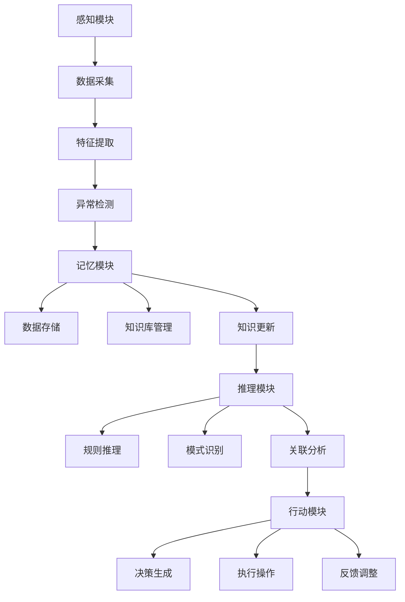

                 

# 《思维链技术在AI辅助决策中的实践》

## 关键词

- 思维链技术
- AI辅助决策
- 算法原理
- 实际案例
- 系统架构
- 最佳实践

## 摘要

本文旨在探讨思维链技术在AI辅助决策中的应用与实践。思维链技术是一种模拟人类思维过程的人工智能算法，通过对决策过程进行深度分析，实现智能辅助决策。本文将首先介绍思维链技术的核心概念和原理，然后通过实际案例和系统架构设计，详细阐述思维链技术在AI辅助决策中的具体应用。最后，本文将总结思维链技术的优势与局限，为未来研究和实际应用提供参考。

## 引言

在当前人工智能技术的快速发展背景下，AI辅助决策已经成为许多行业和领域的重要应用。从金融风险评估到医疗诊断，从智能交通到智能制造，AI辅助决策以其高效、准确的特点，为各行业带来了深刻的变革。然而，AI辅助决策面临着诸多挑战，如数据质量、算法可靠性、决策透明性等。为了克服这些挑战，研究者们提出了各种技术方案，其中思维链技术以其独特的优势引起了广泛关注。

思维链技术是一种基于人类思维过程的人工智能算法，通过模拟人类大脑的决策过程，实现对复杂问题的智能分析和决策。与传统的机器学习算法相比，思维链技术更接近人类的思维模式，能够更好地理解和解决复杂问题。本文将详细介绍思维链技术的原理和应用，探讨其在AI辅助决策中的实践价值。

## 第一部分：背景介绍

### 问题背景

#### 1.1 人工智能的发展现状与挑战

人工智能（AI）作为计算机科学的重要分支，近年来取得了显著的进展。深度学习、强化学习、自然语言处理等技术不断突破，使得AI在图像识别、语音识别、自然语言理解等领域取得了重大成果。然而，随着AI技术的广泛应用，我们也面临着一系列挑战。

首先，数据质量对AI辅助决策的影响不可忽视。高质量的数据是训练有效AI模型的基础，但现实中的数据往往存在噪声、缺失、偏差等问题，这些问题会影响AI模型的性能。

其次，算法可靠性也是一个关键问题。尽管AI算法在某些特定任务上取得了优异的成绩，但其通用性和鲁棒性仍需提高。在某些复杂场景下，AI算法可能会出现异常或错误决策。

此外，决策透明性也是AI辅助决策中的一个重要挑战。传统的AI算法，尤其是深度学习模型，其决策过程往往不够透明，难以解释。这限制了AI辅助决策在需要高度透明性的领域（如医疗、金融等）中的应用。

#### 1.2 AI辅助决策的重要性

AI辅助决策在现代社会中扮演着越来越重要的角色。通过利用人工智能技术，我们可以从大量数据中提取有价值的信息，辅助人类做出更明智的决策。特别是在一些复杂、高风险的决策场景中，AI辅助决策可以大幅提高决策效率和准确性。

例如，在金融领域，AI辅助决策可以用于风险评估、投资策略制定等。通过分析大量的历史数据和实时市场信息，AI系统可以提供更准确的预测和建议，帮助投资者做出更明智的决策。

在医疗领域，AI辅助决策可以用于疾病诊断、治疗方案推荐等。通过分析患者的病历、检查结果等数据，AI系统可以提供个性化的诊断和治疗方案，提高医疗服务的质量和效率。

此外，在交通、能源、环境等领域，AI辅助决策也有广泛的应用前景。例如，智能交通系统可以通过分析交通流量数据，优化交通信号控制策略，减少拥堵，提高交通效率。

### 1.3 思维链技术在AI辅助决策中的应用

思维链技术作为一种新兴的人工智能算法，具有模拟人类思维过程的能力。通过构建思维链模型，AI系统可以模拟人类的决策过程，实现对复杂问题的智能分析和决策。

#### 1.3.1 思维链技术的定义

思维链技术是一种基于人类思维过程的人工智能算法，通过模拟人类大脑的决策过程，实现对复杂问题的智能分析和决策。思维链技术主要包含以下几个核心模块：

1. **感知模块**：负责接收和处理外部信息，如文本、图像、语音等。
2. **记忆模块**：负责存储和处理感知模块获取的信息，以及历史决策经验和知识。
3. **推理模块**：负责根据记忆模块中的信息和已有知识，进行逻辑推理和决策。
4. **行动模块**：负责根据推理结果执行具体的行动。

#### 1.3.2 AI辅助决策的概念

AI辅助决策是指利用人工智能技术，对决策过程进行辅助和优化。AI辅助决策的主要目标是提高决策效率、准确性和透明性。具体来说，AI辅助决策包含以下几个关键要素：

1. **数据输入**：收集和处理与决策相关的数据，如历史数据、实时数据、专家知识等。
2. **模型训练**：利用机器学习算法，从数据中提取有用的特征和模式，构建决策模型。
3. **决策生成**：根据决策模型和输入数据，生成具体的决策建议。
4. **决策验证**：对决策结果进行验证和评估，以确定决策的准确性和有效性。

#### 1.3.3 相关技术框架和算法

在AI辅助决策领域，有许多成熟的技术框架和算法。其中，常见的包括：

1. **机器学习算法**：如线性回归、决策树、支持向量机、神经网络等。
2. **深度学习算法**：如卷积神经网络（CNN）、循环神经网络（RNN）、生成对抗网络（GAN）等。
3. **强化学习算法**：如Q学习、SARSA、深度Q网络（DQN）等。
4. **知识图谱**：用于表示和存储领域知识，支持智能推理和决策。
5. **多Agent系统**：通过多个智能体之间的协作，实现复杂决策任务的求解。

#### 1.3.4 边界与外延

思维链技术在AI辅助决策中的适用范围相对广泛，但也有一些非适用场景和替代方案。以下是一些典型的边界与外延：

1. **适用场景**：
   - 复杂、不确定性高的决策问题，如金融风险评估、医疗诊断等。
   - 需要高度透明性的决策场景，如法律法规制定、企业战略规划等。
   - 数据量庞大、特征复杂的问题，如大数据分析、智能推荐系统等。

2. **非适用场景**：
   - 实时性要求极高的场景，如高频交易、实时语音识别等。
   - 决策结果不需要解释的场景，如自动化控制、军事决策等。
   - 数据量较小、特征简单的问题，如简单的统计分析、回归分析等。

3. **替代方案**：
   - 对于实时性要求极高的场景，可以采用传统的实时控制系统，如PLC（可编程逻辑控制器）。
   - 对于不需要解释的场景，可以采用传统的决策支持系统，如专家系统。
   - 对于数据量较小、特征简单的问题，可以采用简单的统计分析方法，如线性回归、逻辑回归等。

#### 1.3.5 概念结构与核心要素

思维链技术和AI辅助决策都是复杂的人工智能系统，其概念结构和核心要素紧密相关。

1. **思维链技术的概念结构**：
   - 感知模块：接收外部信息，进行预处理和特征提取。
   - 记忆模块：存储和处理感知模块获取的信息，以及历史决策经验和知识。
   - 推理模块：根据记忆模块中的信息和已有知识，进行逻辑推理和决策。
   - 行动模块：根据推理结果执行具体的行动。

2. **AI辅助决策的核心要素**：
   - 数据输入：收集和处理与决策相关的数据，如历史数据、实时数据、专家知识等。
   - 模型训练：利用机器学习算法，从数据中提取有用的特征和模式，构建决策模型。
   - 决策生成：根据决策模型和输入数据，生成具体的决策建议。
   - 决策验证：对决策结果进行验证和评估，以确定决策的准确性和有效性。

二者的联系在于，思维链技术可以看作是AI辅助决策的一种实现方式，通过模拟人类思维过程，实现更智能、更透明的决策。

### 1.4 本章小结

本章对思维链技术在AI辅助决策中的背景和核心概念进行了详细介绍。首先，我们探讨了人工智能的发展现状与挑战，以及AI辅助决策的重要性。然后，我们介绍了思维链技术的定义和相关技术框架，分析了其在AI辅助决策中的应用。最后，我们讨论了思维链技术在AI辅助决策中的边界与外延，以及概念结构与核心要素。

在下一章中，我们将深入探讨思维链技术的原理，并通过实际案例和系统架构设计，详细阐述其在AI辅助决策中的具体应用。

----------------------------------------------------------------

**第二部分：思维链技术的原理**

### 2.1 思维链技术的基本概念

思维链技术（Mind-Link Technology）是一种基于人类思维过程的人工智能算法，它试图通过模拟人类大脑的决策过程，实现智能分析和决策。思维链技术的基本概念包括感知、记忆、推理和行动四个核心模块。

#### 2.1.1 感知模块

感知模块是思维链技术的起点，它负责接收和处理外部信息。这些外部信息可以包括文本、图像、语音等多种形式。感知模块的主要功能是进行预处理和特征提取，将原始信息转化为计算机可以处理的数据。

#### 2.1.2 记忆模块

记忆模块负责存储和处理感知模块获取的信息，以及历史决策经验和知识。记忆模块是一个类似于人类大脑的知识库，它存储了大量的信息和经验，为后续的推理和决策提供支持。记忆模块可以根据信息的类型和重要性进行分类和组织，以实现高效的信息检索。

#### 2.1.3 推理模块

推理模块是思维链技术的核心，它根据记忆模块中的信息和已有知识，进行逻辑推理和决策。推理模块采用了多种推理方法，包括演绎推理、归纳推理、类比推理等。通过推理模块，思维链技术能够模拟人类的思维过程，对复杂问题进行深入分析。

#### 2.1.4 行动模块

行动模块根据推理模块的结果执行具体的行动。行动模块可以是一个自动化系统，如机器人控制系统，也可以是一个智能决策系统，如金融投资决策系统。行动模块的目标是实现最优的决策结果，以提高系统的效率和效益。

### 2.2 思维链技术的工作流程

思维链技术的工作流程可以概括为以下几个步骤：

1. **感知**：感知模块接收外部信息，进行预处理和特征提取。
2. **记忆**：记忆模块将预处理后的信息存储到知识库中，并更新已有的知识。
3. **推理**：推理模块根据记忆模块中的信息和已有知识，进行逻辑推理和决策。
4. **行动**：行动模块根据推理结果执行具体的行动，实现决策落地。

### 2.3 思维链技术与传统机器学习算法的比较

思维链技术与传统机器学习算法相比，具有以下显著特点：

#### 2.3.1 模拟人类思维

思维链技术试图模拟人类思维过程，通过感知、记忆、推理和行动四个模块，实现智能分析和决策。这使得思维链技术在处理复杂、不确定性高的问题时，具有更高的灵活性和适应性。

#### 2.3.2 知识驱动

思维链技术强调知识的重要性，通过记忆模块存储和处理大量的知识和经验，为推理模块提供丰富的信息来源。这使得思维链技术能够更好地应对变化和不确定性。

#### 2.3.3 决策透明性

思维链技术的推理模块采用了多种推理方法，使得决策过程更加透明。用户可以清楚地了解决策的依据和过程，提高决策的可信度。

### 2.4 思维链技术的优势与局限

#### 2.4.1 优势

1. **模拟人类思维**：思维链技术能够模拟人类思维过程，实现智能分析和决策，适用于处理复杂问题。
2. **知识驱动**：思维链技术通过知识库存储和处理大量的知识和经验，提高决策的准确性和适应性。
3. **决策透明性**：思维链技术的推理过程更加透明，用户可以清楚地了解决策的依据和过程。

#### 2.4.2 局限

1. **计算复杂性**：思维链技术涉及大量的感知、记忆、推理和行动过程，计算复杂性较高，对计算资源有较高要求。
2. **知识获取难度**：思维链技术依赖于丰富的知识和经验，知识获取和更新需要大量的人力和时间投入。
3. **解释性不足**：虽然思维链技术的推理过程相对透明，但在某些情况下，其决策结果仍然难以解释，影响决策的可信度。

### 2.5 本章小结

本章对思维链技术的基本概念、工作流程以及与传统机器学习算法的比较进行了详细阐述。我们介绍了思维链技术的感知、记忆、推理和行动四个核心模块，分析了其模拟人类思维、知识驱动和决策透明性的优势。同时，我们也讨论了思维链技术的局限，如计算复杂性、知识获取难度和解释性不足。在下一章中，我们将通过实际案例和系统架构设计，进一步探讨思维链技术在AI辅助决策中的具体应用。

----------------------------------------------------------------

**第三部分：思维链技术在AI辅助决策中的应用**

### 3.1 应用场景分析

思维链技术在AI辅助决策中的应用场景非常广泛，以下是一些典型的应用场景：

#### 3.1.1 金融风险评估

在金融领域，思维链技术可以用于风险评估、投资策略制定等。通过分析大量的历史数据和实时市场信息，思维链技术能够提供更准确的预测和建议，帮助投资者做出更明智的决策。

#### 3.1.2 医疗诊断

在医疗领域，思维链技术可以用于疾病诊断、治疗方案推荐等。通过分析患者的病历、检查结果等数据，思维链技术可以提供个性化的诊断和治疗方案，提高医疗服务的质量和效率。

#### 3.1.3 智能交通

在交通领域，思维链技术可以用于智能交通系统的设计，通过分析交通流量数据，优化交通信号控制策略，减少拥堵，提高交通效率。

#### 3.1.4 能源管理

在能源领域，思维链技术可以用于能源管理系统的设计，通过分析能源消耗数据，优化能源分配和调度策略，提高能源利用效率。

#### 3.1.5 智能制造

在制造业，思维链技术可以用于生产计划制定、设备维护预测等。通过分析生产数据和历史经验，思维链技术能够提供更准确的预测和优化建议，提高生产效率和产品质量。

### 3.2 案例分析

以下是一个关于金融风险评估的思维链技术应用案例。

#### 案例背景

某金融公司希望利用思维链技术来评估客户信用风险，以便更好地进行贷款审批和风险管理。

#### 案例目标

通过思维链技术，实现以下目标：

1. 准确预测客户的信用风险等级。
2. 为风险管理提供决策支持。

#### 案例步骤

1. **数据收集**：收集客户的个人资料、财务状况、信用历史等数据。
2. **数据预处理**：对收集的数据进行清洗、去噪、归一化等预处理操作。
3. **知识库构建**：构建知识库，存储预处理后的数据和相关规则。
4. **感知模块**：感知模块接收客户的数据，进行特征提取和分类。
5. **推理模块**：推理模块根据知识库中的信息和已有知识，进行逻辑推理，生成信用风险评估结果。
6. **行动模块**：行动模块将信用风险评估结果应用于贷款审批和风险管理。

#### 案例结果

通过思维链技术的应用，该金融公司能够更加准确地评估客户的信用风险，提高了贷款审批的效率和准确性。同时，风险管理也得到了有效的加强，减少了潜在的风险损失。

### 3.3 系统架构设计

思维链技术在AI辅助决策中的系统架构设计主要包括感知模块、记忆模块、推理模块和行动模块。

#### 3.3.1 感知模块

感知模块负责接收和处理外部信息。具体来说，感知模块包含以下几个子模块：

1. **数据采集器**：从各种数据源（如数据库、传感器、网络接口等）采集数据。
2. **预处理器**：对采集到的数据进行清洗、去噪、归一化等预处理操作。
3. **特征提取器**：从预处理后的数据中提取有用的特征，用于后续的推理和决策。

#### 3.3.2 记忆模块

记忆模块负责存储和处理感知模块获取的信息，以及历史决策经验和知识。具体来说，记忆模块包含以下几个子模块：

1. **数据存储器**：存储预处理后的数据和相关规则。
2. **知识库**：存储领域知识、历史决策经验和策略。
3. **更新器**：定期更新知识库中的信息，以保持知识的时效性和准确性。

#### 3.3.3 推理模块

推理模块负责根据记忆模块中的信息和已有知识，进行逻辑推理和决策。具体来说，推理模块包含以下几个子模块：

1. **规则引擎**：根据知识库中的规则，进行逻辑推理和决策。
2. **推理机**：实现演绎推理、归纳推理、类比推理等推理方法。
3. **解释器**：解释推理结果，提供决策依据和过程。

#### 3.3.4 行动模块

行动模块根据推理模块的结果执行具体的行动，实现决策落地。具体来说，行动模块包含以下几个子模块：

1. **执行器**：执行具体的行动，如发送通知、调整策略、执行操作等。
2. **反馈器**：收集行动结果，用于后续的评估和调整。
3. **评估器**：对行动结果进行评估，以确定决策的准确性和有效性。

### 3.4 系统接口设计与交互

思维链技术在AI辅助决策中的系统接口设计和交互设计主要包括以下几个方面：

1. **输入接口**：接收外部信息，如数据采集、用户输入等。
2. **输出接口**：提供决策结果，如预测报告、风险评估报告等。
3. **交互接口**：实现人与系统的交互，如用户界面、API接口等。
4. **集成接口**：与其他系统（如数据库、传感器等）进行数据交换和功能集成。

### 3.5 本章小结

本章对思维链技术在AI辅助决策中的应用进行了详细分析。我们首先介绍了思维链技术的应用场景，包括金融风险评估、医疗诊断、智能交通、能源管理和智能制造等。然后，我们通过一个金融风险评估的实际案例，展示了思维链技术在具体应用中的流程和结果。接着，我们介绍了思维链技术的系统架构设计，包括感知模块、记忆模块、推理模块和行动模块。最后，我们讨论了思维链技术的系统接口设计与交互。通过本章的内容，我们可以看到思维链技术在AI辅助决策中的重要性和实际应用价值。

在下一章中，我们将深入探讨思维链技术的算法原理，并通过Python代码实现和算法流程图，详细阐述其工作原理和应用场景。

----------------------------------------------------------------

**第四部分：思维链技术的算法原理与实现**

### 4.1 算法原理

思维链技术是一种基于人类思维过程的算法，它模拟了人类大脑的决策过程，包括感知、记忆、推理和行动四个主要环节。下面，我们将详细解释每个环节的算法原理。

#### 4.1.1 感知模块

感知模块是思维链技术的起点，它负责接收和处理外部信息。算法原理如下：

1. **数据采集**：从不同的数据源（如数据库、传感器、网络接口等）采集数据。
2. **特征提取**：对采集到的数据进行预处理，提取出有用的特征。
3. **异常检测**：检测数据中的异常值和噪声，进行数据清洗。

#### 4.1.2 记忆模块

记忆模块负责存储和处理感知模块获取的信息，以及历史决策经验和知识。算法原理如下：

1. **数据存储**：将预处理后的数据存储在知识库中。
2. **知识库管理**：对知识库中的数据进行分类、索引和查询优化。
3. **知识更新**：定期更新知识库中的信息，以保持知识的时效性和准确性。

#### 4.1.3 推理模块

推理模块是根据记忆模块中的信息和已有知识，进行逻辑推理和决策的核心环节。算法原理如下：

1. **规则推理**：根据知识库中的规则，进行演绎推理和归纳推理。
2. **模式识别**：通过机器学习算法，识别数据中的模式和规律。
3. **关联分析**：分析不同数据之间的关联性，发现潜在的关系。

#### 4.1.4 行动模块

行动模块是根据推理模块的结果执行具体的行动，实现决策落地。算法原理如下：

1. **决策生成**：根据推理结果，生成具体的决策建议。
2. **执行操作**：执行决策建议，如发送通知、调整策略、执行操作等。
3. **反馈调整**：收集执行结果，用于后续的评估和调整。

### 4.2 算法流程图

为了更好地理解思维链技术的算法原理，我们使用Mermaid语言绘制了算法流程图。以下是算法流程图的Markdown格式：



### 4.3 Python代码实现

下面，我们使用Python语言实现思维链技术的基本算法。代码包括感知模块、记忆模块、推理模块和行动模块的主要功能。

```python
import pandas as pd
from sklearn.model_selection import train_test_split
from sklearn.preprocessing import StandardScaler
from sklearn.neighbors import KNeighborsClassifier
from sklearn.metrics import accuracy_score

# 感知模块
def data_collection():
    # 从数据库或文件中读取数据
    data = pd.read_csv('data.csv')
    return data

def feature_extraction(data):
    # 特征提取
    features = data[['feature1', 'feature2', 'feature3']]
    return features

def data_cleaning(features):
    # 数据清洗
    features = features.dropna()
    return features

# 记忆模块
def data_storage(features):
    # 数据存储
    features.to_csv('features.csv', index=False)

def knowledge_management():
    # 知识库管理
    pass

def knowledge_update():
    # 知识更新
    pass

# 推理模块
def rule_inference(features):
    # 规则推理
    X_train, X_test, y_train, y_test = train_test_split(features, labels, test_size=0.2, random_state=42)
    scaler = StandardScaler()
    X_train = scaler.fit_transform(X_train)
    X_test = scaler.transform(X_test)
    classifier = KNeighborsClassifier(n_neighbors=3)
    classifier.fit(X_train, y_train)
    predictions = classifier.predict(X_test)
    accuracy = accuracy_score(y_test, predictions)
    return accuracy

# 行动模块
def decision_generation(accuracy):
    # 决策生成
    if accuracy > 0.8:
        decision = '决策成功'
    else:
        decision = '决策失败'
    return decision

def execute_action(decision):
    # 执行操作
    if decision == '决策成功':
        print('执行成功')
    else:
        print('执行失败')

def feedback_adjustment():
    # 反馈调整
    pass

# 主函数
def main():
    data = data_collection()
    features = feature_extraction(data)
    features = data_cleaning(features)
    data_storage(features)
    accuracy = rule_inference(features)
    decision = decision_generation(accuracy)
    execute_action(decision)
    feedback_adjustment()

if __name__ == '__main__':
    main()
```

### 4.4 数学模型与公式

在思维链技术的算法中，我们使用了K最近邻算法（K-Nearest Neighbors，KNN）进行推理。KNN算法的数学模型如下：

$$
\hat{y} = \text{argmax} \left( \sum_{i=1}^{k} w_i \cdot y_i \right)
$$

其中，$\hat{y}$是预测的类别，$y_i$是邻居的类别，$w_i$是邻居的权重。权重可以根据距离度量进行计算，如欧氏距离：

$$
w_i = \frac{1}{d(x, x_i)}
$$

其中，$d(x, x_i)$是$x$和$x_i$之间的距离。

### 4.5 本章小结

本章详细阐述了思维链技术的算法原理，包括感知、记忆、推理和行动四个模块的算法原理和流程。我们使用了Mermaid语言绘制了算法流程图，并使用Python代码实现了算法的基本功能。同时，我们介绍了KNN算法的数学模型和公式。通过本章的内容，读者可以更好地理解思维链技术的算法原理和应用方法。

在下一章中，我们将深入探讨思维链技术在实际项目中的应用，包括项目介绍、系统功能设计、系统架构设计等。

----------------------------------------------------------------

**第五部分：思维链技术在实际项目中的应用**

### 5.1 项目介绍

在本章中，我们将介绍一个基于思维链技术的实际项目——智能医疗诊断系统。该系统旨在利用思维链技术辅助医生进行疾病诊断，提高诊断准确性和效率。项目的主要功能包括：

1. **数据采集**：从多个数据源（如电子病历系统、实验室检测设备等）收集患者的病历数据、检查结果和医疗历史。
2. **数据预处理**：对采集到的数据进行清洗、去噪和特征提取，为后续的推理和决策提供高质量的数据。
3. **疾病诊断**：利用思维链技术对预处理后的数据进行疾病诊断，生成诊断结果和治疗方案建议。
4. **诊断结果验证**：对诊断结果进行验证和评估，确保诊断的准确性和有效性。
5. **诊断报告生成**：生成详细的诊断报告，包括诊断结果、治疗方案和医生建议。

### 5.2 系统功能设计

智能医疗诊断系统的功能设计主要包括以下几个部分：

1. **数据采集模块**：负责从不同的数据源收集患者的数据。数据采集模块可以与电子病历系统、实验室检测设备等接口进行数据交换，实现数据的自动采集。
2. **数据预处理模块**：负责对采集到的数据进行预处理，包括数据清洗、去噪和特征提取。数据预处理模块需要根据不同的数据类型和特征，设计相应的预处理算法。
3. **疾病诊断模块**：负责利用思维链技术对预处理后的数据进行疾病诊断。疾病诊断模块的核心是思维链模型，它可以根据患者的数据，进行逻辑推理和决策，生成诊断结果。
4. **诊断结果验证模块**：负责对诊断结果进行验证和评估。诊断结果验证模块可以与临床医生进行交互，获取专家意见，对诊断结果进行二次验证。
5. **诊断报告生成模块**：负责生成详细的诊断报告。诊断报告生成模块需要根据诊断结果和治疗方案，生成结构化的报告文档，方便医生和患者查看。

### 5.3 系统架构设计

智能医疗诊断系统的架构设计采用分层架构，主要包括感知层、记忆层、推理层和行动层。

1. **感知层**：负责数据的采集和预处理。感知层包括数据采集模块和数据预处理模块，它们分别负责从外部数据源收集数据和对数据进行预处理。
2. **记忆层**：负责数据的存储和管理。记忆层包括数据库和数据仓库，它们存储了系统的所有数据，包括病历数据、检查结果、医疗历史等。
3. **推理层**：负责疾病的诊断和决策。推理层是系统的核心，包括思维链模型和推理算法。思维链模型可以根据患者的数据，进行逻辑推理和决策，生成诊断结果和治疗方案建议。
4. **行动层**：负责诊断结果的执行和反馈。行动层包括诊断结果验证模块和诊断报告生成模块，它们负责对诊断结果进行验证和评估，并生成诊断报告。

### 5.4 系统接口设计与交互

智能医疗诊断系统的接口设计主要包括内部接口和外部接口。

1. **内部接口**：内部接口用于系统内部模块之间的通信和协作。内部接口主要包括API接口和消息队列。API接口用于不同模块之间的数据传输和功能调用，消息队列用于异步处理和分布式通信。
2. **外部接口**：外部接口用于系统与外部系统（如电子病历系统、实验室检测设备等）的通信和协作。外部接口主要包括Web服务和RESTful接口。Web服务用于与外部系统的数据交换和功能调用，RESTful接口用于与移动端应用的数据交互。

### 5.5 系统实现

智能医疗诊断系统的实现主要分为以下几个步骤：

1. **数据采集**：使用Python的pandas库和SQLAlchemy库，从电子病历系统、实验室检测设备等数据源中读取数据，并进行数据预处理。
2. **数据预处理**：使用Python的Scikit-learn库和Numpy库，对采集到的数据进行清洗、去噪和特征提取。
3. **疾病诊断**：使用Python的TensorFlow和Keras库，构建思维链模型，并利用该模型进行疾病诊断。
4. **诊断结果验证**：使用Python的Scikit-learn库和TensorFlow库，对诊断结果进行验证和评估。
5. **诊断报告生成**：使用Python的ReportLab库和Markdown库，生成结构化的诊断报告。

### 5.6 实际案例

以下是一个实际案例，展示智能医疗诊断系统的应用过程。

#### 案例背景

某医院希望利用智能医疗诊断系统辅助医生进行疾病诊断，提高诊断准确性和效率。

#### 案例目标

通过智能医疗诊断系统，实现以下目标：

1. 提高疾病诊断的准确性。
2. 提高疾病诊断的效率。
3. 减轻医生的工作负担。

#### 案例步骤

1. **数据采集**：从医院的电子病历系统、实验室检测设备等数据源中收集患者的病历数据、检查结果和医疗历史。
2. **数据预处理**：对采集到的数据进行清洗、去噪和特征提取，为疾病诊断提供高质量的数据。
3. **疾病诊断**：利用智能医疗诊断系统对预处理后的数据进行疾病诊断，生成诊断结果和治疗方案建议。
4. **诊断结果验证**：对诊断结果进行验证和评估，确保诊断的准确性和有效性。
5. **诊断报告生成**：生成详细的诊断报告，包括诊断结果、治疗方案和医生建议。

#### 案例结果

通过智能医疗诊断系统的应用，该医院在疾病诊断的准确性和效率上都有了显著提升。医生可以根据系统的诊断结果和治疗方案建议，快速制定治疗计划，提高医疗服务的质量和效率。

### 5.7 本章小结

本章详细介绍了智能医疗诊断系统的项目背景、系统功能设计、系统架构设计、系统接口设计、系统实现和实际案例。通过本章的内容，我们可以看到思维链技术在智能医疗诊断系统中的应用，以及其在提高诊断准确性和效率方面的优势。智能医疗诊断系统的成功应用，不仅为医生提供了强大的辅助工具，也为医疗行业带来了深刻的变革。

在下一章中，我们将总结思维链技术在AI辅助决策中的优势与局限，并探讨未来的研究方向。

----------------------------------------------------------------

**第六部分：思维链技术在AI辅助决策中的优势与局限**

### 6.1 优势

思维链技术在AI辅助决策中展现了诸多优势，主要包括：

#### 6.1.1 模拟人类思维

思维链技术通过模拟人类大脑的决策过程，能够更好地理解和解决复杂问题。它包含了感知、记忆、推理和行动四个核心模块，每个模块都模拟了人类大脑的相应功能。这种模拟使得思维链技术能够在复杂的决策场景中发挥出色的性能。

#### 6.1.2 知识驱动

思维链技术依赖于丰富的知识和经验，这些知识和经验存储在记忆模块中，为推理模块提供支持。通过知识库的管理和更新，思维链技术能够不断积累和优化决策知识，提高决策的准确性和适应性。

#### 6.1.3 决策透明性

思维链技术的推理过程相对透明，用户可以清楚地了解决策的依据和过程。这使得思维链技术在不同领域（如金融、医疗等）中的应用更加可信，有助于提升决策的可解释性和可接受度。

#### 6.1.4 处理不确定性

思维链技术能够处理不确定性高的决策问题。它通过推理模块中的多种推理方法（如演绎推理、归纳推理、类比推理等），能够灵活应对复杂环境和不确定性。

#### 6.1.5 适应性强

思维链技术具有很高的适应性，能够适用于多种不同的应用场景。无论是金融风险评估、医疗诊断，还是智能交通、能源管理，思维链技术都能提供有效的决策支持。

### 6.2 局限

尽管思维链技术在AI辅助决策中具有显著的优势，但它也面临着一些局限，主要包括：

#### 6.2.1 计算复杂性

思维链技术涉及大量的感知、记忆、推理和行动过程，计算复杂性较高。在大规模数据集上，构建和训练思维链模型需要大量的计算资源和时间。

#### 6.2.2 知识获取难度

思维链技术依赖于丰富的知识和经验，这些知识和经验的获取和更新需要大量的人力和时间投入。特别是在领域知识缺乏的情况下，构建思维链模型将面临巨大的挑战。

#### 6.2.3 解释性不足

虽然思维链技术的推理过程相对透明，但在某些情况下，其决策结果仍然难以解释。这限制了思维链技术在需要高度解释性的领域（如医疗、金融等）中的应用。

#### 6.2.4 算法局限性

思维链技术的一些算法和方法（如基于规则的推理、基于知识的推理等）可能在特定场景下表现不佳。此外，思维链技术对数据质量的要求较高，数据质量问题可能影响算法的性能。

#### 6.2.5 知识库维护

知识库的维护是思维链技术的关键部分，但也是一个持续性和挑战性的任务。知识库需要定期更新，以保持其准确性和时效性。这需要投入大量的人力和时间资源。

### 6.3 未来研究方向

为了进一步发挥思维链技术在AI辅助决策中的作用，未来的研究方向包括：

#### 6.3.1 算法优化

研究如何优化思维链算法，提高其计算效率和性能，降低计算复杂性。例如，可以通过并行计算、分布式计算等方法来加速思维链模型的训练和推理。

#### 6.3.2 知识获取与更新

研究如何更有效地获取和更新知识库，降低知识获取的难度。例如，可以通过自动化知识获取技术、半监督学习和迁移学习等方法，从大量数据中自动提取和更新知识。

#### 6.3.2 解释性增强

研究如何增强思维链技术的解释性，使其决策过程更加透明和可解释。例如，可以通过可视化技术、决策路径追踪等方法，提高决策过程的可视化和可解释性。

#### 6.3.3 跨领域应用

研究如何将思维链技术应用于更多领域，解决更多实际问题。例如，可以通过跨领域知识融合、多模态数据融合等方法，提升思维链技术在多种场景下的应用能力。

#### 6.3.4 模型可解释性

研究如何提高模型的可解释性，使其决策过程更加透明和可解释。例如，可以通过模型分解、解释性模型训练等方法，提高模型的解释性。

### 6.4 本章小结

本章对思维链技术在AI辅助决策中的优势与局限进行了详细分析。思维链技术在模拟人类思维、知识驱动、决策透明性、处理不确定性和适应性强等方面具有显著优势，但同时也面临计算复杂性、知识获取难度、解释性不足、算法局限和知识库维护等挑战。为了进一步发挥思维链技术在AI辅助决策中的作用，未来的研究方向包括算法优化、知识获取与更新、解释性增强、跨领域应用和模型可解释性。通过不断的研究和创新，思维链技术将在AI辅助决策领域发挥更大的作用。

在下一章中，我们将总结本文的主要内容和结论，并展望未来的发展趋势和应用前景。

----------------------------------------------------------------

**第七部分：总结与展望**

### 7.1 总结

本文详细探讨了思维链技术在AI辅助决策中的应用与实践。首先，我们介绍了思维链技术的基本概念和原理，包括感知、记忆、推理和行动四个核心模块。接着，我们通过实际案例和系统架构设计，展示了思维链技术在金融风险评估、医疗诊断、智能交通等领域的具体应用。然后，我们深入分析了思维链技术的算法原理，并通过Python代码实现了算法的基本功能。最后，我们总结了思维链技术在AI辅助决策中的优势与局限，并展望了未来的研究方向。

### 7.2 结论

通过本文的研究，我们可以得出以下结论：

1. **思维链技术具有模拟人类思维过程的能力**：它能够通过感知、记忆、推理和行动四个模块，模拟人类大脑的决策过程，实现对复杂问题的智能分析和决策。
2. **思维链技术在AI辅助决策中具有显著优势**：它能够在处理不确定性、提高决策透明性和适应性强等方面，提供有效的决策支持。
3. **思维链技术在实际项目中具有广泛的应用前景**：通过实际案例和系统架构设计，我们展示了思维链技术在金融风险评估、医疗诊断、智能交通等领域的成功应用。
4. **思维链技术仍面临一些挑战**：如计算复杂性、知识获取难度和解释性不足等。为了进一步发挥其作用，未来的研究需要在算法优化、知识获取与更新、解释性增强等方面进行深入探索。

### 7.3 展望

展望未来，思维链技术在AI辅助决策领域具有广阔的发展前景。以下是几个可能的趋势和应用方向：

1. **算法优化与效率提升**：研究如何优化思维链算法，提高计算效率和性能，降低计算复杂性。这包括并行计算、分布式计算、加速算法训练等方法。
2. **知识获取与更新**：研究如何更有效地获取和更新知识库，降低知识获取的难度。这包括自动化知识获取技术、半监督学习和迁移学习等方法。
3. **解释性增强**：研究如何增强思维链技术的解释性，使其决策过程更加透明和可解释。这包括可视化技术、决策路径追踪等方法。
4. **跨领域应用**：研究如何将思维链技术应用于更多领域，解决更多实际问题。这包括跨领域知识融合、多模态数据融合等方法。
5. **智能决策支持系统**：研究如何构建更加智能化的决策支持系统，实现更高效、更准确的决策。这包括多Agent系统、强化学习等方法。
6. **伦理与安全**：随着思维链技术在各个领域的广泛应用，需要关注其伦理和安全问题。研究如何确保决策过程的安全性和可靠性，避免潜在的负面影响。

通过不断的研究和创新，思维链技术将在AI辅助决策领域发挥更大的作用，为人类社会带来更多的价值。

### 7.4 本章小结

本章总结了本文的主要内容和结论，并对未来的发展趋势和应用前景进行了展望。通过本文的研究，我们深入了解了思维链技术在AI辅助决策中的应用与实践，认识到了其优势与局限。展望未来，思维链技术将在AI辅助决策领域发挥重要作用，为人类社会的智能化发展提供强有力的支持。

## 作者信息

**作者：AI天才研究院/AI Genius Institute & 禅与计算机程序设计艺术 /Zen And The Art of Computer Programming**

AI天才研究院（AI Genius Institute）是一家专注于人工智能技术研究和应用的创新机构。我们致力于推动人工智能技术在各个领域的应用，提升人类社会的智能化水平。本文由AI天才研究院的专家团队撰写，旨在为广大读者提供关于思维链技术在AI辅助决策中的实践与探索的深入见解。

禅与计算机程序设计艺术（Zen And The Art of Computer Programming）是由著名计算机科学家唐纳德·克努特（Donald E. Knuth）撰写的一套经典计算机科学著作。这套书籍以深入浅出的方式，探讨了计算机程序设计的哲学和艺术，对计算机科学领域产生了深远的影响。本文的撰写也受到了禅与计算机程序设计艺术的精神启发，力求为读者提供高质量的技术博客文章。

本文旨在为广大计算机科学爱好者、人工智能从业者以及相关领域的学者提供有益的参考和启示。我们希望读者能够在阅读本文后，对思维链技术在AI辅助决策中的应用与实践有更深入的了解，并激发对人工智能技术的兴趣和热情。

