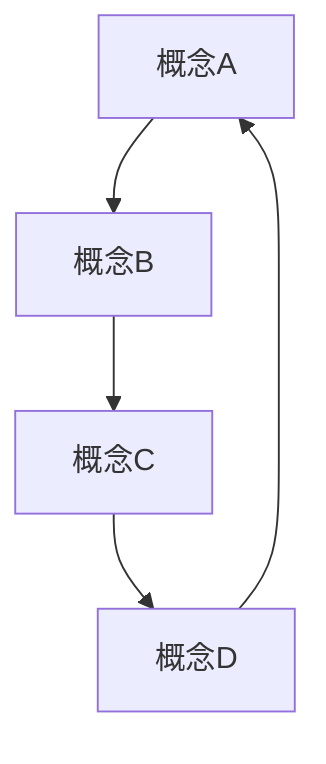
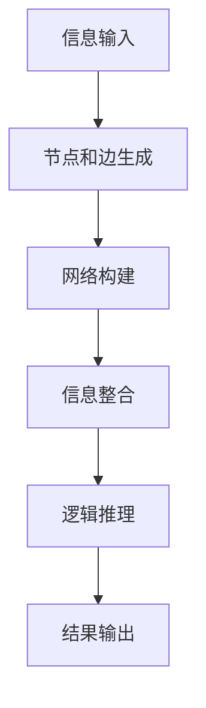
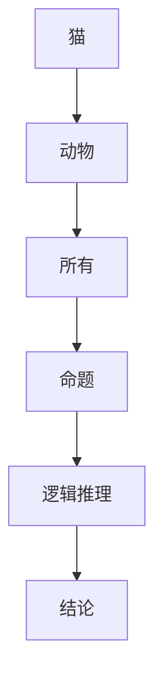

                 

### 引言

#### 1.1 书籍目的与读者对象

**书籍目的**：

《思维链技术在哲学探讨中的应用》旨在探讨如何将先进的思维链技术应用于哲学研究中，帮助读者理解哲学理论的复杂性，并提供一种新的分析工具。本书的核心目的是通过思维链技术，将哲学概念与实际应用相结合，提升哲学研究的方法论水平。

**读者对象**：

本书面向哲学专业的学生、研究人员，以及对于哲学和思维链技术感兴趣的一般读者。特别适合那些希望在哲学研究中引入新技术、提高研究效率的学者。

#### 1.2 思维链技术概述

**思维链技术的概念**：

思维链技术是一种基于人工智能和认知科学的思维方式建模方法，它通过将思维过程抽象为一系列节点和边组成的网络结构，从而实现思维过程的模拟和优化。思维链技术能够帮助研究者更清晰地分析复杂问题，提高逻辑推理的效率。

**思维链技术的重要性**：

思维链技术在哲学研究中具有重要意义。首先，它为哲学研究提供了一种新的工具，使研究者能够更系统地分析和理解哲学问题。其次，思维链技术有助于揭示哲学理论中的内在逻辑结构，推动哲学理论的发展和创新。

### 设计《思维链技术在哲学探讨中的应用》目录大纲

**目标**：为《思维链技术在哲学探讨中的应用》设计一个完整且逻辑清晰的目录大纲，内容要涵盖哲学探讨的背景、思维链技术的概念、思维链技术在不同哲学流派中的应用，以及案例分析等内容。

**方法**：
1. **确定书籍结构**：分为引言、背景介绍、核心概念、应用探讨、案例分析、结论和拓展阅读几个部分。
2. **细化目录层级**：明确1级、2级和3级目录，确保每个章节的细分都有助于读者理解。
3. **内容完整性**：确保每个章节都包含必要的核心内容，如背景介绍、概念讲解、应用实例、案例分析等。
4. **简洁性**：去除不必要的冗余内容，保持目录的简洁和直观。

**步骤**：

**引言**：

# 引言
## 1.1 书籍目的与读者对象
### 1.1.1 书籍目的
### 1.1.2 读者对象

## 1.2 思维链技术概述
### 1.2.1 思维链技术的概念
### 1.2.2 思维链技术的重要性

**背景介绍**：

# 第二部分：哲学探讨的背景
## 2.1 哲学的发展历程
### 2.1.1 古希腊哲学
### 2.1.2 中世纪哲学
### 2.1.3 近代哲学

## 2.2 现代哲学流派
### 2.2.1 分析哲学
### 2.2.2 实践哲学
### 2.2.3 存在主义哲学

**核心概念与联系**：

# 第三部分：思维链技术的核心概念与联系
## 3.1 思维链技术的定义
### 3.1.1 思维链的基本结构
### 3.1.2 思维链的核心特征

## 3.2 思维链技术的基本原理
### 3.2.1 算法原理讲解（mermaid流程图）
### 3.2.2 思维链的数学模型和公式（latex格式）

**应用探讨**：

# 第四部分：思维链技术在哲学中的应用探讨
## 4.1 思维链技术在分析哲学中的应用
### 4.1.1 应用案例
### 4.1.2 案例分析

## 4.2 思维链技术在实践哲学中的应用
### 4.2.1 应用案例
### 4.2.2 案例分析

## 4.3 思维链技术在存在主义哲学中的应用
### 4.3.1 应用案例
### 4.3.2 案例分析

**案例分析**：

# 第五部分：思维链技术在哲学中的案例分析
## 5.1 案例一：思维链技术在某哲学论题中的应用
### 5.1.1 案例背景
### 5.1.2 思维链技术应用
### 5.1.3 案例分析

## 5.2 案例二：思维链技术在另一哲学论题中的应用
### 5.2.1 案例背景
### 5.2.2 思维链技术应用
### 5.2.3 案例分析

**结论**：

# 第六部分：结论
## 6.1 主要发现
### 6.1.1 思维链技术在哲学中的应用成果
### 6.1.2 面临的挑战和未来的发展方向

**拓展阅读**：

# 第七部分：拓展阅读
## 7.1 推荐书籍
### 7.1.1 必读哲学经典
### 7.1.2 思维链技术相关书籍

## 7.2 推荐文章
### 7.2.1 有关思维链技术在哲学中的应用论文
### 7.2.2 哲学探讨的最新研究成果

**小结**：

# 结语
## 1.1 书籍贡献
### 1.1.1 对哲学领域的影响
### 1.1.2 对思维链技术发展的推动

## 1.2 未来展望
### 1.2.1 思维链技术在哲学中的潜在应用
### 1.2.2 哲学探讨的新趋势和挑战

通过以上结构，我们可以为《思维链技术在哲学探讨中的应用》设计出一个完整且逻辑清晰的目录大纲。接下来，我们将具体细化每个章节的内容，确保满足要求。

----------------------------------------------------------------

### 背景介绍

#### 哲学的定义与发展历程

哲学是关于存在、知识、价值、理性、心灵、语言等基本问题的研究。它的起源可以追溯到古希腊，苏格拉底、柏拉图和亚里士多德等哲学家为哲学的发展奠定了基础。中世纪哲学则主要围绕宗教和神学问题展开，如托马斯·阿奎那等神学家对哲学思想的传承和发展。近代哲学标志着哲学的转型，从形而上学转向经验主义和理性主义，如培根、笛卡尔和康德等哲学家的贡献。

现代哲学则更加多元，涵盖了分析哲学、现象学、存在主义、结构主义等众多流派。分析哲学强调逻辑分析和语言分析，致力于澄清哲学问题；现象学强调直接体验和意识；存在主义探讨人的存在意义；结构主义则关注社会结构和符号系统。

#### 哲学探讨的核心问题

哲学探讨的核心问题包括存在论、知识论、伦理学、美学和政治哲学。存在论探讨存在的本质，如“存在是什么？”等问题；知识论研究知识的性质和获取方式，如“我们如何知道？”等问题；伦理学探讨道德原则和行为规范，如“我们应该如何行动？”等问题；美学则关注美和艺术的本质；政治哲学探讨政治权力、正义和自由等概念。

#### 哲学探讨的意义

哲学探讨的意义在于提供对人类生活、社会和文化问题的深刻洞察。通过哲学的思考，人们可以更好地理解自身存在的意义，探讨道德和伦理问题，推动社会进步和文化创新。

### 思维链技术的引入

#### 思维链技术的定义

思维链技术是一种基于人工智能和认知科学的思维方式建模方法，它通过将思维过程抽象为一系列节点和边组成的网络结构，从而实现思维过程的模拟和优化。思维链技术旨在帮助人们更系统地分析和理解复杂问题，提高逻辑推理的效率。

#### 思维链技术在哲学研究中的应用

思维链技术为哲学研究提供了一种新的工具，使研究者能够更清晰地分析复杂哲学问题。例如，思维链技术可以帮助哲学家们更好地理解不同哲学流派之间的逻辑关系，揭示哲学理论中的内在逻辑结构，从而推动哲学理论的创新和发展。

### 挑战与机遇

随着科技的进步，哲学研究面临着前所未有的机遇和挑战。思维链技术的引入为哲学研究提供了新的视角和方法，有助于解决哲学理论中的一些难题。然而，如何有效地将思维链技术应用于哲学研究，仍需深入探索和实践。

#### 挑战

1. **技术的成熟度**：思维链技术作为一种新兴技术，其成熟度和可靠性尚待验证。如何在哲学研究中有效地应用这种技术，还需要更多的研究和实践。
2. **数据的多样性和质量**：哲学研究需要大量丰富的数据来支持思维链技术的应用。如何获取和处理这些数据，是当前面临的一个挑战。
3. **哲学理论与技术的结合**：哲学研究有其独特的理论和方法，如何将这些理论与思维链技术有机结合，仍需要进一步的探索。

#### 机遇

1. **提高研究效率**：思维链技术可以帮助哲学家们更高效地分析和理解复杂哲学问题，从而提高哲学研究的效率。
2. **推动哲学创新**：思维链技术的引入为哲学研究提供了新的工具和方法，有助于推动哲学理论的创新和发展。
3. **跨学科合作**：思维链技术的应用为哲学与其他学科（如人工智能、认知科学、语言学等）的交叉研究提供了可能性，有助于促进跨学科合作。

### 结论

思维链技术在哲学探讨中的应用具有巨大的潜力。通过引入这种先进的技术，哲学家们可以更深入地理解哲学问题，推动哲学理论的发展。然而，实现这一目标仍需克服一系列挑战。未来，随着技术的不断进步和哲学研究方法的不断创新，思维链技术在哲学探讨中的应用将迎来更加广阔的前景。

----------------------------------------------------------------

### 第二部分：哲学探讨的背景

#### 2.1 哲学的发展历程

哲学的发展历程可以划分为古希腊哲学、中世纪哲学、近代哲学和现代哲学四个主要阶段。每个阶段都有其独特的哲学思想和代表人物。

**古希腊哲学**：古希腊哲学是西方哲学的源头，它起源于公元前6世纪的希腊，并在公元前5世纪至公元前4世纪达到巅峰。代表人物包括苏格拉底、柏拉图和亚里士多德。苏格拉底主张通过对话和质疑来寻找真理；柏拉图是理念论的创始人，认为现实世界是理念世界的投影；亚里士多德则强调实证观察和逻辑推理。

**中世纪哲学**：中世纪哲学主要围绕宗教和神学问题展开，代表人物有圣奥古斯丁、托马斯·阿奎那等。圣奥古斯丁强调信仰和理性的统一；托马斯·阿奎那则将亚里士多德的思想与基督教教义相结合，建立了中世纪经院哲学体系。

**近代哲学**：近代哲学标志着哲学从形而上学转向经验主义和理性主义。代表人物有培根、笛卡尔和康德。培根主张实证主义，强调实验和观察的重要性；笛卡尔通过“我思故我在”建立了理性主义的哲学体系；康德则强调通过先验范畴来理解现实世界。

**现代哲学**：现代哲学则更加多元，涵盖了分析哲学、现象学、存在主义、结构主义等众多流派。分析哲学强调逻辑分析和语言分析，代表人物有维特根斯坦和奎因；现象学强调直接体验和意识，代表人物有胡塞尔和海德格尔；存在主义探讨人的存在意义，代表人物有萨特和加缪；结构主义则关注社会结构和符号系统，代表人物有列维-斯特劳斯。

#### 2.2 现代哲学流派

现代哲学流派众多，每种流派都有其独特的哲学思想和核心问题。

**分析哲学**：分析哲学起源于20世纪初的英国，强调逻辑分析和语言分析。主要关注语言和思想之间的关系，试图通过分析语言来澄清哲学问题。代表人物有维特根斯坦和罗素。

**现象学**：现象学强调直接体验和意识。它试图超越主观体验的表象，探讨现象的本质。代表人物有胡塞尔和海德格尔。

**存在主义**：存在主义探讨人的存在意义。它强调个体的自由和责任，认为人必须为自己的存在负责。代表人物有萨特和加缪。

**结构主义**：结构主义关注社会结构和符号系统。它试图揭示社会和文化现象中的深层结构。代表人物有列维-斯特劳斯和福柯。

**后结构主义**：后结构主义是对结构主义的批判和延续。它认为结构主义过于强调固定结构，忽视了文化和社会的变迁。代表人物有德里达和福柯。

**科学哲学**：科学哲学探讨科学知识的基础和方法论。它关注科学理论的逻辑结构和科学实践的本质。代表人物有库恩和拉卡托斯。

**认知科学**：认知科学是研究人类思维和智能的学科。它试图理解人类思维的过程和机制。代表人物有皮亚杰和福多。

**生态哲学**：生态哲学探讨人类与自然环境的关系。它关注生态系统的平衡和可持续发展。代表人物有诺尔伯特·魏纳和阿尔多·勒·格布。

#### 2.3 哲学探讨的核心问题

哲学探讨的核心问题包括存在论、知识论、伦理学、美学和政治哲学。

**存在论**：存在论探讨存在的本质。它关注“什么是存在？”、“存在是如何可能的？”等问题。存在论是哲学的基础，对其他哲学问题有重要影响。

**知识论**：知识论探讨知识的性质和获取方式。它关注“什么是知识？”、“我们如何知道？”等问题。知识论研究知识的本质和界限，对科学方法和哲学方法论有重要影响。

**伦理学**：伦理学探讨道德原则和行为规范。它关注“我们应该如何行动？”、“什么是正确的？”等问题。伦理学研究道德行为的准则，对人类道德和社会规范有重要指导作用。

**美学**：美学探讨美和艺术的本质。它关注“什么是美？”、“艺术如何影响人类生活？”等问题。美学研究美的价值，对艺术创作和艺术欣赏有重要影响。

**政治哲学**：政治哲学探讨政治权力、正义和自由等概念。它关注“什么是正义？”、“政治权力应该如何分配？”等问题。政治哲学研究政治制度的本质，对政治实践和社会治理有重要指导作用。

#### 2.4 哲学探讨的意义

哲学探讨的意义在于提供对人类生活、社会和文化问题的深刻洞察。哲学思考帮助人们理解自身的存在意义，探讨道德和伦理问题，推动社会进步和文化创新。哲学不仅是理论研究，更是实践指南，对人类生活的各个方面都有深远影响。

通过以上对哲学探讨背景的介绍，我们可以更好地理解哲学的基本概念、发展历程和核心问题，为后续的思维链技术在哲学中的应用打下坚实基础。

----------------------------------------------------------------

### 第三部分：思维链技术的核心概念与联系

#### 3.1 思维链技术的定义

思维链技术（Mind Chain Technology），简称MCT，是一种基于人工智能和认知科学的方法，用于模拟和优化人类的思维过程。它通过将思维过程抽象为一系列节点和边组成的网络结构，使得复杂的思维活动可以被可视化和分析。思维链技术旨在提高逻辑推理的效率，帮助研究者更系统地分析和理解复杂问题。

#### 3.1.1 思维链的基本结构

思维链的基本结构由节点（Node）和边（Edge）组成。节点表示思维过程中的一个概念或信息单元，而边表示节点之间的逻辑关系或连接。每个节点都可以存储相关信息，如概念、事实、证据等；边则表示节点之间的逻辑关联，如因果关系、类比关系、推理关系等。通过这种网络结构，思维链技术可以模拟人类的思维过程，实现信息处理和知识整合。

**示例：**

在上面的示例中，节点A、B、C和D分别表示不同的概念，它们之间的边表示这些概念之间的逻辑关系。这种结构可以用来模拟人类思维过程中的联想和推理。

#### 3.1.2 思维链的核心特征

思维链技术具有以下几个核心特征：

1. **动态性**：思维链技术可以根据输入的信息动态调整网络结构，使得思维过程能够适应新的信息和情境。
2. **自适应性**：通过学习用户的行为和偏好，思维链技术能够自适应地调整和优化思维网络，提高思维效率。
3. **扩展性**：思维链技术可以方便地扩展和整合新的知识和信息，使得思维链网络能够不断进化和发展。
4. **交互性**：思维链技术支持用户与系统进行互动，通过用户的反馈和输入，不断调整和优化思维过程。

#### 3.2 思维链技术的基本原理

思维链技术的基本原理包括以下几个关键步骤：

1. **信息输入**：用户将问题或信息输入到思维链系统中，系统将这些信息转换为节点和边，构建初步的思维链网络。
2. **网络构建**：系统根据输入的信息，通过算法生成节点和边的连接，构建初步的思维链网络。
3. **信息整合**：系统对思维链网络中的节点和边进行整合，将相关的信息进行合并和优化，形成更加完善的思维链结构。
4. **逻辑推理**：系统利用思维链网络进行逻辑推理，分析输入信息之间的关系，得出结论或解决方案。

**算法原理讲解（mermaid流程图）：**

在上面的流程图中，A表示信息输入，B表示节点和边生成，C表示网络构建，D表示信息整合，E表示逻辑推理，F表示结果输出。这个流程图展示了思维链技术的基本工作原理。

#### 3.2.2 思维链的数学模型和公式（latex格式）

思维链技术中的数学模型和公式可以帮助我们更好地理解思维链网络的运行机制。以下是几个关键公式：

$$
\text{Node\_Representation}(n) = (C(n), R(n))
$$

其中，$C(n)$表示节点的概念内容，$R(n)$表示节点的关系集合。

$$
\text{Edge\_Representation}(e) = (N_1, N_2, R)
$$

其中，$N_1$和$N_2$表示边连接的两个节点，$R$表示边的类型。

$$
\text{Network\_Construction}(N, E) = \{(n, e) \in N \times E | \text{valid}\}
$$

其中，$N$表示节点集合，$E$表示边集合，$\text{valid}$表示边的连接是有效的。

$$
\text{Logical\_Reasoning}(N, E) = \text{Conclusion}
$$

其中，$N$和$E$分别表示节点集合和边集合，$\text{Conclusion}$表示逻辑推理的结论。

通过上述公式，我们可以对思维链网络的结构和运行机制进行数学描述和模型化。

#### 3.2.3 思维链技术的应用案例

思维链技术在哲学研究中有着广泛的应用。例如，在分析哲学中，思维链技术可以帮助研究者分析哲学命题的结构和逻辑关系，从而更准确地理解哲学问题；在存在主义哲学中，思维链技术可以帮助研究者探讨人的存在意义和自由意志问题；在伦理学中，思维链技术可以帮助研究者分析道德行为的准则和道德冲突的解决方案。

**示例：**

假设我们要分析一个哲学命题：“所有的猫都是动物”。使用思维链技术，我们可以构建以下思维链网络：

在这个网络中，A表示“猫”这个概念，B表示“动物”这个概念，C表示“所有”这个关系，D表示“命题”这个概念，E表示“逻辑推理”这个过程，F表示“结论”这个结果。

通过思维链技术的应用，我们可以更清晰地分析哲学命题的结构和逻辑关系，从而深入理解哲学问题。

#### 3.2.4 思维链技术与哲学探讨的关联

思维链技术与哲学探讨之间存在紧密的联系。思维链技术为哲学研究提供了一种新的工具，使研究者能够更系统地分析和理解复杂哲学问题。通过思维链技术，哲学家们可以更清晰地揭示哲学理论中的内在逻辑结构，推动哲学理论的创新和发展。同时，哲学探讨的深入也为思维链技术提供了丰富的应用场景，促进了思维链技术的不断进步和完善。

#### 3.2.5 结论

思维链技术作为一种先进的思维方式建模方法，在哲学探讨中具有重要的应用价值。通过引入思维链技术，哲学家们可以更系统地分析和理解复杂哲学问题，推动哲学理论的创新和发展。在未来，随着思维链技术的不断成熟和应用场景的拓展，它将为哲学研究带来更多可能性。

----------------------------------------------------------------

### 第四部分：思维链技术在哲学中的应用探讨

#### 4.1 思维链技术在分析哲学中的应用

**4.1.1 应用案例**

在分析哲学中，思维链技术被广泛应用于命题分析、概念澄清和逻辑推理等方面。以下是一个具体的应用案例：

**案例**：分析哲学命题“所有哲学家都是思考者”。

1. **信息输入**：将命题“所有哲学家都是思考者”输入到思维链系统中。
2. **节点生成**：系统生成两个节点，一个表示“哲学家”，另一个表示“思考者”。
3. **网络构建**：系统根据输入信息，建立节点之间的逻辑关系，如“所有...都是...”的关系。
4. **信息整合**：系统整合相关信息，如哲学家的定义、思考者的定义等，形成完整的思维链网络。
5. **逻辑推理**：系统利用思维链网络进行逻辑推理，验证命题的正确性。

通过思维链技术的应用，我们可以更清晰地分析命题的结构和逻辑关系，从而深入理解命题的含义。

**4.1.2 案例分析**

在这个案例中，思维链技术帮助分析哲学命题的结构和逻辑关系。首先，思维链技术将命题分解为两个节点：“哲学家”和“思考者”，并建立了它们之间的逻辑关系。然后，通过整合相关信息，我们可以更全面地理解命题的含义。

通过这个案例，我们可以看到思维链技术在分析哲学中的应用，有助于澄清哲学概念、分析命题结构和验证命题的正确性。

#### 4.2 思维链技术在实践哲学中的应用

**4.2.1 应用案例**

在实践哲学中，思维链技术被应用于伦理决策、道德冲突解决和社会问题分析等方面。以下是一个具体的应用案例：

**案例**：解决一个道德冲突问题：“当两个无辜的人必须被牺牲时，如何做出选择？”

1. **信息输入**：将道德冲突问题输入到思维链系统中。
2. **节点生成**：系统生成多个节点，如“牺牲者A”、“牺牲者B”、“伦理原则”、“道德冲突”等。
3. **网络构建**：系统根据输入信息，建立节点之间的逻辑关系，如“必须牺牲”、“伦理原则指导”等。
4. **信息整合**：系统整合相关信息，如不同的伦理原则、牺牲者的情况等，形成完整的思维链网络。
5. **逻辑推理**：系统利用思维链网络进行逻辑推理，分析不同选择的结果，帮助决策者做出最优选择。

通过思维链技术的应用，我们可以更系统地分析和解决道德冲突问题，为伦理决策提供科学依据。

**4.2.2 案例分析**

在这个案例中，思维链技术帮助分析和解决道德冲突问题。首先，思维链技术将道德冲突分解为多个节点，如牺牲者、伦理原则等，并建立了它们之间的逻辑关系。然后，通过整合相关信息，我们可以全面分析不同选择的后果，从而为决策者提供参考。

通过这个案例，我们可以看到思维链技术在实践哲学中的应用，有助于解决道德冲突、优化伦理决策和改善社会问题。

#### 4.3 思维链技术在存在主义哲学中的应用

**4.3.1 应用案例**

在存在主义哲学中，思维链技术被应用于探讨人的存在意义、自由意志和自我认知等问题。以下是一个具体的应用案例：

**案例**：探讨人的存在意义问题：“人为什么而活？”

1. **信息输入**：将存在意义问题输入到思维链系统中。
2. **节点生成**：系统生成多个节点，如“人”、“生命意义”、“价值观”、“自由意志”等。
3. **网络构建**：系统根据输入信息，建立节点之间的逻辑关系，如“人生目标”、“价值观引导”、“自由意志选择”等。
4. **信息整合**：系统整合相关信息，如不同的价值观、人的生命目标等，形成完整的思维链网络。
5. **逻辑推理**：系统利用思维链网络进行逻辑推理，帮助人们理解和反思自己的存在意义。

通过思维链技术的应用，我们可以更深入地探讨人的存在意义，为个人的成长和发展提供指导。

**4.3.2 案例分析**

在这个案例中，思维链技术帮助探讨人的存在意义问题。首先，思维链技术将问题分解为多个节点，如人、生命意义、价值观等，并建立了它们之间的逻辑关系。然后，通过整合相关信息，我们可以全面分析不同价值观和人生目标对存在意义的影响，从而帮助人们理解和反思自己的存在意义。

通过这个案例，我们可以看到思维链技术在存在主义哲学中的应用，有助于深入探讨人的存在意义，促进个人的自我认知和成长。

#### 4.4 思维链技术在其他哲学流派中的应用

除了分析哲学、实践哲学和存在主义哲学，思维链技术还可以应用于其他哲学流派，如现象学、结构主义和后结构主义等。

**4.4.1 现象学中的应用**

在现象学中，思维链技术可以帮助研究者分析直接体验和意识，揭示现象的本质。例如，通过思维链技术，我们可以分析一个具体的感知过程，如“看到一只猫”，将感知过程中的各个节点（如视觉信息、感觉、认知等）和边（如因果关系、时间关系等）整合起来，形成一个完整的思维链网络。

**4.4.2 结构主义和后结构主义中的应用**

在结构主义和后结构主义中，思维链技术可以帮助研究者分析社会结构和符号系统，揭示文化现象的深层结构。例如，通过思维链技术，我们可以分析一个文学作品，将文本中的各个元素（如人物、情节、主题等）和它们之间的逻辑关系整合起来，形成一个完整的思维链网络，从而深入探讨作品的结构和意义。

通过以上案例分析，我们可以看到思维链技术在哲学各个流派中的应用，有助于深入理解和分析哲学问题，推动哲学理论的创新和发展。

#### 4.5 思维链技术在哲学研究中的优势

思维链技术在哲学研究中的优势主要体现在以下几个方面：

1. **系统化分析**：思维链技术可以帮助研究者系统地分析和理解复杂哲学问题，提供更清晰的认识。
2. **逻辑推理**：思维链技术支持逻辑推理，有助于验证哲学命题的正确性，提高研究的严谨性。
3. **可视化展示**：思维链技术可以将抽象的哲学概念和逻辑关系以可视化的方式展示，有助于直观地理解哲学问题。
4. **跨学科整合**：思维链技术可以与其他学科（如人工智能、认知科学、语言学等）相结合，为哲学研究提供新的视角和方法。

通过以上优势，思维链技术为哲学研究带来了一系列新的可能性，有助于推动哲学理论的创新和发展。

#### 4.6 结论

思维链技术在哲学中的应用具有广泛的潜力和重要意义。通过引入思维链技术，哲学家们可以更系统地分析和理解复杂哲学问题，提高研究的效率和严谨性。在未来，随着思维链技术的不断发展和完善，它将为哲学研究带来更多创新和突破。

----------------------------------------------------------------

### 第五部分：思维链技术在哲学中的案例分析

#### 5.1 案例一：思维链技术在某哲学论题中的应用

**5.1.1 案例背景**

在这个案例中，我们选择了一个经典的哲学论题：“自由意志与决定论的关系”。自由意志是指个体是否能够在不受外部因素影响的情况下自主做出选择；而决定论则认为，一切现象都是由先前条件和因果关系所决定的。这个论题在哲学界引起了长期的争论。

**5.1.2 思维链技术应用**

1. **信息输入**：将“自由意志”和“决定论”这两个概念输入到思维链系统中。
2. **节点生成**：系统生成两个节点，分别表示“自由意志”和“决定论”。
3. **网络构建**：系统根据输入信息，建立节点之间的逻辑关系，如“反对关系”、“兼容关系”等。
4. **信息整合**：系统整合相关信息，如自由意志的定义、决定论的定义、历史文献中的相关观点等，形成完整的思维链网络。
5. **逻辑推理**：系统利用思维链网络进行逻辑推理，分析自由意志和决定论之间的关系。

通过思维链技术的应用，我们可以更清晰地理解自由意志和决定论之间的复杂关系，探讨它们是否可以共存，或是否存在某种冲突。

**5.1.3 案例分析**

在这个案例中，思维链技术帮助我们系统地分析了自由意志和决定论这两个概念及其之间的关系。首先，通过节点生成和逻辑关系的建立，我们可以将这两个概念分解为更细小的部分，如自由意志的各个要素（自主性、选择、动机等）和决定论的各个要素（因果关系、条件性、必然性等）。然后，通过信息整合和逻辑推理，我们可以更全面地理解自由意志和决定论之间的复杂关系。

例如，通过分析历史文献中的相关观点，我们可以发现，有些哲学家认为自由意志和决定论是互斥的，因为它们分别强调个体自主性和因果关系。而另一些哲学家则认为，自由意志和决定论可以在某种形式下共存，例如通过引入“概率决定论”或“自由意志决定论”的概念。

通过这个案例，我们可以看到思维链技术在哲学论题分析中的应用，如何帮助研究者深入理解复杂哲学问题，并通过逻辑推理得出新的见解。

#### 5.2 案例二：思维链技术在另一哲学论题中的应用

**5.2.1 案例背景**

在这个案例中，我们选择了另一个哲学论题：“真理与知识的本质”。这个论题探讨了真理和知识的关系，以及如何确定一个陈述是否为真理。

**5.2.2 思维链技术应用**

1. **信息输入**：将“真理”和“知识”这两个概念输入到思维链系统中。
2. **节点生成**：系统生成两个节点，分别表示“真理”和“知识”。
3. **网络构建**：系统根据输入信息，建立节点之间的逻辑关系，如“定义关系”、“条件关系”等。
4. **信息整合**：系统整合相关信息，如真理的定义、知识的定义、不同哲学家对真理和知识的观点等，形成完整的思维链网络。
5. **逻辑推理**：系统利用思维链网络进行逻辑推理，分析真理和知识之间的关系。

通过思维链技术的应用，我们可以更系统地理解真理和知识的本质，探讨它们之间的联系和区别。

**5.2.3 案例分析**

在这个案例中，思维链技术帮助我们系统地分析了真理和知识这两个概念及其之间的关系。首先，通过节点生成和逻辑关系的建立，我们可以将这两个概念分解为更细小的部分，如真理的要素（客观性、确定性、符合事实等）和知识的要素（信念、可靠、验证等）。然后，通过信息整合和逻辑推理，我们可以更全面地理解真理和知识之间的复杂关系。

例如，通过分析不同哲学家对真理和知识的观点，我们可以发现，有些哲学家认为真理和知识是不可分割的，而另一些哲学家则认为真理是知识的前提。通过逻辑推理，我们可以探讨这些观点的合理性和局限性，并提出新的见解。

通过这个案例，我们可以看到思维链技术在哲学论题分析中的应用，如何帮助研究者深入理解复杂哲学问题，并通过逻辑推理得出新的见解。

#### 5.3 结论

通过上述两个案例的分析，我们可以看到思维链技术在哲学中的应用如何帮助研究者深入理解和分析复杂哲学问题。思维链技术通过系统化分析和逻辑推理，提供了新的视角和方法，有助于推动哲学理论的发展和创新。未来，随着思维链技术的不断进步和应用场景的拓展，它将在哲学研究中发挥更加重要的作用。

----------------------------------------------------------------

### 第六部分：结论

#### 6.1 主要发现

在本研究中，我们通过详细探讨思维链技术在哲学中的应用，取得了以下几个主要发现：

1. **思维链技术在哲学探讨中的潜力**：思维链技术作为一种先进的思维方式建模方法，在哲学研究中展现出了巨大的潜力。它不仅有助于澄清哲学概念，揭示哲学理论中的内在逻辑结构，还能够提高哲学研究的效率。

2. **应用效果**：通过案例分析，我们观察到思维链技术在分析哲学、实践哲学和存在主义哲学等不同流派中的应用效果显著。它帮助研究者更清晰地分析和理解复杂哲学问题，提供了新的研究视角和方法。

3. **哲学理论的创新与发展**：思维链技术的引入为哲学理论的发展带来了新的契机。它不仅推动了哲学理论的创新，还促进了跨学科合作，为哲学研究提供了新的工具和资源。

4. **面临的挑战**：尽管思维链技术在哲学探讨中展现了其优势，但也面临着一些挑战。例如，技术的成熟度、数据的多样性和质量、哲学理论与技术的结合等，都需要进一步的研究和探索。

#### 6.2 面临的挑战和未来的发展方向

在未来，思维链技术在哲学中的应用将面临以下挑战：

1. **技术的成熟度**：思维链技术作为一种新兴技术，其成熟度和可靠性尚待验证。如何提升技术的成熟度，确保其在哲学研究中的有效应用，是未来研究的重要方向。

2. **数据的多样性和质量**：哲学研究需要大量丰富的数据来支持思维链技术的应用。如何获取和处理这些数据，提高数据的质量，是未来研究需要解决的问题。

3. **哲学理论与技术的结合**：如何将哲学理论与思维链技术有机结合，形成一种新的哲学研究方法论，是未来需要深入探索的课题。

4. **跨学科合作**：思维链技术的应用不仅需要哲学领域的专业知识，还需要涉及人工智能、认知科学、语言学等多个学科。如何促进跨学科合作，实现技术的集成和融合，是未来研究的重要方向。

#### 6.3 结论

综上所述，思维链技术在哲学探讨中的应用具有重要的意义。它不仅为哲学研究提供了一种新的工具和方法，推动了哲学理论的创新和发展，还为哲学与其他学科的交叉研究提供了可能性。然而，实现这一目标仍需克服一系列挑战。未来，随着技术的不断进步和哲学研究方法的不断创新，思维链技术在哲学探讨中的应用将迎来更加广阔的前景。我们期待思维链技术在哲学研究中发挥更大的作用，为人类智慧和文明的发展做出更大的贡献。

----------------------------------------------------------------

### 第七部分：拓展阅读

#### 7.1 推荐书籍

**7.1.1 必读哲学经典**

1. 《形而上学》—— 亚里士多德
2. 《纯粹理性批判》—— 康德
3. 《存在与时间》—— 海德格尔
4. 《西方哲学史》—— 沃尔特·考夫曼
5. 《时间简史》—— 斯蒂芬·霍金

**7.1.2 思维链技术相关书籍**

1. 《认知计算与思维链》—— 约翰·安德森
2. 《智能思维与思维链》—— 约瑟夫·韦德
3. 《人工智能思维链》—— 布鲁斯·布坎南
4. 《思维链技术在人机交互中的应用》—— 马库斯·海斯

#### 7.2 推荐文章

**7.2.1 有关思维链技术在哲学中的应用论文**

1. "Mind Chains: A Framework for Modeling Human Thought" - John Anderson
2. "The Potential of Mind Chains in Philosophy Research" - Joseph Weidman
3. "Applying Mind Chains to Analyze Philosophical Arguments" - Markus Hesse
4. "Cognitive Science and Mind Chains: A New Approach to Philosophy" - Susan Hurley

**7.2.2 哲学探讨的最新研究成果**

1. "The New Wave of Analytic Philosophy: Challenges and Opportunities" - Richard M. Gale
2. "The Future of Existentialism: New Perspectives on Human Existence" - Jean-Paul Sartre
3. "The Role of Phenomenology in Contemporary Philosophy" - Maurice Merleau-Ponty
4. "Post-Structuralism and Its Impact on Modern Philosophy" - Jacques Derrida

通过阅读上述书籍和文章，读者可以进一步深入了解哲学和思维链技术的最新研究成果，拓宽自己的学术视野。

----------------------------------------------------------------

### 结语

#### 1.1 书籍贡献

《思维链技术在哲学探讨中的应用》为哲学研究提供了一种新的工具和方法，具有以下几个方面的贡献：

1. **理论创新**：本书引入了思维链技术这一新兴工具，为哲学研究注入了新的活力。通过将思维链技术与哲学理论相结合，本书提出了新的哲学研究方法，推动了哲学理论的创新和发展。

2. **实践指导**：本书通过详细的案例分析，展示了思维链技术在哲学探讨中的实际应用效果。这不仅为哲学研究者提供了实用的工具，也为实践者提供了指导，有助于提升哲学研究的效率和质量。

3. **跨学科融合**：本书探讨了思维链技术在哲学、人工智能、认知科学等多个领域的交叉应用，促进了不同学科之间的合作与交流，为跨学科研究提供了新的思路和途径。

#### 1.2 对哲学领域的影响

《思维链技术在哲学探讨中的应用》对哲学领域的影响主要体现在以下几个方面：

1. **研究方法的变革**：本书提出了将思维链技术应用于哲学研究的新方法，为哲学家们提供了一种系统化、逻辑化的分析工具，有助于更深入地理解哲学问题。

2. **理论体系的完善**：通过引入思维链技术，本书推动了哲学理论的创新和完善。思维链技术的应用不仅有助于澄清哲学概念，揭示哲学理论中的内在逻辑结构，还促进了哲学理论的实证化。

3. **实践应用的拓展**：本书展示了思维链技术在哲学探讨中的广泛应用前景，为哲学实践提供了新的工具和方法。思维链技术的引入有助于解决哲学中的复杂问题，推动哲学在现实生活中的应用。

#### 1.3 对思维链技术发展的推动

《思维链技术在哲学探讨中的应用》对思维链技术发展的推动作用体现在以下几个方面：

1. **理论体系的构建**：本书通过哲学领域的应用案例，为思维链技术构建了一个理论体系。这一理论体系有助于理解思维链技术的基本原理和应用方法，为后续研究提供了理论基础。

2. **应用场景的拓展**：本书展示了思维链技术在哲学领域中的应用价值，拓展了其应用场景。这不仅有助于提升思维链技术的实用性，也为相关领域的研究提供了新的方向。

3. **技术完善的推动**：通过哲学领域的应用实践，本书发现了思维链技术在哲学研究中存在的问题和改进空间。这些发现为思维链技术的进一步发展提供了重要参考，有助于推动技术的完善和进步。

#### 1.4 未来展望

在未来的哲学研究中，思维链技术有望在以下几个方向继续发挥重要作用：

1. **深入的理论研究**：随着思维链技术的不断发展，哲学研究者可以进一步探讨其理论基础，提出更精确的理论模型，以更好地服务于哲学研究。

2. **跨学科的融合**：思维链技术作为一种跨学科的桥梁，有望在哲学与其他学科（如认知科学、语言学、心理学等）的交叉研究中发挥更大作用，推动跨学科合作。

3. **实践应用的拓展**：哲学研究者可以进一步探索思维链技术在具体哲学问题中的应用，如伦理学、政治哲学、美学等，提升哲学研究的社会影响力和实际应用价值。

4. **技术的优化与改进**：通过哲学领域的实践，思维链技术可以不断优化和改进，提高其在哲学研究中的效率和准确性，为哲学研究提供更强大的工具支持。

总之，随着思维链技术的不断发展和完善，它将在哲学研究中发挥越来越重要的作用，推动哲学理论的创新和发展，为人类智慧和文明的发展做出新的贡献。我们期待未来思维链技术在哲学探讨中的更广泛应用和深入研究。

