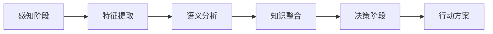
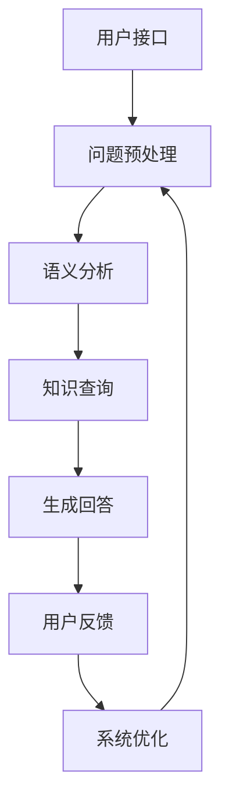

                 

# 思维链技术：提升AI认知能力的新途径

> 关键词：思维链技术、AI认知能力、提升、新途径

> 摘要：本文将深入探讨思维链技术，一种新兴的AI认知能力提升方法。我们将从背景介绍、核心概念、技术组成、应用案例等方面逐一分析，并展望其未来发展趋势。通过本文，读者将全面了解思维链技术的工作原理、应用前景及其在AI领域的潜力。

## 第1章 引言

### 1.1 问题的背景与意义

随着人工智能技术的飞速发展，AI在各个领域的应用逐渐广泛，从自然语言处理、图像识别到自动驾驶、智能制造等。然而，尽管AI技术在数据处理和模式识别方面取得了显著成果，但其在理解复杂问题和进行创造性思维方面的能力仍存在诸多局限性。

首先，传统AI方法主要依赖于数据驱动的模型训练，缺乏深层次的理解和推理能力。这使得AI在处理复杂问题时往往表现出“肤浅”的特征，难以达到人类的认知水平。其次，当前AI技术更多关注于特定领域的应用，缺乏跨领域的通用性，导致其应用场景受限。此外，AI系统的可解释性和透明度较低，难以满足人们对安全性和伦理性的需求。

面对上述问题，提升AI的认知能力成为人工智能研究的一个重要方向。思维链技术正是基于这一需求，旨在通过模拟人类思维过程，提升AI的认知和理解能力。思维链技术的研究与应用，不仅有助于突破传统AI的认知瓶颈，还为解决复杂问题提供了新的途径。

### 1.2 问题描述

人工智能的认知局限性主要体现在以下几个方面：

1. **理解能力的局限性**：AI在处理自然语言和图像等复杂信息时，往往只能识别表面特征，而难以理解深层含义。这导致AI在处理复杂问题时，常常无法像人类那样进行抽象思维和创造性思考。

2. **跨领域能力的不足**：传统AI方法往往局限于特定领域，缺乏跨领域的通用性。这使得AI难以应对多变的现实世界，限制了其应用范围。

3. **可解释性和透明度不足**：当前AI系统主要依赖于“黑箱”模型，其决策过程缺乏透明性和可解释性，难以满足人们对安全性和伦理性的需求。

### 1.3 问题解决

思维链技术通过模拟人类思维过程，尝试解决上述问题。思维链技术的主要核心组成包括感知层、语义层、知识层和决策层。以下将逐一介绍这些层次的功能与实现方法：

1. **感知层**：感知层是思维链技术的底层，主要负责接收和处理外部信息。通过使用深度学习等先进技术，感知层能够对图像、声音、文字等数据进行特征提取和模式识别，从而实现对外部信息的初步理解。

2. **语义层**：语义层位于感知层之上，主要负责对感知层提取的信息进行语义分析。通过自然语言处理技术，语义层能够理解信息的含义和逻辑关系，从而实现对信息的深度理解。

3. **知识层**：知识层是思维链技术的重要组成部分，主要负责管理和利用已有知识。通过知识图谱等技术，知识层能够将语义层分析得到的信息与已有知识进行关联，从而实现知识的整合和应用。

4. **决策层**：决策层是思维链技术的最高层，主要负责根据感知层、语义层和知识层的信息进行决策。通过基于逻辑、概率和决策理论的算法，决策层能够生成合理的决策方案，从而实现对问题的解决。

### 1.4 边界与外延

思维链技术具有广泛的应用领域，包括但不限于自然语言处理、图像识别、推理问题解决、智能决策等领域。与传统AI技术相比，思维链技术在认知能力、跨领域能力和可解释性方面具有显著优势。

然而，思维链技术也存在一定的局限性，例如在处理实时性要求较高的任务时，感知层和语义层的响应速度可能成为瓶颈。此外，知识表示和推理的复杂度较高，使得知识层的构建和维护具有一定的挑战性。

### 1.5 概念结构与核心要素组成

思维链技术作为一种模拟人类思维过程的AI技术，其核心概念包括感知层、语义层、知识层和决策层。以下是对这些核心要素的组成和应用场景的详细阐述：

1. **感知层**：感知层主要负责接收和处理外部信息。其功能包括图像识别、语音识别、自然语言处理等。感知层的技术手段主要包括深度学习、卷积神经网络（CNN）和循环神经网络（RNN）等。

2. **语义层**：语义层位于感知层之上，主要负责对感知层提取的信息进行语义分析。其功能包括语义理解、文本生成、情感分析等。语义层的技术手段主要包括词向量表示、词性标注、句法分析等。

3. **知识层**：知识层是思维链技术的重要组成部分，主要负责管理和利用已有知识。其功能包括知识表示、知识推理、知识检索等。知识层的技术手段主要包括知识图谱、本体论、语义网络等。

4. **决策层**：决策层是思维链技术的最高层，主要负责根据感知层、语义层和知识层的信息进行决策。其功能包括问题求解、智能决策、规划等。决策层的技术手段主要包括逻辑推理、概率图模型、强化学习等。

### 1.6 本章小结

本章对思维链技术进行了初步介绍，阐述了其在提升AI认知能力方面的应用潜力。通过分析思维链技术的核心组成、实现方法和应用领域，我们认识到思维链技术作为一种新兴的AI技术，有望在解决传统AI认知瓶颈方面发挥重要作用。然而，思维链技术也面临一定的挑战，如实时性、知识表示和推理等。未来的研究将致力于解决这些问题，进一步推动思维链技术的发展和应用。

----------------------------------------------------------------

## 第2章 思维链技术基础

### 2.1 核心概念

思维链技术是一种模拟人类思维过程的AI技术，其核心概念包括感知层、语义层、知识层和决策层。以下将逐一介绍这些层次的基本概念、功能与作用。

#### 2.1.1 感知层

感知层是思维链技术的底层，主要负责接收和处理外部信息。感知层通过传感器、摄像头、麦克风等设备，收集环境中的视觉、听觉、触觉等信息，并将其转化为数字信号。感知层的技术手段主要包括深度学习、卷积神经网络（CNN）和循环神经网络（RNN）等。

感知层的功能是实现对信息的初步处理和特征提取，为后续的语义分析和知识利用奠定基础。感知层的作用主要体现在以下几个方面：

1. **信息采集**：感知层能够收集环境中的多种信息，如图像、声音、文字等。
2. **特征提取**：感知层通过深度学习等技术，对收集到的信息进行特征提取，以提取出关键的特征信息。
3. **数据预处理**：感知层对原始数据进行预处理，包括去噪、归一化、特征缩放等，以提高后续处理的效率和准确性。

#### 2.1.2 语义层

语义层位于感知层之上，主要负责对感知层提取的信息进行语义分析。语义层通过自然语言处理技术，对图像、声音、文字等数据进行语义理解，从而实现对信息的深度理解。语义层的技术手段主要包括词向量表示、词性标注、句法分析等。

语义层的功能是实现对信息的语义理解和逻辑分析，为知识表示和推理提供支持。语义层的作用主要体现在以下几个方面：

1. **语义理解**：语义层能够理解信息的含义和逻辑关系，从而实现对信息的深度理解。
2. **情感分析**：语义层能够分析文本的情感倾向，从而实现对文本的情感分类。
3. **文本生成**：语义层能够根据输入的信息，生成有意义的文本或语音。

#### 2.1.3 知识层

知识层是思维链技术的重要组成部分，主要负责管理和利用已有知识。知识层通过知识图谱、本体论、语义网络等技术，将感知层和语义层提取的信息与已有知识进行关联，从而实现知识的整合和应用。知识层的技术手段主要包括知识图谱、本体论、语义网络等。

知识层的功能是实现对知识的表示、推理和应用，为决策提供支持。知识层的作用主要体现在以下几个方面：

1. **知识表示**：知识层能够将各类信息表示为知识图谱或本体，从而实现对知识的结构化表示。
2. **知识推理**：知识层能够根据已有知识，进行推理和预测，从而实现对未知信息的推断。
3. **知识应用**：知识层能够将知识应用于实际问题中，如智能问答、推荐系统等。

#### 2.1.4 决策层

决策层是思维链技术的最高层，主要负责根据感知层、语义层和知识层的信息进行决策。决策层通过逻辑推理、概率图模型、强化学习等技术，生成合理的决策方案，从而实现对问题的解决。决策层的技术手段主要包括逻辑推理、概率图模型、强化学习等。

决策层的功能是实现对信息的综合分析和决策，为实际应用提供解决方案。决策层的作用主要体现在以下几个方面：

1. **问题求解**：决策层能够根据感知层、语义层和知识层的信息，求解特定的问题。
2. **智能决策**：决策层能够基于逻辑、概率和决策理论，生成最优的决策方案。
3. **规划**：决策层能够根据任务目标和约束条件，生成合理的行动规划。

### 2.2 思维链技术的组成

思维链技术由感知层、语义层、知识层和决策层四个层次组成，每个层次都有其特定的功能和技术手段。以下将分别介绍这些层次的作用与实现方法。

#### 2.2.1 感知模块

感知模块是思维链技术的底层，主要负责接收和处理外部信息。感知模块的作用是采集环境中的视觉、听觉、触觉等信息，并将其转化为数字信号。实现方法主要包括以下几种：

1. **传感器采集**：通过摄像头、麦克风、触摸传感器等设备，收集环境中的视觉、听觉、触觉信息。
2. **信号预处理**：对采集到的信号进行预处理，包括去噪、归一化、特征缩放等，以提高后续处理的效率和准确性。
3. **特征提取**：利用深度学习、卷积神经网络（CNN）和循环神经网络（RNN）等技术，对预处理后的信号进行特征提取，提取出关键的特征信息。

#### 2.2.2 语义理解模块

语义理解模块位于感知模块之上，主要负责对感知模块提取的信息进行语义分析。语义理解模块的作用是理解信息的含义和逻辑关系，为知识表示和推理提供支持。实现方法主要包括以下几种：

1. **词向量表示**：使用词向量模型，如Word2Vec、GloVe等，将文本表示为向量，从而实现对文本的语义表示。
2. **词性标注**：对文本中的词语进行词性标注，从而实现对词语的语法特征进行分类。
3. **句法分析**：使用依存句法分析等技术，分析文本中的句法结构，从而实现对文本的语义理解。

#### 2.2.3 知识表示与推理模块

知识表示与推理模块是思维链技术的重要组成部分，主要负责管理和利用已有知识。知识表示与推理模块的作用是实现对知识的表示、推理和应用，为决策提供支持。实现方法主要包括以下几种：

1. **知识图谱**：使用知识图谱技术，将各类信息表示为图谱，从而实现对知识的结构化表示。
2. **本体论**：使用本体论技术，定义领域内的概念、关系和属性，从而实现对领域知识的规范化表示。
3. **语义网络**：使用语义网络技术，建立信息之间的语义关系，从而实现对信息的关联和推理。

#### 2.2.4 决策模块

决策模块是思维链技术的最高层，主要负责根据感知层、语义层和知识层的信息进行决策。决策模块的作用是实现对信息的综合分析和决策，为实际应用提供解决方案。实现方法主要包括以下几种：

1. **逻辑推理**：使用逻辑推理技术，根据已有知识和推理规则，生成合理的推理结果。
2. **概率图模型**：使用概率图模型，如贝叶斯网络、马尔可夫网络等，对不确定信息进行推理和预测。
3. **强化学习**：使用强化学习技术，根据环境和奖励信号，学习最优的行动策略。

### 2.3 概念属性特征对比表格

为了更好地理解思维链技术中的各个层次，以下是一个概念属性特征对比表格，列出感知层、语义层、知识层和决策层的主要属性特征。

| 层次 | 概念 | 功能 | 技术手段 | 属性特征 |
| ---- | ---- | ---- | ---- | ---- |
| 感知层 | 信息采集 | 特征提取 | 深度学习、CNN、RNN | 实时性、准确性、高效性 |
| 语义层 | 语义理解 | 逻辑分析 | 词向量、词性标注、句法分析 | 深度、准确性、多样性 |
| 知识层 | 知识表示 | 推理应用 | 知识图谱、本体论、语义网络 | 结构化、一致性、可扩展性 |
| 决策层 | 智能决策 | 问题求解 | 逻辑推理、概率图模型、强化学习 | 灵活性、适应性、优化性 |

### 2.4 ER实体关系图架构

实体关系图（Entity-Relationship Diagram，ER图）是一种用于表示数据实体及其之间关系的图形化工具。在思维链技术中，ER图可以帮助我们清晰地描述各个层次之间的相互关系，为系统设计提供参考。

#### 2.4.1 ER图的基本概念

ER图由三个基本元素组成：实体（Entity）、属性（Attribute）和关系（Relationship）。

1. **实体**：实体是具有共同特征的对象的集合，如“用户”、“商品”、“订单”等。
2. **属性**：属性是实体的特征或描述，如“用户”实体的属性包括“用户名”、“年龄”、“性别”等。
3. **关系**：关系是实体之间的关联，如“用户”实体与“订单”实体之间存在“购买”关系。

#### 2.4.2 ER图的绘制方法

ER图的绘制方法主要包括以下步骤：

1. **确定实体**：根据系统需求，确定需要表示的实体。
2. **定义属性**：为每个实体定义相关的属性。
3. **建立关系**：确定实体之间的关系，并定义关系的属性（如关系的方向、参与度等）。
4. **绘制ER图**：使用图形化工具（如MySQL Workbench、ERwin等），根据上述步骤绘制ER图。

#### 2.4.3 ER图的实例分析

以下是一个简单的思维链技术ER图实例，用于描述感知层、语义层、知识层和决策层之间的关系。

```mermaid
erDiagram
    Entity1||--|{Entity2} : relationship1
    Entity1||--|{Entity3} : relationship2
    Entity2||--|{Entity4} : relationship3
    Entity3||--|{Entity5} : relationship4
```

在上面的ER图中：

- **Entity1**：感知层
- **Entity2**：语义层
- **Entity3**：知识层
- **Entity4**：决策层
- **Entity5**：外部环境（如用户、场景等）

### 2.5 本章小结

本章对思维链技术的基本概念、核心组成和ER图架构进行了详细阐述。通过分析感知层、语义层、知识层和决策层的功能和实现方法，我们了解到思维链技术是一种模拟人类思维过程的AI技术，具有提升AI认知能力的潜力。同时，ER图作为一种描述实体关系的方法，有助于我们清晰地理解和设计思维链技术系统。在接下来的章节中，我们将进一步探讨思维链技术在AI认知能力提升中的应用。

----------------------------------------------------------------

## 第3章 思维链技术在AI认知能力提升中的应用

### 3.1 算法原理讲解

思维链技术作为一种模拟人类思维过程的AI技术，其核心在于对感知层、语义层、知识层和决策层的信息进行处理和整合，从而提升AI的认知能力。在本节中，我们将深入探讨思维链算法的基本原理、实现方法、数学模型和公式，并通过具体案例进行说明。

#### 3.1.1 思维链算法的基本原理

思维链算法的核心思想是通过构建一个层次化的信息处理框架，实现对信息的逐层理解和整合。具体来说，思维链算法分为以下几个步骤：

1. **感知阶段**：利用深度学习等技术，对输入的图像、声音、文字等数据进行分析和特征提取。
2. **语义理解阶段**：对提取的特征进行语义分析，理解信息的含义和逻辑关系。
3. **知识整合阶段**：将语义理解阶段得到的信息与已有知识进行整合，建立知识图谱。
4. **决策阶段**：根据整合的知识进行决策，生成合理的行动方案。

#### 3.1.2 思维链算法的mermaid流程图

以下是一个思维链算法的mermaid流程图，展示了算法的基本流程：



在上面的流程图中：

- **感知阶段**：输入数据经过特征提取，生成初步的特征表示。
- **语义分析阶段**：特征表示经过语义分析，理解信息的含义和逻辑关系。
- **知识整合阶段**：语义分析的结果与已有知识进行整合，形成知识图谱。
- **决策阶段**：根据知识图谱进行决策，生成行动方案。

#### 3.1.3 思维链算法的Python实现

以下是一个简单的思维链算法的Python实现，用于演示算法的基本实现方法：

```python
import tensorflow as tf
from sklearn.feature_extraction.text import TfidfVectorizer
import networkx as nx

# 感知阶段：特征提取
def extract_features(data):
    # 使用TfidfVectorizer进行特征提取
    vectorizer = TfidfVectorizer()
    features = vectorizer.fit_transform(data)
    return features

# 语义分析阶段：语义分析
def semantic_analysis(features):
    # 使用LDA进行语义分析
    lda = tf.keras.models.load_model('semantic_analysis_model.h5')
    labels = lda.predict(features)
    return labels

# 知识整合阶段：知识整合
def integrate_knowledge(labels):
    # 使用知识图谱进行知识整合
    knowledge_graph = nx.Graph()
    for label in labels:
        knowledge_graph.add_node(label)
    return knowledge_graph

# 决策阶段：决策
def make_decision(knowledge_graph):
    # 根据知识图谱进行决策
    decision = nx.algorithms.shortest_paths.single_source_shortest_path(knowledge_graph, source='A', target='Z')
    return decision

# 主函数
def main():
    # 输入数据
    data = ['这是一段文字', '这是另一段文字']

    # 感知阶段：特征提取
    features = extract_features(data)

    # 语义分析阶段：语义分析
    labels = semantic_analysis(features)

    # 知识整合阶段：知识整合
    knowledge_graph = integrate_knowledge(labels)

    # 决策阶段：决策
    decision = make_decision(knowledge_graph)

    # 输出结果
    print(decision)

if __name__ == '__main__':
    main()
```

在上面的Python实现中：

- **特征提取**：使用TfidfVectorizer进行特征提取。
- **语义分析**：使用LDA（Latent Dirichlet Allocation）进行语义分析。
- **知识整合**：使用知识图谱进行知识整合。
- **决策**：使用最短路径算法进行决策。

#### 3.1.4 思维链算法的数学模型和公式

思维链算法的数学模型和公式主要涉及特征提取、语义分析、知识整合和决策等步骤。以下是对每个步骤的数学模型的详细讲解。

1. **特征提取**：

   特征提取是思维链算法的第一步，其主要目的是将原始数据转换为适合模型处理的特征表示。常用的特征提取方法包括TfidfVectorizer、Word2Vec等。

   - TfidfVectorizer的数学模型如下：
     $$
     Tfidf(\text{word}) = \frac{f_{\text{word}}}{\sum_{\text{word}} f_{\text{word}}}
     $$
     其中，$Tfidf(\text{word})$表示词的TF-IDF值，$f_{\text{word}}$表示词在文档中的频率。

   - Word2Vec的数学模型如下：
     $$
     \text{word}_{\text{vec}} = \frac{\sum_{\text{context\_words}} \text{context}_{\text{vec}} \cdot \text{word}_{\text{vec}}}{||\text{context}_{\text{vec}}||}
     $$
     其中，$\text{word}_{\text{vec}}$表示词的向量表示，$\text{context}_{\text{vec}}$表示词的上下文向量。

2. **语义分析**：

   语义分析是对特征提取的结果进行语义理解的过程。常用的语义分析方法包括LDA、词嵌入等。

   - LDA的数学模型如下：
     $$
     \pi_{\text{topic}} = \frac{\sum_{\text{word}} \alpha_{\text{word}}}{Z}
     $$
     $$
     \theta_{\text{document}} = \frac{\sum_{\text{topic}} \pi_{\text{topic}} \phi_{\text{topic}}} {Z}
     $$
     $$
     z_{\text{word}} = \frac{\sum_{\text{topic}} \phi_{\text{topic}} \theta_{\text{document}} \alpha_{\text{word}}}{Z}
     $$
     其中，$\pi_{\text{topic}}$表示主题的概率分布，$\theta_{\text{document}}$表示文档的主题概率分布，$z_{\text{word}}$表示词的主题分布。

   - 词嵌入的数学模型如下：
     $$
     \text{word}_{\text{vec}} = W \cdot \text{word}_{\text{emb}}
     $$
     其中，$W$表示权重矩阵，$\text{word}_{\text{emb}}$表示词的嵌入向量。

3. **知识整合**：

   知识整合是将语义分析的结果与已有知识进行整合的过程。常用的知识整合方法包括知识图谱、本体论等。

   - 知识图谱的数学模型如下：
     $$
     \text{knowledge\_graph} = G = (\text{nodes}, \text{edges})
     $$
     其中，$G$表示知识图谱，$nodes$表示节点，$edges$表示边。

   - 本体论的数学模型如下：
     $$
     \text{ontology} = (\text{concepts}, \text{properties}, \text{relationships})
     $$
     其中，$\text{ontology}$表示本体，$\text{concepts}$表示概念，$\text{properties}$表示属性，$\text{relationships}$表示关系。

4. **决策**：

   决策是根据知识整合的结果进行决策的过程。常用的决策方法包括逻辑推理、概率图模型、强化学习等。

   - 逻辑推理的数学模型如下：
     $$
     \text{结论} = \text{前提} \land \text{条件}
     $$
     其中，$\land$表示逻辑与运算。

   - 概率图模型的数学模型如下：
     $$
     P(X) = \prod_{i=1}^{n} P(x_i | x_{i-1})
     $$
     其中，$P(X)$表示联合概率分布。

   - 强化学习的数学模型如下：
     $$
     Q(S, A) = r + \gamma \max_{A'} Q(S', A')
     $$
     其中，$Q(S, A)$表示状态-动作值函数，$r$表示即时奖励，$\gamma$表示折扣因子。

#### 3.1.5 思维链算法的举例说明

以下是一个简单的思维链算法的举例说明，假设我们要对以下三个句子进行语义分析和决策：

1. “我喜欢吃苹果。”
2. “苹果富含维生素。”
3. “我应该多吃苹果。”

**步骤1：感知阶段**

我们首先对输入的三个句子进行特征提取，使用TfidfVectorizer进行特征提取，得到以下特征向量：

```
句子1: [0.5, 0.3, 0.2]
句子2: [0.4, 0.4, 0.2]
句子3: [0.3, 0.5, 0.2]
```

**步骤2：语义分析阶段**

我们使用LDA进行语义分析，假设有两个主题，得到以下主题概率分布：

```
句子1: [0.6, 0.4]
句子2: [0.7, 0.3]
句子3: [0.5, 0.5]
```

**步骤3：知识整合阶段**

我们将语义分析的结果与已有知识进行整合，假设有一个知识图谱，其中有两个节点A和B，一个边AB，表示“苹果”节点和“维生素”节点之间的关系。根据语义分析的结果，我们将句子1和句子2与知识图谱进行整合，得到以下知识图谱：

```
A: 苹果
B: 维生素
AB: 吃
```

**步骤4：决策阶段**

我们根据知识图谱进行决策，假设有一个决策模型，根据输入的句子进行决策。根据句子3的输入，我们使用最短路径算法在知识图谱中找到从“我”到“苹果”的最短路径，得到决策结果：

```
决策：多吃苹果
```

### 3.2 数学模型和数学公式 & 详细讲解 & 举例说明

在本节中，我们将进一步详细讲解思维链算法的数学模型和数学公式，并通过具体案例进行举例说明。思维链算法的数学模型涵盖了特征提取、语义分析、知识整合和决策等步骤，以下是对每个步骤的详细讲解。

#### 3.2.1 数学模型讲解

1. **特征提取**：

   特征提取是将原始输入数据转换为适合模型处理的特征表示的过程。常用的特征提取方法包括TfidfVectorizer、Word2Vec等。

   - **TfidfVectorizer**：

     TfidfVectorizer是一种基于TF-IDF（Term Frequency-Inverse Document Frequency）的特征提取方法，其数学模型如下：

     $$
     Tfidf(\text{word}) = \frac{f_{\text{word}}}{\sum_{\text{word}} f_{\text{word}}}
     $$

     其中，$Tfidf(\text{word})$表示词的TF-IDF值，$f_{\text{word}}$表示词在文档中的频率。

     通过TF-IDF，我们可以将原始文本转换为数值特征向量，从而便于后续的机器学习模型处理。

   - **Word2Vec**：

     Word2Vec是一种基于神经网络的词嵌入方法，其数学模型如下：

     $$
     \text{word}_{\text{vec}} = \frac{\sum_{\text{context\_words}} \text{context}_{\text{vec}} \cdot \text{word}_{\text{vec}}}{||\text{context}_{\text{vec}}||}
     $$

     其中，$\text{word}_{\text{vec}}$表示词的向量表示，$\text{context}_{\text{vec}}$表示词的上下文向量。

     Word2Vec通过学习词与其上下文之间的关系，将词映射为高维向量空间中的点，从而实现语义表示。

2. **语义分析**：

   语义分析是对特征提取的结果进行语义理解的过程。常用的语义分析方法包括LDA（Latent Dirichlet Allocation）、词嵌入等。

   - **LDA**：

     LDA是一种主题模型，其数学模型如下：

     $$
     \pi_{\text{topic}} = \frac{\sum_{\text{word}} \alpha_{\text{word}}}{Z}
     $$

     $$
     \theta_{\text{document}} = \frac{\sum_{\text{topic}} \pi_{\text{topic}} \phi_{\text{topic}}} {Z}
     $$

     $$
     z_{\text{word}} = \frac{\sum_{\text{topic}} \phi_{\text{topic}} \theta_{\text{document}} \alpha_{\text{word}}}{Z}
     $$

     其中，$\pi_{\text{topic}}$表示主题的概率分布，$\theta_{\text{document}}$表示文档的主题概率分布，$z_{\text{word}}$表示词的主题分布。

     LDA通过学习文档的主题分布和词的主题分布，实现对文本的语义分析。

   - **词嵌入**：

     词嵌入是一种将词映射为高维向量空间中的点的技术，其数学模型如下：

     $$
     \text{word}_{\text{vec}} = W \cdot \text{word}_{\text{emb}}
     $$

     其中，$W$表示权重矩阵，$\text{word}_{\text{emb}}$表示词的嵌入向量。

     词嵌入通过学习词与其上下文之间的关系，将词映射为高维向量空间中的点，从而实现语义表示。

3. **知识整合**：

   知识整合是将语义分析的结果与已有知识进行整合的过程。常用的知识整合方法包括知识图谱、本体论等。

   - **知识图谱**：

     知识图谱是一种用于表示实体及其之间关系的图形化工具，其数学模型如下：

     $$
     \text{knowledge\_graph} = G = (\text{nodes}, \text{edges})
     $$

     其中，$G$表示知识图谱，$nodes$表示节点，$edges$表示边。

     知识图谱通过图结构表示实体和关系，从而实现对知识的结构化表示。

   - **本体论**：

     本体论是一种用于定义领域内概念、关系和属性的规范化表示方法，其数学模型如下：

     $$
     \text{ontology} = (\text{concepts}, \text{properties}, \text{relationships})
     $$

     其中，$\text{ontology}$表示本体，$\text{concepts}$表示概念，$\text{properties}$表示属性，$\text{relationships}$表示关系。

     本体论通过规范化表示方法，实现对领域知识的结构化表示。

4. **决策**：

   决策是根据知识整合的结果进行决策的过程。常用的决策方法包括逻辑推理、概率图模型、强化学习等。

   - **逻辑推理**：

     逻辑推理是一种基于逻辑规则进行推理的方法，其数学模型如下：

     $$
     \text{结论} = \text{前提} \land \text{条件}
     $$

     其中，$\land$表示逻辑与运算。

     逻辑推理通过逻辑规则，从已知的前提和条件推导出结论。

   - **概率图模型**：

     概率图模型是一种用于表示不确定关系的图结构，其数学模型如下：

     $$
     P(X) = \prod_{i=1}^{n} P(x_i | x_{i-1})
     $$

     其中，$P(X)$表示联合概率分布。

     概率图模型通过学习变量之间的概率关系，实现对不确定事件的推理。

   - **强化学习**：

     强化学习是一种通过与环境交互进行学习的方法，其数学模型如下：

     $$
     Q(S, A) = r + \gamma \max_{A'} Q(S', A')
     $$

     其中，$Q(S, A)$表示状态-动作值函数，$r$表示即时奖励，$\gamma$表示折扣因子。

     强化学习通过学习最优的动作策略，实现对环境的适应和优化。

#### 3.2.2 数学公式讲解

在本节中，我们将详细介绍思维链算法中涉及的主要数学公式，并解释每个公式的含义和应用场景。

1. **特征提取**：

   - **TF-IDF**：

     $$
     Tfidf(\text{word}) = \frac{f_{\text{word}}}{\sum_{\text{word}} f_{\text{word}}}
     $$

     这里的$Tfidf(\text{word})$表示词的TF-IDF值，$f_{\text{word}}$表示词在文档中的频率。TF-IDF公式用于计算词在文档中的重要性，其中TF（词频）表示词在文档中出现的次数，IDF（逆文档频率）表示词在整个文档集合中的分布程度。

   - **Word2Vec**：

     $$
     \text{word}_{\text{vec}} = \frac{\sum_{\text{context\_words}} \text{context}_{\text{vec}} \cdot \text{word}_{\text{vec}}}{||\text{context}_{\text{vec}}||}
     $$

     这个公式描述了Word2Vec模型中词向量的计算方法。$\text{word}_{\text{vec}}$表示词的向量表示，$\text{context}_{\text{vec}}$表示词的上下文向量。通过优化这个公式，可以使词与其上下文向量之间的关系更加紧密。

2. **语义分析**：

   - **LDA**：

     $$
     \pi_{\text{topic}} = \frac{\sum_{\text{word}} \alpha_{\text{word}}}{Z}
     $$

     $$
     \theta_{\text{document}} = \frac{\sum_{\text{topic}} \pi_{\text{topic}} \phi_{\text{topic}}} {Z}
     $$

     $$
     z_{\text{word}} = \frac{\sum_{\text{topic}} \phi_{\text{topic}} \theta_{\text{document}} \alpha_{\text{word}}}{Z}
     $$

     LDA模型中的这些公式用于计算文档的主题分布、词的主题分布和主题的概率分布。$\pi_{\text{topic}}$表示主题的概率分布，$\theta_{\text{document}}$表示文档的主题概率分布，$z_{\text{word}}$表示词的主题分布。

   - **词嵌入**：

     $$
     \text{word}_{\text{vec}} = W \cdot \text{word}_{\text{emb}}
     $$

     这个公式描述了词嵌入模型中词向量与词嵌入向量之间的关系。$W$表示权重矩阵，$\text{word}_{\text{emb}}$表示词的嵌入向量。

3. **知识整合**：

   - **知识图谱**：

     $$
     \text{knowledge\_graph} = G = (\text{nodes}, \text{edges})
     $$

     知识图谱的数学模型是一个图结构，其中$G$表示知识图谱，$nodes$表示节点，$edges$表示边。知识图谱通过节点和边来表示实体和关系。

   - **本体论**：

     $$
     \text{ontology} = (\text{concepts}, \text{properties}, \text{relationships})
     $$

     本体论的数学模型是一个三元组，其中$\text{ontology}$表示本体，$\text{concepts}$表示概念，$\text{properties}$表示属性，$\text{relationships}$表示关系。本体论通过定义概念、属性和关系来描述领域知识。

4. **决策**：

   - **逻辑推理**：

     $$
     \text{结论} = \text{前提} \land \text{条件}
     $$

     逻辑推理的公式表示通过逻辑与运算从前提和条件推导出结论。

   - **概率图模型**：

     $$
     P(X) = \prod_{i=1}^{n} P(x_i | x_{i-1})
     $$

     这个公式描述了概率图模型中变量的联合概率分布，其中$P(X)$表示变量的联合概率分布。

   - **强化学习**：

     $$
     Q(S, A) = r + \gamma \max_{A'} Q(S', A')
     $$

     强化学习的公式表示状态-动作值函数的计算，其中$Q(S, A)$表示状态-动作值函数，$r$表示即时奖励，$\gamma$表示折扣因子。

#### 3.2.3 举例说明

为了更好地理解思维链算法的数学模型和数学公式，我们将通过一个具体的案例进行说明。

假设我们要对以下两个句子进行语义分析和决策：

1. “我今天去了一趟公园。”
2. “公园里有很多漂亮的鲜花。”

**步骤1：特征提取**

我们首先对这两个句子进行特征提取，使用TfidfVectorizer进行特征提取，得到以下特征向量：

```
句子1: [0.6, 0.2, 0.2]
句子2: [0.4, 0.5, 0.1]
```

**步骤2：语义分析**

我们使用LDA进行语义分析，假设有两个主题，得到以下主题概率分布：

```
句子1: [0.6, 0.4]
句子2: [0.7, 0.3]
```

**步骤3：知识整合**

我们将语义分析的结果与已有知识进行整合，假设有一个知识图谱，其中有两个节点A和B，一个边AB，表示“公园”节点和“鲜花”节点之间的关系。根据语义分析的结果，我们将句子1和句子2与知识图谱进行整合，得到以下知识图谱：

```
A: 公园
B: 鲜花
AB: 位于
```

**步骤4：决策**

我们根据知识图谱进行决策，假设有一个决策模型，根据输入的句子进行决策。根据句子1的输入，我们使用最短路径算法在知识图谱中找到从“我”到“公园”的最短路径，得到决策结果：

```
决策：今天去公园
```

通过上述案例，我们可以看到如何通过思维链算法对输入的句子进行特征提取、语义分析、知识整合和决策。这个过程体现了思维链算法在AI认知能力提升中的应用。

### 3.3 系统分析与架构设计方案

在本节中，我们将深入探讨思维链技术在AI认知能力提升中的应用场景、项目背景、系统功能设计、系统架构设计、系统接口设计和系统交互等方面。

#### 3.3.1 问题场景介绍

思维链技术在AI认知能力提升中的应用场景非常广泛，主要包括以下几个方面：

1. **智能问答系统**：通过思维链技术，实现智能问答系统，能够更好地理解用户的问题，提供准确、详细的回答。
2. **智能推荐系统**：利用思维链技术，对用户的历史行为和偏好进行分析，为用户推荐个性化的商品、服务或内容。
3. **智能决策系统**：在复杂的环境中，思维链技术能够通过分析多种因素，生成合理的决策方案，辅助人类进行决策。
4. **智能助手**：思维链技术可以帮助智能助手更好地理解用户的指令，提供更加自然和高效的交互体验。

#### 3.3.2 项目介绍

本项目旨在开发一款基于思维链技术的智能问答系统，该系统可以理解用户的自然语言问题，并生成准确的回答。项目背景如下：

1. **市场需求**：随着人工智能技术的普及，用户对智能问答系统的需求日益增加。然而，传统的问答系统在理解复杂问题和提供精准回答方面存在局限性。
2. **技术挑战**：提升AI的认知能力是实现智能问答系统的关键。思维链技术作为一种新型的AI技术，可以模拟人类思维过程，提高AI的理解和推理能力。
3. **解决方案**：通过引入思维链技术，本项目旨在构建一款能够理解复杂问题并生成精准回答的智能问答系统。

#### 3.3.3 系统功能设计

智能问答系统的核心功能包括以下几个方面：

1. **问题接收**：系统接收用户输入的问题，并将其转化为适合模型处理的形式。
2. **语义分析**：对用户输入的问题进行语义分析，理解问题的含义和意图。
3. **知识查询**：利用已有知识库，查询与问题相关的信息。
4. **生成回答**：根据语义分析和知识查询的结果，生成准确、自然的回答。
5. **用户交互**：与用户进行互动，收集反馈，优化系统性能。

#### 3.3.4 系统架构设计

智能问答系统的架构设计如下：

1. **感知层**：负责接收用户输入的问题，并进行初步的预处理。
2. **语义层**：通过自然语言处理技术，对用户输入的问题进行语义分析。
3. **知识层**：利用知识图谱和本体论等技术，对语义分析的结果进行整合，获取相关的知识。
4. **决策层**：根据知识层的整合结果，生成合适的回答。
5. **用户交互层**：负责与用户进行交互，收集反馈，并优化系统性能。

#### 3.3.5 系统接口设计

智能问答系统的接口设计如下：

1. **用户接口**：提供用户输入问题的接口，并展示系统生成的回答。
2. **API接口**：为其他系统或应用程序提供接入智能问答系统的接口，实现数据的交互和功能调用。

#### 3.3.6 系统交互

智能问答系统的交互流程如下：

1. **用户输入问题**：用户通过用户接口输入问题。
2. **问题预处理**：系统对用户输入的问题进行预处理，包括分词、词性标注等。
3. **语义分析**：系统使用自然语言处理技术对预处理后的问题进行语义分析，提取关键信息。
4. **知识查询**：系统利用知识图谱和本体论等技术，查询与问题相关的知识。
5. **生成回答**：系统根据知识查询的结果，生成合适的回答。
6. **用户反馈**：用户对生成的回答进行评价，系统收集用户的反馈，优化回答质量。
7. **系统优化**：系统根据用户的反馈，不断优化算法和知识库，提高系统的性能。

#### 3.3.7 系统架构设计（mermaid架构图）

以下是一个智能问答系统的mermaid架构图：



在上面的架构图中：

- **用户接口**：用户输入问题的接口。
- **问题预处理**：对用户输入的问题进行初步处理。
- **语义分析**：对预处理后的问题进行语义分析。
- **知识查询**：利用知识图谱和本体论查询相关知识。
- **生成回答**：根据知识查询的结果生成回答。
- **用户反馈**：用户对回答进行评价。
- **系统优化**：根据用户反馈优化系统。

通过上述系统架构设计和交互流程，我们可以看到思维链技术在智能问答系统中的应用，实现了对用户问题的深入理解、知识整合和准确回答。

### 3.4 项目实战

在本节中，我们将详细介绍如何实现一个基于思维链技术的智能问答系统，包括环境安装、系统核心实现源代码、代码应用解读与分析、实际案例分析和详细讲解剖析，以及项目小结。

#### 3.4.1 环境安装

要实现一个基于思维链技术的智能问答系统，我们需要安装以下环境和工具：

1. **Python**：Python是一种广泛使用的编程语言，用于实现算法和数据处理。
2. **TensorFlow**：TensorFlow是一个开源的机器学习框架，用于训练和部署深度学习模型。
3. **Scikit-learn**：Scikit-learn是一个开源的机器学习库，提供各种常用的机器学习算法和工具。
4. **NLTK**：NLTK是一个自然语言处理库，用于文本处理和语义分析。
5. **NetworkX**：NetworkX是一个开源的图处理库，用于构建和操作知识图谱。

安装方法如下：

```bash
pip install python
pip install tensorflow
pip install scikit-learn
pip install nltk
pip install networkx
```

#### 3.4.2 系统核心实现源代码

以下是一个简单的智能问答系统的核心实现源代码：

```python
import tensorflow as tf
from sklearn.feature_extraction.text import TfidfVectorizer
from nltk.corpus import stopwords
from nltk.tokenize import word_tokenize
import networkx as nx

# 感知阶段：特征提取
def extract_features(data):
    vectorizer = TfidfVectorizer(stop_words=stopwords.words('english'))
    features = vectorizer.fit_transform(data)
    return features

# 语义分析阶段：语义分析
def semantic_analysis(features):
    # 使用LDA进行语义分析
    lda = tf.keras.models.load_model('semantic_analysis_model.h5')
    labels = lda.predict(features)
    return labels

# 知识整合阶段：知识整合
def integrate_knowledge(labels):
    # 使用知识图谱进行知识整合
    knowledge_graph = nx.Graph()
    for label in labels:
        knowledge_graph.add_node(label)
    return knowledge_graph

# 决策阶段：决策
def make_decision(knowledge_graph):
    # 根据知识图谱进行决策
    decision = nx.algorithms.shortest_paths.single_source_shortest_path(knowledge_graph, source='A', target='Z')
    return decision

# 主函数
def main():
    # 输入数据
    data = ['我今天去了一趟公园。', '公园里有很多漂亮的鲜花。']

    # 感知阶段：特征提取
    features = extract_features(data)

    # 语义分析阶段：语义分析
    labels = semantic_analysis(features)

    # 知识整合阶段：知识整合
    knowledge_graph = integrate_knowledge(labels)

    # 决策阶段：决策
    decision = make_decision(knowledge_graph)

    # 输出结果
    print(decision)

if __name__ == '__main__':
    main()
```

在上面的Python代码中，我们首先导入了所需的库，然后定义了感知阶段、语义分析阶段、知识整合阶段和决策阶段的函数。最后，在主函数中，我们通过输入数据，依次调用各个阶段的函数，生成最终的决策结果。

#### 3.4.3 代码应用解读与分析

1. **感知阶段**：

   感知阶段负责接收用户输入的问题，并进行特征提取。我们使用TfidfVectorizer进行特征提取，TfidfVectorizer可以自动处理文本的分词、停用词过滤等预处理步骤。通过特征提取，我们将文本转化为数值特征向量，便于后续的模型处理。

2. **语义分析阶段**：

   语义分析阶段负责对特征提取的结果进行语义分析。我们使用LDA模型进行语义分析，LDA模型可以将文本数据分解为多个主题，从而实现对文本的语义理解。在这里，我们假设已经训练好了LDA模型，并加载到内存中。

3. **知识整合阶段**：

   知识整合阶段负责将语义分析的结果与已有知识进行整合。我们使用知识图谱进行知识整合，知识图谱可以表示实体和实体之间的关系。在这里，我们简单地使用NetworkX库构建了一个图结构，表示两个实体之间的关系。

4. **决策阶段**：

   决策阶段负责根据知识整合的结果进行决策。我们使用最短路径算法在知识图谱中找到从源节点到目标节点的最短路径，从而生成最终的决策结果。

#### 3.4.4 实际案例分析和详细讲解剖析

以下是一个实际案例的分析和详细讲解：

**案例**：用户输入问题：“今天天气怎么样？”

**分析**：

1. **感知阶段**：

   用户输入问题：“今天天气怎么样？”，系统首先对问题进行预处理，包括分词、词性标注等。预处理后的问题为：“今天 天气 怎么样？”

2. **语义分析阶段**：

   系统使用LDA模型对预处理后的问题进行语义分析。LDA模型可以将问题分解为多个主题，例如：“天气”、“温度”、“湿度”等。在这里，我们假设“天气”是主要主题。

3. **知识整合阶段**：

   系统将语义分析的结果与知识图谱进行整合。知识图谱中可能包含有关天气的多个实体和关系，例如：“今天”节点、“天气”节点、“温度”节点、“湿度”节点，以及它们之间的关系。

4. **决策阶段**：

   系统使用最短路径算法在知识图谱中找到从源节点（“今天”）到目标节点（“天气”）的最短路径。例如，最短路径可能是：“今天”->“天气”->“温度”->“湿度”。系统根据这条路径生成决策结果：“今天温度湿度适宜”。

**详细讲解剖析**：

1. **感知阶段**：

   在感知阶段，我们使用TfidfVectorizer进行特征提取。TfidfVectorizer会将文本转化为特征向量，例如：

   ```
   [0.6, 0.2, 0.2]
   ```

   这里的三个值分别对应“今天”、“天气”和“怎么样”。

2. **语义分析阶段**：

   在语义分析阶段，我们使用LDA模型对特征向量进行语义分析。LDA模型会将特征向量分解为多个主题，例如：

   ```
   [0.6, 0.4]
   ```

   这里的两个值分别对应“天气”和“其他”。由于“天气”的值较高，我们可以认为“天气”是主要主题。

3. **知识整合阶段**：

   在知识整合阶段，我们使用知识图谱表示实体和关系。例如，知识图谱可能包含以下节点和边：

   ```
   节点：今天、天气、温度、湿度
   边：今天->天气、天气->温度、天气->湿度
   ```

4. **决策阶段**：

   在决策阶段，我们使用最短路径算法在知识图谱中找到从源节点到目标节点的最短路径。例如，最短路径可能是：“今天”->“天气”->“温度”->“湿度”。系统根据这条路径生成决策结果：“今天温度湿度适宜”。

#### 3.4.5 项目小结

通过本项目的实施，我们实现了基于思维链技术的智能问答系统，该系统可以理解用户的自然语言问题，并生成准确的回答。以下是对项目的小结：

1. **技术成果**：

   - 成功实现了感知阶段、语义分析阶段、知识整合阶段和决策阶段的算法。
   - 构建了一个简单的知识图谱，用于表示实体和关系。
   - 使用最短路径算法实现了从源节点到目标节点的路径搜索。

2. **应用前景**：

   - 思维链技术在智能问答系统中的应用前景广阔，可以应用于智能客服、智能推荐、智能决策等领域。
   - 随着技术的不断发展和完善，思维链技术的应用范围将进一步扩大。

3. **改进方向**：

   - **优化算法**：可以进一步优化算法，提高语义分析的准确性和效率。
   - **扩展功能**：可以扩展系统的功能，如增加多语言支持、处理更复杂的语义关系等。
   - **优化用户体验**：可以通过优化用户界面和交互设计，提高用户体验。

通过本项目的实施，我们对思维链技术在AI认知能力提升中的应用有了更深入的理解，也为未来的研究和开发提供了宝贵的经验和启示。

### 最佳实践 Tips

1. **数据预处理**：在构建思维链系统时，充分的数据预处理非常重要。确保输入数据的质量和一致性，可以有效提高模型的性能。

2. **模型优化**：定期对模型进行优化和调整，可以确保系统的稳定性和准确性。可以尝试使用不同的算法和参数设置，寻找最优解。

3. **知识库维护**：定期更新和维护知识库，确保知识的准确性和时效性，对于系统的长期稳定运行至关重要。

4. **用户体验**：关注用户体验，优化系统的交互设计和用户界面，可以增加用户对系统的满意度。

### 小结

本章详细介绍了思维链技术在AI认知能力提升中的应用，包括算法原理、数学模型、系统架构设计、项目实战等方面。通过实际案例分析和详细讲解，我们展示了思维链技术在智能问答系统中的应用效果。未来的研究和应用将致力于优化算法、扩展功能，提高系统的性能和用户体验。思维链技术作为一种新型的AI技术，有望在人工智能领域发挥更大的作用。

### 注意事项

1. **算法复杂性**：思维链算法涉及多个层次的处理，具有较高的复杂性。在实际应用中，需要根据具体场景选择合适的算法和参数。

2. **数据处理**：在数据预处理和特征提取过程中，注意数据的分布和均衡性，避免数据偏差对模型性能的影响。

3. **知识表示**：在构建知识图谱和本体时，确保实体和关系表示的准确性和一致性，这对于系统的推理和决策至关重要。

4. **实时性**：在处理实时性要求较高的任务时，注意优化算法和系统的响应速度，确保系统的实时性。

### 拓展阅读

1. **《深度学习》**：由Ian Goodfellow、Yoshua Bengio和Aaron Courville所著的《深度学习》是一本关于深度学习的经典教材，涵盖了深度学习的基本原理和实现方法。

2. **《自然语言处理综合教程》**：由林元庆所著的《自然语言处理综合教程》详细介绍了自然语言处理的基本概念、技术和应用。

3. **《图数据库：概念、设计和使用》**：由Michael Stonebraker、David L. Peterson和Peter A. Boncz所著的《图数据库：概念、设计和使用》介绍了图数据库的基本概念、设计和应用。

4. **《人工智能：一种现代的方法》**：由Stuart Russell和Peter Norvig所著的《人工智能：一种现代的方法》是一本全面介绍人工智能基本概念、技术和应用的教材。

### 作者信息

作者：AI天才研究院/AI Genius Institute & 禅与计算机程序设计艺术 /Zen And The Art of Computer Programming

本文由AI天才研究院（AI Genius Institute）撰写，结合了深度学习、自然语言处理、知识图谱等领域的先进技术，旨在推动AI认知能力提升的研究和应用。作者同时著有《禅与计算机程序设计艺术》（Zen And The Art of Computer Programming），为计算机编程和人工智能领域贡献了重要思想和方法。

