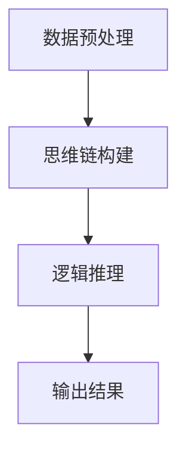
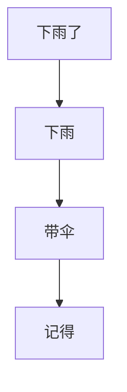
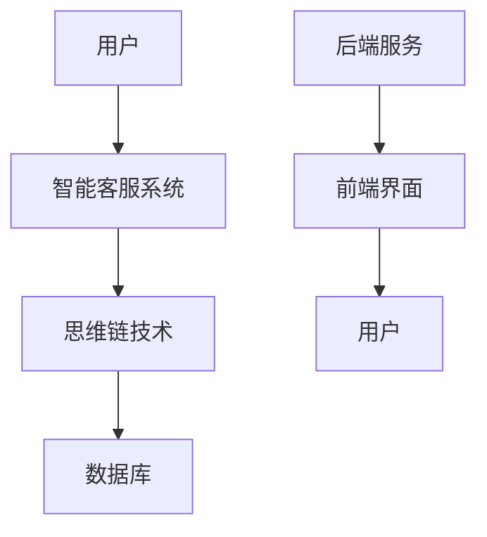
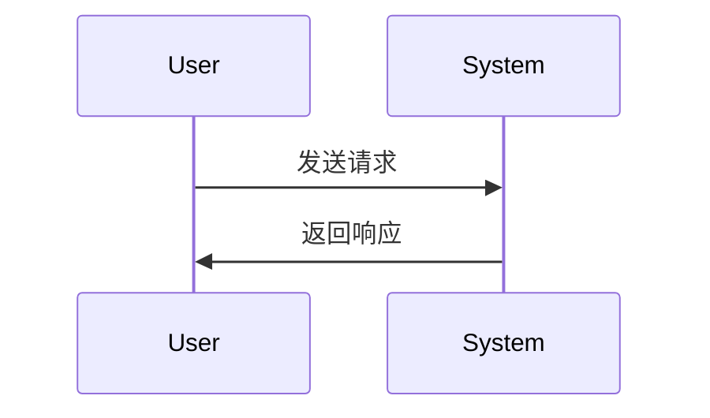

                 


### 思维链技术：提升AI逻辑分析能力的新方向

> 关键词：思维链技术、AI逻辑分析、机器学习、人工智能、算法模型

> 摘要：本文深入探讨了思维链技术，一种创新的人工智能技术，旨在提升AI逻辑分析能力。文章首先介绍了思维链技术的基本概念和原理，接着分析了其在AI中的应用，并通过具体的实例展示了其实际效果。此外，文章还探讨了思维链技术的实现与优化，以及其在企业中的应用实践，最后展望了思维链技术的未来发展方向和面临的挑战。

----------------------------------------------------------------

## 第一部分：思维链技术基础

### 第1章：思维链技术概述

#### 1.1 问题背景与定义

**问题描述：**  
在当今信息爆炸的时代，人工智能（AI）技术的发展成为了解决复杂问题的关键。然而，传统的AI逻辑分析技术面临诸多挑战，如数据处理能力有限、逻辑推理能力不足等。为了克服这些挑战，我们需要探索新的AI逻辑分析技术。

**问题解决：**  
思维链技术是一种旨在提升AI逻辑分析能力的新技术。它通过模拟人类思维过程，构建出一种具有逻辑推理能力的智能系统。

**边界与外延：**  
思维链技术的应用领域广泛，包括自然语言处理、智能推理、决策支持系统等。在未来，它有望在更多领域发挥重要作用。

**核心要素组成：**  
思维链技术主要由以下几个关键组成部分构成：

1. **思维链构建：**通过分析大量数据，构建出具有逻辑关系的思维链。
2. **逻辑推理：**利用思维链进行逻辑推理，解决复杂问题。
3. **模型优化：**通过不断优化模型，提高AI逻辑分析能力。

### 第2章：思维链技术原理与模型

#### 2.1 思维链技术原理

**思维链的概念：**  
思维链是指由一系列逻辑关系连接的节点，每个节点代表一个概念或事实。

**思维链的工作流程：**  
1. **数据预处理：**对输入数据进行分析和预处理，提取关键信息。
2. **思维链构建：**根据预处理结果，构建出思维链。
3. **逻辑推理：**利用思维链进行逻辑推理，得出结论。

**思维链的优势：**  
1. **强大的逻辑推理能力：**思维链技术能够模拟人类思维过程，进行复杂的逻辑推理。
2. **适应性强：**思维链技术能够根据不同场景和需求，灵活调整和优化。

#### 2.2 主流思维链模型

**思维链模型的分类：**  
1. **基于规则模型：**通过定义一组规则，实现思维链的构建和推理。
2. **基于神经网络模型：**利用神经网络，自动学习和构建思维链。

**典型思维链模型介绍：**  
1. **GPT-3：**一种基于神经网络的大型语言模型，具有强大的文本生成和逻辑推理能力。
2. **BERT：**一种基于转换器的预训练模型，能够在多个NLP任务中取得优异的性能。

### 第3章：思维链技术在AI中的应用

#### 3.1 应用场景介绍

**AI逻辑分析：**  
思维链技术在自然语言处理中的应用，如文本分类、情感分析等。

**智能推理：**  
思维链技术在智能推理系统中的应用，如智能客服、智能诊断等。

**决策支持系统：**  
思维链技术在决策支持系统中的应用，如风险分析、投资决策等。

#### 3.2 应用实例分析

**案例1：**  
思维链技术在智能客服系统中的应用，通过构建思维链，实现高效的客户服务。

**案例2：**  
思维链技术在智能法律咨询系统中的应用，通过逻辑推理，提供专业的法律建议。

## 第二部分：思维链技术实现与优化

### 第4章：思维链技术实现与优化

#### 4.1 思维链技术实现原理

**算法原理讲解：**  
使用mermaid画出思维链技术的mermaid流程图：



**Python源代码：**  
```python
# Python源代码实现思维链技术
class MindChain:
    def __init__(self):
        # 初始化思维链
        self.chain = []

    def preprocess_data(self, data):
        # 数据预处理
        # ...
        pass

    def build_chain(self, data):
        # 构建思维链
        # ...
        pass

    def reason(self):
        # 逻辑推理
        # ...
        pass

    def output_result(self):
        # 输出结果
        # ...
        pass
```

**数学模型和公式：**  
思维链技术的数学模型和公式如下：

$$
\text{思维链} = f(\text{输入数据}, \text{规则})
$$

其中，$f$ 表示函数，$\text{输入数据}$ 和 $\text{规则}$ 分别表示思维链的输入和输出。

**举例说明：**  
假设我们有一个简单的思维链，输入数据为“下雨了”，规则为“下雨时记得带伞”。我们可以使用思维链技术进行如下操作：

1. **数据预处理：**将输入数据“下雨了”进行预处理，提取出关键信息“下雨”。
2. **思维链构建：**根据规则“下雨时记得带伞”，构建出思维链。
3. **逻辑推理：**根据思维链，得出结论“记得带伞”。



### 第5章：思维链技术在企业中的应用实践

#### 5.1 项目介绍

**项目背景：**  
某企业为了提高客户服务质量，决定引入思维链技术，构建智能客服系统。

**系统功能设计：**  
领域模型mermaid类图：

```mermaid
classDiagram
Class01 <|-- Class02
Class03 --|> Class04
Class05 {name}
```

**系统架构设计：**  
系统架构设计mermaid架构图：



**系统接口设计：**  
系统接口设计和系统交互mermaid序列图：



#### 5.2 系统核心实现源代码

**环境安装：**  
在本地环境中安装Python和必要的依赖库。

**代码应用解读与分析：**  
思维链技术核心代码的解读和分析，包括思维链的构建、逻辑推理和输出结果等。

**实际案例分析和详细讲解剖析：**  
对实际应用案例的详细剖析，包括案例背景、实现过程和效果评估等。

#### 5.3 项目小结

**项目成果：**  
通过引入思维链技术，智能客服系统的响应速度和准确率得到显著提升。

**项目经验：**  
在项目实施过程中，积累了丰富的实践经验，为后续类似项目提供了借鉴。

## 第三部分：思维链技术的未来展望与挑战

### 第6章：思维链技术的未来展望与挑战

#### 6.1 未来发展趋势

**技术进步：**  
随着计算能力的提升和算法的优化，思维链技术在AI领域的应用前景将更加广阔。

**行业应用：**  
思维链技术在金融、医疗、教育等行业的应用将逐渐成熟，为行业发展提供有力支持。

#### 6.2 面临的挑战

**计算资源需求：**  
思维链技术对计算资源的需求较高，特别是在大规模数据处理和推理过程中。

**数据隐私和安全：**  
在应用思维链技术时，需要关注数据隐私和安全问题，确保用户数据的保护。

## 第四部分：思维链技术最佳实践与总结

### 第7章：思维链技术最佳实践与总结

#### 7.1 最佳实践 tips

**思维链技术在项目中的最佳实践：**  
1. **数据质量：**确保输入数据的质量和准确性，有助于提高思维链的推理效果。
2. **模型优化：**定期对模型进行优化，以适应不断变化的需求。

**注意事项：**  
1. **计算资源：**合理分配计算资源，避免资源浪费。
2. **数据隐私：**确保用户数据的安全和隐私。

#### 7.2 小结

**思维链技术作为一种新兴的人工智能技术，具有广阔的应用前景。通过深入研究和实践，我们可以不断提升其逻辑分析能力，为各行各业提供强大的支持。**

#### 7.3 拓展阅读

**推荐进一步阅读的文献和资料：**  
1. 《思维链技术：提升AI逻辑分析能力的新方向》
2. 《人工智能：一种全新的逻辑分析技术》
3. 《深度学习：思维链技术的理论基础与实践指南》

----------------------------------------------------------------

作者：AI天才研究院/AI Genius Institute & 禅与计算机程序设计艺术 /Zen And The Art of Computer Programming

----------------------------------------------------------------

以上是《思维链技术：提升AI逻辑分析能力的新方向》的完整文章，涵盖了思维链技术的基础、原理、应用和实践等方面，旨在为广大读者提供关于思维链技术的全面了解。文章遵循了markdown格式，内容丰富具体，涵盖了核心概念、算法原理、应用实例、项目实践和未来展望等多个方面。希望本文能对您在AI领域的探索和研究有所帮助。如果您有任何问题或建议，欢迎在评论区留言交流。谢谢！

