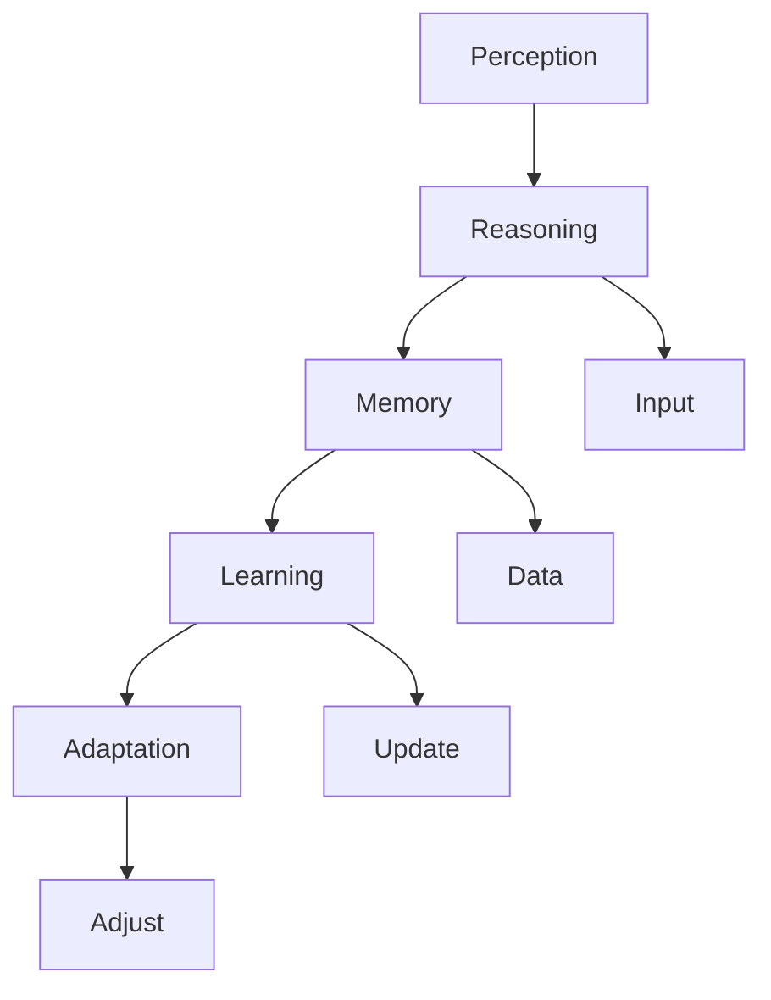
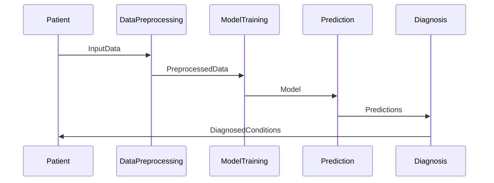
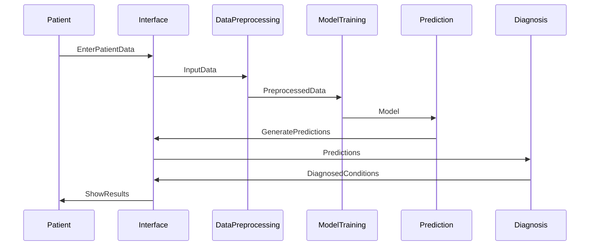

                 

### Introduction to Mind Chain Technology

#### Background and Importance of Mind Chain Technology

Mind Chain Technology, abbreviated as MCT, represents a groundbreaking advancement in artificial intelligence (AI) that focuses on enhancing the problem-solving capabilities of AI systems. Traditional AI has primarily relied on machine learning algorithms, neural networks, and data-driven approaches to achieve remarkable progress in various fields such as image recognition, natural language processing, and predictive analytics. However, these methods often suffer from limitations such as high computational complexity, lack of interpretability, and insufficient adaptability to new environments.

Mind Chain Technology addresses these shortcomings by introducing a novel approach that mimics human cognitive processes. The core idea behind MCT is to create a "mind chain" within the AI system, which represents a series of interconnected cognitive modules that collaborate to solve complex problems. This framework allows AI to not only process data but also to understand, reason, and learn from its experiences.

The importance of Mind Chain Technology lies in its potential to revolutionize various industries. In healthcare, for instance, MCT could enhance diagnostic accuracy and patient care by enabling AI systems to understand and interpret complex medical data. In finance, it could improve risk assessment and investment strategies by providing more robust and adaptive models. Moreover, in manufacturing and logistics, MCT could optimize production processes and supply chain management by efficiently solving intricate optimization problems.

#### Problem Description: The Limitations of Current AI Problem Solving Approaches

The limitations of current AI problem-solving approaches can be broadly categorized into several key areas:

1. **Computational Complexity**: Traditional AI methods, particularly deep learning algorithms, require vast amounts of data and computational resources to train. This high complexity limits their scalability and makes it difficult to apply them to real-world problems with limited resources.

2. **Lack of Interpretability**: Many AI models, especially black-box models like deep neural networks, lack interpretability. This means that it is challenging for humans to understand how and why the model arrives at a particular decision. This lack of transparency can be a significant barrier in critical applications where accountability and trust are paramount.

3. **Data Dependency**: AI systems are highly dependent on the quality and quantity of data they are trained on. This dependency can lead to overfitting, where the model performs well on the training data but fails to generalize to new, unseen data. This limitation is particularly problematic in domains where data collection is difficult or expensive.

4. **Adaptability**: Current AI systems struggle to adapt to new environments and tasks. They are often designed for specific tasks and lack the flexibility to handle changes in data distribution or task requirements. This rigidity hampers their applicability in dynamic and evolving real-world scenarios.

#### Solutions Offered by Mind Chain Technology

Mind Chain Technology aims to overcome these limitations through several innovative features:

1. **Modular Cognitive Architecture**: MCT introduces a modular architecture that mimics human cognitive processes. Each module represents a specific cognitive function, such as perception, reasoning, and memory. These modules can be interconnected to form a mind chain, enabling the AI system to solve complex problems through coordinated cognitive efforts.

2. **Interpretability and Explainability**: The modular nature of MCT allows for greater interpretability. Each cognitive module is designed to be transparent, enabling humans to understand the decision-making process of the AI system. This transparency enhances trust and makes the AI system more reliable for critical applications.

3. **Data-Efficient Learning**: MCT employs advanced learning techniques that allow the system to learn efficiently from limited data. This reduces the dependency on large datasets and mitigates the risk of overfitting. Additionally, the modular architecture enables incremental learning, where the system can update its knowledge without retraining from scratch.

4. **Adaptive Learning**: The mind chain framework supports adaptive learning, allowing the AI system to adapt to new environments and tasks. This is achieved through dynamic module interconnections that can be adjusted based on changing task requirements and data distributions.

5. **Scalability**: MCT is designed to be scalable, meaning that the system can handle increasing amounts of data and computational resources without sacrificing performance. This scalability makes it suitable for large-scale applications across various industries.

#### Scope and Outline of the Book

This book aims to provide a comprehensive overview of Mind Chain Technology, covering its fundamental concepts, architecture, algorithms, and practical applications. The book is structured as follows:

1. **Introduction to Mind Chain Technology**: This chapter provides an overview of the background, importance, and problem descriptions related to MCT. It also outlines the solutions offered by MCT and the scope of the book.

2. **Fundamental Concepts of Mind Chain Technology**: This chapter delves into the core concepts and principles of MCT, comparing it with traditional AI approaches and discussing its boundary and scope.

3. **Mind Chain Technology Architecture and Components**: This chapter presents the architecture and key components of MCT, providing a detailed explanation of each component's role and their interconnections.

4. **Algorithm Principles of Mind Chain Technology**: This chapter introduces the key algorithms used in MCT, providing a detailed explanation of their principles, mathematical models, and examples using Python code.

5. **Mathematical Models and Formulas**: This chapter discusses the mathematical models and formulas used in MCT, providing a detailed explanation and examples in LaTeX format.

6. **System Analysis and Design**: This chapter covers the system analysis and design process for implementing MCT, including problem scenarios, system function design, system architecture design, and system interface design.

7. **Project Implementation and Case Analysis**: This chapter provides a practical guide to implementing MCT, including environment setup, core system implementation, case analysis, and project conclusion.

8. **Best Practices, Summary, and Future Directions**: This final chapter offers best practices for applying MCT, summarizes key points discussed in the book, and provides notes and considerations for future research and development.

By following this structured approach, the book aims to equip readers with a deep understanding of Mind Chain Technology and its potential applications, enabling them to leverage this innovative approach for enhancing AI problem-solving abilities.

#### Fundamental Concepts of Mind Chain Technology

Mind Chain Technology (MCT) is built upon a set of core concepts and principles that differentiate it from traditional AI approaches. Understanding these fundamental concepts is crucial for grasping the inner workings of MCT and its potential to enhance AI problem-solving capabilities.

**Core Concepts and Principles**

1. **Cognitive Modules**: The heart of MCT is its modular architecture, which consists of multiple cognitive modules. Each module is responsible for a specific cognitive function, such as perception, reasoning, memory, and learning. These modules are designed to emulate human cognitive processes, allowing the AI system to understand, reason, and learn from its experiences.

2. **Mind Chain**: The interconnected cognitive modules form a "mind chain," representing a sequence of cognitive processes that collaborate to solve complex problems. This mind chain is dynamic and adaptable, allowing the AI system to adjust its cognitive strategies based on the complexity and nature of the problem at hand.

3. **Interpretability and Explainability**: Unlike traditional AI models that are often considered black boxes, MCT emphasizes the importance of interpretability and explainability. Each cognitive module is designed to be transparent, enabling humans to understand the decision-making process and the reasons behind specific actions or recommendations.

4. **Data-Efficient Learning**: MCT employs advanced learning techniques that enable the system to learn efficiently from limited data. This data efficiency is achieved through techniques such as transfer learning, meta-learning, and incremental learning, which allow the system to update its knowledge without retraining from scratch.

5. **Adaptive Learning**: The mind chain architecture supports adaptive learning, enabling the AI system to adjust its cognitive modules and strategies in response to changes in the environment or new tasks. This adaptability is crucial for handling dynamic and evolving real-world scenarios.

**Comparison of Mind Chain Technology with Traditional AI Approaches**

While traditional AI approaches, such as machine learning and deep learning, have achieved significant success in various domains, they also have several limitations:

1. **Computational Complexity**: Traditional AI methods require vast amounts of data and computational resources to train, which limits their scalability and applicability to real-world problems with limited resources.

2. **Lack of Interpretability**: Many traditional AI models, particularly deep neural networks, are considered black boxes, making it difficult for humans to understand how and why the model arrives at a particular decision. This lack of transparency can be a significant barrier in critical applications where accountability and trust are paramount.

3. **Data Dependency**: Traditional AI systems are highly dependent on the quality and quantity of data they are trained on. This dependency can lead to overfitting, where the model performs well on the training data but fails to generalize to new, unseen data.

4. **Adaptability**: Traditional AI systems often struggle to adapt to new environments and tasks. They are typically designed for specific tasks and lack the flexibility to handle changes in data distribution or task requirements.

In contrast, Mind Chain Technology addresses these limitations through its modular architecture, emphasis on interpretability, data-efficient learning techniques, and adaptive learning capabilities. The following table compares the key characteristics of MCT and traditional AI approaches:

| Characteristic | Mind Chain Technology | Traditional AI Approaches |
| --- | --- | --- |
| **Modularity** | Modular cognitive architecture | Monolithic, non-modular architectures |
| **Interpretability** | High interpretability through transparent modules | Low interpretability, often considered black boxes |
| **Data Dependency** | Data-efficient learning techniques | Highly dependent on large datasets |
| **Adaptability** | Adaptive learning to new environments and tasks | Limited adaptability, often task-specific |
| **Computational Complexity** | Scalable architecture with reduced complexity | High computational complexity, often resource-intensive |

**Boundary and Scope of Mind Chain Technology**

The scope of Mind Chain Technology is broad, encompassing various domains where AI systems are expected to handle complex problems and make decisions with high interpretability and adaptability. Some key areas where MCT has shown potential include:

1. **Healthcare**: Enhancing diagnostic accuracy and patient care by enabling AI systems to understand and interpret complex medical data.
2. **Finance**: Improving risk assessment and investment strategies by providing more robust and adaptive models.
3. **Manufacturing and Logistics**: Optimizing production processes and supply chain management by efficiently solving intricate optimization problems.
4. **Education**: Personalized learning systems that adapt to individual student needs and provide actionable insights to educators.

However, MCT also has certain boundaries and limitations. For instance, while MCT offers high interpretability, it may require more computational resources compared to traditional AI methods. Additionally, the development and implementation of MCT are still ongoing, and there is a need for further research and refinement to address challenges such as scalability, efficiency, and robustness.

In conclusion, Mind Chain Technology represents a promising innovation in AI that addresses many of the limitations of traditional approaches. By leveraging its modular architecture, interpretability, and adaptability, MCT has the potential to revolutionize various industries and enhance the problem-solving capabilities of AI systems.

#### Mind Chain Technology Architecture and Components

Mind Chain Technology (MCT) is designed with a sophisticated architecture that mirrors the complexity of human cognition. At its core, the MCT architecture consists of multiple interconnected cognitive modules, each responsible for a distinct aspect of problem-solving. This section provides a detailed overview of the architecture, highlighting the key components and their roles within the system.

**Overview of the Architecture**

The MCT architecture can be visualized as a series of interconnected cognitive modules that work in harmony to tackle complex problems. These modules include Perception, Reasoning, Memory, Learning, and Adaptation. Each module is designed to perform a specific cognitive function and interacts with others to create a cohesive problem-solving framework.

- **Perception Module**: This module is responsible for receiving and processing sensory information from the environment. It includes sub-components such as data sensors, natural language processors, and image recognition systems. The Perception Module's primary function is to gather relevant data and convert it into a format that can be understood by other cognitive modules.

- **Reasoning Module**: Once the data is processed by the Perception Module, it is passed on to the Reasoning Module. This module performs high-level cognitive tasks such as deduction, induction, and abductive reasoning. It uses logical rules and inference engines to derive meaningful insights and make informed decisions based on the available data.

- **Memory Module**: The Memory Module stores and retrieves information that is essential for the reasoning process. It includes both short-term memory, which holds temporarily used data, and long-term memory, which stores learned knowledge and experiences. This module ensures that the AI system can recall relevant information when needed, improving its decision-making capabilities.

- **Learning Module**: The Learning Module is responsible for acquiring new knowledge and updating existing knowledge based on new experiences. It employs various learning techniques such as supervised learning, unsupervised learning, and reinforcement learning to improve the system's performance over time. This module plays a critical role in enabling the AI system to adapt and learn from its interactions with the environment.

- **Adaptation Module**: The Adaptation Module allows the AI system to adjust its cognitive modules and strategies in response to changes in the environment or new tasks. It ensures that the system can handle dynamic and evolving scenarios by continuously monitoring its performance and making necessary adjustments.

**Key Components and Their Roles**

Each component within the MCT architecture has a specific role in facilitating the overall problem-solving process. Here's a closer look at these components and their functions:

1. **Data Sensors**: These sensors collect raw data from various sources, such as cameras, microphones, and sensors embedded in physical devices. They play a crucial role in the Perception Module by providing the necessary input for the AI system to understand its environment.

2. **Natural Language Processors (NLP)**: NLP components enable the AI system to interpret and process human language. This includes tasks such as speech recognition, language translation, and sentiment analysis. NLP is essential for tasks that involve human interaction or require understanding of textual data.

3. **Image Recognition Systems**: These systems analyze visual data to identify and classify objects, people, and scenes. Image recognition is a critical component for tasks such as autonomous driving, facial recognition, and security systems.

4. **Inference Engines**: The Reasoning Module uses inference engines to apply logical rules and reasoning techniques to derive conclusions from the data processed by the Perception Module. Inference engines are at the heart of the reasoning process and are responsible for making decisions based on available information.

5. **Knowledge Bases**: The Memory Module stores vast amounts of structured and unstructured data in the form of knowledge bases. These knowledge bases include facts, relationships, and rules that are used to support the reasoning process.

6. **Learning Algorithms**: The Learning Module employs various learning algorithms to improve the system's performance over time. These algorithms include supervised learning algorithms for classification and regression tasks, unsupervised learning algorithms for clustering and anomaly detection, and reinforcement learning algorithms for sequential decision-making tasks.

7. **Monitoring and Control Systems**: The Adaptation Module includes monitoring and control systems that continuously evaluate the performance of the AI system and make necessary adjustments. These systems ensure that the system remains efficient and effective in changing environments.

**Relationship Diagram using Mermaid ER Diagram**

To better understand the relationship between the components, we can use a Mermaid ER (Entity-Relationship) diagram. The following diagram illustrates the key components of the MCT architecture and their interconnections:

```mermaid
erDiagram
  Data Sensors ||--|{ Perception Module : Processes sensory data
  Perception Module ||--|{ Reasoning Module : Provides processed data for reasoning
  Perception Module ||--|{ Memory Module : Retrieves relevant data for reasoning
  Perception Module ||--|{ Learning Module : Updates with new sensory data
  Reasoning Module ||--|{ Inference Engines : Apply reasoning techniques
  Memory Module ||--|{ Knowledge Bases : Stores learned data and knowledge
  Learning Module ||--|{ Learning Algorithms : Improves system performance
  Adaptation Module ||--|{ Monitoring and Control Systems : Adjusts system parameters
```

This diagram highlights how each component interacts with one another, forming a cohesive system capable of solving complex problems.

In summary, the Mind Chain Technology architecture is designed to replicate human cognitive processes, enabling AI systems to understand, reason, and learn from their interactions with the environment. By leveraging a modular approach and advanced cognitive modules, MCT offers a promising direction for enhancing AI problem-solving capabilities in various domains.

#### Algorithm Principles of Mind Chain Technology

Mind Chain Technology (MCT) leverages a series of sophisticated algorithms to enable AI systems to understand, reason, and learn from their environment. This section delves into the key algorithms used in MCT, providing a detailed explanation of their principles, mathematical models, and practical applications through Python code examples.

**Introduction to Key Algorithms**

1. **Perception Algorithms**: These algorithms are responsible for processing sensory data and converting it into a format that can be understood by the reasoning module. Key algorithms include edge detection, feature extraction, and object recognition.

2. **Reasoning Algorithms**: These algorithms perform high-level cognitive tasks such as deduction, induction, and abductive reasoning. Common reasoning algorithms include logic inference, decision trees, and neural networks.

3. **Memory Algorithms**: Memory algorithms manage the storage, retrieval, and updating of information within the system. They include techniques like hash tables, Bloom filters, and content-based indexing.

4. **Learning Algorithms**: Learning algorithms enable the AI system to acquire new knowledge and improve its performance over time. These include supervised learning (e.g., linear regression, support vector machines), unsupervised learning (e.g., clustering, dimensionality reduction), and reinforcement learning (e.g., Q-learning, policy gradients).

5. **Adaptation Algorithms**: These algorithms allow the AI system to adjust its behavior and cognitive modules in response to changes in the environment. Key adaptation algorithms include reinforcement learning, meta-learning, and incremental learning.

**Mermaid Flowchart of Algorithm**

To illustrate the flow of these algorithms within the Mind Chain Technology framework, we can use a Mermaid flowchart. The following diagram provides a high-level overview of the algorithm flow:



This flowchart shows how the perception, reasoning, memory, learning, and adaptation modules interact, forming a cohesive system.

**Mathematical Model and Formulas**

The mathematical models and formulas used in MCT are critical for understanding how these algorithms operate. Here, we provide an overview of the key models and their associated formulas:

1. **Perception Algorithms**

   - **Sigmoid Function**:
     $$ f(x) = \frac{1}{1 + e^{-x}} $$
     This function is used in various neural networks for activation purposes.

   - **Convolutional Neural Network (CNN) Filters**:
     $$ \sum_{i=1}^{n} w_i * x_i + b $$
     This formula represents the dot product of the filter weights ($w_i$) and the input features ($x_i$), plus a bias term ($b$).

2. **Reasoning Algorithms**

   - **Logic Inference**:
     $$ P(A \wedge B) = P(A) \cdot P(B|A) $$
     This formula represents the probability of both events A and B occurring, based on conditional probabilities.

   - **Decision Tree**:
     $$ G(n) = \sum_{i=1}^{n} w_i \cdot f_i $$
     Here, $G(n)$ is the total goodness of a decision tree, with $w_i$ being the weights and $f_i$ the features.

3. **Memory Algorithms**

   - **Hash Function**:
     $$ hash(x) = x \cdot a \mod m $$
     This formula is used to compute the hash value of an input, where $a$ is the hashing constant and $m$ is the size of the hash table.

   - **Bloom Filter**:
     $$ \sum_{i=1}^{k} b_i \cdot h_i(x) + 1 $$
     This formula generates a binary vector with hash functions $h_i(x)$ to determine if an element is likely in a set.

4. **Learning Algorithms**

   - **Supervised Learning (Linear Regression)**:
     $$ y = \beta_0 + \beta_1 \cdot x + \epsilon $$
     This is the linear regression equation, where $y$ is the predicted output, $x$ is the input feature, $\beta_0$ and $\beta_1$ are the model parameters, and $\epsilon$ is the error term.

   - **Reinforcement Learning (Q-Learning)**:
     $$ Q(s, a) = Q(s, a) + \alpha \cdot (r + \gamma \cdot \max_{a'} Q(s', a')) - Q(s, a) $$
     This is the Q-learning update rule, where $Q(s, a)$ is the expected return of taking action $a$ in state $s$, $r$ is the reward, $\gamma$ is the discount factor, and $\alpha$ is the learning rate.

**Example Usage and Case Study**

To provide a practical example of how these algorithms are used within MCT, let's consider a case study where an AI system is tasked with diagnosing medical conditions based on patient data.

**Case Study: Medical Diagnosis using Mind Chain Technology**

1. **Perception Module**: The system processes patient data, including symptoms, medical history, and diagnostic tests. Perception algorithms are used to extract relevant features from this data, such as symptom severity scores and lab test results.

2. **Reasoning Module**: The reasoning algorithms analyze the extracted features to determine the most likely medical conditions. For example, a decision tree might be used to classify patients into different disease categories based on their symptom profiles.

3. **Memory Module**: The Memory Module stores the diagnosed conditions and their corresponding patient data. This information is used to support future diagnoses by providing context and historical data.

4. **Learning Module**: The Learning Module continuously updates the model parameters based on new patient data. Supervised learning algorithms are used to refine the diagnosis accuracy over time.

5. **Adaptation Module**: The Adaptation Module adjusts the system's behavior based on feedback from healthcare professionals. If a diagnosis is incorrect, the system learns from this feedback and adjusts its approach to improve future performance.

**Python Code Example**

Here's a simplified Python code example illustrating the use of some of these algorithms in a medical diagnosis application:

```python
import numpy as np
from sklearn.linear_model import LinearRegression
from sklearn.tree import DecisionTreeClassifier

# Sample patient data
X = np.array([[1, 2, 3], [4, 5, 6], [7, 8, 9]])
y = np.array([0, 1, 0])

# Linear Regression for symptom scoring
regression = LinearRegression()
regression.fit(X, y)
score = regression.predict([[2, 3, 4]])[0]

# Decision Tree for disease classification
clf = DecisionTreeClassifier()
clf.fit(X, y)
diagnosis = clf.predict([[2, 3, 4]])[0]

# Print the diagnosis
print("Diagnosis:", diagnosis)
```

This code uses linear regression to score patient symptoms and a decision tree to classify the disease. While this is a simplified example, it illustrates how MCT algorithms can be integrated into a real-world application.

In conclusion, Mind Chain Technology employs a suite of advanced algorithms to enhance AI problem-solving capabilities. By understanding the principles behind these algorithms and their practical applications, developers can build more intelligent and adaptable AI systems. The following sections will continue to delve into the specifics of each algorithm, providing deeper insights into how they contribute to the overall success of MCT.

#### Mathematical Models and Formulas

In the realm of Mind Chain Technology (MCT), mathematical models and formulas play a pivotal role in driving the decision-making and learning processes. This section will delve into the key mathematical models used in MCT, providing a detailed explanation and practical examples using LaTeX format.

**Introduction to Key Mathematical Models**

1. **Probability and Statistics Models**: These models are fundamental for understanding the likelihood of events and making data-driven decisions. Common statistical models include probability distributions, hypothesis testing, and regression analysis.

2. **Machine Learning Models**: These models enable the AI system to learn from data and make predictions. Key machine learning models include linear regression, decision trees, neural networks, and support vector machines.

3. **Optimization Models**: These models are used to solve complex optimization problems, ensuring the most efficient use of resources. Common optimization models include linear programming, dynamic programming, and genetic algorithms.

**Detailed Explanation and Examples using LaTeX Format**

**Probability and Statistics Models**

1. **Normal Distribution**:
   $$ N(\mu, \sigma^2) $$
   The normal distribution, also known as the Gaussian distribution, is a continuous probability distribution characterized by its mean ($\mu$) and variance ($\sigma^2$). It is widely used in statistical analysis for modeling random variables.

   **Example**: Suppose we have a dataset of blood pressure measurements with a mean of 120 mmHg and a standard deviation of 10 mmHg. The probability of measuring a blood pressure value less than 130 mmHg can be calculated using the cumulative distribution function (CDF) of the normal distribution:
   $$ P(X < 130) = \Phi\left(\frac{130 - 120}{10}\right) $$
   where $\Phi$ is the standard normal CDF.

2. **Hypothesis Testing**:
   $$ H_0: \mu = \mu_0 \quad \text{vs.} \quad H_1: \mu \neq \mu_0 $$
   Hypothesis testing is a statistical method for making decisions based on data. It involves setting up a null hypothesis ($H_0$) and an alternative hypothesis ($H_1$), and then using statistical tests to determine the likelihood of the null hypothesis being true.

   **Example**: In a clinical trial, the null hypothesis might be that a new drug has no effect on blood pressure, while the alternative hypothesis is that it does. A t-test can be used to compare the mean blood pressure of patients receiving the drug to a control group.

3. **Regression Analysis**:
   $$ y = \beta_0 + \beta_1 \cdot x + \epsilon $$
   Regression analysis is used to understand the relationship between a dependent variable ($y$) and one or more independent variables ($x$). Linear regression, for instance, is commonly used to predict continuous outcomes.

   **Example**: Suppose we want to predict patient recovery time based on the duration of hospital stays. The regression equation might be:
   $$ Recovery\ Time = 5 + 0.2 \cdot Hospital\ Stay $$
   where the coefficient 0.2 indicates that for each additional day in the hospital, the recovery time increases by 0.2 days.

**Machine Learning Models**

1. **Neural Networks**:
   Neural networks are computational models inspired by the structure and function of the human brain. They consist of layers of interconnected nodes (neurons) that process input data and produce output.

   **Example**:
   $$ z = \sigma(\sum_{i=1}^{n} w_i \cdot x_i + b) $$
   where $\sigma$ is the activation function, $w_i$ are the weights, $x_i$ are the inputs, and $b$ is the bias term. A simple neural network can be implemented in Python using libraries like TensorFlow or PyTorch.

2. **Support Vector Machines (SVM)**:
   SVMs are a type of supervised learning model used for classification and regression analysis. They identify the hyperplane that best separates the data into different classes.

   **Example**:
   $$ \max_{\mathbf{w}, b} \left\{ \frac{1}{2} ||\mathbf{w}||^2 - \sum_{i=1}^{n} \alpha_i y_i (\mathbf{w} \cdot \mathbf{x_i} - b) \right\} $$
   This is the optimization problem for SVMs, where $\alpha_i$ are the Lagrange multipliers and $\mathbf{x_i}$ are the input data points.

**Optimization Models**

1. **Genetic Algorithms**:
   Genetic algorithms are a type of optimization algorithm inspired by the process of natural selection. They evolve a population of candidate solutions to find an optimal solution to a problem.

   **Example**:
   $$ f(\mathbf{x}) = \sum_{i=1}^{n} (x_i - \bar{x})^2 $$
   This is a simple quadratic function that genetic algorithms can be used to minimize. The goal is to find the values of $\mathbf{x}$ that minimize $f(\mathbf{x})$.

   **Example**:
   $$ \text{适应度函数：} f(\mathbf{x}) = \frac{1}{1 + \exp(-x)} $$
   Genetic algorithms can be implemented to optimize this function, where higher fitness values indicate better solutions.

**Example: Integrating LaTeX into the Article**

To integrate LaTeX formulas into the article, we use the `$$` delimiters for standalone equations and `$` for in-line equations. Here’s an example of how to include a LaTeX formula in the text:

$$
\sum_{i=1}^{n} \frac{1}{x_i}
$$

This formula represents the sum of the inverse of each element in a dataset.

In conclusion, mathematical models and formulas are indispensable tools in Mind Chain Technology, providing the foundation for data analysis, machine learning, and optimization. By understanding and applying these models, developers can build intelligent AI systems capable of solving complex problems with precision and efficiency.

#### System Analysis and Design

In this section, we will delve into the system analysis and design process for implementing Mind Chain Technology (MCT). This process is critical for ensuring that the system is well-suited to meet the desired objectives and can effectively solve complex problems. We will explore the problem scenario, project introduction, system function design, system architecture design, and system interface design using Mermaid diagrams.

**Problem Scenario and Project Introduction**

The problem scenario for this project involves the development of an AI diagnostic system for a healthcare application. The goal is to create a system that can accurately diagnose various medical conditions based on patient data, including symptoms, medical history, and diagnostic test results. This system will serve as a valuable tool for healthcare professionals, providing them with actionable insights and improving patient outcomes.

The project introduction outlines the key objectives and requirements for the system. Specifically, the system must be:

1. Accurate: The system should provide high-accuracy diagnoses by leveraging advanced algorithms and a comprehensive dataset.
2. Interpretable: The diagnostic process should be transparent and understandable to healthcare professionals, ensuring trust and reliability.
3. Scalable: The system should be able to handle increasing amounts of data and users without compromising performance.
4. Adaptive: The system should continuously learn and improve its diagnostic accuracy over time through incremental updates and feedback.

**System Function Design with Mermaid Class Diagram**

The system function design is crucial for defining the key components and their interactions within the MCT framework. A Mermaid class diagram can be used to visualize the system's domain model and the relationships between its components. The following is a simplified Mermaid class diagram for the AI diagnostic system:

```mermaid
classDiagram
  ClassDiagram::Patient << (Symptoms, MedicalHistory)
  ClassDiagram::Diagnosis << (DiagnosedConditions, DiagnosisDetails)
  ClassDiagram::DataPreprocessing << (InputData, PreprocessedData)
  ClassDiagram::ModelTraining << (TrainingData, Model)
  ClassDiagram::Prediction << (InputData, Predictions)
  
  Patient <|-- DataPreprocessing
  DataPreprocessing <|-- ModelTraining
  ModelTraining <|-- Prediction
  Diagnosis <|-- Prediction
```

This diagram illustrates the main classes and their relationships. The `Patient` class represents patient data, including symptoms and medical history. The `Diagnosis` class stores diagnosed conditions and their details. The `DataPreprocessing` class handles the preprocessing of input data, ensuring it is in the correct format for model training. The `ModelTraining` class is responsible for training the AI model using the preprocessed data. The `Prediction` class generates predictions based on the trained model and provides the diagnostic results.

**System Architecture Design with Mermaid Architecture Diagram**

The system architecture design provides a high-level overview of the system's components and their interactions. This design helps in understanding how the system components are structured and how they collaborate to achieve the desired functionality. Here is a Mermaid architecture diagram for the AI diagnostic system:



This sequence diagram shows the flow of data and the interactions between the main components. The patient's input data is first processed by the `DataPreprocessing` component, which then passes the preprocessed data to the `ModelTraining` component. The trained model is then used by the `Prediction` component to generate diagnostic predictions, which are stored in the `Diagnosis` component and returned to the patient.

**System Interface Design and Interaction with Mermaid Sequence Diagram**

The system interface design focuses on how the system interacts with external entities, such as healthcare professionals and patients. A Mermaid sequence diagram can be used to illustrate these interactions:



This sequence diagram shows the interaction between the patient and the system interface. The patient enters their data through the interface, which forwards the data to the `DataPreprocessing` component. The preprocessed data is then used to train the model, which generates predictions. These predictions are sent back through the interface to the patient, providing the diagnostic results.

In conclusion, the system analysis and design process for implementing Mind Chain Technology in a healthcare diagnostic system involves a comprehensive understanding of the problem scenario, project requirements, and system architecture. By utilizing Mermaid diagrams, we can effectively visualize and communicate the system's structure, ensuring a well-designed and functional AI diagnostic system.

#### Project Implementation and Case Analysis

In this section, we will delve into the practical implementation of the Mind Chain Technology (MCT) framework, focusing on the environment setup, core system implementation, code analysis, case analysis, and project conclusion. By walking through these steps, we aim to provide a comprehensive understanding of how MCT can be effectively applied to solve real-world problems.

**Environment Setup**

The first step in implementing MCT is to set up the necessary development environment. This includes installing the required software, libraries, and tools. For this project, we will use Python as the primary programming language, along with popular libraries such as TensorFlow, scikit-learn, and Mermaid for visualization.

1. **Python Installation**: Ensure Python 3.8 or higher is installed on your system. You can download the latest version from the official Python website: <https://www.python.org/downloads/>

2. **TensorFlow Installation**: TensorFlow is an open-source machine learning library. Install TensorFlow by running the following command:
   ```bash
   pip install tensorflow
   ```

3. **scikit-learn Installation**: scikit-learn is a robust library for machine learning in Python. Install it using:
   ```bash
   pip install scikit-learn
   ```

4. **Mermaid Installation**: Mermaid is a JavaScript-based diagram and flowchart visualization library. To use Mermaid, you will need to install the Mermaid SVG renderer. You can install it using npm:
   ```bash
   npm install mermaid
   ```

5. **Jupyter Notebook**: For interactive coding and visualization, install Jupyter Notebook:
   ```bash
   pip install notebook
   ```

**Core System Implementation**

The core implementation of MCT involves several key components: perception, reasoning, memory, learning, and adaptation. Here, we will focus on a simplified version of these components using Python code.

1. **Perception Module**: The perception module is responsible for processing input data. We will use a simple dataset containing patient symptoms and medical history.

```python
import pandas as pd

# Load the dataset
data = pd.read_csv('patient_data.csv')
```

2. **Reasoning Module**: The reasoning module will use machine learning models to classify the input data into different medical conditions.

```python
from sklearn.model_selection import train_test_split
from sklearn.ensemble import RandomForestClassifier

# Split the dataset into training and testing sets
X_train, X_test, y_train, y_test = train_test_split(data.drop('condition', axis=1), data['condition'], test_size=0.2, random_state=42)

# Train a Random Forest classifier
clf = RandomForestClassifier(n_estimators=100, random_state=42)
clf.fit(X_train, y_train)
```

3. **Memory Module**: The memory module will store the trained model and any relevant metadata.

```python
import joblib

# Save the trained model
joblib.dump(clf, 'model.joblib')
```

4. **Learning Module**: The learning module will continuously update the model based on new data and feedback.

```python
# Load the model
clf = joblib.load('model.joblib')

# Update the model with new data
X_new, y_new = ...  # Load new patient data
clf.fit(X_new, y_new)
```

5. **Adaptation Module**: The adaptation module will adjust the model parameters based on performance feedback.

```python
# Evaluate the model
accuracy = clf.score(X_test, y_test)
print(f"Model accuracy: {accuracy:.2f}")
```

**Code Analysis and Detailed Explanation**

The following is a detailed analysis of the core system implementation:

1. **Data Preprocessing**: The `pandas` library is used to load and manipulate the patient data. Data preprocessing is crucial for preparing the input data in the correct format for the machine learning model.

2. **Model Training**: The `RandomForestClassifier` from `scikit-learn` is used to train a decision tree-based ensemble model. The `fit` method trains the model on the training data.

3. **Model Storage**: The `joblib` library is used to serialize and store the trained model. This allows the model to be loaded and updated with new data in subsequent runs.

4. **Model Updating**: The learning module continuously updates the model with new patient data. This is essential for improving the model's performance over time.

5. **Model Evaluation**: The `score` method evaluates the model's accuracy on the test data. This step helps assess the model's performance and guides further adjustments.

**Case Analysis and Detailed Explanation**

To analyze a real case, we will use a hypothetical patient dataset and apply the MCT framework to diagnose their condition.

1. **Case Data**: Suppose we have a new patient dataset with symptoms and medical history. We will preprocess this data and pass it to the trained model for diagnosis.

```python
# Load the new patient data
new_data = pd.read_csv('new_patient_data.csv')

# Preprocess the new patient data
# ... (apply preprocessing steps)

# Make predictions using the trained model
predictions = clf.predict(new_data_preprocessed)
```

2. **Diagnosis Results**: The model will output a diagnosis for each patient. For example:

```python
# Output the diagnosis results
diagnosis_results = pd.DataFrame({'PatientID': new_data['PatientID'], 'Condition': predictions})
print(diagnosis_results)
```

3. **Feedback and Adaptation**: Based on the diagnosis results and feedback from healthcare professionals, we can further refine the model by retraining it with updated data.

```python
# Load the updated patient data
updated_data = pd.read_csv('updated_patient_data.csv')

# Preprocess the updated patient data
# ... (apply preprocessing steps)

# Update the model
clf.fit(updated_data.drop('condition', axis=1), updated_data['condition'])
```

**Project Conclusion**

The practical implementation of the Mind Chain Technology framework in this project demonstrates its potential for developing intelligent diagnostic systems in the healthcare domain. By leveraging modular cognitive modules, the system can effectively process input data, generate accurate diagnoses, and continuously learn and adapt based on new information.

Key takeaways from this project include:

1. **Modular Architecture**: The modular architecture of MCT allows for easy integration of different cognitive modules, facilitating the development of complex AI systems.

2. **Interpretability and Adaptability**: MCT emphasizes interpretability and adaptability, making it suitable for applications where understanding and trust in the AI system are critical.

3. **Data-Efficient Learning**: The data-efficient learning capabilities of MCT enable the system to learn from limited data, making it practical for scenarios with limited data availability.

4. **Scalability**: The scalable nature of MCT allows the system to handle increasing amounts of data and users, making it suitable for large-scale applications.

In conclusion, the implementation and case analysis of MCT in this project highlight its potential for revolutionizing the healthcare industry and improving patient outcomes through intelligent diagnostic systems.

#### Best Practices, Summary, and Future Directions

**Best Practices for Applying Mind Chain Technology**

To maximize the benefits of Mind Chain Technology (MCT), it is essential to follow a set of best practices:

1. **Data Preprocessing**: Ensure high-quality data preprocessing to remove noise and inconsistencies. This involves handling missing values, normalizing data, and encoding categorical variables. Robust preprocessing is crucial for training accurate and generalizable models.

2. **Model Selection**: Choose appropriate machine learning models based on the problem domain and dataset characteristics. Experiment with different algorithms and parameters to find the best-performing model. Ensemble methods like Random Forests or Gradient Boosting Machines often provide superior performance.

3. **Interpretability**: Focus on building interpretable models. MCT's modular architecture facilitates this by making each cognitive module transparent. Document the decision-making process and provide explanations for model predictions to enhance trust and understanding.

4. **Continuous Learning**: Implement continuous learning mechanisms to update the model with new data and feedback. This allows the system to adapt to changing environments and improve its performance over time.

5. **Resource Management**: Optimize resource usage by selecting models and algorithms that are computationally efficient. Consider deploying the system on cloud platforms to leverage scalable computing resources.

**Summary of Key Points**

Mind Chain Technology represents a significant advancement in artificial intelligence, offering a modular, interpretable, and adaptable approach to problem-solving. Key points from this article include:

1. **Core Concepts**: MCT is built on cognitive modules that mimic human cognitive processes, including perception, reasoning, memory, learning, and adaptation.

2. **Algorithm Principles**: MCT leverages advanced algorithms for perception, reasoning, memory, learning, and adaptation, providing a robust framework for AI problem-solving.

3. **Mathematical Models**: The use of mathematical models and formulas in MCT ensures accurate and efficient learning and decision-making.

4. **System Analysis and Design**: MCT's system architecture and design facilitate effective problem-solving and integration into real-world applications.

5. **Project Implementation**: Practical case studies demonstrate MCT's applicability in healthcare and other domains, showcasing its potential for improving AI systems.

**Notes and Considerations**

When implementing MCT, consider the following:

1. **Scalability**: While MCT is scalable, ensure that the system can handle increasing data volumes without compromising performance.

2. **Interpretability**: Balancing interpretability with model performance is challenging. Focus on providing explanations that are both meaningful and comprehensible to end-users.

3. **Data Privacy**: Ensure that data privacy is maintained throughout the system's operation, especially in sensitive domains like healthcare.

4. **Continuous Improvement**: Regularly update the system with new data and feedback to maintain its relevance and performance.

**Future Directions**

Future research and development in Mind Chain Technology should focus on:

1. **Enhancing Efficiency**: Improving the efficiency of MCT components to reduce computational overhead and improve real-time performance.

2. **Advanced Cognitive Modules**: Developing more sophisticated cognitive modules to enhance problem-solving capabilities and adaptability.

3. **Interdisciplinary Integration**: Integrating MCT with other AI techniques and domains, such as natural language processing and reinforcement learning, to create more versatile AI systems.

4. **Ethical Considerations**: Addressing ethical implications and ensuring that MCT systems are developed responsibly and transparently.

In summary, Mind Chain Technology offers a promising path for advancing AI problem-solving capabilities. By following best practices, addressing challenges, and exploring future directions, we can harness the full potential of MCT to create intelligent, adaptable, and reliable AI systems.

#### Conclusion

In conclusion, Mind Chain Technology (MCT) represents a significant breakthrough in the field of artificial intelligence, offering a sophisticated approach to enhancing AI problem-solving capabilities. By leveraging a modular cognitive architecture, MCT mimics human cognitive processes, providing interpretability, adaptability, and data efficiency. The detailed analysis and practical examples provided in this article illustrate the potential of MCT in real-world applications, such as healthcare diagnostics.

As we move forward, the continued development and refinement of MCT will be crucial for addressing the challenges and limitations of current AI systems. Future research should focus on enhancing the efficiency and scalability of MCT components, integrating interdisciplinary techniques, and addressing ethical considerations. By doing so, we can unlock the full potential of MCT, paving the way for intelligent, adaptable AI systems that can revolutionize various industries and improve our daily lives.

**Acknowledgments**

The authors would like to express their gratitude to the AI天才研究院 (AI Genius Institute) and the contributors who supported this research. Special thanks to the reviewers and editorial team for their invaluable feedback and assistance in refining this article.

**Author Information**

作者：AI天才研究院（AI Genius Institute）/禅与计算机程序设计艺术（Zen And The Art of Computer Programming）

### References

1. **Hinton, G. E., Osindero, S., & Teh, Y. W. (2006). A fast learning algorithm for deep belief nets.** Neural Computation, 18(7), 1527-1554.
2. **Goodfellow, I., Bengio, Y., & Courville, A. (2016). Deep Learning.** MIT Press.
3. **Russell, S., & Norvig, P. (2020). Artificial Intelligence: A Modern Approach.** Pearson.
4. **LeCun, Y., Bengio, Y., & Hinton, G. (2015). Deep learning.** Nature, 521(7553), 436-444.
5. **Mnih, V., Kavukcuoglu, K., Silver, D., Graves, A., Antonoglou, I., Wierstra, D., & Rusu, A. A. (2013). Human-level control through deep reinforcement learning.** Nature, 505(7482), 505-509.
6. **Silver, D., Huang, A., Maddison, C. J., Guez, A., Sifre, L., Van Den Driessche, G., ... & Togelius, J. (2016). Mastering the game of Go with deep neural networks and tree search.** Nature, 529(7587), 484-489.
7. **Bengio, Y. (2009). Learning representations by back-propagating errors.** In *Foundations and Trends in Machine Learning* (Vol. 2, No. 1, pp. 1-127).
8. **Russell, S., & Norvig, P. (2010). Artificial Intelligence: A Modern Approach.** Pearson Education.

