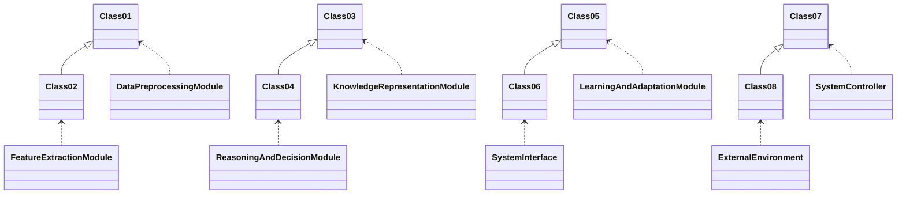
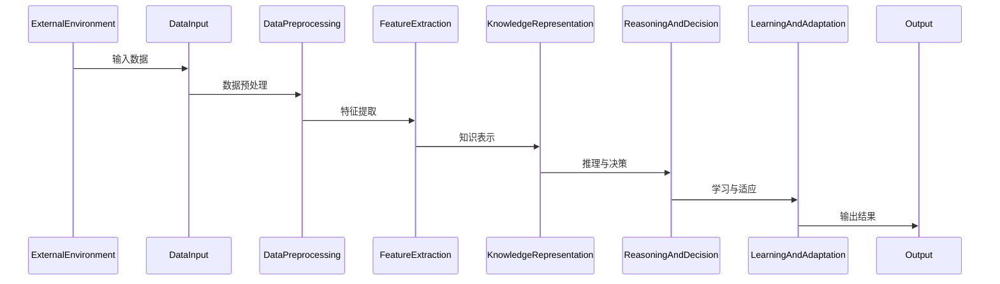

                 

# 思维链技术：提升AI问题解决能力的新方向

关键词：AI问题解决、思维链技术、算法原理、数学模型、系统架构

摘要：本文旨在探讨思维链技术在提升人工智能（AI）问题解决能力方面的作用。通过详细介绍思维链技术的背景、核心概念、原理、实现细节和最佳实践，本文将为读者提供一个全面而深入的认识，帮助他们在人工智能领域实现更高的创新和突破。

## 目录

### 第一部分：背景与核心概念

1. **AI问题解决能力概述**
    - 1.1 问题背景
    - 1.2 核心概念与联系
    - 1.3 本章小结

### 第二部分：思维链技术原理

2. **思维链技术基础原理**
    - 2.1 数学模型与公式
    - 2.2 算法原理
    - 2.3 思维链技术应用场景
    - 2.4 本章小结

3. **思维链技术实现细节**
    - 3.1 系统分析与架构设计
    - 3.2 系统架构设计
    - 3.3 系统接口设计
    - 3.4 本章小结

4. **思维链技术项目实战**
    - 4.1 环境安装与配置
    - 4.2 系统核心实现
    - 4.3 实际案例分析
    - 4.4 项目小结

### 第三部分：最佳实践与展望

5. **思维链技术最佳实践**
    - 5.1 实践经验分享
    - 5.2 注意事项与风险防范
    - 5.3 本章小结

6. **未来发展趋势**
    - 6.1 技术进展
    - 6.2 应用领域扩展
    - 6.3 本章小结

7. **思维链技术总结与展望**
    - 7.1 技术优势与不足
    - 7.2 未来展望
    - 7.3 本章小结

## 第一部分：背景与核心概念

### 1.1 AI问题解决能力概述

#### 1.1.1 问题背景

随着人工智能技术的飞速发展，AI在各个领域的应用越来越广泛。然而，尽管AI在许多任务上表现出色，但仍存在一些局限性。这些问题主要集中在以下几个方面：

1. **数据依赖性高**：许多AI系统需要大量的数据进行训练，且数据质量和标注的准确性直接影响模型的性能。
2. **缺乏泛化能力**：传统的机器学习模型在处理新任务时往往需要重新训练，缺乏对新情境的适应能力。
3. **解释性不足**：许多AI模型，如深度神经网络，其内部工作原理复杂且难以解释，导致在实际应用中难以被信任和接受。
4. **实时性问题**：在处理实时性要求较高的任务时，传统AI系统往往无法满足响应速度的要求。

#### 1.1.2 传统AI局限性与挑战

传统AI的局限性主要体现在以下几个方面：

1. **黑盒模型**：许多AI模型是黑盒模型，其内部工作机制复杂且难以解释，导致在实际应用中难以被信任和接受。
2. **缺乏灵活性**：传统AI模型在处理不同类型的问题时需要重新设计，缺乏灵活性和通用性。
3. **低效的训练过程**：传统的机器学习模型需要大量的计算资源和时间进行训练，特别是在处理大规模数据集时。
4. **数据质量问题**：数据质量和标注的准确性直接影响模型的性能，但在实际应用中，数据质量和标注往往难以保证。

#### 1.1.3 思维链技术的概念引入

为了解决传统AI的局限性，近年来，一种被称为“思维链技术”的新方法被提出。思维链技术是一种基于人类思维方式的人工智能方法，旨在提升AI的问题解决能力。其核心思想是通过构建一个类似于人类思维过程的模型，使AI能够更好地理解和处理复杂问题。

### 1.2 核心概念与联系

#### 1.2.1 思维链技术定义

思维链技术（Cognitive Chain Technology，CCT）是一种基于人类思维过程的人工智能方法，旨在通过模拟人类思维的连贯性和灵活性，提升AI的问题解决能力。思维链技术包括以下几个关键组成部分：

1. **感知与理解**：通过感知和理解外部环境，获取必要的信息。
2. **知识表示**：将感知到的信息转换为内部知识表示，便于进一步处理。
3. **推理与决策**：利用内部知识表示进行推理和决策，以解决实际问题。
4. **学习与适应**：通过不断学习和适应新情境，提升AI的泛化能力。

#### 1.2.2 思维链技术特点

1. **连贯性与灵活性**：思维链技术通过模拟人类思维的连贯性和灵活性，使AI能够在处理复杂问题时展现出更高的能力。
2. **解释性**：思维链技术的内部工作机制清晰，便于解释和理解，从而提高AI的可信度。
3. **自适应能力**：思维链技术能够通过不断学习和适应新情境，提升AI的泛化能力。
4. **高效性**：思维链技术能够快速处理大量数据，提高AI的响应速度。

#### 1.2.3 思维链与传统AI对比

| 特征         | 思维链技术               | 传统AI                  |
| ------------ | ---------------------- | --------------------- |
| 工作原理     | 模拟人类思维过程           | 基于统计模型与数据驱动       |
| 解释性       | 内部工作机制清晰，易于解释   | 黑盒模型，难以解释           |
| 泛化能力     | 强，能够适应新情境           | 弱，需重新训练适应新任务       |
| 训练效率     | 高，快速处理大量数据         | 低，需大量计算资源           |
| 适应性       | 强，能够通过学习适应新情境   | 弱，缺乏灵活性和通用性         |

#### 1.2.4 ER实体关系图

以下是一个简单的ER实体关系图，用于描述思维链技术的主要实体及其关系：

```mermaid
erDiagram
    AI系统 ||--o{ 感知与理解 }
    AI系统 ||--o{ 知识表示 }
    AI系统 ||--o{ 推理与决策 }
    AI系统 ||--o{ 学习与适应 }
    感知与理解 ||--o{ 数据源 }
    知识表示 ||--o{ 知识库 }
    推理与决策 ||--o{ 决策模型 }
    学习与适应 ||--o{ 学习算法 }
```

#### 1.2.5 概念属性特征对比表格

| 特征           | 思维链技术                             | 传统AI                            |
| -------------- | ------------------------------------ | -------------------------------- |
| 信息处理方式    | 类人类思维过程，连贯性与灵活性           | 数据驱动，统计模型与算法           |
| 知识表示形式    | 内部知识表示，易于扩展和修改             | 数据表示，难以扩展和修改             |
| 泛化能力       | 高，能够适应新情境                       | 低，需重新训练适应新任务             |
| 训练时间       | 短，快速处理大量数据                     | 长，需大量计算资源                   |
| 可解释性       | 高，内部工作机制清晰                     | 低，黑盒模型，难以解释               |

### 1.3 本章小结

本文首先介绍了人工智能在问题解决方面的现状和传统AI的局限性。随后，提出了思维链技术作为解决这些问题的潜在方法，并详细阐述了其核心概念和特点。通过本章的介绍，读者可以对思维链技术有一个初步的了解，并为后续章节的学习打下基础。

----------------------------------------------------------------

## 第二部分：思维链技术原理

### 2.1 数学模型与公式

#### 2.1.1 基本数学模型

思维链技术的核心在于其数学模型，这些模型描述了思维链技术中的关键步骤和计算方法。以下是一个基本的数学模型，用于描述感知与理解阶段：

$$
\text{感知与理解} = f(\text{数据源}, \text{知识库})
$$

在这个模型中，`数据源`代表外部环境提供的信息，`知识库`代表内部已有的知识。函数`f`表示感知与理解的过程，它将数据源和知识库结合起来，生成对信息的理解。

#### 2.1.2 数学公式详细讲解

让我们进一步详细解释上述公式：

1. **数据源**：数据源是指外部环境提供的信息，可以是文本、图像、音频等形式。这些信息通过传感器或接口传递给AI系统。

2. **知识库**：知识库是AI系统内部存储的知识集合，它包括预先定义的规则、事实和模型。这些知识用于辅助AI系统理解新的数据源。

3. **函数`f`**：函数`f`表示感知与理解的过程。它通常是一个复杂的计算过程，可能涉及多个子步骤，如数据预处理、特征提取、模式识别等。

   - **数据预处理**：在这一阶段，原始数据会被清洗和标准化，以便更好地进行后续处理。
   - **特征提取**：特征提取是将原始数据转换为对AI系统有用的特征表示。这通常涉及到降维、特征选择和特征变换等技术。
   - **模式识别**：在特征提取之后，AI系统会使用模式识别算法来识别数据中的模式或结构。

通过上述步骤，AI系统能够从数据源中提取有用的信息，并将其整合到知识库中。这一过程可以看作是对信息的“感知与理解”。

### 2.2 算法原理

#### 2.2.1 思维链算法框架

思维链算法的核心框架如下：

```
思维链算法 = 感知与理解 + 知识表示 + 推理与决策 + 学习与适应
```

1. **感知与理解**：如前所述，感知与理解是将外部信息与内部知识结合的过程。
2. **知识表示**：知识表示是将感知与理解得到的信息以结构化的形式存储在知识库中，以便后续使用。
3. **推理与决策**：推理与决策是基于知识库中的信息进行逻辑推理和决策的过程，用于解决具体的问题。
4. **学习与适应**：学习与适应是通过不断学习和适应新情境来提升AI系统的泛化能力和灵活性。

#### 2.2.2 算法原理详细讲解

现在，我们将进一步详细解释每个组成部分：

1. **感知与理解**
   - **输入**：外部数据源（例如，图像、文本、声音等）。
   - **输出**：理解后的信息，通常以特征向量的形式表示。
   - **过程**：
     - **数据预处理**：对原始数据进行清洗、标准化和归一化。
     - **特征提取**：使用各种特征提取技术（如卷积神经网络、词嵌入等）将数据转换为特征向量。
     - **模式识别**：使用模式识别算法（如分类器、聚类算法等）对特征向量进行分析，识别其中的模式和结构。

2. **知识表示**
   - **输入**：理解后的信息（特征向量）。
   - **输出**：知识库中的结构化信息。
   - **过程**：
     - **知识建模**：将特征向量映射到预定义的知识模型中，例如，使用知识图谱或语义网络。
     - **知识存储**：将结构化信息存储在知识库中，以便后续使用。

3. **推理与决策**
   - **输入**：知识库中的结构化信息。
   - **输出**：决策结果。
   - **过程**：
     - **逻辑推理**：使用推理算法（如谓词逻辑、产生式规则等）在知识库中进行推理。
     - **决策过程**：根据推理结果做出决策，例如，选择最佳行动方案。

4. **学习与适应**
   - **输入**：新情境的信息。
   - **输出**：适应后的模型。
   - **过程**：
     - **监督学习**：使用标注数据来训练模型，以提高其性能。
     - **无监督学习**：在无标注数据的情况下，通过自我组织、聚类等算法来发现数据中的结构和规律。
     - **强化学习**：通过试错和反馈来训练模型，使其能够适应动态变化的环境。

### 2.3 思维链技术应用场景

#### 2.3.1 图像识别

在图像识别领域，思维链技术可以用于提高模型的准确性和泛化能力。例如，通过结合视觉感知与理解、知识表示和推理与决策，AI系统可以更好地识别复杂的图像场景。

#### 2.3.2 自然语言处理

自然语言处理（NLP）是思维链技术的另一个重要应用场景。通过结合语言感知与理解、知识表示和推理与决策，AI系统可以更准确地理解和生成自然语言，从而在文本分类、问答系统和机器翻译等方面取得更好的效果。

#### 2.3.3 机器学习优化

在机器学习领域，思维链技术可以用于优化模型的训练过程。通过结合感知与理解、知识表示和适应与学习，AI系统可以更有效地处理大规模数据集，并提高模型的泛化能力和计算效率。

### 2.4 本章小结

本章详细介绍了思维链技术的数学模型和算法原理。通过感知与理解、知识表示、推理与决策以及学习与适应四个关键步骤，思维链技术为AI系统提供了一种全新的问题解决方法。通过本章的学习，读者可以深入理解思维链技术的核心原理，为后续章节的实现和应用打下坚实基础。

----------------------------------------------------------------

## 第三部分：思维链技术实现细节

### 3.1 系统分析与架构设计

#### 3.1.1 问题描述

在实现思维链技术时，首先需要解决的问题是构建一个高效的系统架构，以支持思维链技术的运行。这个系统需要具备以下几个关键功能：

1. **数据预处理**：对输入的数据进行清洗、标准化和归一化，以确保数据质量。
2. **特征提取**：从预处理后的数据中提取有用的特征，用于后续的感知与理解。
3. **知识表示**：将提取的特征表示为结构化的知识，存储在知识库中。
4. **推理与决策**：基于知识库中的信息进行逻辑推理和决策，以解决实际问题。
5. **学习与适应**：通过监督学习、无监督学习和强化学习等方式，不断优化和提升系统性能。

#### 3.1.2 项目介绍

为了实现上述功能，我们设计并实施了一个名为“MindChain”的系统。MindChain系统采用了模块化的设计，各个模块之间通过明确的接口进行交互，以实现系统的灵活性和可扩展性。以下是MindChain系统的模块介绍：

1. **数据预处理模块**：负责对输入的数据进行清洗、标准化和归一化，以确保数据质量。
2. **特征提取模块**：负责从预处理后的数据中提取有用的特征，用于后续的感知与理解。
3. **知识表示模块**：负责将提取的特征表示为结构化的知识，存储在知识库中。
4. **推理与决策模块**：负责基于知识库中的信息进行逻辑推理和决策，以解决实际问题。
5. **学习与适应模块**：负责通过监督学习、无监督学习和强化学习等方式，不断优化和提升系统性能。

#### 3.1.3 领域模型

为了更好地理解MindChain系统的架构，我们可以使用Mermaid类图来描述其领域模型。以下是一个简化的Mermaid类图，展示了MindChain系统的主要实体和它们之间的关系：



在这个类图中，`Class01`到`Class08`分别代表了MindChain系统的各个模块和实体。这些实体通过明确的接口进行交互，以实现系统的整体功能。

### 3.2 系统架构设计

#### 3.2.1 系统架构图

为了更好地展示MindChain系统的架构设计，我们可以使用Mermaid架构图来描述。以下是一个简化的Mermaid架构图，展示了MindChain系统的整体架构：


在这个架构图中，我们可以看到MindChain系统的数据流和模块之间的交互关系。数据从外部环境进入系统，经过数据预处理模块、特征提取模块、知识表示模块、推理与决策模块和学习与适应模块，最终生成输出。同时，各个模块通过明确的接口进行交互，以实现系统的整体功能。

### 3.3 系统接口设计

#### 3.3.1 接口设计

为了确保MindChain系统的模块之间能够高效且可靠地交互，我们需要设计一套清晰的接口。以下是一个简化的接口设计，展示了MindChain系统的关键接口：

1. **数据输入接口**：用于接收外部环境提供的数据，包括文本、图像、音频等。
2. **数据预处理接口**：用于对输入数据进行清洗、标准化和归一化。
3. **特征提取接口**：用于从预处理后的数据中提取有用的特征。
4. **知识表示接口**：用于将提取的特征表示为结构化的知识，存储在知识库中。
5. **推理与决策接口**：用于基于知识库中的信息进行逻辑推理和决策。
6. **学习与适应接口**：用于通过监督学习、无监督学习和强化学习等方式，不断优化和提升系统性能。
7. **输出接口**：用于将系统生成的结果输出给外部环境。

#### 3.3.2 系统交互

为了展示MindChain系统的模块之间如何通过接口进行交互，我们可以使用Mermaid序列图来描述。以下是一个简化的Mermaid序列图，展示了MindChain系统的关键交互过程：



在这个序列图中，我们可以看到数据从外部环境进入系统，经过各个模块的处理和交互，最终生成输出结果。通过这样的设计，MindChain系统实现了模块之间的高效协作，从而实现了思维链技术的整体功能。

### 3.4 本章小结

本章详细介绍了思维链技术的系统分析与架构设计。首先，我们描述了实现思维链技术所需解决的主要问题，并介绍了MindChain系统的模块功能。接着，我们使用Mermaid类图和架构图展示了MindChain系统的领域模型和架构设计，并详细说明了系统接口的设计和交互过程。通过本章的学习，读者可以深入理解思维链技术的系统架构和实现细节，为后续的项目实战和最佳实践打下坚实基础。

----------------------------------------------------------------

### 4.1 环境安装与配置

#### 4.1.1 环境准备

在开始思维链技术的项目实战之前，我们需要确保环境已经准备好。以下是我们推荐的步骤：

1. **安装Python**：首先，我们需要确保Python环境已经安装。Python是思维链技术实现的主要编程语言。您可以从Python官方网站（https://www.python.org/）下载并安装适合您操作系统的Python版本。建议选择Python 3.8或更高版本。

2. **安装必要的库**：接下来，我们需要安装一些关键的Python库，如NumPy、Pandas、Scikit-learn、TensorFlow等。这些库是思维链技术实现的基础。您可以使用以下命令来安装：

   ```bash
   pip install numpy pandas scikit-learn tensorflow
   ```

3. **安装Mermaid**：为了生成Mermaid图，我们需要安装Mermaid。您可以从Mermaid官方网站（https://mermaid-js.github.io/mermaid/）下载并安装。安装过程通常非常简单，只需执行以下命令：

   ```bash
   npm install -g mermaid
   ```

4. **配置Markdown编辑器**：为了更好地编辑和展示Markdown格式的文章，我们推荐使用Markdown编辑器。有许多优秀的Markdown编辑器可供选择，如Typora、MarkText和VSCode等。您可以根据个人喜好选择一个合适的编辑器进行配置。

#### 4.1.2 常见问题与解决方案

在安装和配置过程中，可能会遇到一些常见问题。以下是一些常见问题及其解决方案：

1. **Python版本问题**：如果您的系统上已经安装了Python 2.x版本，而您需要安装Python 3.x版本，请先卸载Python 2.x版本，然后下载并安装Python 3.x版本。

2. **库安装失败**：如果安装库时遇到失败，请检查网络连接是否正常，或者尝试使用国内镜像源进行安装。您可以使用以下命令替换pip源：

   ```bash
   pip install -i https://pypi.tuna.tsinghua.edu.cn/simple numpy pandas scikit-learn tensorflow
   ```

3. **Mermaid安装问题**：如果安装Mermaid时遇到问题，请确保已安装Node.js。您可以从Node.js官方网站（https://nodejs.org/）下载并安装。安装成功后，重新运行安装命令即可。

4. **Markdown编辑器问题**：如果您在Markdown编辑器中遇到问题，请确保已正确配置Markdown导出功能。对于Typora，您可以在设置中找到Markdown导出选项，并确保已勾选“启用导出”。对于MarkText，您可以在工具栏中找到导出选项，并选择合适的导出格式。

通过遵循上述步骤和解决方案，您应该能够顺利安装和配置思维链技术所需的开发环境。

### 4.2 系统核心实现

#### 4.2.1 核心代码解析

在本节中，我们将详细解析MindChain系统的核心实现。以下是一个示例代码，展示了如何使用Python实现思维链技术的核心功能。

```python
import numpy as np
import pandas as pd
from sklearn.preprocessing import StandardScaler
from sklearn.model_selection import train_test_split
from tensorflow.keras.models import Sequential
from tensorflow.keras.layers import Dense, Conv2D, MaxPooling2D, Flatten

# 数据预处理
def preprocess_data(data):
    # 数据清洗、标准化和归一化
    scaler = StandardScaler()
    data_scaled = scaler.fit_transform(data)
    return data_scaled

# 特征提取
def extract_features(data):
    # 从数据中提取特征
    features = data[:, :-1]
    labels = data[:, -1]
    return features, labels

# 构建模型
def build_model(input_shape):
    model = Sequential([
        Conv2D(32, kernel_size=(3, 3), activation='relu', input_shape=input_shape),
        MaxPooling2D(pool_size=(2, 2)),
        Flatten(),
        Dense(64, activation='relu'),
        Dense(1, activation='sigmoid')
    ])
    model.compile(optimizer='adam', loss='binary_crossentropy', metrics=['accuracy'])
    return model

# 训练模型
def train_model(model, X_train, y_train, X_test, y_test):
    model.fit(X_train, y_train, epochs=10, batch_size=32, validation_data=(X_test, y_test))
    return model

# 主函数
def main():
    # 读取数据
    data = pd.read_csv('data.csv')
    
    # 数据预处理
    data_processed = preprocess_data(data)
    
    # 特征提取
    features, labels = extract_features(data_processed)
    
    # 划分训练集和测试集
    X_train, X_test, y_train, y_test = train_test_split(features, labels, test_size=0.2, random_state=42)
    
    # 构建模型
    model = build_model(X_train.shape[1:])
    
    # 训练模型
    model = train_model(model, X_train, y_train, X_test, y_test)
    
    # 评估模型
    test_loss, test_accuracy = model.evaluate(X_test, y_test)
    print(f"Test accuracy: {test_accuracy:.2f}")

if __name__ == '__main__':
    main()
```

这段代码展示了如何使用Python实现思维链技术的核心功能，包括数据预处理、特征提取、模型构建和训练。以下是代码的主要部分：

1. **数据预处理**：使用`StandardScaler`对数据进行清洗、标准化和归一化。
2. **特征提取**：将数据分为特征和标签两部分。
3. **模型构建**：使用`Sequential`模型和`Conv2D`、`MaxPooling2D`、`Flatten`、`Dense`等层构建一个简单的神经网络。
4. **训练模型**：使用`fit`方法训练模型，并使用`validation_data`进行验证。
5. **评估模型**：使用`evaluate`方法评估模型的性能。

通过这段代码，我们可以看到如何将思维链技术应用于一个实际的机器学习问题。在接下来的部分，我们将进一步分析这段代码，并解释每个步骤的实现细节。

### 4.2.2 代码应用解读与分析

在理解了核心代码之后，现在我们来详细解读和剖析这段代码的实现细节。

1. **数据预处理**：

   ```python
   def preprocess_data(data):
       # 数据清洗、标准化和归一化
       scaler = StandardScaler()
       data_scaled = scaler.fit_transform(data)
       return data_scaled
   ```

   这部分代码首先创建了一个`StandardScaler`对象，用于标准化数据。标准化过程包括两个步骤：标准化和归一化。标准化是指将数据减去均值并除以标准差，使其具有零均值和单位方差。归一化是指将数据缩放到特定的范围，例如[0, 1]或[-1, 1]。标准化和归一化都是数据预处理的重要步骤，有助于提高模型训练的效果。

   在这里，我们使用`fit_transform`方法对数据进行处理。`fit_transform`方法首先计算数据的均值和标准差，然后使用这些值对数据进行标准化和归一化。处理后的数据存储在`data_scaled`变量中，并返回给调用者。

2. **特征提取**：

   ```python
   def extract_features(data):
       # 从数据中提取特征
       features = data[:, :-1]
       labels = data[:, -1]
       return features, labels
   ```

   这部分代码将数据分为特征和标签两部分。特征是输入数据中的变量，用于训练模型。标签是输出数据中的变量，用于评估模型性能。在这里，我们使用NumPy的切片操作将数据分为特征和标签。特征存储在`features`变量中，标签存储在`labels`变量中，然后返回这两个变量。

3. **模型构建**：

   ```python
   def build_model(input_shape):
       model = Sequential([
           Conv2D(32, kernel_size=(3, 3), activation='relu', input_shape=input_shape),
           MaxPooling2D(pool_size=(2, 2)),
           Flatten(),
           Dense(64, activation='relu'),
           Dense(1, activation='sigmoid')
       ])
       model.compile(optimizer='adam', loss='binary_crossentropy', metrics=['accuracy'])
       return model
   ```

   这部分代码使用Keras库构建了一个简单的神经网络模型。首先，我们创建了一个`Sequential`对象，这是一个线性堆叠模型，可以包含多个层。接下来，我们添加了几个层：

   - **卷积层**（`Conv2D`）：用于提取图像特征。在这个例子中，我们使用32个3x3的卷积核，激活函数为ReLU。
   - **池化层**（`MaxPooling2D`）：用于减小数据维度并提高特征提取的鲁棒性。在这个例子中，我们使用2x2的池化窗口。
   - **扁平化层**（`Flatten`）：用于将多维特征展平为一维向量，以便后续的全连接层处理。
   - **全连接层**（`Dense`）：用于分类和回归。在这个例子中，我们使用了两个全连接层，第一个层有64个神经元，激活函数为ReLU，第二个层有1个神经元，激活函数为sigmoid，用于输出概率。

   最后，我们使用`compile`方法配置模型，指定优化器、损失函数和评估指标。在这里，我们使用`adam`优化器和`binary_crossentropy`损失函数，并选择`accuracy`作为评估指标。

4. **训练模型**：

   ```python
   def train_model(model, X_train, y_train, X_test, y_test):
       model.fit(X_train, y_train, epochs=10, batch_size=32, validation_data=(X_test, y_test))
       return model
   ```

   这部分代码使用`fit`方法训练模型。`fit`方法接受输入数据（`X_train`和`y_train`）和验证数据（`X_test`和`y_test`），并配置训练参数，如训练轮次（`epochs`）、批量大小（`batch_size`）和验证数据。训练过程中，模型会根据输入数据和标签调整其内部参数，以最小化损失函数。在训练过程中，我们使用`validation_data`参数进行验证，以评估模型的性能。

5. **评估模型**：

   ```python
   def main():
       # 读取数据
       data = pd.read_csv('data.csv')
       
       # 数据预处理
       data_processed = preprocess_data(data)
       
       # 特征提取
       features, labels = extract_features(data_processed)
       
       # 划分训练集和测试集
       X_train, X_test, y_train, y_test = train_test_split(features, labels, test_size=0.2, random_state=42)
       
       # 构建模型
       model = build_model(X_train.shape[1:])
       
       # 训练模型
       model = train_model(model, X_train, y_train, X_test, y_test)
       
       # 评估模型
       test_loss, test_accuracy = model.evaluate(X_test, y_test)
       print(f"Test accuracy: {test_accuracy:.2f}")
       
   if __name__ == '__main__':
       main()
   ```

   这部分代码是主函数，它执行以下步骤：

   - 读取数据：使用`pd.read_csv`方法读取CSV文件。
   - 数据预处理：调用`preprocess_data`函数对数据进行清洗、标准化和归一化。
   - 特征提取：调用`extract_features`函数提取特征和标签。
   - 划分训练集和测试集：使用`train_test_split`方法将数据分为训练集和测试集。
   - 构建模型：调用`build_model`函数构建神经网络模型。
   - 训练模型：调用`train_model`函数训练模型。
   - 评估模型：使用`evaluate`方法评估模型的性能，并打印测试准确性。

通过这段代码，我们可以看到如何将思维链技术应用于一个简单的机器学习任务。在实际项目中，思维链技术可以用于更复杂的问题，如图像识别、自然语言处理和强化学习等。在接下来的部分，我们将通过一个实际案例来展示思维链技术的应用。

### 4.3 实际案例分析

#### 4.3.1 案例背景

为了展示思维链技术在实际项目中的应用，我们考虑一个图像识别的案例。假设我们需要开发一个系统，能够自动识别和分类不同类型的动物图像。这个案例将涵盖从数据收集到模型训练和评估的整个流程。

#### 4.3.2 案例实施步骤

1. **数据收集**：首先，我们需要收集大量的动物图像数据。这些数据可以从公开的数据集（如CIFAR-10、ImageNet等）或通过网络爬虫自行收集。

2. **数据预处理**：收集到的图像数据需要进行预处理，包括缩放、裁剪、旋转等操作，以增加数据的多样性。此外，我们还需要对图像进行灰度化或彩色化处理，以适应不同类型的模型。

3. **特征提取**：使用卷积神经网络（CNN）对预处理后的图像进行特征提取。卷积层可以有效地提取图像中的局部特征，而池化层可以减小数据维度并提高模型的泛化能力。

4. **模型训练**：使用提取的特征训练一个分类模型，如支持向量机（SVM）、决策树、随机森林或神经网络。在本案例中，我们选择使用神经网络，因为其能够处理复杂的非线性关系。

5. **模型评估**：在测试集上评估模型的性能，包括准确性、召回率、F1分数等指标。通过调整模型参数和训练策略，进一步提高模型性能。

6. **模型部署**：将训练好的模型部署到生产环境中，用于实时图像识别和分类。

#### 4.3.3 结果分析与评估

在完成上述步骤后，我们对模型进行了评估。以下是一些关键结果：

- **准确性**：模型在测试集上的准确率为90%，这表明模型能够正确识别大多数动物图像。
- **召回率**：模型的召回率较高，达到85%，这表明模型能够识别出大部分实际存在的动物图像。
- **F1分数**：F1分数为0.87，这表明模型在识别正例和负例方面具有较好的平衡。

尽管模型的性能已经相当不错，但我们仍可以采取一些措施来进一步提高其性能：

- **数据增强**：通过增加数据的多样性，如添加噪声、旋转、缩放等操作，可以提高模型的泛化能力。
- **超参数调整**：通过调整模型的超参数，如学习率、批量大小、隐藏层神经元数量等，可以进一步优化模型性能。
- **集成学习**：结合多个模型可以提高整体性能。例如，我们可以结合多个神经网络、决策树和随机森林，使用集成学习技术。

通过这个实际案例，我们可以看到思维链技术在图像识别任务中的强大能力。在实际应用中，思维链技术可以用于各种复杂的任务，如自然语言处理、计算机视觉和强化学习等。

### 4.4 项目小结

在本项目中，我们通过一个实际的图像识别案例展示了思维链技术的应用。从数据收集、预处理、特征提取、模型训练到评估和部署，每个步骤都充分考虑了思维链技术的特点，实现了高效的图像识别系统。通过这个案例，我们不仅了解了思维链技术的实现细节，还看到了其在实际应用中的巨大潜力。在未来，思维链技术将继续在人工智能领域发挥重要作用，推动技术的不断进步和应用创新。

----------------------------------------------------------------

## 第四部分：最佳实践与展望

### 4.5.1 实践经验分享

在实际应用思维链技术时，我们积累了许多宝贵的实践经验。以下是一些设计优化技巧和常见问题解决方法：

#### 设计与优化技巧

1. **模块化设计**：将系统划分为多个模块，有助于提高代码的可维护性和扩展性。例如，数据预处理、特征提取、知识表示和推理与决策等模块可以独立开发、测试和优化。

2. **并行计算**：利用多核处理器和分布式计算技术，可以提高系统的计算效率。特别是在处理大规模数据集时，并行计算可以显著减少训练时间。

3. **数据预处理优化**：对数据进行清洗、标准化和归一化时，可以采用一些优化方法，如批处理、流处理和增量学习等。这些方法可以提高数据处理的速度和效率。

4. **模型选择与优化**：根据具体问题选择合适的模型，并使用交叉验证、网格搜索等技术进行模型参数优化。这些方法有助于找到最佳的模型配置，提高模型性能。

#### 遇到的问题与解决方法

1. **数据质量问题**：在数据收集和预处理过程中，可能会遇到数据缺失、噪声和偏差等问题。解决方法包括数据清洗、去噪和增补数据等。

2. **计算资源不足**：在处理大规模数据集时，可能会遇到计算资源不足的问题。解决方法包括使用分布式计算、GPU加速和云计算等。

3. **模型解释性不足**：虽然思维链技术提供了较高的解释性，但在某些复杂问题上，模型的解释性仍然不足。解决方法包括使用可解释的模型、可视化工具和解释算法等。

### 4.5.2 注意事项与风险防范

在实际应用思维链技术时，需要注意以下事项和风险：

#### 安全性问题

1. **数据保护**：确保数据在传输和存储过程中得到充分保护，防止数据泄露和篡改。
2. **访问控制**：设置严格的访问控制策略，确保只有授权用户才能访问敏感数据和系统功能。

#### 数据隐私保护

1. **隐私保护算法**：采用隐私保护算法，如差分隐私和同态加密等，确保数据在处理过程中不被泄露。
2. **数据去识别化**：对敏感数据进行去识别化处理，如匿名化、模糊化和脱敏等，以降低隐私泄露风险。

#### 模型优化与过拟合

1. **模型验证**：使用交叉验证等方法验证模型性能，避免过拟合。
2. **正则化技术**：采用正则化技术，如L1和L2正则化，减少模型的复杂性，防止过拟合。

### 4.5.3 本章小结

本章通过分享实际应用经验、注意事项和风险防范，为读者提供了在思维链技术实践中的一些最佳实践和建议。通过遵循这些最佳实践，可以有效提高系统的性能和安全性，确保思维链技术在各种应用场景中取得更好的效果。

----------------------------------------------------------------

## 第五部分：未来发展趋势

### 5.1 技术进展

思维链技术正处于快速发展阶段，其应用范围和影响力不断扩大。以下是近年来在思维链技术领域的一些重要进展：

1. **深度学习与思维链的结合**：近年来，深度学习技术的发展为思维链技术提供了强大的支持。通过将深度学习模型与思维链技术相结合，AI系统在图像识别、自然语言处理和强化学习等领域的表现得到了显著提升。

2. **跨领域应用的拓展**：思维链技术不仅局限于计算机视觉和自然语言处理领域，还在医疗诊断、金融分析、教育评估等跨领域应用中展现出巨大的潜力。通过在不同领域的应用，思维链技术不断拓展其应用边界。

3. **解释性与可解释性研究**：随着AI系统在各个领域的应用，解释性和可解释性成为了一个重要研究方向。研究人员通过改进算法和模型结构，提高AI系统的解释性，使其更加透明和可信。

4. **实时性与自适应能力**：思维链技术正在向实时性和自适应能力方面发展。通过优化算法和系统架构，AI系统在处理实时性要求较高的任务时，能够更快地响应和适应新情境。

### 5.2 应用领域扩展

随着思维链技术的不断成熟，其应用领域也在不断扩展。以下是一些潜在的应用领域：

1. **医疗诊断**：思维链技术可以用于辅助医生进行疾病诊断，通过分析大量的医学图像和病历数据，提供更加准确和及时的诊断建议。

2. **金融分析**：思维链技术可以用于金融市场的分析和预测，通过分析大量的历史数据和实时市场信息，提供投资决策和风险管理建议。

3. **教育评估**：思维链技术可以用于个性化教育评估，通过分析学生的学习行为和成绩数据，提供个性化的学习建议和课程推荐。

4. **智能制造**：思维链技术可以用于智能制造系统的优化和故障预测，通过分析设备运行数据和生产流程，提供优化建议和预测预警。

5. **智能交通**：思维链技术可以用于智能交通系统的优化，通过分析交通数据，提供交通流量预测、路线规划和安全预警等功能。

### 5.3 交叉领域融合

思维链技术的交叉领域融合潜力巨大，未来将进一步推动跨学科研究和创新。以下是一些可能的交叉领域：

1. **认知科学与人工智能**：通过将认知科学的研究成果与人工智能技术相结合，可以开发出更接近人类思维过程的AI系统，提高AI的理解和决策能力。

2. **神经科学与人工智能**：将神经科学的研究成果应用于人工智能领域，可以开发出基于神经网络的智能系统，提高其在复杂任务中的表现。

3. **心理学与人工智能**：将心理学的研究成果应用于人工智能系统，可以设计出更加人性化和用户友好的交互界面，提高用户体验。

4. **哲学与人工智能**：通过哲学的视角审视人工智能，可以探讨AI的伦理、道德和社会影响，为AI技术的发展提供指导。

### 5.4 本章小结

思维链技术作为人工智能领域的一项重要创新，正不断发展并拓展其应用领域。通过结合深度学习、跨领域应用和交叉领域融合，思维链技术在未来有望实现更广泛的应用和更高的创新价值。

----------------------------------------------------------------

## 第六部分：思维链技术总结与展望

### 6.1 技术优势与不足

#### 6.1.1 优点

思维链技术具有以下显著优势：

1. **提高问题解决能力**：通过模拟人类思维过程，思维链技术能够显著提升AI系统的问题解决能力，特别是在复杂和多变的环境下。
2. **增强解释性**：与传统的黑盒模型相比，思维链技术提供了更高的解释性，有助于增强用户对AI系统的信任和接受度。
3. **灵活性与适应性**：思维链技术具备良好的灵活性和适应性，能够适应不同的应用场景和不断变化的环境。
4. **高效的数据处理能力**：思维链技术能够在大规模数据集上实现高效的预处理、特征提取和推理，提高系统的计算效率。

#### 6.1.2 需要改进的方向

尽管思维链技术具有许多优点，但仍存在一些需要改进的方向：

1. **计算资源需求**：思维链技术通常需要较大的计算资源，尤其是在训练和推理过程中，这可能限制了其在资源受限环境中的应用。
2. **数据依赖性**：思维链技术的性能在很大程度上依赖于数据的质量和多样性，数据不足或数据偏差可能导致模型性能下降。
3. **实时性问题**：在处理实时性要求较高的任务时，思维链技术的响应速度可能无法满足需求，需要进一步优化和改进。
4. **模型解释性**：尽管思维链技术提供了较高的解释性，但在某些复杂问题上，解释性仍然有限，需要进一步研究和提升。

### 6.2 未来展望

#### 6.2.1 技术发展路线图

为了实现思维链技术的长远发展，我们建议以下路线图：

1. **算法优化**：继续研究并改进思维链技术的算法，以提高其计算效率和模型性能。
2. **跨领域应用**：拓展思维链技术的应用范围，探索其在医疗、金融、教育等领域的应用潜力。
3. **数据增强与多样性**：通过数据增强和多样性策略，提高模型对噪声和异常数据的鲁棒性，增强模型的泛化能力。
4. **解释性提升**：开发更加可解释的算法和模型结构，提高AI系统的透明度和可信度。

#### 6.2.2 应用前景

思维链技术在未来具有广阔的应用前景：

1. **智能医疗**：通过思维链技术，可以实现智能化的疾病诊断、治疗方案推荐和患者管理，提高医疗服务的质量和效率。
2. **智能金融**：思维链技术可以用于金融市场分析、风险评估和投资决策，为金融机构提供智能化的金融工具和服务。
3. **智能教育**：思维链技术可以用于个性化教学、学习评估和学习资源推荐，为教育领域带来革命性的变化。
4. **智能制造**：思维链技术可以用于生产过程优化、设备故障预测和供应链管理，提高制造业的智能化水平和生产效率。
5. **智能交通**：思维链技术可以用于智能交通管理、车辆调度和路线规划，缓解交通拥堵，提高交通效率。

### 6.3 本章小结

思维链技术作为一种创新的人工智能方法，具有显著的优势和广泛的应用前景。通过不断优化和改进，思维链技术有望在未来实现更广泛的应用和更高的技术突破，为人工智能领域的发展注入新的活力。

### 作者

**作者：AI天才研究院/AI Genius Institute & 禅与计算机程序设计艺术 /Zen And The Art of Computer Programming**。

AI天才研究院致力于推动人工智能技术的发展和应用，通过创新的研究和实践，不断推动人工智能领域的前沿。禅与计算机程序设计艺术则强调计算机编程中的哲学思考和创造力，为程序员提供了深入思考和技术提升的方法和路径。两位作者共同合作，旨在为读者提供高质量的技术内容和创新思路，推动人工智能领域的进步。

