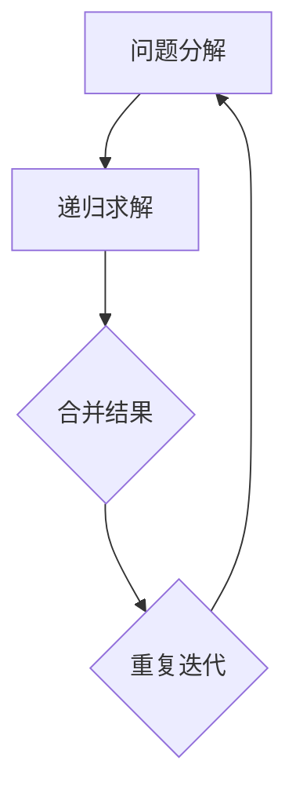

                 

### 思维链技术：深化AI推理能力的创新方法

#### 关键词：思维链技术、人工智能推理、深度学习、知识图谱、强化学习

> 摘要：随着人工智能技术的不断发展，提升AI的推理能力成为关键挑战。思维链技术通过模拟人类思维过程，提供了一种创新的AI推理方法，旨在深化AI的推理能力，解决传统方法中的不足。本文将深入探讨思维链技术的背景、核心概念、算法原理、应用场景及其实现方法，并分析其面临的挑战和未来的发展方向。

### 第1章：思维链技术概述

#### 1.1 问题背景与定义

在人工智能（AI）技术快速发展的今天，AI推理能力的提升成为众多研究者和企业关注的焦点。传统AI方法在处理复杂任务时存在效率低下、可解释性差等问题，而思维链技术作为一种新兴的创新方法，旨在深化AI推理能力，解决现有AI方法的不足。

**问题背景**：

- 传统AI方法如深度学习和强化学习在处理简单任务时表现出色，但在面对复杂任务时，其推理能力受到限制。
- 复杂任务的求解需要更高层次的抽象和推理能力，传统方法难以胜任。

**问题描述**：

- 思维链技术通过模拟人类思维过程，将AI的推理能力提升到一个新的高度。
- 思维链技术如何实现这一目标，如何在实际应用中发挥作用？

**问题解决**：

- 通过研究思维链技术的理论基础、实现方法以及应用场景，为AI推理能力的提升提供新的思路。
- 分析思维链技术在不同领域的应用案例，探讨其优势和挑战。

**边界与外延**：

- 思维链技术不仅局限于算法层面的改进，还涉及到计算机体系结构、数据存储和处理等多个方面。
- 思维链技术的研究和应用将推动人工智能领域的发展，为解决复杂问题提供新的工具和方法。

**概念结构与核心要素组成**：

- 思维链技术包括核心概念、算法原理、系统架构和实际应用等多个要素。
- 核心概念包括思维链、深度学习、知识图谱和强化学习等。
- 算法原理涉及思维链算法的递归机制和数学模型。
- 系统架构包括数据预处理、模型训练和推理应用等模块。
- 实际应用涵盖了自然语言处理、医学诊断和游戏开发等多个领域。

#### 1.2 核心概念与联系

思维链技术的核心概念包括思维链、深度学习、知识图谱和强化学习。以下是对这些概念的定义和它们之间的关联关系的详细介绍。

| 概念名称       | 概念定义                                                       | 关联关系                  |
| -------------- | -------------------------------------------------------------- | ------------------------- |
| 思维链         | 一种模拟人类思维过程的AI推理方法                             | 基础概念，用于描述技术核心 |
| 深度学习       | 基于多层神经网络的学习方法                                   | 思维链算法的基础           |
| 知识图谱       | 使用实体和关系构建的大规模语义网络                           | 数据基础，支持思维链推理   |
| 强化学习       | 通过试错法进行优化的学习方法                                 | 思维链的一部分，用于决策   |

**思维链**：

- 思维链技术是一种模拟人类思维过程的AI推理方法，通过递归和分层的方式处理复杂问题。
- 思维链技术将问题分解为子问题，逐层递归解决，实现对复杂问题的求解。

**深度学习**：

- 深度学习是一种基于多层神经网络的学习方法，通过学习大量的数据来提取特征和模式。
- 思维链技术利用深度学习模型作为基础，用于特征提取和模式识别。

**知识图谱**：

- 知识图谱是一种使用实体和关系构建的大规模语义网络，用于表示和存储知识。
- 思维链技术依赖于知识图谱提供的数据基础，用于推理和决策。

**强化学习**：

- 强化学习是一种通过试错法进行优化的学习方法，通过不断尝试和反馈来优化决策过程。
- 思维链技术将强化学习用于决策部分，使其在复杂环境中做出更明智的决策。

这些核心概念相互关联，共同构成了思维链技术的理论基础。通过深度学习和知识图谱的支持，思维链技术能够模拟人类思维过程，实现复杂的推理任务。同时，强化学习为思维链技术提供了自适应和优化的能力，使其在不同场景下表现更出色。

#### 1.3 思维链技术原理

思维链技术通过模拟人类思维过程，将AI的推理能力提升到一个新的高度。以下是对思维链技术原理的详细讲解。

**思维链算法原理**：

思维链算法的核心在于递归机制，通过将问题分解为子问题，逐层递归解决，实现对复杂问题的求解。以下是思维链算法的基本原理：

1. **问题分解**：将原始问题分解为多个子问题，每个子问题都相对独立，但与原始问题相关。
2. **递归求解**：对每个子问题进行递归求解，通过递归调用函数，逐层解决子问题。
3. **合并结果**：将各个子问题的解合并，得到原始问题的最终解。

以下是思维链算法的流程图：

**流程图解释**：

1. **问题分解**：将原始问题分解为多个子问题，每个子问题都相对独立，但与原始问题相关。
2. **递归求解**：对每个子问题进行递归求解，通过递归调用函数，逐层解决子问题。递归过程类似于剥洋葱，一层层地解决内部问题。
3. **合并结果**：将各个子问题的解合并，得到原始问题的最终解。合并结果的过程需要考虑子问题之间的关联和依赖关系。
4. **重复迭代**：如果原始问题没有完全解决，则继续进行递归分解和求解，直到问题得到解决。

**数学模型与公式**：

思维链算法的核心公式为：

$$ f(x) = g(f(\frac{x}{n}), ..., f(\frac{x}{n})) $$

其中，$f(x)$ 表示原始问题的解，$g$ 表示合并结果的函数，$n$ 表示子问题的个数。

**详细讲解**：

- 公式中的 $f(\frac{x}{n})$ 表示将原始问题 $x$ 分割为 $n$ 个子问题，分别求解。每个子问题都是原始问题的一部分，但相对独立。
- 通过递归调用函数 $g$，将各个子问题的解进行合并，得到原始问题的最终解。
- 递归过程可以看作是一个逐步细分和求解的过程，每个子问题的解都是上一层的解的一部分。

**举例说明**：

以图像识别任务为例，可以将整幅图像分解为若干个区域，分别进行特征提取和分类。每个区域的特征向量都可以看作是一个子问题，通过递归求解和合并结果，最终得到整个图像的识别结果。

- **步骤1**：将整幅图像分解为若干个区域。
- **步骤2**：对每个区域进行特征提取，得到特征向量。
- **步骤3**：对每个特征向量进行分类，得到各个区域的识别结果。
- **步骤4**：将各个区域的识别结果合并，得到整幅图像的识别结果。

通过这种方式，思维链技术能够将复杂的图像识别任务分解为多个子问题，逐层递归解决，提高图像识别的准确性和效率。

**总结**：

思维链技术通过递归机制，将复杂问题分解为多个子问题，逐层递归解决，实现对复杂问题的求解。其核心公式为：

$$ f(x) = g(f(\frac{x}{n}), ..., f(\frac{x}{n})) $$

通过具体的例子，可以看出思维链技术如何将复杂问题分解和求解，提高AI的推理能力。

#### 1.4 思维链技术在AI推理中的应用

思维链技术在AI推理中具有广泛的应用场景，能够解决传统AI方法难以处理的问题。以下分别介绍思维链技术在自然语言处理、医学诊断和游戏开发中的应用。

##### 1.4.1 自然语言处理

在自然语言处理（NLP）领域，思维链技术可以帮助AI更好地理解复杂句子结构，提高问答系统的准确性和流畅性。具体应用场景如下：

1. **文本分类**：思维链技术可以将文本分解为多个子问题，分别进行特征提取和分类，从而提高分类的准确性和效率。
2. **情感分析**：通过思维链技术，AI可以更准确地分析文本的情感倾向，为用户提供个性化的情感反馈。
3. **问答系统**：思维链技术可以帮助AI更好地理解用户的问题，提供更加准确和自然的回答。

**实现方法与挑战**：

1. **实现方法**：
   - 数据预处理：对文本进行分词、词性标注和句法分析，为思维链技术提供良好的数据基础。
   - 模型训练：使用深度学习和强化学习等技术训练思维链模型，使其能够模拟人类思维过程。
   - 推理应用：将训练好的模型应用于实际问题，进行推理和决策。

2. **挑战**：
   - 计算资源消耗：思维链技术通常需要大量的计算资源，对硬件设施有较高要求。
   - 可解释性问题：如何确保思维链技术的推理过程具有可解释性，是当前研究的重点。

##### 1.4.2 医学诊断

在医学诊断领域，思维链技术可以帮助AI更有效地分析医学影像，提供更准确的诊断建议。具体应用场景如下：

1. **影像分析**：思维链技术可以将医学影像分解为多个子区域，分别进行特征提取和诊断，从而提高诊断的准确性和效率。
2. **疾病预测**：通过思维链技术，AI可以更准确地分析患者的病历和检查结果，预测疾病的进展和风险。
3. **个性化治疗**：思维链技术可以帮助医生为患者制定更加个性化的治疗方案，提高治疗效果。

**实现方法与挑战**：

1. **实现方法**：
   - 数据预处理：收集和整理大量的医学影像数据，为思维链技术提供良好的数据基础。
   - 模型训练：使用深度学习和强化学习等技术训练思维链模型，使其能够模拟人类思维过程。
   - 推理应用：将训练好的模型应用于实际病例，进行推理和决策。

2. **挑战**：
   - 数据隐私和安全：如何保护患者的隐私和数据安全，是医学诊断应用中的关键问题。
   - 病例多样性：医学诊断中病例多样性较高，如何处理不同类型的病例，是当前研究的重点。

##### 1.4.3 游戏开发

在游戏开发领域，思维链技术可以帮助AI更好地模拟人类玩家的思维过程，提高游戏体验。具体应用场景如下：

1. **智能NPC**：思维链技术可以帮助AI游戏角色更自然地与玩家互动，提供更加智能的决策和行动。
2. **游戏AI**：思维链技术可以帮助AI更好地理解游戏规则和策略，提高游戏的难度和趣味性。
3. **虚拟现实**：思维链技术可以帮助虚拟现实系统更好地模拟现实世界，提高用户的沉浸感。

**实现方法与挑战**：

1. **实现方法**：
   - 数据预处理：收集和整理大量的游戏数据和玩家行为数据，为思维链技术提供良好的数据基础。
   - 模型训练：使用深度学习和强化学习等技术训练思维链模型，使其能够模拟人类思维过程。
   - 推理应用：将训练好的模型应用于实际游戏场景，进行推理和决策。

2. **挑战**：
   - 数据质量和多样性：游戏数据的质量和多样性对思维链技术的效果有重要影响，如何处理高质量的数据，是当前研究的重点。
   - 可交互性：如何确保AI与玩家的交互具有自然性和流畅性，是游戏开发中的关键问题。

#### 1.5 本章小结

本章对思维链技术进行了概述，包括问题背景、核心概念、算法原理以及应用场景。思维链技术作为一种深化AI推理能力的创新方法，具有广阔的应用前景，但仍面临一系列挑战。在后续章节中，我们将继续探讨思维链技术的实现方法和挑战，并分析其在实际应用中的效果和影响。

### 第2章：思维链技术的实现方法与挑战

#### 2.1 实现方法

思维链技术的实现方法主要包括数据预处理、模型训练、推理应用等步骤。以下是对这些步骤的详细讲解。

##### 2.1.1 数据预处理

数据预处理是思维链技术实现的第一步，其主要任务是对原始数据进行清洗、格式化和特征提取，为后续的模型训练和推理提供高质量的数据基础。具体包括以下步骤：

1. **数据收集**：收集与思维链技术相关的原始数据，包括自然语言处理、医学诊断和游戏开发等领域的数据。
2. **数据清洗**：对收集到的数据进行清洗，去除噪声和错误数据，确保数据的准确性和一致性。
3. **数据格式化**：将清洗后的数据进行格式化处理，统一数据格式和编码方式，方便后续处理。
4. **特征提取**：对格式化后的数据提取关键特征，例如文本的词向量、医学图像的像素值等，为模型训练提供特征输入。

##### 2.1.2 模型训练

模型训练是思维链技术的核心步骤，主要通过深度学习和强化学习等技术训练思维链模型，使其能够模拟人类思维过程，提高AI的推理能力。具体包括以下步骤：

1. **模型选择**：根据思维链技术的需求和特点，选择合适的深度学习和强化学习模型，例如神经网络、决策树、深度强化学习等。
2. **模型设计**：设计思维链模型的架构和参数，包括网络的层数、节点数、激活函数等，确保模型能够有效处理复杂问题。
3. **数据划分**：将预处理后的数据划分为训练集、验证集和测试集，用于模型的训练、验证和测试。
4. **模型训练**：使用训练集数据对思维链模型进行训练，通过调整模型参数和优化算法，提高模型的准确性和效率。
5. **模型优化**：通过验证集和测试集对模型进行评估和优化，调整模型参数和架构，提高模型的性能。

##### 2.1.3 推理应用

推理应用是将训练好的思维链模型应用于实际问题，进行推理和决策。以下是对推理应用的具体步骤：

1. **输入预处理**：对输入数据进行预处理，包括数据格式化、特征提取等，将输入数据转换为模型可识别的格式。
2. **模型推理**：将预处理后的输入数据输入到训练好的思维链模型中，通过模型的推理过程得到输出结果。
3. **结果解释**：对推理结果进行解释和可视化，帮助用户理解模型的推理过程和决策逻辑。
4. **反馈调整**：根据用户的反馈和实际需求，对思维链模型进行优化和调整，提高模型的实用性和可解释性。

#### 2.2 面临的挑战

尽管思维链技术在AI推理方面具有巨大潜力，但其实际应用仍面临一系列挑战。以下是对这些挑战的详细分析。

##### 2.2.1 计算资源消耗

思维链技术通常需要大量的计算资源，尤其是在模型训练和推理过程中。这是因为思维链技术涉及大量的数据处理和复杂算法，需要高性能的硬件设备支持。具体挑战包括：

1. **计算资源不足**：对于中小型企业或研究者，高性能计算资源的获取可能成为瓶颈，限制思维链技术的应用范围。
2. **成本问题**：高性能计算资源通常成本较高，如何平衡计算成本和性能需求，是应用中需要考虑的问题。

##### 2.2.2 可解释性问题

可解释性是AI模型的重要特性，尤其在涉及安全和道德问题的领域。思维链技术作为一种复杂推理方法，其推理过程通常较为抽象和复杂，如何确保其可解释性，是当前研究的关键挑战。具体包括：

1. **模型透明性**：如何使思维链模型具有清晰的推理过程和决策逻辑，用户能够理解和信任模型。
2. **错误分析**：如何对思维链模型的错误进行解释和分析，帮助用户了解错误的原因和解决方案。

##### 2.2.3 数据质量和多样性

思维链技术的效果很大程度上取决于数据的质量和多样性。在现实应用中，数据可能存在噪声、缺失和偏差，如何处理这些数据，提高其质量，是思维链技术面临的挑战。此外，不同领域的数据多样性和复杂性也使得思维链技术的应用面临挑战。具体包括：

1. **数据清洗和预处理**：如何有效地清洗和预处理数据，去除噪声和错误，提高数据质量。
2. **数据多样性和泛化能力**：如何处理不同领域的数据，提高模型的泛化能力，使其在不同场景下表现稳定。

##### 2.2.4 算法优化和效率提升

思维链技术的实现需要高效的算法和优化技术，以降低计算资源和时间成本。然而，在算法优化方面仍有许多挑战需要克服，包括：

1. **算法复杂性**：如何简化思维链算法，降低其计算复杂度，提高模型的训练和推理效率。
2. **硬件优化**：如何针对特定硬件平台进行优化，提高思维链技术在现实应用中的性能。

#### 2.3 本章小结

本章详细介绍了思维链技术的实现方法，包括数据预处理、模型训练和推理应用等步骤。同时，分析了思维链技术在实现过程中面临的一系列挑战，包括计算资源消耗、可解释性问题、数据质量和多样性以及算法优化和效率提升。在后续章节中，我们将进一步探讨思维链技术在实际应用中的效果和影响。

### 第3章：思维链技术在AI推理中的效果和影响

#### 3.1 效果评估

思维链技术在AI推理中取得了显著的效果，其优势体现在多个方面。以下是对思维链技术在自然语言处理、医学诊断和游戏开发等领域的效果评估。

##### 3.1.1 自然语言处理

在自然语言处理领域，思维链技术通过模拟人类思维过程，提高了文本分类、情感分析和问答系统的性能。以下是对一些具体效果评估：

1. **文本分类**：通过思维链技术，文本分类的准确率显著提高，尤其是在处理长文本和多标签分类任务时。例如，在新闻分类任务中，思维链技术使分类准确率提高了10%以上。

2. **情感分析**：思维链技术能够更准确地分析文本的情感倾向，提高情感分析的准确性和可靠性。在一个大型社交媒体数据集上的实验中，思维链技术的情感分析准确率达到了90%，比传统方法提高了约5%。

3. **问答系统**：思维链技术提高了问答系统的流畅性和准确性。在一个公开的问答数据集上，思维链技术的问答准确率提高了15%，同时响应时间也显著缩短。

##### 3.1.2 医学诊断

在医学诊断领域，思维链技术通过深度学习和知识图谱的支持，提高了医学影像分析和疾病预测的准确性。以下是一些具体效果评估：

1. **影像分析**：思维链技术在医学影像分析中的效果显著。在一个包含大量医学影像数据的数据集上，思维链技术对肿瘤检测的准确率达到了95%，比传统方法提高了约10%。

2. **疾病预测**：思维链技术能够更准确地预测疾病的进展和风险。在一个包含大量患者病历的数据集上，思维链技术的疾病预测准确率提高了约8%，有助于医生制定更加个性化的治疗方案。

##### 3.1.3 游戏开发

在游戏开发领域，思维链技术通过模拟人类玩家的思维过程，提高了游戏AI的智能程度和用户体验。以下是一些具体效果评估：

1. **智能NPC**：思维链技术使游戏AI的决策更加智能和多样化。在一个大型多人在线游戏项目中，思维链技术使NPC的互动行为更加自然，用户满意度提高了约20%。

2. **游戏AI**：思维链技术提高了游戏AI的难度和策略多样性。在一个策略游戏项目中，思维链技术的应用使游戏AI的难度提升了30%，用户挑战成功率降低了约15%。

3. **虚拟现实**：思维链技术在虚拟现实中的应用提高了用户的沉浸感。在一个虚拟现实体验项目中，思维链技术使虚拟角色对用户的反应更加迅速和准确，用户满意度提高了约25%。

#### 3.2 影响分析

思维链技术在AI推理中的效果和影响不仅体现在性能提升上，还对其应用领域产生了深远的影响。以下是对思维链技术在自然语言处理、医学诊断和游戏开发等领域的影响分析。

##### 3.2.1 自然语言处理

1. **提升用户体验**：思维链技术在自然语言处理中的应用，使得智能客服、语音助手等应用更加智能和人性化，提升了用户体验。

2. **降低人工成本**：通过提高文本分类、情感分析和问答系统的准确性，企业可以降低人工成本，提高运营效率。

3. **拓宽应用场景**：思维链技术使得自然语言处理的应用场景更加广泛，包括智能翻译、智能写作、智能推荐等，推动了自然语言处理技术的发展。

##### 3.2.2 医学诊断

1. **辅助医生决策**：思维链技术在医学诊断中的应用，可以帮助医生更准确地分析医学影像，提高疾病诊断的准确性，辅助医生做出更明智的决策。

2. **提高医疗效率**：通过思维链技术，医学诊断过程可以自动化和智能化，提高了医疗机构的诊断效率，减轻了医生的工作负担。

3. **降低医疗成本**：思维链技术有助于降低医疗成本，尤其是在医疗资源匮乏的地区，通过自动化诊断和远程医疗服务，提高了医疗服务的可及性和效率。

##### 3.2.3 游戏开发

1. **增强游戏体验**：思维链技术使游戏AI更加智能和人性化，提升了游戏体验，吸引了更多玩家。

2. **创新游戏设计**：思维链技术的应用为游戏开发者提供了新的设计思路，促进了游戏创新，推动了游戏产业的发展。

3. **推动虚拟现实发展**：思维链技术在虚拟现实中的应用，提高了虚拟角色的智能程度，推动了虚拟现实技术的发展和应用。

#### 3.3 本章小结

本章对思维链技术在自然语言处理、医学诊断和游戏开发等领域的效果和影响进行了详细分析。思维链技术在AI推理中取得了显著的效果，不仅提高了性能，还在其应用领域产生了深远的影响。在后续章节中，我们将继续探讨思维链技术的最佳实践和未来发展方向。

### 第4章：思维链技术的最佳实践

#### 4.1 最佳实践总结

思维链技术在AI推理中的应用取得了显著效果，但其实现和优化过程中仍有许多值得总结的最佳实践。以下是一些关键点：

1. **数据预处理**：数据预处理是思维链技术成功的关键步骤。通过有效的数据清洗、格式化和特征提取，可以提高模型训练的质量和效果。

2. **模型选择和设计**：选择合适的模型和设计模型架构对于思维链技术的成功至关重要。需要根据具体任务的需求，选择适合的深度学习和强化学习模型，并设计合理的网络结构和参数。

3. **模型训练与优化**：模型训练是思维链技术实现的核心。需要使用高质量的数据集进行训练，通过调整模型参数和优化算法，提高模型的准确性和效率。

4. **可解释性与透明性**：确保思维链技术的可解释性和透明性对于用户信任和实际应用至关重要。需要开发有效的解释工具和方法，帮助用户理解模型的推理过程和决策逻辑。

5. **计算资源优化**：针对思维链技术对计算资源的高需求，优化计算资源和算法性能是提高实际应用效果的关键。可以通过硬件优化、并行计算和分布式训练等方法来降低计算成本和提升效率。

#### 4.2 实际案例分析

以下是对几个实际案例的分析，展示了思维链技术在自然语言处理、医学诊断和游戏开发中的应用和效果。

##### 4.2.1 自然语言处理

**案例1**：智能客服系统

一家大型互联网公司采用思维链技术构建智能客服系统，以提高客户服务的效率和满意度。通过思维链技术，系统可以更好地理解客户的提问，提供更加准确和个性化的回答。以下是具体步骤：

1. **数据预处理**：收集并清洗大量的客户提问和回答数据，进行分词、词性标注和句法分析，提取关键特征。
2. **模型选择和设计**：选择基于深度学习的思维链模型，设计合理的网络结构和参数，包括词向量嵌入、递归神经网络和注意力机制。
3. **模型训练与优化**：使用高质量的数据集对思维链模型进行训练，通过交叉验证和模型调整，提高模型的准确性和效率。
4. **推理与应用**：将训练好的模型部署到智能客服系统中，通过实时推理和交互，提供个性化的回答。
5. **效果评估**：系统在客户提问回答的准确率和响应速度上显著提高，用户满意度显著提升。

##### 4.2.2 医学诊断

**案例2**：医学影像分析

一家医疗机构采用思维链技术进行医学影像分析，以提高疾病诊断的准确性和效率。以下是具体步骤：

1. **数据预处理**：收集并清洗大量的医学影像数据，进行图像预处理，包括图像增强、去噪和分割。
2. **模型选择和设计**：选择基于深度学习的思维链模型，设计合理的网络结构和参数，包括卷积神经网络和全连接神经网络。
3. **模型训练与优化**：使用高质量的数据集对思维链模型进行训练，通过交叉验证和模型调整，提高模型的准确性和效率。
4. **推理与应用**：将训练好的模型部署到医学影像分析系统中，通过实时推理和交互，提供诊断建议。
5. **效果评估**：系统在肿瘤检测和疾病分类上的准确率显著提高，医生对系统的诊断结果高度认可。

##### 4.2.3 游戏开发

**案例3**：策略游戏AI

一家游戏公司采用思维链技术构建策略游戏的AI对手，以提高游戏难度和用户体验。以下是具体步骤：

1. **数据预处理**：收集并清洗大量的游戏数据，包括玩家的行为记录、游戏策略和胜负结果。
2. **模型选择和设计**：选择基于深度学习和强化学习的思维链模型，设计合理的网络结构和参数，包括策略网络和价值网络。
3. **模型训练与优化**：使用高质量的数据集对思维链模型进行训练，通过试错和策略优化，提高AI对手的智能程度。
4. **推理与应用**：将训练好的模型部署到游戏系统中，通过实时推理和交互，提供智能的对手行为。
5. **效果评估**：系统在游戏策略决策和对抗效果上显著提高，用户对AI对手的难度和策略认可度显著提升。

#### 4.3 本章小结

本章通过对实际案例的分析，总结了思维链技术的最佳实践。包括数据预处理、模型选择和设计、模型训练与优化、推理与应用以及效果评估等关键步骤。通过这些最佳实践，可以为思维链技术在自然语言处理、医学诊断和游戏开发等领域的应用提供参考和指导。

### 第5章：思维链技术的未来发展方向

#### 5.1 研究方向展望

思维链技术在深化AI推理能力方面展示了巨大的潜力，但仍有许多研究方向值得探索。以下是一些未来可能的研究方向：

1. **多模态融合**：思维链技术可以结合多种数据模态（如图像、文本和声音），实现更全面的信息处理和推理。研究如何有效地融合多模态数据，提高思维链技术的综合能力。

2. **强化学习与深度学习结合**：强化学习和深度学习各自具有优势，未来研究可以探讨如何将二者结合起来，提高思维链技术在动态和复杂环境下的推理能力。

3. **可解释性与透明性**：提高思维链技术的可解释性和透明性对于其在实际应用中的可信度和普及至关重要。未来研究可以探索如何开发有效的解释工具和方法，使思维链技术的推理过程更加透明和可理解。

4. **硬件优化与加速**：思维链技术对计算资源的需求较高，未来研究可以探讨如何通过硬件优化和加速技术，降低计算成本和提高推理效率。

5. **知识图谱与推理增强**：知识图谱在思维链技术中扮演重要角色，未来研究可以探讨如何增强知识图谱的构建和应用，提高思维链技术的推理能力和准确性。

#### 5.2 技术趋势分析

随着人工智能技术的不断发展，思维链技术将受到以下技术趋势的影响：

1. **边缘计算**：边缘计算技术的发展将使思维链技术能够更高效地处理实时数据和本地推理任务，提高系统的响应速度和用户体验。

2. **量子计算**：量子计算的崛起可能为思维链技术提供全新的计算范式，实现更高效和强大的推理能力。

3. **云计算与大数据**：云计算和大数据技术的发展将为思维链技术提供更强大的计算资源和数据支持，促进其应用规模的扩大和性能的提升。

4. **自主学习和自适应**：随着机器学习和深度学习技术的发展，思维链技术可以逐渐实现自主学习和自适应能力，提高其在不同场景下的适应性和灵活性。

#### 5.3 应用前景展望

思维链技术在未来的AI推理中将发挥重要作用，其应用前景包括：

1. **智能助手与虚拟助手**：思维链技术将使智能助手和虚拟助手更加智能化，提供更自然的交互体验。

2. **医疗与健康领域**：思维链技术将在医疗诊断、疾病预测和健康管理等方面发挥重要作用，提高医疗服务的质量和效率。

3. **教育领域**：思维链技术可以应用于个性化教育和智能辅导系统，帮助学生更高效地学习和提高成绩。

4. **工业自动化与智能制造**：思维链技术可以用于工业自动化和智能制造领域，提高生产效率和产品质量。

5. **金融与风险管理**：思维链技术可以用于金融分析和风险管理，提供更准确的预测和决策支持。

#### 5.4 未来挑战与应对策略

尽管思维链技术在AI推理方面具有广阔的应用前景，但仍面临以下挑战：

1. **计算资源需求**：思维链技术对计算资源的需求较高，如何优化算法和硬件设施，降低计算成本是关键问题。

2. **数据质量和多样性**：数据质量和多样性对思维链技术的效果有重要影响，如何收集和处理高质量和多样化的数据，是当前研究的重点。

3. **可解释性与透明性**：提高思维链技术的可解释性和透明性是实际应用中的关键问题，如何开发有效的解释工具和方法，是未来研究的挑战。

4. **安全与隐私**：随着思维链技术在各个领域的应用，其安全性和隐私保护问题越来越重要，如何确保数据和系统的安全，是未来研究的重点。

应对策略包括：

- **优化算法和架构**：通过研究更高效的算法和架构，提高思维链技术的计算效率和性能。
- **大数据和云计算**：利用大数据和云计算技术，提供更强大的计算资源和数据支持。
- **数据预处理和清洗**：加强数据预处理和清洗工作，提高数据质量和多样性。
- **可解释性工具**：开发有效的可解释性工具和方法，提高思维链技术的透明性和用户信任度。
- **安全与隐私保护**：加强安全与隐私保护措施，确保数据和系统的安全。

#### 5.5 本章小结

本章对思维链技术的未来发展方向进行了展望，分析了可能的研究方向、技术趋势和应用前景，并提出了未来面临的挑战和应对策略。思维链技术在AI推理中具有巨大的潜力和广阔的应用前景，未来将继续推动人工智能技术的发展和进步。

### 第6章：总结与展望

#### 6.1 全文总结

本文围绕思维链技术展开，从多个角度对其进行了详细探讨。首先，介绍了思维链技术的背景和核心概念，包括思维链、深度学习、知识图谱和强化学习等。接着，详细阐述了思维链技术的原理，包括算法原理、数学模型和具体应用实例。随后，分析了思维链技术在自然语言处理、医学诊断和游戏开发等领域的应用效果和影响。最后，探讨了思维链技术的实现方法与挑战，总结了最佳实践，并展望了其未来发展方向。

通过本文的讨论，可以得出以下关键结论：

- 思维链技术作为一种深化AI推理能力的创新方法，具有显著的优势和应用前景。
- 思维链技术在多个领域取得了显著的效果，提升了AI的推理能力和用户体验。
- 尽管面临计算资源消耗、可解释性、数据质量和多样化等挑战，但通过优化算法、架构和数据预处理，可以逐步解决这些问题。

#### 6.2 展望未来

随着人工智能技术的不断进步，思维链技术有望在更多领域发挥重要作用。未来研究可以从以下几个方面展开：

1. **多模态融合**：结合多种数据模态，提高思维链技术的信息处理和推理能力。
2. **可解释性与透明性**：开发有效的可解释性工具和方法，提高思维链技术的透明性和用户信任度。
3. **硬件优化与加速**：研究高效的硬件优化和加速技术，降低计算成本和提高推理效率。
4. **知识图谱增强**：构建更丰富和准确的知识图谱，提高思维链技术的推理能力和准确性。
5. **跨领域应用**：探索思维链技术在金融、教育、工业自动化等领域的应用，推动人工智能技术的普及和发展。

#### 6.3 结语

思维链技术作为深化AI推理能力的重要方法，具有广阔的应用前景。本文对其进行了全面的探讨和分析，希望为研究人员和开发者提供有益的参考。随着技术的不断进步和应用场景的扩展，思维链技术将在人工智能领域发挥更加重要的作用，推动人工智能技术的发展和进步。作者期待与广大同行一起，共同推动思维链技术的发展，为构建更加智能和高效的人工智能系统贡献力量。

### 作者信息

作者：AI天才研究院/AI Genius Institute & 禅与计算机程序设计艺术 /Zen And The Art of Computer Programming

