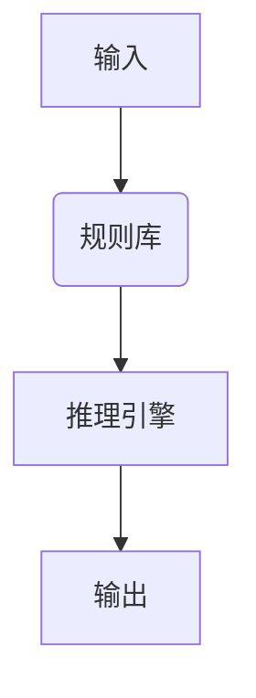
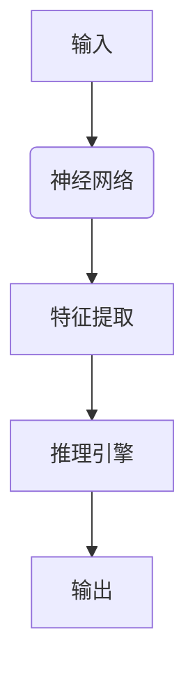
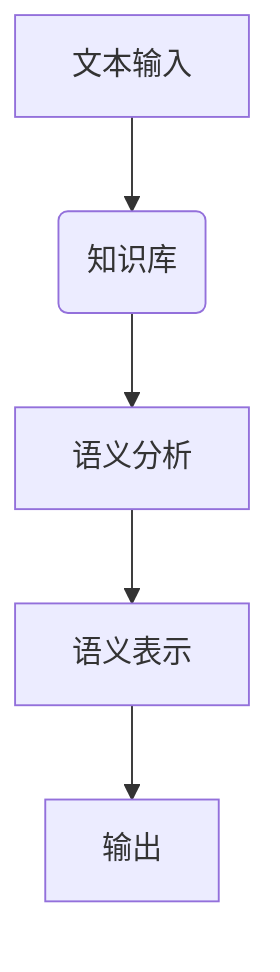
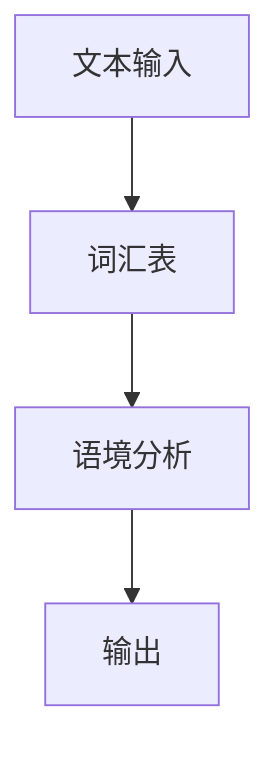
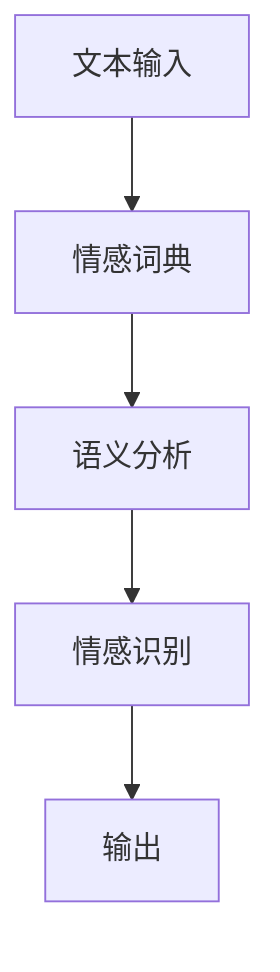
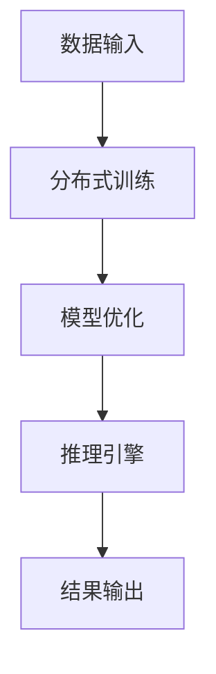
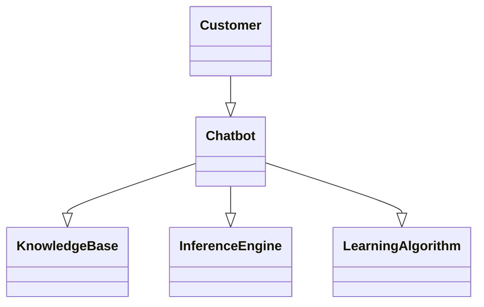
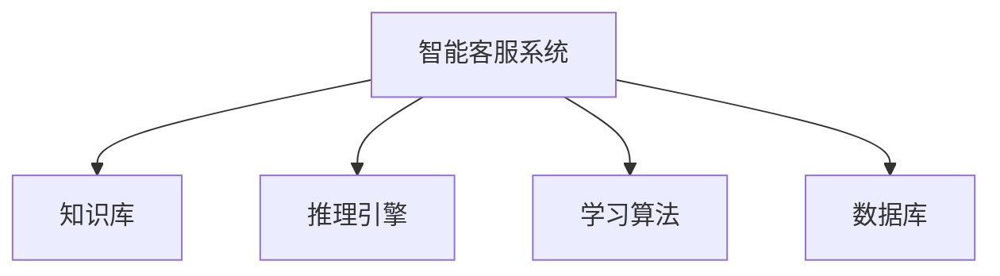
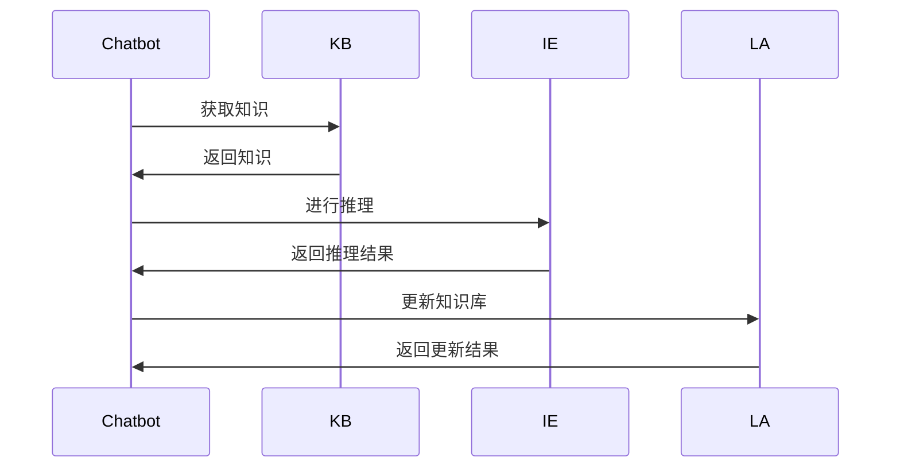
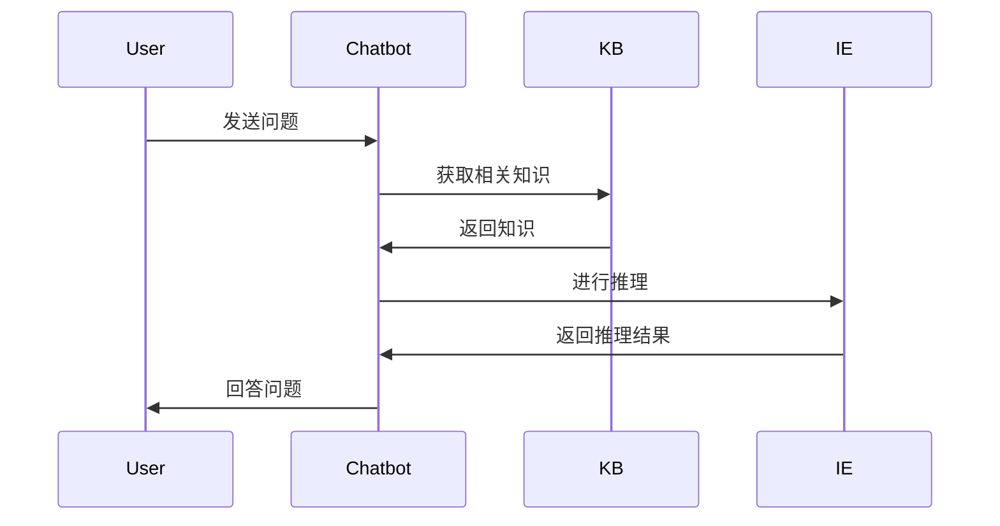

                 

### 思维链技术：让AI像人类一样思考

关键词：思维链技术、人工智能、语义理解、推理引擎、优化策略

摘要：随着人工智能技术的发展，AI在图像识别、自然语言处理等领域取得了显著成果。然而，在处理复杂问题和进行决策方面，AI仍面临诸多挑战。本文将介绍一种新兴的技术——思维链技术，探讨其如何模拟人类思考方式，提升AI的智能水平。

### 目录大纲设计

#### 第一部分：思维链技术基础

- **第1章：思维链技术概述**
  - **1.1 问题背景**
  - **1.2 核心概念与联系**
  - **1.3 主流思维链技术介绍**

- **第2章：思维链技术在AI中的应用**
  - **2.1 自然语言处理概述**
  - **2.2 思维链在NLP中的核心应用**

- **第3章：思维链技术的优化策略**
  - **3.1 优化目标**
  - **3.2 优化方法**

- **第4章：思维链技术的项目实战**
  - **4.1 企业背景**
  - **4.2 系统功能设计**
  - **4.3 系统核心实现**
  - **4.4 项目小结**

#### 第二部分：思维链技术在AI中的应用

#### 第1章：思维链技术概述

##### 1.1 问题背景

人工智能技术在图像识别、语音识别等领域取得了显著的成就，但在处理复杂问题和进行决策方面仍存在局限性。这是因为传统的机器学习模型（如深度学习）主要依赖于大量数据训练，缺乏对问题背景和领域知识的深入理解。而思维链技术旨在模拟人类的思考方式，通过引入知识表示、推理引擎等机制，使AI能够更好地理解和处理复杂问题。

##### 1.2 核心概念与联系

思维链技术的核心原理是模拟人类的思考过程，将知识表示、推理引擎、学习算法等关键组件有机结合，形成一个智能推理系统。以下是一个思维链技术的核心概念联系表格：

| 概念 | 描述 | 联系 |
| --- | --- | --- |
| 知识表示 | 用于表示领域知识和事实的信息结构 | 是思维链的基础，为推理提供前提条件 |
| 推理引擎 | 执行推理过程的组件 | 利用知识表示进行逻辑推理，生成结论 |
| 学习算法 | 用于从数据中学习新知识和模式的算法 | 提高思维链的泛化能力和适应性 |

以下是一个ER实体关系图架构的Mermaid流程图，展示了思维链技术的核心组件及其关系：

```mermaid
erDiagram
  User ||--|{ KnowledgeBase }|---> Customer
  User ||--|{ InferenceEngine }|---> Customer
  User ||--|{ LearningAlgorithm }|---> Customer
```

#### 1.3 主流思维链技术介绍

目前，主流的思维链技术主要分为基于规则的系统和神经网络驱动的系统。

**基于规则的系统**：
这种系统通过定义一系列规则，用于描述领域知识和推理逻辑。规则通常以“如果...那么...”的形式表示，例如：“如果天气炎热，那么建议穿短袖。”这种系统的优势在于规则清晰、易于理解和调试，但缺点是规则数量庞大时，推理效率会降低。

**神经网络驱动的系统**：
这种系统利用神经网络进行知识表示和推理。神经网络通过学习大量数据，自动提取特征和模式，形成知识表示。推理过程则通过神经网络的前向传播和反向传播实现。这种系统的优势在于能够处理大规模数据和复杂问题，但需要大量训练数据和计算资源。

以下是一个基于规则的系统的Mermaid流程图：



以下是一个神经网络驱动的系统的Mermaid流程图：



#### 第2章：思维链技术在自然语言处理中的应用

##### 2.1 自然语言处理概述

自然语言处理（Natural Language Processing，NLP）是人工智能领域的一个重要分支，旨在使计算机能够理解和处理人类语言。NLP在机器翻译、情感分析、智能客服等领域具有广泛应用。

##### 2.2 思维链在NLP中的核心应用

思维链技术在NLP中的核心应用包括语义理解、语境识别和情感分析。

**语义理解**：
语义理解是NLP的关键任务之一，旨在理解文本中的语义内容。思维链技术通过知识表示和推理引擎，对文本进行深入分析，提取语义信息。以下是一个语义理解的Mermaid流程图：



**语境识别**：
语境识别是理解文本中特定词汇的含义和上下文的过程。思维链技术通过推理引擎，分析文本中的语境信息，提高对话系统的准确性。以下是一个语境识别的Mermaid流程图：



**情感分析**：
情感分析是识别文本中表达的情感倾向的过程。思维链技术通过语义理解和语境识别，对文本进行情感分析，识别用户的情绪状态。以下是一个情感分析的Mermaid流程图：



#### 第3章：思维链技术的优化策略

##### 3.1 优化目标

思维链技术的优化目标主要包括以下几个方面：

- **提高推理效率**：优化推理过程，降低推理时间，以满足实时应用需求。
- **增强泛化能力**：提高思维链技术在不同场景下的适应能力，降低对特定领域知识的依赖。

##### 3.2 优化方法

**算法改进**：
通过改进现有算法，提高思维链技术的性能。例如，优化推理算法，减少冗余计算，提高推理速度。

**模型压缩**：
对思维链模型进行压缩，减少计算资源和存储需求。例如，使用量化、剪枝等技术，降低模型规模。

**分布式计算**：
利用分布式计算技术，提高思维链技术的处理能力。例如，使用多台服务器进行模型训练和推理，提高计算效率。

以下是一个分布式计算的Mermaid流程图：



#### 第4章：思维链技术的项目实战

##### 4.1 企业背景

某企业致力于提供智能客服解决方案，面临以下挑战：

- **客户咨询量大**：企业每天接收大量客户咨询，需要高效处理。
- **复杂问题解决**：部分客户问题涉及多个领域，需要综合分析。

为解决上述问题，企业决定采用思维链技术，构建一个智能客服系统。

##### 4.2 系统功能设计

**领域模型**：
使用Mermaid绘制领域模型类图，展示系统的主要功能模块：



**系统架构设计**：
使用Mermaid绘制系统架构图，展示系统组件及其相互关系：



**系统接口设计**：
设计系统的接口，确保各模块之间的高效通信：



**系统交互**：
使用Mermaid绘制系统交互序列图，展示用户与系统的交互流程：



##### 4.3 系统核心实现

**环境安装**：
描述所需的开发环境和工具，以及安装步骤。

**系统核心实现源代码**：
提供关键代码片段，展示思维链技术的具体实现。

**代码应用解读与分析**：
分析代码的实现逻辑，解释关键技术点。

**实际案例分析与详细讲解剖析**：
通过实际案例，展示思维链技术的应用效果。

##### 4.4 项目小结

- **总结与反思**：对项目进行总结，讨论项目的成功经验和改进方向。
- **注意事项与拓展阅读**：提供相关注意事项和拓展阅读资源，帮助读者深入了解思维链技术。

### 最佳实践 Tips

- 在设计思维链系统时，充分理解业务需求和场景，确保知识表示和推理机制的准确性。
- 选择合适的优化方法，提高推理效率和泛化能力。
- 定期更新知识库和学习算法，保持系统的适应性和准确性。

### 小结

思维链技术作为一种模拟人类思考方式的人工智能技术，具有广泛的应用前景。通过引入知识表示、推理引擎等机制，思维链技术能够使AI更好地理解和处理复杂问题。本文介绍了思维链技术的基础、应用、优化策略以及项目实战，为读者提供了全面的思维链技术概述。希望读者能够通过本文，对思维链技术有更深入的了解，并能够在实际项目中发挥其优势。

### 注意事项

- 在实际应用中，确保思维链技术的可靠性、稳定性和安全性。
- 注意数据隐私和安全问题，特别是在处理敏感数据时。
- 定期对系统进行性能评估和优化，以适应不断变化的应用场景。

### 拓展阅读

- 《深度学习：神经网络与深度学习原理及应用》
- 《人工智能：一种现代的方法》
- 《知识图谱：构建智能时代的知识网络》
- 《自然语言处理：实用方法》

### 作者

作者：AI天才研究院/AI Genius Institute & 禅与计算机程序设计艺术 /Zen And The Art of Computer Programming

