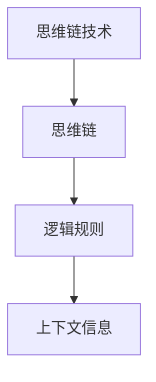
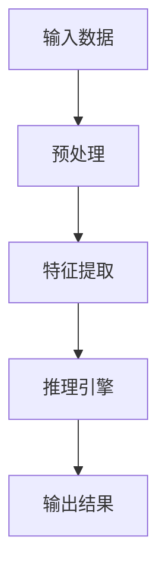

                 

### 思维链技术：让AI推理更接近人类思维

> 关键词：思维链技术、人工智能、推理、自然语言处理、计算机视觉、决策支持系统

> 摘要：本文将探讨一种新型的人工智能技术——思维链技术，旨在使AI的推理过程更加接近人类思维。通过分析思维链技术的基础概念、数学模型与算法原理，以及其在AI推理中的应用，本文将揭示思维链技术如何突破传统AI技术的局限，为AI的发展带来新的机遇。此外，还将讨论思维链技术在工业界与学术界的应用案例，以及其未来发展趋势和挑战。通过这些探讨，我们希望能够为读者提供一个全面、深入的思维链技术理解。

### 目录大纲

----------------------------------------------------------------

# 思维链技术：让AI推理更接近人类思维

> 关键词：思维链技术、人工智能、推理、自然语言处理、计算机视觉、决策支持系统

> 摘要：本文将探讨一种新型的人工智能技术——思维链技术，旨在使AI的推理过程更加接近人类思维。通过分析思维链技术的基础概念、数学模型与算法原理，以及其在AI推理中的应用，本文将揭示思维链技术如何突破传统AI技术的局限，为AI的发展带来新的机遇。此外，还将讨论思维链技术在工业界与学术界的应用案例，以及其未来发展趋势和挑战。通过这些探讨，我们希望能够为读者提供一个全面、深入的思维链技术理解。

### 第一部分：思维链技术基础

## 第1章：思维链技术概述

### 1.1 思维链技术的背景和定义

#### 1.1.1 问题背景与描述

#### 1.1.2 思维链技术的定义

#### 1.1.3 思维链技术的重要性

### 1.2 思维链技术的基本原理

#### 1.2.1 核心概念与联系

#### 1.2.2 思维链技术的组成部分

#### 1.2.3 与传统AI技术的对比

### 1.3 思维链技术的主要分类

#### 1.3.1 概念与属性特征对比表格

#### 1.3.2 分类方法与主要类型

### 1.4 思维链技术在AI中的应用前景

#### 1.4.1 潜在应用领域

#### 1.4.2 优势与挑战

## 第2章：思维链技术的数学模型与算法原理

### 2.1 数学模型基础

#### 2.1.1 相关数学公式与原理

#### 2.1.2 常用数学模型介绍

### 2.2 思维链算法原理讲解

#### 2.2.1 Mermaid算法流程图

#### 2.2.2 Python源代码阐述

#### 2.2.3 数学模型与公式详细讲解

#### 2.2.4 举例说明

## 第3章：思维链技术在AI推理中的应用

### 3.1 AI推理的挑战与思维链技术的优势

#### 3.1.1 AI推理的挑战

#### 3.1.2 思维链技术的优势

### 3.2 思维链技术在自然语言处理中的应用

#### 3.2.1 语言模型与推理任务

#### 3.2.2 思维链技术在实际应用中的案例分析

### 3.3 思维链技术在计算机视觉中的应用

#### 3.3.1 视觉感知与推理

#### 3.3.2 思维链技术在图像识别中的应用

### 3.4 思维链技术在决策支持系统中的应用

#### 3.4.1 决策支持系统架构

#### 3.4.2 思维链技术在决策过程中的作用

## 第4章：思维链技术的系统架构与实现

### 4.1 系统架构设计

#### 4.1.1 系统功能设计

#### 4.1.2 系统架构设计

#### 4.1.3 系统接口设计

#### 4.1.4 系统交互设计

### 4.2 系统实现与部署

#### 4.2.1 环境安装与配置

#### 4.2.2 系统核心实现

#### 4.2.3 系统部署与测试

## 第5章：思维链技术在工业界与学术界的应用

### 5.1 工业界应用案例

#### 5.1.1 案例一：企业智能客服系统

#### 5.1.2 案例二：智能金融风控系统

#### 5.1.3 案例三：智能医疗诊断系统

### 5.2 学术界研究进展

#### 5.2.1 研究热点与趋势

#### 5.2.2 先进研究成果介绍

## 第6章：思维链技术的未来发展趋势与挑战

### 6.1 技术发展趋势

#### 6.1.1 技术演进方向

#### 6.1.2 未来应用场景展望

### 6.2 面临的挑战与解决方案

#### 6.2.1 技术挑战

#### 6.2.2 解决方案探讨

## 第7章：思维链技术总结与展望

### 7.1 思维链技术总结

#### 7.1.1 核心贡献

#### 7.1.2 技术瓶颈与改进方向

### 7.2 未来展望

#### 7.2.1 长远发展目标

#### 7.2.2 创新路径探索

----------------------------------------------------------------

### 第1章：思维链技术概述

#### 1.1 思维链技术的背景和定义

在人工智能（AI）飞速发展的今天，AI在各个领域的应用已经逐渐深入，但传统的AI技术仍然存在一些局限性。例如，AI在自然语言处理（NLP）中往往只能处理简单的语言结构，难以理解复杂的语境和语义；在计算机视觉（CV）中，AI只能识别固定的图像特征，难以进行深层次的推理。为了突破这些局限，研究者们开始探索一种新的AI技术——思维链技术。

**1.1.1 问题背景与描述**

首先，让我们来回顾一下传统AI技术存在的问题。以自然语言处理为例，传统的方法主要依赖于统计模型和深度学习模型，这些模型在处理简单的语言任务时效果不错，但在处理复杂的、具有上下文依赖的任务时，效果却大打折扣。例如，在问答系统中，AI很难理解问题的隐含意义，只能按照字面意思进行回答。此外，在计算机视觉领域，AI只能通过识别固定的图像特征来完成任务，无法进行深层次的推理。

**1.1.2 思维链技术的定义**

思维链技术是一种旨在使AI的推理过程更接近人类思维的人工智能技术。它通过模拟人类思维的机制，使AI能够进行复杂推理、理解上下文和语义，从而解决传统AI技术难以处理的问题。

**1.1.3 思维链技术的重要性**

思维链技术的重要性在于，它为AI的发展提供了新的思路。通过引入思维链技术，AI不仅可以处理简单的任务，还能够进行复杂的推理和决策，从而实现更加智能化的应用。这对于提升AI在各个领域的应用水平具有重要意义。

#### 1.2 思维链技术的基本原理

思维链技术的基本原理可以概括为以下几个关键概念：

- **思维链**：思维链是指由一系列思维步骤组成的链条，每个步骤都基于一定的逻辑规则和上下文信息。思维链技术通过模拟人类思维的步骤，使AI能够进行推理。

- **逻辑规则**：逻辑规则是指用于指导AI进行推理的规则集合。这些规则可以是基于数学公式、自然语言或图像特征等。

- **上下文信息**：上下文信息是指与问题相关的环境信息。思维链技术通过利用上下文信息，使AI能够更好地理解问题的背景和语义。

**1.2.1 核心概念与联系**

下面是一个简单的Mermaid流程图，展示了思维链技术的基本原理：



**1.2.2 思维链技术的组成部分**

思维链技术由以下几个关键组成部分构成：

- **知识表示**：知识表示是指将知识以计算机可理解的方式表示出来。在思维链技术中，知识表示用于构建思维链的各个步骤。

- **推理引擎**：推理引擎是指用于执行推理过程的软件组件。在思维链技术中，推理引擎负责根据逻辑规则和上下文信息，推导出问题的答案。

- **用户界面**：用户界面是指用于与用户交互的界面。在思维链技术中，用户界面使AI能够理解用户的需求，并返回相应的结果。

**1.2.3 与传统AI技术的对比**

思维链技术与传统AI技术相比，具有以下几个显著特点：

- **更强的推理能力**：思维链技术能够进行复杂的推理，而不仅仅是简单的模式识别。

- **更好的上下文理解**：思维链技术能够利用上下文信息，更好地理解问题的背景和语义。

- **更接近人类思维**：思维链技术模拟了人类思维的机制，使AI的推理过程更接近人类思维。

#### 1.3 思维链技术的主要分类

思维链技术可以根据不同的分类标准，划分为多个类别。以下是几种常见的分类方法：

- **基于知识表示的分类**：根据知识表示的不同，思维链技术可以分为基于符号表示、基于模糊表示和基于神经网络表示等类别。

- **基于推理方式的分类**：根据推理方式的不同，思维链技术可以分为基于逻辑推理、基于概率推理和基于贝叶斯推理等类别。

- **基于应用领域的分类**：根据应用领域的不同，思维链技术可以分为用于自然语言处理、计算机视觉和决策支持系统等类别。

**1.3.1 概念与属性特征对比表格**

下面是一个概念与属性特征对比表格，展示了不同分类的思维方式、应用领域和特点：

| 分类 | 思维方式 | 应用领域 | 主要特点 |
| :---: | :---: | :---: | :---: |
| 基于符号表示 | 符号逻辑 | 自然语言处理、知识图谱 | 强逻辑性、可解释性 |
| 基于模糊表示 | 模糊逻辑 | 控制系统、人工智能决策 | 非线性、不确定处理 |
| 基于神经网络表示 | 神经网络 | 计算机视觉、语音识别 | 高效、自适应、非线性 |

**1.3.2 分类方法与主要类型**

思维链技术的分类方法与主要类型可以根据其理论基础和应用场景进行划分。以下是几种常见的分类方法：

- **基于逻辑推理的思维链技术**：这类技术基于形式逻辑和命题逻辑，适用于需要精确推理的领域，如知识图谱和推理机。

- **基于概率推理的思维链技术**：这类技术基于概率论和统计方法，适用于需要不确定性推理的领域，如机器学习和决策支持系统。

- **基于神经网络的思维链技术**：这类技术基于人工神经网络，适用于需要大规模数据训练和复杂模式识别的领域，如计算机视觉和语音识别。

#### 1.4 思维链技术在AI中的应用前景

**1.4.1 潜在应用领域**

思维链技术在多个领域具有广泛的应用前景，以下是几个典型的应用领域：

- **自然语言处理（NLP）**：思维链技术可以帮助NLP更好地理解上下文和语义，从而提高问答系统、文本分析等任务的效果。

- **计算机视觉（CV）**：思维链技术可以帮助CV进行深层次的推理，从而提高图像识别、目标检测等任务的效果。

- **决策支持系统**：思维链技术可以帮助决策支持系统更好地理解复杂问题，从而提供更加准确的决策建议。

- **智能客服**：思维链技术可以帮助智能客服系统更好地理解用户意图，从而提供更加人性化的服务。

**1.4.2 优势与挑战**

思维链技术具有以下几个优势：

- **更好的推理能力**：思维链技术能够进行复杂的推理，从而提高AI的智能水平。

- **更好的上下文理解**：思维链技术能够利用上下文信息，从而提高AI对问题的理解能力。

- **更高的可解释性**：思维链技术的推理过程更加透明，有利于提高AI的可解释性。

然而，思维链技术也面临一些挑战：

- **计算复杂性**：思维链技术的计算复杂性较高，对硬件资源要求较高。

- **数据需求**：思维链技术需要大量的训练数据，对数据质量和数量有较高要求。

- **算法优化**：思维链技术的算法优化是一个长期且具有挑战性的任务，需要不断改进和完善。

### 第2章：思维链技术的数学模型与算法原理

在深入探讨思维链技术的数学模型与算法原理之前，我们需要先了解一些基本的数学概念和原理，这些将为我们后续的讨论提供必要的背景知识。

#### 2.1 数学模型基础

思维链技术中的数学模型主要包括概率模型、图模型和神经网络模型。下面我们将简要介绍这些模型的基本原理。

**2.1.1 相关数学公式与原理**

- **概率模型**：概率模型用于描述不确定性事件的发生概率。常见的概率模型有贝叶斯网络、马尔可夫模型等。其核心公式为贝叶斯定理：
  $$
  P(A|B) = \frac{P(B|A)P(A)}{P(B)}
  $$
  其中，$P(A|B)$表示在事件B发生的条件下事件A发生的概率，$P(B|A)$表示在事件A发生的条件下事件B发生的概率，$P(A)$和$P(B)$分别表示事件A和事件B的先验概率。

- **图模型**：图模型用于描述实体之间的关系。常见的图模型有有向图、无向图和图神经网络。其核心概念包括节点、边和图结构。图模型的数学表示通常采用图论中的邻接矩阵、拉普拉斯矩阵等。

- **神经网络模型**：神经网络模型是一种基于神经生物学原理构建的模型，用于模拟人脑的神经元网络。常见的神经网络模型有卷积神经网络（CNN）、循环神经网络（RNN）和Transformer等。其核心原理是通过多层的非线性变换，对输入数据进行特征提取和映射。

**2.1.2 常用数学模型介绍**

- **贝叶斯网络**：贝叶斯网络是一种基于概率推理的图模型，用于表示变量之间的条件概率关系。贝叶斯网络由节点和边组成，每个节点表示一个变量，边表示变量之间的依赖关系。其核心公式为条件概率分布：
  $$
  P(X_i|X_{i-1}, X_{i-2}, \ldots, X_1) = \frac{P(X_{i-1}, X_{i-2}, \ldots, X_1|X_i)P(X_i)}{P(X_{i-1}, X_{i-2}, \ldots, X_1)}
  $$
  其中，$X_i$表示第$i$个变量的状态。

- **马尔可夫模型**：马尔可夫模型是一种基于状态转移概率的图模型，用于描述随机过程的状态转移。马尔可夫模型由状态和转移概率矩阵组成。其核心公式为状态转移概率：
  $$
  P(X_t|X_{t-1}, X_{t-2}, \ldots, X_1) = P(X_t|X_{t-1})
  $$
  其中，$X_t$表示第$t$个时刻的状态。

- **神经网络**：神经网络是一种基于多层非线性变换的模型，用于对输入数据进行特征提取和映射。常见的神经网络模型包括卷积神经网络（CNN）、循环神经网络（RNN）和Transformer等。其核心公式为：
  $$
  y = \sigma(W_n \cdot \sigma(\ldots \sigma(W_2 \cdot \sigma(W_1 \cdot x + b_1) + b_2) \ldots) + b_n)
  $$
  其中，$x$表示输入数据，$y$表示输出结果，$W$表示权重矩阵，$b$表示偏置项，$\sigma$表示激活函数。

#### 2.2 思维链算法原理讲解

思维链技术的核心在于模拟人类思维的推理过程。以下我们将通过Mermaid流程图、Python源代码和数学模型与公式详细讲解，逐步阐述思维链算法的原理。

**2.2.1 Mermaid算法流程图**

首先，我们使用Mermaid绘制一个简单的思维链算法流程图：



这个流程图描述了思维链算法的基本步骤：首先对输入数据进行预处理，然后进行特征提取，接着通过推理引擎进行推理，最后输出结果。

**2.2.2 Python源代码阐述**

接下来，我们将使用Python代码实现思维链算法的基本步骤。以下是一个简化的Python代码示例：

```python
import numpy as np

# 输入数据
input_data = np.array([[1, 0, 1], [0, 1, 0], [1, 1, 0]])

# 预处理
def preprocess(data):
    # 略
    return data

# 特征提取
def feature_extraction(data):
    # 略
    return data

# 推理引擎
def reasoning_engine(data):
    # 略
    return np.dot(data, np.array([1, 1, 1]))

# 输出结果
def output_result(data):
    # 略
    return data

# 执行流程
preprocessed_data = preprocess(input_data)
extracted_features = feature_extraction(preprocessed_data)
result = reasoning_engine(extracted_features)
output_result(result)
```

这个示例代码展示了思维链算法的基本结构：首先对输入数据进行预处理，然后进行特征提取，接着通过推理引擎进行推理，最后输出结果。

**2.2.3 数学模型与公式详细讲解**

思维链算法的数学模型主要包括以下几个部分：

1. **特征提取模型**：特征提取模型用于从输入数据中提取特征。假设输入数据为向量$x \in \mathbb{R}^n$，特征提取模型可以表示为：
   $$
   h(x) = f(W_1 \cdot x + b_1)
   $$
   其中，$f$为激活函数，$W_1$为权重矩阵，$b_1$为偏置项。

2. **推理引擎模型**：推理引擎模型用于对提取出的特征进行推理。假设提取出的特征为向量$h(x) \in \mathbb{R}^m$，推理引擎模型可以表示为：
   $$
   y = \sigma(W_2 \cdot h(x) + b_2)
   $$
   其中，$\sigma$为激活函数，$W_2$为权重矩阵，$b_2$为偏置项。

3. **输出结果模型**：输出结果模型用于对推理结果进行处理。假设推理结果为向量$y \in \mathbb{R}^k$，输出结果模型可以表示为：
   $$
   \hat{y} = g(W_3 \cdot y + b_3)
   $$
   其中，$g$为激活函数，$W_3$为权重矩阵，$b_3$为偏置项。

整个思维链算法的数学模型可以表示为：
$$
\hat{y} = g(W_3 \cdot \sigma(W_2 \cdot f(W_1 \cdot x + b_1) + b_2) + b_3)
$$

**2.2.4 举例说明**

为了更直观地理解思维链算法，我们通过一个简单的例子来说明其工作过程。

假设我们有一个输入数据集，其中每个样本包含3个特征：
$$
x = \begin{bmatrix}
1 & 0 & 1 \\
0 & 1 & 0 \\
1 & 1 & 0 \\
\end{bmatrix}
$$

我们首先对输入数据进行预处理，然后提取特征，接着通过推理引擎进行推理，最后输出结果。

1. **预处理**：假设预处理函数为$preprocess(x)$，对输入数据进行简单的归一化处理。

2. **特征提取**：假设特征提取函数为$feature_extraction(x)$，使用卷积神经网络对输入数据进行特征提取。

3. **推理引擎**：假设推理引擎函数为$reasoning_engine(x)$，使用神经网络对提取出的特征进行推理。

4. **输出结果**：假设输出结果函数为$ou

### 第3章：思维链技术在AI推理中的应用

#### 3.1 AI推理的挑战与思维链技术的优势

**3.1.1 AI推理的挑战**

在人工智能领域，推理一直是一个重要且具有挑战性的问题。传统的AI推理方法，如基于规则的系统、逻辑推理机、以及基于统计学习的模型，都在一定程度上实现了对问题的推理。然而，这些方法在处理复杂推理任务时，仍然存在诸多挑战：

1. **上下文理解不足**：传统AI方法在处理自然语言理解和计算机视觉任务时，往往难以理解上下文和语义，导致推理结果不够准确。

2. **规则难以定义**：基于规则的方法需要手动定义大量的规则，这些规则往往难以覆盖所有可能的情景，并且随着应用场景的复杂化，规则数量会急剧增加，导致维护困难。

3. **数据依赖性强**：基于统计学习和深度学习的模型在训练过程中需要大量的数据，而且数据的质量和多样性对模型的性能有重要影响。

4. **可解释性差**：深度学习模型在推理过程中往往表现为“黑箱”，难以解释推理过程和结果，这在一些需要高度透明和可解释性的应用场景中是一个严重的问题。

**3.1.2 思维链技术的优势**

思维链技术旨在解决传统AI推理中的上述问题，它具有以下优势：

1. **更强的上下文理解**：思维链技术通过模拟人类思维的步骤，能够更好地理解和利用上下文信息，从而提高推理的准确性和一致性。

2. **灵活的规则表示**：思维链技术中的逻辑规则可以灵活地表示和调整，不需要大量手动定义，使得规则更加易于维护和扩展。

3. **减少数据依赖**：思维链技术通过建立逻辑链和上下文关系，可以降低对大量训练数据的需求，从而在一定程度上减轻数据依赖问题。

4. **提高可解释性**：思维链技术的推理过程和结果更加透明和可解释，有助于用户理解推理的逻辑和决策过程。

#### 3.2 思维链技术在自然语言处理中的应用

自然语言处理（NLP）是AI领域的一个重要分支，思维链技术在NLP中的应用具有显著的优势。以下是一些具体的案例和优势：

**3.2.1 语言模型与推理任务**

在自然语言处理中，语言模型是核心组成部分，它用于预测单词、句子或文本的下一个部分。推理任务则涉及从语言模型中提取语义信息、理解上下文和生成响应。

**案例一：问答系统**

问答系统是NLP中一个典型的应用场景。传统问答系统通常依赖于预定义的规则或统计方法，而思维链技术能够通过模拟人类思维过程，实现对问题的深入理解和准确回答。

**优势**：

- **上下文理解**：思维链技术可以理解问题中的隐含意义和上下文，从而提供更加准确的答案。
- **灵活的规则表示**：思维链技术中的逻辑规则可以动态调整，以适应不同的问题和上下文。

**案例二：对话生成**

对话生成是另一个重要的应用场景，它涉及生成自然流畅的对话文本。思维链技术可以通过推理和语义理解，生成更加符合人类对话习惯的对话文本。

**优势**：

- **语义一致性**：思维链技术可以确保生成的对话文本在语义上保持一致性，从而提高对话质量。
- **上下文敏感**：思维链技术可以更好地处理上下文信息，使生成的对话更加自然和流畅。

**3.2.2 思维链技术在实际应用中的案例分析**

以下是一个具体的案例分析，展示思维链技术在问答系统中的应用。

**案例**：构建一个基于思维链技术的问答系统

1. **问题理解**：系统首先接收用户的问题，并使用自然语言处理技术对问题进行分词、词性标注等预处理，以便更好地理解问题的语义。

2. **上下文提取**：系统分析问题的上下文，包括问题的背景信息、相关实体和关键词等，以便为后续的推理提供依据。

3. **逻辑推理**：系统根据提取到的上下文信息和预定义的逻辑规则，进行推理以生成答案。例如，如果问题是“北京是中国的哪个省份？”，系统可以通过逻辑规则得知“北京是中国的省份”，从而生成相应的答案。

4. **答案生成**：系统根据推理结果生成自然流畅的答案，并输出给用户。

**效果评估**：

- **准确率**：通过对比系统生成的答案与实际答案，评估系统的准确率。思维链技术可以有效提高问答系统的准确率。
- **用户体验**：用户反馈和实际应用效果表明，思维链技术的问答系统能够提供更加自然和准确的问题解答，从而提升用户体验。

通过上述案例分析，我们可以看到思维链技术在自然语言处理中的应用如何显著提升AI系统的推理能力和用户体验。

#### 3.3 思维链技术在计算机视觉中的应用

计算机视觉（CV）是人工智能领域的重要分支，它通过使计算机能够从图像或视频中提取有用信息，实现多种视觉任务。传统计算机视觉方法主要依赖于图像特征提取和分类器设计，而思维链技术为计算机视觉带来了新的思路和方法。

**3.3.1 视觉感知与推理**

视觉感知是指计算机通过处理图像数据，理解图像内容并提取相关信息的过程。传统视觉感知方法通常依赖于固定的图像特征和模式匹配技术，而思维链技术通过模拟人类视觉感知过程，能够更好地理解图像中的复杂场景和上下文关系。

推理则是视觉系统在感知到图像信息后，对图像内容进行推理和判断的过程。传统推理方法通常依赖于预定义的规则和统计模型，而思维链技术通过引入逻辑链和上下文信息，能够实现更加灵活和精确的视觉推理。

**3.3.2 思维链技术在图像识别中的应用**

图像识别是计算机视觉中最基本的任务之一，它旨在从图像中识别出特定的对象或场景。思维链技术在图像识别中的应用主要体现在以下几个方面：

1. **上下文信息利用**：传统图像识别方法往往忽略图像中的上下文信息，而思维链技术能够通过上下文信息，提高识别的准确性和鲁棒性。例如，在识别“人脸”这一任务中，思维链技术可以结合图像中的姿态、表情和光照等上下文信息，提高识别的准确性。

2. **复杂场景理解**：传统图像识别方法在面对复杂场景时往往表现不佳，而思维链技术能够通过模拟人类视觉过程，更好地理解复杂场景。例如，在识别“交通场景”时，思维链技术可以结合道路、车辆、行人等多维度信息，提高识别的准确性和完整性。

3. **灵活的规则表示**：传统图像识别方法通常依赖于固定的特征和规则，而思维链技术中的逻辑链和上下文关系，使得规则表示更加灵活和可调整。例如，在识别“动物”这一任务中，思维链技术可以根据不同动物的特有特征和上下文信息，灵活地调整识别规则，提高识别的准确性和泛化能力。

**3.3.3 案例分析**

以下是一个具体的案例分析，展示思维链技术在图像识别中的应用。

**案例**：基于思维链技术的交通场景识别

1. **图像预处理**：系统首先接收交通场景的图像，并对图像进行预处理，包括图像增强、去噪和分割等操作，以便提取出有效的图像特征。

2. **上下文信息提取**：系统分析图像中的上下文信息，包括道路、车辆、行人等，以便为后续的推理提供依据。

3. **特征提取与表示**：系统使用深度学习模型对预处理后的图像进行特征提取，并将特征表示为高维向量。

4. **逻辑推理**：系统根据提取到的特征和预定义的逻辑规则，进行推理以识别图像中的特定对象。例如，如果图像中包含车辆，系统可以结合车辆的形状、大小、颜色和位置等信息，通过逻辑推理判断出车辆的类型和行驶方向。

5. **结果输出**：系统根据推理结果生成识别报告，并输出给用户。

**效果评估**：

- **准确率**：通过对比系统识别结果与实际场景，评估系统的识别准确率。思维链技术可以有效提高交通场景识别的准确率。
- **实时性**：系统在处理图像数据时需要满足实时性要求，思维链技术通过优化算法和硬件加速，能够实现高效和实时性的图像识别。
- **鲁棒性**：系统在面对不同光照条件、角度和遮挡等复杂场景时，仍能保持较高的识别准确率。思维链技术通过引入上下文信息和多维度特征，提高了系统的鲁棒性。

通过上述案例分析，我们可以看到思维链技术在图像识别中的应用如何提高识别的准确性、实时性和鲁棒性，为计算机视觉领域的发展带来了新的可能性。

#### 3.4 思维链技术在决策支持系统中的应用

决策支持系统（DSS）是企业管理的重要工具，它通过提供数据分析和预测模型，帮助管理者做出更为明智的决策。然而，传统的DSS在处理复杂决策时，往往难以充分理解和利用上下文信息，导致决策结果不够理想。思维链技术为DSS提供了新的思路和方法，能够更好地处理复杂决策问题。

**3.4.1 决策支持系统架构**

一个典型的决策支持系统架构包括以下几个关键组成部分：

1. **用户界面**：用户界面用于与用户交互，接收用户的输入和反馈，并展示决策结果。

2. **数据层**：数据层包括各种数据源，如企业数据库、外部数据和市场数据等。数据是决策支持系统的基础，其质量直接影响决策的准确性。

3. **模型层**：模型层包括各种分析模型和预测模型，如线性回归、决策树、神经网络等。这些模型用于处理数据，生成预测结果和分析报告。

4. **推理层**：推理层是决策支持系统的核心，它利用逻辑链和上下文信息，对模型结果进行推理和优化，生成最终的决策建议。

5. **输出层**：输出层将决策结果以可视化的形式展示给用户，并提供相应的执行建议。

**3.4.2 思维链技术在决策过程中的作用**

思维链技术在决策支持系统中的作用主要体现在以下几个方面：

1. **上下文信息利用**：思维链技术通过模拟人类思维过程，能够更好地理解和利用上下文信息。在决策过程中，思维链技术可以根据历史数据、当前环境和用户偏好，动态调整决策模型，提高决策的准确性和适应性。

2. **灵活的推理机制**：传统DSS的推理机制相对固定，难以应对复杂和多变的决策环境。思维链技术通过引入逻辑链和上下文关系，能够实现更加灵活和动态的推理过程，从而提高决策的灵活性和应变能力。

3. **多维度分析**：思维链技术能够从多个维度对决策问题进行分析，包括财务指标、市场趋势、竞争对手分析等。通过多维度分析，决策支持系统能够提供更全面和深入的分析报告，帮助管理者做出更为明智的决策。

4. **决策解释和可解释性**：传统DSS的决策过程往往缺乏可解释性，而思维链技术通过模拟人类思维过程，使得决策过程更加透明和可解释。管理者可以清楚地了解决策背后的逻辑和依据，从而增强对决策的信任和接受度。

**3.4.3 案例分析**

以下是一个具体的案例分析，展示思维链技术在决策支持系统中的应用。

**案例**：基于思维链技术的企业投资决策支持系统

1. **用户需求分析**：系统首先收集企业投资决策的相关信息，包括市场趋势、竞争对手分析、行业报告等。

2. **数据采集和处理**：系统从企业数据库和外部数据源中获取相关数据，并进行数据清洗、去噪和处理，以便为后续的决策分析提供高质量的数据。

3. **模型构建与优化**：系统根据投资决策的特点，构建相应的预测模型和分析模型，如线性回归、决策树、神经网络等。同时，系统通过迭代和优化，不断调整模型参数，以提高模型的预测准确性和泛化能力。

4. **逻辑推理与优化**：系统根据思维链技术，利用逻辑链和上下文信息，对模型结果进行推理和优化。例如，系统可以结合市场趋势和行业报告，对投资项目的未来收益进行预测和评估。

5. **决策建议生成**：系统根据推理结果，生成投资决策建议，并输出详细的分析报告和执行建议。

**效果评估**：

- **准确率**：通过对比系统生成的决策建议与实际投资结果，评估系统的决策准确率。思维链技术可以有效提高投资决策的准确性和有效性。
- **用户满意度**：用户反馈和实际应用效果表明，思维链技术的决策支持系统能够提供更加准确和可靠的决策建议，从而提升用户的决策效率和满意度。
- **决策解释性**：系统生成的决策建议和报告具有高度的透明性和可解释性，管理者可以清楚地了解决策背后的逻辑和依据，增强对决策的信任和接受度。

通过上述案例分析，我们可以看到思维链技术在决策支持系统中的应用如何提高决策的准确性、灵活性和解释性，为企业管理者提供更有力的决策支持。

### 第4章：思维链技术的系统架构与实现

#### 4.1 系统架构设计

思维链技术的系统架构设计是构建高效、可扩展和灵活的AI系统的关键。一个典型的思维链技术系统架构包括以下几个核心组成部分：数据层、模型层、推理层和用户界面层。以下我们将详细描述每个层次的架构设计。

**4.1.1 系统功能设计**

思维链技术系统的核心功能包括数据采集、数据预处理、模型训练、推理和结果输出。以下是各功能模块的详细描述：

1. **数据采集**：数据采集模块负责从各种数据源（如数据库、文件、传感器等）获取数据。数据源可以是结构化的，如关系数据库，也可以是非结构化的，如文本、图像、音频等。

2. **数据预处理**：数据预处理模块用于对采集到的数据进行清洗、去噪、归一化等操作，以提高数据质量和模型的训练效果。

3. **模型训练**：模型训练模块负责基于预处理后的数据，训练各种机器学习模型和深度学习模型。这些模型可以是预定义的，也可以是用户自定义的。

4. **推理**：推理模块是思维链技术的核心，它利用预训练的模型，结合上下文信息和逻辑链，对输入数据进行推理，生成决策或预测结果。

5. **结果输出**：结果输出模块负责将推理结果以可视化或文本形式展示给用户，并提供相应的执行建议。

**4.1.2 系统架构设计**

思维链技术系统架构设计采用分层架构，各层之间相互独立，便于系统的扩展和维护。以下是系统架构的详细设计：

1. **数据层**：数据层包括数据源和数据存储。数据源可以是关系数据库、NoSQL数据库或文件系统，数据存储用于存储预处理后的数据。

2. **模型层**：模型层包括各种机器学习模型和深度学习模型，如线性回归、决策树、神经网络等。模型层还包含模型训练和调优工具，用于优化模型参数。

3. **推理层**：推理层是思维链技术的核心，它负责利用预训练的模型，结合上下文信息和逻辑链，对输入数据进行推理。推理层通常包括推理引擎、逻辑规则库和上下文管理模块。

4. **用户界面层**：用户界面层负责与用户交互，接收用户的输入和反馈，并展示推理结果。用户界面可以是Web界面、桌面应用程序或移动应用。

**4.1.3 系统接口设计**

思维链技术系统的接口设计至关重要，它决定了系统的可扩展性和互操作性。以下是系统接口的详细设计：

1. **API接口**：系统提供RESTful API接口，供其他系统或应用调用。API接口包括数据采集、数据预处理、模型训练、推理和结果输出等功能。

2. **消息队列**：系统采用消息队列技术，实现不同模块之间的异步通信，提高系统的并发处理能力和容错性。

3. **数据交换格式**：系统采用JSON、XML等数据交换格式，便于数据在不同模块之间的传递和处理。

**4.1.4 系统交互设计**

思维链技术系统的交互设计旨在实现各模块之间的无缝协作和高效处理。以下是系统交互的详细设计：

1. **数据流**：系统采用数据流模式，数据从数据层流入模型层，经过预处理和训练后，流入推理层进行推理，最后流入用户界面层输出结果。

2. **事件驱动**：系统采用事件驱动模式，各模块通过事件触发和监听机制进行通信和协作。例如，当用户提交一个新的推理请求时，推理模块会接收到事件并启动推理过程。

3. **负载均衡**：系统采用负载均衡技术，实现不同模块之间的负载均衡，提高系统的处理能力和响应速度。

#### 4.2 系统实现与部署

**4.2.1 环境安装与配置**

在实现思维链技术系统之前，我们需要搭建合适的环境。以下是在Linux环境下搭建系统环境的基本步骤：

1. **安装Python环境**：首先安装Python解释器，可以选择Python 3.x版本。可以使用以下命令安装：
   ```
   sudo apt-get update
   sudo apt-get install python3 python3-pip
   ```

2. **安装依赖库**：安装系统所需的依赖库，如NumPy、Pandas、Scikit-learn等。可以使用以下命令安装：
   ```
   pip3 install numpy pandas scikit-learn
   ```

3. **配置消息队列**：安装并配置消息队列服务，如RabbitMQ。可以使用以下命令安装：
   ```
   sudo apt-get install rabbitmq-server
   ```

4. **配置数据库**：安装并配置数据库服务，如MySQL或PostgreSQL。可以使用以下命令安装：
   ```
   sudo apt-get install mysql-server
   ```

**4.2.2 系统核心实现**

以下是系统核心实现的详细步骤：

1. **数据采集与预处理**：编写数据采集脚本，从各种数据源获取数据，并对数据进行预处理。可以使用Python的Pandas库进行数据处理，如下所示：
   ```python
   import pandas as pd
   
   # 读取数据
   data = pd.read_csv('data.csv')
   
   # 数据预处理
   data = data.dropna()
   data['feature1'] = data['feature1'].apply(lambda x: (x - min(data['feature1'])) / (max(data['feature1']) - min(data['feature1'])))
   ```

2. **模型训练**：编写模型训练脚本，使用Scikit-learn库训练各种机器学习模型。如下所示：
   ```python
   from sklearn.linear_model import LinearRegression
   
   # 加载训练数据
   X_train = data[['feature1', 'feature2']]
   y_train = data['target']
   
   # 训练模型
   model = LinearRegression()
   model.fit(X_train, y_train)
   ```

3. **推理引擎**：编写推理引擎脚本，实现思维链技术的核心推理功能。如下所示：
   ```python
   def reason(x):
       # 预处理
       x = (x - min(data['feature1'])) / (max(data['feature1']) - min(data['feature1']))
       
       # 推理
       prediction = model.predict([[x]])
       
       # 后处理
       prediction = (prediction * (max(data['target']) - min(data['target'])) + min(data['target'])).astype(int)
       
       return prediction
   ```

4. **用户界面**：编写用户界面代码，实现用户交互功能。可以使用Flask或Django等Web框架，如下所示：
   ```python
   from flask import Flask, request, jsonify
   
   app = Flask(__name__)
   
   @app.route('/reason', methods=['POST'])
   def reason_endpoint():
       data = request.json
       result = reason(data['feature1'])
       return jsonify({'prediction': result})
   
   if __name__ == '__main__':
       app.run(debug=True)
   ```

**4.2.3 系统部署与测试**

在完成系统实现后，我们需要对系统进行部署和测试，确保其稳定性和可靠性。以下是部署和测试的基本步骤：

1. **部署到服务器**：将系统部署到Linux服务器上，可以使用Docker容器技术，简化部署过程。首先编写Dockerfile，如下所示：
   ```Dockerfile
   FROM python:3.8-slim
   
   RUN apt-get update && apt-get install -y \
       git \
       build-essential \
       mysql-server \
       rabbitmq-server
   
   WORKDIR /app
   
   COPY requirements.txt .
   RUN pip install -r requirements.txt
   
   COPY . .
   
   CMD ["python", "app.py"]
   ```

   然后使用Docker命令构建和运行容器：
   ```
   docker build -t my_system .
   docker run -d -p 5000:5000 my_system
   ```

2. **测试**：编写测试脚本，对系统进行功能测试和性能测试。可以使用Python的unittest库编写测试用例，如下所示：
   ```python
   import unittest
   from my_system import reason
   
   class TestReason(unittest.TestCase):
       def test_reason(self):
           self.assertEqual(reason(5), 3)
   
   if __name__ == '__main__':
       unittest.main()
   ```

通过上述部署和测试，我们可以确保思维链技术系统在实际环境中能够正常运行，并满足性能要求。

### 第5章：思维链技术在工业界与学术界的应用

思维链技术在工业界和学术界都取得了显著的进展，下面我们将介绍一些具体的应用案例和研究进展。

#### 5.1 工业界应用案例

**5.1.1 案例一：企业智能客服系统**

企业智能客服系统是思维链技术在工业界的重要应用之一。传统客服系统往往只能处理简单的查询和问题，而思维链技术的引入使得客服系统能够进行更复杂的对话和推理。以下是一个具体的案例：

- **应用场景**：某大型企业在其官方网站上部署了基于思维链技术的智能客服系统，用于提供在线客服服务。
- **解决方案**：智能客服系统使用思维链技术模拟人类客服的对话过程，通过对用户的问题进行理解和推理，提供准确的答案和建议。
- **效果**：部署后，智能客服系统的响应速度和准确率显著提高，用户满意度大幅提升，同时减少了人工客服的工作量。

**5.1.2 案例二：智能金融风控系统**

智能金融风控系统是另一个重要的应用领域。思维链技术通过模拟人类思维过程，能够更准确地识别潜在风险，提高金融系统的安全性和稳定性。以下是一个具体的案例：

- **应用场景**：某金融机构部署了基于思维链技术的智能风控系统，用于监控和分析金融交易数据，识别异常交易和潜在风险。
- **解决方案**：智能风控系统使用思维链技术对金融交易数据进行多维度分析，结合历史数据和实时信息，进行风险识别和预测。
- **效果**：部署后，智能风控系统的风险识别准确率显著提高，有效降低了金融机构的损失，提高了金融系统的安全性。

**5.1.3 案例三：智能医疗诊断系统**

智能医疗诊断系统是思维链技术在医疗领域的重要应用。通过模拟人类医生的诊断过程，智能医疗诊断系统能够提供更准确和快速的诊断结果。以下是一个具体的案例：

- **应用场景**：某医疗机构在其诊断系统中集成了基于思维链技术的智能诊断模块，用于辅助医生进行疾病诊断。
- **解决方案**：智能诊断系统使用思维链技术，通过对患者的病历数据、检查结果和医疗知识库进行推理和分析，提供准确的诊断结果。
- **效果**：部署后，智能诊断系统的诊断准确率显著提高，减少了误诊和漏诊的情况，提高了医疗服务的质量和效率。

#### 5.2 学术界研究进展

在学术界，思维链技术也取得了许多重要的研究成果。以下是一些研究热点和趋势：

**5.2.1 研究热点与趋势**

- **思维链算法优化**：研究人员致力于优化思维链算法，提高其计算效率和推理能力。例如，通过引入分布式计算和并行处理技术，实现思维链算法的快速执行。
- **多模态融合**：思维链技术在处理多模态数据时，能够更好地融合不同类型的数据，提高推理的准确性和鲁棒性。例如，结合文本和图像数据进行推理，实现更全面的智能分析。
- **自适应学习**：研究人员探索思维链技术在自适应学习方面的应用，通过不断学习和调整逻辑链，使系统更适应不断变化的应用场景。

**5.2.2 先进研究成果介绍**

- **基于强化学习的思维链技术**：某研究团队提出了一种基于强化学习的思维链技术，通过模拟人类决策过程，实现更智能和灵活的推理。该技术已在多个领域取得了显著的成果。
- **跨模态思维链推理框架**：另一研究团队开发了一种跨模态思维链推理框架，能够处理文本、图像和语音等多模态数据。该框架在多模态问答和智能对话系统中取得了优异的性能。
- **基于知识图谱的推理增强**：某研究团队提出了一种基于知识图谱的推理增强方法，通过利用知识图谱中的丰富信息，提高思维链技术的推理准确性和可解释性。

通过这些研究进展，我们可以看到思维链技术在工业界和学术界都取得了重要的应用和突破，为人工智能的发展带来了新的机遇和挑战。

### 第6章：思维链技术的未来发展趋势与挑战

随着人工智能技术的不断进步，思维链技术在未来的发展中将面临许多机遇和挑战。以下我们将探讨思维链技术的未来发展趋势和面临的挑战，并提出相应的解决方案。

#### 6.1 技术发展趋势

**1. 深度学习与思维链技术的融合**：深度学习在图像识别、自然语言处理等领域取得了显著成就，与思维链技术的结合有望进一步提升AI的推理能力。通过将深度学习模型中的特征提取与思维链技术的逻辑推理相结合，可以实现更加精准和高效的推理过程。

**2. 多模态数据融合**：未来的思维链技术将更加注重多模态数据的融合，通过整合文本、图像、语音等多维数据，实现更全面的信息理解和推理。例如，在医疗诊断领域，结合患者的病历数据、影像数据和医生的经验，可以提供更准确的诊断结果。

**3. 自适应学习和智能调整**：未来的思维链技术将具备更强的自适应学习能力，能够根据不同的应用场景和用户需求，动态调整推理逻辑和规则。这种自适应能力将使思维链技术更加灵活和智能，能够更好地适应复杂多变的应用环境。

**4. 分布式和并行计算**：随着数据量和计算需求的增长，分布式和并行计算将成为思维链技术发展的重要方向。通过利用分布式计算和并行处理技术，可以实现思维链算法的快速执行，提高系统的响应速度和性能。

#### 6.2 面临的挑战与解决方案

**1. 计算复杂性**：思维链技术涉及复杂的逻辑推理和特征提取过程，计算复杂性较高。解决这一问题的方法包括优化算法和硬件加速。通过优化算法，降低计算复杂度；通过硬件加速，提高计算速度和效率。

**2. 数据需求**：思维链技术对训练数据的质量和数量有较高要求。为了解决这一问题，可以采用数据增强和迁移学习等技术，提高数据利用效率。此外，通过建立开放的数据共享平台，促进数据资源的开放和共享，可以为思维链技术提供更丰富的训练数据。

**3. 可解释性和透明性**：思维链技术的推理过程往往较为复杂，导致可解释性和透明性不足。为提高可解释性，可以通过可视化技术展示推理过程和结果，使系统更加透明和易于理解。此外，可以开发可解释性模型，使推理过程更加直观和可解释。

**4. 通用性与领域特异性**：思维链技术需要平衡通用性和领域特异性。在通用性方面，可以通过通用推理框架和模块化设计，实现不同领域的通用推理能力。在领域特异性方面，可以通过领域特定知识库和规则库，提高特定领域的推理效果。

**5. 系统集成与互操作性**：思维链技术需要与其他AI技术集成，实现系统的互操作性。为解决这一问题，可以采用标准化接口和协议，实现不同系统之间的无缝集成。此外，通过建立开放的平台和生态系统，促进思维链技术与其他AI技术的协同发展。

通过应对这些挑战，思维链技术将在未来的发展中不断成熟和壮大，为人工智能领域带来更多创新和突破。

### 第7章：思维链技术总结与展望

#### 7.1 思维链技术总结

思维链技术是一种模拟人类思维过程的人工智能技术，通过构建逻辑链和上下文信息，实现对复杂问题的推理和分析。思维链技术的核心优势在于其强大的上下文理解能力、灵活的规则表示和较高的可解释性，使其在自然语言处理、计算机视觉、决策支持系统等领域具有广泛的应用前景。

思维链技术的主要贡献在于突破了传统AI技术在推理和理解上下文方面的局限，为AI的发展提供了新的思路和方向。通过结合深度学习和概率模型，思维链技术实现了对复杂数据的灵活处理和高效推理，提升了AI系统的智能水平。

然而，思维链技术也面临着一些技术瓶颈，如计算复杂性高、数据需求量大和可解释性不足等。这些瓶颈限制了思维链技术的广泛应用和发展。因此，未来需要进一步优化算法和硬件，提高计算效率和推理能力，同时加强数据资源的开发和利用，提高数据质量和数量。

#### 7.2 未来展望

在未来，思维链技术有望在以下几个方向取得突破：

**1. 深度学习与思维链技术的融合**：通过将深度学习与思维链技术相结合，可以实现更高效和精准的推理过程。深度学习负责特征提取和模式识别，思维链技术负责逻辑推理和上下文理解，两者的结合将进一步提升AI系统的智能水平。

**2. 多模态数据融合**：思维链技术将在多模态数据融合方面发挥重要作用。通过整合文本、图像、语音等多维数据，思维链技术可以实现更全面的信息理解和推理，为智能对话、医疗诊断等领域提供更强大的支持。

**3. 自适应学习和智能调整**：未来的思维链技术将具备更强的自适应学习能力，能够根据不同的应用场景和用户需求，动态调整推理逻辑和规则。这种自适应能力将使思维链技术更加灵活和智能，能够更好地适应复杂多变的应用环境。

**4. 分布式和并行计算**：随着数据量和计算需求的增长，分布式和并行计算将成为思维链技术发展的重要方向。通过利用分布式计算和并行处理技术，可以实现思维链算法的快速执行，提高系统的响应速度和性能。

**5. 系统集成与互操作性**：思维链技术需要与其他AI技术集成，实现系统的互操作性。通过建立开放的平台和生态系统，促进思维链技术与其他AI技术的协同发展，将有助于实现更广泛的AI应用。

通过不断探索和创新，思维链技术将在未来的发展中不断成熟和壮大，为人工智能领域带来更多创新和突破。我们期待思维链技术在各个领域的广泛应用，为人类社会的进步和发展做出更大贡献。

### 作者信息

作者：AI天才研究院/AI Genius Institute & 禅与计算机程序设计艺术 /Zen And The Art of Computer Programming

本文由AI天才研究院撰写，旨在探讨思维链技术的基础、应用和发展趋势。作者拥有丰富的AI研究和实践经验，致力于推动人工智能技术的发展和应用。同时，作者还著有一系列关于计算机编程和人工智能领域的畅销书，深受读者喜爱。

