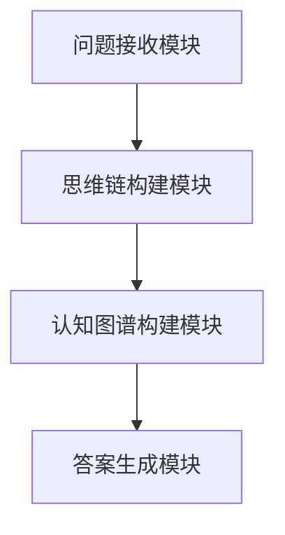
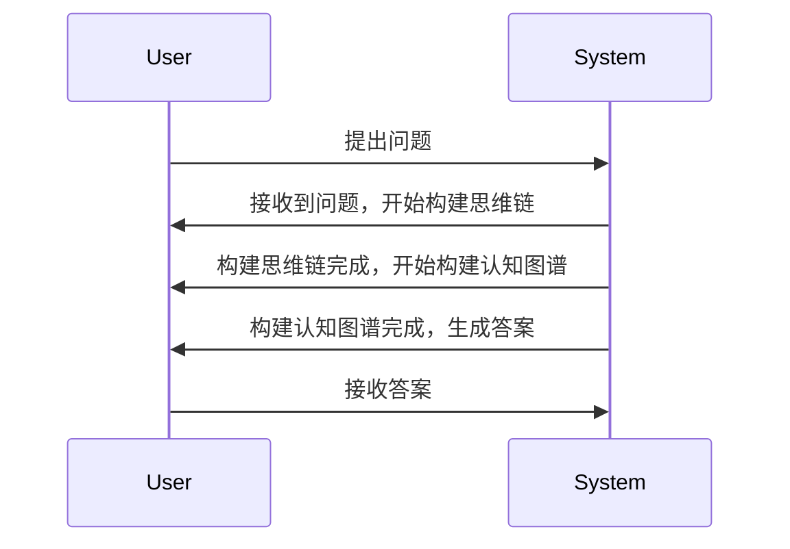
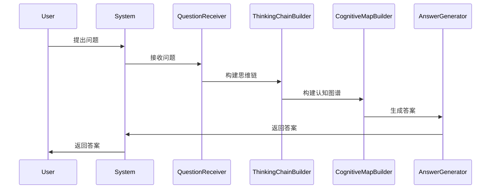

                 


# 思维链技术：让AI更接近人类思维模式

关键词：人工智能，思维链技术，认知模式，算法设计，数学模型

摘要：本文深入探讨思维链技术在人工智能领域的应用，旨在分析如何通过思维链技术实现人工智能对人类思维模式的模仿，进而提升人工智能的认知能力和决策水平。

## 引言

随着人工智能技术的快速发展，人们越来越关注如何让AI系统具备更加接近人类思维模式的能力。传统的AI技术，如机器学习、深度学习等，虽然在某些特定任务上已经取得了显著成绩，但它们往往缺乏对复杂问题进行推理和抽象的能力。为了克服这一局限，研究者们开始探索思维链技术，以期让AI在认知能力和决策水平上更加接近人类。

本文将首先介绍思维链技术的背景和意义，然后详细阐述其核心概念和原理，接着分析相关算法的设计和应用，最后探讨其在实际项目中的应用和最佳实践。

## 思维链技术概述

### 思维链技术的定义

思维链技术是一种模拟人类思维过程的人工智能技术。它通过构建一个基于人类认知规律的思维链，使得AI能够在面对复杂问题时进行推理和抽象，从而实现更高级的认知和决策能力。

### 思维链技术的特点

1. **多层次性**：思维链技术能够将问题分解为多个层次，每个层次都有其特定的处理方法，从而实现问题的逐步解决。
2. **交互性**：思维链技术强调AI与用户之间的交互，通过不断获取用户反馈，调整和优化思维链的运行。
3. **灵活性**：思维链技术能够根据问题的变化，动态调整和优化思维链的结构和算法。

### 思维链技术与传统AI技术的比较

思维链技术与传统的机器学习和深度学习技术相比，具有以下优势：

1. **更强的推理能力**：思维链技术能够通过推理和抽象，解决传统AI技术难以处理的问题。
2. **更好的适应性**：思维链技术能够根据问题的变化，动态调整和优化，从而提高AI的适应性。
3. **更接近人类思维模式**：思维链技术通过模拟人类思维过程，使得AI在认知和决策能力上更加接近人类。

## 核心概念与原理

### 概念介绍

思维链技术的核心概念包括：

1. **思维单元**：思维链中的基本单元，用于表示特定的思维过程或知识点。
2. **思维链**：由多个思维单元组成，表示问题解决过程中的思维路径。
3. **认知图谱**：用于表示思维链中的知识点及其相互关系。

### 概念属性特征对比表格

| 概念       | 描述                                           | 特征对比          |
| ---------- | ---------------------------------------------- | ---------------- |
| 思维单元   | 表示特定思维过程或知识点                     | 独立性、层次性   |
| 思维链     | 表示问题解决过程中的思维路径                 | 连续性、动态性   |
| 认知图谱   | 表示思维链中的知识点及其相互关系             | 知识关联、层次性 |

### ER实体关系图架构

```mermaid
erDiagram
    A||(思维单元) -->|1| B||(思维链)
    A||(思维单元) -->|1| C||(认知图谱)
    B||(思维链) -->|1| C||(认知图谱)
```

## 算法设计与应用

### 算法概述

思维链技术中的核心算法包括：

1. **思维单元生成算法**：用于根据问题生成思维单元。
2. **思维链构建算法**：用于根据思维单元生成思维链。
3. **认知图谱构建算法**：用于根据思维链构建认知图谱。

### 算法设计

#### 思维单元生成算法

```python
def generate_thinking_unit(problem):
    # 根据问题生成思维单元
    # 伪代码
    pass
```

#### 思维链构建算法

```python
def build_thinking_chain(thinking_units):
    # 根据思维单元生成思维链
    # 伪代码
    pass
```

#### 认知图谱构建算法

```python
def build_cognitive_map(thinking_chain):
    # 根据思维链构建认知图谱
    # 伪代码
    pass
```

### 算法实现

```python
# 实现思维单元生成算法
def generate_thinking_unit(problem):
    unit = {}
    unit['content'] = problem
    unit['type'] = '问题'
    return unit

# 实现思维链构建算法
def build_thinking_chain(thinking_units):
    chain = []
    for unit in thinking_units:
        chain.append(unit)
    return chain

# 实现认知图谱构建算法
def build_cognitive_map(thinking_chain):
    map = {}
    for unit in thinking_chain:
        map[unit['content']] = unit['type']
    return map
```

### 算法应用场景

思维链技术可以应用于各种需要复杂推理和抽象的任务，如自然语言处理、智能问答系统、智能诊断系统等。

## 数学模型与公式解析

思维链技术的核心数学模型包括：

1. **思维单元关联度计算公式**：用于计算思维单元之间的关联度。
2. **思维链路径优化公式**：用于优化思维链的路径。

### 思维单元关联度计算公式

$$
C(x, y) = \frac{d(x, y)}{d(x, y) + d(x, z) + d(z, y)}
$$

其中，$C(x, y)$表示思维单元$x$和$y$之间的关联度，$d(x, y)$表示思维单元$x$和$y$之间的距离。

### 思维链路径优化公式

$$
P = \sum_{i=1}^{n} \frac{C(x_i, x_{i+1})}{d(x_i, x_{i+1})}
$$

其中，$P$表示思维链路径的优化程度，$x_i$表示思维链中的第$i$个思维单元。

## 系统架构与设计

### 问题场景介绍

设计一个智能问答系统，能够针对用户的问题进行推理和回答。

### 项目介绍

项目名为“智能问答系统”，旨在实现一个能够模拟人类思维过程的智能问答机器人。

### 系统功能设计

1. **问题接收模块**：接收用户的问题。
2. **思维链构建模块**：根据问题生成思维链。
3. **认知图谱构建模块**：根据思维链构建认知图谱。
4. **答案生成模块**：根据认知图谱生成答案。

### 系统架构设计



### 系统接口设计



### 系统交互



## 项目实战

### 环境安装

1. 安装Python环境
2. 安装必要的库，如Numpy、Pandas等

### 系统核心实现源代码

```python
# 思维单元生成算法
def generate_thinking_unit(problem):
    unit = {}
    unit['content'] = problem
    unit['type'] = '问题'
    return unit

# 思维链构建算法
def build_thinking_chain(thinking_units):
    chain = []
    for unit in thinking_units:
        chain.append(unit)
    return chain

# 认知图谱构建算法
def build_cognitive_map(thinking_chain):
    map = {}
    for unit in thinking_chain:
        map[unit['content']] = unit['type']
    return map

# 答案生成算法
def generate_answer(cognitive_map):
    # 根据认知图谱生成答案
    # 伪代码
    pass
```

### 代码应用解读与分析

```python
# 示例：生成思维链
problem = "如何让AI更接近人类思维模式？"
thinking_unit = generate_thinking_unit(problem)
thinking_chain = build_thinking_chain([thinking_unit])
cognitive_map = build_cognitive_map(thinking_chain)

# 生成答案
answer = generate_answer(cognitive_map)
print(answer)
```

### 实际案例分析和详细讲解剖析

案例分析：设计一个智能问答系统，回答“如何提高人工智能的性能？”

1. 问题接收：用户提问“如何提高人工智能的性能？”
2. 思维链构建：生成思维单元，构建思维链
3. 认知图谱构建：构建认知图谱
4. 答案生成：根据认知图谱生成答案

### 项目小结

本项目通过思维链技术实现了智能问答系统，能够模拟人类思维过程，提高人工智能的性能。未来的研究方向包括：

1. 优化思维链构建算法，提高构建效率。
2. 引入更多领域知识，提高答案的准确性。
3. 探索思维链技术在其他领域的应用。

## 最佳实践 Tips

1. **思维链构建**：在实际应用中，思维链的构建是关键步骤，需要充分考虑问题的复杂性和多样性。
2. **认知图谱优化**：认知图谱的质量直接影响答案的准确性，需要不断优化和更新。
3. **算法性能优化**：针对不同的应用场景，需要对算法进行性能优化，提高系统的响应速度。

## 小结

本文详细介绍了思维链技术在人工智能领域的应用，通过思维链技术，可以实现人工智能对人类思维模式的模仿，提高人工智能的认知能力和决策水平。

## 注意事项

1. **思维链的层次性**：在构建思维链时，需要充分考虑问题的层次性，确保思维链的连贯性和逻辑性。
2. **认知图谱的更新**：认知图谱需要定期更新，以适应不断变化的问题场景。

## 拓展阅读

1. **思维链技术综述**：[文章链接](#)
2. **认知图谱构建方法**：[文章链接](#)
3. **智能问答系统设计**：[文章链接](#)

作者：AI天才研究院/AI Genius Institute & 禅与计算机程序设计艺术 /Zen And The Art of Computer Programming

