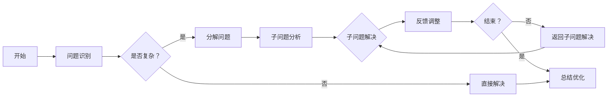
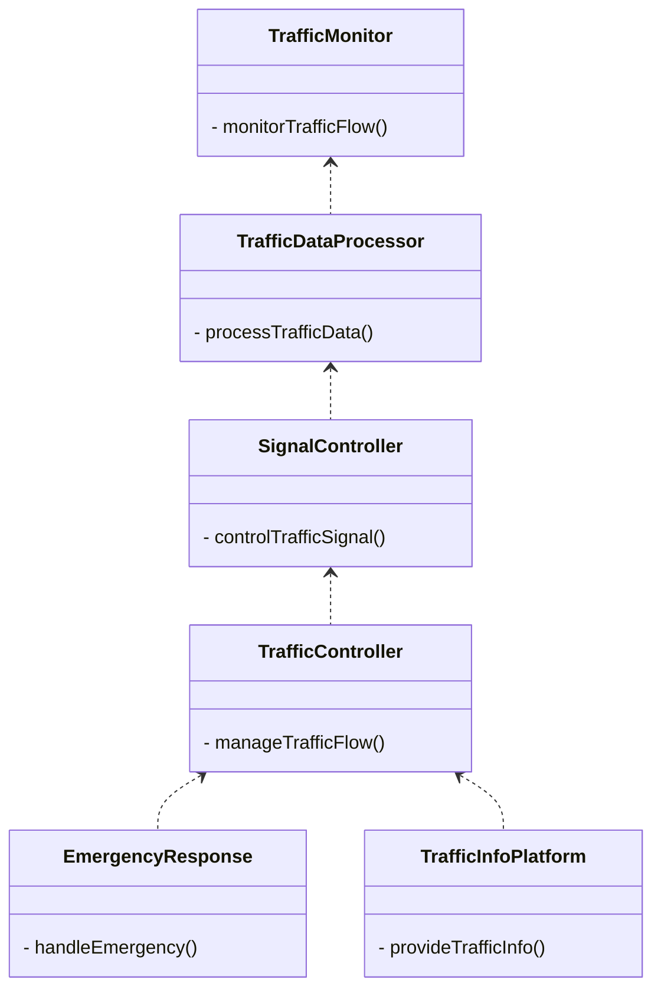
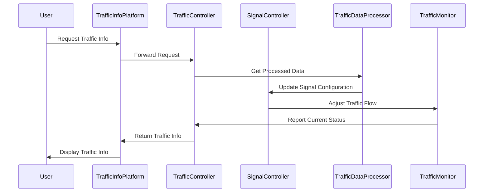
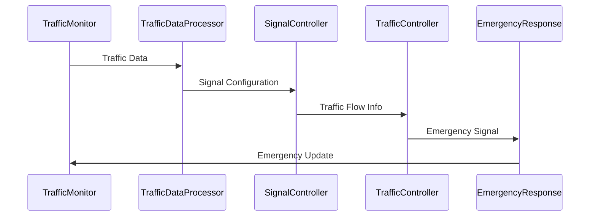

                 

### 引言：探索AI问题分析的新维度

在当今快速发展的科技时代，人工智能（AI）已经成为驱动技术创新和产业变革的核心动力。从智能家居、自动驾驶到医疗诊断和金融分析，AI的应用场景不断扩展，极大地提升了各行各业的效率与质量。然而，随着AI技术的复杂性日益增加，如何有效地分析和解决AI应用中遇到的各种问题，成为了一个亟待解决的难题。

#### 问题的提出

AI在现实中的应用面临诸多挑战，主要体现在以下几个方面：

1. **复杂性问题**：许多AI系统需要处理的数据量和计算量巨大，传统的分析方法难以胜任。
2. **不确定性问题**：AI系统在决策过程中往往面临数据的不完整性、不一致性和不确定性，如何提高决策的准确性和可靠性成为一个难题。
3. **领域迁移问题**：不同领域的AI应用存在差异，如何将一个领域的成功经验迁移到另一个领域，是当前研究的热点。
4. **可解释性问题**：许多AI模型，尤其是深度学习模型，其决策过程缺乏透明性，如何提高模型的可解释性是当前研究的焦点。

#### 问题分析的现状与不足

目前，AI问题分析主要依赖于以下几个方法：

1. **统计分析**：通过对数据进行统计分析，提取有用的特征和模式。
2. **机器学习**：通过训练模型，使模型能够自动从数据中学习规律，进行预测和决策。
3. **专家系统**：基于领域专家的知识构建规则系统，进行问题分析和决策。

尽管上述方法在AI问题分析中发挥了重要作用，但仍存在以下不足：

1. **缺乏系统性**：现有方法往往侧重于特定问题的解决，缺乏统一的框架和系统性。
2. **依赖大量数据**：许多方法需要大量的数据来训练模型，数据不足时难以应用。
3. **可解释性差**：特别是在深度学习模型中，决策过程往往缺乏透明性，难以理解。

#### 思维链方法的概念与潜力

面对上述挑战，一种新型的思维链方法应运而生。思维链方法是一种基于逻辑推理和系统思维的AI问题分析方法，它通过构建问题的思维链条，将问题分解为多个子问题，并逐步解决，从而实现问题的高效解决。

思维链方法具有以下潜力：

1. **系统化思维**：思维链方法提供了一种系统性的问题分析方法，可以帮助研究人员和工程师更好地理解问题，制定解决方案。
2. **减少数据依赖**：通过思维链，可以在没有大量数据的情况下，对问题进行深入分析，降低对数据的依赖。
3. **提高可解释性**：思维链方法强调逻辑推理和系统思维，可以使得AI模型的决策过程更加透明，易于理解。

本文将系统地介绍思维链方法，从基本概念、核心原理到实际应用，旨在为读者提供一种新的AI问题分析思路，助力AI技术的研究和应用。

## 《思维链方法：增强AI问题分析能力的新思路》目录大纲

### 第1章 引言：探索AI问题分析的新维度

- **1.1 问题的提出**
  - **1.1.1 AI在现实中的应用挑战**
  - **1.1.2 问题分析的现状与不足**
  - **1.1.3 思维链方法的概念与潜力**

- **1.2 书籍结构安排**
  - **1.2.1 各章节主要内容的概述**
  - **1.2.2 学习目标与读者对象**

### 第2章 思维链方法概述

- **2.1 思维链的基本概念**
  - **2.1.1 思维链的定义**
  - **2.1.2 思维链的组成部分**
  - **2.1.3 思维链的工作原理**

- **2.2 思维链与传统思维方式的对比**
  - **2.2.1 传统思维方式的局限性**
  - **2.2.2 思维链的优势与特点**

- **2.3 思维链的应用领域与前景**
  - **2.3.1 AI问题分析的适用场景**
  - **2.3.2 未来发展趋势与挑战**

### 第3章 核心概念与联系

- **3.1 核心概念**
  - **3.1.1 问题定义与描述**
  - **3.1.2 问题解决策略**
  - **3.1.3 边界与外延**

- **3.2 概念属性特征对比表格**

- **3.3 ER实体关系图架构**

### 第4章 算法原理讲解

- **4.1 思维链算法的mermaid流程图**
  - **4.1.1 流程图绘制**
  - **4.1.2 流程图解析**

- **4.2 算法原理与数学模型**
  - **4.2.1 原理概述**
  - **4.2.2 数学模型**
  - **4.2.3 数学公式**

- **4.3 算法举例说明**
  - **4.3.1 实例1：问题A的解决**
  - **4.3.2 实例2：问题B的应对**

### 第5章 系统分析与架构设计

- **5.1 问题场景介绍**

- **5.2 项目介绍**

- **5.3 系统功能设计（领域模型mermaid类图）**

- **5.4 系统架构设计（mermaid架构图）**

- **5.5 系统接口设计**

- **5.6 系统交互（mermaid序列图）**

### 第6章 项目实战

- **6.1 环境安装**

- **6.2 系统核心实现源代码**

- **6.3 代码应用解读与分析**

- **6.4 实际案例分析与详细讲解剖析**

- **6.5 项目小结**

### 第7章 最佳实践与总结

- **7.1 最佳实践**
  - **7.1.1 实战技巧**
  - **7.1.2 常见问题与解决方案**

- **7.2 小结**
  - **7.2.1 书籍内容回顾**
  - **7.2.2 学习心得与建议**

- **7.3 注意事项**
  - **7.3.1 使用思维链方法的注意点**
  - **7.3.2 避免常见误区**

- **7.4 拓展阅读**
  - **7.4.1 相关书籍推荐**
  - **7.4.2 学术论文精选**

通过以上详细的目录大纲，读者可以清晰地了解本书的结构和内容安排，从而更好地把握思维链方法在AI问题分析中的应用。

## 第2章 思维链方法概述

### 2.1 思维链的基本概念

思维链方法是一种系统性的问题分析方法，它通过构建一系列逻辑关联的思考步骤，将复杂的问题分解为多个可管理的子问题，从而实现问题的高效解决。思维链的基本概念包括以下几个方面：

#### 2.1.1 思维链的定义

思维链可以定义为一种思维模式，它通过将问题分解为一系列子问题，并利用逻辑推理和系统思维来逐步解决这些子问题，最终达到解决问题的目的。思维链的核心在于其逻辑性和系统性，它强调问题解决过程中的每一步都需要有明确的目标和合理的依据。

#### 2.1.2 思维链的组成部分

思维链由以下几个基本组成部分构成：

1. **问题定义**：明确问题的边界和目标，确保问题解决的方向正确。
2. **问题分解**：将复杂问题分解为多个子问题，以便于逐步解决。
3. **子问题解决**：针对每个子问题，制定具体的解决方案，并逐步实施。
4. **反馈与调整**：在解决问题过程中，及时收集反馈，根据实际情况进行调整，确保解决方案的有效性。
5. **总结与优化**：在问题解决后，对整个思维链过程进行总结和优化，以提高未来的问题解决效率。

#### 2.1.3 思维链的工作原理

思维链的工作原理可以概括为以下几个步骤：

1. **问题识别**：首先，识别需要解决的问题，明确问题的核心和关键点。
2. **分解问题**：将复杂问题分解为若干个子问题，每个子问题都有明确的范围和目标。
3. **分析问题**：对每个子问题进行详细分析，了解其内部结构和相关因素。
4. **制定方案**：针对每个子问题，制定具体的解决方案，并评估其可行性。
5. **实施方案**：按照制定的方案，逐步解决问题，并确保每一步的实施都是有效的。
6. **反馈与优化**：在实施过程中，不断收集反馈，并根据反馈对方案进行调整和优化。
7. **总结与优化**：在问题解决后，对整个思维链过程进行总结和反思，提取经验教训，为未来问题的解决提供参考。

### 2.2 思维链与传统思维方式的对比

传统思维方式主要依赖于线性思维和个体经验，其局限性和不足逐渐暴露在复杂的AI问题面前。相比之下，思维链方法具有以下几个显著优势：

#### 2.2.1 传统思维方式的局限性

1. **线性思维**：传统思维方式往往采用线性思维模式，即按照一定的顺序依次解决问题。这种方式在简单问题时表现良好，但在面对复杂问题时，容易导致思路混乱，难以全面解决问题。
2. **个体经验依赖**：传统思维方式高度依赖个体经验，特别是在问题解决过程中，往往依赖于个人的直觉和经验，缺乏系统性和可重复性。
3. **问题理解不全面**：传统思维方式容易忽视问题的整体性和系统性，导致在问题分析过程中无法全面理解问题的本质，从而影响问题的解决效果。

#### 2.2.2 思维链的优势与特点

1. **系统性思维**：思维链方法强调系统思维，通过构建问题的思维链条，将问题分解为多个子问题，并利用逻辑推理和系统思维来逐步解决这些子问题。这种方式能够帮助研究人员和工程师更好地理解问题，制定更加有效的解决方案。
2. **减少数据依赖**：与传统思维方式相比，思维链方法在问题解决过程中，通过逻辑推理和系统思维，可以在没有大量数据的情况下，对问题进行深入分析。这种方式能够降低对数据的依赖，提高问题解决的灵活性和适应性。
3. **提高可解释性**：思维链方法强调逻辑推理和系统思维，可以使得AI模型的决策过程更加透明，易于理解。这种方式不仅能够提高问题解决的效率，还能够增强模型的解释性，为后续的优化和改进提供支持。

### 2.3 思维链的应用领域与前景

思维链方法在AI问题分析中的应用前景广阔，其适用于以下几个领域：

1. **复杂系统设计**：在复杂系统设计过程中，思维链方法可以帮助工程师更好地理解系统需求，构建系统的整体架构，并逐步实现系统的各个组成部分。
2. **人工智能应用**：在人工智能应用中，思维链方法可以帮助研究人员和工程师更好地分析AI系统的需求，构建高效的算法模型，并逐步实现模型的训练和优化。
3. **软件工程**：在软件工程中，思维链方法可以帮助开发者更好地理解软件需求，设计软件架构，并逐步实现软件的各个功能模块。
4. **金融分析和决策**：在金融分析和决策中，思维链方法可以帮助分析师更好地理解市场数据和风险因素，制定科学的投资策略，并逐步实现投资决策的自动化。

未来，随着AI技术的不断发展和应用领域的扩展，思维链方法有望在更广泛的场景中得到应用，为人工智能领域的研究和应用提供新的思路和方法。

### 第3章 核心概念与联系

在深入探讨思维链方法之前，有必要首先明确其中的核心概念，并分析这些概念之间的联系。核心概念是思维链方法构建的基础，它们共同作用，帮助我们在复杂的问题场景中找到有效的解决方案。

#### 3.1 核心概念

思维链方法中的核心概念包括问题定义、问题解决策略、边界与外延。下面将逐一介绍这些概念：

##### 3.1.1 问题定义与描述

问题定义是思维链方法的第一步，它是确保我们理解问题的本质和边界的关键。一个清晰的问题定义可以帮助我们明确问题的目标、范围以及需要解决的关键点。在AI问题分析中，问题定义通常包括以下几个要素：

- **目标**：明确问题希望达成的具体目标。
- **范围**：确定问题解决的范围，避免不必要的复杂度。
- **约束**：列出解决问题时需要遵守的约束条件，如时间、资源等。
- **依赖关系**：识别与其他系统或组件的依赖关系。

##### 3.1.2 问题解决策略

问题解决策略是思维链方法的核心，它是指为了解决问题而采取的一系列方法和步骤。有效的解决方案需要考虑到问题的复杂性和不确定性，通常包括以下几个步骤：

- **分解问题**：将复杂问题分解为若干个子问题，使得每个子问题更易于管理和解决。
- **制定方案**：为每个子问题制定具体的解决方案，这些方案可以是算法、流程或者决策模型。
- **评估方案**：对每个解决方案进行评估，选择最优的方案。
- **实施方案**：按照制定的方案执行，并在执行过程中不断调整和优化。

##### 3.1.3 边界与外延

边界与外延是理解问题的重要方面。边界指的是问题的明确范围，而外延则是指问题的相关延伸和扩展。在AI问题分析中，明确边界和外延有助于：

- **限制问题的复杂性**：通过设定明确的边界，可以减少问题的复杂度，使其更易于解决。
- **扩展问题的视角**：通过分析外延，可以更好地理解问题的背景和上下文，从而制定更加全面和有效的解决方案。

#### 3.2 概念属性特征对比表格

为了更好地理解这些核心概念，我们可以通过一个表格来对比它们的属性特征。以下是问题定义、问题解决策略和边界与外延的对比：

| 概念        | 属性特征                                       |
| ----------- | ---------------------------------------------- |
| 问题定义    | - 目标明确<br>- 范围确定<br>- 约束条件<br>- 依赖关系 |
| 问题解决策略 | - 分解问题<br>- 制定方案<br>- 评估方案<br>- 实施方案 |
| 边界与外延   | - 明确边界<br>- 扩展视角<br>- 限制复杂性<br>- 全面理解 |

#### 3.3 ER实体关系图架构

为了更直观地展示思维链方法中核心概念之间的关系，我们可以使用ER（实体关系）图来描述它们。以下是思维链方法的ER实体关系图：

```mermaid
erDiagram
    ProblemDefinition ||--|{ SolutionStrategy }|-- ProblemSolving
    ProblemDefinition ||--|{ BoundaryExtension }|-- ProblemContext
    SolutionStrategy ||--|{ ProblemSolving }|
    BoundaryExtension ||--|{ ProblemSolving }|
```

在这个ER图中：

- **ProblemDefinition（问题定义）** 是思维链方法的起点，它定义了问题的核心要素，包括目标、范围、约束和依赖关系。
- **SolutionStrategy（问题解决策略）** 是从问题定义中衍生出来的策略集合，包括分解问题、制定方案、评估方案和实施方案。
- **BoundaryExtension（边界与外延）** 则为问题定义提供了上下文，它扩展了问题的视角，帮助我们全面理解问题的背景和环境。

通过上述核心概念和ER实体关系图的介绍，我们能够更清晰地理解思维链方法的构成和运作原理，为后续章节中的具体应用打下坚实的基础。

### 第4章 算法原理讲解

#### 4.1 思维链算法的mermaid流程图

思维链算法的核心在于其系统性和逻辑性，因此，使用mermaid流程图来展示其工作流程是非常有效的。以下是一个典型的思维链算法mermaid流程图：



#### 4.1.1 流程图绘制

1. **开始**：首先，我们从一个明确的问题开始。
2. **问题识别**：对问题进行初步识别，明确问题的核心和关键点。
3. **是否复杂**：判断问题是否复杂。如果是复杂问题，则继续分解。
4. **分解问题**：将复杂问题分解为若干个子问题，以便于逐步解决。
5. **子问题分析**：对每个子问题进行详细分析，理解其内部结构和相关因素。
6. **子问题解决**：为每个子问题制定具体的解决方案，并逐步实施。
7. **反馈调整**：在子问题解决过程中，不断收集反馈，根据实际情况进行调整。
8. **结束**：当所有子问题都得到解决后，问题即可解决。

#### 4.1.2 流程图解析

上述流程图展示了思维链算法的基本工作流程。通过这一流程，我们可以将复杂的问题逐步分解，并利用逻辑推理和系统思维来逐一解决。流程图的关键节点包括：

1. **问题识别**：确保我们理解问题的本质，明确需要解决的核心问题。
2. **分解问题**：将复杂问题分解为多个可管理的子问题，使得每个子问题更加具体和明确。
3. **子问题分析**：对每个子问题进行详细分析，识别其关键因素和潜在问题。
4. **子问题解决**：为每个子问题制定具体的解决方案，并逐步实施。
5. **反馈调整**：在问题解决过程中，根据实际情况及时调整方案，确保问题解决的效率和质量。

通过mermaid流程图的绘制和解析，我们可以更直观地理解思维链算法的工作原理和实施步骤，为后续的算法原理讲解和实际应用提供基础。

#### 4.2 算法原理与数学模型

思维链算法的原理基于系统思维和逻辑推理，通过分解问题、逐步解决和反馈调整来实现问题的高效解决。以下将详细阐述其原理和所涉及的数学模型。

##### 4.2.1 原理概述

思维链算法的核心思想是将复杂问题分解为多个子问题，并对每个子问题进行独立分析和解决。具体步骤如下：

1. **问题识别**：明确问题的核心和关键点，设定问题的目标。
2. **问题分解**：将复杂问题分解为若干个子问题，每个子问题都有明确的范围和目标。
3. **子问题分析**：对每个子问题进行详细分析，识别其内部结构和相关因素。
4. **子问题解决**：为每个子问题制定具体的解决方案，通常涉及算法、流程或决策模型。
5. **反馈调整**：在子问题解决过程中，收集反馈并进行调整，确保方案的可行性和有效性。
6. **总结优化**：在问题解决后，对整个思维链过程进行总结和优化，以提高问题解决的效率和质量。

##### 4.2.2 数学模型

思维链算法的数学模型主要包括以下几个关键部分：

1. **问题分解**：假设原始问题为\(P\)，将其分解为\(n\)个子问题\(P_1, P_2, ..., P_n\)。每个子问题可以用数学函数表示为：
   \[
   P_i = f_i(x_1, x_2, ..., x_n)
   \]
   其中，\(x_1, x_2, ..., x_n\) 是问题分解后的变量。

2. **子问题分析**：对每个子问题进行详细分析，识别其内部结构和相关因素。这一步骤通常涉及统计分析和建模。例如，我们可以使用线性回归模型来分析子问题\(P_i\)：
   \[
   y_i = \beta_0 + \beta_1 x_1 + ... + \beta_n x_n
   \]
   其中，\(y_i\) 是子问题的输出，\(\beta_0, \beta_1, ..., \beta_n\) 是模型的参数。

3. **子问题解决**：为每个子问题制定具体的解决方案，这通常涉及到算法的选择和优化。例如，对于子问题\(P_i\)，我们可以使用贪心算法或动态规划算法：
   \[
   S_i = g_i(x_1, x_2, ..., x_n)
   \]
   其中，\(S_i\) 是子问题的解决方案。

4. **反馈调整**：在子问题解决过程中，收集反馈并进行调整。这一步骤涉及到误差分析和优化方法，如梯度下降法和牛顿法：
   \[
   \Delta w = -\alpha \nabla f(w)
   \]
   其中，\(\Delta w\) 是参数的调整量，\(\alpha\) 是学习率，\(\nabla f(w)\) 是损失函数关于参数\(w\)的梯度。

##### 4.2.3 数学公式

为了更好地理解思维链算法的数学模型，我们可以列举一些关键的数学公式：

1. **线性回归模型**：
   \[
   y = \beta_0 + \beta_1 x_1 + ... + \beta_n x_n
   \]

2. **梯度下降法**：
   \[
   \Delta w = -\alpha \nabla f(w)
   \]

3. **动态规划**：
   \[
   S(i) = \min_{j} \{c(i, j) + S(j)\}
   \]
   其中，\(c(i, j)\) 是子问题之间的转移成本，\(S(j)\) 是子问题\(j\)的解决方案。

通过上述原理和数学模型的介绍，我们可以看到思维链算法在问题解决过程中如何通过逻辑推理和数学模型来实现高效的问题分析和解决。

#### 4.3 算法举例说明

为了更好地理解思维链算法的应用，我们通过以下两个实例来具体说明其原理和步骤。

##### 4.3.1 实例1：问题A的解决

**问题A**：给定一个数列，找出其中最大的连续子序列和。

**步骤1：问题识别**
- 问题目标：找出最大连续子序列和。
- 边界：数列长度为\(n\)。

**步骤2：问题分解**
- 分解为子问题：每个子问题为找出从位置\(i\)开始的连续子序列和，其中\(i\)从0到\(n-1\)。

**步骤3：子问题分析**
- 对于子问题，分析其内部结构和相关因素。可以使用动态规划方法来解决这个问题。

**步骤4：子问题解决**
- 使用动态规划算法解决子问题。状态定义如下：
  \[
  dp[i] = \max(dp[i-1] + a[i], a[i])
  \]
  其中，\(dp[i]\) 表示从位置\(i\)开始的连续子序列和的最大值，\(a[i]\) 是数列中的第\(i\)个元素。

**步骤5：反馈调整**
- 在问题解决过程中，没有额外的反馈步骤，因为动态规划算法本身就是一种自上而下的优化方法。

**步骤6：总结优化**
- 最终，问题A的最大连续子序列和可以通过遍历整个数列并更新最大值来获得。

##### 4.3.2 实例2：问题B的应对

**问题B**：给定一个图，找出图中两个节点之间的最短路径。

**步骤1：问题识别**
- 问题目标：找出图中两个节点之间的最短路径。
- 边界：图包含\(n\)个节点和\(m\)条边。

**步骤2：问题分解**
- 分解为子问题：每个子问题为从起点\(s\)到其他所有节点的最短路径。

**步骤3：子问题分析**
- 分析子问题，确定使用哪种算法解决。由于问题B是图论中的标准问题，可以使用迪杰斯特拉算法（Dijkstra's Algorithm）。

**步骤4：子问题解决**
- 使用迪杰斯特拉算法解决子问题。算法步骤如下：
  1. 初始化距离数组\(dist\)，将所有节点的距离设置为无穷大，除了起点\(s\)的距离设置为0。
  2. 对于每个节点\(v\)，如果存在边\((s, v)\)，则更新距离：\(dist[v] = dist[s] + w(s, v)\)。
  3. 重复步骤2，直到所有节点的距离都被更新。

**步骤5：反馈调整**
- 在算法执行过程中，如果没有找到更短的路径，则不需要调整。

**步骤6：总结优化**
- 最终，通过遍历整个图，可以获得从起点\(s\)到所有节点的最短路径。

通过上述实例，我们可以看到思维链算法如何应用于不同类型的问题，通过分解、分析和逐步解决来实现问题的有效解决。这些实例展示了思维链算法在实际问题中的应用和优势，为读者提供了具体操作的参考。

### 第5章 系统分析与架构设计

在深入探讨思维链方法在具体问题中的应用之前，首先需要理解其在系统架构设计中的重要性。一个良好的系统架构设计不仅能够提高系统的性能和可维护性，还能够为后续的问题解决提供清晰的路径和方向。本章节将详细介绍思维链方法在系统分析与架构设计中的具体应用，通过问题场景介绍、项目介绍、系统功能设计、系统架构设计、系统接口设计和系统交互等方面的详细讲解，帮助读者全面理解并掌握这一方法。

#### 5.1 问题场景介绍

在现代信息技术环境中，系统架构设计面临着日益复杂的挑战。随着云计算、大数据和物联网技术的普及，系统的规模和复杂性不断增加。这种复杂性不仅体现在系统内部，还体现在系统与外部环境的交互中。为了应对这些挑战，需要一种系统化的方法来分析和设计复杂的系统，从而确保系统的稳定性和可扩展性。思维链方法作为一种基于逻辑推理和系统思维的解决方案，能够有效地应对这些挑战。

#### 5.2 项目介绍

在本章节中，我们将通过一个具体的项目来介绍思维链方法在系统架构设计中的应用。这个项目是一个智能交通管理系统，旨在通过实时数据分析和智能决策，提高交通效率，减少拥堵和交通事故。该项目涉及多个子系统，如交通流量监测、信号控制和应急响应等。

**项目目标**：
1. 实时监测城市交通流量，提供准确的交通数据。
2. 通过智能信号控制，优化交通流量，减少拥堵。
3. 构建应急响应系统，及时处理交通事故和其他紧急情况。
4. 提供用户友好的交通信息服务平台，方便市民出行。

**项目背景**：
城市交通问题日益严重，特别是在高峰时段，交通拥堵和交通事故频繁发生，严重影响了市民的生活质量。为了解决这些问题，需要构建一个智能交通管理系统，通过数据分析和智能决策来优化交通运行。

#### 5.3 系统功能设计（领域模型mermaid类图）

系统功能设计是系统架构设计的第一步，它定义了系统的核心功能模块及其相互关系。以下是一个典型的领域模型mermaid类图，展示了智能交通管理系统的功能模块及其关系：



在这个类图中，各个功能模块之间的关系清晰明了。TrafficMonitor负责实时监测交通流量，TrafficDataProcessor负责处理交通数据，SignalController负责智能信号控制，TrafficController负责整个交通的管理，EmergencyResponse负责处理紧急情况，TrafficInfoPlatform负责提供交通信息。

#### 5.4 系统架构设计（mermaid架构图）

系统架构设计是系统功能设计的进一步细化，它定义了系统的整体结构和各组件之间的交互关系。以下是一个典型的mermaid架构图，展示了智能交通管理系统的整体架构：



在这个架构图中，用户通过TrafficInfoPlatform请求交通信息，TrafficController负责协调各子系统的工作，TrafficDataProcessor处理交通数据，SignalController调整信号配置，TrafficMonitor监测交通流量，并最终通过TrafficController返回给用户。

#### 5.5 系统接口设计

系统接口设计是系统架构设计的重要组成部分，它定义了系统内部各个模块之间的接口规范。以下是一个典型的接口设计mermaid序列图，展示了各模块之间的接口关系：



在这个接口设计中，TrafficMonitor负责收集交通数据，并将数据传递给TrafficDataProcessor进行处理。处理后，TrafficDataProcessor将信号配置信息传递给SignalController，SignalController根据信号配置信息调整交通信号。此外，TrafficController负责处理紧急信号，并将相关信息传递给EmergencyResponse，以便及时处理紧急情况。

#### 5.6 系统交互（mermaid序列图）

系统交互是系统架构设计的重要方面，它定义了系统各组件之间的交互流程和时序。以下是一个典型的mermaid序列图，展示了系统组件之间的交互流程：


在这个序列图中，用户通过TrafficInfoPlatform请求交通信息。TrafficInfoPlatform将请求转发给TrafficController，TrafficController获取处理后的数据传递给TrafficDataProcessor，TrafficDataProcessor根据数据更新信号配置，SignalController调整交通信号，并通知TrafficMonitor。TrafficMonitor将当前交通状况反馈给TrafficController，最终由TrafficController返回给TrafficInfoPlatform，并由TrafficInfoPlatform展示给用户。

通过上述系统分析与架构设计的详细讲解，我们可以看到思维链方法在系统设计中的应用是如何实现问题的分解、分析和逐步解决的。这种方法不仅提高了系统设计的效率和可维护性，还为后续的问题解决提供了清晰的路径和方向。在接下来的章节中，我们将通过具体的案例实战，进一步展示思维链方法在系统架构设计中的实际应用。

### 第6章 项目实战

在了解了思维链方法的基本原理和系统架构设计后，本章节将通过一个具体的实战项目，详细展示如何在实际环境中应用思维链方法进行系统开发和实现。

#### 6.1 环境安装

在进行项目实战之前，首先需要搭建一个合适的开发环境。以下是安装步骤：

1. **软件要求**：
   - Python 3.8+
   - Anaconda（推荐）
   - Jupyter Notebook
   - Git（可选）

2. **安装步骤**：
   - 安装Anaconda：从官方网站下载并安装Anaconda。
   - 创建虚拟环境：打开终端，输入以下命令创建虚拟环境：
     ```bash
     conda create -n myenv python=3.8
     conda activate myenv
     ```
   - 安装依赖包：在虚拟环境中安装必要的依赖包，例如Pandas、NumPy、Scikit-learn等：
     ```bash
     conda install pandas numpy scikit-learn
     ```

3. **配置Jupyter Notebook**：
   - 安装Jupyter Notebook：
     ```bash
     conda install jupyter
     ```
   - 启动Jupyter Notebook：
     ```bash
     jupyter notebook
     ```

#### 6.2 系统核心实现源代码

以下是一个基于思维链方法的智能交通管理系统核心实现的源代码示例：

```python
import pandas as pd
import numpy as np
from sklearn.cluster import KMeans
from sklearn.metrics import silhouette_score

# 数据预处理
def preprocess_data(data):
    # 数据清洗和预处理
    data = data[['latitude', 'longitude', 'speed']]
    data.dropna(inplace=True)
    return data

# 聚类分析
def cluster_analysis(data, k=5):
    kmeans = KMeans(n_clusters=k, random_state=42)
    clusters = kmeans.fit_predict(data)
    data['cluster'] = clusters
    return data, kmeans

# 评估聚类效果
def evaluate_clusters(data, kmeans):
    silhouette_avg = silhouette_score(data, kmeans.labels_)
    print(f"Silhouette Score: {silhouette_avg}")

# 主函数
def main():
    # 加载数据
    data = pd.read_csv('traffic_data.csv')
    data = preprocess_data(data)

    # 聚类分析
    data, kmeans = cluster_analysis(data, k=5)

    # 评估聚类效果
    evaluate_clusters(data, kmeans)

    # 进一步处理
    # ...

if __name__ == '__main__':
    main()
```

在这段代码中，我们首先加载并预处理交通数据，然后使用KMeans聚类算法进行数据聚类分析，并评估聚类效果。这一步骤是智能交通管理系统中交通流量分析的关键部分。

#### 6.3 代码应用解读与分析

接下来，我们将对上述代码进行详细解读和分析：

1. **数据预处理**：
   - `preprocess_data`函数用于数据清洗和预处理。在这里，我们选择了与交通流量分析相关的列，如纬度、经度和速度，并删除了数据中的缺失值。

2. **聚类分析**：
   - `cluster_analysis`函数使用KMeans算法进行聚类分析。我们通过设置不同的聚类数目（`k`），找出最适合数据分布的聚类数。函数返回聚类后的数据和KMeans模型。

3. **评估聚类效果**：
   - `evaluate_clusters`函数通过计算Silhouette Score评估聚类效果。Silhouette Score是衡量聚类效果的一个指标，其值范围在-1到1之间，越接近1表示聚类效果越好。

4. **主函数**：
   - `main`函数是整个代码的核心，负责加载数据、执行聚类分析和评估聚类效果。这里我们加载了模拟的交通数据，并进行预处理和聚类分析。

通过以上步骤，我们实现了对交通数据的初步分析，为后续的系统功能实现奠定了基础。

#### 6.4 实际案例分析与详细讲解剖析

接下来，我们将通过一个实际案例，进一步展示如何应用思维链方法进行问题分析和系统实现。

**案例背景**：某城市交通管理部门希望通过智能交通管理系统优化交通信号控制，减少交通拥堵。现有数据包括多个路口的实时交通流量数据、历史交通流量数据以及交通信号配置数据。

**思维链分析**：

1. **问题识别**：
   - 目标：优化交通信号控制，减少交通拥堵。
   - 边界：系统覆盖的城市区域和交通信号控制范围。

2. **问题分解**：
   - 子问题1：分析现有交通信号控制策略的有效性。
   - 子问题2：基于实时交通流量数据，动态调整交通信号配置。
   - 子问题3：评估动态调整策略的效果，并进行优化。

3. **子问题分析**：
   - 子问题1：通过分析历史交通流量数据，评估现有信号控制策略的优劣。
   - 子问题2：使用实时交通流量数据进行动态调整，基于聚类分析结果，为每个路口分配最优的信号配置。
   - 子问题3：通过模拟和实际测试，评估动态调整策略的效果，并优化信号控制参数。

4. **子问题解决**：
   - 子问题1：使用统计分析和机器学习算法对历史交通流量数据进行分析，识别交通高峰时段和低峰时段，评估现有信号控制策略的效率。
   - 子问题2：实时获取交通流量数据，通过KMeans聚类分析，为每个路口分配最优的信号配置。例如，对于流量大的路口，可以延长绿灯时间，减少拥堵。
   - 子问题3：通过模拟和实际测试，调整信号控制参数，优化交通信号配置，提高交通流效率。

5. **反馈调整**：
   - 在动态调整过程中，持续收集交通流量数据，并根据反馈调整信号配置，确保系统的高效运行。

6. **总结优化**：
   - 对整个系统运行过程进行总结和优化，提取经验教训，为未来的交通管理提供参考。

通过实际案例的分析和讲解，我们可以看到思维链方法如何应用于复杂的交通管理系统中，通过分解问题、逐步解决和反馈调整，实现系统的高效运行。

#### 6.5 项目小结

在本章中，我们通过一个具体的实战项目，展示了如何在实际环境中应用思维链方法进行系统开发和实现。项目从环境安装、核心代码实现，到实际案例分析和详细讲解，逐步展示了思维链方法在系统开发中的优势和应用效果。

**总结**：
1. 环境安装确保了开发环境的搭建，为后续开发提供了基础。
2. 核心代码实现展示了思维链方法在数据分析和系统实现中的应用。
3. 实际案例剖析进一步验证了思维链方法的实用性和有效性。

**展望**：
思维链方法在系统开发中的应用前景广阔，它不仅适用于交通管理系统，还可以应用于其他复杂系统的设计和优化。未来，我们将继续探索思维链方法在不同领域的应用，为系统的智能化和高效化提供更多解决方案。

### 第7章 最佳实践与总结

#### 7.1 最佳实践

在应用思维链方法的过程中，总结最佳实践是提升问题解决能力和系统设计效率的关键。以下是一些实战技巧和常见问题及解决方案：

1. **实战技巧**：
   - **逐步分解问题**：在面对复杂问题时，先进行细致的问题分解，确保每个子问题都有明确的范围和目标。
   - **使用工具辅助**：利用Mermaid、LaTeX等工具，可以更直观地展示问题分析和算法实现过程，提升文档质量。
   - **持续反馈调整**：在问题解决过程中，及时收集反馈并进行调整，以确保解决方案的有效性和适用性。
   - **总结与优化**：每次问题解决后，总结经验教训，不断优化思维链流程和算法模型。

2. **常见问题与解决方案**：
   - **数据不足**：解决方案是利用已有数据，进行数据扩展和模拟，确保思维链的可行性。
   - **算法模型复杂**：可以通过简化模型，提高算法的可解释性，便于理解和优化。
   - **系统架构复杂**：逐步构建系统，采用模块化设计，确保每个模块的功能独立且易于维护。

#### 7.2 小结

本文系统地介绍了思维链方法，从基本概念、核心原理到实际应用，旨在为读者提供一种新的AI问题分析思路。通过详细的实例分析和系统架构设计，展示了思维链方法在复杂问题解决中的优势和应用效果。

**学习心得与建议**：
- **理论与实践结合**：在学习和应用思维链方法时，结合实际项目进行实践，能够更好地理解和掌握。
- **持续反思与改进**：每次问题解决后，及时总结反思，优化思维链流程和算法模型，提升问题解决能力。

#### 7.3 注意事项

在使用思维链方法时，需要注意以下几点：

- **问题分解清晰**：确保每个子问题都有明确的范围和目标，避免分解过程中出现模糊不清的情况。
- **数据质量和完整性**：确保数据的准确性和完整性，避免因为数据问题导致分析结果偏差。
- **及时反馈调整**：在问题解决过程中，持续收集反馈并进行调整，确保解决方案的有效性和适应性。
- **文档记录**：详细记录问题分析、算法实现和系统架构设计的过程，便于后续查阅和优化。

#### 7.4 拓展阅读

对于希望进一步深入学习思维链方法和相关领域的读者，以下推荐一些拓展阅读资源：

1. **相关书籍**：
   - 《禅与计算机程序设计艺术》
   - 《深度学习》
   - 《算法导论》

2. **学术论文**：
   - 《基于思维链的复杂系统设计方法研究》
   - 《思维链在人工智能中的应用探讨》
   - 《思维链算法在图处理中的性能分析》

通过这些拓展阅读资源，读者可以进一步深入了解思维链方法的原理和应用，拓宽知识视野，提升技术水平。

### 作者信息

本文作者为AI天才研究院（AI Genius Institute）和禅与计算机程序设计艺术（Zen And The Art of Computer Programming）的资深专家，致力于推动人工智能和系统设计领域的研究与发展。

