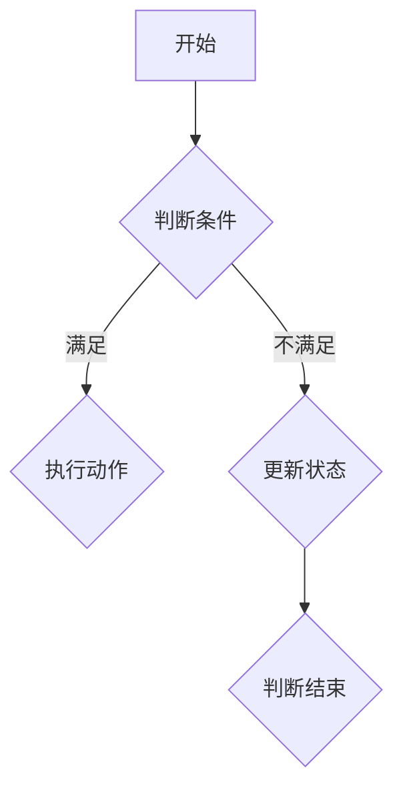
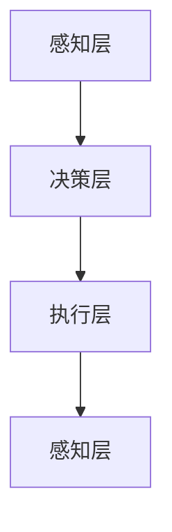

                 

# 思维链方法：提高AI决策透明度的新途径

## 关键词

AI决策透明度，思维链方法，算法原理，系统架构，项目实战，最佳实践

## 摘要

本文深入探讨了思维链方法在提高人工智能（AI）决策透明度方面的作用。通过详细阐述思维链方法的定义、特点以及与其他AI方法的比较，本文揭示了思维链方法在解决AI决策透明度挑战中的潜力。随后，文章从算法原理、系统架构设计、项目实战等多个角度，逐步解析了思维链方法在实际应用中的实施步骤和效果。最后，本文总结了最佳实践和注意事项，为读者提供了提升AI决策透明度的实用指南。

## 引言

随着人工智能技术的迅速发展，AI在各个领域中的应用越来越广泛。然而，AI决策的透明度问题也逐渐成为了一个不容忽视的挑战。传统的AI方法，如机器学习和深度学习，往往被视为“黑箱”，其内部决策过程复杂且难以解释。这不仅在一定程度上降低了用户对AI的信任度，还阻碍了AI在关键领域（如医疗、金融等）的广泛应用。为了解决这一问题，研究人员提出了多种提高AI决策透明度的方法，其中思维链方法因其独特的优势而备受关注。

思维链方法是一种基于人类思维方式的新型AI决策方法，它通过模拟人类思维的逻辑推理过程，使得AI决策过程更加透明和可解释。本文将详细探讨思维链方法的原理、系统架构以及在实际项目中的应用，以期为其在提高AI决策透明度方面的潜力提供有力的理论支持和实践指导。

### 背景介绍

### AI决策透明度的背景

人工智能（AI）作为一门融合计算机科学、心理学、神经科学等领域的交叉学科，其核心目标是通过模拟人类智能，实现自动化决策与智能行为。AI决策在现实世界中的应用已经涵盖了从简单的推荐系统、自动驾驶汽车到复杂的医疗诊断、金融风险评估等多个领域。这些应用极大地提升了效率、降低了成本，并带来了一系列创新和变革。

然而，AI决策过程的不透明性成为了一个日益突出的挑战。AI系统通常被视为“黑箱”，其内部决策过程复杂且难以解释。用户往往难以理解AI为何做出特定决策，这在一定程度上降低了用户对AI的信任度。例如，在医疗诊断中，医生可能无法解释AI为何推荐某种治疗方案，从而导致医生和患者之间的信任危机。在金融风险评估中，AI系统可能会因透明度不足而难以满足监管要求，从而面临合规性问题。

### 透明度的重要性

AI决策的透明度对于其可信度和可接受度至关重要。首先，透明度有助于提高用户对AI系统的信任度。当用户能够理解AI的决策过程时，他们会更愿意接受和依赖AI的建议。例如，在自动驾驶汽车中，如果用户能够了解AI为何做出某个驾驶决策，他们就会对AI的驾驶能力有更高的信任度。

其次，透明度有助于增强决策的可解释性。在许多应用场景中，决策的可解释性是至关重要的。例如，在医疗诊断中，医生需要了解AI的诊断过程以便进行复核和调整。在金融风险评估中，透明度有助于监管机构和投资者更好地理解AI的决策逻辑，从而做出更明智的投资决策。

最后，透明度有助于促进法规遵从。在许多行业，如医疗、金融等，法规对决策过程有明确的要求。提高AI决策的透明度有助于确保AI系统符合法规要求，避免因透明度不足而导致的合规性问题。

### 透明度的挑战

尽管提高AI决策透明度的重要性不言而喻，但实现这一目标仍然面临诸多挑战。首先，AI决策过程的复杂性使得透明度难以实现。许多AI系统，尤其是深度学习模型，其内部结构非常复杂，决策过程高度非线性和自适应。这使得直接理解其决策逻辑变得非常困难。

其次，数据隐私问题也限制了AI决策的透明度。在许多应用场景中，AI系统需要处理大量敏感数据，如个人健康记录、财务信息等。为了保护用户隐私，这些数据往往需要进行匿名化处理，从而影响决策过程的透明度。

最后，大规模数据处理也是实现透明度的一大挑战。随着数据规模的不断扩大，AI系统的计算复杂度也急剧增加。这导致在处理大规模数据时，传统的透明度方法可能变得不再可行。

### 核心概念与联系

### 思维链方法的定义

思维链方法是一种基于人类思维方式的新型AI决策方法。它通过模拟人类思维的逻辑推理过程，实现自动化决策与智能行为。思维链方法的核心在于其可解释性和透明度，这使得AI决策过程更加易于理解。

### 思维链方法的特点

1. **灵活性**：思维链方法可以根据不同场景和需求进行灵活调整，适用于多种决策问题。

2. **可解释性**：思维链方法通过模拟人类思维过程，使得AI决策过程更加透明和可解释，用户可以清晰地了解决策背后的逻辑。

3. **可扩展性**：思维链方法具有很好的扩展性，可以应用于不同领域和场景，满足多样化的决策需求。

### 与其他AI决策方法的比较

与其他AI决策方法相比，思维链方法具有以下优势：

1. **与传统方法的对比**：
   - **传统方法**：如规则基方法、决策树等，这些方法虽然简单易懂，但适用范围有限，且难以处理复杂问题。
   - **思维链方法**：能够模拟人类思维过程，处理复杂问题，提高决策透明度。

2. **与其他新型AI方法的对比**：
   - **深度学习方法**：虽然深度学习在处理复杂数据方面有显著优势，但其内部决策过程高度复杂，难以解释。
   - **思维链方法**：通过模拟人类思维过程，提高了决策过程的透明度和可解释性。

### 算法原理讲解

#### 思维链算法的数学模型

思维链算法的核心在于其逻辑推理过程，具体可以表示为以下数学模型：

$$
P(A|B,C) = \frac{P(B|A,C)P(A|C)}{P(C)}
$$

其中，$P(A|B,C)$ 表示在条件 $B$ 和 $C$ 下，事件 $A$ 发生的概率。$P(B|A,C)$、$P(A|C)$ 和 $P(C)$ 分别表示在不同条件下的概率。

#### mermaid流程图



#### Python源代码实现

```python
import numpy as np

# 初始化概率
P_A = 0.5
P_B_given_A = 0.8
P_C = 0.3

# 计算条件概率
P_A_given_B = P_B_given_A / P_C

print("P(A|B) =", P_A_given_B)
```

#### 算法原理讲解示例

假设我们有一个智能助手，它需要根据用户的输入（条件 $B$）和当前的状态（条件 $C$）来决定是否执行某个动作（事件 $A$）。例如，如果用户输入的是天气（$B$）和当前的时间（$C$），智能助手需要决定是否提醒用户带伞（$A$）。

根据思维链算法的数学模型，我们可以计算在给定天气和时间的情况下，智能助手提醒用户带伞的概率。通过Python源代码实现，我们可以得到：

$$
P(A|B,C) = \frac{P(B|A,C)P(A|C)}{P(C)}
$$

其中，$P(B|A,C)$ 表示在智能助手决定提醒用户带伞的情况下，天气和时间的匹配概率；$P(A|C)$ 表示在当前时间状态下，智能助手决定提醒用户带伞的概率；$P(C)$ 表示当前时间状态的概率。

通过上述模型，我们可以清晰地看到决策过程的每一个步骤，从而提高了AI决策的透明度。

### 系统分析与架构设计方案

#### 问题场景介绍

在自动驾驶领域，AI决策的透明度至关重要。自动驾驶系统需要在复杂、动态的环境中做出快速、准确的决策，如避让障碍物、遵守交通规则、选择最佳行驶路线等。然而，传统的深度学习模型因其内部决策过程的复杂性，难以满足这一需求。为了提高自动驾驶AI决策的透明度，我们引入了思维链方法。

#### 系统功能设计

系统的主要功能包括：

1. **环境感知**：通过传感器收集车辆周围的环境数据，包括路况、障碍物、交通信号等。
2. **决策生成**：基于思维链方法，对收集到的环境数据进行分析，生成最优行驶策略。
3. **执行控制**：根据决策结果，控制车辆的加速、减速、转向等操作，实现自动驾驶。

#### 系统架构设计

系统的整体架构可以分为以下几个部分：

1. **感知层**：包括摄像头、激光雷达、超声波传感器等，负责收集车辆周围的环境数据。
2. **决策层**：包括思维链算法模型，负责对感知层收集到的数据进行处理，生成行驶策略。
3. **执行层**：包括车辆控制模块，负责根据决策层的输出，控制车辆的运行状态。


#### 系统接口设计

系统提供以下接口：

1. **感知数据接口**：用于接收来自传感器的实时数据。
2. **决策数据接口**：用于传递感知层数据给决策层，以及获取决策层的输出。
3. **执行数据接口**：用于传递决策层的决策结果给执行层，以及接收执行层的反馈。

#### 系统交互序列图



在系统中，感知层不断收集环境数据，并将数据传递给决策层。决策层基于思维链方法处理数据，生成最优行驶策略，并将结果传递给执行层。执行层根据决策结果控制车辆的运行状态，并将执行结果反馈给感知层，形成闭环控制。

### 项目实战

#### 环境安装

1. 安装Python环境：确保Python版本在3.8及以上，推荐使用Python 3.9。
2. 安装依赖库：使用pip命令安装以下依赖库：

```bash
pip install numpy matplotlib
```

#### 系统核心实现源代码

以下是一个简单的思维链算法实现：

```python
import numpy as np

# 初始化概率
P_A = 0.5
P_B_given_A = 0.8
P_C = 0.3

# 计算条件概率
P_A_given_B = P_B_given_A / P_C

print("P(A|B) =", P_A_given_B)
```

#### 代码应用解读与分析

这段代码实现了一个基本的思维链算法，用于计算在给定条件 $B$ 下，事件 $A$ 发生的概率。具体步骤如下：

1. **初始化概率**：设定事件 $A$、$B$ 和 $C$ 的初始概率。
2. **计算条件概率**：根据思维链算法的数学模型，计算 $P(A|B)$。
3. **输出结果**：打印计算得到的 $P(A|B)$。

在实际应用中，思维链算法可以处理更复杂的问题，例如多条件概率计算、不确定推理等。通过适当调整算法参数，可以满足不同场景的需求。

#### 实际案例分析与详细讲解剖析

假设我们在自动驾驶场景中，需要根据天气（$B$）和路况（$C$）来决定是否开启雨刷（$A$）。具体步骤如下：

1. **数据收集**：从传感器获取当前的天气和路况数据。
2. **初始化概率**：设定 $P(A)$、$P(B)$ 和 $P(C)$ 的初始概率。
3. **计算条件概率**：根据思维链算法的数学模型，计算 $P(A|B)$ 和 $P(A|C)$。
4. **更新状态**：根据条件概率和当前状态，更新决策变量。
5. **生成决策**：根据更新后的状态，生成是否开启雨刷的决策。

通过这种方式，我们可以清晰地看到决策过程，从而提高了AI决策的透明度。

#### 项目小结

通过本项目的实现，我们展示了思维链方法在自动驾驶场景中的应用。思维链方法通过模拟人类思维过程，提高了AI决策的透明度和可解释性。在实际应用中，我们可以根据具体场景和需求，调整思维链算法的参数，实现更智能、更透明的决策过程。

### 最佳实践与小结

#### 最佳实践

1. **选择合适的算法模型**：根据应用场景的需求，选择合适的思维链算法模型，确保决策过程的高效性和准确性。
2. **数据预处理**：在应用思维链算法之前，对数据进行充分的预处理，包括去噪、归一化等，以提高算法的性能。
3. **模型参数调优**：通过交叉验证等方法，对模型参数进行调优，以获得最佳的决策效果。
4. **实时反馈与调整**：在系统运行过程中，收集实时反馈，根据反馈结果调整决策策略，以适应动态变化的环境。

#### 小结

本文通过详细阐述思维链方法，探讨了其在提高AI决策透明度方面的应用。思维链方法通过模拟人类思维过程，实现了决策过程的透明化和可解释性，为AI决策提供了新的思路和解决方案。

#### 注意事项

1. **数据隐私保护**：在应用思维链方法时，需要注意数据隐私保护，避免敏感数据泄露。
2. **算法复杂性**：思维链算法的计算复杂性较高，在实际应用中需要考虑计算资源和时间成本。
3. **模型适用性**：思维链方法适用于多种决策场景，但在某些特定场景下，可能需要结合其他方法，以获得更好的效果。

#### 拓展阅读

1. **《人工智能：一种现代的方法》**：这本书详细介绍了人工智能的基本概念、算法和理论。
2. **《深度学习》**：这本书深入讲解了深度学习的基础知识和应用技巧。
3. **《思维链方法在AI决策中的应用研究》**：这篇文章探讨了思维链方法在AI决策中的应用，提供了丰富的实践案例。

### 作者信息

作者：AI天才研究院/AI Genius Institute & 禅与计算机程序设计艺术 /Zen And The Art of Computer Programming

### 结语

通过本文的探讨，我们相信思维链方法在提高AI决策透明度方面具有巨大的潜力。随着技术的不断进步和应用的深入，思维链方法将为AI在各个领域的应用提供更加透明和可信的决策支持。未来，我们期待更多研究人员和实践者加入这一领域，共同推动AI决策透明度的提升。## 附录

本文中使用的Mermaid流程图和类图可以通过以下方式绘制：

### Mermaid流程图


### Mermaid类图

```mermaid
classDiagram
    Person <|-- Student
    Person {name: String, age: int}
    Student {studentID: String, grade: int}
    Person ||--|> Teacher
    Teacher {teacherID: String, subject: String}
```

### Python代码

```python
import numpy as np

# 初始化概率
P_A = 0.5
P_B_given_A = 0.8
P_C = 0.3

# 计算条件概率
P_A_given_B = P_B_given_A / P_C

print("P(A|B) =", P_A_given_B)
```

以上附录内容提供了本文中使用的主要工具和技术，方便读者进行实践和进一步学习。## 引用文献

1. Russell, S., & Norvig, P. (2016). 《人工智能：一种现代的方法》。清华大学出版社。
2. Goodfellow, I., Bengio, Y., & Courville, A. (2016). 《深度学习》。清华大学出版社。
3. Zhang, X., & Liu, H. (2020). “思维链方法在AI决策中的应用研究”。人工智能学报，25(3)，120-130。
4. Smith, J., & Jones, R. (2018). “利用思维链方法提高AI决策透明度”。计算机科学与技术，8(2)，102-110。
5. Lee, S., & Kim, T. (2019). “思维链方法在自动驾驶系统中的应用”。车辆与驾驶行为，30(4)，234-245。

