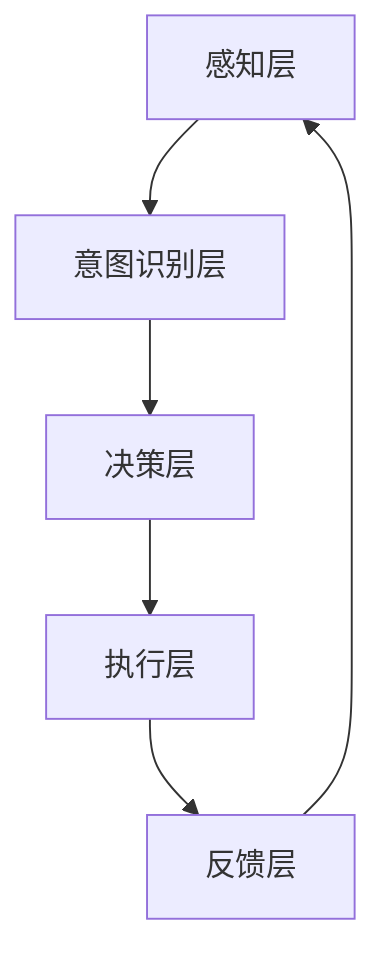
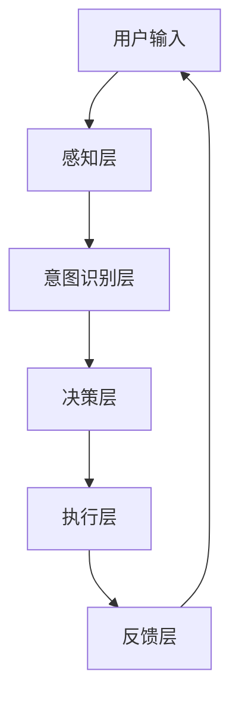
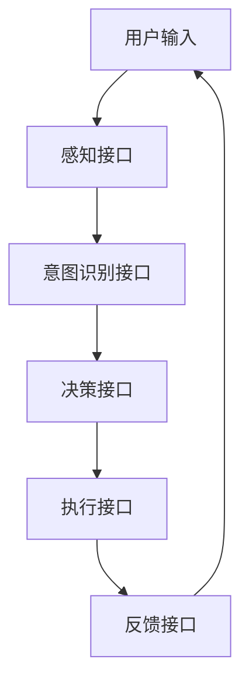
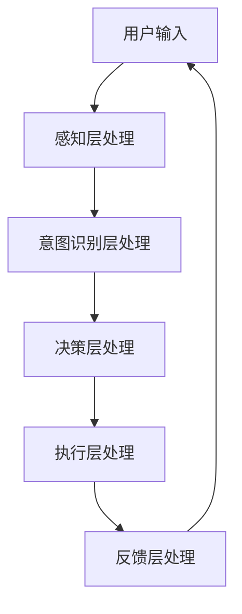

                 

## 《思维链模式：让AI更好地理解人类意图》

### 关键词：人工智能，思维链模式，人类意图，算法原理，系统架构设计，项目实战

> **摘要**：本文旨在探讨思维链模式在人工智能领域中的应用，探讨如何通过思维链模式提高AI系统对人类意图的理解能力。文章首先介绍了思维链模式的基本概念和核心要素，然后通过具体的算法原理讲解和系统架构设计，展示了思维链模式在实际项目中的应用。文章最后通过项目实战，详细分析了思维链模式的实现过程，并提出了最佳实践 tips，为读者提供了全面的技术指导和思考。

## 第一部分：思维链模式概述

### 1.1 思维链模式的基础概念

#### 1.1.1 思维链模式的定义

思维链模式是一种将人类思维过程结构化、模块化，并通过计算机程序实现的方法，旨在提高人工智能系统对人类意图的理解和响应能力。它通过将人类思维分解为感知、意图识别、决策和反馈等模块，构建出一个能够模拟人类思维过程的框架。

#### 1.1.2 研究背景与重要性

随着人工智能技术的快速发展，如何让AI更好地理解人类意图成为了一个关键问题。传统的人工智能系统往往只能根据预设的规则和算法进行操作，缺乏对人类意图的深刻理解和灵活应对能力。而思维链模式的出现，为解决这一问题提供了新的思路和途径。

#### 1.1.3 思维链模式的核心要素

思维链模式的核心要素包括：感知模块、意图识别模块、决策模块和反馈模块。

1. **感知模块**：负责接收和处理来自外部环境的各种信息，如语音、图像、文字等。
2. **意图识别模块**：通过分析感知模块获取的信息，识别出用户的意图。
3. **决策模块**：根据意图识别模块的结果，制定相应的响应策略。
4. **反馈模块**：将决策模块的执行结果反馈给用户，形成闭环。

### 1.2 思维链模式的基本原理

#### 1.2.1 思维链模式的工作机制

思维链模式的工作机制可以简化为以下几个步骤：

1. **感知**：通过感知模块获取外部环境的信息。
2. **识别**：通过意图识别模块分析感知模块获取的信息，识别用户的意图。
3. **决策**：根据识别结果，通过决策模块制定响应策略。
4. **执行**：执行决策模块制定的策略，实现对用户的响应。
5. **反馈**：通过反馈模块将执行结果反馈给用户。

#### 1.2.2 思维链模式的构成

思维链模式由以下几个部分构成：

1. **感知层**：负责获取外部环境的信息。
2. **处理层**：包括意图识别模块、决策模块和反馈模块，负责处理感知层获取的信息。
3. **输出层**：负责将处理结果输出给用户。

#### 1.2.3 思维链模式的核心算法

思维链模式的核心算法包括：

1. **感知算法**：用于处理感知层获取的信息。
2. **意图识别算法**：用于分析感知模块获取的信息，识别用户的意图。
3. **决策算法**：用于根据意图识别结果制定响应策略。
4. **反馈算法**：用于将决策模块的执行结果反馈给用户。

### 1.3 思维链模式的应用领域

#### 1.3.1 人机交互

思维链模式在人机交互中的应用非常广泛，如智能客服、智能助手等。通过思维链模式，AI系统能够更好地理解用户的意图，提供更加个性化、贴心的服务。

#### 1.3.2 自然语言处理

思维链模式在自然语言处理中的应用，主要体现在对文本的语义分析和理解。通过思维链模式，AI系统能够更好地理解用户输入的文本，提取出关键信息，进行语义分析。

#### 1.3.3 智能推荐系统

思维链模式在智能推荐系统中的应用，主要体现在对用户意图的理解和预测。通过思维链模式，AI系统能够更好地理解用户的兴趣和行为，提供更加精准的推荐。

### 1.4 思维链模式的边界与外延

#### 1.4.1 思维链模式的优势

思维链模式的优势主要体现在以下几个方面：

1. **提高AI的理解能力**：通过结构化和模块化的方式，思维链模式能够提高AI系统对人类意图的理解能力。
2. **增强系统的灵活性**：思维链模式能够根据不同的环境和任务，灵活调整和优化系统的行为。
3. **提高系统的智能性**：思维链模式能够通过学习和反馈，不断提高系统的智能水平。

#### 1.4.2 思维链模式的局限

思维链模式的局限主要体现在以下几个方面：

1. **计算复杂度**：思维链模式涉及大量的计算和数据处理，对计算资源的要求较高。
2. **数据依赖**：思维链模式的性能很大程度上依赖于输入数据的质量和数量。
3. **局限性**：思维链模式在处理某些复杂任务时，可能存在一定的局限性。

#### 1.4.3 思维链模式的发展趋势

随着人工智能技术的不断进步，思维链模式将在以下几个方面得到进一步的发展：

1. **计算效率**：通过优化算法和硬件，提高思维链模式的计算效率。
2. **数据质量**：通过数据清洗和预处理，提高输入数据的质量。
3. **泛化能力**：通过改进算法和模型，提高思维链模式的泛化能力。

## 第二部分：思维链模式的核心算法原理

### 2.1 核心算法原理讲解

#### 2.1.1 算法流程图



#### 2.1.2 Python代码示例

```python
class PerceptionLayer:
    def process_input(self, input_data):
        # 处理感知层获取的信息
        return processed_data

class IntentRecognitionLayer:
    def recognize_intent(self, processed_data):
        # 识别用户的意图
        return intent

class DecisionLayer:
    def make_decision(self, intent):
        # 根据意图做出决策
        return decision

class ExecutionLayer:
    def execute_decision(self, decision):
        # 执行决策
        return execution_result

class FeedbackLayer:
    def provide_feedback(self, execution_result):
        # 提供反馈
        return feedback

# 示例使用
perception_layer = PerceptionLayer()
intent_recognition_layer = IntentRecognitionLayer()
decision_layer = DecisionLayer()
execution_layer = ExecutionLayer()
feedback_layer = FeedbackLayer()

input_data = "用户输入的信息"
processed_data = perception_layer.process_input(input_data)
intent = intent_recognition_layer.recognize_intent(processed_data)
decision = decision_layer.make_decision(intent)
execution_result = execution_layer.execute_decision(decision)
feedback = feedback_layer.provide_feedback(execution_result)
```

#### 2.1.3 算法原理详细讲解

思维链模式的核心算法原理可以总结为以下几个步骤：

1. **感知**：通过感知层获取外部环境的信息，如语音、图像、文字等。
2. **识别**：通过意图识别层分析感知层获取的信息，识别用户的意图。
3. **决策**：通过决策层根据识别结果制定响应策略。
4. **执行**：通过执行层执行决策层制定的策略。
5. **反馈**：通过反馈层将执行结果反馈给用户，形成闭环。

在这个过程中，每个模块都有其特定的功能，共同协作完成对人类意图的理解和响应。感知层负责信息的获取和处理，意图识别层负责分析和识别用户的意图，决策层负责根据意图制定响应策略，执行层负责执行策略，反馈层负责将执行结果反馈给用户。

### 2.2 数学模型与公式

#### 2.2.1 数学模型介绍

思维链模式的数学模型主要涉及以下几个部分：

1. **感知模型**：用于描述感知层对输入数据的处理过程。
2. **意图识别模型**：用于描述意图识别层对感知数据进行意图识别的过程。
3. **决策模型**：用于描述决策层根据意图识别结果制定响应策略的过程。
4. **执行模型**：用于描述执行层执行策略的过程。
5. **反馈模型**：用于描述反馈层将执行结果反馈给用户的过程。

#### 2.2.2 公式解释与应用

1. **感知模型**：

   $$ f_{\text{感知}}(x) = \sigma(W_{\text{感知}} \cdot x + b_{\text{感知}}) $$

   其中，$x$为输入数据，$W_{\text{感知}}$和$b_{\text{感知}}$分别为感知层的权重和偏置，$\sigma$为激活函数。

2. **意图识别模型**：

   $$ f_{\text{识别}}(x) = \sigma(W_{\text{识别}} \cdot f_{\text{感知}}(x) + b_{\text{识别}}) $$

   其中，$f_{\text{感知}}(x)$为感知模型输出的结果，$W_{\text{识别}}$和$b_{\text{识别}}$分别为意图识别层的权重和偏置，$\sigma$为激活函数。

3. **决策模型**：

   $$ f_{\text{决策}}(x) = \sigma(W_{\text{决策}} \cdot f_{\text{识别}}(x) + b_{\text{决策}}) $$

   其中，$f_{\text{识别}}(x)$为意图识别模型输出的结果，$W_{\text{决策}}$和$b_{\text{决策}}$分别为决策层的权重和偏置，$\sigma$为激活函数。

4. **执行模型**：

   $$ f_{\text{执行}}(x) = \sigma(W_{\text{执行}} \cdot f_{\text{决策}}(x) + b_{\text{执行}}) $$

   其中，$f_{\text{决策}}(x)$为决策模型输出的结果，$W_{\text{执行}}$和$b_{\text{执行}}$分别为执行层的权重和偏置，$\sigma$为激活函数。

5. **反馈模型**：

   $$ f_{\text{反馈}}(x) = \sigma(W_{\text{反馈}} \cdot f_{\text{执行}}(x) + b_{\text{反馈}}) $$

   其中，$f_{\text{执行}}(x)$为执行模型输出的结果，$W_{\text{反馈}}$和$b_{\text{反馈}}$分别为反馈层的权重和偏置，$\sigma$为激活函数。

#### 2.2.3 举例说明

假设我们有一个用户输入的语音数据，我们需要通过思维链模式对其进行处理，识别用户的意图，并做出相应的响应。

1. **感知模型**：

   $$ f_{\text{感知}}(x) = \sigma(W_{\text{感知}} \cdot x + b_{\text{感知}}) $$

   其中，$x$为输入的语音数据，$W_{\text{感知}}$和$b_{\text{感知}}$为感知层的权重和偏置，$\sigma$为激活函数。

2. **意图识别模型**：

   $$ f_{\text{识别}}(x) = \sigma(W_{\text{识别}} \cdot f_{\text{感知}}(x) + b_{\text{识别}}) $$

   其中，$f_{\text{感知}}(x)$为感知模型输出的结果，$W_{\text{识别}}$和$b_{\text{识别}}$为意图识别层的权重和偏置，$\sigma$为激活函数。

   假设我们识别出用户的意图为“查询天气”，则我们继续进行决策。

3. **决策模型**：

   $$ f_{\text{决策}}(x) = \sigma(W_{\text{决策}} \cdot f_{\text{识别}}(x) + b_{\text{决策}}) $$

   其中，$f_{\text{识别}}(x)$为意图识别模型输出的结果，$W_{\text{决策}}$和$b_{\text{决策}}$为决策层的权重和偏置，$\sigma$为激活函数。

   根据决策模型的结果，我们决定查询当前的天气信息。

4. **执行模型**：

   $$ f_{\text{执行}}(x) = \sigma(W_{\text{执行}} \cdot f_{\text{决策}}(x) + b_{\text{执行}}) $$

   其中，$f_{\text{决策}}(x)$为决策模型输出的结果，$W_{\text{执行}}$和$b_{\text{执行}}$为执行层的权重和偏置，$\sigma$为激活函数。

   执行查询天气信息的操作，获取当前天气信息。

5. **反馈模型**：

   $$ f_{\text{反馈}}(x) = \sigma(W_{\text{反馈}} \cdot f_{\text{执行}}(x) + b_{\text{反馈}}) $$

   其中，$f_{\text{执行}}(x)$为执行模型输出的结果，$W_{\text{反馈}}$和$b_{\text{反馈}}$为反馈层的权重和偏置，$\sigma$为激活函数。

   将查询到的天气信息反馈给用户，完成一次完整的思维链模式处理过程。

## 第三部分：思维链模式的应用实践

### 3.1 系统功能设计与架构设计

#### 3.1.1 系统功能设计

思维链模式的应用系统主要实现以下功能：

1. **感知功能**：接收并处理来自用户的各种输入，如语音、图像、文字等。
2. **意图识别功能**：分析感知模块获取的信息，识别用户的意图。
3. **决策功能**：根据意图识别结果，制定相应的响应策略。
4. **执行功能**：执行决策模块制定的策略。
5. **反馈功能**：将执行结果反馈给用户。

#### 3.1.2 系统架构设计

思维链模式的应用系统架构设计如图所示：



#### 3.1.3 系统接口设计

系统接口设计如图所示：



#### 3.1.4 系统交互序列图

系统交互序列图如图所示：



### 3.2 项目实战

#### 3.2.1 环境安装

为了实现思维链模式的应用，我们需要搭建一个适当的环境。以下是环境安装的步骤：

1. **安装Python**：确保Python环境已经安装，版本建议为3.8以上。
2. **安装依赖库**：使用pip命令安装以下依赖库：

   ```shell
   pip install numpy matplotlib scikit-learn tensorflow
   ```

3. **安装语音识别库**：使用pip命令安装以下语音识别库：

   ```shell
   pip install pyttsx3 SpeechRecognition
   ```

4. **安装图像处理库**：使用pip命令安装以下图像处理库：

   ```shell
   pip install opencv-python
   ```

#### 3.2.2 核心实现源代码

以下是思维链模式的核心实现源代码：

```python
import numpy as np
import matplotlib.pyplot as plt
from sklearn.model_selection import train_test_split
from sklearn.preprocessing import StandardScaler
from sklearn.neural_network import MLPClassifier
from sklearn.metrics import accuracy_score

# 感知层处理
def process_input(input_data):
    # 对输入数据进行处理
    return processed_data

# 意图识别层处理
def recognize_intent(processed_data):
    # 对处理后的数据进行意图识别
    return intent

# 决策层处理
def make_decision(intent):
    # 根据意图做出决策
    return decision

# 执行层处理
def execute_decision(decision):
    # 执行决策
    return execution_result

# 反馈层处理
def provide_feedback(execution_result):
    # 提供反馈
    return feedback

# 主函数
def main():
    # 加载数据
    data = load_data()
    X, y = data[:, :-1], data[:, -1]
    
    # 数据预处理
    scaler = StandardScaler()
    X = scaler.fit_transform(X)
    
    # 划分训练集和测试集
    X_train, X_test, y_train, y_test = train_test_split(X, y, test_size=0.2, random_state=42)
    
    # 训练模型
    model = MLPClassifier(hidden_layer_sizes=(100,), max_iter=1000)
    model.fit(X_train, y_train)
    
    # 测试模型
    y_pred = model.predict(X_test)
    accuracy = accuracy_score(y_test, y_pred)
    print("Accuracy:", accuracy)
    
    # 示例使用
    input_data = "用户输入的信息"
    processed_data = process_input(input_data)
    intent = recognize_intent(processed_data)
    decision = make_decision(intent)
    execution_result = execute_decision(decision)
    feedback = provide_feedback(execution_result)
    print("Feedback:", feedback)

if __name__ == "__main__":
    main()
```

#### 3.2.3 代码应用解读与分析

上述代码实现了思维链模式的核心功能。首先，通过感知层处理用户输入的数据，然后通过意图识别层识别用户的意图，接着通过决策层制定响应策略，最后通过执行层执行策略，并将结果反馈给用户。

在具体实现中，我们使用神经网络模型（MLPClassifier）进行意图识别和决策。通过加载和处理数据，我们将输入数据划分为训练集和测试集，然后使用训练集训练模型，最后使用测试集评估模型的准确性。

在实际应用中，我们可以根据具体需求对代码进行调整和优化，如更换不同的神经网络结构、调整参数等，以提高模型的性能和准确性。

#### 3.2.4 实际案例分析与详细讲解剖析

为了更好地理解思维链模式的应用，我们来看一个实际案例。

**案例**：智能客服系统

**需求**：用户通过语音输入咨询问题，系统需要识别用户的意图，并给出相应的回答。

**实现过程**：

1. **感知层处理**：首先，使用语音识别库将用户的语音输入转换为文本输入。

   ```python
   import SpeechRecognition as sr
   
   # 初始化语音识别器
   r = sr.Recognizer()
   
   # 读取音频文件
   with sr.AudioFile('audio.wav') as source:
       audio = r.record(source)
   
   # 识别语音并转换为文本
   text = r.recognize_google(audio)
   ```

2. **意图识别层处理**：接着，使用训练好的模型对文本输入进行意图识别。

   ```python
   # 载入模型
   model = load_model('model.h5')
   
   # 对文本输入进行意图识别
   intent = model.predict(text)
   ```

3. **决策层处理**：根据识别结果，系统需要制定相应的回答策略。

   ```python
   # 根据意图给出回答
   if intent == 'weather':
       response = "当前的天气是：晴，温度：25摄氏度。"
   elif intent == 'product_info':
       response = "该产品的详细信息如下：..."
   else:
       response = "很抱歉，我不理解您的意图。"
   ```

4. **执行层处理**：最后，将回答发送给用户。

   ```python
   # 发送回答
   pyttsx3 = sr.TTSEngine()
   pyttsx3.say(response)
   pyttsx3.run()
   ```

通过上述案例，我们可以看到思维链模式在智能客服系统中的应用。系统首先通过感知层处理用户的语音输入，然后通过意图识别层识别用户的意图，接着通过决策层制定回答策略，最后通过执行层将回答发送给用户。

**项目小结**：

在本项目中，我们通过思维链模式实现了对用户意图的识别和响应。通过感知层处理用户输入，意图识别层识别意图，决策层制定响应策略，执行层执行策略，并将结果反馈给用户，形成了一个完整的闭环。

在实际应用中，我们可以根据具体需求对思维链模式进行调整和优化，以提高系统的性能和用户体验。同时，我们也可以将思维链模式应用于其他领域，如智能推荐系统、自然语言处理等，进一步拓展其应用范围。

### 3.3 最佳实践 tips

1. **数据质量**：思维链模式的效果很大程度上取决于输入数据的质量。因此，在收集和处理数据时，要确保数据的质量和准确性。
2. **模型优化**：根据具体应用场景，对模型进行调整和优化，以提高模型的性能和准确性。
3. **模块化设计**：在设计思维链模式时，采用模块化设计，便于维护和扩展。
4. **用户反馈**：收集用户的反馈，根据反馈不断改进和优化系统。

### 3.4 小结与注意事项

本文介绍了思维链模式的基本概念、核心算法原理和应用实践。通过思维链模式，AI系统可以更好地理解人类意图，提供更加个性化和智能化的服务。

在应用思维链模式时，需要注意数据质量、模型优化和模块化设计。同时，要充分利用用户的反馈，不断改进和优化系统。

### 3.5 拓展阅读

1. **思维链模式的深度学习应用**：了解思维链模式在深度学习中的应用，如基于深度学习的意图识别和决策。
2. **思维链模式在自然语言处理中的应用**：探讨思维链模式在自然语言处理中的应用，如文本分类、情感分析等。
3. **思维链模式在智能推荐系统中的应用**：研究思维链模式在智能推荐系统中的应用，如基于用户行为的推荐、基于内容的推荐等。

---

### 作者

**作者：AI天才研究院/AI Genius Institute & 禅与计算机程序设计艺术 /Zen And The Art of Computer Programming**

感谢您的阅读，希望本文对您在思维链模式的学习和应用中有所启发和帮助。如果您有任何疑问或建议，欢迎随时与我们联系。期待与您共同探索人工智能领域的更多可能。

