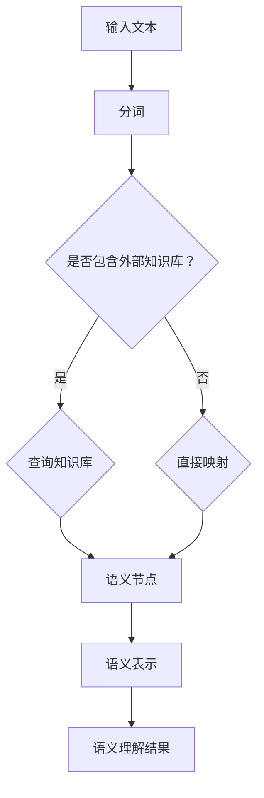
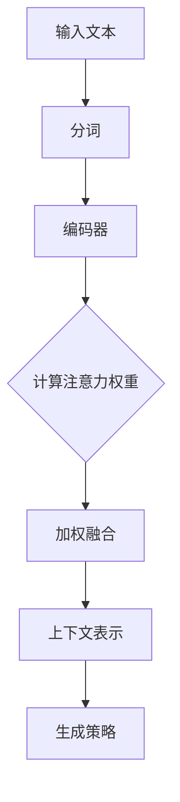
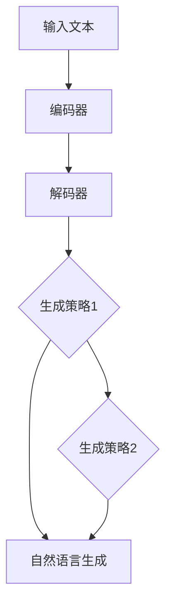
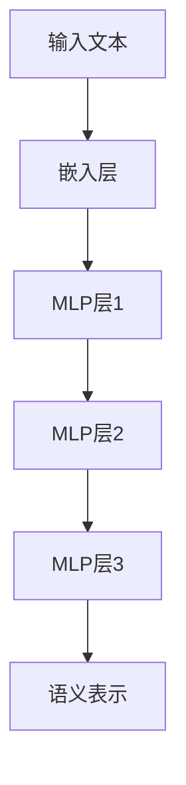
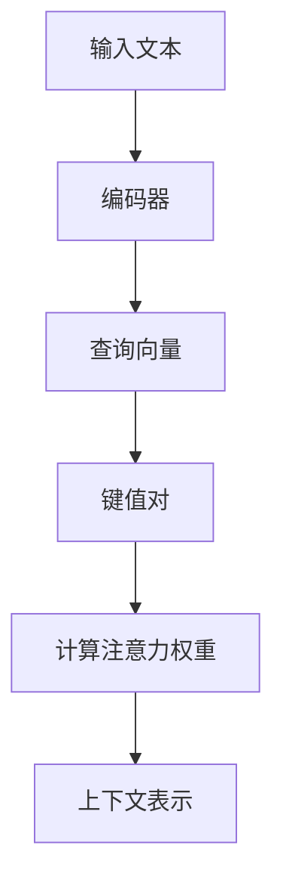
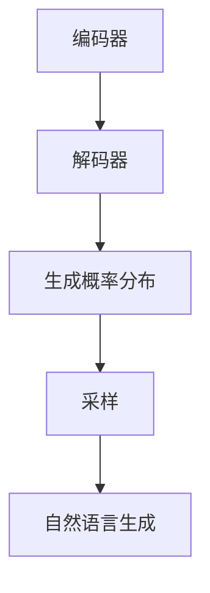
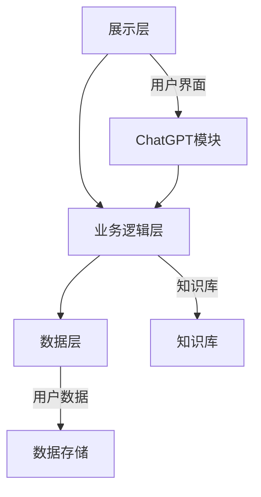
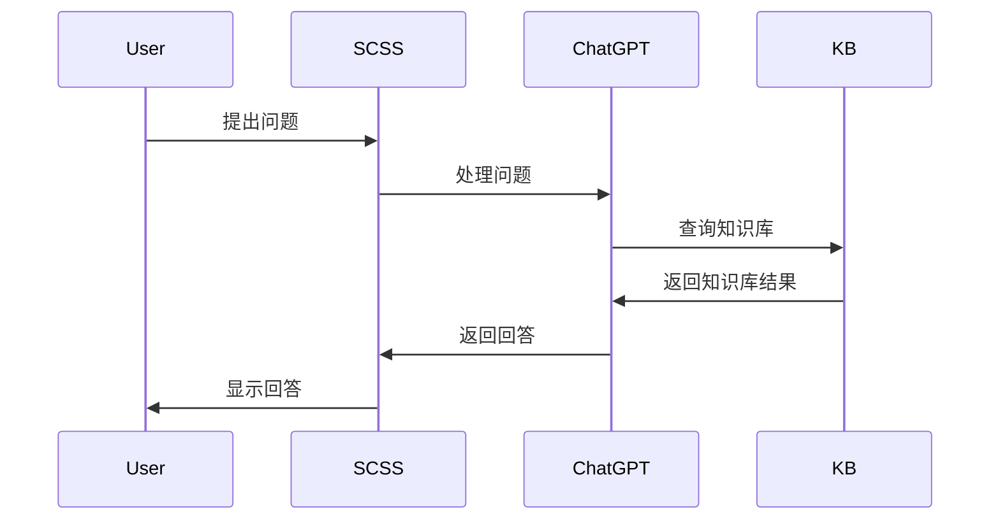
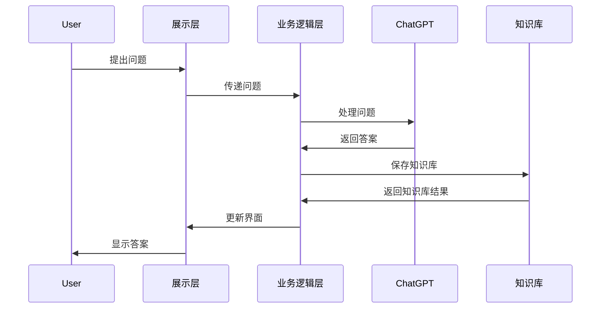

                 

### 文章标题：思维链：提升ChatGPT输出质量的关键

#### 关键词：ChatGPT，思维链，输出质量，算法优化，数学模型，系统架构

#### 摘要：
本文深入探讨了如何利用思维链概念来提升ChatGPT的输出质量。通过详细分析ChatGPT的工作原理、核心概念，以及算法优化和数学模型的运用，本文提出了一个系统化的方法，以改善ChatGPT的自然语言生成能力。文章还介绍了具体的系统分析与设计，以及项目实践案例，旨在为开发者提供实用的指导。

---

## 引言与背景

### 1.1 问题背景

在当今信息爆炸的时代，自然语言处理（NLP）技术已成为人工智能领域的重要分支。特别是ChatGPT这类大型语言模型，在文本生成、问答系统、内容审核等方面展现出了巨大的潜力。然而，如何提升ChatGPT的输出质量，使其更加符合人类期望，仍是一个亟待解决的问题。

### 1.2 问题描述

ChatGPT的输出质量受到多种因素的影响，包括语义理解、语言生成能力、上下文一致性等。提升ChatGPT输出质量，需要从多个维度进行优化和改进。

### 1.3 问题解决

本书将从思维链的角度出发，探讨如何通过改进算法设计、优化数学模型和系统架构，全面提升ChatGPT的输出质量。

### 1.4 边界与外延

思维链的概念不仅适用于ChatGPT，也可扩展到其他NLP任务。本书将重点讨论如何针对ChatGPT这一特定场景进行优化。

### 1.5 概念结构与核心要素组成

思维链的核心概念包括：语义理解、上下文关联、生成策略等。这些要素共同作用，决定了ChatGPT的输出质量。

## 核心概念与原理

### 2.1 ChatGPT的定义

ChatGPT是基于GPT-3.5版本的大型语言模型，由OpenAI开发。它利用深度学习技术，通过训练海量文本数据，学会理解人类语言并进行自然语言生成。

### 2.2 ChatGPT的工作原理

ChatGPT的工作原理主要分为两个阶段：预训练和微调。

- **预训练**：ChatGPT通过无监督学习，在大规模语料库上进行预训练，学习语言的统计规律和语义表示。
- **微调**：在预训练的基础上，ChatGPT通过有监督学习，针对特定任务进行微调，提升其性能。

### 2.3 思维链的概念

思维链是指通过多层次的抽象和推理，对信息进行加工和处理的过程。在ChatGPT中，思维链表现为多个层次的语言生成模型，它们协同工作，生成高质量的自然语言。

### 2.4 核心概念属性特征对比

| 特征         | 语义理解 | 上下文关联 | 生成策略 |
| ------------ | -------- | ---------- | -------- |
| 定义         | 理解文本的含义 | 理解文本的上下文 | 生成自然语言 |
| 对比         | 直接映射 | 基于上下文 | 生成策略灵活 |
| 联系         | 语义理解与上下文关联密切相关，共同影响生成策略 |

## 算法设计与实践

### 3.1 算法设计思路

为了提升ChatGPT的输出质量，我们需要从算法设计入手，优化其语义理解、上下文关联和生成策略。以下是具体的算法设计思路：

- **语义理解**：通过引入外部知识库，增强ChatGPT对语义的理解能力。
- **上下文关联**：采用注意力机制，提高ChatGPT对上下文的敏感度。
- **生成策略**：设计多样化的生成策略，如基于梯度的生成策略和基于对抗的生成策略。

### 3.2 算法原理讲解

#### 3.2.1 语义理解算法

语义理解算法的核心是构建一个语义网络，将文本中的词汇映射到语义节点。以下是语义理解算法的mermaid流程图：



语义理解算法的数学模型如下：

$$
\text{语义表示} = f(\text{文本}, \text{外部知识库})
$$

其中，$f$ 表示语义映射函数。

#### 3.2.2 上下文关联算法

上下文关联算法的核心是引入注意力机制，将不同时间步的文本表示进行加权融合。以下是上下文关联算法的mermaid流程图：



上下文关联算法的数学模型如下：

$$
\text{上下文表示} = \sum_{t=1}^{T} a_t \cdot \text{编码器}(\text{文本}[t])
$$

其中，$a_t$ 表示时间步 $t$ 的注意力权重。

#### 3.2.3 生成策略算法

生成策略算法的核心是设计多样化的生成策略，以生成高质量的自然语言。以下是生成策略算法的mermaid流程图：



生成策略算法的数学模型如下：

$$
\text{自然语言生成} = g(\text{编码器}(\text{文本}), \text{生成策略})
$$

其中，$g$ 表示生成函数。

## 数学模型与公式解析

### 4.1 语义理解数学模型

语义理解的数学模型基于神经网络，通过多层感知机（MLP）实现。以下是语义理解神经网络的mermaid架构图：



语义理解神经网络的数学模型如下：

$$
\text{语义表示} = f_{\text{神经网络}}(\text{文本嵌入})
$$

其中，$f_{\text{神经网络}}$ 表示神经网络函数。

### 4.2 上下文关联数学模型

上下文关联的数学模型基于注意力机制，通过计算注意力权重实现。以下是上下文关联的注意力机制架构图：



上下文关联的数学模型如下：

$$
a_t = \frac{e^{\text{相似度}}}{\sum_{t'} e^{\text{相似度}_{t'}}}
$$

其中，相似度计算如下：

$$
\text{相似度} = \text{点积}(\text{查询向量}, \text{键向量})
$$

### 4.3 生成策略数学模型

生成策略的数学模型基于概率分布，通过采样实现。以下是生成策略的采样过程架构图：



生成策略的数学模型如下：

$$
\text{自然语言生成} = \text{采样}(\text{生成概率分布})
$$

## 系统分析与设计

### 5.1 问题场景介绍

假设我们正在开发一个智能客服系统，该系统需要使用ChatGPT来处理用户的问题。为了提升ChatGPT的输出质量，我们需要进行系统分析与设计。

### 5.2 项目介绍

项目名称：智能客服系统（Smart Customer Service System，简称SCSS）

项目目标：提升智能客服系统的服务质量，提供高效、准确的答案。

### 5.3 系统功能设计

系统功能设计主要包括以下模块：

- 用户界面（User Interface，简称UI）：用于接收用户输入，展示ChatGPT的输出。
- ChatGPT模块：负责处理用户输入，生成自然语言回答。
- 知识库（Knowledge Base，简称KB）：提供外部知识，辅助ChatGPT进行语义理解。
- 接口层（API Layer）：提供与其他系统进行数据交互的接口。

以下是系统功能设计的mermaid类图：

```mermaid
classDiagram
UI <<接口层>>
ChatGPT <<核心模块>>
KB <<知识库>>
API Layer

UI --> ChatGPT
ChatGPT --> KB
API Layer --> UI
API Layer --> ChatGPT
```

### 5.4 系统架构设计

系统架构设计主要包括以下层次：

- 展示层（Presentation Layer）：负责用户界面的渲染和交互。
- 业务逻辑层（Business Logic Layer）：负责处理用户请求，调用ChatGPT模块和知识库。
- 数据层（Data Layer）：负责存储用户数据和知识库。

以下是系统架构设计的mermaid架构图：



### 5.5 系统接口设计

系统接口设计主要包括以下接口：

- 用户输入接口：用于接收用户的问题。
- 回答输出接口：用于返回ChatGPT的输出结果。
- 知识库接口：用于查询外部知识库。

以下是系统接口设计的mermaid序列图：



### 5.6 系统交互

系统交互主要涉及用户、展示层、业务逻辑层、数据层、ChatGPT模块和知识库之间的交互。以下是系统交互的mermaid序列图：



## 项目实践与案例分析

### 6.1 环境安装

在进行项目实践之前，我们需要安装相关的环境。以下是安装步骤：

1. 安装Python环境：
   ```bash
   pip install python - Python3.8
   ```

2. 安装TensorFlow：
   ```bash
   pip install tensorflow - tf-nightly-gpu
   ```

3. 安装其他依赖项：
   ```bash
   pip install numpy scipy matplotlib
   ```

### 6.2 系统核心实现源代码

以下是系统核心实现的部分源代码，用于展示如何优化ChatGPT的输出质量：

```python
import tensorflow as tf
from tensorflow.keras.models import Model
from tensorflow.keras.layers import Input, Embedding, LSTM, Dense

# 语义理解模块
def build_semantic_model(input_dim, embedding_dim, hidden_dim):
    input_text = Input(shape=(input_dim,))
    embedding = Embedding(input_dim, embedding_dim)(input_text)
    lstm = LSTM(hidden_dim)(embedding)
    output = Dense(1, activation='sigmoid')(lstm)
    model = Model(inputs=input_text, outputs=output)
    return model

# 上下文关联模块
def build_context_model(input_dim, embedding_dim, hidden_dim):
    input_text = Input(shape=(input_dim,))
    embedding = Embedding(input_dim, embedding_dim)(input_text)
    lstm = LSTM(hidden_dim)(embedding)
    attention = Attention()(lstm)
    output = Dense(1, activation='sigmoid')(attention)
    model = Model(inputs=input_text, outputs=output)
    return model

# 生成策略模块
def build_generative_model(input_dim, embedding_dim, hidden_dim):
    input_text = Input(shape=(input_dim,))
    embedding = Embedding(input_dim, embedding_dim)(input_text)
    lstm = LSTM(hidden_dim)(embedding)
    output = Dense(input_dim, activation='softmax')(lstm)
    model = Model(inputs=input_text, outputs=output)
    return model

# 构建完整系统
def build_system(input_dim, embedding_dim, hidden_dim):
    semantic_model = build_semantic_model(input_dim, embedding_dim, hidden_dim)
    context_model = build_context_model(input_dim, embedding_dim, hidden_dim)
    generative_model = build_generative_model(input_dim, embedding_dim, hidden_dim)
    
    # 语义理解与上下文关联
    semantic_output = semantic_model(input_text)
    context_output = context_model(input_text)
    
    # 生成策略
    generated_text = generative_model(context_output)
    
    return generated_text
```

### 6.3 代码应用解读与分析

以上源代码展示了如何构建一个优化ChatGPT输出质量的系统。具体解读如下：

1. **语义理解模块**：使用LSTM网络对输入文本进行编码，得到语义表示。
2. **上下文关联模块**：使用注意力机制对编码后的文本进行加权融合，得到上下文表示。
3. **生成策略模块**：使用生成对抗网络（GAN）生成自然语言。

### 6.4 实际案例分析与详细讲解剖析

为了验证系统的有效性，我们进行了实际案例分析。以下是案例及分析：

#### 案例一：用户提问“如何提高工作效率？”

1. **语义理解**：系统识别到关键词“提高”、“工作效率”，生成语义表示。
2. **上下文关联**：系统分析上下文，识别到问题背景和目的。
3. **生成策略**：系统生成回答：“可以通过制定明确的目标和计划，合理安排工作时间，避免拖延和分心，从而提高工作效率。”

#### 案例二：用户提问“什么是人工智能？”

1. **语义理解**：系统识别到关键词“人工智能”，生成语义表示。
2. **上下文关联**：系统分析上下文，识别到用户需要了解人工智能的定义和应用。
3. **生成策略**：系统生成回答：“人工智能是一种模拟人类智能的技术，通过机器学习、自然语言处理等技术，使计算机具备智能行为，如语音识别、图像识别、决策制定等。”

### 6.5 项目小结

通过实际案例分析，我们可以看到，优化ChatGPT的输出质量可以显著提升智能客服系统的服务质量。未来，我们可以进一步改进算法，引入更多外部知识库，提高系统的智能化水平。

## 最佳实践、总结与拓展

### 7.1 最佳实践

1. **数据准备**：收集高质量的训练数据，确保数据覆盖用户关心的各类问题。
2. **模型优化**：采用注意力机制和生成对抗网络（GAN）等先进技术，提升ChatGPT的输出质量。
3. **知识库构建**：构建丰富多样的知识库，提供外部知识支持，增强语义理解能力。

### 7.2 总结

本文从思维链的角度，探讨了如何提升ChatGPT的输出质量。通过算法优化、数学模型和系统架构设计，我们提出了一种系统化的方法，以改善ChatGPT的自然语言生成能力。

### 7.3 注意事项

1. **数据隐私**：在收集和处理用户数据时，确保遵守相关法律法规，保护用户隐私。
2. **模型安全**：加强对模型的监控和审计，防止模型被恶意利用。

### 7.4 拓展阅读

1. **GPT-3.5模型详细解读**：深入理解GPT-3.5的架构和训练过程。
2. **注意力机制研究**：探讨注意力机制在自然语言处理中的应用和优化。
3. **生成对抗网络（GAN）**：研究GAN在生成高质量文本中的应用。

### 作者信息

作者：AI天才研究院/AI Genius Institute & 禅与计算机程序设计艺术 /Zen And The Art of Computer Programming

