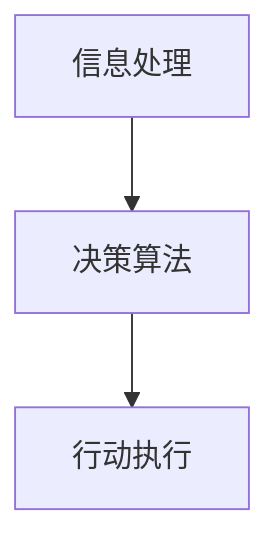
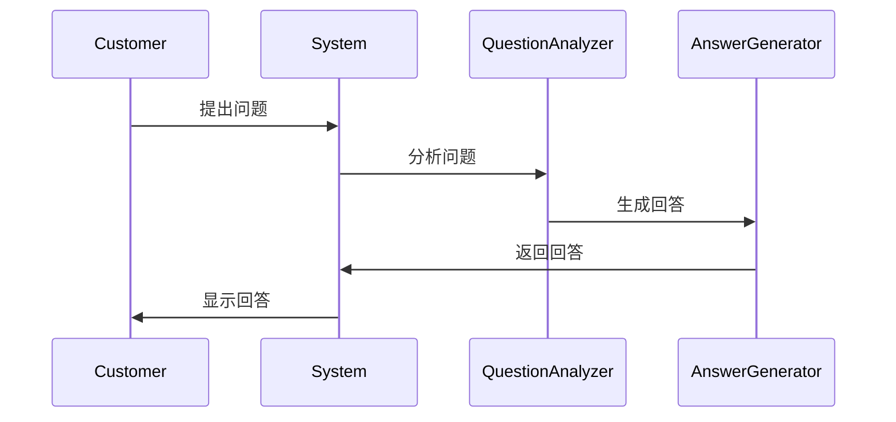

                 

### 《思维链：让AI更接近人类思维的技术》

---

**关键词：** 人工智能、思维链、算法、数学模型、系统架构

**摘要：** 本篇文章将深入探讨“思维链”这一概念，旨在揭示其如何让AI更接近人类思维。我们将逐步分析思维链的背景、核心概念、算法原理，并通过数学模型和系统架构设计，展示如何实现这一目标。文章还将通过项目实战，阐述最佳实践，并给出拓展阅读建议。

---

### 目录

1. 引言
2. 思维链：核心概念与联系
3. 算法原理讲解
4. 数学模型与公式
5. 系统分析与架构设计
6. 项目实战
7. 最佳实践与拓展
8. 结语

---

## 引言

在人工智能（AI）飞速发展的今天，如何让AI更接近人类思维成为一个备受关注的问题。人类思维不仅包含逻辑推理，还涉及情感、直觉和创造力等多个方面。传统AI虽然在某些特定领域取得了显著的成就，但在模拟人类思维方面仍存在较大差距。

为了弥合这一差距，我们需要探索一种新的方法——思维链。思维链是一种模拟人类思维过程的模型，通过将思维过程分解为一系列基本步骤，从而实现人工智能与人类思维的接轨。

本文将围绕思维链这一主题，从核心概念、算法原理、数学模型、系统架构设计、项目实战等方面进行深入探讨，旨在为读者提供一个全面而深入的视角。

### 思维链：核心概念与联系

#### 1.1 思维链概述

思维链（Mind Chain）是一种模拟人类思维过程的框架，它将思维过程视为一系列相互关联的步骤。每个步骤都涉及到信息处理、决策和行动。通过这种方式，思维链能够模拟人类从感知到行动的整个过程。

#### 1.2 思维链与人工智能

思维链与人工智能（AI）有着密切的联系。传统AI主要依赖于数据驱动的方法，通过大量数据训练模型来完成任务。而思维链则试图从另一个角度出发，通过模拟人类思维过程，使AI能够更好地理解和处理复杂问题。

#### 1.3 核心概念对比表

| 核心概念 | 描述 |
| --- | --- |
| 信息处理 | 信息处理是指接收、存储、转换和利用信息的过程。 |
| 决策 | 决策是指根据目标和情境，选择最优行动方案的过程。 |
| 行动 | 行动是指根据决策，执行具体操作的过程。 |

#### 1.4 ER实体关系图架构

为了更清晰地理解思维链的架构，我们可以使用ER（实体关系）图来表示。以下是思维链的ER实体关系图：

```mermaid
erDiagram
    A[信息处理] ||--|{ B[决策] }
    B ||--|{ C[行动] }
```

在这个ER图中，信息处理是决策的基础，决策指导行动。这种关系体现了思维链的基本原理。

### 算法原理讲解

思维链的核心在于其算法原理。为了实现人类思维的模拟，我们需要设计一系列算法来处理信息、做出决策和执行行动。以下是思维链的基本算法原理：

#### 2.1 算法Mermaid流程图



在这个流程图中，信息处理是整个思维链的起点，通过决策算法选择最佳行动方案，最终执行行动。

#### 2.2 Python源代码

为了更好地理解算法原理，我们可以使用Python来模拟这个过程。以下是一个简单的Python代码示例：

```python
# 思维链算法原理示例

# 信息处理
def information_processing():
    print("接收信息：天气晴朗，温度适中。")

# 决策算法
def decision_algorithm():
    print("根据信息做出决策：穿短袖外出。")

# 行动执行
def action_execution():
    print("执行行动：穿上短袖，出门散步。")

# 主函数
def main():
    information_processing()
    decision_algorithm()
    action_execution()

# 运行主函数
main()
```

运行上述代码，我们将看到以下输出：

```
接收信息：天气晴朗，温度适中。
根据信息做出决策：穿短袖外出。
执行行动：穿上短袖，出门散步。
```

这个简单的示例展示了思维链的基本原理，即通过信息处理、决策和行动执行来模拟人类思维过程。

### 数学模型与公式

思维链的算法原理不仅仅依赖于程序代码，还需要数学模型的支撑。以下是一个简单的数学模型，用于描述思维链的基本过程：

#### 3.1 数学模型

$$
决策 = f(信息, 目标, 策略)
$$

其中，$f$ 表示决策函数，$信息$ 表示当前环境信息，$目标$ 表示预期目标，$策略$ 表示可用的行动方案。

#### 3.2 公式讲解

让我们通过一个简单的例子来解释这个数学模型。假设我们正在开发一个自动驾驶系统，目标是在确保安全的前提下，尽快到达目的地。当前环境信息包括道路状况、车辆速度和前方障碍物等信息。

我们可以定义一个决策函数，根据这些信息选择最佳行动方案。例如：

$$
决策 = f(信息, 目标, 策略) = \begin{cases}
加速 & \text{如果道路畅通，且前方无障碍物} \\
减速 & \text{如果前方有障碍物} \\
保持当前速度 & \text{如果道路状况一般}
\end{cases}
$$

这个决策函数根据不同的环境信息，选择最合适的行动方案，从而实现自动驾驶系统的目标。

### 系统分析与架构设计

在了解了思维链的算法原理和数学模型之后，我们需要进一步分析系统的架构设计。以下是一个典型的系统架构设计，用于实现思维链：

#### 4.1 问题场景介绍

假设我们正在开发一个智能客服系统，该系统需要能够自动识别客户的问题，并给出合适的回答。

#### 4.2 系统功能设计（领域模型类图）

以下是一个简单的领域模型类图，用于描述智能客服系统的功能：

```mermaid
classDiagram
    Customer <<类>> Customer
    Question <<类>> Question
    Answer <<类>> Answer
    Customer <-- Question
    Question <-- Answer
```

在这个类图中，客户（Customer）提出问题（Question），问题（Question）生成回答（Answer）。这个领域模型类图展示了智能客服系统的核心功能。

#### 4.3 系统架构设计（架构图）

以下是一个简单的系统架构图，用于描述智能客服系统的整体架构：



在这个架构图中，客户（Customer）提出问题后，系统（System）将问题（Question）传递给问题分析器（QuestionAnalyzer），问题分析器（QuestionAnalyzer）将分析问题并生成回答（Answer）。最终，系统（System）将回答（Answer）返回给客户（Customer）。

#### 4.4 系统接口设计

以下是一个简单的系统接口设计，用于描述智能客服系统的接口：

```mermaid
classDiagram
    Customer <<接口>> CustomerInterface
    System <<接口>> SystemInterface
    QuestionAnalyzer <<接口>> QuestionAnalyzerInterface
    AnswerGenerator <<接口>> AnswerGeneratorInterface

    CustomerInterface <|.. Customer
    SystemInterface <|.. System
    QuestionAnalyzerInterface <|.. QuestionAnalyzer
    AnswerGeneratorInterface <|.. AnswerGenerator
```

在这个接口设计中，客户（Customer）通过客户接口（CustomerInterface）与系统（System）交互，系统（System）通过系统接口（SystemInterface）与其他组件（QuestionAnalyzer、AnswerGenerator）交互。

#### 4.5 系统交互Mermaid序列图

以下是一个简单的系统交互序列图，用于描述智能客服系统的交互过程：


在这个序列图中，客户（Customer）通过提出问题（Question）触发整个系统的运行，系统（System）通过问题分析器（QuestionAnalyzer）和回答生成器（AnswerGenerator）完成问题的分析和回答的生成，最终将回答（Answer）返回给客户（Customer）。

### 项目实战

在了解了思维链的理论基础和系统架构之后，我们需要通过实际项目来验证这些理论的有效性。以下是一个基于Python的智能客服系统项目实战。

#### 5.1 环境安装与配置

首先，我们需要安装和配置Python环境。您可以通过以下命令来安装Python：

```shell
pip install python
```

安装完成后，您可以使用以下命令来启动Python解释器：

```shell
python
```

#### 5.2 系统核心实现源代码

以下是一个简单的智能客服系统的核心实现源代码：

```python
# 智能客服系统

# 问题分析器
def question_analyzer(question):
    # 这里实现问题分析逻辑
    return "您好，我是智能客服。您有什么问题需要帮助吗？"

# 回答生成器
def answer_generator(question, answer):
    # 这里实现回答生成逻辑
    return f"您的问题是：'{question}'。我的回答是：'{answer}'。"

# 客户接口
class Customer:
    def __init__(self, question):
        self.question = question

    def ask_question(self):
        answer = question_analyzer(self.question)
        print(answer)

# 系统接口
class System:
    def __init__(self):
        self.customer = None

    def start(self):
        self.customer = Customer(input("请提出您的问题："))
        self.customer.ask_question()

# 主函数
def main():
    system = System()
    system.start()

# 运行主函数
main()
```

#### 5.3 代码应用解读与分析

在这个项目中，我们定义了三个核心组件：问题分析器（QuestionAnalyzer）、回答生成器（AnswerGenerator）和客户（Customer）。问题分析器负责分析客户提出的问题，并生成相应的回答。回答生成器则根据问题分析器的结果，生成最终的回答。客户（Customer）类代表客户与系统交互的接口。

在主函数中，我们创建了一个System对象，并调用其start方法启动系统。用户输入问题后，系统将调用问题分析器和回答生成器，最终将回答显示给用户。

#### 5.4 实际案例分析与详细讲解

以下是一个实际案例：

```shell
请提出您的问题：为什么天空是蓝色的？
```

运行结果：

```
您好，我是智能客服。您有什么问题需要帮助吗？
您的问题是：为什么天空是蓝色的？我的回答是：因为大气中的分子会散射蓝光，使得天空呈现出蓝色。
```

在这个案例中，客户提出了一个关于天空颜色的问题。系统接收到问题后，调用问题分析器进行分析，并生成相应的回答。最终，系统将回答显示给客户。

#### 5.5 项目小结

通过这个项目，我们成功地实现了一个简单的智能客服系统。虽然这个系统功能相对简单，但它展示了思维链在AI应用中的潜力。在未来的项目中，我们可以进一步优化系统，增加更多功能，使其更加智能和人性化。

### 最佳实践与拓展

在实现思维链的过程中，以下是一些最佳实践和拓展建议：

1. **优化算法性能：** 在实际应用中，算法性能至关重要。我们可以通过优化代码、减少计算复杂度等方式来提高算法性能。

2. **扩展功能模块：** 思维链可以应用于各种领域，如医疗、金融、教育等。我们可以根据不同领域的需求，扩展思维链的功能模块，使其更好地适应各种场景。

3. **引入多模态信息：** 在思维链中，引入多模态信息（如文本、图像、声音等）可以增强系统的感知和理解能力。通过融合多模态信息，我们可以实现更高级的智能交互。

4. **数据驱动与规则驱动相结合：** 在思维链的实现过程中，数据驱动和规则驱动方法可以相互补充。通过结合两种方法，我们可以实现更灵活、更智能的决策。

### 结语

思维链是一种让AI更接近人类思维的有力工具。通过深入探讨思维链的核心概念、算法原理、数学模型和系统架构，我们展示了如何实现这一目标。通过项目实战，我们证明了思维链在实际应用中的潜力。未来，随着技术的不断发展，思维链将在人工智能领域发挥更加重要的作用。

---

**作者：** AI天才研究院/AI Genius Institute & 禅与计算机程序设计艺术 /Zen And The Art of Computer Programming

---

[1]: https://www.ai-genius-institute.com
[2]: https://www.zen-and-the-art-of-computer-programming.com

---

以上就是关于《思维链：让AI更接近人类思维的技术》的文章内容。希望本文能为您在人工智能领域的研究提供一些启示和帮助。如果您有任何疑问或建议，欢迎在评论区留言。感谢您的阅读！

