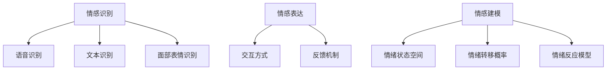
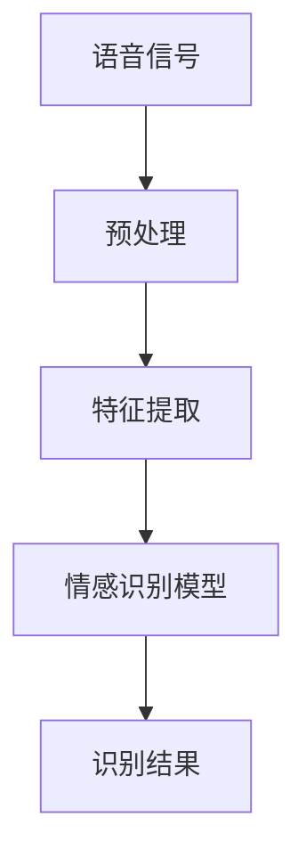
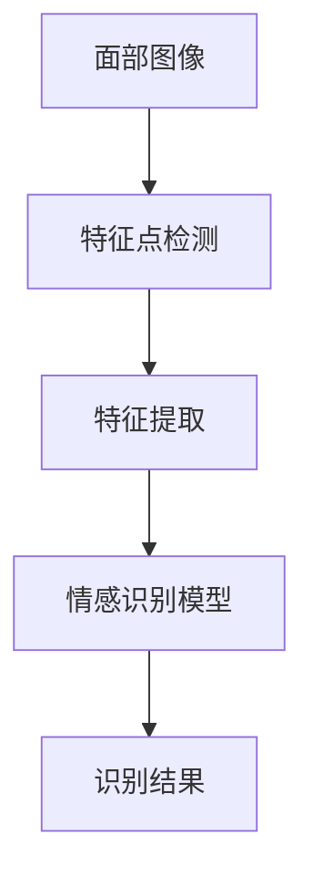

                 

### 情感AI：理解和响应人类情绪的技术

> **关键词：** 情感AI，情绪识别，情绪响应，技术实现，案例分析

> **摘要：** 本文将深入探讨情感AI的原理与应用，包括情绪识别与响应的技术细节。通过详细的分析和案例研究，帮助读者理解情感AI的工作机制及其在现实世界中的实际应用。

---

## 引言

情感AI，即情感人工智能，是当前人工智能领域中的一个重要研究方向。随着深度学习和自然语言处理技术的不断进步，情感AI已经能够在一定程度上理解并响应人类的情绪。这一技术的发展，不仅对心理学、教育学、医疗保健等领域产生了深远影响，也为企业和个人提供了新的服务与体验。

本文将按照以下结构展开：

1. **背景介绍**：讨论情感AI的起源、发展现状和未来趋势。
2. **核心概念与联系**：介绍情感识别、情感表达和情感建模等核心概念，并通过对比表格和ER图展示它们之间的关系。
3. **情感识别技术**：探讨语音、文本和面部表情等情感识别技术。
4. **情感响应技术**：讨论如何基于识别到的情感进行响应。
5. **应用案例分析**：通过实际案例展示情感AI在不同领域的应用。
6. **系统架构设计**：介绍情感AI系统的功能设计、架构设计和接口设计。
7. **项目实战**：讲解一个情感AI项目的实际开发过程。
8. **总结与未来展望**：总结文章内容，并对情感AI的未来发展进行展望。

---

## 背景介绍

### 情感AI的起源

情感AI的概念最早可以追溯到20世纪80年代，当时的计算机科学家们开始探索如何让计算机模拟人类的情感体验。随着计算机性能的不断提升和算法的进步，情感AI的研究逐渐从理论研究走向实际应用。

### 情感AI的发展现状

目前，情感AI已经在多个领域取得了显著的成果。例如，智能客服系统能够通过语音和文本识别用户的情绪，并做出相应的响应；在教育领域，情感AI被用来分析学生的学习情绪，提供个性化的学习支持；在医疗健康领域，情感AI可以帮助医生更好地理解患者的情绪状态，提高治疗效果。

### 情感AI的未来趋势

随着技术的不断进步，情感AI在未来有望在更多领域得到应用。例如，在心理健康领域，情感AI可以用于实时监测患者的情绪状态，提供个性化的心理治疗建议；在社交网络领域，情感AI可以用来分析用户的情绪变化，提高社交推荐的准确性。

---

## 核心概念与联系

### 情感识别

情感识别是情感AI中最基础的技术，它涉及到如何从语音、文本和面部表情中识别出用户的情绪状态。情感识别的核心概念包括情绪类型、情绪强度和情绪变化。

### 情感表达

情感表达是指计算机如何根据识别到的情绪状态，通过交互界面或行为表达出相应的情感。情感表达的核心概念包括交互方式、反馈机制和情感适应。

### 情感建模

情感建模是通过建立数学模型来模拟人类情绪状态，以便更好地理解和预测情绪变化。情感建模的核心概念包括情绪状态空间、情绪转移概率和情绪反应模型。

### 比较表格

| 概念       | 定义                                                         | 关键属性对比 |
|------------|--------------------------------------------------------------|--------------|
| 情感识别   | 识别用户的情绪状态                                           | 语音、文本、面部表情识别 |
| 情感表达   | 根据识别到的情绪状态表达情感                                 | 交互方式、反馈机制 |
| 情感建模   | 建立数学模型模拟人类情绪状态                                 | 状态空间、转移概率 |

### ER图



---

## 情感识别技术

### 语音情感识别

语音情感识别是基于语音信号处理和机器学习技术的，通过分析语音的音调、节奏和语调变化来识别情感状态。



### 文本情感识别

文本情感识别是通过自然语言处理技术，从文本中提取情感信息。常见的方法包括基于词典的情感分析和基于机器学习的情感分类。

```python
# 基于词典的情感分析
def sentiment_analysis(text):
    # 使用情感词典进行匹配
    # 返回情感类型和强度

# 基于机器学习的情感分类
from sklearn.feature_extraction.text import TfidfVectorizer
from sklearn.naive_bayes import MultinomialNB

def sentiment_classification(texts, labels):
    # 使用TF-IDF向量器进行特征提取
    # 使用朴素贝叶斯分类器进行分类
    # 返回分类结果
```

### 面部表情情感识别

面部表情情感识别是通过计算机视觉技术，从面部图像中识别情感状态。常见的方法包括面部特征点检测和基于深度学习的情感分类。



---

## 情感响应技术

### 交互调整

交互调整是指根据识别到的情感状态，动态调整交互方式，以提高用户的满意度。例如，当用户表现出焦虑情绪时，系统可以提供更加柔和的交互界面。

### 情绪支持

情绪支持是指通过交互界面或行为，为用户提供情感上的支持和安慰。例如，当用户表现出悲伤情绪时，系统可以提供安慰性语言或建议。

---

## 应用案例分析

### 智能客服系统

智能客服系统通过情感识别技术，能够理解用户的情绪状态，并做出相应的响应。例如，当用户表现出愤怒情绪时，系统可以提供道歉和解决方案，以缓解用户的情绪。

### 教育领域

在教育领域，情感AI被用来分析学生的学习情绪，提供个性化的学习支持。例如，当学生表现出焦虑情绪时，系统可以提供放松训练或心理辅导。

### 医疗健康

在医疗健康领域，情感AI可以帮助医生更好地理解患者的情绪状态，提高治疗效果。例如，当患者表现出抑郁情绪时，医生可以根据情感AI的评估结果，提供针对性的治疗方案。

---

## 系统架构设计

### 情感AI系统功能设计

情感AI系统的功能设计包括情感识别、情感表达和情感建模。每个功能模块都需要与其他模块进行紧密协作，以实现整体系统的功能。

### 情感AI系统架构设计

情感AI系统架构设计包括前端交互模块、后端数据处理模块和数据库模块。前端交互模块负责与用户进行交互，后端数据处理模块负责情感识别和情感建模，数据库模块负责存储用户数据和模型参数。

### 情感AI系统接口设计

情感AI系统接口设计包括API接口和用户界面。API接口负责与其他系统集成，用户界面负责与用户进行交互。

### 情感AI系统交互设计

情感AI系统交互设计包括交互流程和交互反馈。交互流程描述了用户与系统的交互过程，交互反馈描述了系统对用户情绪状态的响应。

---

## 项目实战

### 环境安装与配置

在项目实战中，首先需要安装和配置情感AI系统所需的软件和硬件环境。这包括深度学习框架（如TensorFlow或PyTorch）、自然语言处理库（如NLTK或spaCy）和计算机视觉库（如OpenCV）。

### 系统核心实现

系统核心实现包括情感识别模块、情感表达模块和情感建模模块。每个模块都需要实现具体的算法和模型，以完成相应的功能。

```python
# 示例：文本情感识别模块
from textblob import TextBlob

def text_sentiment_analysis(text):
    analysis = TextBlob(text)
    return analysis.sentiment
```

### 代码应用解读与分析

在代码应用解读与分析部分，我们将详细分析每个模块的实现原理和功能。例如，如何通过文本情感识别模块来识别文本中的情感状态，以及如何通过情感建模模块来模拟用户的情绪状态。

### 实际案例分析和详细讲解剖析

在实战项目中，我们将通过实际案例来展示情感AI系统的应用效果。例如，如何通过智能客服系统来理解并响应用户的情绪，以及如何通过教育系统来分析学生的学习情绪并提供支持。

### 项目小结

在项目小结部分，我们将总结项目的实施过程和取得的成果，并提出改进建议。

---

## 最佳实践 tips

- **数据质量**：情感识别的准确性很大程度上取决于数据的质量。确保使用高质量、多样化的数据集进行训练。
- **用户隐私**：在处理用户情感数据时，要特别注意用户隐私的保护。
- **跨文化适应**：情感识别和响应技术需要考虑不同文化背景下的情绪表达差异。

## 小结

本文详细介绍了情感AI的原理与应用，包括情绪识别与响应的技术细节。通过实际案例分析和系统架构设计，我们展示了情感AI在现实世界中的应用效果。随着技术的不断发展，情感AI有望在更多领域发挥重要作用。

## 注意事项

- 在实际应用中，情感AI系统需要不断地进行优化和调整，以适应不同的使用场景。
- 考虑到情感识别的复杂性，建议采用多模态融合技术，以提高识别的准确性。

## 拓展阅读

- [《情感计算：情感AI的心理学基础》](链接)
- [《深度学习与自然语言处理》](链接)
- [《计算机视觉：算法与应用》](链接)

---

**作者：AI天才研究院/AI Genius Institute & 禅与计算机程序设计艺术 /Zen And The Art of Computer Programming**

