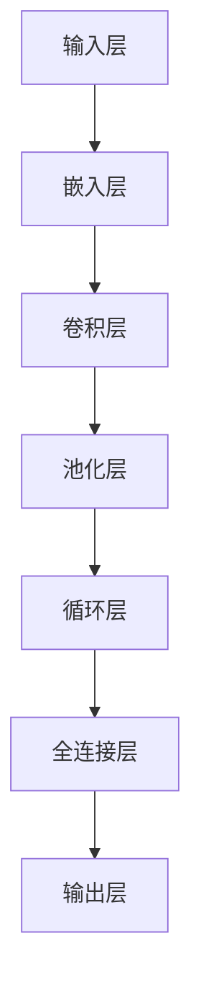
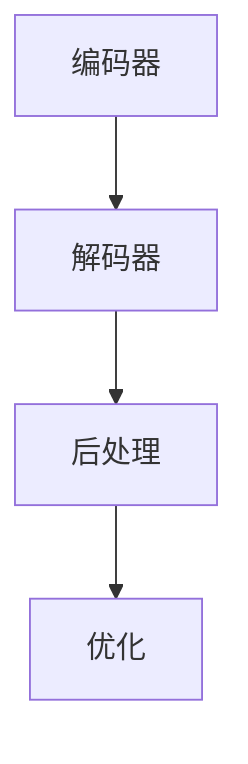
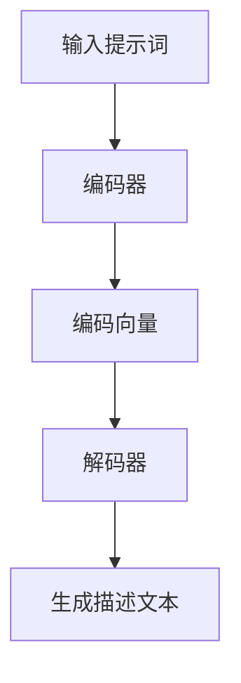
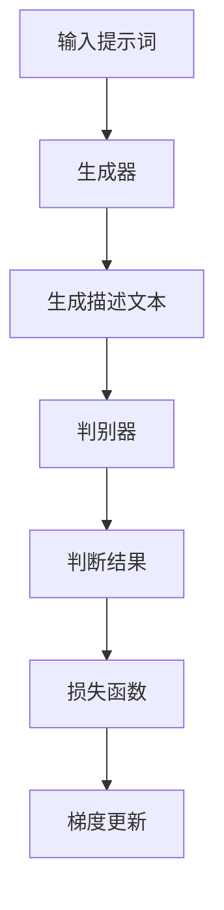

                 

### 引言

在科技飞速发展的今天，人工智能（AI）已经渗透到我们生活的方方面面。从自动驾驶、智能语音助手，到医疗诊断和金融分析，AI的应用范围不断扩大。与此同时，咖啡作为全球最受欢迎的饮品之一，其文化底蕴和消费需求同样不容忽视。将AI技术与咖啡调配相结合，不仅能为消费者带来更加个性化和多样化的体验，还能为咖啡行业带来创新和竞争力。

#### 问题背景与目标

创意咖啡调配，尤其是风味描述和搭配设计，是一项复杂且具有挑战性的任务。传统上，这主要依赖于咖啡师的经验和直觉。然而，随着消费者对个性化需求的追求，以及市场竞争的加剧，单靠人工难以满足多样化的需求。AI技术的介入，有望解决这一难题，通过智能化的风味描述和搭配设计，提升咖啡调配的效率和创意度。

本文的目标是探讨如何利用AI技术提升创意咖啡调配过程，特别是通过风味描述和搭配设计的提示词设计来实现这一目标。我们将从以下几个角度展开讨论：

1. **AI与咖啡调配概述**：介绍AI在咖啡行业中的应用场景，探讨其面临的挑战与机遇。
2. **风味描述与感官分析**：分析咖啡风味的基本要素，介绍感官分析在风味描述中的应用，以及AI模型如何进行风味描述。
3. **提示词设计与算法原理**：阐述提示词的定义、设计方法和算法原理，以及其在创意咖啡调配中的作用。
4. **案例研究**：通过实际案例展示AI创意咖啡调配的效果和实现过程。
5. **最佳实践**：总结AI创意咖啡调配的最佳实践，为实际应用提供指导。
6. **小结与展望**：总结本文的核心内容，展望AI创意咖啡调配的未来发展趋势。

通过本文的讨论，我们希望为读者提供一种全新的视角，理解如何利用AI技术提升咖啡调配的创意性和个性化，从而推动咖啡行业的创新与发展。

#### 创意咖啡与AI的结合

创意咖啡的兴起源于消费者对个性化、多样化饮品需求的不断增长。从传统的卡布奇诺、拿铁，到如今琳琅满目的定制咖啡，咖啡文化正经历着前所未有的变革。然而，这种变革也带来了新的挑战：如何通过个性化的调配，满足消费者多样化的口味需求，同时保持高效率和稳定性？

AI技术的引入，为解决这一难题提供了新的思路和可能性。首先，AI能够通过大数据分析和机器学习，对海量的咖啡配方进行深度挖掘和分析，从而发现潜在的风味组合和搭配规律。这种智能化的分析，不仅能够提高配方推荐的准确性和效率，还能够为咖啡师提供有价值的参考，帮助他们在短时间内设计出满足消费者需求的个性化饮品。

其次，AI在咖啡品质检测和自动化制作方面也展现了巨大的潜力。利用图像识别和传感器技术，AI可以实时监控咖啡的萃取过程，确保每一杯咖啡的品质一致。同时，智能咖啡机的普及，使得咖啡制作过程实现了自动化和高效化，大大提高了生产效率，降低了人力成本。

然而，AI创意咖啡调配也面临一些挑战。首先，风味描述是一个复杂且主观的过程，不同人对同一款咖啡的感受可能大相径庭。如何让AI准确地捕捉和描述咖啡的风味，是一个需要深入探讨的问题。其次，搭配设计需要考虑到各种咖啡豆的口味和特性，如何通过算法实现智能化的搭配，也是一个技术难题。

尽管如此，AI在解决这些难题中具有明显的优势。通过不断的数据积累和算法优化，AI可以逐渐提高风味描述的准确性，以及搭配设计的创意性和实用性。此外，AI的自主学习能力，使得其能够不断改进和优化，以适应不断变化的市场需求。

总之，AI与创意咖啡的结合，不仅能够提升咖啡调配的效率和质量，还能为消费者带来全新的体验。这种创新不仅有望推动咖啡行业的发展，也将为其他消费品行业提供有益的借鉴。在接下来的章节中，我们将深入探讨AI在创意咖啡调配中的应用，分析其面临的挑战与机遇，以及如何通过提示词设计实现更智能化的调配过程。

### AI与咖啡调配概述

AI技术在咖啡行业中的应用正逐步深入，涵盖了咖啡配方推荐、品质检测以及自动化制作等多个方面，每一个应用场景都为提升咖啡调配的效率和创意度提供了强有力的支持。

首先，**咖啡配方智能推荐系统**是AI在咖啡行业中的一个重要应用。这一系统通过分析消费者的历史订单、口味偏好以及各种咖啡豆的特性，为消费者提供个性化的咖啡推荐。其工作原理通常包括以下几个步骤：数据收集与处理、用户偏好分析、配方生成和推荐。具体来说，系统会首先收集大量的咖啡配方数据，通过数据清洗和预处理，提取出关键信息。接着，利用机器学习算法，如协同过滤、决策树和神经网络等，对用户的口味偏好进行分析和建模。最后，根据用户的个性化需求，系统会生成合适的咖啡配方并进行推荐。

其次，**咖啡品质智能检测**也是AI技术在咖啡行业中的重要应用之一。咖啡的品质受到多种因素的影响，如烘焙程度、豆子的新鲜度、萃取时间和比例等。传统的检测方法主要依赖于人工判断，存在主观性和误差。而AI技术可以通过图像识别、传感器和大数据分析等技术，实现咖啡品质的自动化检测。例如，利用图像识别技术，可以检测咖啡豆的外观特征，判断其是否新鲜；通过传感器，可以实时监控咖啡的萃取过程，确保其达到最佳状态。这些技术不仅提高了检测的准确性和效率，还降低了人力成本。

此外，**智能咖啡机与咖啡自动化**也是AI在咖啡行业中的一大亮点。智能咖啡机通过集成AI技术，可以实现咖啡制作的全自动化。这些咖啡机通常配备了多种传感器和智能控制系统，能够根据用户的订单自动调整烘焙程度、萃取时间和比例，确保每一杯咖啡都符合标准。此外，智能咖啡机还可以与云端服务器连接，实现远程监控和维护，提高了设备的管理效率和用户体验。

尽管AI技术在咖啡行业中展现了巨大的潜力，但同时也面临着一些挑战。首先，**风味描述的难题**是一个亟待解决的问题。咖啡的风味复杂多变，受到豆种、产地、烘焙程度等多种因素的影响，不同人对同一款咖啡的描述可能完全不同。如何让AI准确地捕捉和描述咖啡的风味，是当前技术面临的一个重要挑战。

其次，**搭配设计的复杂性**也是一个不容忽视的问题。咖啡的搭配设计需要考虑到各种咖啡豆的口味和特性，如何通过算法实现智能化的搭配，既保持创意性，又符合消费者的口味，是一个需要深入探讨的问题。此外，**数据隐私和安全**也是AI在咖啡行业应用中需要关注的重要问题。消费者对于个人数据的隐私和安全非常重视，如何保护用户数据的安全和隐私，是AI技术在实际应用中需要考虑的关键因素。

然而，AI技术在解决这些难题中具有明显的优势。通过不断的数据积累和算法优化，AI可以逐渐提高风味描述的准确性，以及搭配设计的创意性和实用性。此外，AI的自主学习能力，使得其能够不断改进和优化，以适应不断变化的市场需求。例如，基于深度学习的风味描述模型，可以通过大量的训练数据，学习到不同风味特征的规律，从而实现更准确的描述。而基于强化学习的搭配设计算法，则可以通过与用户互动，不断调整和优化搭配方案，提高用户满意度。

总之，AI技术在咖啡行业中的应用，不仅能够提升咖啡调配的效率和质量，还能为消费者带来全新的体验。尽管面临一些挑战，但通过不断创新和优化，AI技术有望在未来的发展中发挥更加重要的作用，推动咖啡行业的持续创新与发展。

### 风味描述与感官分析

咖啡的风味描述是一个复杂且具有主观性的过程，不同人对同一杯咖啡的感受可能会有显著差异。这种差异不仅源于个人的口味偏好，还受到咖啡豆的品种、产地、烘焙程度以及萃取方法等多种因素的影响。为了更好地捕捉和描述咖啡的风味，我们引入了感官分析这一工具。

#### 咖啡风味的组成要素

咖啡的风味主要由以下几个基本要素组成：

1. **酸度**：酸度是咖啡口感中的一个重要特征，它能够增加咖啡的清新感和层次感。酸度的来源包括咖啡豆中的有机酸，如柠檬酸和苹果酸。
2. **甜度**：甜度可以平衡咖啡的苦味，使其口感更加圆润。咖啡中的甜味主要来自糖类和某些糖醇，如果糖和葡萄糖。
3. **苦味**：苦味是咖啡风味中不可或缺的一部分，通常与咖啡豆中的咖啡因和黄酮类化合物有关。
4. **口感的厚度**：咖啡的口感厚度通常被称为“体重”，它由咖啡豆中的脂肪和蛋白质含量决定，影响咖啡的顺滑度。
5. **香气**：香气是咖啡的风味中非常重要的一个方面，它能够传达出咖啡豆的品种、产地和烘焙程度等信息。香气由咖啡豆中的挥发性化合物构成。

#### 影响咖啡风味的关键因素

除了基本的风味要素外，以下因素也会显著影响咖啡的风味：

1. **豆种**：不同种类的咖啡豆具有不同的风味特征。例如，阿拉比卡豆通常具有酸度和甜味，而罗布斯塔豆则更侧重于苦味和口感厚度。
2. **产地**：咖啡豆的产地会对其风味产生重要影响。不同地区的气候和土壤条件，使得咖啡豆的风味特征有所不同。例如，埃塞俄比亚的咖啡豆以其明亮和水果风味著称，而哥伦比亚的咖啡豆则以其平衡和优雅的风味受到喜爱。
3. **烘焙程度**：烘焙程度会改变咖啡豆的化学成分，从而影响其风味。浅烘焙的咖啡豆通常具有更高的酸度和香气，而深烘焙的咖啡豆则更侧重于苦味和口感厚度。
4. **萃取方法**：不同的萃取方法（如滴滤、意式浓缩、法式压滤等）会影响咖啡的风味和口感。例如，意式浓缩通常提取出更浓郁和浓稠的咖啡，而滴滤咖啡则更清爽和轻盈。

#### 感官分析在风味描述中的应用

感官分析是一种通过人类感官系统对食品风味进行评估的方法。在咖啡风味描述中，感官分析具有重要作用。以下是一些感官分析的常用方法：

1. **描述性风味分析**：这种方法通过一系列预定义的词汇来描述咖啡的风味特征。这些词汇通常涵盖酸度、甜度、苦味、口感的厚度和香气等多个方面。描述性风味分析有助于标准化和系统化咖啡的风味评估，使得不同人对同一杯咖啡的描述具有一致性。
   
2. **轮廓分析**：轮廓分析是通过描绘风味特征在多维空间中的分布图，来识别和比较不同咖啡的风味差异。这种方法利用统计方法，如主成分分析（PCA），将多个风味特征进行降维，从而在较低维度上展示风味特征之间的关系。

3. **感官品质评分**：这种方法通过量化评估者的感官体验，为咖啡的风味评分。评分通常基于10分制或5分制，评估者根据预定义的评分标准，对咖啡的各个风味特征进行评分。

#### 感官分析在咖啡品鉴中的应用

咖啡品鉴是一种通过感官分析来评估咖啡质量的过程。在咖啡品鉴中，感官分析的应用主要体现在以下几个方面：

1. **初步评估**：在咖啡品鉴的初期，评估者通过观察咖啡的外观（如颜色、纹理和香气）来初步判断其质量。这一步骤有助于筛选出不符合标准的咖啡豆。

2. **香气评估**：香气是咖啡风味中最重要的特征之一。评估者通过嗅闻咖啡豆和冲泡后的咖啡，来识别其中的香气成分。常见的香气描述词汇包括水果、坚果、花香、巧克力等。

3. **口感评估**：口感评估是咖啡品鉴的核心部分。评估者通过品尝咖啡，感受其酸度、甜度、苦味和口感的厚度。口感评估不仅关注当前的风味特征，还会考虑风味在口中的持久性和变化。

4. **整体评分**：在完成初步评估和香气、口感评估后，评估者会给出一个整体评分，综合评价咖啡的风味和质量。

通过感官分析和咖啡品鉴，我们可以更准确地描述和评估咖啡的风味。这不仅有助于提高咖啡调配的创意性和个性化，还能为消费者提供更好的消费体验。在接下来的章节中，我们将进一步探讨如何利用AI技术进行风味描述，以及如何设计提示词来优化这一过程。

#### 风味描述的AI模型

在咖啡调配过程中，准确的风味描述是关键，而AI技术的发展为这一难题提供了新的解决方案。目前，风味描述的AI模型主要基于深度学习和自然语言处理技术，通过大量的数据训练，能够自动生成对咖啡风味的详细描述。

首先，**基于深度学习的风味描述模型**是当前应用最广泛的一类。这些模型通常采用卷积神经网络（CNN）和循环神经网络（RNN）等深度学习架构，通过处理大量的风味描述数据，学习到风味特征之间的关联和模式。以下是一个典型的基于深度学习的风味描述模型的工作流程：

1. **数据预处理**：首先对风味描述数据集进行预处理，包括数据清洗、去噪和特征提取。这一步骤的目的是确保输入数据的准确性和一致性。
2. **模型训练**：使用预处理后的数据集，通过训练CNN或RNN模型，使其能够识别和生成风味描述。训练过程中，模型会通过反向传播算法不断调整权重，优化预测结果。
3. **模型评估与调优**：在模型训练完成后，通过交叉验证和测试集评估模型的性能。常用的评估指标包括准确率、召回率和F1值等。根据评估结果，进一步调整模型参数，优化模型的性能。

在具体实现上，一个典型的基于深度学习的风味描述模型可能包括以下几个模块：

- **输入层**：接收原始的风味描述文本。
- **嵌入层**：将文本转换为固定长度的向量表示。
- **卷积层**：提取文本中的局部特征。
- **池化层**：减少特征维度，增强模型对噪声的鲁棒性。
- **循环层**：捕捉文本中的长期依赖关系。
- **输出层**：生成风味描述的文本。

以下是一个基于深度学习的风味描述模型的大致架构：

通过以上架构，模型能够自动从原始文本中提取风味特征，并生成详细的风味描述。例如，对于一杯具有“坚果”和“巧克力”风味的咖啡，模型可以生成如下描述：

> 这杯咖啡散发着浓郁的坚果香气，伴随着柔和的巧克力风味，口感丝滑而醇厚。

相比深度学习模型，**基于自然语言处理（NLP）的风味描述模型**在生成描述时具有更高的灵活性和准确性。这些模型通常采用生成式模型，如变换器-解码器（Transformer-Decoder）或生成对抗网络（GAN），能够生成更加自然和流畅的描述。以下是一个典型的基于NLP的风味描述模型的工作流程：

1. **编码器**：将原始风味描述文本编码为固定长度的向量。
2. **解码器**：根据编码器的输出，逐步生成风味描述的文本。
3. **生成**：利用解码器生成的文本，通过后处理和优化，生成最终的风味描述。

以下是一个基于NLP的风味描述模型的基本架构：

通过以上架构，模型能够生成高度个性化的风味描述，例如：

> 品尝这杯咖啡，仿佛置身于香浓的巧克力与坚果的和谐交响中，每一个细腻的层次都在味蕾上跳跃。

总之，基于深度学习和NLP的风味描述模型，为AI在咖啡调配中的应用提供了强大的支持。通过不断的数据积累和模型优化，这些模型能够显著提高风味描述的准确性和创意性，为消费者带来更加个性化的咖啡体验。

### 提示词的定义与作用

在AI创意咖啡调配过程中，提示词（prompt words）扮演着至关重要的角色。提示词是一组关键词或短语，用于引导AI系统生成创意性的描述、配方或推荐。它们不仅是AI模型进行推理和生成的基础，也是连接用户需求和AI系统输出结果的关键桥梁。

#### 提示词的基本概念

提示词的基本概念可以简单概括为以下几个方面：

1. **关键词**：提示词通常是一组具有特定含义的关键词，这些关键词能够代表用户的需求或场景。例如，“酸度”、“甜度”、“坚果”等，都是描述咖啡风味的典型关键词。
2. **短语**：除了单个关键词外，提示词也可以是短语，这些短语通常包含多个关键词，能够更全面地描述某个场景或需求。例如，“浓郁巧克力风味”、“柔和的果酸”等。
3. **组合**：在实际应用中，多个提示词可以组合使用，形成一个复合提示词。这种组合方式能够更精准地引导AI系统生成符合用户需求的输出。

#### 提示词在创意咖啡调配中的作用

提示词在创意咖啡调配中的作用主要体现在以下几个方面：

1. **引导AI模型生成创意描述**：通过提供特定的提示词，AI系统可以生成更具创意性的风味描述。例如，当用户输入“酸度”、“水果”和“花香”时，AI系统可能会生成如下描述：“这款咖啡带有清新的果酸和迷人的花香，口感明亮且层次丰富。”
   
2. **优化配方推荐**：提示词可以帮助AI系统更准确地推荐咖啡配方。例如，当用户输入“浓郁”和“醇厚”时，AI系统可以推荐具有这些特征的咖啡豆组合，如“埃塞俄比亚耶加雪菲”和“哥伦比亚阿图罗”。

3. **提升用户交互体验**：通过提供提示词，用户可以更方便地表达自己的需求，AI系统则可以更精准地响应，从而提升用户交互体验。例如，用户可以使用简单的提示词，如“甜味强”、“口感丰富”等，快速获取符合自己喜好的咖啡推荐。

#### 提示词在AI系统中的工作原理

提示词在AI系统中的工作原理主要包括以下几个步骤：

1. **输入处理**：AI系统首先接收用户输入的提示词，并进行预处理。预处理步骤包括去重、分词和词性标注等，确保输入的提示词是干净且结构化的。

2. **特征提取**：接下来，AI系统会根据预处理后的提示词，提取出关键特征。这些特征可以是关键词的词频、语义相似度或者基于词向量的表示。

3. **模型推理**：AI系统利用提取出的特征，通过训练好的模型进行推理。例如，在风味描述任务中，AI系统可能会使用生成式模型（如变换器-解码器模型）来生成描述文本。

4. **输出生成**：最后，AI系统根据模型推理的结果，生成最终的输出。这些输出可以是风味描述、配方推荐或者其他形式的内容。

例如，在一个风味描述的提示词设计任务中，AI系统可能会按照以下步骤工作：

- **输入处理**：用户输入“浓郁”、“花香”和“果酸”。
- **特征提取**：系统提取出“浓郁”、“花香”和“果酸”的特征向量，并进行语义分析。
- **模型推理**：系统利用训练好的变换器-解码器模型，根据特征向量生成描述文本。
- **输出生成**：最终生成如下的描述：“这款咖啡具有浓郁的香气，花香和果酸交织，给人一种清新且层次丰富的体验。”

通过以上步骤，提示词不仅帮助AI系统更好地理解用户需求，还能引导其生成更具创意性和个性化的输出，从而提升创意咖啡调配的效果。

### 提示词设计方法

在创意咖啡调配过程中，提示词的设计至关重要。有效的提示词设计不仅能引导AI系统生成更具创意性和个性化的结果，还能提高用户体验。以下是几种常用的提示词设计方法：

#### 基于大数据的提示词挖掘

基于大数据的提示词挖掘是当前最常用的方法之一。这种方法主要通过分析大量的用户数据和评论，挖掘出潜在的关键词和短语。以下是一些具体步骤：

1. **数据收集**：首先，需要收集大量的用户数据，包括用户评价、订单记录和社交媒体互动等。
2. **数据预处理**：对收集到的数据进行清洗和预处理，去除无关信息，确保数据的准确性和一致性。
3. **词频分析**：通过统计各关键词在数据集中的出现频率，确定哪些词是高频且具有代表性的。
4. **语义分析**：利用自然语言处理（NLP）技术，对关键词进行语义分析，识别其含义和相关性。
5. **提取提示词**：根据词频和语义分析结果，提取出具有代表性的提示词，形成提示词库。

基于大数据的提示词挖掘方法具有数据量大、覆盖面广的特点，能够较为准确地捕捉用户的需求和偏好。例如，通过分析用户评价，可以提取出如“香浓”、“柔和”和“清新”等高频且具有代表性的提示词。

#### 基于专家经验的提示词构建

基于专家经验的提示词构建是一种传统的提示词设计方法，主要依赖于咖啡师的行业知识和经验。以下是一些具体步骤：

1. **专家访谈**：通过与咖啡师、行业专家和风味描述专家进行访谈，收集他们对咖啡风味的理解和建议。
2. **风味描述词汇收集**：根据专家的描述，收集和整理出一系列风味描述词汇，包括基本风味特征和高级风味描述词汇。
3. **提示词筛选**：从收集到的词汇中，筛选出具有代表性和应用价值的提示词，形成初步的提示词库。
4. **验证与优化**：通过实际应用和用户反馈，验证提示词的有效性和适用性，并进行相应的优化。

基于专家经验的提示词构建方法能够确保提示词的准确性和专业性，但可能缺乏针对用户个性化需求的灵活性。例如，通过专家访谈，可以构建出如“巧克力”、“坚果”和“花香”等典型的咖啡风味描述词汇。

#### 基于机器学习的提示词生成

基于机器学习的提示词生成是一种利用算法自动生成提示词的方法。这种方法主要通过训练机器学习模型，使其能够从大量的数据中学习出有效的提示词。以下是一些具体步骤：

1. **数据准备**：收集和准备大量的风味描述数据集，包括文本、音频和图像等多模态数据。
2. **特征提取**：利用NLP和图像识别等技术，从数据中提取关键特征，如关键词、语义标签和视觉特征。
3. **模型训练**：使用提取出的特征，训练机器学习模型，如生成对抗网络（GAN）、变换器（Transformer）等。
4. **提示词生成**：通过训练好的模型，自动生成提示词，并根据生成效果进行优化。

基于机器学习的提示词生成方法具有自动化和高效化的特点，能够根据用户需求动态生成提示词。例如，通过训练生成对抗网络（GAN），可以自动生成如“柔和花香”、“浓郁巧克力”等创意性提示词。

综上所述，基于大数据的提示词挖掘、基于专家经验的提示词构建和基于机器学习的提示词生成是当前常用的三种提示词设计方法。不同的方法各有优缺点，适用于不同的应用场景。在实际应用中，可以根据具体需求和场景，选择适合的方法进行提示词设计，以提升创意咖啡调配的效果。

### 提示词生成算法原理

在创意咖啡调配过程中，提示词生成算法扮演着至关重要的角色。这些算法通过处理输入的提示词，自动生成与之相关的创意描述或推荐。以下将详细介绍提示词生成算法的基本原理，包括生成式模型和生成对抗网络（GAN）。

#### 提示词生成算法概述

提示词生成算法可以分为两大类：生成式模型和生成对抗网络（GAN）。

1. **生成式模型**：这类模型通过学习数据分布，生成新的数据样本。常见的生成式模型包括变换器-解码器（Transformer-Decoder）模型、循环神经网络（RNN）等。

2. **生成对抗网络（GAN）**：GAN由生成器（Generator）和判别器（Discriminator）组成。生成器生成数据样本，判别器则判断数据样本的真实性。通过不断的训练和对抗，生成器逐渐提高生成样本的质量。

#### 基于生成式模型的提示词生成算法

变换器-解码器（Transformer-Decoder）模型是一种流行的生成式模型，适用于生成自然语言描述。以下是其基本原理：

1. **编码器（Encoder）**：编码器接收提示词序列，将其编码为固定长度的向量表示。编码器通常采用变换器（Transformer）架构，通过多层的自注意力机制，捕捉输入序列的长期依赖关系。

2. **解码器（Decoder）**：解码器接收编码器的输出，生成描述文本。解码器同样采用变换器架构，通过解码层的自注意力机制，生成每个单词的概率分布，并逐步生成完整的描述文本。

以下是一个基于变换器-解码器的提示词生成算法的基本流程：

在训练过程中，变换器-解码器模型通过最大化生成文本与真实文本之间的相似度来优化。具体来说，模型会通过以下步骤进行：

- **前向传播**：将输入提示词通过编码器编码为向量，然后通过解码器生成描述文本的概率分布。
- **损失函数计算**：计算生成文本与真实文本之间的损失，如交叉熵损失。
- **反向传播**：利用损失函数计算梯度，并通过梯度下降法更新模型参数。

通过以上训练过程，变换器-解码器模型能够学习到提示词与描述文本之间的关联，从而生成符合用户需求的创意描述。

#### 基于生成对抗网络的提示词生成算法

生成对抗网络（GAN）由生成器和判别器两个部分组成。以下是其基本原理：

1. **生成器（Generator）**：生成器接收提示词，生成描述文本。生成器的目标是生成尽可能真实的数据样本，以欺骗判别器。

2. **判别器（Discriminator）**：判别器接收真实数据和生成数据，判断其真实性。判别器的目标是区分真实数据和生成数据。

GAN的训练过程包括以下几个步骤：

- **生成数据**：生成器生成一批描述文本。
- **判断数据**：判别器判断生成数据是否真实。
- **损失函数计算**：计算生成器和判别器的损失函数。生成器的损失函数希望生成器生成的数据能够欺骗判别器，判别器的损失函数希望准确区分真实和生成数据。
- **梯度更新**：利用梯度下降法更新生成器和判别器的参数。

以下是一个基于GAN的提示词生成算法的基本流程：

在GAN的训练过程中，生成器和判别器不断对抗，生成器的生成能力逐渐提高，判别器的判断能力也不断增强。最终，生成器能够生成高质量的描述文本，满足用户需求。

通过以上两种提示词生成算法，AI系统能够根据用户输入的提示词，自动生成创意性的描述和推荐。在实际应用中，可以根据具体需求和场景，选择合适的算法进行优化，以提升创意咖啡调配的效果。

### 提示词优化算法

在AI创意咖啡调配中，提示词的优化是提升系统性能和用户体验的关键环节。通过不断优化提示词，可以使得AI系统更准确地捕捉用户需求，生成更具创意性和个性化的结果。以下是几种常见的提示词优化算法，包括基于统计模型和深度学习的优化方法。

#### 基于统计模型的提示词优化

基于统计模型的提示词优化方法主要通过分析用户历史数据和反馈，来调整和优化提示词。以下是一种基于贝叶斯模型的提示词优化算法：

1. **用户行为分析**：首先，收集并分析用户的历史行为数据，如搜索记录、购买历史和评价反馈等。
2. **概率分布建模**：利用贝叶斯模型，建立提示词与用户行为之间的概率分布模型。例如，可以通过条件概率计算，确定某一提示词出现在用户行为中的概率。
3. **提示词权重调整**：根据概率分布模型，调整提示词的权重，使得高频且重要的提示词在系统中占据更大的比重。例如，如果“香浓”和“口感丰富”是高频关键词，可以增加它们的权重。
4. **模型更新**：定期更新用户行为数据，并重新计算提示词的概率分布，以保持模型的准确性。

这种基于统计模型的提示词优化方法具有计算简单、实时性强的优点，但可能难以捕捉复杂的用户需求，且对数据的依赖性较强。

#### 基于深度学习的提示词优化

基于深度学习的提示词优化方法利用神经网络模型，通过大量数据训练，实现提示词的自动优化。以下是一种基于自编码器的提示词优化算法：

1. **数据预处理**：收集并预处理大量的用户数据，包括文本、图像和音频等多模态数据。
2. **特征提取**：利用深度学习模型（如卷积神经网络（CNN）和循环神经网络（RNN）），提取数据中的关键特征。例如，可以通过CNN提取图像的视觉特征，通过RNN提取文本的语义特征。
3. **模型训练**：使用提取出的特征，训练自编码器模型。自编码器由编码器和解码器组成，编码器将输入数据编码为固定长度的特征向量，解码器则尝试重构原始数据。
4. **提示词优化**：通过自编码器模型的输出，优化提示词的表示。具体来说，可以计算提示词的编码向量之间的距离，找出相似度较高的提示词，并进行合并或调整。例如，如果“香浓”和“浓郁”的编码向量距离较近，可以合并这两个提示词，以提高系统的泛化能力。

基于深度学习的提示词优化方法具有强大的特征提取和建模能力，能够捕捉复杂的用户需求，但计算复杂度较高，需要大量训练数据。

#### 算法对比与选择

基于统计模型的提示词优化方法适用于实时性和计算资源有限的应用场景，而基于深度学习的提示词优化方法则在捕捉复杂用户需求方面具有显著优势。在实际应用中，可以根据具体需求，选择适合的算法进行优化。例如，在咖啡调配系统中，可以首先使用基于统计模型的方法进行初步优化，然后结合基于深度学习的优化方法，进一步提升系统的性能和用户体验。

总之，通过不断优化提示词，AI创意咖啡调配系统可以更准确地理解用户需求，生成更具创意性和个性化的结果，从而提升用户满意度和市场竞争力。

### AI创意咖啡调配案例研究

在探讨如何利用AI技术提升创意咖啡调配的过程中，案例研究为我们提供了宝贵的实践经验和成功范例。以下我们将介绍两个具体的AI创意咖啡调配案例，详细分析其背景、系统设计与实现，以及效果分析。

#### 案例一：智能咖啡店调配系统

##### 案例背景

随着消费者对个性化咖啡需求的增长，传统的咖啡店开始寻求通过智能化技术来提升服务质量和客户体验。智能咖啡店调配系统应运而生，旨在通过AI技术为咖啡店提供智能化的配方推荐和调配方案，从而提高客户满意度和运营效率。

##### 系统设计与实现

智能咖啡店调配系统的主要功能包括用户偏好分析、配方推荐和自动调配。以下是该系统的设计与实现步骤：

1. **用户偏好分析**：
   - **数据收集**：系统通过用户的历史订单记录、评价和反馈，收集用户偏好数据。
   - **特征提取**：利用自然语言处理（NLP）技术，提取用户的口味偏好特征，如“香浓”、“甜度适中”等。
   - **用户建模**：基于收集到的数据，构建用户偏好模型，用于后续的配方推荐。

2. **配方推荐**：
   - **推荐算法**：使用协同过滤算法和深度学习模型，分析用户历史数据和咖啡配方数据库，生成个性化的咖啡配方推荐。
   - **推荐结果**：根据用户偏好模型和推荐算法，为每个用户生成定制化的咖啡配方，并显示在系统的推荐列表中。

3. **自动调配**：
   - **配方执行**：用户选择配方后，系统会自动生成调配指令，包括咖啡豆种类、比例和萃取参数。
   - **调配控制**：智能咖啡机接收到调配指令后，自动执行调配过程，确保每一杯咖啡都符合标准。

##### 案例效果分析

智能咖啡店调配系统的应用，显著提升了咖啡店的运营效率和客户满意度：

- **运营效率提升**：通过自动调配和自动化推荐，咖啡店能够更快地满足客户需求，减少等待时间，提高了服务效率。
- **客户满意度提高**：个性化配方推荐和定制化调配，使客户能够获得更加符合个人口味的咖啡，提升了客户满意度和回头率。
- **成本控制**：智能调配系统能够优化咖啡豆的使用，减少浪费，从而降低了运营成本。

#### 案例二：咖啡风味描述与推荐系统

##### 案例背景

随着咖啡文化的普及，消费者对咖啡风味的了解和追求越来越高。为了满足这一需求，咖啡连锁品牌推出了一款基于AI的风味描述与推荐系统，旨在通过智能化的风味描述和推荐，帮助消费者更好地理解和选择自己喜欢的咖啡。

##### 系统设计与实现

咖啡风味描述与推荐系统的主要功能包括风味描述、用户反馈和风味推荐。以下是该系统的设计与实现步骤：

1. **风味描述**：
   - **数据收集**：系统通过用户评价、咖啡师描述和风味分析数据，建立风味描述数据库。
   - **描述生成**：使用基于深度学习的生成模型，如变换器-解码器（Transformer-Decoder），生成详细的风味描述文本。

2. **用户反馈**：
   - **数据收集**：系统收集用户对咖啡风味的评价和反馈，用于优化风味描述模型。
   - **反馈机制**：用户可以通过互动界面，对生成的风味描述进行评价和反馈，系统会根据反馈调整描述模型的生成策略。

3. **风味推荐**：
   - **推荐算法**：基于用户反馈和风味描述，使用协同过滤和内容推荐算法，为用户推荐符合其口味的新品咖啡。
   - **推荐结果**：系统根据推荐算法生成推荐列表，并将推荐结果展示给用户。

##### 案例效果分析

咖啡风味描述与推荐系统的应用，有效提升了消费者的购物体验和品牌忠诚度：

- **风味理解提升**：通过详细的风味描述，消费者能够更直观地了解和感受咖啡的风味，增强了消费体验。
- **推荐准确性提高**：基于用户反馈和协同过滤的推荐算法，提高了推荐结果的准确性和相关性，减少了用户在选购过程中的困惑和决策时间。
- **品牌形象提升**：智能化和个性化的风味描述与推荐，增强了品牌形象，提升了消费者对品牌的认知和信任。

通过以上两个案例，我们可以看到AI技术在实际应用中如何提升咖啡调配的创意性和个性化。这些案例不仅展示了AI技术在咖啡行业的应用潜力，也为其他消费品行业的智能化转型提供了有益的借鉴。

### AI创意咖啡调配最佳实践

在AI创意咖啡调配过程中，最佳实践是确保系统高效运作、风味描述准确和用户满意度提升的关键。以下是一些具体的实践建议，涵盖风味描述技巧、搭配设计原则和提示词设计策略。

#### 风味描述实践

1. **多维风味分析**：
   - 在描述咖啡风味时，应考虑酸度、甜度、苦味、口感厚度和香气等多个维度。使用多维分析工具，如风味评分表，可以帮助咖啡师和AI系统更全面地捕捉和描述咖啡风味。
   - 实例：将咖啡的风味描述分为“酸度”、“甜度”、“苦味”等类别，为每个类别设定评分范围，从而形成详细的风味评分表。

2. **感官训练**：
   - 定期进行感官训练，提高咖啡师对风味的敏感度和准确性。通过专业培训，咖啡师可以更好地理解不同风味的特征，并在描述时更加准确和具体。
   - 实例：定期组织咖啡品鉴活动，让咖啡师品尝多种不同风味的咖啡，并要求他们进行详细的风味描述，以提升他们的感官分析能力。

3. **用户反馈**：
   - 收集用户对咖啡风味的反馈，并将这些反馈用于优化风味描述模型。用户的评价可以为AI系统提供宝贵的训练数据，帮助其更好地理解和描述咖啡风味。
   - 实例：在咖啡店设置用户反馈表，收集用户对咖啡风味的评价，根据反馈调整AI系统的风味描述，提高描述的准确性和个性化程度。

#### 搭配设计实践

1. **配方库建设**：
   - 建立一个丰富的咖啡配方库，包括不同种类的咖啡豆、烘焙程度和配比等。通过大数据分析和机器学习，从配方库中提取出最佳搭配方案，为AI系统提供参考。
   - 实例：收集和整理多种经典和创新的咖啡配方，利用机器学习算法分析这些配方，提取出具有代表性的风味组合，形成AI系统推荐的配方库。

2. **动态调整**：
   - 根据用户的口味偏好和反馈，动态调整咖啡配方。AI系统可以通过不断学习用户的反馈，优化搭配方案，提高用户的满意度。
   - 实例：当用户反馈某款咖啡的甜度过高时，AI系统可以自动调整配方中的糖分比例，生成更适合用户口味的咖啡。

3. **交叉验证**：
   - 在搭配设计过程中，进行交叉验证，确保搭配方案的多样性和稳定性。通过多次实验和用户测试，验证搭配方案的可行性和用户接受度。
   - 实例：在推出新咖啡配方前，先在小范围内进行测试，收集用户的反馈，并根据反馈进行优化，确保新配方能够满足大众需求。

#### 提示词设计实践

1. **关键词选取**：
   - 在设计提示词时，应选取具有代表性和广泛应用的关键词。这些关键词能够帮助AI系统更好地理解用户需求，生成更准确的描述和推荐。
   - 实例：选取“香浓”、“柔和”、“果酸”等关键词，作为AI系统生成咖啡描述和推荐的基础词汇。

2. **用户参与**：
   - 鼓励用户参与提示词的设计，收集他们的意见和建议。通过用户参与，可以确保提示词更加贴近用户需求，提高系统的实用性和用户体验。
   - 实例：在咖啡店或线上平台上，设立用户反馈机制，邀请用户提交他们喜欢的风味描述词汇，根据用户反馈优化提示词库。

3. **动态调整**：
   - 根据用户反馈和市场变化，动态调整提示词库。通过实时分析用户行为和反馈，调整提示词的权重和应用场景，确保系统的灵活性和适应性。
   - 实例：当发现某款咖啡的描述词汇高频出现时，可以增加该词汇在提示词库中的权重，提高其在AI系统中的应用频率。

总之，通过上述最佳实践，AI创意咖啡调配系统能够更高效地运作，生成更准确的风味描述和搭配方案，从而提升用户的满意度和体验。在未来的发展中，持续优化这些实践方法，将是推动AI创意咖啡调配不断进步的关键。

### 小结

本文通过系统的分析和深入探讨，详细介绍了AI创意咖啡调配的相关技术和应用。首先，我们探讨了AI在咖啡调配中的广泛应用，包括配方智能推荐、品质检测和自动化制作等。接着，我们分析了风味描述与感官分析在创意咖啡调配中的作用，并介绍了基于深度学习和自然语言处理的AI模型如何进行风味描述。随后，我们详细阐述了提示词的定义与作用，以及基于大数据、专家经验和机器学习的提示词设计方法。最后，通过两个实际案例，展示了AI创意咖啡调配系统在实际应用中的效果和实现过程。

AI创意咖啡调配不仅提升了咖啡调配的效率和质量，还为消费者带来了更加个性化和多样化的体验。未来，随着AI技术的不断进步，我们可以期待更加智能和高效的咖啡调配系统，为咖啡行业带来更多创新和机遇。

### AI创意咖啡调配的未来发展趋势

展望未来，AI创意咖啡调配的发展将继续沿着智能化、个性化和服务优化的方向前进。以下是几个关键趋势：

1. **个性化推荐系统**：随着AI技术的进步，个性化推荐系统将更加精准。通过深度学习和大数据分析，系统能够更好地理解用户的口味偏好，提供高度个性化的咖啡推荐，从而提升用户体验。

2. **感官分析技术的提升**：随着传感器技术和图像识别技术的发展，咖啡的感官分析将变得更加精细和准确。未来的AI系统将能够通过多维度的数据，如香气、口感和外观，更全面地捕捉咖啡的风味特征。

3. **多模态数据融合**：未来的AI系统将能够处理和分析多种类型的数据，如文本、图像和声音。这种多模态数据融合将有助于生成更加丰富和准确的描述，提高风味描述的准确性和创意性。

4. **实时反馈与动态调整**：通过实时收集用户的反馈和市场数据，AI系统将能够动态调整配方和推荐策略。这种实时反馈机制将使系统能够迅速适应市场需求变化，提供更加符合用户期望的服务。

5. **跨行业应用扩展**：AI创意咖啡调配的技术将不仅限于咖啡行业，还可能应用到其他饮料和餐饮领域。这种跨行业扩展将推动AI技术在更多领域的应用，为消费者带来更多创新和便利。

总之，随着AI技术的不断进步，AI创意咖啡调配将变得更加智能、高效和个性化，为消费者带来全新的饮品体验，同时为咖啡行业注入新的活力。

### 读者启示

对于关注AI和咖啡行业的读者来说，本文提供了以下几个重要的启示：

1. **技术创新潜力**：AI技术在咖啡调配中的应用展示了其巨大的潜力。通过个性化推荐、品质检测和自动化制作，AI不仅提升了咖啡调配的效率，还为消费者带来了更加多样化的体验。

2. **感官分析与风味描述**：了解感官分析在风味描述中的应用，可以帮助读者更好地理解和评估咖啡的风味特征。通过感官分析，我们可以更准确地捕捉和描述咖啡的复杂风味，从而提升调配的创意性和个性化。

3. **提示词设计的重要性**：提示词在AI创意咖啡调配中起到关键作用。通过有效的提示词设计，AI系统能够更精准地理解用户需求，生成创意性的描述和推荐，为用户提供更好的体验。

4. **实践与应用**：本文通过实际案例，展示了AI创意咖啡调配系统的应用效果。读者可以通过这些案例，了解AI技术在实际场景中的应用，并获得宝贵的实践经验。

5. **持续学习与探索**：AI技术正在快速发展，读者应保持持续学习的态度，关注最新的技术动态和应用案例，以不断更新自己的知识和技能，为未来的职业发展做好准备。

总之，本文为读者提供了一个全面而深入的视角，帮助理解AI创意咖啡调配的原理和实践，激发进一步探索和应用AI技术的热情。希望读者能够将所学应用到实际工作中，为推动AI技术在各个领域的应用和创新贡献自己的力量。作者：AI天才研究院/AI Genius Institute & 禅与计算机程序设计艺术 /Zen And The Art of Computer Programming。

