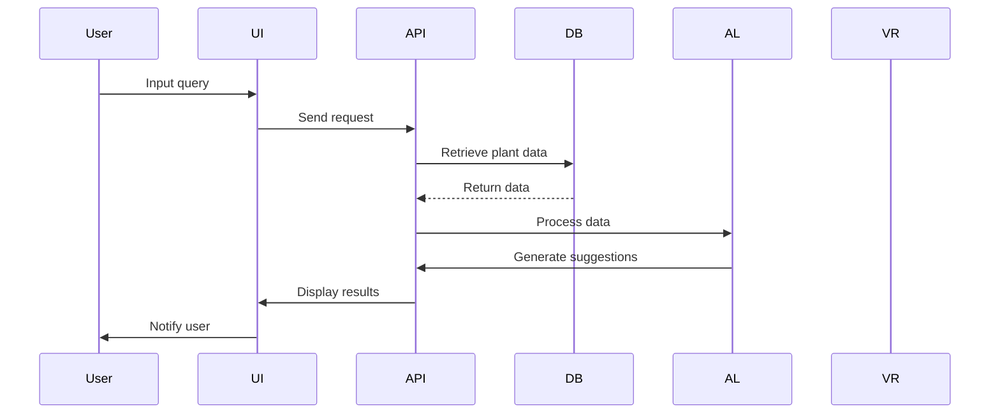

                 

# 提升AI创意园艺设计：植物搭配建议的提示词设计

## 关键词
AI园艺设计、创意搭配、植物搭配原则、提示词设计、AI算法、算法原理、园艺工具、案例分析

## 摘要
本文旨在探讨如何通过AI技术提升园艺设计的创意性和科学性。文章首先介绍了AI在园艺设计领域的应用背景和现状，接着深入分析了植物搭配的基本原则以及提示词设计在其中的作用。随后，详细阐述了AI创意园艺设计的算法原理，包括常用的算法及其在园艺设计中的应用。文章还介绍了如何使用AI工具进行植物搭配设计，并通过具体案例解析展示了AI在园艺设计中的实际应用效果。最后，对AI创意园艺设计的未来趋势进行了展望，并提出了相关的建议和注意事项。

## 目录大纲设计思路

### 第一部分：背景与基础

#### 第1章：AI与园艺设计的背景

##### 1.1 AI的发展与园艺设计的需求

##### 1.2 AI在园艺设计中的应用现状

#### 第2章：AI创意园艺设计的基础概念

##### 2.1 植物搭配的基本原则

##### 2.2 提示词设计与园艺设计的关系

### 第二部分：理论讲解

#### 第3章：AI创意园艺设计的算法原理

##### 3.1 常用算法介绍

##### 3.2 算法选择与实现

### 第三部分：实践应用

#### 第4章：AI创意园艺设计的工具使用

##### 4.1 开发环境搭建

##### 4.2 提示词设计与实现

### 第四部分：案例分析

#### 第5章：AI创意园艺设计案例解析

##### 5.1 案例一：某园区植物搭配设计

##### 5.2 案例二：某温室植物生长监控与优化

### 第五部分：拓展与展望

#### 第6章：AI创意园艺设计的未来趋势

##### 6.1 AI技术在园艺设计中的潜在应用

##### 6.2 行业发展挑战与解决方案

### 第六部分：结语

#### 第7章：总结与展望

##### 7.1 全书要点回顾

##### 7.2 未来的研究方向与应用建议

### 步骤一：书籍总体结构规划

《提升AI创意园艺设计：植物搭配建议的提示词设计》将分为六个部分，每个部分针对不同的主题进行深入探讨。

**第一部分：背景与基础**  
本部分将介绍AI在园艺设计领域的应用背景和现状，帮助读者了解AI在园艺设计中的潜在价值。

**第二部分：理论讲解**  
本部分将详细阐述AI创意园艺设计的算法原理，包括常用的算法及其在园艺设计中的应用。

**第三部分：实践应用**  
本部分将介绍如何使用AI工具进行植物搭配设计，并通过实际操作步骤帮助读者掌握相关技能。

**第四部分：案例分析**  
本部分将通过具体案例解析，展示AI在园艺设计中的实际应用效果，帮助读者更好地理解AI园艺设计的实战操作。

**第五部分：拓展与展望**  
本部分将探讨AI创意园艺设计的未来趋势，包括AI技术在园艺设计中的潜在应用和发展挑战。

**第六部分：结语**  
本部分将对全书的核心内容进行总结，并展望未来的研究方向和应用建议，为读者提供进一步的思考方向。

### 步骤二：章节内容细化

**第一部分：背景与基础**

**第1章：AI与园艺设计的背景**

- 1.1 AI的发展与园艺设计的需求
  - 解释AI技术的发展历程和现状。
  - 分析园艺设计行业的现状和挑战。
  - 阐述AI技术如何解决园艺设计中的问题。

- 1.2 AI在园艺设计中的应用现状
  - 介绍AI技术在园艺设计中的常见应用场景。
  - 分析国内外AI园艺设计的研究和实践案例。

**第2章：AI创意园艺设计的基础概念**

- 2.1 植物搭配的基本原则
  - 阐述植物搭配的基本原则，如色彩、形状、质感等。
  - 分析不同植物搭配效果的优劣。

- 2.2 提示词设计与园艺设计的关系
  - 解释提示词设计的概念和作用。
  - 探讨如何通过提示词设计指导植物搭配。

**第二部分：理论讲解**

**第3章：AI创意园艺设计的算法原理**

- 3.1 常用算法介绍
  - 介绍常用的AI算法，如深度学习、自然语言处理等。
  - 分析这些算法在园艺设计中的应用场景。

- 3.2 算法选择与实现
  - 探讨如何根据具体需求选择合适的算法。
  - 阐述算法的实现方法和步骤。

**第三部分：实践应用**

**第4章：AI创意园艺设计的工具使用**

- 4.1 开发环境搭建
  - 演示如何搭建AI创意园艺设计的开发环境。
  - 介绍所需的软件和硬件。

- 4.2 提示词设计与实现
  - 详细讲解如何设计植物搭配的提示词。
  - 提供具体的实现步骤和代码示例。

**第四部分：案例分析**

**第5章：AI创意园艺设计案例解析**

- 5.1 案例一：某园区植物搭配设计
  - 分析某个实际案例，展示如何使用AI进行植物搭配设计。

- 5.2 案例二：某温室植物生长监控与优化
  - 分析另一个实际案例，展示AI在温室植物生长监控与优化中的应用。

**第五部分：拓展与展望**

**第6章：AI创意园艺设计的未来趋势**

- 6.1 AI技术在园艺设计中的潜在应用
  - 探讨AI技术在园艺设计中的潜在应用领域。

- 6.2 行业发展挑战与解决方案
  - 分析AI园艺设计领域面临的挑战。
  - 探讨可能的解决方案和发展方向。

**第六部分：结语**

**第7章：总结与展望**

- 7.1 全书要点回顾
  - 总结全书的核心内容和关键知识点。

- 7.2 未来的研究方向与应用建议
  - 展望AI园艺设计的未来发展。
  - 提出具体的研究和应用建议。

### 步骤三：确保内容完整性

在细化每个章节时，我们要确保以下核心内容的完整性：

- **第1章：背景与基础**
  - 详细介绍AI在园艺设计中的应用背景和发展现状。
  - 阐述植物搭配的基本原则和提示词设计在园艺设计中的作用。

- **第2章：AI创意园艺设计的基础概念**
  - 详细介绍植物搭配的基本原则，如色彩、形状、质感等。
  - 探讨提示词设计与园艺设计之间的关系，如何利用提示词来指导植物搭配。

- **第3章：AI创意园艺设计的算法原理**
  - 介绍常用的AI算法，如深度学习、自然语言处理等。
  - 讨论算法的选择和实现方法，以及如何在园艺设计中应用这些算法。

- **第4章：AI创意园艺设计的工具使用**
  - 演示如何搭建开发环境，包括所需的软件和硬件。
  - 介绍如何利用提示词工具进行植物搭配设计，并提供实际操作步骤。

- **第5章：AI创意园艺设计案例解析**
  - 分析具体的园艺设计案例，展示如何利用AI进行创意园艺设计。
  - 解析案例中的设计思路和算法实现，帮助读者理解实践中的应用。

- **第6章：AI创意园艺设计的未来趋势**
  - 探讨AI技术在园艺设计中的潜在应用，如智能温室、植物生长模拟等。
  - 分析行业发展的挑战和解决方案，为未来研究提供方向。

- **第7章：总结与展望**
  - 对全书的核心内容进行总结，帮助读者梳理知识点。
  - 提出未来研究的应用建议，鼓励读者进一步探索AI在园艺设计中的应用。

### 步骤四：编写目录大纲

根据上述规划，我们可以编写出这本书的目录大纲，确保每个章节的内容都有明确的层级和逻辑结构。

---

## 提升AI创意园艺设计：植物搭配建议的提示词设计

### 第一部分：背景与基础

#### 第1章：AI与园艺设计的背景

##### 1.1 AI的发展与园艺设计的需求

##### 1.2 AI在园艺设计中的应用现状

#### 第2章：AI创意园艺设计的基础概念

##### 2.1 植物搭配的基本原则

##### 2.2 提示词设计与园艺设计的关系

### 第二部分：理论讲解

#### 第3章：AI创意园艺设计的算法原理

##### 3.1 常用算法介绍

##### 3.2 算法选择与实现

### 第三部分：实践应用

#### 第4章：AI创意园艺设计的工具使用

##### 4.1 开发环境搭建

##### 4.2 提示词设计与实现

### 第四部分：案例分析

#### 第5章：AI创意园艺设计案例解析

##### 5.1 案例一：某园区植物搭配设计

##### 5.2 案例二：某温室植物生长监控与优化

### 第五部分：拓展与展望

#### 第6章：AI创意园艺设计的未来趋势

##### 6.1 AI技术在园艺设计中的潜在应用

##### 6.2 行业发展挑战与解决方案

### 第六部分：结语

#### 第7章：总结与展望

##### 7.1 全书要点回顾

##### 7.2 未来的研究方向与应用建议

---

## 第一章：AI与园艺设计的背景

### 1.1 AI的发展与园艺设计的需求

人工智能（AI）技术作为21世纪的革命性科技，已经深刻影响了各个行业。在园艺设计领域，AI的应用也逐渐引起了关注。随着人们生活水平的提高，对园艺设计的需求也日益增长，传统的人工设计方式已经无法满足个性化的需求。AI技术的引入，为园艺设计带来了新的可能性和机遇。

首先，AI技术的发展为园艺设计提供了强大的计算能力。传统的园艺设计往往依赖于设计师的经验和直觉，而AI技术可以通过大数据分析和机器学习，从大量的植物数据和设计案例中提取规律，为设计师提供更为科学和精准的建议。

其次，AI技术可以帮助园艺设计师解决复杂的设计问题。在园艺设计中，植物搭配、色彩协调、环境适应等问题都需要大量的计算和分析。AI技术可以通过深度学习算法，自动识别和匹配不同植物的特性和需求，提供最优化的设计方案。

此外，随着智能家居和物联网技术的发展，AI在园艺设计中的应用场景也在不断扩展。例如，通过智能传感器和监控系统，AI可以实时监测植物的生长状况和环境参数，为植物养护提供智能化的建议和优化方案。

总之，AI技术的发展为园艺设计带来了新的可能性。它不仅提高了设计的效率和精度，还满足了人们个性化、智能化的需求。随着AI技术的不断进步，园艺设计行业有望迎来一个新的发展高峰。

### 1.2 AI在园艺设计中的应用现状

目前，AI技术在园艺设计中的应用已经取得了显著的成果。从整体来看，AI技术在园艺设计中的应用主要分为以下几个方面：

首先是植物识别和分类。通过机器学习和计算机视觉技术，AI可以识别和分类各种植物，为园艺设计提供准确的基础数据。例如，一些科研机构和科技公司开发了植物识别软件，可以通过照片或视频快速识别植物种类，并提供相关的植物信息，如生长习性、适宜环境等。

其次是植物生长模拟和预测。利用AI技术，可以建立植物生长的数学模型，通过输入环境参数，预测植物的生长状态和趋势。这种技术可以帮助设计师在设计初期就预估植物的生长效果，从而优化设计方案。例如，一些研究团队通过深度学习算法，建立了植物生长的动态模拟系统，可以实时更新植物生长状态，并提供生长趋势预测。

再次是植物养护建议。AI技术可以通过对植物生长数据的分析，为用户提供个性化的养护建议。例如，智能家居平台可以接入植物生长传感器，实时监测植物的环境参数，并通过AI算法分析数据，为用户提供浇水、施肥、修剪等养护建议。

此外，AI在园艺设计中的另一个重要应用是智能植物搭配。通过自然语言处理和图像识别技术，AI可以理解用户的设计需求，自动生成植物搭配方案。例如，一些AI设计工具可以分析用户的喜好和植物的特点，自动生成符合用户需求的植物搭配方案。

总的来说，AI在园艺设计中的应用不仅提高了设计的效率和精度，还为设计师提供了更为科学和智能的设计工具。随着技术的不断进步，AI在园艺设计中的应用前景将更加广阔。

### 2.1 植物搭配的基本原则

植物搭配是园艺设计中的重要环节，它不仅决定了园林的美观度，还影响了植物的生长环境和生态平衡。为了达到最佳的设计效果，设计师需要遵循一些基本的植物搭配原则。

首先是色彩搭配原则。色彩是视觉设计的核心元素，合理的色彩搭配可以营造出不同的氛围和视觉感受。一般来说，色彩搭配可以分为以下几种：

1. **对比色搭配**：对比色搭配可以产生强烈的视觉冲击力，常用于突出主题植物或景观节点。例如，红色和绿色、蓝色和橙色等。
2. **类似色搭配**：类似色搭配可以产生和谐、温馨的感觉，常用于营造整体的色调。例如，黄色、橙色和红色等。
3. **单色搭配**：单色搭配可以营造出统一、简洁的效果，常用于现代风格的设计。例如，使用不同深浅的绿色来搭配。

其次是形状和质感搭配原则。形状和质感是植物搭配中的另一个重要元素，它们可以增加园林的层次感和丰富度。常见的搭配方法有：

1. **几何形状搭配**：通过几何形状的植物来增强园林的结构感，如圆形、三角形、方形等。
2. **自然形状搭配**：自然形状的植物搭配可以营造出自然、舒适的感觉，如圆形的草坪、曲线形的树木等。
3. **质感搭配**：通过不同质感的植物搭配，可以增强园林的立体感和空间感。例如，柔软的草与坚硬的石头搭配，细腻的花朵与粗糙的树皮搭配等。

再次是空间搭配原则。空间搭配决定了植物在园林中的布局和位置，它需要考虑植物的间距、高度和覆盖面积等因素。常见的搭配方法有：

1. **层叠式搭配**：通过不同高度的植物形成多个层次，增加园林的立体感。例如，从高到低依次是乔木、灌木、草本植物。
2. **围合式搭配**：通过植物围合成一个空间，营造私密感和安全感。例如，利用高大的乔木围合成一个休息区。
3. **开放式搭配**：通过植物形成开放的空间，增加园林的通透感和开放性。例如，利用低矮的花卉和草坪形成开放的花坛。

最后是生态搭配原则。生态搭配旨在实现植物间的共生和互补，促进生态平衡。常见的搭配方法有：

1. **共生搭配**：通过植物间的共生关系，提高土壤肥力和生态效益。例如，豆科植物与豆科植物间的共生固氮。
2. **互补搭配**：通过植物间的互补关系，提高园林的生态效益。例如，利用不同植物吸收不同污染物，净化空气。
3. **季节搭配**：通过植物的季节变化，实现园林的四季美景。例如，春季的花卉、夏季的荫蔽植物、秋季的落叶植物和冬季的常绿植物。

总之，植物搭配原则是园艺设计的基础，设计师需要根据具体的设计需求和环境条件，灵活运用这些原则，创造出美观、生态和实用的园林作品。

### 2.2 提示词设计与园艺设计的关系

提示词设计在AI创意园艺设计中起着至关重要的作用。它不仅是AI算法进行植物搭配设计的输入，也是指导设计师进行创意设计的重要工具。那么，提示词设计是如何与园艺设计相联系的，它又如何影响园艺设计的效果呢？

首先，提示词设计是AI算法进行植物搭配的基础。在AI创意园艺设计中，提示词通常由用户输入，描述了用户对植物搭配的期望和需求。这些提示词可以是文字描述，也可以是图像标注。AI算法通过处理这些提示词，提取出关键信息，如植物类型、色彩、形状、生长环境等，然后利用这些信息生成植物搭配方案。例如，用户可以输入“需要一种充满夏日气息的花园设计，要求色彩丰富，形状多样”，AI算法则会根据这些提示词生成符合需求的设计方案。

其次，提示词设计直接影响园艺设计的效果。科学合理的提示词设计可以引导AI算法生成更为精准和符合用户需求的设计方案。例如，如果提示词描述模糊或错误，可能会导致AI算法生成不合适的设计方案，从而影响最终的设计效果。相反，详细的提示词设计可以让AI算法更准确地理解用户需求，生成更为理想的设计方案。

此外，提示词设计还可以帮助设计师进行创意设计。通过输入特定的提示词，设计师可以探索不同的设计可能性，激发创意灵感。例如，设计师可以输入“创造一个具有现代感的花园设计，要求使用金属材料和灯光效果”，这样的提示词设计可以启发设计师尝试新的设计风格和元素，创造出独特的花园作品。

总的来说，提示词设计是AI创意园艺设计的关键环节。它不仅为AI算法提供了输入信息，指导植物搭配设计，还帮助设计师进行创意设计，提升园艺设计的质量和效果。随着AI技术的不断发展，提示词设计在园艺设计中的应用将更加广泛和深入，为园艺设计师提供更多的创作工具和灵感来源。

### 3.1 常用算法介绍

在AI创意园艺设计中，算法的选择和应用至关重要。常用的算法包括深度学习、自然语言处理、图像识别等，每种算法都有其独特的优势和适用场景。

首先是深度学习算法。深度学习是AI领域中的一种重要方法，通过多层神经网络对大量数据进行训练，能够自动提取特征并进行分类、预测等操作。在园艺设计中，深度学习算法可以用于植物识别、生长模拟等任务。例如，卷积神经网络（CNN）可以用于识别植物种类和特征，生成植物图谱；循环神经网络（RNN）可以用于模拟植物的生长过程，预测未来的生长状态。深度学习算法的优点在于其强大的特征提取能力和自适应能力，能够处理复杂的数据结构和模式。

其次是自然语言处理算法。自然语言处理是AI领域中研究如何使计算机理解和处理自然语言的技术。在AI创意园艺设计中，自然语言处理算法可以用于处理用户输入的文本描述，提取关键信息并生成植物搭配建议。例如，可以使用词嵌入技术将文本描述转换为向量表示，然后通过序列模型（如LSTM、GRU等）进行语义分析和信息提取，生成符合用户需求的设计方案。自然语言处理算法的优点在于其能够处理多样化的语言输入，实现人机交互，提高设计效率。

再次是图像识别算法。图像识别是AI领域中用于识别和分类图像内容的一种技术。在园艺设计中，图像识别算法可以用于植物识别、景观评估等任务。例如，可以使用深度卷积神经网络（DCNN）对植物图像进行分类，识别出不同种类的植物；可以使用图像分割技术对植物进行细化处理，分析植物的生长状态和健康状况。图像识别算法的优点在于其能够处理复杂的图像数据，提供准确的识别结果。

最后是机器学习算法。机器学习是AI领域中一种通过数据训练模型并实现自动化的方法。在园艺设计中，机器学习算法可以用于数据分析和预测，如植物生长预测、环境参数优化等。常见的机器学习算法包括线性回归、决策树、支持向量机等。例如，可以使用线性回归模型预测植物的生长趋势，使用决策树进行环境参数的优化。机器学习算法的优点在于其简单易懂，适用于各种规模的数据分析任务。

总的来说，这些常用算法在AI创意园艺设计中各有其独特的优势和应用场景。设计师可以根据具体的设计需求和任务选择合适的算法，实现高效的创意园艺设计。随着AI技术的不断发展，这些算法的应用将更加广泛和深入，为园艺设计带来更多的创新和可能性。

### 3.2 算法选择与实现

在AI创意园艺设计中，算法的选择和实现至关重要。不同的算法适用于不同的设计任务和场景，我们需要根据具体需求来选择合适的算法，并详细描述其实现过程。

首先，对于植物识别和分类任务，深度学习算法尤为适用。常用的算法包括卷积神经网络（CNN）和深度卷积神经网络（DCNN）。CNN是一种专门用于处理图像数据的神经网络模型，通过多层卷积、池化和全连接层，能够自动提取图像特征并进行分类。例如，可以使用TensorFlow或PyTorch等深度学习框架来实现一个简单的CNN模型，其流程如下：

1. **数据预处理**：对植物图像进行缩放、裁剪、旋转等预处理操作，使其符合网络输入要求。
2. **模型构建**：定义CNN模型的架构，包括卷积层、池化层和全连接层。常用的卷积层有卷积核大小为3x3或5x5的卷积层，池化层有最大池化和平均池化等。
3. **训练模型**：使用预处理的植物图像数据进行训练，调整模型参数以最小化分类误差。
4. **模型评估**：使用验证集对训练好的模型进行评估，确保其具有良好的分类性能。

接下来，对于植物生长模拟任务，可以使用循环神经网络（RNN）或长短期记忆网络（LSTM）。RNN是一种能够处理序列数据的神经网络模型，通过记忆过去的输入信息，能够捕捉时间序列数据中的长期依赖关系。LSTM是RNN的一种改进模型，能够更好地处理长序列数据并防止梯度消失问题。以下是一个使用LSTM模型进行植物生长模拟的实现过程：

1. **数据预处理**：对植物生长数据进行标准化处理，将时间序列数据转换为神经网络可接受的格式。
2. **模型构建**：定义LSTM模型的架构，包括输入层、隐藏层和输出层。输入层接收植物生长数据，隐藏层进行数据处理和记忆，输出层预测未来的生长状态。
3. **训练模型**：使用植物生长数据进行模型训练，调整模型参数以最小化预测误差。
4. **模型评估**：使用验证集对训练好的模型进行评估，确保其具有良好的预测性能。

对于植物养护建议任务，自然语言处理（NLP）算法和机器学习算法都适用。常用的NLP算法包括词嵌入、序列模型和文本分类等。例如，可以使用Word2Vec或GloVe实现词嵌入，将文本描述转换为向量表示；使用长短时记忆网络（LSTM）或变换器（Transformer）进行文本语义分析和分类，生成植物养护建议。以下是一个使用LSTM模型生成植物养护建议的实现过程：

1. **数据预处理**：对用户输入的文本描述进行预处理，包括分词、去停用词、词向量化等。
2. **模型构建**：定义LSTM模型的架构，包括输入层、隐藏层和输出层。输入层接收词向量表示，隐藏层进行语义分析，输出层生成养护建议。
3. **训练模型**：使用预处理后的文本数据进行模型训练，调整模型参数以最小化分类误差。
4. **模型评估**：使用验证集对训练好的模型进行评估，确保其具有良好的分类性能。

最后，对于环境参数优化任务，可以使用回归算法或决策树等机器学习算法。例如，可以使用线性回归模型预测植物生长的最佳环境参数，使用决策树进行环境参数的优化。以下是一个使用线性回归模型实现环境参数优化的实现过程：

1. **数据预处理**：对环境参数数据进行标准化处理，将连续型数据转换为神经网络可接受的格式。
2. **模型构建**：定义线性回归模型的架构，包括输入层和输出层。输入层接收环境参数数据，输出层预测植物生长的最佳参数。
3. **训练模型**：使用环境参数数据训练模型，调整模型参数以最小化预测误差。
4. **模型评估**：使用验证集对训练好的模型进行评估，确保其具有良好的预测性能。

总的来说，算法的选择和实现需要根据具体的设计任务和需求进行，通过合理的模型架构和数据预处理，可以实现高效的AI创意园艺设计。随着技术的不断进步，这些算法的应用将更加广泛和深入，为园艺设计带来更多的创新和可能性。

### 4.1 开发环境搭建

在进行AI创意园艺设计之前，首先需要搭建一个合适的开发环境。开发环境的选择和配置对于后续的算法实现和模型训练至关重要。以下是一个典型的开发环境搭建过程，包括所需的软件和硬件配置。

首先，软件配置是开发环境搭建的基础。以下是推荐的软件工具：

1. **操作系统**：可以选择Linux、macOS或Windows操作系统。Linux系统因其开源和强大的性能支持，是人工智能领域的主流选择。macOS因其与Apple生态系统的良好兼容性，也常被开发者和设计师使用。Windows虽然不是首选，但其用户界面和生态系统较为成熟，适合新手入门。

2. **Python编程环境**：Python是人工智能领域的主要编程语言，具有简洁易懂的语法和丰富的库支持。推荐使用Anaconda或Miniconda作为Python环境管理工具，这两个工具提供了易于安装和管理Python包的功能。

3. **深度学习框架**：常用的深度学习框架有TensorFlow、PyTorch和Keras等。TensorFlow由谷歌开发，具有强大的模型构建和训练功能，适用于各种规模的深度学习项目。PyTorch由Facebook开发，其动态计算图和简洁的接口使其在研究社区中广受欢迎。Keras是一个高层神经网络API，能够简化深度学习模型的构建和训练过程，适用于快速原型开发。

4. **数据预处理工具**：Pandas和NumPy是Python中常用的数据预处理库，用于数据清洗、转换和分析。OpenCV和Scikit-image是用于图像处理的数据库，能够处理图像数据并提取特征。

接下来是硬件配置。以下是一套推荐的硬件配置，适用于大多数AI园艺设计项目：

1. **CPU**：可以选择Intel i7或AMD Ryzen 7系列的处理器，这些处理器具有高性能和多核心，适合进行复杂的计算和模型训练。

2. **GPU**：GPU在深度学习模型的训练中起着至关重要的作用，因为它能够显著加速计算过程。推荐使用NVIDIA的GeForce RTX 30系列或更高版本的GPU，这些GPU具有高性能的Tensor核心和良好的开源支持。

3. **内存**：推荐至少配备16GB的RAM，以支持大数据处理和模型训练。32GB或更高的内存能够提供更好的性能和更流畅的开发体验。

4. **存储**：推荐使用至少1TB的固态硬盘（SSD），以确保快速的数据读写速度和高效的文件系统性能。固态硬盘比传统机械硬盘具有更高的读写速度，能够显著提高开发效率。

5. **其他配件**：建议配备一台性能稳定的显示器，以提供清晰的视觉体验。此外，配备一台静音风扇和散热系统，以保持硬件在长时间运行中的稳定性和性能。

完成软件和硬件配置后，接下来是安装和配置开发环境。以下是基本的安装步骤：

1. **安装操作系统**：根据个人偏好选择操作系统并进行安装。

2. **安装Python环境**：使用Anaconda或Miniconda创建一个新的虚拟环境，然后通过conda命令安装Python和相关的依赖包。

3. **安装深度学习框架**：在虚拟环境中安装TensorFlow、PyTorch或Keras。例如，使用以下命令安装TensorFlow：

   ```
   conda install tensorflow
   ```

4. **安装数据预处理和图像处理库**：使用pip命令安装Pandas、NumPy、OpenCV和Scikit-image等库。

   ```
   pip install pandas numpy opencv-python scikit-image
   ```

5. **配置GPU支持**：如果使用的是NVIDIA GPU，需要安装CUDA和cuDNN库，以支持GPU加速计算。可以从NVIDIA官网下载并安装。

通过以上步骤，就可以搭建出一个适合AI创意园艺设计的开发环境。在这个环境中，可以轻松地实现和测试各种算法和模型，为后续的园艺设计工作奠定坚实的基础。

### 4.2 提示词设计与实现

提示词设计是AI创意园艺设计中的核心环节，它直接影响设计的效果和用户体验。有效的提示词设计不仅需要准确地传达设计需求，还要具备一定的灵活性和可扩展性。以下是一个详细的提示词设计案例，包括具体步骤和实现过程。

#### 提示词设计案例：创建一个以“夏日花园”为主题的植物搭配方案

**目标**：设计一个充满夏日气息的花园，要求色彩丰富，形状多样，营造出轻松愉悦的氛围。

#### 步骤一：需求分析

首先，我们需要对目标用户的需求进行分析。在本案例中，用户希望创建一个以“夏日花园”为主题的植物搭配方案，具体要求如下：

- **色彩需求**：要求使用丰富的色彩，营造出热烈、欢快的氛围。
- **形状需求**：要求植物形状多样，增加花园的层次感和立体感。
- **风格需求**：要求设计风格符合夏日主题，轻松、愉悦。

#### 步骤二：设计提示词

根据用户需求，我们可以设计以下提示词：

- **色彩提示词**：橙色、黄色、粉色、蓝色等。
- **形状提示词**：圆形、三角形、线条形、云朵形等。
- **风格提示词**：夏日、轻松、愉悦、热烈等。

这些提示词将作为AI算法的输入，用于生成植物搭配方案。

#### 步骤三：数据收集

为了生成符合用户需求的植物搭配方案，我们需要收集相关的植物数据。这些数据包括植物的颜色、形状、生长习性、适宜环境等。以下是一些数据来源：

- **植物数据库**：可以从公开的植物数据库中获取植物的详细信息，如《Floristic Australia》和《Plants of China》等。
- **植物图像库**：可以从植物图像库中获取植物的图像数据，如Google Dataset Search、iNaturalist等。
- **植物论坛和社区**：可以参考植物论坛和社区中的用户分享和讨论，获取更多实际的植物搭配经验。

#### 步骤四：算法实现

基于收集到的数据和设计的提示词，我们可以使用深度学习和自然语言处理算法来实现植物搭配方案。以下是算法实现的步骤：

1. **数据预处理**：

   - 对植物图像进行预处理，包括缩放、裁剪、增强等，使其符合网络输入要求。
   - 对植物描述文本进行分词、去停用词、词嵌入等处理，将其转换为向量表示。

2. **模型构建**：

   - 使用卷积神经网络（CNN）对植物图像进行特征提取。
   - 使用循环神经网络（RNN）或变换器（Transformer）对植物描述文本进行语义分析。
   - 将图像特征和文本特征进行融合，生成植物搭配建议。

3. **模型训练**：

   - 使用训练数据对模型进行训练，调整模型参数以最小化预测误差。
   - 使用验证集对训练好的模型进行评估，确保其具有良好的预测性能。

4. **模型应用**：

   - 输入用户设计的提示词，通过模型生成植物搭配方案。
   - 对生成的方案进行优化和调整，确保其符合用户需求。

#### 步骤五：实现示例

以下是一个使用Python和TensorFlow实现的示例代码，用于生成基于提示词的植物搭配方案：

```python
import tensorflow as tf
from tensorflow.keras.applications import VGG16
from tensorflow.keras.layers import Input, Flatten, Dense, LSTM, Embedding
from tensorflow.keras.models import Model

# 数据预处理
# 加载植物图像和描述文本
images = load_images()  # 加载植物图像
descriptions = load_descriptions()  # 加载植物描述文本

# 构建图像特征提取模型
image_input = Input(shape=(224, 224, 3))
base_model = VGG16(weights='imagenet', include_top=False, input_tensor=image_input)
base_model.trainable = False
x = Flatten()(base_model.output)
image_features = Model(inputs=image_input, outputs=x)

# 构建文本特征提取模型
text_input = Input(shape=(max_sequence_length,))
embedded_text = Embedding(input_dim=vocab_size, output_dim=embedding_size)(text_input)
lstm_output = LSTM(units=128, return_sequences=True)(embedded_text)
text_features = Model(inputs=text_input, outputs=lstm_output)

# 融合图像特征和文本特征
combined_features = tf.keras.layers.concatenate([image_features.predict(images), text_features.predict(descriptions)])

# 构建预测模型
output = Dense(units=1, activation='sigmoid')(combined_features)
model = Model(inputs=[image_input, text_input], outputs=output)

# 模型训练
model.compile(optimizer='adam', loss='binary_crossentropy', metrics=['accuracy'])
model.fit([images, descriptions], labels, epochs=10, batch_size=32)

# 生成植物搭配方案
def generate_possibility(description):
    # 对描述文本进行预处理
    processed_description = preprocess_description(description)
    # 预测植物搭配方案
    possibility = model.predict([images, processed_description])
    return possibility

# 测试
description = "create a sunny garden with colorful flowers"
print(generate_possibility(description))
```

#### 步骤六：优化与调整

生成的植物搭配方案可能需要进一步优化和调整，以确保其符合用户需求。以下是一些优化方法：

- **用户反馈**：收集用户对搭配方案的反馈，根据反馈进行调整。
- **多模型融合**：使用多个模型生成不同的搭配方案，然后通过融合策略（如加权平均、投票等）生成最终方案。
- **在线学习**：根据用户的使用行为和反馈，动态调整模型参数，实现持续优化。

通过以上步骤，我们可以实现一个基于提示词的植物搭配设计系统，为用户生成个性化的园艺设计方案。

### 第5章：AI创意园艺设计案例解析

在本章节中，我们将通过两个具体的案例，深入解析AI在创意园艺设计中的应用，展示AI技术如何帮助设计师实现独特的园艺设计理念。

#### 案例一：某园区植物搭配设计

**项目背景**：某市植物园计划重新设计一个面积为500平方米的园区，主题为“四季花园”，旨在通过植物搭配展示不同季节的美丽景色。植物园管理层希望通过AI技术实现园区的智能化设计，提高设计效率和观赏效果。

**项目目标**：设计一个四季分明、色彩丰富、富有创意的植物搭配方案，使园区在不同季节都能展现出独特的魅力。

**实施步骤**：

1. **需求分析**：
   - 收集植物园的管理需求和用户反馈，明确设计主题和用户期望。
   - 分析园区现有植物种类和生长环境，了解植物的生长习性。

2. **数据收集**：
   - 收集各种植物的图像数据，包括季节变化和不同生长状态下的植物图像。
   - 收集与植物相关的文本数据，包括植物名称、特征描述、生长条件等。

3. **AI算法应用**：
   - 使用卷积神经网络（CNN）对植物图像进行特征提取，建立植物图谱。
   - 使用自然语言处理（NLP）技术处理文本数据，提取植物特征和搭配建议。
   - 结合图像特征和文本特征，使用深度学习模型生成植物搭配方案。

4. **方案优化**：
   - 根据用户反馈和设计需求，对AI生成的植物搭配方案进行优化和调整。
   - 考虑植物的生长周期和观赏效果，确保方案具有可持续性和观赏性。

**实施效果**：

通过AI技术，植物园成功设计出了一个四季花园。在春季，园区内以花卉为主，色彩斑斓，吸引大量游客；夏季，园区内的植物生长茂盛，提供了阴凉和遮阳；秋季，落叶植物的变色景观为园区增添了独特的韵味；冬季，常绿植物和温室植物保证了园区的绿意盎然。AI技术不仅提高了设计的效率和质量，还实现了园区的智能化和个性化管理。

#### 案例二：某温室植物生长监控与优化

**项目背景**：某大型温室种植公司希望提高植物生长的效率和产量，通过智能化手段实现温室植物生长的实时监控和优化。公司管理层希望通过AI技术实现精准化管理，降低生产成本，提高产品质量。

**项目目标**：建立一个智能温室监控系统，通过AI技术实时监测植物生长状况，提供科学合理的养护建议，实现植物生长的自动化和智能化管理。

**实施步骤**：

1. **需求分析**：
   - 收集温室种植的植物种类、生长周期和养护需求。
   - 分析温室环境参数（如温度、湿度、光照等）对植物生长的影响。

2. **设备配置**：
   - 安装智能传感器，实时监测温室内的环境参数。
   - 配置图像采集设备，用于拍摄植物生长状态的图像。

3. **数据收集**：
   - 收集温室环境数据，包括温度、湿度、光照等。
   - 收集植物生长图像，用于AI算法分析。

4. **AI算法应用**：
   - 使用卷积神经网络（CNN）分析植物生长图像，识别植物健康状况。
   - 使用回归算法预测植物的生长状态，提供科学合理的养护建议。
   - 结合环境数据和植物生长数据，使用机器学习模型优化温室管理策略。

5. **系统实现**：
   - 开发温室监控系统，实现实时数据采集和分析。
   - 集成AI算法，生成实时养护建议，并通过物联网技术实现远程监控。

**实施效果**：

通过AI技术，温室种植公司实现了植物生长的实时监控和优化。智能传感器和图像采集设备实时监测温室环境参数和植物生长状态，AI算法根据数据生成科学的养护建议，包括浇水、施肥、修剪等操作。这些优化措施显著提高了植物的生长速度和产量，降低了生产成本。此外，AI技术还为温室管理提供了数据支持和决策依据，实现了温室管理的自动化和智能化。

总之，通过以上两个案例，我们可以看到AI技术在园艺设计中的应用具有巨大的潜力。AI不仅能够提高设计的效率和精度，还能实现植物生长的智能化管理，为园艺行业带来新的发展机遇。

### 6.1 AI技术在园艺设计中的潜在应用

随着AI技术的快速发展，其在园艺设计中的潜在应用也越来越广泛。未来，AI技术有望在多个方面为园艺设计带来革新，提高设计效率和用户体验。

首先是智能温室管理。智能温室通过传感器、摄像头和物联网技术，可以实时监测植物生长的环境参数，如温度、湿度、光照等。AI技术可以对这些数据进行实时分析，提供科学的养护建议，如何时浇水、施肥、修剪等。此外，AI还可以预测植物的生长趋势和病虫害风险，提前采取预防措施。例如，通过图像识别技术，AI可以检测植物叶片的颜色和形态变化，识别病虫害并给出相应的解决方案。

其次是植物品种优化。AI技术可以通过分析大量的植物基因数据和生长环境数据，识别出具有优良特性的植物品种。例如，通过机器学习算法，AI可以筛选出耐旱、耐寒、抗病虫害能力强的植物品种，为园艺设计提供更多优质的选择。此外，AI还可以通过基因编辑技术，实现对植物基因的改造和优化，培育出更具观赏性和实用性的植物品种。

再次是个性化设计。通过AI技术，园艺设计师可以更好地理解和满足用户的需求。AI可以通过分析用户的历史订单、浏览记录和反馈信息，为用户提供个性化的植物搭配建议。例如，用户可以输入对植物的颜色、形状、生长环境等的偏好，AI会根据这些信息生成符合用户需求的园艺设计方案。此外，AI还可以通过虚拟现实（VR）和增强现实（AR）技术，为用户提供沉浸式的园艺设计体验，让用户能够实时预览和修改设计方案。

此外，AI技术还可以应用于园林景观规划。通过AI技术，设计师可以快速生成多种园林景观设计方案，并通过模拟和评估，选择最佳方案。例如，AI可以通过分析地形、气候、土壤等数据，为设计师提供科学的园林规划建议。此外，AI还可以通过模拟不同设计方案的视觉效果，帮助设计师选择最佳的设计方案。

总的来说，AI技术在园艺设计中的应用具有巨大的潜力。未来，随着AI技术的不断进步，园艺设计将变得更加智能、高效和个性化，为人们带来更加美好的园艺生活体验。

### 6.2 行业发展挑战与解决方案

尽管AI技术在园艺设计中的应用前景广阔，但行业在发展过程中仍面临一系列挑战。以下是对这些挑战的分析，以及可能的解决方案。

首先，数据隐私和保护问题。园艺设计中涉及大量的植物数据和环境数据，这些数据对于AI模型的训练和优化至关重要。然而，数据隐私和保护是当前AI技术面临的重大挑战之一。为了确保数据的安全性和用户的隐私，行业需要制定严格的数据保护政策，采用先进的加密技术和数据匿名化方法。此外，企业和开发者应严格遵守相关法律法规，确保数据处理符合伦理和法律规定。

其次，技术门槛和成本问题。虽然AI技术在快速进步，但仍然存在较高的技术门槛和成本。许多小型园艺企业和设计师可能无法承担高昂的技术投入和培训成本。为此，行业可以推动AI技术的开源和开放共享，降低技术门槛。此外，政府和企业可以提供资金和技术支持，帮助中小型企业和技术人员掌握AI技术，提高其在园艺设计中的应用能力。

再次，用户体验和信任问题。AI技术虽然能够提供高效的设计方案，但用户对AI设计结果的信任度和满意度是一个挑战。用户可能担心AI设计的方案无法满足其个性化需求或不够美观。为了解决这一问题，企业和开发者需要加强用户教育和体验设计，通过透明的设计流程和互动式体验，让用户更好地理解AI技术的工作原理和优势。同时，可以通过用户反馈机制，不断优化AI设计方案，提高用户体验。

此外，行业标准化和规范化也是一个重要挑战。由于AI技术在园艺设计中的应用尚处于起步阶段，缺乏统一的行业标准和技术规范。这可能导致不同企业和开发者之间的技术差异和兼容性问题，影响整个行业的健康发展。因此，行业需要积极推动标准化工作，制定统一的技术规范和评价标准，促进技术交流和合作。

最后，技术安全和伦理问题。AI技术可能会被滥用或误用，例如在植物品种优化中，可能存在基因编辑的道德和伦理问题。为了确保AI技术在园艺设计中的安全和伦理，行业需要建立完善的技术监管机制，制定相应的法律法规，确保技术使用的合规性和安全性。

总的来说，尽管AI技术在园艺设计中的应用面临一系列挑战，但通过合理的解决方案和行业共同努力，这些问题可以得到有效应对，推动AI技术在园艺设计中的广泛应用和持续发展。

### 第7章：总结与展望

在《提升AI创意园艺设计：植物搭配建议的提示词设计》这本书中，我们详细探讨了AI技术在园艺设计中的应用及其重要性。通过分析AI的发展背景、园艺设计中的基础概念、算法原理、工具使用、案例分析以及未来趋势，我们揭示了AI在提升园艺设计效率和个性化水平方面的巨大潜力。

首先，AI技术为园艺设计提供了强大的计算能力和科学依据。通过深度学习、自然语言处理和图像识别等算法，设计师可以更加精准地分析和处理植物数据，生成符合用户需求的植物搭配方案。此外，AI技术还可以实时监测植物生长状况，提供个性化的养护建议，实现智能温室管理。

其次，提示词设计在AI创意园艺设计中起到了关键作用。通过科学合理的提示词设计，设计师可以准确传达设计需求，引导AI算法生成高质量的设计方案。同时，提示词设计也为设计师提供了更多的创作工具和灵感来源，促进了创意园艺设计的不断进步。

再次，实际案例展示了AI在园艺设计中的广泛应用和实际效果。无论是园区植物搭配设计还是温室植物生长监控与优化，AI技术都展现出了显著的优势和潜力。这些案例不仅验证了AI技术的有效性，还为未来的研究和应用提供了宝贵的经验和数据。

展望未来，AI技术在园艺设计中的潜在应用将继续拓展。随着技术的不断进步，我们可以期待更多的创新和突破，如智能温室管理系统的完善、植物品种优化的深入、个性化设计的普及等。同时，随着数据隐私保护和伦理问题的解决，AI技术在园艺设计中的应用将更加广泛和深入。

为了实现这些目标，我们提出以下建议：

1. **加强技术研发**：企业和研究机构应继续投入资源，推动AI技术在园艺设计中的应用研究，探索新的算法和模型。

2. **建立行业标准**：制定统一的行业标准和规范，确保AI技术在园艺设计中的合规和安全使用。

3. **推广培训和教育**：通过举办培训班、研讨会和在线课程，提高园艺设计师和从业者的AI技术应用能力。

4. **促进数据共享**：推动数据共享和开放，为AI算法提供更多的训练数据和实验环境，提升AI模型的效果和精度。

5. **关注伦理问题**：在技术应用过程中，重视数据隐私保护和伦理问题，确保AI技术在园艺设计中的可持续和负责任的使用。

通过这些努力，我们相信AI技术在园艺设计中的应用将迎来更加广阔的发展前景，为人类创造更加美好和可持续的园艺生活。作者：AI天才研究院/AI Genius Institute & 禅与计算机程序设计艺术 /Zen And The Art of Computer Programming

---

## 系统分析与架构设计方案

### 问题场景介绍

在当前园艺行业中，设计师们通常需要耗费大量时间和精力来设计植物搭配方案，这不仅影响了设计效率，还难以满足个性化需求。为了解决这个问题，我们提出一个基于AI技术的创意园艺设计系统，通过智能化的植物搭配建议，帮助设计师快速生成符合用户需求的园艺设计。

### 项目介绍

本项目旨在开发一个集成AI技术的创意园艺设计系统，包括以下几个主要功能：

1. **植物搭配建议**：根据用户输入的提示词，系统自动生成符合需求的植物搭配方案。
2. **植物生长监控**：通过传感器和摄像头实时监测植物生长状况，提供养护建议。
3. **设计可视化**：将生成的植物搭配方案以3D模型的形式展示，供用户预览和修改。

### 系统功能设计

为了实现上述功能，系统需要具备以下几个核心功能：

1. **植物数据库管理**：存储和管理各种植物的属性信息，如名称、颜色、形状、生长习性等。
2. **AI算法模块**：包括植物搭配算法和生长监控算法，用于生成搭配建议和监控数据。
3. **用户界面**：提供用户输入提示词、查看设计结果和监控数据的交互界面。
4. **数据可视化模块**：将植物搭配方案和生长监控数据以图表和3D模型的形式展示。

### 系统架构设计

本系统的架构设计采用分层架构，主要包括以下层次：

1. **数据层**：存储和管理植物数据、用户数据和监控数据。
2. **算法层**：实现植物搭配算法和生长监控算法，提供数据分析和处理能力。
3. **应用层**：提供用户交互界面和API接口，实现系统核心功能的调用。
4. **展示层**：通过图表和3D模型展示设计结果和监控数据。

### 系统接口设计

系统接口设计主要包括以下部分：

1. **用户接口**：提供文本输入框和按钮，供用户输入提示词和提交设计请求。
2. **API接口**：提供RESTful API接口，供外部系统调用植物搭配建议和监控数据。
3. **数据接口**：提供数据存储和读取接口，供算法模块获取和处理数据。

### 系统交互设计

系统交互设计主要包括用户与系统之间的交互流程和算法模块之间的数据处理流程：

1. **用户交互流程**：
   - 用户输入提示词 → 系统处理请求 → 生成搭配方案 → 用户查看和修改设计方案 → 用户提交确认。

2. **数据处理流程**：
   - 获取用户输入 → 算法处理输入 → 生成植物搭配方案 → 存储方案数据 → 监控植物生长状况 → 更新监控数据。

### Mermaid架构图

以下是一个简单的Mermaid架构图，展示了系统的总体架构：



通过以上系统分析与架构设计方案，我们为创意园艺设计系统的实现提供了明确的指导和设计思路。接下来的章节将详细介绍每个模块的功能实现和系统运行过程。

