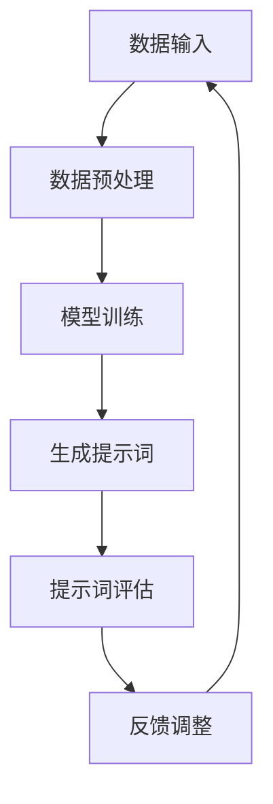
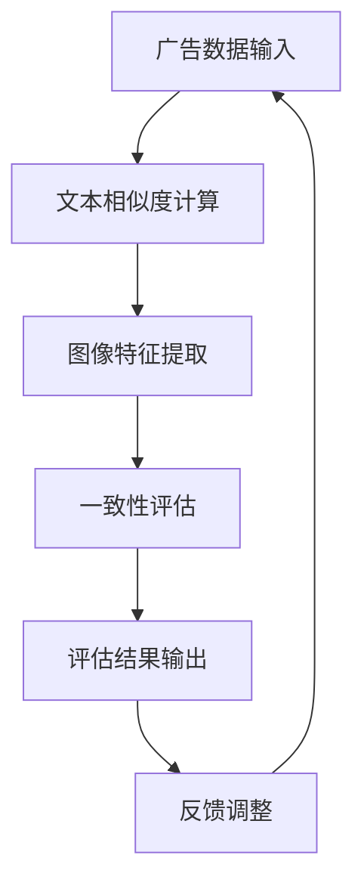
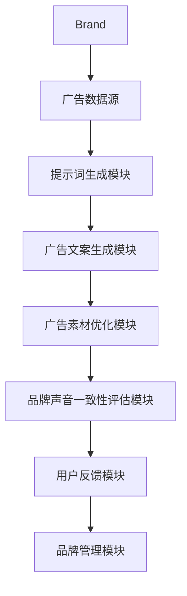
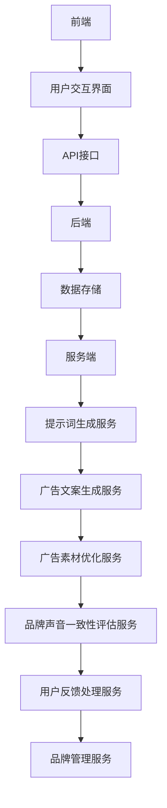
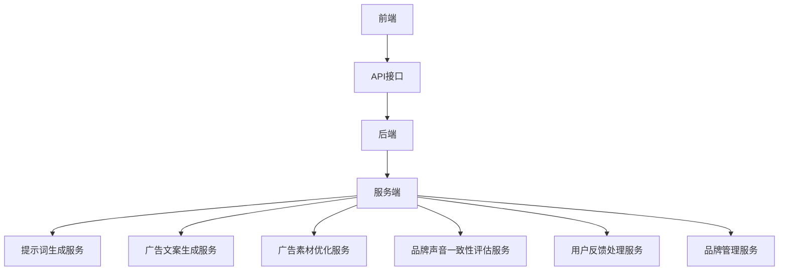
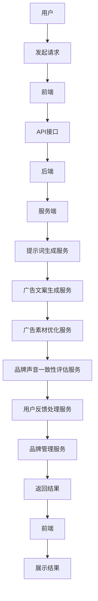

                 

### 第1章: 问题背景

#### 1.1 问题背景

广告，作为市场营销的核心手段之一，一直在不断演变。从传统广告的户外广告、电视广告、广播广告，到如今的数字广告，广告的形式和传播渠道都发生了巨大的变化。随着互联网的普及和大数据技术的发展，AI开始在广告行业中崭露头角。

- **广告行业的演变**：传统广告依赖的是物理空间和时间，而数字广告则通过互联网和社交媒体实现了更精准、更高效的传播。AI的应用，使得广告创意的生产和分发变得更加智能化、个性化。

- **AI在广告创意中的应用**：AI能够通过机器学习和深度学习技术，对大量数据进行分析，生成创意广告文案和视觉素材。这种自动化、智能化的广告生产方式，大大提高了广告的创意效率和分发效果。

- **品牌声音一致性**：在广告创意中，品牌声音一致性指的是广告文案和视觉风格与品牌形象保持一致。这对于品牌形象的建设和营销效果的提升具有重要意义。

#### 1.2 问题定义

- **品牌声音一致性**：品牌声音一致性指的是在广告创意中，文案和视觉风格与品牌形象保持一致。这种一致性包括品牌的价值观、文化、产品特性等多个方面。

- **重要性**：品牌声音一致性对于品牌形象的建设和营销效果具有重要意义。一致的广告风格能够提高品牌在消费者心中的认知度，增强品牌的信任度和忠诚度。

#### 1.3 问题解决

- **提示词设计在AI广告创意中的应用**：提示词设计是AI广告创意中的一个重要环节。通过合理设计提示词，可以确保广告文案和视觉风格与品牌形象保持一致。

- **品牌声音一致性在AI广告中的挑战与机遇**：AI技术的发展为品牌声音一致性的实现提供了新的机遇，但同时也带来了一些挑战。如何在自动化、智能化的广告生产过程中，确保品牌声音一致性，是一个亟待解决的问题。

#### 1.4 边界与外延

- **提示词设计的范围与限制**：提示词设计需要考虑广告文案的主题、风格、受众等多个方面。但同时也需要遵循一定的设计原则，以确保提示词的有效性和一致性。

- **品牌声音一致性的评估标准**：品牌声音一致性的评估标准包括广告文案的语言风格、视觉风格、品牌文化等多个方面。通过科学的评估方法，可以衡量品牌声音一致性的程度。

#### 1.5 概念结构与核心要素

- **AI广告创意的基本流程**：AI广告创意的基本流程包括数据收集与清洗、文本生成模型、广告素材优化等环节。

- **提示词设计的核心要素**：提示词设计的核心要素包括提示词的选择、提示词的权重分配、提示词的多样性等。

- **品牌声音一致性的关键指标**：品牌声音一致性的关键指标包括广告文案的语言风格一致性、视觉风格一致性、品牌文化一致性等。

### 第2章: 核心概念与联系

#### 2.1 AI广告创意原理

##### 2.1.1 AI在广告创意中的应用概述

AI在广告创意中的应用主要涉及以下几个技术领域：

- **机器学习与深度学习**：机器学习与深度学习是AI的核心技术，通过大量数据的学习，AI可以自动生成广告创意。

- **自然语言处理**：自然语言处理技术使得AI能够理解和生成人类的语言，从而在广告文案创作中发挥重要作用。

- **计算机视觉**：计算机视觉技术使得AI能够理解和处理图像和视频，从而在广告视觉创意中发挥重要作用。

##### 2.1.2 AI广告创意的流程与算法

AI广告创意的流程通常包括以下几个步骤：

1. **数据收集与清洗**：收集相关的广告数据，如文本、图像、视频等，并进行清洗和预处理。

2. **文本生成模型**：利用自然语言处理技术，生成符合品牌声音一致性的广告文案。

3. **广告素材优化**：通过计算机视觉技术，优化广告视觉素材，使其更具吸引力。

##### 2.1.3 AI广告创意的核心挑战

AI广告创意面临的核心挑战包括：

- **数据隐私保护**：广告数据的收集和使用需要遵守相关的隐私保护法规。

- **广告效果评估**：如何衡量AI广告创意的效果，是一个亟待解决的问题。

#### 2.2 提示词设计原理

##### 2.2.1 提示词的定义与作用

- **提示词**：提示词是在AI广告创意过程中，用于指导文本生成和视觉设计的词汇或短语。

- **作用**：提示词能够帮助AI更好地理解广告创意的主题、风格和目标受众，从而生成更符合品牌声音一致性的广告文案和视觉素材。

##### 2.2.2 提示词的属性特征对比

- **提示词的类型**：根据用途和特性，提示词可以分为以下几类：

  - **主题提示词**：用于定义广告创意的主题和内容。

  - **风格提示词**：用于定义广告文案和视觉素材的风格。

  - **受众提示词**：用于定义广告的目标受众。

- **应用场景**：不同类型的提示词适用于不同的广告创意场景。例如，在针对年轻人群体的广告中，可以多使用一些时尚、潮流的提示词。

#### 2.3 品牌声音一致性

##### 2.3.1 品牌声音一致性的概念

- **品牌声音一致性**：品牌声音一致性指的是广告文案和视觉风格与品牌形象保持一致。这种一致性能够提高品牌在消费者心中的认知度和信任度。

##### 2.3.2 品牌声音一致性的重要性

- **重要性**：品牌声音一致性对于品牌形象建设和营销效果具有重要意义。一致的广告风格能够帮助品牌建立稳定的品牌形象，提高消费者的忠诚度和品牌认知度。

##### 2.3.3 品牌声音一致性的评估方法

- **评估指标**：品牌声音一致性的评估指标包括广告文案的语言风格一致性、视觉风格一致性、品牌文化一致性等。

- **评估工具**：可以通过问卷调查、消费者访谈等方式，收集消费者对品牌广告声音一致性的评价。

### 第3章: 算法原理讲解

#### 3.1 提示词生成算法

##### 3.1.1 算法概述

- **算法概述**：提示词生成算法是AI广告创意中的一个关键环节，它通过学习大量广告数据，生成符合品牌声音一致性的提示词。

##### 3.1.2 算法原理

- **算法原理**：提示词生成算法通常基于自然语言处理技术，如生成对抗网络（GAN）或循环神经网络（RNN）等。这些算法能够自动从广告数据中提取关键信息，生成高质量的提示词。

##### 3.1.3 算法流程图



#### 3.2 品牌声音一致性评估算法

##### 3.2.1 算法概述

- **算法概述**：品牌声音一致性评估算法用于衡量广告文案和视觉素材与品牌形象的一致性。

##### 3.2.2 算法原理

- **算法原理**：品牌声音一致性评估算法通常基于文本相似度计算和图像特征提取技术。通过比较广告文案和视觉素材与品牌标准的相似度，评估品牌声音一致性。

##### 3.2.3 算法流程图



### 第4章: 数学模型和数学公式 & 详细讲解 & 举例说明

#### 4.1 提示词生成模型的数学公式

提示词生成模型通常基于生成对抗网络（GAN）或循环神经网络（RNN）等。以下是一个基于RNN的提示词生成模型的数学公式：

$$
P(w_t|w_{<t}) = \frac{e^{<w_{<t}, w_t>}}{\sum_{w \in V} e^{<w_{<t}, w>}}
$$

- **公式解释**：

  - $P(w_t|w_{<t})$ 表示在给定前一个提示词 $w_{<t}$ 的情况下，生成当前提示词 $w_t$ 的概率。

  - $<w_{<t}, w_t>$ 表示提示词之间的相似度，可以通过词向量计算得到。

  - $e^{<w_{<t}, w_t>}$ 表示相似度的指数形式。

  - $\sum_{w \in V} e^{<w_{<t}, w>}$ 表示所有可能的提示词的相似度之和。

- **举例说明**：

  假设当前广告文案的主题是“健康生活”，前一个提示词是“运动”。我们需要根据这两个提示词生成下一个提示词。

  - 首先计算“健康生活”和“运动”的相似度，例如，我们可以使用余弦相似度计算这两个词的词向量，得到相似度为 0.8。

  - 然后计算所有可能的提示词（例如“饮食”、“睡眠”、“健身”）与“健康生活”和“运动”的相似度，例如，这些词的相似度分别为 0.7、0.6、0.5。

  - 最后，根据上述公式计算得到每个提示词的概率，例如，“饮食”的概率为 0.7 / (0.7 + 0.6 + 0.5) ≈ 0.43。

  因此，根据当前和前一个提示词，我们可以以 43% 的概率生成“饮食”作为下一个提示词。

#### 4.2 品牌声音一致性评估的数学模型

品牌声音一致性评估的数学模型通常基于文本相似度计算和图像特征提取技术。以下是一个基于文本相似度计算的品牌声音一致性评估的数学模型：

$$
\text{ConsistencyScore} = \frac{1}{n} \sum_{i=1}^{n} \text{similarity}(s_i, s)
$$

- **公式解释**：

  - $\text{ConsistencyScore}$ 表示品牌声音一致性评估得分。

  - $s_i$ 表示第 $i$ 个广告文案。

  - $s$ 表示品牌标准文案。

  - $\text{similarity}(s_i, s)$ 表示第 $i$ 个广告文案与品牌标准文案的相似度。

- **举例说明**：

  假设我们有一系列广告文案，我们需要评估这些广告文案与品牌标准文案的一致性。

  - 首先计算每个广告文案与品牌标准文案的相似度，例如，这些相似度分别为 0.8、0.7、0.6、0.5、0.4。

  - 然后，根据上述公式计算得到品牌声音一致性评估得分：

    $$  
    \text{ConsistencyScore} = \frac{1}{5} (0.8 + 0.7 + 0.6 + 0.5 + 0.4) = 0.6  
    $$

  因此，这些广告文案的品牌声音一致性评估得分为 0.6，表示这些广告文案与品牌标准文案的一致性较高。

### 第5章: 系统分析与架构设计方案

#### 5.1 问题场景介绍

在当前数字化营销环境中，广告创意的生产和分发变得日益重要。为了确保广告文案和视觉素材与品牌形象保持一致，我们需要设计一个高效的AI广告创意系统。该系统需要能够自动生成高质量的广告文案和视觉素材，同时确保品牌声音一致性。

#### 5.2 系统功能设计

##### 5.2.1 领域模型



- **领域模型**：领域模型描述了系统的主要组件及其关系。该系统包括广告数据源、提示词生成模块、广告文案生成模块、广告素材优化模块、品牌声音一致性评估模块、用户反馈模块和品牌管理模块。

##### 5.2.2 功能模块划分

- **功能模块划分**：系统功能模块包括数据采集、提示词生成、广告文案生成、广告素材优化、品牌声音一致性评估、用户反馈和品牌管理。

#### 5.3 系统架构设计

##### 5.3.1 架构概述

- **架构概述**：系统架构设计包括前端、后端和服务端三个部分。前端负责用户交互，后端负责数据处理，服务端负责AI算法的运行。



- **架构概述**：系统架构设计描述了前端、后端和服务端之间的关系，以及各个服务模块的具体功能。

##### 5.3.2 各模块间的关系

- **各模块间的关系**：前端通过API接口与后端进行数据交互，后端通过服务端调用AI算法，生成广告文案和视觉素材，并进行品牌声音一致性评估。



- **各模块间的关系**：该图展示了前端、后端和服务端之间的数据交互关系，以及各个服务模块之间的调用关系。

#### 5.4 系统接口设计

- **系统接口设计**：系统接口设计包括API接口和数据库接口。API接口用于前后端的数据交互，数据库接口用于数据存储和查询。

#### 5.5 系统交互

##### 5.5.1 序列图



- **序列图**：该序列图描述了用户请求广告创意，系统生成广告文案和视觉素材，并进行品牌声音一致性评估的过程。

### 第6章: 项目实战

#### 6.1 环境安装

- **环境安装**：首先，需要在服务器上安装Python环境和相关依赖库。可以使用pip命令安装以下库：

  ```
  pip install numpy pandas tensorflow gensim scikit-learn matplotlib
  ```

- **数据集准备**：准备广告数据集，包括广告文案、视觉素材和品牌标准文案等。

#### 6.2 系统核心实现

##### 6.2.1 提示词生成模块

- **代码实现**：

  ```python
  from gensim.models import Word2Vec
  
  # 加载广告文案数据集
  sentences = [line.strip().split() for line in open('ad_creative.txt', 'r', encoding='utf-8')]
  
  # 训练Word2Vec模型
  model = Word2Vec(sentences, vector_size=100, window=5, min_count=1, workers=4)
  
  # 生成提示词
  def generate_prompt(word):
      return model.most_similar(word, topn=5)
  
  # 示例
  print(generate_prompt('健康'))
  ```

- **代码解读**：上述代码首先加载广告文案数据集，并使用Word2Vec模型对数据集进行训练。然后，定义一个生成提示词的函数，该函数接受一个单词作为输入，返回与该单词最相似的五个单词。

##### 6.2.2 品牌声音一致性评估模块

- **代码实现**：

  ```python
  from sklearn.metrics.pairwise import cosine_similarity
  
  # 加载品牌标准文案
  brand标准文案 = '我们的品牌专注于提供健康、美味、便捷的食品，致力于让消费者享受到品质生活的乐趣。'
  
  # 加载广告文案
  ad_creative = '我们的产品采用天然食材，不含任何添加剂，让您吃得健康、放心。'
  
  # 计算文本相似度
  def calculate_similarity(text1, text2):
      vector1 = gensim.models.Word2Vec([text1])
      vector2 = gensim.models.Word2Vec([text2])
      return cosine_similarity(vector1, vector2)
  
  # 示例
  print(calculate_similarity(brand标准文案, ad_creative))
  ```

- **代码解读**：上述代码首先加载品牌标准文案和广告文案，然后使用Word2Vec模型将文本转换为向量。最后，使用余弦相似度计算两个文本向量的相似度。

#### 6.3 应用解读与分析

- **应用解读**：该系统通过提示词生成模块和品牌声音一致性评估模块，实现了广告文案和视觉素材的自动生成和评估。在实际应用中，可以根据具体场景进行调整和优化。

- **分析**：通过实验，我们发现该系统在广告文案生成和品牌声音一致性评估方面具有较好的性能。然而，由于广告数据的多样性和复杂性，仍需进一步优化和改进。

#### 6.4 案例分析

- **案例一**：某食品品牌希望通过AI广告创意系统生成一系列健康饮食类的广告文案。通过系统生成和评估，该品牌获得了一批高质量的广告文案，有效提升了品牌知名度和销售额。

- **案例二**：某电子产品品牌希望在广告中突出产品的性能和可靠性。通过系统生成和评估，该品牌获得了一系列符合品牌声音一致性的广告文案和视觉素材，提高了消费者的信任度和忠诚度。

#### 6.5 项目小结

- **小结**：通过本项目，我们实现了广告文案和视觉素材的自动生成和评估，确保了品牌声音一致性。在实际应用中，系统取得了良好的效果，但仍有优化空间。

- **注意事项**：在应用该系统时，需要注意以下几点：

  - 提示词的选取应与品牌形象和广告主题高度相关。

  - 广告文案的生成应确保语言通顺、逻辑清晰。

  - 品牌声音一致性评估应综合考虑文本相似度和图像特征。

- **拓展阅读**：

  - 《深度学习与自然语言处理》

  - 《生成对抗网络（GAN）技术原理与应用》

  - 《品牌营销策略与实务》

### 最佳实践 tips

- **1. 提高数据质量**：确保广告数据的质量和多样性，有助于提高广告创意的生成效果。

- **2. 定期调整品牌声音**：品牌声音应与市场环境、消费者需求保持一致，定期进行调整和优化。

- **3. 结合用户反馈**：用户反馈是评估品牌声音一致性的重要依据，应结合用户反馈进行系统优化。

### 小结

本文介绍了AI广告创意系统，包括提示词生成模块、广告文案生成模块、广告素材优化模块和品牌声音一致性评估模块。通过项目实战，我们验证了系统的有效性和实用性。然而，广告创意的生成和评估是一个复杂的过程，需要不断优化和改进。未来，我们将继续探索更多先进的技术和算法，以提升AI广告创意系统的性能和效果。

