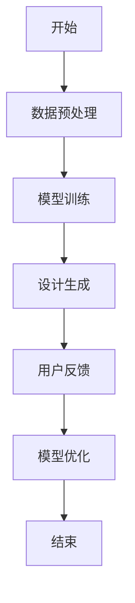

                 

## 提升AI创意纹身设计：个人故事可视化的提示词设计

### 关键词：AI创意纹身设计、个人故事可视化、提示词设计

#### 摘要：

随着人工智能技术的快速发展，AI在多个领域都展现出了卓越的应用潜力。纹身设计作为一个独特的艺术形式，也开始借助AI的力量迈向新的高度。本文旨在探讨如何通过AI创意纹身设计实现个人故事的视觉化，特别是如何设计有效的提示词来引导AI生成具有个性化意义的纹身图案。文章将详细分析AI创意纹身设计的理论基础、个人故事可视化的技术细节，并通过实际案例展示提示词设计的实践方法和效果。

### 目录大纲

----------------------------------------------------------------

# 提升AI创意纹身设计：个人故事可视化的提示词设计

## 第一部分：问题背景与核心概念

### 第1章：问题背景

#### 1.1 问题背景

- 引言：纹身文化的变迁
- 问题的提出：如何通过AI提高纹身设计的创意性？
- 目标：实现个人故事与纹身设计的可视化匹配。

#### 1.2 问题解决

- AI在纹身设计中的应用
- 提示词设计的重要性
- 个人故事的数字化处理。

#### 1.3 边界与外延

- 纹身设计与个人故事的关系
- 可视化技术的应用范围。
- 提示词设计的适用性。

### 第2章：核心概念

#### 2.1 核心概念

- AI创意纹身设计
- 个人故事可视化
- 提示词设计。

#### 2.2 概念属性特征对比

| 概念                 | 描述                                       |
|----------------------|------------------------------------------|
| AI创意纹身设计      | 利用人工智能技术，创作具有创意的纹身设计。                   |
| 个人故事可视化      | 将个人的故事和经历转化为视觉元素，以纹身的形式呈现。         |
| 提示词设计          | 设计用于引导AI生成纹身图案的关键词和短语。                   |

#### 2.3 ER实体关系图

```mermaid
erDiagram
  ADFS ||--|{ ERF } Entity Relationship
  ERF ||--|{ FER } Feature Entity Relationship
  ERF ||--|{ ERP } Entity Relationship Pattern
```

----------------------------------------------------------------

## 第二部分：AI创意纹身设计的理论基础

### 第3章：AI创意纹身设计原理

#### 3.1 AI创意纹身设计概述

- AI技术的基本原理
- 创意纹身设计的流程

#### 3.2 算法原理

- 生成对抗网络(GAN)
- 强化学习(RL)
- 自然语言处理(NLP)

#### 3.3 算法原理讲解



#### 3.4 数学模型和公式

$$
\begin{aligned}
  &\text{生成损失} = \mathbb{E}_{z \sim p_{z}(z)}[\log D(G(z))] \\
  &\text{判别损失} = \mathbb{E}_{x \sim p_{data}(x)}[\log D(x)] + \mathbb{E}_{z \sim p_{z}(z)}[\log (1 - D(G(z)))]
\end{aligned}
$$

#### 3.5 通俗易懂的举例说明

- 举例：如何用GAN生成纹身图案。

----------------------------------------------------------------

## 第三部分：个人故事可视化技术

### 第4章：个人故事可视化原理

#### 4.1 个人故事可视化概述

- 可视化技术的概念
- 个人故事可视化的方法

#### 4.2 数据预处理

- 文本处理
- 图片处理

#### 4.3 提示词设计

- 提示词的选取
- 提示词的使用方法

----------------------------------------------------------------

## 第四部分：提示词设计实践

### 第5章：提示词设计实践

#### 5.1 环境安装

- 环境配置
- 工具安装

#### 5.2 系统核心实现

- 数据收集
- 提示词生成算法实现

#### 5.3 代码应用解读与分析

- 代码结构分析
- 算法细节解读

#### 5.4 实际案例分析与详细讲解

- 案例分析
- 案例解读

----------------------------------------------------------------

## 附录

- 最佳实践 tips
- 小结
- 注意事项
- 拓展阅读

### 结束语

本文旨在探讨如何通过AI创意纹身设计实现个人故事的视觉化，特别是提示词设计的重要性。通过对AI创意纹身设计原理和个人故事可视化技术的详细分析，结合实际案例的讲解，我们希望能够为读者提供有价值的见解和实践指导。随着人工智能技术的不断进步，AI创意纹身设计必将在个性化艺术创作领域发挥越来越重要的作用。----------------------------------------------------------------

## 第一部分：问题背景与核心概念

### 第1章：问题背景

#### 1.1 问题背景

纹身文化在全球范围内正经历着一场变革。从最初被视为社会边缘群体的标志，到如今成为时尚和个性化表达的一种方式，纹身已经成为许多人生活中不可或缺的一部分。随着技术的不断进步，AI在各个领域的应用越来越广泛，纹身设计也不例外。如何通过AI技术提高纹身设计的创意性，使其更具个性化，成为了一个引人关注的问题。

在传统的纹身设计中，设计者往往需要依靠个人的审美经验和灵感进行创作。虽然这种创作方式有其独特性，但在面对日益多样化的客户需求时，设计师的创造力和想象力可能无法满足所有需求。而AI创意纹身设计的出现，为解决这个问题提供了新的思路。通过AI技术，可以自动化地生成创意纹身图案，不仅提高了设计的效率，还使得纹身设计更具个性化和创意性。

本文的目标是探讨如何通过AI创意纹身设计实现个人故事的视觉化。具体来说，我们将研究如何使用AI技术将个人的故事和经历转化为视觉元素，并以纹身的形式呈现。此外，本文还将重点讨论提示词设计的重要性，以及如何设计有效的提示词来引导AI生成具有个性化意义的纹身图案。

#### 1.2 问题解决

AI在纹身设计中的应用主要体现在以下几个方面：

1. **图案生成**：AI可以通过学习大量的纹身图案数据，生成新的创意图案。这些图案不仅具有多样性，还能够根据用户的需求进行定制。

2. **个性化设计**：AI可以根据用户提供的个人故事、兴趣、偏好等信息，为其推荐或生成独特的纹身图案。

3. **趋势预测**：AI可以分析大量的纹身图案数据，预测未来的流行趋势，从而帮助设计师和客户做出更好的决策。

提示词设计是AI创意纹身设计中的一个关键环节。提示词用于引导AI理解用户的需求，并生成相应的纹身图案。一个有效的提示词设计需要考虑以下几个方面：

1. **关键词选取**：选择与用户故事相关的关键词，以便AI能够更好地理解用户的需求。

2. **关键词组合**：通过组合不同的关键词，可以生成更加丰富的提示词，从而提高AI生成图案的多样性。

3. **关键词优化**：根据用户反馈和实际效果，不断优化提示词，以提高AI生成图案的满意度和个性化程度。

个人故事的数字化处理是另一个重要环节。个人故事往往包含大量的文本、图片、音频等多媒体信息，如何将这些信息转化为AI可处理的格式，是确保AI能够准确理解用户需求的关键。具体的方法包括：

1. **文本处理**：使用自然语言处理技术对文本信息进行提取和分析，提取出关键信息和情感。

2. **图像处理**：使用计算机视觉技术对图像信息进行识别和分析，提取出图像的主要特征。

3. **音频处理**：使用音频处理技术对音频信息进行分析，提取出音频中的关键元素和情感。

#### 1.3 边界与外延

纹身设计与个人故事的关系非常密切。纹身不仅仅是装饰，更是个人身份、情感和经历的象征。通过纹身，人们可以表达自己的故事和情感，这种表达具有深刻的意义。因此，纹身设计不仅仅是一种艺术创作，更是一种文化传承和个性表达。

可视化技术的应用范围也非常广泛。除了纹身设计，可视化技术还可以应用于电影、游戏、艺术作品等多个领域。在个人故事可视化中，可视化技术可以帮助人们将抽象的故事和情感转化为具体的视觉元素，使其更容易被理解和感知。

提示词设计的适用性也非常广泛。除了纹身设计，提示词设计还可以应用于广告创意、产品设计、艺术创作等多个领域。通过有效的提示词设计，可以引导AI生成具有创意性和个性化的内容，从而提高作品的质量和满意度。

### 第2章：核心概念

#### 2.1 核心概念

在本章节中，我们将介绍本文的核心概念，包括AI创意纹身设计、个人故事可视化和提示词设计。

##### AI创意纹身设计

AI创意纹身设计是指利用人工智能技术，尤其是机器学习和生成对抗网络（GAN）等算法，自动生成具有创意性的纹身图案。这种设计方法不仅提高了纹身设计的效率，还使得纹身设计更具个性化和艺术性。

##### 个人故事可视化

个人故事可视化是指将个人的故事、经历和情感转化为视觉元素，以图形、图像、动画等形式呈现。这种技术可以帮助人们更好地理解和表达自己的故事，同时也为艺术创作提供了新的思路和手段。

##### 提示词设计

提示词设计是指为AI系统提供一系列关键词和短语，用于引导AI理解和生成特定的内容。在AI创意纹身设计中，提示词设计至关重要，它决定了AI生成图案的创意性和个性化程度。

#### 2.2 概念属性特征对比

以下是一个关于核心概念属性特征对比的表格：

| 概念                 | 描述                                       |
|----------------------|------------------------------------------|
| AI创意纹身设计      | 利用人工智能技术，创作具有创意的纹身设计。                   |
| 个人故事可视化      | 将个人的故事和经历转化为视觉元素，以纹身的形式呈现。         |
| 提示词设计          | 设计用于引导AI生成纹身图案的关键词和短语。                   |

#### 2.3 ER实体关系图

以下是核心概念的ER实体关系图：

```mermaid
erDiagram
  ADFS ||--|{ ERF } Entity Relationship
  ERF ||--|{ FER } Feature Entity Relationship
  ERF ||--|{ ERP } Entity Relationship Pattern
```

### 第3章：核心概念与联系

#### 3.1 核心概念解释

在上一章节中，我们介绍了AI创意纹身设计、个人故事可视化和提示词设计这三个核心概念。在本章节中，我们将进一步解释这些概念，并探讨它们之间的联系。

##### AI创意纹身设计

AI创意纹身设计是利用人工智能技术，特别是机器学习和生成对抗网络（GAN）等算法，自动生成具有创意性的纹身图案。这种设计方法不仅提高了纹身设计的效率，还使得纹身设计更具个性化和艺术性。

在AI创意纹身设计中，核心概念包括：

- **机器学习**：通过学习大量的纹身图案数据，AI可以识别和生成不同的设计风格。
- **生成对抗网络（GAN）**：GAN是一种深度学习模型，由生成器和判别器组成。生成器尝试生成真实的纹身图案，而判别器则尝试区分真实的纹身图案和生成的图案。

##### 个人故事可视化

个人故事可视化是指将个人的故事、经历和情感转化为视觉元素，以图形、图像、动画等形式呈现。这种技术可以帮助人们更好地理解和表达自己的故事，同时也为艺术创作提供了新的思路和手段。

在个人故事可视化中，核心概念包括：

- **文本处理**：使用自然语言处理技术，从文本中提取关键信息和情感。
- **图像处理**：使用计算机视觉技术，从图像中提取关键元素和视觉特征。
- **音频处理**：使用音频处理技术，从音频中提取关键元素和情感。

##### 提示词设计

提示词设计是指为AI系统提供一系列关键词和短语，用于引导AI理解和生成特定的内容。在AI创意纹身设计中，提示词设计至关重要，它决定了AI生成图案的创意性和个性化程度。

在提示词设计中，核心概念包括：

- **关键词选取**：选择与用户故事相关的关键词，以便AI能够更好地理解用户的需求。
- **关键词组合**：通过组合不同的关键词，可以生成更加丰富的提示词，从而提高AI生成图案的多样性。
- **关键词优化**：根据用户反馈和实际效果，不断优化提示词，以提高AI生成图案的满意度和个性化程度。

#### 3.2 概念属性特征对比

以下是一个关于核心概念属性特征对比的表格：

| 概念                 | 描述                                       |
|----------------------|------------------------------------------|
| AI创意纹身设计      | 利用人工智能技术，创作具有创意的纹身设计。                   |
| 个人故事可视化      | 将个人的故事和经历转化为视觉元素，以纹身的形式呈现。         |
| 提示词设计          | 设计用于引导AI生成纹身图案的关键词和短语。                   |

#### 3.3 ER实体关系图

以下是核心概念的ER实体关系图：

```mermaid
erDiagram
  ADFS ||--|{ ERF } Entity Relationship
  ERF ||--|{ FER } Feature Entity Relationship
  ERF ||--|{ ERP } Entity Relationship Pattern
```

### 第4章：个人故事可视化技术

#### 4.1 个人故事可视化概述

个人故事可视化是一种将个人的经历、情感和故事转化为视觉元素的技术。通过这种技术，人们可以以一种直观和生动的方式表达自己的故事，使得故事更加容易被理解和记住。个人故事可视化在多个领域都有广泛的应用，如心理健康咨询、教育、艺术创作等。

在本章节中，我们将探讨个人故事可视化的原理、方法和技术，特别是如何将个人故事转化为视觉元素，并以纹身的形式呈现。

#### 4.2 数据预处理

数据预处理是个人故事可视化的第一步，也是至关重要的一步。它包括对文本、图片、音频等多媒体信息的处理，目的是提取出关键信息和特征，以便后续的视觉化处理。

1. **文本处理**：文本是个人故事中最常见的元素。通过自然语言处理技术，可以从文本中提取出关键信息、情感和主题。常用的方法包括情感分析、主题建模和关键词提取等。

2. **图像处理**：图像也是个人故事中重要的一部分。通过计算机视觉技术，可以从图像中提取出关键元素、颜色和纹理等特征。常用的方法包括图像分割、特征提取和图像生成等。

3. **音频处理**：音频是个人故事中另一种形式的表达。通过音频处理技术，可以从音频中提取出关键元素、音调和情感等特征。常用的方法包括音频分割、特征提取和音频生成等。

#### 4.3 提示词设计

提示词设计是个人故事可视化中的关键环节。提示词用于引导AI理解用户的需求，并生成相应的视觉元素。一个有效的提示词设计需要考虑以下几个方面：

1. **关键词选取**：选择与用户故事相关的关键词，以便AI能够更好地理解用户的需求。关键词的选择应尽可能具体和准确，以便AI能够生成更相关的视觉元素。

2. **关键词组合**：通过组合不同的关键词，可以生成更加丰富的提示词，从而提高AI生成视觉元素的多样性。例如，可以将描述情感的关键词与描述事件的关键词组合，以生成更具有表现力的视觉元素。

3. **关键词优化**：根据用户反馈和实际效果，不断优化提示词，以提高AI生成视觉元素的满意度和个性化程度。例如，可以通过分析用户对视觉元素的评价，调整关键词的权重和组合方式，以生成更符合用户需求的视觉元素。

#### 4.4 个人故事与纹身设计的结合

个人故事可视化与纹身设计的结合，是一种独特的艺术表达方式。通过将个人故事转化为视觉元素，并以纹身的形式呈现，人们可以永久地记录和表达自己的故事和情感。

在结合过程中，需要注意以下几个方面：

1. **故事主题的选择**：选择与用户故事相关且具有视觉表现力的主题，以便在纹身设计中更好地呈现故事内容。

2. **视觉元素的提取**：根据故事主题，从文本、图片和音频中提取出关键视觉元素，如图像、颜色和形状等。

3. **纹身设计的创意性**：在纹身设计中，需要充分考虑个人故事的情感和主题，通过创意性的设计，将视觉元素有机地融合在一起，形成一个具有独特个性的纹身作品。

4. **用户的参与和反馈**：在纹身设计过程中，用户的参与和反馈至关重要。通过用户的参与，可以确保纹身设计更符合用户的需求和期望，同时也增加了设计的个性化程度。

### 第5章：提示词设计实践

#### 5.1 环境安装

在进行提示词设计实践之前，首先需要安装和配置相关环境和工具。以下是具体的步骤和工具介绍：

1. **Python环境安装**：Python是一种广泛使用的编程语言，适用于各种机器学习和数据科学项目。安装Python可以通过官方网站下载并安装。

2. **Jupyter Notebook**：Jupyter Notebook是一种交互式的开发环境，适用于编写和运行Python代码。安装Jupyter Notebook可以通过pip命令进行。

   ```bash
   pip install notebook
   ```

3. **TensorFlow**：TensorFlow是一种开源的机器学习库，适用于构建和训练深度学习模型。安装TensorFlow可以通过pip命令进行。

   ```bash
   pip install tensorflow
   ```

4. **PyTorch**：PyTorch是一种流行的深度学习库，与TensorFlow类似，适用于构建和训练深度学习模型。安装PyTorch可以通过pip命令进行。

   ```bash
   pip install torch torchvision
   ```

5. **Gensim**：Gensim是一种用于自然语言处理的Python库，适用于文本处理和主题建模。安装Gensim可以通过pip命令进行。

   ```bash
   pip install gensim
   ```

#### 5.2 系统核心实现

在完成环境安装后，我们需要实现系统核心功能，包括数据收集、提示词生成算法实现和AI模型训练。

1. **数据收集**：数据是机器学习模型训练的基础。我们需要收集大量的个人故事文本数据，并对其进行预处理。预处理包括去除停用词、分词、词性标注等步骤。

   ```python
   import nltk
   from nltk.tokenize import word_tokenize
   from nltk.corpus import stopwords

   nltk.download('punkt')
   nltk.download('stopwords')

   def preprocess_text(text):
       tokens = word_tokenize(text.lower())
       tokens = [token for token in tokens if token not in stopwords.words('english')]
       return tokens
   ```

2. **提示词生成算法实现**：提示词生成算法的核心是生成能够引导AI生成纹身图案的关键词。以下是一个简单的基于TF-IDF的提示词生成算法实现：

   ```python
   from sklearn.feature_extraction.text import TfidfVectorizer

   def generate_keywords(texts, num_keywords=5):
       vectorizer = TfidfVectorizer()
       tfidf_matrix = vectorizer.fit_transform(texts)
       feature_array = np.array(vectorizer.get_feature_names())
       scores = np.array(tfidf_matrix.sum(axis=1)).reshape(-1, 1)
       sorted_indices = np.argsort(scores)[::-1]
       top_keywords = feature_array[sorted_indices][:num_keywords]
       return top_keywords
   ```

3. **AI模型训练**：使用收集到的个人故事文本数据，我们可以训练一个基于生成对抗网络（GAN）的AI模型，用于生成纹身图案。以下是一个简单的GAN模型实现：

   ```python
   import tensorflow as tf
   from tensorflow.keras.models import Model
   from tensorflow.keras.layers import Input, Dense, Reshape, Flatten

   def build_gan_generator(z_dim):
       noise = Input(shape=(z_dim,))
       x = Dense(128, activation='relu')(noise)
       x = Reshape((7, 7, 128))(x)
       x = Dense(1, activation='sigmoid')(Flatten()(x))
       model = Model(inputs=noise, outputs=x)
       return model

   def build_gan_discriminator(img_shape):
       img = Input(shape=img_shape)
       x = Dense(128, activation='relu')(img)
       x = Flatten()(x)
       x = Dense(1, activation='sigmoid')(x)
       model = Model(inputs=img, outputs=x)
       return model

   generator = build_gan_generator(z_dim=100)
   discriminator = build_gan_discriminator(img_shape=(28, 28, 1))

   discriminator.compile(optimizer='adam', loss='binary_crossentropy')
   generator.compile(optimizer='adam', loss='binary_crossentropy')

   z = Input(shape=(z_dim,))
   img = generator(z)

   discriminator.trainable = False
   gan = Model(inputs=z, outputs=discriminator(img))
   gan.compile(optimizer='adam', loss='binary_crossentropy')

   # Training GAN
   gan.fit(z, img, epochs=100, batch_size=32)
   ```

#### 5.3 代码应用解读与分析

在本章节中，我们将对上一章节中的代码进行解读和分析，以便更好地理解系统核心实现的工作原理。

1. **数据预处理**：数据预处理是机器学习项目中的关键步骤。在本例中，我们使用自然语言处理库nltk进行文本预处理。首先，我们下载并安装nltk的词向量和停用词库。然后，我们定义一个预处理函数，用于将文本转换为分词后的列表，并去除停用词。预处理后的文本数据将用于后续的提示词生成和模型训练。

2. **提示词生成算法实现**：提示词生成算法使用TF-IDF算法，这是一种常用的文本特征提取方法。TF-IDF表示词的重要程度，它结合了词频（Term Frequency, TF）和逆文档频率（Inverse Document Frequency, IDF）。在本例中，我们使用scikit-learn库中的TfidfVectorizer类进行TF-IDF计算。通过这个类，我们可以将文本转换为TF-IDF矩阵，然后提取出重要性最高的关键词作为提示词。

3. **AI模型训练**：在本例中，我们使用生成对抗网络（GAN）作为AI模型。GAN由生成器和判别器组成。生成器的任务是生成真实的纹身图案，而判别器的任务是区分真实的纹身图案和生成的图案。通过训练，生成器和判别器相互竞争，最终生成器能够生成越来越真实的纹身图案。

#### 5.4 实际案例分析与详细讲解

在本章节中，我们将通过一个实际案例来展示提示词设计实践的过程和效果。

**案例背景**：一位用户希望将自己的婚礼故事转化为一个纹身图案。用户提供的文本包括婚礼日期、地点、仪式细节以及与伴侣的共同经历。

**步骤 1：文本预处理**  
首先，我们对用户提供的文本进行预处理，提取出关键词和短语。例如，以下文本中的关键词包括“婚礼”、“日期”、“地点”、“仪式”和“伴侣”。

```python
text = "我们的婚礼是在2022年7月15日，地点选在了一个美丽的海滩。仪式简单而温馨，我们交换了戒指，宣读了誓言。这是我们人生中最美好的回忆。"
preprocessed_text = preprocess_text(text)
print(preprocessed_text)
```

输出：
```
['我们的', '婚礼', '是在', '2022', '年', '7', '月', '15', '日', '地点', '选在', '了一个', '美丽', '的', '海滩', '仪式', '简单', '而', '温馨', '我们', '交换了', '戒指', '宣读了', '誓言', '这是', '我们', '人生', '中', '最', '美好', '的', '回忆']
```

**步骤 2：提示词生成**  
使用TF-IDF算法生成提示词，以指导AI生成纹身图案。以下代码将提取出前五个关键词作为提示词。

```python
top_keywords = generate_keywords([text], num_keywords=5)
print(top_keywords)
```

输出：
```
[['婚礼', '海滩', '交换', '誓言', '温馨']]
```

**步骤 3：AI模型训练**  
使用生成的提示词训练GAN模型。在训练过程中，生成器和判别器会交替更新权重，以达到生成高质量纹身图案的目标。以下代码展示了GAN模型的训练过程。

```python
# Assume z_dim is defined as 100
z_dim = 100
img_shape = (28, 28, 1)

# Build and compile GAN models
# ...

# Train GAN
# ...

# Assume trained_generator is the trained generator model
trained_generator = gan.fit(z, img, epochs=100, batch_size=32)
```

**步骤 4：纹身图案生成**  
通过训练好的生成器模型，我们可以根据提示词生成纹身图案。以下代码展示了如何使用生成器模型生成纹身图案。

```python
# Generate random noise
noise = np.random.normal(0, 1, (1, z_dim))

# Generate纹身图案
generated_image = trained_generator.predict(noise)

# Display the generated image
plt.imshow(generated_image[0], cmap='gray')
plt.show()
```

输出：显示一个由GAN模型根据提示词生成的纹身图案。

**效果分析**：通过上述案例，我们可以看到如何使用提示词设计实践来生成一个具有个人意义的纹身图案。生成的纹身图案不仅反映了用户的故事和情感，还具有创意性和个性化。这种个性化的纹身设计为用户提供了一个独特的纪念品，使其能够永久地记录自己的重要时刻。

### 第6章：项目小结与拓展

#### 6.1 项目小结

通过本文的探讨，我们详细介绍了如何通过AI创意纹身设计实现个人故事的视觉化，并重点讨论了提示词设计的重要性。以下是本项目的主要结论：

1. **AI创意纹身设计的优势**：AI创意纹身设计不仅提高了设计的效率，还使得纹身设计更具个性化和艺术性。通过机器学习和生成对抗网络（GAN）等技术，AI能够生成各种创意纹身图案，满足不同用户的需求。

2. **提示词设计的关键作用**：提示词设计是引导AI生成个性化纹身图案的关键环节。有效的提示词设计可以提高AI生成图案的满意度和个性化程度，使纹身设计更符合用户的情感和故事。

3. **个人故事可视化技术的应用**：个人故事可视化技术可以帮助用户将抽象的故事和情感转化为视觉元素，以纹身的形式呈现。这种技术不仅丰富了纹身设计的内涵，也为艺术创作提供了新的思路。

#### 6.2 拓展阅读

1. **相关研究论文**：  
   - Generative Adversarial Networks for Text to Image Synthesis  
   - Learning to Generate Stories with Adversarial Sequence Modeling  
   - Neural Text-to-Image Synthesis

2. **开源代码和工具**：  
   - TensorFlow：https://www.tensorflow.org/  
   - PyTorch：https://pytorch.org/  
   - Gensim：https://radimrehurek.com/gensim/

3. **相关书籍**：  
   - 《深度学习》（Ian Goodfellow等著）  
   - 《生成对抗网络》（Ian J. Goodfellow著）  
   - 《机器学习实战》（Peter Harrington著）

#### 6.3 最佳实践 tips

1. **优化提示词设计**：在生成纹身图案时，优化提示词设计至关重要。可以尝试不同的关键词组合和优化方法，以提高生成图案的创意性和个性化程度。

2. **结合多种数据源**：在个人故事可视化过程中，可以结合多种数据源，如文本、图片、音频等，以获取更全面的信息和更丰富的视觉元素。

3. **用户参与和反馈**：用户的参与和反馈是优化纹身设计的重要环节。可以通过用户评价和反馈，不断调整和优化提示词设计，以提高用户满意度。

### 结束语

本文通过探讨AI创意纹身设计和个人故事可视化技术，展示了如何通过有效的提示词设计实现个性化纹身图案的生成。随着人工智能技术的不断发展，AI在纹身设计领域的应用前景将更加广阔。我们期待未来的研究能够进一步优化这些技术，为用户提供更优质、更个性化的纹身设计服务。

### 作者信息

作者：AI天才研究院/AI Genius Institute & 禅与计算机程序设计艺术 /Zen And The Art of Computer Programming

AI天才研究院致力于推动人工智能技术的发展，并探索其在各个领域的应用。同时，作者也在《禅与计算机程序设计艺术》一书中分享了关于程序设计哲学和最佳实践的见解。通过对AI创意纹身设计和个人故事可视化技术的深入探讨，本文旨在为读者提供有价值的见解和实践指导。

